<nav id="gnb">
  <ul>
    <li><a href="study01">1. Vuejs 설치 및 환경설정</a></li>
    <ul class="sub">
      <li>1-1. node 설치</li>
      <li>1-2. Visual Studio Code 설치</li>
      <li>1-3. Vuejs 설치</li>
      <li>1-4. MariaDB 설치</li>
    </ul>
    <li><a href="study02">2. 프로젝트 생성 및 환경 설정</a></li>
    <ul class="sub">
      <li>2-1. 프로젝트 생성</li>
      <li>2-2. 프로젝트 구성</li>
      <li>2-3. 프로젝트 환경설정</li>
      <li>2-4. 프로젝트 실행</li>
      <li>2-5. 프로그래밍 디자인 패턴</li>
    </ul>
    <li><a href="study03">3. Vuejs의 요소</a></li>
    <ul class="sub">
      <li>3-1. Typescript</li>
      <li>3-2. Vuejs의 인스턴스</li>
      <li>3-3. Vuejs의 템플릿과 디렉티브</li>
      <li>3-4. Vuejs의 컴포넌트</li>
    </ul>
    <li><a href="study04">4. Vuex와 Vue 3의 프로그래밍 패턴</a></li>
    <ul class="sub">
      <li>4-1. Flux 패턴</li>
      <li>4-2. State(상태)</li>
      <li>4-3. Getters(게터)</li>
      <li>4-4. Mutation(변이)</li>
      <li>4-5. Actions(액션)</li>
      <li>4-6. Module Management(모듈 관리)</li>
    </ul>
    <li><a href="study05">5. Vue Router와 Axios</a></li>
    <ul class="sub">
      <li>5-1. Vue Router의 필요성과 라우팅 종류</li>
      <li>5-2. Vue Router의 기본 사용</li>
      <li>5-3. Vue Router의 속성과 메소드</li>
      <li>5-4. Dynamic Route Matching(동적 라우트 매칭)</li>
      <li>5-5. Nested Route(중첩 라우트)</li>
      <li>5-6. Navigation of Programming Method(프로그래밍 방식의 메뉴 구성)</li>
      <li>5-7. Redirect & Alias(리다이렉트와 별칭)</li>
      <li>5-8. Forward To Route Component(라우트 컴포넌트에 데이터 전달)</li>
      <li>5-9. Route Mode(라우트 모드)</li>
      <li>5-10. Navigation Gard(네비게이션 가드)</li>
      <li>5-11. Route 를 활용한 메뉴 구성</li>
      <li>5-12. Axios</li>
    </ul>
    <li><a href="study06">6. Vuejs에 CSS Framework 적용</a></li>
    <ul class="sub">
      <li>6-1. Bootstrap 적용</li>
      <li>6-2. Tailwind 적용</li>
      <li>6-3. Bulma 적용</li>
    </ul>
    <li><a href="study07">7. 백엔드 개발하기</a></li>
    <ul class="sub">
      <li>7-1. MariaDB 데이터베이스 설정</li>
      <li>7-2. Node Back-end 개발</li>
      <li>7-3. Jsp/Servlet Back-end 개발</li>
      <li>7-4. Springframework Legacy Back-end 개발</li>
      <li>7-5. Spring Boot Back-end 개발</li>
      <li>7-6. Python Flask Back-end 개발</li>
      <li>7-7. Python FastAPI Back-end 개발</li>
      <li>7-8. Node Javascript Framework Next Back-end 개발</li>
    </ul>
    <li><a href="study08">8. Vuejs와 Back-end 연동</a></li>
    <ul class="sub">
      <li>8-1. Vuejs와 Back-end 연동 방법</li>
      <li>8-2. Vuejs와 Node Back-end 연동 방법</li>
      <li>8-3. Vuejs와 Java/Servlet Back-end 연동 방법</li>
      <li>8-4. Vuejs와 Springframework Legacy Back-end 연동 방법</li>
      <li>8-5. Vuejs와 Spring Boot Back-end 연동 방법</li>
      <li>8-6. Vuejs와 Python Flask Back-end 연동 방법</li>
      <li>8-7. Vuejs와 Python FastAPI Back-end 연동 방법</li>
      <li>8-8. Vuejs와 Node Javascript Framework Next Back-end 연동 방법</li>
    </ul>
    <li><a href="study09">9. Vue 3 Company Web Application</a></li>
    <ul class="sub">
      <li>9-1. Back-end MariaDB 데이터베이스 준비</li>
      <li>9-2. Vue 3 + Tailwind + Node + Express + MariaDB 프로젝트</li>
      <li>9-3. Vue 3 + Tailwind + Java17/Servlet + MariaDB 프로젝트</li>
      <li>9-4. Vue 3 + Tailwind + Springframework Legacy 5.3.20 + MariaDB 프로젝트</li>
      <li>9-5. Vue 3 + Tailwind + Spring Boot 3.1 + MariaDB 프로젝트</li>
      <li>9-6. Vue 3 + Tailwind + Python Flask + MariaDB 프로젝트</li>
      <li>9-7. Vue 3 + Tailwind + Python FastAPI + MariaDB 프로젝트</li>
      <li>9-8. Vue 3 + Tailwind + Node + Next + MariaDB 프로젝트</li>
    </ul>
    <li><a href="study10">10. Vue 3 ShoppingMall Project</a></li>
    <ul class="sub">
      <li>10-1. Back-end MariaDB 데이터베이스 준비</li>
      <li>10-2. Vue 3 + Bulma + Node + Express + MariaDB 프로젝트</li>
      <li>10-3. Vue 3 + Bulma + Java17/Servlet + MariaDB 프로젝트</li>
      <li>10-4. Vue 3 + Bulma + Springframework Legacy 5.3.20 + MariaDB 프로젝트</li>
      <li>10-5. Vue 3 + Bulma + Spring Boot 3.1 + MariaDB 프로젝트</li>
      <li>10-6. Vue 3 + Bulma + Python Flask + MariaDB 프로젝트</li>
      <li>10-7. Vue 3 + Bulma + Python FastAPI + MariaDB 프로젝트</li>
      <li>10-8. Vue 3 + Bulma + Node + Next + MariaDB 프로젝트</li>
    </ul>
    <li><a href="study10">11. Vue 3 애플리케이션 여러 가지 기능 구현 Project</a></li>
    <ul class="sub">
      <li>11-1. 페이징 처리</li>
      <li>11-2. 검색 기능 구현</li>
      <li>11-3. 주소 검색 기능 구현</li>
      <li>11-4. 비밀번호 암호화 기능 구현</li>
      <li>11-5. 비속어 필터링 기능 구현</li>
      <li>11-6. 파일 업로드 기능 구현</li>
      <li>11-7. 결제 기능 구현</li>
      <li>11-8. 이메일 보내기 기능 구현</li>
      <li>11-9. 차트 기능 구현</li>
      <li>11-10. 메모장 기능 구현</li>
      <li>11-11. 댓글 기능 구현</li>
      <li>11-12. 이미지 처리 구현</li>
      <li>11-13. 드로잉 기능 구현</li>
      <li>11-14. 채팅 기능 구현</li>
      <li>11-15. 챗봇 기능 구현</li>
    </ul>
</nav>

<br><br><hr><br><br>

# 0. Vue.js

```
Vue.js는 AngularJS를 사용하여 구글을 위해 작업하던 Evan You에 의해서 2014년 2월에 발표된 웹 애플리케이션의 사용자 인터페이스를 만들기 위해 사용하는 오픈 소스 프로그레시브 자바스크립트 기반(Open-Source Progressive Javascript Base)의 프론트앤드 프레임워크(Front-End Framework)로서 다른 자바스크립트 라이브러리를 사용하는 웹 애플리케이션 프로젝트에 적용하기 쉽게 설계되어 있으며, 고성능의 싱글 페이지 애플리케이션(SPA)을 구축하는데 이용하는데 훨씬 편리합니다.
Vue(view와 마찬가지로 /vjuː/로 발음)는 사용자 인터페이스를 구축하기 위한 JavaScript 프레임워크입니다. 이는 표준 HTML, CSS 및 JavaScript를 기반으로 구축되며 복잡한 사용자 인터페이스를 효율적으로 개발하는 데 도움이 되는 선언적 구성 요소 기반 프로그래밍 모델을 제공합니다.
```

<br>

**App.js**

```js
import { createApp, ref } from 'vue'

createApp({
  setup() {
    return {
      count: ref(0)
    }
  }
}).mount('#app')
```

<br>

**Sample.vue**

```vue
<div id="app">
  <button @click="count++">
    Count is: {{ count }}
  </button>
</div>
```

<br>

## 0-1. Vue.js의 특징

- 웹 UI 개발(컴포넌트, 선언형 UI, 핫 리로딩, 타임 트래블 디버깅 등)의 아이디어를 더 접근 가능하도록 만드는데 초점을 둔다. 덜 독선적이도록 시도하고 있기 때문에 개발자들이 익히기에 더 쉽습니다.
- 점진적으로 채택 가능하도록 설계된 구조를 갖추고 있으며, 코어 라이브러리는 선언형 렌더링과 컴포넌트 구성에 초점을 두며 기존 페이지에 임베드가 가능합니다.
- 라우팅, 상태 관리, 빌드 도구화와 같이 복잡한 애플리케이션에 필요한 고급 기능들은 공식적으로 유지 보수되는 지원 라이브러리와 패키지를 통해 제공됩니다.

<br><br>

### 0-1-1. The Progressive Framework 방식의 Vue.js

- 사용 사례에 따라 Vue를 다양한 방식으로 사용할 수 있습니다.

1. 빌드 단계 없이 정적 HTML 향상
2. 모든 페이지에 웹 구성 요소로 포함
3. 단일 페이지 애플리케이션(SPA)
4. 풀스택/서버측 렌더링(SSR)
5. Jamstack / 정적 사이트 생성(SSG)
6. 데스크톱, 모바일, WebGL, 심지어 터미널까지 타겟팅

- 유연성에도 불구하고 Vue 작동 방식에 대한 핵심 지식은 이러한 모든 사용 사례에서 공유됩니다. 지금은 초보자일지라도 그 과정에서 얻은 지식은 앞으로 더 야심찬 목표를 달성하기 위해 성장하면서 유용하게 남을 것입니다. 베테랑이라면 동일한 생산성을 유지하면서 해결하려는 문제를 기반으로 Vue를 활용하는 최적의 방법을 선택할 수 있습니다. 이것이 우리가 Vue를 "프로그레시브 프레임워크"라고 부르는 이유입니다. 이는 귀하와 함께 성장하고 귀하의 요구에 적응할 수 있는 프레임워크입니다.

<br><br>

### 0-1-2. Vue.js의 장점

**뛰어난 내장 응용 프로그램**

Vue.js는 빠릅니다. Vue.js는 내부에서 가장 빠른 JavaScript 프레임워크는 아니지만 SPA 및 UI에서 완벽한 UX를 생성하기에 충분한 기능 이상을 가지고 있습니다. 또한 Vue는 스마트폰 앱 분야에서 Angular 및 React보다 빠르게 프로젝트를 빌드합니다.

Vue의 성능은 53%의 소비자가 3초 이상 열리는 사이트를 종료하기 때문에 JavaScript 프레임워크를 선택할 때 염두에 두어야 할 중요합니다.

<br>

**유연하고 다양한 개발 환경**

Vue.js는 유연하고 다양한 웹 개발 환경을 제공합니다. Vue에서 웹 프로그램은 모듈 또는 구성 요소를 사용하여 개발됩니다. 또한 Vue의 단일 파일 모듈/구성 요소는 느슨하게 연결되어 있어 이미 프로젝트 요구 사항에 따라 개발자에게 상당한 다용성을 제공하고 있지만 재사용성을 높이고 생산 시간을 단축합니다.

컴포넌트 기반 구조는 향후 앱을 성장시킬 앱을 개발할 때 최고의 선택입니다. Vue를 사용한 대규모 앱 개발에는 모듈식 설계-빌드 메커니즘을 사용해야 합니다. Vue가 권장하는 캠페인 기여자(Webpack 또는 Browserify)는 사용자가 선택한 전처리기를 사용하여 소스 코드를 이후에 변경할 수 있도록 하여 개발자에게 상당한 자유를 제공합니다.

<br>

**퇴폐적인 생태계와 다양성**

Vue.js 유니버스에는 많은 플러그인을 포함하여 개발자가 필요로 하는 모든 도구가 포함되어 있습니다. 개발 벤처를 개선하는 유명한 도구는 단일 페이지 앱 값을 탐색하고 적절한 URL에 연결하기 위한 Vue 라우터와 공공 관리를 위한 뛰어난 Vuex입니다.

또한 Vue는 브라우저 플러그인 형태로 제공되는 DevTools를 제공합니다. DevTools를 사용하면 응용 프로그램 문제를 해결하고 구성 요소의 아키텍처와 상태를 쉽게 검사할 수 있습니다. 이를 통해 시간 여행을 하고, 소프트웨어를 검사하여 이전 버전과 조정된 내용을 확인하고, 고유한 활동을 모니터링하고, 응용 프로그램을 실시간으로 편집할 수 있습니다.

<br>

**작은 크기**

프레임워크의 다운로드 가능한 zip 파일 크기는 18KB입니다. 가볍기 때문에 빠르게 설치되고 검색 엔진 순위와 성능이 향상됩니다.

<br>

**반응**

Vue에는 사용자 인터페이스를 업데이트하는 반응 도구가 내장되어 있습니다. 결과적으로 프로그래머는 이 접근 방식이 유지하는 시간과 추가 코드 블록을 사용하여 효율성을 높이는 동시에 다른 기능을 추가하는 데 집중할 수 있습니다.

<br>

**양방향 데이터 바인딩**

데이터베이스 스키마와 시각적 DOM 또는 HTML 템플릿 간에 데이터 바인딩 관계가 존재합니다. 한 채널의 데이터 바인딩을 통해 독자는 프로토타입에서 인터페이스로 이동할 수 있습니다. 원본을 수정하면 DOM이 자동으로 변경되지만 DOM에는 프로토타입에 대한 읽기 전용 자격 증명이 있기 때문에 이 기능은 반대로 작동하지 않습니다. 양방향 데이터 바인딩을 사용하면 두 가지 측면에서 프로토타입과 인터페이스 간에 정보를 교환할 수 있습니다.

<br><br>

### 0-1-3. Vue.js의 단점

**부적절한 확장성**

Vue.js에는 소수의 프로그래머가 있는 지역 생태계가 있습니다. 결과적으로 확장이 불가능하여 대규모 프로젝트에 적합하지 않습니다. 프레임워크는 복잡한 프로젝트에서 사용되는 경우 솔루션에 대한 적시 지원을 위해 광범위한 네트워크를 보유해야 합니다.

<br>

**광범위한 전문 지식을 갖춘 전문가가 부족합니다.**

새롭고 진보적인 프레임워크이기 때문에 상당한 Vue 전문 지식을 갖춘 전문가가 적습니다. 또한, 이 시스템은 자주 변경되기 때문에 불편합니다. 숙련된 빌더라도 Vue의 이점을 최대한 활용하려면 처음부터 새로운 기능을 배우거나 조사해야 합니다.

<br>

**극도의 유연성**

코드 유연성은 개발자에게 많은 이점을 제공하지만 극단적인 유연성은 불일치 및 코딩 실수를 증가시킬 수 있습니다. 코딩 지연의 대부분은 한 번에 여러 프로그래밍 패러다임을 사용할 수 있는 너무 유연한 팀에 의해 발생합니다.

<br><br>

### 0-1-4. Vue.js 에서의 Single-File Components

대부분의 빌드 도구 지원 Vue 프로젝트에서 우리는 단일 파일 구성 요소(*.vue 파일이라고도 함, 약어로 SFC)라는 HTML과 유사한 파일 형식을 사용하여 Vue 구성 요소를 작성합니다. Vue SFC는 이름에서 알 수 있듯이 구성 요소의 논리(JavaScript), 템플릿(HTML) 및 스타일(CSS)을 단일 파일에 캡슐화합니다.

```html
<script setup>
import { ref } from 'vue'
const count = ref(0)
</script>

<template>
  <button @click="count++">Count is: {{ count }}</button>
</template>

<style scoped>
button {
  font-weight: bold;
}
</style>
```

<br><br>

### 0-1-5. Vue.js 의 API Styles

- Vue 구성 요소는 Options API와 Composition API라는 두 가지 API 스타일로 작성할 수 있습니다.

<br>

#### 0-1-5-1. Options API​

- Options API를 사용하면 데이터, 메소드, 마운트 등의 옵션 개체를 사용하여 구성 요소의 논리를 정의합니다. 옵션으로 정의된 속성은 구성 요소 인스턴스를 가리키는 이 내부 함수에 노출됩니다.

```vue
<script>
export default {
  // Properties returned from data() become reactive state
  // and will be exposed on `this`.
  data() {
    return {
      count: 0
    }
  },

  // Methods are functions that mutate state and trigger updates.
  // They can be bound as event handlers in templates.
  methods: {
    increment() {
      this.count++
    }
  },

  // Lifecycle hooks are called at different stages
  // of a component's lifecycle.
  // This function will be called when the component is mounted.
  mounted() {
    console.log(`The initial count is ${this.count}.`)
  }
}
</script>

<template>
  <button @click="increment">Count is: {{ count }}</button>
</template>
```

<br>

##### 0-1-5-2. Composition API

Composition API를 사용하면 가져온 API 함수를 사용하여 구성 요소의 논리를 정의합니다. SFC에서는 Composition API가 일반적으로 `<script setup>`과 함께 사용됩니다. setup 속성은 Vue가 더 적은 상용구로 Composition API를 사용할 수 있도록 컴파일 타임 변환을 수행하도록 하는 힌트입니다. 예를 들어 `<script setup>`에 선언된 가져오기 및 최상위 변수/함수를 템플릿에서 직접 사용할 수 있습니다.

```vue
<script setup>
import { ref, onMounted } from 'vue'

// reactive state
const count = ref(0)

// functions that mutate state and trigger updates
function increment() {
  count.value++
}

// lifecycle hooks
onMounted(() => {
  console.log(`The initial count is ${count.value}.`)
})
</script>

<template>
  <button @click="increment">Count is: {{ count }}</button>
</template>
```

<br><br><br>

## 0-2. Vue.js의 연혁
 
| 버전  | 출시일              | 제목                           |
|-------|----------------------|--------------------------------|
| 3.4   | 2023년 12월 28일    | Slam Dunk                      |
| 3.3   | 2023년 5월 11일     | Rurouni Kenshin                |
| 3.2   | 2021년 8월 5일      | Quintessential Quintuplets     |
| 3.1   | 2021년 6월 7일      | Pluto                          |
| 3.0   | 2020년 9월 18일     | One Piece                      |
| 2.7   | 2022년 7월 1일      | Naruto                         |
| 2.6   | 2019년 2월 4일      | Macross                        |
| 2.5   | 2017년 10월 13일    | Level E                        |
| 2.4   | 2017년 7월 13일     | Kill la Kill                   |
| 2.3   | 2017년 4월 27일     | JoJo's Bizarre Adventure       |
| 2.2   | 2017년 2월 26일     | Initial D                      |
| 2.1   | 2016년 11월 22일    | Hunter X Hunter                |
| 2.0   | 2016년 9월 30일     | Ghost in the Shell             |
| 1.0   | 2015년 10월 27일    | Evangelion                     |
| 0.12  | 2015년 6월 12일     | Dragon Ball                    |
| 0.11  | 2014년 11월 7일     | Cowboy Bebop                   |
| 0.10  | 2014년 3월 23일     | Blade Runner                   |
| 0.9   | 2014년 2월 25일     | Animatrix                      |
| 0.8   | 2014년 1월 27일     | 최초 버전 정식 발표           |
| 0.7   | 2013년 12월 24일    | VueJS 수정                     |
| 0.6   | 2013년 12월 8일     | VueJS 개발                    |

<br><br>

## 0-3. 지원 라이브러리

| 라이브러리     | 설치 명령                                | 설명                                                                                           |
|----------------|------------------------------------------|------------------------------------------------------------------------------------------------|
| vue-router     | `npm install vue-router`                 | Vue.js 애플리케이션에서 라우팅을 관리하는 라이브러리입니다. 싱글 페이지 애플리케이션(SPA)을 쉽게 구성할 수 있습니다. |
| vuex           | `npm install vuex`                       | Vue.js 애플리케이션에서 상태 관리를 담당하는 라이브러리입니다. 상태를 중앙에서 관리하고 예측 가능한 상태 변이를 지원합니다.  |
| vue-loader     | `npm install vue-loader`                 | Vue 컴포넌트를 Webpack을 통해 처리하기 위한 로더입니다. Vue 컴포넌트를 모듈 단위로 작성할 수 있게 해줍니다.      |
| vueify         | `npm install vueify`                     | Vue 컴포넌트를 Browserify 번들링 도구와 함께 사용할 수 있게 해주는 트랜스폼 라이브러리입니다.                          |
| vue-cli        | `npm install @vue/cli`                   | Vue.js 프로젝트를 빠르게 생성하고 관리할 수 있는 명령줄 인터페이스(CLI) 도구입니다.                                   |
| vue-jstree     | `npm install vue-jstree`                 | jstree를 Vue.js와 함께 사용할 수 있게 해주는 플러그인입니다. 트리 구조 데이터를 쉽게 표현할 수 있습니다.                |
| vue-sys        | `npm install vue-sys`                    | Vue.js 애플리케이션에서 시스템 관련 기능을 쉽게 다룰 수 있도록 도와주는 라이브러리입니다.                                 |

<br><br>

## 0-4. Appliation API

| 메서드 / 속성                        | 설명                                                                                  | 사용 문법 및 예시 코드                                                                                                                                                                    |
|------------------------------------|-------------------------------------------------------------------------------------|--------------------------------------------------------------------------------------------------------------------------------------------------------------------------------------------|
| `createApp()`                      | 새 Vue 애플리케이션 인스턴스를 생성합니다.                                               | ```javascript<br>import { createApp } from 'vue';<br>const app = createApp(App);<br>```                                                                                                    |
| `createSSRApp()`                   | 서버 사이드 렌더링을 위한 애플리케이션 인스턴스를 생성합니다.                                  | ```javascript<br>import { createSSRApp } from 'vue';<br>const app = createSSRApp(App);<br>```                                                                                              |
| `app.mount()`                      | 지정된 DOM 요소에 Vue 애플리케이션을 마운트합니다.                                         | ```javascript<br>app.mount('#app');<br>```                                                                                                                                                |
| `app.unmount()`                    | Vue 애플리케이션을 언마운트하고 모든 컴포넌트 인스턴스를 파괴합니다.                            | ```javascript<br>app.unmount();<br>```                                                                                                                                                    |
| `app.component()`                  | 전역 컴포넌트를 등록하거나 가져옵니다.                                                      | ```javascript<br>app.component('my-component', MyComponent);<br>```                                                                                                                        |
| `app.directive()`                  | 전역 디렉티브를 등록하거나 가져옵니다.                                                      | ```javascript<br>app.directive('focus', {<br>  mounted(el) {<br>    el.focus();<br>  }<br>});<br>```                                                                                       |
| `app.use()`                        | 플러그인을 설치합니다.                                                                    | ```javascript<br>app.use(MyPlugin);<br>```                                                                                                                                                |
| `app.mixin()`                      | 전역 믹스를 등록합니다.                                                                   | ```javascript<br>app.mixin({<br>  created() {<br>    console.log('Mixin created');<br>  }<br>});<br>```                                                                                   |
| `app.provide()`                    | 자식 컴포넌트에서 inject 할 수 있는 값을 제공합니다.                                         | ```javascript<br>app.provide('key', 'value');<br>```                                                                                                                                      |
| `app.runWithContext()`             | 주어진 함수를 현재 앱의 컨텍스트에서 실행합니다.                                              | ```javascript<br>app.runWithContext(() => {<br>  // 함수 로직<br>});<br>```                                                                                                                |
| `app.version`                      | 현재 Vue의 버전을 반환합니다.                                                               | ```javascript<br>console.log(app.version);<br>```                                                                                                                                         |
| `app.config`                       | 애플리케이션의 전역 설정을 포함합니다.                                                         | ```javascript<br>app.config.errorHandler = (err) => {<br>  console.error(err);<br>};<br>```                                                                                                |
| `app.config.errorHandler`          | 전역 에러 핸들러를 설정합니다.                                                               | ```javascript<br>app.config.errorHandler = (err, vm, info) => {<br>  console.error(err, info);<br>};<br>```                                                                                |
| `app.config.warnHandler`           | 전역 경고 핸들러를 설정합니다.                                                               | ```javascript<br>app.config.warnHandler = (msg, vm, trace) => {<br>  console.warn(msg, trace);<br>};<br>```                                                                                |
| `app.config.performance`           | 성능 측정을 활성화합니다.                                                                  | ```javascript<br>app.config.performance = true;<br>```                                                                                                                                     |
| `app.config.compilerOptions`       | 컴파일러 옵션을 설정합니다.                                                                  | ```javascript<br>app.config.compilerOptions = {<br>  isCustomElement: tag => tag.startsWith('my-')<br>};<br>```                                                                            |
| `app.config.globalProperties`      | 애플리케이션의 전역 프로퍼티를 설정합니다.                                                      | ```javascript<br>app.config.globalProperties.$myProperty = 'value';<br>```                                                                                                                 |
| `app.config.optionMergeStrategies` | 사용자 정의 옵션 병합 전략을 정의합니다.                                                       | ```javascript<br>app.config.optionMergeStrategies.myOption = (toVal, fromVal) => {<br>  return toVal || fromVal;<br>};<br>```                                                              |

<br><br>

## 0-5. General API

| 메서드 / 속성               | 설명                                                                                                     | 사용 문법 및 예시 코드                                                                                                                                  |
|---------------------------|--------------------------------------------------------------------------------------------------------|---------------------------------------------------------------------------------------------------------------------------------------------------------|
| `version`                 | 현재 Vue의 버전을 반환합니다.                                                                                  | ```javascript<br>import { version } from 'vue';<br>console.log(version);<br>```                                                                          |
| `nextTick()`              | DOM 업데이트 후 다음 이벤트 루프 사이클에서 콜백을 실행합니다.                                                               | ```javascript<br>import { nextTick } from 'vue';<br>nextTick(() => {<br>  // DOM 업데이트 후 실행<br>});<br>```                                          |
| `defineComponent()`       | 명시적으로 컴포넌트를 정의하는 데 사용되며, TypeScript 지원을 개선합니다.                                                    | ```javascript<br>import { defineComponent } from 'vue';<br>export default defineComponent({<br>  name: 'MyComponent',<br>  // 컴포넌트 옵션<br>});<br>``` |
| `defineAsyncComponent()`  | 비동기 컴포넌트를 정의하는 데 사용되며, 코드 스플리팅을 지원합니다.                                                          | ```javascript<br>import { defineAsyncComponent } from 'vue';<br>const AsyncComp = defineAsyncComponent(() => import('./MyComponent.vue'));<br>```        |
| `defineCustomElement()`   | Vue 컴포넌트를 커스텀 요소로 정의합니다.                                                                                 | ```javascript<br>import { defineCustomElement } from 'vue';<br>import MyComponent from './MyComponent.vue';<br>customElements.define('my-component', defineCustomElement(MyComponent));<br>``` |

<br><br>

## 0-6. Composition API

### 0-6-1. setup()

 - setup() 함수는 컴포넌트의 로직을 정의하는 데 사용됩니다. setup() 함수는 컴포넌트가 생성될 때 한 번 호출되며, 리액티브 상태, 라이프사이클 훅, 그리고 기타 로직을 정의할 수 있는 공간을 제공합니다. 아래는 setup() 함수의 기본 사용법, props 접근, setup 컨텍스트, 그리고 렌더 함수와 함께 사용합니다.

<br>

#### 0-6-1-1. Basic Usage

- setup() 함수는 컴포넌트가 생성될 때 호출되며, 리액티브 상태와 로직을 정의할 수 있습니다.

**기본 문법**

```javascript
import { ref } from 'vue';

export default {
  setup() {
    const count = ref(0);

    function increment() {
      count.value++;
    }

    return {
      count,
      increment
    };
  }
};
```

<br>

**예시 코드**

```vue
<template>
  <div>
    <p>{{ count }}</p>
    <button @click="increment">Increment</button>
  </div>
</template>

<script>
import { ref } from 'vue';

export default {
  setup() {
    const count = ref(0);

    function increment() {
      count.value++;
    }

    return {
      count,
      increment
    };
  }
};
</script>
```

<br>

#### 0-6-1-2. Accessing Props

- setup() 함수에서 props를 접근하려면 첫 번째 매개변수로 받을 수 있습니다.

**기본 문법**

```javascript
export default {
  props: {
    title: String
  },
  setup(props) {
    console.log(props.title);

    return {
      title: props.title
    };
  }
};
```

<br>

**예시 코드**

```vue
<template>
  <div>
    <h1>{{ title }}</h1>
  </div>
</template>

<script>
export default {
  props: {
    title: String
  },
  setup(props) {
    console.log(props.title);

    return {
      title: props.title
    };
  }
};
</script>
```

<br>

#### 0-6-1-3. Setup Context

- setup() 함수의 두 번째 매개변수는 setup 컨텍스트로, attrs, slots, emit을 포함합니다.

**기본 문법**

```javascript
export default {
  setup(props, context) {
    console.log(context.attrs);
    console.log(context.slots);
    context.emit('customEvent');

    return {};
  }
};
```

**예시 코드**

```vue
<template>
  <div>
    <slot></slot>
  </div>
</template>

<script>
export default {
  setup(props, { attrs, slots, emit }) {
    console.log(attrs);
    console.log(slots);
    emit('customEvent');

    return {};
  }
};
</script>
```

<br>

#### 0-6-1-4. Usage with Render Functions

- setup() 함수는 JSX 또는 h 함수를 사용한 렌더 함수와 함께 사용할 수 있습니다.

**기본 문법**

```javascript
import { h } from 'vue';

export default {
  setup() {
    const count = ref(0);

    function increment() {
      count.value++;
    }

    return () => h('div', [
      h('p', count.value),
      h('button', { onClick: increment }, 'Increment')
    ]);
  }
};
```

<br>

**예시 코드**

```javascript
import { ref, h } from 'vue';

export default {
  setup() {
    const count = ref(0);

    function increment() {
      count.value++;
    }

    return () => h('div', [
      h('p', count.value),
      h('button', { onClick: increment }, 'Increment')
    ]);
  }
};
```


- setup() 함수는 컴포넌트의 다양한 측면을 다루는 강력한 도구로서 기본 사용법, props 접근, setup 컨텍스트, 그리고 렌더 함수와 함께 사용합니다.

<br><br><br>

### 0-6-2. Reactivity Core

| 함수                         | 설명                                                                                               | 사용 문법 및 예시 코드                                                                                                                                                                            |
|----------------------------|--------------------------------------------------------------------------------------------------|---------------------------------------------------------------------------------------------------------------------------------------------------------------------------------------------------|
| `ref()`                    | 기본 타입의 리액티브 참조를 생성합니다.                                                                 | ```javascript<br>import { ref } from 'vue';<br>const count = ref(0);<br>console.log(count.value);<br>```                                                                                           |
| `computed()`               | 종속된 리액티브 데이터를 기반으로 계산된 값을 생성합니다.                                                     | ```javascript<br>import { computed, ref } from 'vue';<br>const count = ref(0);<br>const doubleCount = computed(() => count.value * 2);<br>console.log(doubleCount.value);<br>```                    |
| `reactive()`               | 객체를 리액티브하게 만듭니다.                                                                                 | ```javascript<br>import { reactive } from 'vue';<br>const state = reactive({ count: 0 });<br>console.log(state.count);<br>```                                                                       |
| `readonly()`               | 읽기 전용 리액티브 객체를 생성합니다.                                                                          | ```javascript<br>import { reactive, readonly } from 'vue';<br>const state = reactive({ count: 0 });<br>const readonlyState = readonly(state);<br>console.log(readonlyState.count);<br>```          |
| `watchEffect()`            | 리액티브 데이터가 변경될 때마다 실행되는 반응형 효과를 등록합니다.                                                   | ```javascript<br>import { ref, watchEffect } from 'vue';<br>const count = ref(0);<br>watchEffect(() => {<br>  console.log(count.value);<br>});<br>```                                              |
| `watchPostEffect()`        | DOM 업데이트 후에 실행되는 반응형 효과를 등록합니다.                                                             | ```javascript<br>import { ref, watchPostEffect } from 'vue';<br>const count = ref(0);<br>watchPostEffect(() => {<br>  console.log(count.value);<br>});<br>```                                       |
| `watchSyncEffect()`        | DOM 업데이트 전에 동기적으로 실행되는 반응형 효과를 등록합니다.                                                      | ```javascript<br>import { ref, watchSyncEffect } from 'vue';<br>const count = ref(0);<br>watchSyncEffect(() => {<br>  console.log(count.value);<br>});<br>```                                       |
| `watch()`                  | 특정 리액티브 데이터 또는 계산된 값의 변경을 감시하고, 변화가 있을 때 콜백을 실행합니다.                                            | ```javascript<br>import { ref, watch } from 'vue';<br>const count = ref(0);<br>watch(count, (newValue, oldValue) => {<br>  console.log(newValue, oldValue);<br>});<br>```                           |

<br>

#### 0-6-2-1. ref()

- 기본 타입의 리액티브 참조를 생성합니다.

**사용 문법 및 예시 코드**

```javascript
import { ref } from 'vue';

const count = ref(0);
console.log(count.value);  // 0

count.value++;
console.log(count.value);  // 1
```

<br>

#### 0-6-2-2. computed()

- 종속된 리액티브 데이터를 기반으로 계산된 값을 생성합니다.

**사용 문법 및 예시 코드**

```javascript
import { computed, ref } from 'vue';

const count = ref(0);
const doubleCount = computed(() => count.value * 2);

console.log(doubleCount.value);  // 0

count.value++;
console.log(doubleCount.value);  // 2
```

<br>

#### 0-6-2-3. reactive()

- 객체를 리액티브하게 만듭니다.

**사용 문법 및 예시 코드**

```javascript
import { reactive } from 'vue';

const state = reactive({ count: 0 });
console.log(state.count);  // 0

state.count++;
console.log(state.count);  // 1
```

<br>

#### 0-6-2-4. readonly()

- 읽기 전용 리액티브 객체를 생성합니다.

**사용 문법 및 예시 코드**

```javascript
import { reactive, readonly } from 'vue';

const state = reactive({ count: 0 });
const readonlyState = readonly(state);

console.log(readonlyState.count);  // 0

// readonlyState.count++;  // 오류 발생: 읽기 전용 속성은 수정할 수 없습니다.
```

<br>

#### 0-6-2-5. watchEffect()

- 리액티브 데이터가 변경될 때마다 실행되는 반응형 효과를 등록합니다.

**사용 문법 및 예시 코드**

```javascript
import { ref, watchEffect } from 'vue';

const count = ref(0);

watchEffect(() => {
    console.log(count.value);
});

count.value++;  // 콘솔 출력: 1
count.value++;  // 콘솔 출력: 2
```

<br>

#### 0-6-2-6. watchPostEffect()

- DOM 업데이트 후에 실행되는 반응형 효과를 등록합니다.

**사용 문법 및 예시 코드**

```javascript
import { ref, watchPostEffect } from 'vue';

const count = ref(0);

watchPostEffect(() => {
    console.log(count.value);
});

count.value++;  // 콘솔 출력: 1
count.value++;  // 콘솔 출력: 2
```

<br>

#### 0-6-2-7. watchSyncEffect()

- DOM 업데이트 전에 동기적으로 실행되는 반응형 효과를 등록합니다.

**사용 문법 및 예시 코드**

```javascript
import { ref, watchSyncEffect } from 'vue';

const count = ref(0);

watchSyncEffect(() => {
    console.log(count.value);
});

count.value++;  // 콘솔 출력: 1
count.value++;  // 콘솔 출력: 2
```

<br>

#### 0-6-2-8. watch()

- 특정 리액티브 데이터 또는 계산된 값의 변경을 감시하고, 변화가 있을 때 콜백을 실행합니다.

**사용 문법 및 예시 코드**

```javascript
import { ref, watch } from 'vue';

const count = ref(0);

watch(count, (newValue, oldValue) => {
    console.log(`Count changed from ${oldValue} to ${newValue}`);
});

count.value++;  // 콘솔 출력: Count changed from 0 to 1
count.value++;  // 콘솔 출력: Count changed from 1 to 2
```

<br><br>

### 0-6-3. Reactivity: Utilities

| 함수             | 설명                                                                 | 사용 문법 및 예시 코드                                                                                                        |
|----------------|--------------------------------------------------------------------|-------------------------------------------------------------------------------------------------------------------------------|
| `isRef()`      | 주어진 값이 ref인지 확인합니다.                                                 | ```javascript<br>import { ref, isRef } from 'vue';<br>const count = ref(0);<br>console.log(isRef(count)); // true<br>```       |
| `unref()`      | ref 값을 추출하거나 ref가 아닌 경우 값을 그대로 반환합니다.                                 | ```javascript<br>import { ref, unref } from 'vue';<br>const count = ref(0);<br>console.log(unref(count)); // 0<br>```          |
| `toRef()`      | reactive 객체의 특정 속성을 ref로 만듭니다.                                          | ```javascript<br>import { reactive, toRef } from 'vue';<br>const state = reactive({ count: 0 });<br>const countRef = toRef(state, 'count');<br>``` |
| `toValue()`    | ref 값을 추출하거나 ref가 아닌 경우 값을 그대로 반환합니다. (`unref`의 별칭)                         | ```javascript<br>import { ref, toValue } from 'vue';<br>const count = ref(0);<br>console.log(toValue(count)); // 0<br>```      |
| `toRefs()`     | reactive 객체의 모든 속성을 각각 ref로 만듭니다.                                     | ```javascript<br>import { reactive, toRefs } from 'vue';<br>const state = reactive({ count: 0, name: 'Vue' });<br>const { count, name } = toRefs(state);<br>``` |
| `isProxy()`    | 주어진 값이 프록시 객체인지 확인합니다.                                               | ```javascript<br>import { reactive, isProxy } from 'vue';<br>const state = reactive({ count: 0 });<br>console.log(isProxy(state)); // true<br>``` |
| `isReactive()` | 주어진 값이 reactive 객체인지 확인합니다.                                            | ```javascript<br>import { reactive, isReactive } from 'vue';<br>const state = reactive({ count: 0 });<br>console.log(isReactive(state)); // true<br>``` |
| `isReadonly()` | 주어진 값이 readonly 객체인지 확인합니다.                                            | ```javascript<br>import { readonly, isReadonly } from 'vue';<br>const state = readonly({ count: 0 });<br>console.log(isReadonly(state)); // true<br>``` |

<br>

#### 0-6-3-1. isRef()

- 주어진 값이 ref인지 확인합니다.

**사용 문법 및 예시 코드**

```javascript
import { ref, isRef } from 'vue';

const count = ref(0);
console.log(isRef(count)); // true

const nonRef = 0;
console.log(isRef(nonRef)); // false
```

<br>

#### 0-6-3-2. unref()

- ref 값을 추출하거나 ref가 아닌 경우 값을 그대로 반환합니다.

**사용 문법 및 예시 코드**

```javascript
import { ref, unref } from 'vue';

const count = ref(0);
console.log(unref(count)); // 0

const nonRef = 1;
console.log(unref(nonRef)); // 1
```

<br>

#### 0-6-3-3. toRef()

- reactive 객체의 특정 속성을 ref로 만듭니다.

**사용 문법 및 예시 코드**

```javascript
import { reactive, toRef } from 'vue';

const state = reactive({ count: 0 });
const countRef = toRef(state, 'count');

console.log(countRef.value); // 0

countRef.value++;
console.log(state.count); // 1
```

<br>

#### 0-6-3-4. toValue()

- ref 값을 추출하거나 ref가 아닌 경우 값을 그대로 반환합니다. (unref의 별칭)

**사용 문법 및 예시 코드**

```javascript
import { ref, toValue } from 'vue';

const count = ref(0);
console.log(toValue(count)); // 0

const nonRef = 1;
console.log(toValue(nonRef)); // 1
```

<br>

#### 0-6-3-5. toRefs()

- reactive 객체의 모든 속성을 각각 ref로 만듭니다.

**사용 문법 및 예시 코드**

```javascript
import { reactive, toRefs } from 'vue';

const state = reactive({ count: 0, name: 'Vue' });
const { count, name } = toRefs(state);

console.log(count.value); // 0
console.log(name.value); // Vue

count.value++;
console.log(state.count); // 1
```

<br>

#### 0-6-3-6. isProxy()

- 주어진 값이 프록시 객체인지 확인합니다.

**사용 문법 및 예시 코드**

```javascript
import { reactive, isProxy } from 'vue';

const state = reactive({ count: 0 });
console.log(isProxy(state)); // true

const plainObject = { count: 0 };
console.log(isProxy(plainObject)); // false
```

<br>

#### 0-6-3-7. isReactive()

- 주어진 값이 reactive 객체인지 확인합니다.

**사용 문법 및 예시 코드**

```javascript
import { reactive, isReactive } from 'vue';

const state = reactive({ count: 0 });
console.log(isReactive(state)); // true

const plainObject = { count: 0 };
console.log(isReactive(plainObject)); // false
```

<br>

#### 0-6-3-8. isReadonly()

- 주어진 값이 readonly 객체인지 확인합니다.

**사용 문법 및 예시 코드**

```javascript
import { readonly, isReadonly } from 'vue';

const state = readonly({ count: 0 });
console.log(isReadonly(state)); // true

const plainObject = { count: 0 };
console.log(isReadonly(plainObject)); // false
```

<br><br>

### 0-6-4. Reactivity: Advanced

| 함수                   | 설명                                                                                          | 사용 문법 및 예시 코드                                                                                                                                                                           |
|----------------------|---------------------------------------------------------------------------------------------|---------------------------------------------------------------------------------------------------------------------------------------------------------------------------------------------------|
| `shallowRef()`       | 객체의 첫 번째 깊이만 반응형으로 만드는 ref를 생성합니다.                                                     | ```javascript<br>import { shallowRef } from 'vue';<br>const state = shallowRef({ count: 0 });<br>state.value.count++;<br>```                                                                      |
| `triggerRef()`       | ref의 종속성을 수동으로 트리거합니다.                                                                  | ```javascript<br>import { ref, triggerRef } from 'vue';<br>const state = ref({ count: 0 });<br>triggerRef(state);<br>```                                                                           |
| `customRef()`        | 사용자 정의 ref를 생성하여 ref의 추적 및 업데이트 동작을 사용자 정의합니다.                                          | ```javascript<br>import { customRef } from 'vue';<br>function useDebouncedRef(value, delay) {<br>  let timeout;<br>  return customRef((track, trigger) => ({<br>    get() {<br>      track();<br>      return value;<br>    },<br>    set(newValue) {<br>      clearTimeout(timeout);<br>      timeout = setTimeout(() => {<br>        value = newValue;<br>        trigger();<br>      }, delay);<br>    }<br>  }));<br>}<br>const debouncedRef = useDebouncedRef(0, 200);<br>``` |
| `shallowReactive()`  | 객체의 첫 번째 깊이만 반응형으로 만드는 reactive 객체를 생성합니다.                                             | ```javascript<br>import { shallowReactive } from 'vue';<br>const state = shallowReactive({ nested: { count: 0 } });<br>state.nested.count++;<br>```                                                |
| `shallowReadonly()`  | 첫 번째 깊이만 읽기 전용으로 만드는 readonly 객체를 생성합니다.                                                | ```javascript<br>import { shallowReadonly } from 'vue';<br>const state = shallowReadonly({ nested: { count: 0 } });<br>console.log(state.nested.count);<br>```                                     |
| `toRaw()`            | 반응형 프록시 객체에서 원래 객체를 반환합니다.                                                                 | ```javascript<br>import { reactive, toRaw } from 'vue';<br>const state = reactive({ count: 0 });<br>const raw = toRaw(state);<br>```                                                              |
| `markRaw()`          | 객체를 반응형으로 만들지 않도록 표시합니다.                                                                    | ```javascript<br>import { reactive, markRaw } from 'vue';<br>const raw = markRaw({ count: 0 });<br>const state = reactive({ raw });<br>```                                                         |
| `effectScope()`      | 반응형 효과를 독립적으로 관리할 수 있는 범위를 생성합니다.                                                      | ```javascript<br>import { effectScope, ref } from 'vue';<br>const scope = effectScope();<br>scope.run(() => {<br>  const count = ref(0);<br>});<br>scope.stop();<br>```                            |
| `getCurrentScope()`  | 현재 활성화된 effect scope를 반환합니다.                                                             | ```javascript<br>import { effectScope, getCurrentScope } from 'vue';<br>let scope;<br>effectScope(() => {<br>  scope = getCurrentScope();<br>});<br>```                                            |
| `onScopeDispose()`   | 현재 활성화된 effect scope가 중지될 때 실행될 콜백을 등록합니다.                                                | ```javascript<br>import { effectScope, onScopeDispose } from 'vue';<br>effectScope(() => {<br>  onScopeDispose(() => {<br>    console.log('Scope disposed');<br>  });<br>});<br>```                |

<br>

#### 0-6-4-1. shallowRef()

- 객체의 첫 번째 깊이만 반응형으로 만드는 ref를 생성합니다.

**사용 문법 및 예시 코드**

```javascript
import { shallowRef } from 'vue';

const state = shallowRef({ count: 0 });
console.log(state.value.count); // 0

state.value.count++;
console.log(state.value.count); // 1

// 첫 번째 깊이까지만 반응형이므로 중첩된 객체는 반응형이 아닙니다.
state.value.nested = { value: 1 };
state.value.nested.value++;  // 반응형으로 추적되지 않습니다.
```

<br>

#### 0-6-4-2. triggerRef()

- ref의 종속성을 수동으로 트리거합니다.

**사용 문법 및 예시 코드**

```javascript
import { ref, triggerRef } from 'vue';

const state = ref({ count: 0 });

// 반응형 효과 설정
watchEffect(() => {
    console.log(state.value.count);
});

// 수동으로 트리거
state.value.count++;
triggerRef(state);
```

<br>

#### 0-6-4-3. customRef()

- 사용자 정의 ref를 생성하여 ref의 추적 및 업데이트 동작을 사용자 정의합니다.

**사용 문법 및 예시 코드**

```javascript
import { customRef } from 'vue';

function useDebouncedRef(value, delay) {
    let timeout;
    return customRef((track, trigger) => ({
        get() {
            track();
            return value;
        },
        set(newValue) {
            clearTimeout(timeout);
            timeout = setTimeout(() => {
                value = newValue;
                trigger();
            }, delay);
        }
    }));
}

const debouncedRef = useDebouncedRef(0, 200);
debouncedRef.value = 5;  // 200ms 후에 값이 변경됩니다.
```

<br>

#### 0-6-4-4. shallowReactive()

- 객체의 첫 번째 깊이만 반응형으로 만드는 reactive 객체를 생성합니다.

**사용 문법 및 예시 코드**

```javascript
import { shallowReactive } from 'vue';

const state = shallowReactive({ nested: { count: 0 } });

state.nested.count++;
console.log(state.nested.count); // 1

// 첫 번째 깊이까지만 반응형이므로 중첩된 객체는 반응형이 아닙니다.
state.nested = { value: 1 };
state.nested.value++;  // 반응형으로 추적되지 않습니다.
```

<br>

#### 0-6-4-5. shallowReadonly()

- 첫 번째 깊이만 읽기 전용으로 만드는 readonly 객체를 생성합니다.

**사용 문법 및 예시 코드**

```javascript
import { shallowReadonly } from 'vue';

const state = shallowReadonly({ nested: { count: 0 } });

console.log(state.nested.count); // 0

// 첫 번째 깊이까지만 읽기 전용이므로 중첩된 객체는 읽기 전용이 아닙니다.
state.nested.count++;  // 반응형으로 추적되지 않습니다.
```

<br>

#### 0-6-4-6. toRaw()

- 반응형 프록시 객체에서 원래 객체를 반환합니다.

**사용 문법 및 예시 코드**

```javascript
import { reactive, toRaw } from 'vue';

const state = reactive({ count: 0 });
const raw = toRaw(state);

console.log(raw.count); // 0
console.log(raw === state); // false
```

<br>

#### 0-6-4-7. markRaw()

- 객체를 반응형으로 만들지 않도록 표시합니다.

**사용 문법 및 예시 코드**

```javascript
import { reactive, markRaw } from 'vue';

const raw = markRaw({ count: 0 });
const state = reactive({ raw });

console.log(state.raw.count); // 0
state.raw.count++;  // 반응형으로 추적되지 않습니다.
```

<br>

#### 0-6-4-8. effectScope()

- 반응형 효과를 독립적으로 관리할 수 있는 범위를 생성합니다.

**사용 문법 및 예시 코드**

```javascript
import { effectScope, ref } from 'vue';

const scope = effectScope();
scope.run(() => {
    const count = ref(0);
    watchEffect(() => {
        console.log(count.value);
    });
    count.value++;
});

// scope 중지
scope.stop();
```

<br>

#### 0-6-4-9. getCurrentScope()

- 현재 활성화된 effect scope를 반환합니다.

**사용 문법 및 예시 코드**

```javascript
import { effectScope, getCurrentScope } from 'vue';

let scope;
effectScope(() => {
    scope = getCurrentScope();
    console.log(scope !== null);  // true
});

console.log(scope !== null);  // false
```

<br>

#### 0-6-4-10. onScopeDispose()

- 현재 활성화된 effect scope가 중지될 때 실행될 콜백을 등록합니다.

**사용 문법 및 예시 코드**

```javascript
import { effectScope, onScopeDispose } from 'vue';

effectScope(() => {
    onScopeDispose(() => {
        console.log('Scope disposed');
    });
});

// scope 중지
scope.stop();  // 'Scope disposed' 출력
```

<br><br>

### 0-6-5. Lifecycle Hooks

| 함수                     | 설명                                                                                          | 사용 문법 및 예시 코드                                                                                                                                                                                                                                         |
|------------------------|---------------------------------------------------------------------------------------------|-----------------------------------------------------------------------------------------------------------------------------------------------------------------------------------------------------------------------------------------------------------------|
| `onMounted()`          | 컴포넌트가 마운트된 후 실행될 콜백을 등록합니다.                                                        | ```javascript<br>import { onMounted } from 'vue';<br>onMounted(() => {<br>  console.log('Component is mounted');<br>});<br>```                                                                                                                                |
| `onUpdated()`          | 컴포넌트가 갱신될 때 실행될 콜백을 등록합니다.                                                          | ```javascript<br>import { onUpdated } from 'vue';<br>onUpdated(() => {<br>  console.log('Component is updated');<br>});<br>```                                                                                                                                |
| `onUnmounted()`        | 컴포넌트가 언마운트될 때 실행될 콜백을 등록합니다.                                                       | ```javascript<br>import { onUnmounted } from 'vue';<br>onUnmounted(() => {<br>  console.log('Component is unmounted');<br>});<br>```                                                                                                                          |
| `onBeforeMount()`      | 컴포넌트가 마운트되기 전에 실행될 콜백을 등록합니다.                                                       | ```javascript<br>import { onBeforeMount } from 'vue';<br>onBeforeMount(() => {<br>  console.log('Before mounting');<br>});<br>```                                                                                                                            |
| `onBeforeUpdate()`     | 컴포넌트가 갱신되기 전에 실행될 콜백을 등록합니다.                                                       | ```javascript<br>import { onBeforeUpdate } from 'vue';<br>onBeforeUpdate(() => {<br>  console.log('Before updating');<br>});<br>```                                                                                                                          |
| `onBeforeUnmount()`    | 컴포넌트가 언마운트되기 전에 실행될 콜백을 등록합니다.                                                    | ```javascript<br>import { onBeforeUnmount } from 'vue';<br>onBeforeUnmount(() => {<br>  console.log('Before unmounting');<br>});<br>```                                                                                                                      |
| `onErrorCaptured()`    | 자식 컴포넌트에서 발생한 에러를 캡처하고 처리할 수 있는 콜백을 등록합니다.                                    | ```javascript<br>import { onErrorCaptured } from 'vue';<br>onErrorCaptured((error, vm, info) => {<br>  console.error('Error captured:', error);<br>});<br>```                                                                                                 |
| `onRenderTracked()`    | 렌더링이 추적될 때 실행될 콜백을 등록합니다.                                                           | ```javascript<br>import { onRenderTracked } from 'vue';<br>onRenderTracked((event) => {<br>  console.log('Render tracked:', event);<br>});<br>```                                                                                                               |
| `onRenderTriggered()`  | 렌더링이 트리거될 때 실행될 콜백을 등록합니다.                                                          | ```javascript<br>import { onRenderTriggered } from 'vue';<br>onRenderTriggered((event) => {<br>  console.log('Render triggered:', event);<br>});<br>```                                                                                                         |
| `onActivated()`        | 비활성화된 컴포넌트가 활성화될 때 실행될 콜백을 등록합니다.                                                  | ```javascript<br>import { onActivated } from 'vue';<br>onActivated(() => {<br>  console.log('Component activated');<br>});<br>```                                                                                                                            |
| `onDeactivated()`      | 활성화된 컴포넌트가 비활성화될 때 실행될 콜백을 등록합니다.                                                  | ```javascript<br>import { onDeactivated } from 'vue';<br>onDeactivated(() => {<br>  console.log('Component deactivated');<br>});<br>```                                                                                                                        |
| `onServerPrefetch()`   | 서버 사이드 렌더링(SSR)에서 데이터를 미리 가져오기 위해 사용됩니다.                                        | ```javascript<br>import { onServerPrefetch } from 'vue';<br>onServerPrefetch(() => {<br>  console.log('Server prefetching');<br>});<br>```                                                                                                                      |

<br>

#### 0-6-5-1. onMounted()

- 컴포넌트가 마운트된 후 실행될 콜백을 등록합니다.

**사용 문법 및 예시 코드**

```javascript
import { onMounted } from 'vue';

onMounted(() => {
    console.log('Component is mounted');
    // 추가적인 초기화 로직을 실행할 수 있습니다.
});
```

<br>

#### 0-6-5-2. onUpdated()

- 컴포넌트가 갱신될 때 실행될 콜백을 등록합니다.

**사용 문법 및 예시 코드**

```javascript
import { onUpdated } from 'vue';

onUpdated(() => {
    console.log('Component is updated');
    // 갱신 이후에 추가적인 로직을 실행할 수 있습니다.
});
```

<br>

#### 0-6-5-3. onUnmounted()

- 컴포넌트가 언마운트될 때 실행될 콜백을 등록합니다.

**사용 문법 및 예시 코드**

```javascript
import { onUnmounted } from 'vue';

onUnmounted(() => {
    console.log('Component is unmounted');
    // 정리(clean-up) 로직을 실행할 수 있습니다.
});
```

<br>

#### 0-6-5-4. onBeforeMount()

- 컴포넌트가 마운트되기 전에 실행될 콜백을 등록합니다.

**사용 문법 및 예시 코드**

```javascript
import { onBeforeMount } from 'vue';

onBeforeMount(() => {
    console.log('Before mounting');
    // 마운트 전에 추가적인 준비 로직을 실행할 수 있습니다.
});
```

<br>

#### 0-6-5-5. onBeforeUpdate()

- 컴포넌트가 갱신되기 전에 실행될 콜백을 등록합니다.

**사용 문법 및 예시 코드**

```javascript
import { onBeforeUpdate } from 'vue';

onBeforeUpdate(() => {
    console.log('Before updating');
    // 갱신 전에 추가적인 준비 로직을 실행할 수 있습니다.
});
```

<br>

#### 0-6-5-6. onBeforeUnmount()

- 컴포넌트가 언마운트되기 전에 실행될 콜백을 등록합니다.

**사용 문법 및 예시 코드**

```javascript
import { onBeforeUnmount } from 'vue';

onBeforeUnmount(() => {
    console.log('Before unmounting');
    // 언마운트 전에 정리(clean-up) 로직을 실행할 수 있습니다.
});
```

<br>

#### 0-6-5-7. onErrorCaptured()

- 자식 컴포넌트에서 발생한 에러를 캡처하고 처리할 수 있는 콜백을 등록합니다.

**사용 문법 및 예시 코드**

```javascript
import { onErrorCaptured } from 'vue';

onErrorCaptured((error, vm, info) => {
    console.error('Error captured:', error);
    // 에러 처리 로직을 추가할 수 있습니다.
});
```

<br><br>

### 0-6-6. Dependency Injection

| 함수                       | 설명                                                                                          | 사용 문법 및 예시 코드                                                                                                                                                                               |
|--------------------------|---------------------------------------------------------------------------------------------|-------------------------------------------------------------------------------------------------------------------------------------------------------------------------------------------------------|
| `provide()`              | 하위 컴포넌트에서 사용할 데이터를 제공합니다.                                                             | ```javascript<br>import { provide } from 'vue';<br>provide('message', 'Hello from parent');<br>```                                                                                                   |
| `inject()`               | 상위 컴포넌트에서 제공한 데이터를 주입받습니다.                                                          | ```javascript<br>import { inject } from 'vue';<br>const message = inject('message', 'Default message');<br>console.log(message); // 'Hello from parent' (상위 컴포넌트에서 제공한 값)<br>```                  |
| `hasInjectionContext()`  | 주어진 키에 대한 인젝션 컨텍스트가 있는지 확인합니다.                                                       | ```javascript<br>import { hasInjectionContext } from 'vue';<br>const hasContext = hasInjectionContext('message');<br>console.log(hasContext); // true (인젝션 컨텍스트가 존재할 경우)<br>```                |

<br>

#### 0-6-6-1. provide()

- 하위 컴포넌트에서 사용할 데이터를 제공합니다.

**사용 문법 및 예시 코드**

```javascript
import { provide } from 'vue';

provide('message', 'Hello from parent');
// 'message'라는 키로 'Hello from parent'라는 데이터를 하위 컴포넌트에 제공합니다.
```

<br>

#### 0-6-6-2. inject()

- 상위 컴포넌트에서 제공한 데이터를 주입받습니다.

**사용 문법 및 예시 코드**

```javascript
import { inject } from 'vue';

const message = inject('message', 'Default message');
console.log(message);
// 상위 컴포넌트에서 'message'라는 키로 제공한 값을 가져옵니다. 없을 경우 기본 값('Default message')이 반환됩니다.
```

<br>

#### 0-6-6-3. hasInjectionContext()

- 주어진 키에 대한 인젝션 컨텍스트가 있는지 확인합니다.

**사용 문법 및 예시 코드**

```javascript
import { hasInjectionContext } from 'vue';

const hasContext = hasInjectionContext('message');
console.log(hasContext);
// 'message'라는 키에 대한 인젝션 컨텍스트가 존재할 경우 true를 반환합니다.
```

<br><br><br>

## 0-7. Options API

### 0-7-1. Options: State

| 옵션            | 설명                                                                                     | 사용 문법 및 예시 코드                                                                                                                                                                   |
|---------------|----------------------------------------------------------------------------------------|-------------------------------------------------------------------------------------------------------------------------------------------------------------------------------------------|
| `data`        | 컴포넌트의 로컬 상태 데이터를 정의합니다.                                                     | ```javascript<br>export default {<br>  data() {<br>    return {<br>      message: 'Hello Vue!',<br>      count: 0<br>    };<br>  },<br>};<br>```                                            |
| `props`       | 컴포넌트에 전달되는 프로퍼티(props)를 정의합니다.                                                | ```javascript<br>export default {<br>  props: {<br>    propMessage: String,<br>    initialCount: {<br>      type: Number,<br>      default: 0<br>    }<br>  },<br>};<br>```    |
| `computed`    | 계산된 속성(computed properties)을 정의합니다.                                                 | ```javascript<br>export default {<br>  computed: {<br>    fullName() {<br>      return `${this.firstName} ${this.lastName}`;<br>    }<br>  },<br>};<br>```                                  |
| `methods`     | 컴포넌트의 메서드(methods)를 정의합니다.                                                      | ```javascript<br>export default {<br>  methods: {<br>    increment() {<br>      this.count++;<br>    }<br>  },<br>};<br>```                                                             |
| `watch`       | 데이터의 변경을 감시(watch)하고, 변경 시 특정 동작을 수행하는 감시자(watcher)를 정의합니다.             | ```javascript<br>export default {<br>  data() {<br>    return {<br>      message: 'Hello Vue!',<br>    };<br>  },<br>  watch: {<br>    message(newVal, oldVal) {<br>      console.log('Message changed');<br>    }<br>  },<br>};<br>``` |
| `emits`       | 컴포넌트에서 발생시키는 이벤트를 선언합니다.                                                    | ```javascript<br>export default {<br>  emits: ['increment'],<br>  methods: {<br>    increment() {<br>      this.$emit('increment');<br>    }<br>  },<br>};<br>```                       |
| `expose`      | 컴포넌트의 내부 상태나 메서드를 외부로 노출할 때 사용합니다.                                      | ```javascript<br>export default {<br>  data() {<br>    return {<br>      count: 0,<br>    };<br>  },<br>  methods: {<br>    increment() {<br>      this.count++;<br>    }<br>  },<br>  expose: ['count'],<br>};<br>``` |

<br>

#### 0-7-1-1. data

- 컴포넌트의 로컬 상태 데이터를 정의합니다.

**사용 문법 및 예시 코드**

```javascript
export default {
  data() {
    return {
      message: 'Hello Vue!',
      count: 0
    };
  },
};
```

<br>

#### 0-7-1-2. props

- 컴포넌트에 전달되는 프로퍼티(props)를 정의합니다.

**사용 문법 및 예시 코드**

```javascript
export default {
  props: {
    propMessage: String,
    initialCount: {
      type: Number,
      default: 0
    }
  },
};
```

<br>

#### 0-7-1-3. computed

- 계산된 속성(computed properties)을 정의합니다.

**사용 문법 및 예시 코드**

```javascript
export default {
  computed: {
    fullName() {
      return `${this.firstName} ${this.lastName}`;
    }
  },
};
```

<br>

#### 0-7-1-4. methods

- 컴포넌트의 메서드(methods)를 정의합니다.

**사용 문법 및 예시 코드**

```javascript
export default {
  methods: {
    increment() {
      this.count++;
    }
  },
};
```

<br>

#### 0-7-1-5. watch

- 데이터의 변경을 감시(watch)하고, 변경 시 특정 동작을 수행하는 감시자(watcher)를 정의합니다.

**사용 문법 및 예시 코드**

```javascript
export default {
  data() {
    return {
      message: 'Hello Vue!',
    };
  },
  watch: {
    message(newVal, oldVal) {
      console.log('Message changed');
    }
  },
};
```

<br>

#### 0-7-1-6. emits

- 컴포넌트에서 발생시키는 이벤트를 선언합니다.

**사용 문법 및 예시 코드**

```javascript
export default {
  emits: ['increment'],
  methods: {
    increment() {
      this.$emit('increment');
    }
  },
};
```

<br>

#### 0-7-1-7. expose

- 컴포넌트의 내부 상태나 메서드를 외부로 노출할 때 사용합니다.

**사용 문법 및 예시 코드**

```javascript
export default {
  data() {
    return {
      count: 0,
    };
  },
  methods: {
    increment() {
      this.count++;
    }
  },
  expose: ['count'],
};
```

<br><br>

### 0-7-2. Options: Rendering

| 옵션               | 설명                                                                                      | 사용 문법 및 예시 코드                                                                                                                                                          |
|------------------|-----------------------------------------------------------------------------------------|----------------------------------------------------------------------------------------------------------------------------------------------------------------------------------|
| `template`       | HTML 기반의 템플릿을 정의하여 렌더링을 처리합니다.                                                | ```html<br><template><br>  <div>{{ message }}</div><br></template>```<br>```javascript<br>export default {<br>  data() {<br>    return {<br>      message: 'Hello Vue!',<br>    };<br>  },<br>};<br>```  |
| `render`         | 렌더링 함수를 직접 정의하여 컴포넌트를 렌더링합니다.                                           | ```javascript<br>export default {<br>  data() {<br>    return {<br>      message: 'Hello Vue!',<br>    };<br>  },<br>  render() {<br>    return h('div', this.message);<br>  },<br>};<br>```                  |
| `compilerOptions`| Vue 컴파일러의 옵션을 설정합니다.                                                         | ```javascript<br>export default {<br>  compilerOptions: {<br>    isCustomElement(tag) {<br>      return tag.startsWith('app-');<br>    }<br>  },<br>};<br>```                             |
| `slots`          | 부모 컴포넌트에서 전달받은 슬롯(slot)을 처리합니다.                                           | ```html<br><slot name="header"></slot>```<br>```javascript<br>export default {<br>  slots: ['header'],<br>};<br>```                                                                 |

<br>

#### 0-7-2-1. template

- HTML 기반의 템플릿을 정의하여 렌더링을 처리합니다.

**사용 문법 및 예시 코드**

```html
<template>
  <div>{{ message }}</div>
</template>
javascript
코드 복사
export default {
  data() {
    return {
      message: 'Hello Vue!',
    };
  },
};
```

<br>

#### 0-7-2-2. render

- 렌더링 함수를 직접 정의하여 컴포넌트를 렌더링합니다.

**사용 문법 및 예시 코드**

```javascript
export default {
  data() {
    return {
      message: 'Hello Vue!',
    };
  },
  render() {
    return h('div', this.message);
  },
};
```

<br>

#### 0-7-2-3. compilerOptions

- Vue 컴파일러의 옵션을 설정합니다.

**사용 문법 및 예시 코드**

```javascript
export default {
  compilerOptions: {
    isCustomElement(tag) {
      return tag.startsWith('app-');
    }
  },
};
```

<br>

#### 0-7-2-4. slots

- 부모 컴포넌트에서 전달받은 슬롯(slot)을 처리합니다.

**사용 문법 및 예시 코드**

```html
<slot name="header"></slot>
```

<br>

```javascript
export default {
  slots: ['header'],
};
```

<br><br>

### 0-7-3. Options: Lifecycle

| 라이프사이클 훅          | 설명                                                                                       | 사용 문법 및 예시 코드                                                                                                                                                                                        |
|-----------------------|------------------------------------------------------------------------------------------|------------------------------------------------------------------------------------------------------------------------------------------------------------------------------------------------------------|
| `beforeCreate`        | 인스턴스가 초기화되기 직전에 호출됩니다.                                                        | ```javascript<br>export default {<br>  beforeCreate() {<br>    console.log('Before create');<br>  },<br>};<br>```                                                                                            |
| `created`             | 인스턴스가 생성된 직후에 호출됩니다. 데이터와 이벤트가 초기화됩니다.                             | ```javascript<br>export default {<br>  created() {<br>    console.log('Created');<br>  },<br>};<br>```                                                                                                      |
| `beforeMount`         | 인스턴스가 마운트되기 직전에 호출됩니다. DOM 요소에 접근할 수 있습니다.                          | ```javascript<br>export default {<br>  beforeMount() {<br>    console.log('Before mount');<br>  },<br>};<br>```                                                                                             |
| `mounted`             | 인스턴스가 마운트된 직후에 호출됩니다. DOM에 접근 가능하며 초기 데이터 로딩 등에 적합합니다.           | ```javascript<br>export default {<br>  mounted() {<br>    console.log('Mounted');<br>  },<br>};<br>```                                                                                                        |
| `beforeUpdate`        | 데이터가 변경되어 DOM을 업데이트하기 전에 호출됩니다.                                           | ```javascript<br>export default {<br>  beforeUpdate() {<br>    console.log('Before update');<br>  },<br>};<br>```                                                                                             |
| `updated`             | 데이터가 변경되어 DOM 업데이트가 완료된 직후에 호출됩니다.                                      | ```javascript<br>export default {<br>  updated() {<br>    console.log('Updated');<br>  },<br>};<br>```                                                                                                          |
| `beforeUnmount`       | 인스턴스가 언마운트되기 직전에 호출됩니다.                                                       | ```javascript<br>export default {<br>  beforeUnmount() {<br>    console.log('Before unmount');<br>  },<br>};<br>```                                                                                           |
| `unmounted`           | 인스턴스가 언마운트된 직후에 호출됩니다.                                                        | ```javascript<br>export default {<br>  unmounted() {<br>    console.log('Unmounted');<br>  },<br>};<br>```                                                                                                      |
| `errorCaptured`       | 하위 컴포넌트에서 발생한 에러를 캡처합니다.                                                      | ```javascript<br>export default {<br>  errorCaptured(err, vm, info) {<br>    console.error('Error captured:', err, vm, info);<br>  },<br>};<br>```                                                              |
| `renderTracked`       | 렌더링 함수나 Watcher가 추적(track)될 때 호출됩니다.                                           | ```javascript<br>export default {<br>  renderTracked(target) {<br>    console.log('Render tracked:', target);<br>  },<br>};<br>```                                                                             |
| `renderTriggered`     | 렌더링 함수나 Watcher가 트리거(trigger)될 때 호출됩니다.                                         | ```javascript<br>export default {<br>  renderTriggered(target) {<br>    console.log('Render triggered:', target);<br>  },<br>};<br>```                                                                           |
| `activated`           | 인스턴스가 재활성화될 때(예: keep-alive 컴포넌트에서) 호출됩니다.                                 | ```javascript<br>export default {<br>  activated() {<br>    console.log('Activated');<br>  },<br>};<br>```                                                                                                      |
| `deactivated`         | 인스턴스가 비활성화될 때(예: keep-alive 컴포넌트에서) 호출됩니다.                                 | ```javascript<br>export default {<br>  deactivated() {<br>    console.log('Deactivated');<br>  },<br>};<br>```                                                                                                    |
| `serverPrefetch`      | 서버 사이드 렌더링(SSR)에서 데이터를 사전 가져오는 데 사용됩니다.                                 | ```javascript<br>export default {<br>  serverPrefetch() {<br>    return fetchData();<br>  },<br>};<br>```                                                                                                         |

<br>

#### 0-7-3-1. beforeCreate

- 인스턴스가 초기화되기 직전에 호출됩니다.

**사용 문법 및 예시 코드**

```javascript
export default {
  beforeCreate() {
    console.log('Before create');
  },
};
```

<br>

#### 0-7-3-2. created

- 인스턴스가 생성된 직후에 호출됩니다. 데이터와 이벤트가 초기화됩니다.

***사용 문법 및 예시 코드***

```javascript
export default {
  created() {
    console.log('Created');
  },
};
```

<br>

#### 0-7-3-3. beforeMount

- 인스턴스가 마운트되기 직전에 호출됩니다. DOM 요소에 접근할 수 있습니다.

**사용 문법 및 예시 코드**

```javascript
export default {
  beforeMount() {
    console.log('Before mount');
  },
};
```

<br>

#### 0-7-3-4. mounted

- 인스턴스가 마운트된 직후에 호출됩니다. DOM에 접근 가능하며 초기 데이터 로딩 등에 적합합니다.

**사용 문법 및 예시 코드**

```javascript
export default {
  mounted() {
    console.log('Mounted');
  },
};
```

<br>

#### 0-7-3-5. beforeUpdate

- 데이터가 변경되어 DOM을 업데이트하기 직전에 호출됩니다.

**사용 문법 및 예시 코드**

```javascript
export default {
  beforeUpdate() {
    console.log('Before update');
  },
};
```

<br>

#### 0-7-3-6. updated

- 데이터가 변경되어 DOM 업데이트가 완료된 직후에 호출됩니다.

**사용 문법 및 예시 코드**

```javascript
export default {
  updated() {
    console.log('Updated');
  },
};
```

<br>

#### 0-7-3-7. beforeUnmount

- 인스턴스가 언마운트되기 직전에 호출됩니다.

**사용 문법 및 예시 코드**

```javascript
export default {
  beforeUnmount() {
    console.log('Before unmount');
  },
};
```

<br>

#### 0-7-3-8. unmounted

- 인스턴스가 언마운트된 직후에 호출됩니다.

**사용 문법 및 예시 코드**

```javascript
export default {
  unmounted() {
    console.log('Unmounted');
  },
};
```

<br>

#### 0-7-3-9. errorCaptured

- 하위 컴포넌트에서 발생한 에러를 캡처합니다.

**사용 문법 및 예시 코드**

```javascript
export default {
  errorCaptured(err, vm, info) {
    console.error('Error captured:', err, vm, info);
  },
};
```

<br>

#### 0-7-3-10. renderTracked

- renderTracked 라이프사이클 훅은 렌더링 함수나 Watcher가 추적(track)될 때 호출됩니다. Vue의 reactivity 시스템에서 데이터의 종속성을 추적할 때 사용됩니다.

```javascript
export default {
  renderTracked(target) {
    console.log('Render tracked:', target);
  },
};
```

<br><br>

### 0-7-4. Options: Composition

| 옵션         | 설명                                                         | 사용 문법 및 예시 코드                                                                                   |
|------------|------------------------------------------------------------|------------------------------------------------------------------------------------------------------|
| `provide`  | 상위 컴포넌트에서 하위 컴포넌트로 데이터를 제공합니다.              | ```javascript<br>export default {<br>  provide() {<br>    return {<br>      theme: 'dark',<br>    };<br>  },<br>};<br>```                                  |
| `inject`   | 상위 컴포넌트에서 제공한 데이터를 하위 컴포넌트에서 주입받습니다.       | ```javascript<br>export default {<br>  inject: ['theme'],<br>  created() {<br>    console.log('Injected theme:', this.theme);<br>  },<br>};<br>```          |
| `mixins`   | 여러 컴포넌트 간에 공통된 옵션들을 재사용하기 위해 믹스인 객체를 사용합니다. | ```javascript<br>const myMixin = {<br>  data() {<br>    return {<br>      message: 'Hello!',<br>    };<br>  },<br>};<br>export default {<br>  mixins: [myMixin],<br>};<br>``` |
| `extends`  | 다른 컴포넌트의 기능을 확장하고 상속받습니다.                         | ```javascript<br>import BaseComponent from './BaseComponent';<br>export default {<br>  extends: BaseComponent,<br>  mounted() {<br>    console.log('Extended component');<br>  },<br>};<br>``` |

<br>

#### 0-7-4-1. provide

- 상위 컴포넌트에서 하위 컴포넌트로 데이터를 제공합니다.

**사용 문법 및 예시 코드**

```javascript
export default {
  provide() {
    return {
      theme: 'dark',
    };
  },
};
```

<br>

#### 0-7-4-2. inject

- 상위 컴포넌트에서 제공한 데이터를 하위 컴포넌트에서 주입받습니다.

**사용 문법 및 예시 코드**

```javascript
export default {
  inject: ['theme'],
  created() {
    console.log('Injected theme:', this.theme);
  },
};
```

<br>

#### 0-7-4-3. mixins

- 여러 컴포넌트 간에 공통된 옵션들을 재사용하기 위해 믹스인 객체를 사용합니다.

**사용 문법 및 예시 코드**

```javascript
const myMixin = {
  data() {
    return {
      message: 'Hello!',
    };
  },
};

export default {
  mixins: [myMixin],
};
```

<br>

#### 0-7-4-4. extends

- 다른 컴포넌트의 기능을 확장하고 상속받습니다.

**사용 문법 및 예시 코드**

```javascript
import BaseComponent from './BaseComponent';

export default {
  extends: BaseComponent,
  mounted() {
    console.log('Extended component');
  },
};
```

<br><br>

### 0-7-5. Options: Misc

| 옵션             | 설명                                                      | 사용 문법 및 예시 코드                                                                                   |
|----------------|---------------------------------------------------------|------------------------------------------------------------------------------------------------------|
| `name`         | 컴포넌트의 이름을 지정합니다.                                   | ```javascript<br>export default {<br>  name: 'MyComponent',<br>};<br>```                                |
| `inheritAttrs` | 부모 컴포넌트로부터 받은 속성을 자동으로 자식 엘리먼트에게 전달할지 여부를 설정합니다. | ```javascript<br>export default {<br>  inheritAttrs: false,<br>};<br>```                               |
| `components`   | 지역 컴포넌트를 정의하고 등록합니다.                              | ```javascript<br>import ChildComponent from './ChildComponent';<br>export default {<br>  components: {<br>    ChildComponent,<br>  },<br>};<br>``` |
| `directives`   | 지역 디렉티브를 정의하고 등록합니다.                               | ```javascript<br>import myDirective from './myDirective';<br>export default {<br>  directives: {<br>    myDirective,<br>  },<br>};<br>```   |

<br>

#### 0-7-5-1. name

- 컴포넌트의 이름을 지정합니다.

**사용 문법 및 예시 코드**

```javascript
export default {
  name: 'MyComponent',
};
```

<br>

#### 0-7-5-2. inheritAttrs

- 부모 컴포넌트로부터 받은 속성을 자동으로 자식 엘리먼트에게 전달할지 여부를 설정합니다.

**사용 문법 및 예시 코드**

```javascript
export default {
  inheritAttrs: false,
};
```

<br>

#### 0-7-5-3. components

- 지역 컴포넌트를 정의하고 등록합니다.

**사용 문법 및 예시 코드**

```javascript
import ChildComponent from './ChildComponent';

export default {
  components: {
    ChildComponent,
  },
};
```

<br>

#### 0-7-5-4. directives

- 지역 디렉티브를 정의하고 등록합니다.

**사용 문법 및 예시 코드**

```javascript
import myDirective from './myDirective';

export default {
  directives: {
    myDirective,
  },
};
```

<br><br>

### 0-7-6. Component Instance

| 속성/메서드        | 설명                                                   | 사용 문법 및 예시 코드                                                                                   |
|-------------------|------------------------------------------------------|------------------------------------------------------------------------------------------------------|
| `$data`           | 컴포넌트 인스턴스의 데이터 객체입니다.                      | ```javascript<br>this.$data.<property>```                                                                |
| `$props`          | 컴포넌트 인스턴스에 전달된 프로퍼티(props) 객체입니다.         | ```javascript<br>this.$props.<propName>```                                                               |
| `$el`             | 컴포넌트 인스턴스의 렌더링된 DOM 엘리먼트입니다.                | ```javascript<br>this.$el```                                                                            |
| `$options`        | 컴포넌트의 옵션 객체입니다.                               | ```javascript<br>this.$options```                                                                       |
| `$parent`         | 부모 컴포넌트 인스턴스입니다.                              | ```javascript<br>this.$parent```                                                                        |
| `$root`           | 루트 Vue 인스턴스입니다.                                 | ```javascript<br>this.$root```                                                                          |
| `$slots`          | 컴포넌트의 슬롯(slot)들을 포함하는 객체입니다.                | ```javascript<br>this.$slots.<slotName>```                                                              |
| `$refs`           | 컴포넌트 내에서 `ref`로 지정된 엘리먼트나 컴포넌트에 접근하는 객체입니다. | ```javascript<br>this.$refs.<refName>```                                                                |
| `$attrs`          | 상위 컴포넌트로부터 전달받은 모든 속성(props)을 포함하는 객체입니다.   | ```javascript<br>this.$attrs.<attrName>```                                                              |
| `$watch()`        | 데이터의 변경을 감시하고 반응하는 메서드입니다.                 | ```javascript<br>this.$watch('expression', callback(newValue, oldValue))```                            |
| `$emit()`         | 이벤트를 발생시키는 메서드입니다.                            | ```javascript<br>this.$emit('event-name', eventData)```                                                 |
| `$forceUpdate()`  | 컴포넌트를 강제로 업데이트합니다.                            | ```javascript<br>this.$forceUpdate()```                                                                 |
| `$nextTick()`     | DOM 업데이트 후 콜백 함수를 실행합니다.                        | ```javascript<br>this.$nextTick(() => {<br>  // DOM 업데이트 후 실행할 로직<br>})```                     |

<br>

#### 0-7-6-1. $data

- 컴포넌트 인스턴스의 데이터 객체입니다.

```javascript
this.$data.<property>;
```

<br>

#### 0-7-6-2. $props

- 컴포넌트 인스턴스에 전달된 프로퍼티(props) 객체입니다.

```javascript
this.$props.<propName>;
```

<br>

#### 0-7-6-3. $el

- 컴포넌트 인스턴스의 렌더링된 DOM 엘리먼트입니다.

```javascript
this.$el;
```

<br>

#### 0-7-6-4. $options

- 컴포넌트의 옵션 객체입니다.

```javascript
this.$options;
```

<br>

#### 0-7-6-5. $parent

- 부모 컴포넌트 인스턴스입니다.

```javascript
this.$parent;
```

<br>

#### 0-7-6-6. $root

- 루트 Vue 인스턴스입니다.

```javascript
this.$root;
```

<br>

#### 0-7-6-7. $slots

- 컴포넌트의 슬롯(slot)들을 포함하는 객체입니다.

```javascript
this.$slots.<slotName>;
```

<br>

#### 0-7-6-8. $refs

- 컴포넌트 내에서 ref로 지정된 엘리먼트나 컴포넌트에 접근하는 객체입니다.

```javascript
this.$refs.<refName>;
```

<br>

#### 0-7-6-9. $attrs

- 상위 컴포넌트로부터 전달받은 모든 속성(props)을 포함하는 객체입니다.

```javascript
this.$attrs.<attrName>;
```

<br>

#### 0-7-6-10. $watch()

- 데이터의 변경을 감시하고 반응하는 메서드입니다.

```javascript
this.$watch('expression', callback(newValue, oldValue));
```

<br>

#### 0-7-6-11. $emit()

- 이벤트를 발생시키는 메서드입니다.

```javascript
this.$emit('event-name', eventData);
```

<br>

#### 0-7-6-12. $forceUpdate()

- 컴포넌트를 강제로 업데이트합니다.

```javascript
this.$forceUpdate();
```

<br>

#### 0-7-6-13. $nextTick()

- DOM 업데이트 후 콜백 함수를 실행합니다.

```javascript
this.$nextTick(() => {
  // DOM 업데이트 후 실행할 로직
});
```

<br><br><br>

## 0-8. Built-ins

### 0-8-1. Directives

| 디렉티브       | 설명                                                                   | 사용 문법 및 예시 코드                                                                                         |
|--------------|----------------------------------------------------------------------|------------------------------------------------------------------------------------------------------------|
| `v-text`     | 엘리먼트의 텍스트 콘텐츠를 설정합니다.                                           | ```html<br><span v-text="message"></span>```                                                                |
| `v-html`     | 엘리먼트의 HTML 콘텐츠를 설정합니다.                                            | ```html<br><div v-html="htmlContent"></div>```                                                              |
| `v-show`     | 조건에 따라 엘리먼트의 표시 여부를 결정합니다(조건이 `true`일 때 보임).                 | ```html<br><div v-show="isVisible"></div>```                                                                |
| `v-if`       | 조건에 따라 엘리먼트를 렌더링합니다(조건이 `true`일 때 렌더링).                       | ```html<br><div v-if="isVisible"></div>```                                                                  |
| `v-else`     | `v-if`와 함께 사용되어 이전 조건이 `false`일 때 렌더링합니다.                         | ```html<br><div v-if="isVisible">Visible</div><br><div v-else>Not Visible</div>```                          |
| `v-else-if`  | `v-if`와 함께 사용되어 이전 조건이 `false`일 때 새로운 조건을 검사합니다.                | ```html<br><div v-if="status === 'active'">Active</div><br><div v-else-if="status === 'pending'">Pending</div>``` |
| `v-for`      | 배열이나 객체를 기반으로 엘리먼트를 반복 렌더링합니다.                                 | ```html<br><div v-for="item in items" :key="item.id">{{ item.name }}</div>```                                |
| `v-on`       | 이벤트 리스너를 등록하여 DOM 이벤트를 처리합니다.                                   | ```html<br><button v-on:click="handleClick">Click Me</button>```                                            |
| `v-bind`     | 엘리먼트의 속성(attribute)에 데이터를 바인딩합니다.                                  | ```html<br>```                                                       |
| `v-model`    | 양방향 데이터 바인딩을 설정하여 폼 입력과 Vue 인스턴스 데이터를 동기화합니다.              | ```html<br><input v-model="message" type="text">```                                                         |
| `v-slot`     | 슬롯(slot)을 사용하여 컴포넌트의 콘텐츠를 삽입합니다.                                 | ```html<br><template v-slot:header><h1>Title</h1></template>```                                            |
| `v-pre`      | 엘리먼트와 그 하위 엘리먼트들의 텍스트를 렌더링하기 전에 그대로 표시합니다.                   | ```html<br><div v-pre>{{ rawHtml }}</div>```                                                                |
| `v-once`     | 엘리먼트를 한 번만 렌더링합니다.                                                | ```html<br><div v-once>{{ staticContent }}</div>```                                                          |
| `v-memo`     | 메모이제이션을 사용하여 컴포넌트의 연산 결과를 캐시합니다.                            | ```html<br><div v-memo="memoizedValue">{{ memoizedValue }}</div>```                                         |
| `v-cloak`    | Vue 인스턴스 초기화 전에 컴포넌트가 화면에 나타나지 않도록 합니다.                       | ```html<br><div v-cloak>{{ message }}</div>```                                                              |

<br>

#### 0-8-1-1. v-text

- 엘리먼트의 텍스트 콘텐츠를 설정합니다.

```html
<span v-text="message"></span>
```
<br>

#### 0-8-1-2. v-html

- 엘리먼트의 HTML 콘텐츠를 설정합니다.

```html
<div v-html="htmlContent"></div>
```
<br>

#### 0-8-1-3. v-show

- 조건에 따라 엘리먼트의 표시 여부를 결정합니다.

```html
<div v-show="isVisible"></div>
```
<br>

#### 0-8-1-4. v-if

- 조건에 따라 엘리먼트를 렌더링합니다.

```html
<div v-if="isVisible"></div>
```
<br>

#### 0-8-1-5. v-else

- v-if와 함께 사용되어 이전 조건이 false일 때 렌더링합니다.

```html
<div v-if="isVisible">Visible</div>
<div v-else>Not Visible</div>
```
<br>

#### 0-8-1-6. v-else-if

- v-if와 함께 사용되어 이전 조건이 false일 때 새로운 조건을 검사합니다.

```html
<div v-if="status === 'active'">Active</div>
<div v-else-if="status === 'pending'">Pending</div>
```
<br>

#### 0-8-1-7. v-for

- 배열이나 객체를 기반으로 엘리먼트를 반복 렌더링합니다.

```html
<div v-for="item in items" :key="item.id">{{ item.name }}</div>
```
<br>

#### 0-8-1-8. v-on

- 이벤트 리스너를 등록하여 DOM 이벤트를 처리합니다.

```html
<button v-on:click="handleClick">Click Me</button>
```
<br>

#### 0-8-1-9. v-bind

- 엘리먼트의 속성(attribute)에 데이터를 바인딩합니다.

```html

```
<br>

#### 0-8-1-10. v-model

- 양방향 데이터 바인딩을 설정하여 폼 입력과 Vue 인스턴스 데이터를 동기화합니다.

```html
<input v-model="message" type="text">
```
<br>

#### 0-8-1-11. v-slot

- 슬롯(slot)을 사용하여 컴포넌트의 콘텐츠를 삽입합니다.

```html
<template v-slot:header><h1>Title</h1></template>
```
<br>

#### 0-8-1-12. v-pre

- 엘리먼트와 그 하위 엘리먼트들의 텍스트를 렌더링하기 전에 그대로 표시합니다.

```html
<div v-pre>{{ rawHtml }}</div>
```
<br>

#### 0-8-1-13. v-once

- 엘리먼트를 한 번만 렌더링합니다.

```html
<div v-once>{{ trsData }}</div>
```

<br><br>

### 0-8-2. Components

| 요소            | 설명                                                               | 사용 문법 및 예시 코드                                                                                       |
|----------------|------------------------------------------------------------------|----------------------------------------------------------------------------------------------------------|
| `<Transition>`  | 엘리먼트의 등장 및 사라짐을 부드럽게 처리하는 트랜지션 효과를 지원합니다.    | ```html<br><transition name="fade"><br>  <div v-if="isVisible" key="uniqueKey">Content</div><br></transition>``` |
| `<TransitionGroup>` | 리스트 기반의 엘리먼트들에 대해 트랜지션 효과를 적용합니다.             | ```html<br><transition-group name="list"><br>  <div v-for="item in items" :key="item.id">{{ item.name }}</div><br></transition-group>``` |
| `<KeepAlive>`   | 동적으로 렌더링되는 컴포넌트를 캐싱하여 상태를 유지합니다.                | ```html<br><keep-alive><br>  <component :is="currentComponent"></component><br></keep-alive>```        |
| `<Teleport>`    | 엘리먼트를 DOM 트리의 다른 위치로 이동시킵니다.                          | ```html<br><teleport to="destination"><br>  <div>Content</div><br></teleport>```                        |
| `<Suspense>`    | 비동기적으로 데이터를 불러오는 동안 로딩 상태를 처리하는 컴포넌트입니다.     | ```html<br><suspense><br>  <template #default><br>    <div>{{ asyncData }}</div><br>  </template><br>  <template #fallback><br>    <div>Loading...</div><br>  </template><br></suspense>``` |

<br>

#### 0-8-2-1. `<Transition>`

- 엘리먼트의 등장 및 사라짐을 부드럽게 처리하는 트랜지션 효과를 지원합니다.

```html
<transition name="fade">
  <div v-if="isVisible" key="uniqueKey">Content</div>
</transition>
```

<br>

#### 0-8-2-2. `<TransitionGroup>`

- 리스트 기반의 엘리먼트들에 대해 트랜지션 효과를 적용합니다.

```html
<transition-group name="list">
  <div v-for="item in items" :key="item.id">{{ item.name }}</div>
</transition-group>
```

<br>

#### 0-8-2-3. `<KeepAlive>`

- 동적으로 렌더링되는 컴포넌트를 캐싱하여 상태를 유지합니다.

```html
<keep-alive>
  <component :is="currentComponent"></component>
</keep-alive>
```

<br>

#### 0-8-2-4. `<Teleport>`

- 엘리먼트를 DOM 트리의 다른 위치로 이동시킵니다.

```html
<teleport to="destination">
  <div>Content</div>
</teleport>
```

<br>

#### 0-8-2-5. `<Suspense>`

- 비동기적으로 데이터를 불러오는 동안 로딩 상태를 처리하는 컴포넌트입니다.

```html
<suspense>
  <template #default>
    <div>{{ asyncData }}</div>
  </template>
  <template #fallback>
    <div>Loading...</div>
  </template>
</suspense>
```

<br><br>

### 0-8-3. Special Elements

| 요소          | 설명                                                                 | 사용 문법 및 예시 코드                                                                                     |
|--------------|--------------------------------------------------------------------|--------------------------------------------------------------------------------------------------------|
| `<component>` | 동적으로 컴포넌트를 선택하여 렌더링하는 데 사용됩니다.                      | ```html<br><component :is="currentComponent"></component>```                                           |
| `<slot>`      | 부모 컴포넌트에서 자식 컴포넌트로 컨텐츠를 전달하는 데 사용됩니다.                | ```html<br><child-component><br>  <template v-slot:default><br>    <div>Slot Content</div><br>  </template><br></child-component>``` |
| `<template>`  | 렌더링되지 않고 그 자체로 사용될 수 있는 가상의 컨테이너 역할을 합니다.              | ```html<br><template><br>  <div>Content</div><br></template>```                                       |

<br>

#### 0-8-3-1. `<component>`

- 동적으로 컴포넌트를 선택하여 렌더링하는 데 사용됩니다.

```html
<component :is="currentComponent"></component>
```

- currentComponent 변수에 따라 다른 컴포넌트가 렌더링됩니다.

<br>

#### 0-8-3-2. `<slot>`

- 부모 컴포넌트에서 자식 컴포넌트로 컨텐츠를 전달하는 데 사용됩니다.

```html
<!-- ParentComponent.vue -->
<template>
  <child-component>
    <template v-slot:default>
      <div>Slot Content</div>
    </template>
  </child-component>
</template>

<!-- ChildComponent.vue -->
<template>
  <div>
    <slot></slot>
  </div>
</template>
```

- 자식 컴포넌트에서 `<slot></slot>` 으로 슬롯 내용을 렌더링합니다.

<br>

#### 0-8-3-3. `<template>`

- 렌더링되지 않고 그 자체로 사용될 수 있는 가상의 컨테이너 역할을 합니다.

```html
<template>
  <div>Content</div>
</template>
```

- 주로 렌더링을 위한 용도가 아니라 로직 구성이나 여러 엘리먼트의 묶음으로 사용됩니다.

<br><br>

### 0-8-4. Special Attributes

| 속성    | 설명                                                                 | 사용 문법 및 예시 코드                                                   |
|---------|--------------------------------------------------------------------|----------------------------------------------------------------------|
| `key`   | Vue가 엘리먼트를 업데이트할 때 각 노드를 식별하는 데 사용됩니다.            | ```html<br><div v-for="item in items" :key="item.id">{{ item.name }}</div>``` |
| `ref`   | 특정 엘리먼트나 컴포넌트 인스턴스에 대한 참조를 만들 때 사용됩니다.           | ```html<br><div ref="myElement"></div>```                             |
| `is`    | 동적 컴포넌트와 함께 사용되어 동적으로 컴포넌트의 타입을 결정할 때 사용됩니다. | ```html<br><component :is="currentComponent"></component>```           |

<br>

#### 0-8-4-1. key

- Vue가 엘리먼트를 업데이트할 때 각 노드를 식별하는 데 사용됩니다.

```html
<div v-for="item in items" :key="item.id">{{ item.name }}</div>
```

- v-for 디렉티브와 함께 사용하여 반복되는 엘리먼트들을 고유하게 식별합니다.

<br>

#### 0-8-4-2. ref

- 특정 엘리먼트나 컴포넌트 인스턴스에 대한 참조를 만들 때 사용됩니다.

```html
<div ref="myElement"></div>
```

- ref 속성을 통해 Vue 인스턴스에서 엘리먼트에 직접 접근할 수 있습니다.

<br>

#### 0-8-4-3. is

- 동적 컴포넌트와 함께 사용되어 동적으로 컴포넌트의 타입을 결정할 때 사용됩니다.

```html
<component :is="currentComponent"></component>
```

- is 속성을 통해 currentComponent 변수에 따라 다른 컴포넌트를 렌더링할 수 있습니다.


<br><br><br>

## 0-9. Single-File Component

### 0-9-1. Syntax Specification

| 요소                       | 설명                                                            | 사용 문법 및 예시 코드                                                                                   |
|----------------------------|-----------------------------------------------------------------|--------------------------------------------------------------------------------------------------------|
| Overview                   | 단일 파일 컴포넌트의 전체적인 구조와 장점을 설명합니다.                | - Vue 파일은 `<template>`, `<script>`, `<style>` 블록을 가질 수 있습니다.                                 |
| Language Blocks            | 각 블록의 역할과 문법을 설명합니다.                                 | - `<template>`: HTML 템플릿을 작성합니다.<br>- `<script>`: JavaScript 로직을 작성합니다.<br>- `<style>`: CSS 스타일을 작성합니다.                    |
| Automatic Name Inference   | 파일 이름에서 기본적으로 추론되는 컴포넌트 이름을 설명합니다.          | - 파일 이름이 `MyComponent.vue`라면 `<template>`, `<script>`, `<style>`의 기본 이름은 `MyComponent`입니다.                                     |
| Pre-Processors             | 전처리기(Pre-processor)를 사용하여 `<style>` 블록을 처리하는 방법을 설명합니다. | - `<style lang="scss">`: SCSS 문법을 사용하여 스타일을 작성할 수 있습니다.<br>- `<style scoped>`: 컴포넌트 스코프 내에서 스타일이 적용됩니다.            |
| src Imports                | 외부 파일에서 `<template>`, `<script>`, `<style>`을 가져오는 방법을 설명합니다.  | - `<template src="./MyTemplate.html">`: 외부 HTML 파일에서 템플릿을 가져올 수 있습니다.<br>- `<script setup src="./MyLogic.js">`: 외부 JavaScript 파일에서 로직을 가져올 수 있습니다. |
| Comments                   | 주석을 추가하고 템플릿, 스크립트, 스타일 블록 내에서 사용하는 방법을 설명합니다.   | - `<!-- 주석 -->`: HTML 주석을 사용할 수 있습니다.<br>- `// 주석`: JavaScript 주석을 사용할 수 있습니다.<br>- `/* 주석 */`: CSS 주석을 사용할 수 있습니다.      |

<br>

#### 0-9-1-1. Overview

- 단일 파일 컴포넌트의 전체적인 구조와 장점을 설명합니다.

**Vue 파일의 기본 구조**

```html
<template>
  <div>{{ message }}</div>
</template>

<script>
export default {
  data() {
    return {
      message: 'Hello, Vue!'
    };
  }
}
</script>

<style scoped>
div {
  color: blue;
}
</style>
```

<br>

#### 0-9-1-2. Language Blocks

- 각 블록의 역할과 문법을 설명합니다.
- Vue 파일에서 `<template>`, `<script>`, `<style>` 블록을 사용하여 각각 HTML, JavaScript, CSS를 작성합니다.

<br>

#### 0-9-1-3. Automatic Name Inference

- 파일 이름에서 기본적으로 추론되는 컴포넌트 이름을 설명합니다.
- 파일 이름이 MyComponent.vue라면 기본적으로 컴포넌트의 이름은 MyComponent가 됩니다.

<br>

#### 0-9-1-4. Pre-Processors

- 전처리기(Pre-processor)를 사용하여 `<style>` 블록을 처리하는 방법을 설명합니다.
- `<style lang="scss">`와 같이 SCSS 문법을 사용하여 스타일을 작성하거나, `<style scoped>`로 컴포넌트 스코프 내에서 스타일을 적용할 수 있습니다.

<br>

#### 0-9-1-5. src Imports

- 외부 파일에서 `<template>`, `<script>`, `<style>`을 가져오는 방법을 설명합니다.
- `<template src="./MyTemplate.html">`과 같이 외부 HTML 파일에서 템플릿을 가져오거나, `<script setup src="./MyLogic.js">`와 같이 외부 JavaScript 파일에서 로직을 가져올 수 있습니다.

<br>

#### 0-9-1-6. Comments

- 주석을 추가하고 템플릿, 스크립트, 스타일 블록 내에서 사용하는 방법을 설명합니다.
- `<!-- 주석 -->`으로 HTML 주석을 작성하거나, `// 주석` 으로 JavaScript 주석을 작성하며, `/* 주석 */` 으로 CSS 주석을 작성할 수 있습니다.

<br><br>

### 0-9-2. `<script setup>`

| 요소                             | 설명                                                                    | 사용 문법 및 예시 코드                                                                                         |
|----------------------------------|-------------------------------------------------------------------------|--------------------------------------------------------------------------------------------------------------|
| Basic Syntax                     | `<script setup>`의 기본적인 문법과 역할을 설명합니다.                        | ```html<br><script setup><br>  // JavaScript logic<br></script>```                                             |
| Reactivity                       | 반응성(Reactivity)을 설정하고 사용하는 방법을 설명합니다.                      | ```html<br><script setup><br>  import { ref } from 'vue';<br>  const count = ref(0);<br></script>```          |
| Using Components                 | 다른 컴포넌트를 사용하는 방법을 설명합니다.                                  | ```html<br><script setup><br>  import ChildComponent from './ChildComponent.vue';<br></script>```              |
| Using Custom Directives          | 사용자 정의 디렉티브를 사용하는 방법을 설명합니다.                            | ```html<br><script setup><br>  // 사용자 정의 디렉티브 등록<br>  import { defineDirective } from 'vue';<br></script>``` |
| defineProps() & defineEmits()    | 프롭스와 이벤트를 정의하고 사용하는 방법을 설명합니다.                        | ```html<br><script setup><br>  import { defineProps, defineEmits } from 'vue';<br></script>```                |
| defineModel()                    | v-model 디렉티브를 사용할 때 모델을 정의하는 방법을 설명합니다.                  | ```html<br><script setup><br>  import { defineModel } from 'vue';<br></script>```                             |
| defineExpose()                   | 컴포넌트의 외부로 노출할 메소드나 데이터를 정의하는 방법을 설명합니다.             | ```html<br><script setup><br>  import { defineExpose } from 'vue';<br></script>```                            |
| defineOptions()                  | 컴포넌트 옵션을 정의하는 방법을 설명합니다.                                  | ```html<br><script setup><br>  import { defineOptions } from 'vue';<br></script>```                           |
| defineSlots()                    | 슬롯을 정의하고 사용하는 방법을 설명합니다.                                  | ```html<br><script setup><br>  import { defineSlots } from 'vue';<br></script>```                             |
| useSlots() & useAttrs()          | 슬롯과 속성을 사용하는 방법을 설명합니다.                                    | ```html<br><script setup><br>  import { useSlots, useAttrs } from 'vue';<br></script>```                       |
| Usage alongside normal `<script>`| `<script setup>`을 일반 `<script>`와 함께 사용하는 방법을 설명합니다.          | ```html<br><script setup><br>  // `<script setup>`에서 사용할 변수와 함수 정의<br></script><br><script><br>  // 일반 `<script>`에서 사용할 로직<br></script>``` |
| Top-level await                  | 최상위 await을 사용하는 방법을 설명합니다.                                   | ```html<br><script setup><br>  async function fetchData() {<br>    const response = await fetch('/data');<br>    return await response.json();<br>  }<br></script>``` |
| Generics                         | 제네릭을 사용하는 방법을 설명합니다.                                        | ```html<br><script setup><br>  // TypeScript와 같이 제네릭 사용<br></script>```                                 |
| Restrictions                     | `<script setup>`에서의 제약사항을 설명합니다.                                 | - 모듈 수준의 코드만을 포함해야 하며, 블록 수준의 코드는 사용할 수 없습니다.<br>- `data()`, `computed`, `methods` 등의 옵션을 사용할 수 없습니다.<br>- 기타 제약사항에 대한 자세한 정보는 Vue 공식 문서를 참고하세요. |

<br>

#### 0-9-2-1. Basic Syntax

- `<script setup>`의 기본적인 문법과 역할을 설명합니다.

```html
<script setup>
  // JavaScript logic
</script>
```

<br>

#### 0-9-2-2. Reactivity

- 반응성(Reactivity)을 설정하고 사용하는 방법을 설명합니다.

```html
<script setup>
  import { ref } from 'vue';
  const count = ref(0);
</script>
```

<br>

#### 0-9-2-3. Using Components

- 다른 컴포넌트를 사용하는 방법을 설명합니다.

```html
<script setup>
  import ChildComponent from './ChildComponent.vue';
</script>
```

<br>

#### 0-9-2-4. Using Custom Directives

- 사용자 정의 디렉티브를 사용하는 방법을 설명합니다.

```html
<script setup>
  // 사용자 정의 디렉티브 등록
  import { defineDirective } from 'vue';
</script>
```

<br>

#### 0-9-2-5. defineProps() & defineEmits()

- 프롭스와 이벤트를 정의하고 사용하는 방법을 설명합니다.

```html
<script setup>
  import { defineProps, defineEmits } from 'vue';
</script>
```

<br>

#### 0-9-2-6. defineModel()

- v-model 디렉티브를 사용할 때 모델을 정의하는 방법을 설명합니다.

```html
<script setup>
  import { defineModel } from 'vue';
</script>
```

<br>

#### 0-9-2-7. defineExpose()

- 컴포넌트의 외부로 노출할 메소드나 데이터를 정의하는 방법을 설명합니다.

```html
<script setup>
  import { defineExpose } from 'vue';
</script>
```

<br>

#### 0-9-2-8. defineOptions()

- 컴포넌트 옵션을 정의하는 방법을 설명합니다.

```html
<script setup>
  import { defineOptions } from 'vue';
</script>
```

<br>

#### 0-9-2-9. defineSlots()

- 슬롯을 정의하고 사용하는 방법을 설명합니다.

```html
<script setup>
  import { defineSlots } from 'vue';
</script>
```

<br>

#### 0-9-2-10. useSlots() & useAttrs()

- 슬롯과 속성을 사용하는 방법을 설명합니다.

```html
<script setup>
  import { useSlots, useAttrs } from 'vue';
</script>
```

<br>

#### 0-9-2-11. Usage alongside normal `<script>`

- `<script setup>`을 일반 `<script>`와 함께 사용하는 방법을 설명합니다.

```html
<script setup>
  // `<script setup>`에서 사용할 변수와 함수 정의
</script>
<script>
  // 일반 `<script>`에서 사용할 로직
</script>
```

<br>

#### 0-9-2-12. Top-level await

- 최상위 await을 사용하는 방법을 설명합니다.

```html
<script setup>
  async function fetchData() {
    const response = await fetch('/data');
    return await response.json();
  }
```

<br><br>

### 0-9-3. CSS Features

| 요소            | 설명                                          | 사용 문법 및 예시 코드                                                                                   |
|-----------------|-----------------------------------------------|--------------------------------------------------------------------------------------------------------|
| Scoped CSS      | 컴포넌트 스코프 내에서만 스타일이 적용되도록 합니다. | ```html<br><style scoped><br>  .example {<br>    color: red;<br>  }<br></style>```                       |
| CSS Modules     | CSS 파일에서 지역적인 스코프를 사용하여 스타일을 관리합니다. | ```html<br><style module><br>  .example {<br>    color: red;<br>  }<br></style>```                       |
| v-bind() in CSS | 동적으로 클래스나 스타일을 바인딩하는 방법을 제공합니다. | ```html<br><template><br>  <div :class="{ active: isActive }"></div><br></template><br><style><br>  .active {<br>    color: blue;<br>  }<br></style>``` |

<br>

#### 0-9-3-1. Scoped CSS

- 컴포넌트 스코프 내에서만 스타일이 적용되도록 합니다.

```html
<style scoped>
  .example {
    color: red;
  }
</style>
```

- .example 클래스는 컴포넌트 외부에서는 사용할 수 없습니다.

<br>

#### 0-9-3-2. CSS Modules

- CSS 파일에서 지역적인 스코프를 사용하여 스타일을 관리합니다.

```html
<style module>
  .example {
    color: red;
  }
</style>
```

- .example 클래스는 Vue 컴포넌트 내에서만 유효하며, 클래스 이름은 자동으로 고유화됩니다.

<br>

#### 0-9-3-3. v-bind() in CSS

- 동적으로 클래스나 스타일을 바인딩하는 방법을 제공합니다.

```html
<template>
  <div :class="{ active: isActive }"></div>
</template>
<style>
  .active {
    color: blue;
  }
</style>
```

- isActive 값에 따라 .active 클래스가 동적으로 추가될 수 있습니다.

<br><br><br>

## 0-10. Advanced APIs

### 0-10-1. Render Function

| 요소                   | 설명                                                                        | 사용 문법 및 예시 코드                                                                                   |
|------------------------|-----------------------------------------------------------------------------|--------------------------------------------------------------------------------------------------------|
| h()                    | 가상 DOM 요소(VNode)를 생성하는 함수입니다.                                     | ```javascript<br>import { h } from 'vue';<br>const vnode = h('div', { class: 'example' }, 'Hello, Vue!');<br>``` |
| mergeProps()           | 속성(props)을 병합하는 함수입니다.                                              | ```javascript<br>import { mergeProps } from 'vue';<br>const mergedProps = mergeProps({ propA: 'valueA' }, { propB: 'valueB' });<br>``` |
| cloneVNode()           | VNode를 복제하는 함수입니다.                                                  | ```javascript<br>import { cloneVNode } from 'vue';<br>const clonedVNode = cloneVNode(vnode);<br>```      |
| isVNode()              | 객체가 VNode인지 여부를 확인하는 함수입니다.                                    | ```javascript<br>import { isVNode } from 'vue';<br>const isNode = isVNode(vnode);<br>```                  |
| resolveComponent()     | 컴포넌트를 해결(resolve)하여 실제 Vue 컴포넌트 객체를 반환합니다.                  | ```javascript<br>import { resolveComponent } from 'vue';<br>const Component = resolveComponent('MyComponent');<br>``` |
| resolveDirective()     | 디렉티브를 해결하여 실제 Vue 디렉티브 객체를 반환합니다.                         | ```javascript<br>import { resolveDirective } from 'vue';<br>const Directive = resolveDirective('v-model');<br>``` |
| withDirectives()       | 디렉티브와 함께 VNode를 래핑하여 처리하는 함수입니다.                             | ```javascript<br>import { withDirectives } from 'vue';<br>const vNodeWithDirective = withDirectives(vnode, [{ name: 'focus', value: true }]);<br>``` |
| withModifiers()        | 이벤트 수식어(modifier)와 함께 이벤트 핸들러를 처리하는 함수입니다.                 | ```javascript<br>import { withModifiers } from 'vue';<br>const eventHandler = withModifiers((event) => { /* handler logic */ }, ['prevent']);<br>``` |

<br>

#### 0-10-1-1. h()

- 가상 DOM 요소(VNode)를 생성하는 함수입니다.

```javascript
import { h } from 'vue';
const vnode = h('div', { class: 'example' }, 'Hello, Vue!');
```

<br>

#### 0-10-1-2. mergeProps()

- 속성(props)을 병합하는 함수입니다.

```javascript
import { mergeProps } from 'vue';
const mergedProps = mergeProps({ propA: 'valueA' }, { propB: 'valueB' });
```

<br>

#### 0-10-1-3. cloneVNode()

- VNode를 복제하는 함수입니다.

```javascript
import { cloneVNode } from 'vue';
const clonedVNode = cloneVNode(vnode);
```

<br>

#### 0-10-1-4. isVNode()

- 객체가 VNode인지 여부를 확인하는 함수입니다.

```javascript
import { isVNode } from 'vue';
const isNode = isVNode(vnode);
```

<br>

#### 0-10-1-5. resolveComponent()

- 컴포넌트를 해결(resolve)하여 실제 Vue 컴포넌트 객체를 반환합니다.

```javascript
import { resolveComponent } from 'vue';
const Component = resolveComponent('MyComponent');
```

<br>

#### 0-10-1-6. resolveDirective()

- 디렉티브를 해결하여 실제 Vue 디렉티브 객체를 반환합니다.

```javascript
import { resolveDirective } from 'vue';
const Directive = resolveDirective('v-model');
```

<br>

#### 0-10-1-7. withDirectives()

- 디렉티브와 함께 VNode를 래핑하여 처리하는 함수입니다.

```javascript
import { withDirectives } from 'vue';
const vNodeWithDirective = withDirectives(vnode, [{ name: 'focus', value: true }]);
```

<br>

#### 0-10-1-8. withModifiers()

- 이벤트 수식어(modifier)와 함께 이벤트 핸들러를 처리하는 함수입니다.

```javascript
import { withModifiers } from 'vue';
const eventHandler = withModifiers((event) => { /* handler logic */ }, ['prevent']);
```

<br><br>

### 0-10-2. Server-Side Rendering

| 요소                     | 설명                                                                           | 사용 문법 및 예시 코드                                                                                      |
|--------------------------|--------------------------------------------------------------------------------|-----------------------------------------------------------------------------------------------------------|
| renderToString()         | Vue 앱을 문자열로 렌더링하여 HTML을 생성합니다.                                      | ```javascript<br>import { createSSRApp } from 'vue';<br>const { renderToString } = require('@vue/server-renderer');<br>```<br>```javascript<br>const app = createSSRApp({...});<br>const html = await renderToString(app);<br>``` |
| renderToNodeStream()     | Node.js 스트림에 Vue 앱을 렌더링하여 데이터를 스트림으로 출력합니다.                     | ```javascript<br>import { createSSRApp } from 'vue';<br>const { renderToNodeStream } = require('@vue/server-renderer');<br>```<br>```javascript<br>const app = createSSRApp({...});<br>const stream = renderToNodeStream(app);<br>``` |
| pipeToNodeWritable()     | Vue 앱을 Node.js writable 스트림으로 파이프하여 데이터를 스트림으로 출력합니다.          | ```javascript<br>import { createSSRApp } from 'vue';<br>const { pipeToNodeWritable } = require('@vue/server-renderer');<br>```<br>```javascript<br>const app = createSSRApp({...});<br>pipeToNodeWritable(app, writableStream);<br>``` |
| renderToWebStream()      | 브라우저의 ReadableStream에 Vue 앱을 렌더링하여 데이터를 스트림으로 출력합니다.         | ```javascript<br>import { createSSRApp } from 'vue';<br>const { renderToWebStream } = require('@vue/server-renderer');<br>```<br>```javascript<br>const app = createSSRApp({...});<br>const stream = renderToWebStream(app);<br>``` |
| pipeToWebWritable()      | Vue 앱을 브라우저의 writable 스트림으로 파이프하여 데이터를 스트림으로 출력합니다.        | ```javascript<br>import { createSSRApp } from 'vue';<br>const { pipeToWebWritable } = require('@vue/server-renderer');<br>```<br>```javascript<br>const app = createSSRApp({...});<br>pipeToWebWritable(app, writableStream);<br>``` |
| renderToSimpleStream()   | 간단한 스트림(Plain Stream)에 Vue 앱을 렌더링하여 데이터를 스트림으로 출력합니다.         | ```javascript<br>import { createSSRApp } from 'vue';<br>const { renderToSimpleStream } = require('@vue/server-renderer');<br>```<br>```javascript<br>const app = createSSRApp({...});<br>const stream = renderToSimpleStream(app);<br>``` |
| useSSRContext()          | Server-Side Rendering(SSR) 컨텍스트를 사용할 수 있도록 합니다.                        | ```javascript<br>import { useSSRContext } from '@vue/server-renderer';<br>const { ssrContext } = useSSRContext();<br>``` |

<br>

#### 0-10-2-1. renderToString()

- Vue 앱을 문자열로 렌더링하여 HTML을 생성합니다.

```javascript
import { createSSRApp } from 'vue';
const { renderToString } = require('@vue/server-renderer');

const app = createSSRApp({...});
const html = await renderToString(app);
```

<br>

#### 0-10-2-2. renderToNodeStream()

- Node.js 스트림에 Vue 앱을 렌더링하여 데이터를 스트림으로 출력합니다.

```javascript
import { createSSRApp } from 'vue';
const { renderToNodeStream } = require('@vue/server-renderer');

const app = createSSRApp({...});
const stream = renderToNodeStream(app);
```

<br>

#### 0-10-2-3. pipeToNodeWritable()

- Vue 앱을 Node.js writable 스트림으로 파이프하여 데이터를 스트림으로 출력합니다.

```javascript
import { createSSRApp } from 'vue';
const { pipeToNodeWritable } = require('@vue/server-renderer');

const app = createSSRApp({...});
pipeToNodeWritable(app, writableStream);
```

<br>

#### 0-10-2-4. renderToWebStream()

- 브라우저의 ReadableStream에 Vue 앱을 렌더링하여 데이터를 스트림으로 출력합니다.

```javascript
import { createSSRApp } from 'vue';
const { renderToWebStream } = require('@vue/server-renderer');

const app = createSSRApp({...});
const stream = renderToWebStream(app);
```

<br>

#### 0-10-2-5. pipeToWebWritable()

- Vue 앱을 브라우저의 writable 스트림으로 파이프하여 데이터를 스트림으로 출력합니다.

```javascript
import { createSSRApp } from 'vue';
const { pipeToWebWritable } = require('@vue/server-renderer');

const app = createSSRApp({...});
pipeToWebWritable(app, writableStream);
```

<br>

#### 0-10-2-6. renderToSimpleStream()

- 간단한 스트림(Plain Stream)에 Vue 앱을 렌더링하여 데이터를 스트림으로 출력합니다.

```javascript
import { createSSRApp } from 'vue';
const { renderToSimpleStream } = require('@vue/server-renderer');

const app = createSSRApp({...});
const stream = renderToSimpleStream(app);
```

<br>

#### 0-10-2-7. useSSRContext()

- Server-Side Rendering(SSR) 컨텍스트를 사용할 수 있도록 합니다.

```javascript
import { useSSRContext } from '@vue/server-renderer';

const { ssrContext } = useSSRContext();
// ssrContext를 사용하여 SSR 관련 작업을 수행합니다.
```

<br><br>

### 0-10-3. TypeScript Utility Types

| 요소                         | 설명                                                  | 사용 문법 및 예시 코드                                                                                       |
|------------------------------|-------------------------------------------------------|------------------------------------------------------------------------------------------------------------|
| PropType<T>                  | 프로퍼티(props)의 타입을 지정하는 TypeScript 유틸리티 타입입니다. | ```typescript<br>import { PropType } from 'vue';<br>const prop: PropType<string> = String;<br>```               |
| MaybeRef<T>                  | 값이 Ref인지 여부에 따라 타입을 선택하는 TypeScript 유틸리티 타입입니다. | ```typescript<br>import { MaybeRef } from 'vue';<br>const value: MaybeRef<string> = ref('initial');<br>```     |
| MaybeRefOrGetter<T>          | 값이 Ref 또는 Getter인지 여부에 따라 타입을 선택하는 TypeScript 유틸리티 타입입니다. | ```typescript<br>import { MaybeRefOrGetter } from 'vue';<br>const value: MaybeRefOrGetter<string> = ref('initial');<br>``` |
| ExtractPropTypes<T>         | 컴포넌트에서 추출한 PropTypes를 TypeScript 타입으로 변환하는 유틸리티 타입입니다. | ```typescript<br>import { ExtractPropTypes } from 'vue';<br>interface Props { name: string; age: number; }<br>const props: ExtractPropTypes<typeof Props> = { name: 'John', age: 30 };<br>``` |
| ExtractPublicPropTypes<T>   | 공개된(propTypes에서 정의된) PropTypes를 TypeScript 타입으로 변환하는 유틸리티 타입입니다. | ```typescript<br>import { ExtractPublicPropTypes } from 'vue';<br>interface Props { name: string; }<br>const props: ExtractPublicPropTypes<typeof Props> = { name: 'Jane' };<br>``` |
| ComponentCustomProperties   | 커스텀 컴포넌트 속성을 정의할 때 사용하는 타입입니다.        | ```typescript<br>import { ComponentCustomProperties } from 'vue';<br>interface CustomProps { count: number; }<br>declare module '@vue/runtime-core' {<br>  interface ComponentCustomProperties {<br>    $custom: CustomProps;<br>  }<br>}<br>``` |
| ComponentCustomOptions      | 커스텀 옵션을 포함하는 컴포넌트 옵션 객체의 타입입니다.        | ```typescript<br>import { ComponentCustomOptions } from 'vue';<br>const customOptions: ComponentCustomOptions = {<br>  props: {<br>    message: String,<br>  },<br>  setup() {<br>    // setup logic<br>  }<br>}<br>``` |
| ComponentCustomProps        | 커스텀 컴포넌트 프로퍼티를 정의할 때 사용하는 타입입니다.        | ```typescript<br>import { ComponentCustomProps } from 'vue';<br>interface CustomProps {<br>  title: string;<br>}<br>export default defineComponent({<br>  props: {<br>    ...<br>  } as ComponentCustomProps,<br>  setup(props) {<br>    // setup logic<br>  }<br>})<br>``` |
| CSSProperties               | CSS 속성을 TypeScript로 타입 정의할 때 사용하는 타입입니다.     | ```typescript<br>import { CSSProperties } from 'vue';<br>const styles: CSSProperties = {<br>  color: 'red',<br>  fontSize: '16px',<br>};<br>``` |

<br>

#### 0-10-3-1. PropType<T>

- 프로퍼티(props)의 타입을 지정하는 TypeScript 유틸리티 타입입니다.

```typescript
import { PropType } from 'vue';
const prop: PropType<string> = String;
```

#### 0-10-3-2. MaybeRef<T>

- 값이 Ref인지 여부에 따라 타입을 선택하는 TypeScript 유틸리티 타입입니다.

```typescript
import { MaybeRef } from 'vue';
const value: MaybeRef<string> = ref('initial');
```

<br>

#### 0-10-3-3. MaybeRefOrGetter<T>

- 값이 Ref 또는 Getter인지 여부에 따라 타입을 선택하는 TypeScript 유틸리티 타입입니다.

```typescript
import { MaybeRefOrGetter } from 'vue';
const value: MaybeRefOrGetter<string> = ref('initial');
```

<br>

#### 0-10-3-4. ExtractPropTypes<T>

- 컴포넌트에서 추출한 PropTypes를 TypeScript 타입으로 변환하는 유틸리티 타입입니다.

```typescript
import { ExtractPropTypes } from 'vue';
interface Props {
  name: string;
  age: number;
}
const props: ExtractPropTypes<typeof Props> = { name: 'John', age: 30 };
```

<br>

#### 0-10-3-5. ExtractPublicPropTypes<T>

- 공개된(propTypes에서 정의된) PropTypes를 TypeScript 타입으로 변환하는 유틸리티 타입입니다.

```typescript
import { ExtractPublicPropTypes } from 'vue';
interface Props {
  name: string;
}
const props: ExtractPublicPropTypes<typeof Props> = { name: 'Jane' };
```

<br>

#### 0-10-3-6. ComponentCustomProperties

- 커스텀 컴포넌트 속성을 정의할 때 사용하는 타입입니다.

```typescript
import { ComponentCustomProperties } from 'vue';
interface CustomProps {
  count: number;
}
declare module '@vue/runtime-core' {
  interface ComponentCustomProperties {
    $custom: CustomProps;
  }
}
```

<br>

#### 0-10-3-7. ComponentCustomOptions

- 커스텀 옵션을 포함하는 컴포넌트 옵션 객체의 타입입니다.

```typescript
import { ComponentCustomOptions } from 'vue';
const customOptions: ComponentCustomOptions = {
  props: {
    message: String,
  },
  setup() {
    // setup logic
  }
};
```

<br>

#### 0-10-3-8. ComponentCustomProps

- 커스텀 컴포넌트 프로퍼티를 정의할 때 사용하는 타입입니다.

```
typescript
import { ComponentCustomProps } from 'vue';
interface CustomProps {
  title: string;
}
export default defineComponent({
  props: {
    ...,
  } as ComponentCustomProps,
  setup(props) {
    // setup logic
  }
});
```

<br>

#### 0-10-3-9. CSSProperties

- CSS 속성을 TypeScript로 타입 정의할 때 사용하는 타입입니다.

```typescript
import { CSSProperties } from 'vue';
const styles: CSSProperties = {
  color: 'red',
  fontSize: '16px',
};
```

<br><br>

### 0-10-4. Custom Renderer

#### 0-10-4-1. createRenderer()

- createRenderer()는 사용자 정의 렌더러를 생성하는 메서드로, Vue의 가상 DOM을 실제 DOM이 아닌 다른 형식으로 렌더링하거나, 특정 플랫폼에 맞게 커스터마이징된 렌더링 엔진을 구축할 때 사용됩니다.


```typescript
import { createRenderer } from 'vue';

// 사용자 정의 렌더러 생성
const customRenderer = createRenderer({
  // render 메서드 재정의
  render(element, ctx) {
    // 사용자 정의 렌더링 로직 작성
    // element: 렌더링할 요소(VNode)
    // ctx: 렌더링 컨텍스트
    console.log('Custom render logic:', element);
    
    // 실제 렌더링 로직
    // 예시로 실제 DOM 대신 콘솔에 출력하는 렌더링
    console.log(`Rendering element: ${element.tag}`);
    
    // 실제 DOM 대신 콘솔에 VNode의 정보를 출력하는 예시
    console.log(`Props:`, element.props);
    console.log(`Children:`, element.children);
    
    // 실제 DOM 렌더링을 반환하거나 다른 작업 수행
    // 이 예시에서는 콘솔에 출력하고 실제 렌더링을 수행하지 않음
  },

  // 다른 사용자 정의 메서드들도 추가할 수 있음
  patchProp(el, key, prevValue, nextValue) {
    // 프로퍼티 패치 로직
    console.log(`Patch prop ${key} on element`, el);
    // 실제 DOM에 속성을 설정하는 로직 등을 작성할 수 있음
  },

  // 더 많은 사용자 정의 메서드들을 추가할 수 있음
});

// 사용자 정의 렌더러를 사용하여 앱 생성
const app = customRenderer.createApp({
  data() {
    return {
      message: 'Hello, Vue.js!',
    };
  },
  template: '<div>{{ message }}</div>',
});

// 앱을 실제 DOM에 마운트
app.mount('#app');
```


- createRenderer(): Vue에서 사용자 정의 렌더러를 만들 때 사용하는 메서드입니다. 이 메서드는 render, patchProp, 그리고 기타 사용자 정의 메서드들을 포함하는 객체를 인자로 받습니다.
- render: Vue의 render 메서드를 사용자 정의하여 요소(element)가 실제로 렌더링되기 전에 추가적인 작업을 할 수 있습니다. 
- patchProp: 요소의 속성이 변경될 때 호출되는 메서드로, Vue의 기본 동작을 사용자 정의할 수 있습니다.

<br><br>

### 0-10-5. Compile-Time Flags

| 요소                                     | 설명                                                           | 사용 문법 및 예시 코드                               |
|------------------------------------------|----------------------------------------------------------------|----------------------------------------------------|
| `__VUE_OPTIONS_API__`                    | Vue 3 옵션 API를 사용할지 여부를 설정하는 플래그입니다. 기본값은 `false`로 Composition API를 사용합니다. | ```javascript<br>// Vue 3에서 옵션 API 사용<br>__VUE_OPTIONS_API__ = true;<br>``` |
| `__VUE_PROD_DEVTOOLS__`                  | Vue 개발자 도구를 사용할 때의 설정입니다. `true`로 설정하면 개발자 도구의 기능이 활성화됩니다. | ```javascript<br>// 개발자 도구 사용 설정<br>__VUE_PROD_DEVTOOLS__ = true;<br>``` |
| `__VUE_PROD_HYDRATION_MISMATCH_DETAILS__` | 프로덕션 환경에서 하이드레이션 불일치 세부 정보를 포함할지 여부를 설정하는 플래그입니다. | ```javascript<br>// 하이드레이션 불일치 세부 정보 포함 설정<br>__VUE_PROD_HYDRATION_MISMATCH_DETAILS__ = true;<br>``` |
| Configuration Guides                     | Vue 컴파일 타임 설정을 구성하는 가이드 및 문서입니다.             | [Vue 공식 문서 - Configuration Reference](https://v3.vuejs.org/guide/migration/global-api.html#configuring-the-compiler) |

<br>

#### 0-10-5-1 `__VUE_OPTIONS_API__`

- Vue 3에서 옵션 API를 사용할지 여부를 결정하는 플래그입니다. Composition API를 사용하려면 false로 설정됩니다.

```javascript
// Vue 3에서 옵션 API 사용
__VUE_OPTIONS_API__ = true;
```

<br>

#### 0-10-5-2. `__VUE_PROD_DEVTOOLS__`

- 개발자 도구를 사용할 때의 설정을 결정하는 플래그입니다. true로 설정하면 Vue 개발자 도구가 활성화됩니다.

```javascript
// 개발자 도구 사용 설정
__VUE_PROD_DEVTOOLS__ = true;
```

<br>

#### 0-10-5-3. `__VUE_PROD_HYDRATION_MISMATCH_DETAILS__`

- 프로덕션 환경에서 하이드레이션 불일치 세부 정보를 포함할지 여부를 결정하는 플래그입니다.

```javascript
// 하이드레이션 불일치 세부 정보 포함 설정
__VUE_PROD_HYDRATION_MISMATCH_DETAILS__ = true;
```

<br>

#### 0-10-5-4. Configuration Guides

- Vue 컴파일 타임 설정을 구성하는 가이드 및 문서로, Vue 애플리케이션을 설정하고 컴파일하는 방법에 대한 전반적인 지침을 제공합니다.

<br><br><br>

## 0-11. Vue 애플리케이션 만들기​

**전제 조건**

```
- 명령줄에 대한 친숙함이 있어야 함
- Node.js 버전 18.3 이상 설치되어 있어야 함
- npm 외의 패키지 관리자는 별도로 설치해야 함
```

- 이 섹션에서는 로컬 컴퓨터에서 Vue 싱글 페이지 애플리케이션을 스캐폴드하는 방법을 소개합니다. 생성된 프로젝트는 Vite를 기반으로 빌드 설정을 사용하고 Vue 싱글 파일 컴포넌트(SFC)를 사용할 수 있도록 합니다.

- 최신 버전의 Node.js가 설치되어 있고 현재 작업 디렉터리가 프로젝트를 만들려는 디렉터리인지 확인하세요. 명령줄에서 다음 명령을 실행합니다.

<br><br>

### 0-11-1. Vue 애플리케이션 생성 

**npm의 경우**

```sh
$ npm create vue@latest
```

<br>

**pnpm의 경우**

```sh
$ pnpm create vue@latest
```

<br>

**yarn의 경우**

```sh
$ yarn create vue@latest
```

<br>

**bun의 경우**

```sh
$ bun create vue@latest
```

위 명령은 공식 Vue 프로젝트 스캐폴딩 도구인 create-vue를 설치 및 실행합니다. TypeScript 및 테스트 지원과 같은 몇 가지 선택적 기능에 대한 프롬프트가 아래와 같이 표시됩니다. 표시된 선택적 기능을 각 프로젝트의 성격에 맞게 선택하시면 됩니다.

```sh
✔ Project name: … <your-project-name>
✔ Add TypeScript? … No / Yes
✔ Add JSX Support? … No / Yes
✔ Add Vue Router for Single Page Application development? … No / Yes
✔ Add Pinia for state management? … No / Yes
✔ Add Vitest for Unit testing? … No / Yes
✔ Add an End-to-End Testing Solution? … No / Cypress / Nightwatch / Playwright
✔ Add ESLint for code quality? … No / Yes
✔ Add Prettier for code formatting? … No / Yes
✔ Add Vue DevTools 7 extension for debugging? (experimental) … No / Yes

Scaffolding project in ./<your-project-name>...
Done.
```

각 옵션에 대해 확신이 서지 않는다면 일단 엔터키를 눌러 No를 선택하면 됩니다. 프로젝트가 생성되면 지침에 따라 종속 요소를 설치하고 개발 서버를 시작합니다.

<br><br>

### 0-11-2. Vue 애플리케이션 실행

**npm의 경우**

```sh
$ cd <your-project-name>
$ npm install
$ npm run dev
```

<br>

**pnpm의 경우**

```sh
$ cd <your-project-name>
$ pnpm install
$ pnpm run dev
```

<br>

**yarn의 경우**

```sh
$ cd <your-project-name>
$ yarn
$ yarn dev
```

<br>

**bun의 경우**

```sh
$ cd <your-project-name>
$ bun install
$ bun run dev
```

<br>

위와 같이 입력하면, 첫 번째 Vue 프로젝트가 실행 중일 것입니다! 생성된 프로젝트의 예제 컴포넌트는 Options API 대신 `<script setup>`과 Composition API를 사용하여 작성되었음을 유의하시기 바라며, 다음은 몇 가지 추가 팁입니다:

권장 IDE 설정은 Visual Studio Code + Volar extension입니다. 다른 편집기를 사용하는 경우 IDE 지원 섹션을 확인하세요.
백엔드 프레임워크와의 통합을 포함한 자세한 툴링 내용은 툴링 가이드에서 확인할 수 있습니다.
기본 빌드 도구인 Vite에 대해 자세히 알아보려면 Vite 문서를 확인하세요.
타입스크립트를 사용하기로 선택한 경우 타입스크립트 사용 가이드를 확인하세요.
앱을 프로덕션으로 출시할 준비가 되면 다음을 실행하세요

<br><br>

### 0-11-3. Vue 애플리케이션 빌드

```sh
$ npm run build
```

<br>


**pnpm의 경우**

```sh
$ pnpm run build
```

<br>

**yarn의 경우**

```sh
$ yarn build
```

<br>

**bun의 경우**

```sh
$ bun run build
```


이렇게 하면 프로젝트의 ./dist 디렉터리에 프로덕션에 사용할 수 있는 앱 빌드가 생성됩니다. 프로덕션 배포 가이드(/guide/best-practices/production-deployment)를 확인하여 앱을 프로덕션에 배포하는 방법에 대해 자세히 알아보세요.

<br><br><br>

### 0-11-2. CDN에서 Vue 사용​

스크립트 태그를 통해 CDN에서 직접 Vue를 사용할 수 있습니다:

```html
<script src="https://unpkg.com/vue@3/dist/vue.global.js"></script>
```

여기서는 unpkg를 사용하고 있지만, jsdelivr 또는 cdnjs와 같이 npm 패키지를 제공하는 모든 CDN을 사용할 수도 있습니다. 물론 이 파일을 다운로드하여 직접 제공할 수도 있습니다.

CDN에서 Vue를 사용하는 경우 "빌드 단계"가 필요하지 않습니다. 따라서 설정이 훨씬 간단해지며 정적 HTML을 향상시키거나 백엔드 프레임워크와 통합하는 데 적합합니다. 하지만 싱글 파일 컴포넌트(SFC) 구문은 사용할 수 없습니다.

<br><br>

#### 0-11-2-1. 글로벌 빌드 사용​

위의 링크는 Vue의 _전역 빌드(global build)_를 불러옵니다. 이 빌드에서는 모든 최상위 API가 전역 Vue 객체의 속성으로 노출됩니다. 전역 빌드를 사용한 전체 예제는 다음과 같습니다:

```html
<script src="https://unpkg.com/vue@3/dist/vue.global.js"></script>

<div id="app">{{ message }}</div>

<script>
  const { createApp, ref } = Vue

  createApp({
    setup() {
      const message = ref('Hello vue!')
      return {
        message
      }
    }
  }).mount('#app')
</script>
```


```TIP
가이드 전체에서 Composition API에 대한 많은 예제는 빌드 도구가 필요한 <script setup> 구문을 사용할 것입니다. 빌드 단계 없이 Composition API를 사용하려는 경우 setup() 옵션의 사용법을 참조하십시오.
```

<br><br>

### 0-11-2-2. ES 모듈 빌드 사용​

이 문서의 나머지 부분에서는 주로 ES 모듈 구문을 사용할 것입니다. 현재 대부분의 최신 브라우저는 ES 모듈을 기본적으로 지원하므로 이와 같은 기본 ES 모듈을 통해 CDN에서 Vue를 사용할 수 있습니다:

```html
<div id="app">{{ message }}</div>

<script type="module">
  import { createApp, ref } from 'https://unpkg.com/vue@3/dist/vue.esm-browser.js'

  createApp({
    setup() {
      const message = ref('Hello Vue!')
      return {
        message
      }
    }
  }).mount('#app')
</script>
<script type="module">을 사용하고 있으며, 가져온 CDN URL이 대신 Vue의 ES 모듈 빌드를 가리키고 있음을 알 수 있습니다.
```

<br><br>

### 0-11-2-3. 임포트맵 활성화​

위의 예에서는 전체 CDN URL에서 임포트하고 있지만 나머지 문서에서는 다음과 같은 코드를 볼 수 있습니다:

```js
import { createApp } from 'vue'
```

임포트 맵를 사용하여 브라우저에 vue를 어디에서 가져와야 할지 알려줄 수 있습니다:

```html
<script type="importmap">
  {
    "imports": {
      "vue": "https://unpkg.com/vue@3/dist/vue.esm-browser.js"
    }
  }
</script>

<div id="app">{{ message }}</div>

<script type="module">
  import { createApp, ref } from 'vue'

  createApp({
    setup() {
      const message = ref('Hello Vue!')
      return {
        message
      }
    }
  }).mount('#app')
</script>
```

임포트 맵에 다른 종속성에 대한 항목을 추가할 수도 있지만 사용하려는 라이브러리의 ES 모듈 버전을 가리키는지 확인해야 합니다.

```TIP
임포트 맵 브라우저 지원 임포트 맵은 비교적 최신의 브라우저 기능입니다. 지원 범위 내에서 브라우저를 사용하는 것을 확인하십시오. 특히, Safari 16.4 이상에서만 지원됩니다.
```

<br><br>

### 0-11-2-4. 운영 환경에서 사용

지금까지의 예제는 Vue의 개발 빌드를 사용한 것으로, 프로덕션 환경에서 CDN의 Vue를 사용하려면 프로덕션 배포 가이드를 확인하시기 바랍니다.

빌드 시스템 없이 Vue를 사용할 수는 있지만, 고려할 수 있는 대안적 접근 방법은 과거에 jquery/jquery가 사용되었거나 현재 alpinejs/alpine이 사용될 수 있는 컨텍스트에 더 적합할 수 있는 vuejs/petite-vue를 사용하는 것입니다.

<br><br>

### 0-11-2-5. 모듈 분할​

가이드를 자세히 살펴볼수록 코드를 관리하기 쉽도록 별도의 JavaScript 파일로 분할해야 할 수도 있습니다. 예를 들어

```html
<!-- index.html -->
<div id="app"></div>

<script type="module">
  import { createApp } from 'vue'
  import MyComponent from './my-component.js'

  createApp(MyComponent).mount('#app')
</script>
```

<br>

```js
// my-component.js
import { ref } from 'vue'
export default {
  setup() {
    const count = ref(0)
    return { count }
  },
  template: `<div>Count is: {{ count }}</div>`
}
```

위의 index.html 파일을 직접 브라우저에서 열면 ES 모듈이 file:// 프로토콜 위에서 작동하지 않아 오류가 발생합니다. 로컬 파일을 열 때 브라우저가 사용하는 프로토콜이기 때문입니다.

보안상의 이유로 ES 모듈은 웹 페이지를 열 때 브라우저가 사용하는 http:// 프로토콜에서만 작동할 수 있습니다. 로컬 컴퓨터에서 ES 모듈이 작동하려면 로컬 HTTP 서버를 사용하여 index.html을 http:// 프로토콜로 서비스해야 합니다.

로컬 HTTP 서버를 시작하려면 먼저 Node.js가 설치되어 있는지 확인한 다음 명령줄에서 HTML 파일이 있는 동일한 디렉토리에서 npx serve를 실행하십시오. 또는 올바른 MIME 유형으로 정적 파일을 서비스할 수 있는 다른 HTTP 서버를 사용할 수도 있습니다.

가져온 컴포넌트의 템플릿이 JavaScript 문자열로 인라인으로 포함되어 있는 것을 알아챘을 것입니다. VS Code를 사용하는 경우 es6-string-html 확장을 설치하고 문자열을 /*html*/ 주석으로 접두사를 붙여 문법 강조 효과를 얻을 수 있습니다.

<br><br><br>

# 1. Vuejs 설치 및 환경설정

## 1-1. node 설치

### 1-1-1. node 다운로드

https://nodejs.org/en/download/package-manager

[node 최신 버전 다운로드 바로가기](https://nodejs.org/en/download/package-manager)

[node v20.11 버전 다운로드 바로가기](https://nodejs.org/en/blog/release/v20.11.0)

**최신버전 다운로드**


<br>

**V20.11버전 다운로드**


**※ 최신버전 또는 node V20.11 버전 둘 중에서 하나를 선택하여 다운로드 받은 후 다운로드 폴더로 이동하여 설치합니다.**

<br>

### 1-1-2. node 설치


**※ 설치 화면에서 계속 [Next] 버튼을 눌러 설치를 합니다.**

<br>

**node 버전 확인**

```command
D:\gitRepository\kkt09072\vuejs>node -v
v20.11.0
```

<br>

### 1-1-3. node 패키지 관리

- Node.js에서 패키지를 관리하기 위해 주로 사용하는 도구는 npm(Node Package Manager)과 Yarn입니다. 두 가지 모두 패키지 설치, 업데이트, 제거 및 관리에 유용한 기능을 제공합니다.

<br>

#### 1-1-3-1. npm을 사용한 패키지 관리

**1. npm 초기화 및 설정**

- 프로젝트 폴더에서 package.json 파일을 생성합니다.

```bash
npm init
```

- 이 명령어는 프로젝트에 대한 정보를 입력하라는 여러 질문을 합니다. 모든 질문에 답하면 package.json 파일이 생성됩니다.

<br>

**2-1. 패키지 설치 - 로컬 설치**

- 프로젝트 폴더에 패키지를 설치합니다. 이 패키지는 node_modules 폴더에 저장되고 package.json의 dependencies 섹션에 추가됩니다.

```bash
npm install <package-name>
# 예시
npm install express
```

<br>

**2-2. 패키지 설치 - 전역 설치**

- 전역 설치는 패키지를 시스템 전체에서 사용할 수 있도록 설치합니다.

```bash
npm install -g <package-name>
# 예시
npm install -g nodemon
```

<br>

**3-1. 패키지 제거 - 로컬 제거**

- 로컬에 설치된 패키지를 제거합니다.

```bash
npm uninstall <package-name>
# 예시:
npm uninstall express
```

<br>

**3-2. 패키지 제거 - 전역 제거**

- 전역으로 설치된 패키지를 제거합니다.

```bash
npm uninstall -g <package-name>
# 예시:
npm uninstall -g nodemon
```

<br>

**4. 패키지 업데이트**

```bash
npm update <package-name>
# 예시:
npm update express
# 모든 패키지를 업데이트하려면:
npm update
```

<br>

**5. 패키지 확인**

- 설치된 패키지 목록을 확인합니다.

```bash
# 로컬 패키지 확인
코드 복사
npm list
# 전역 패키지 확인
npm list -g --depth=0
```

<br>

**6. 특정 버전 설치**

- 특정 버전의 패키지를 설치합니다.

```bash
npm install <package-name>@<version>
# 예시:
npm install express@4.17.1
```

<br><br>

#### 1-1-3-2. Yarn을 사용한 패키지 관리

**1. Yarn 초기화**

```bash
yarn init
```

- package.json 파일을 생성합니다.

<br>

**2-1. 패키지 설치 - 로컬 설치**

```bash
yarn add <package-name>
# 예시:
yarn add express
```

<br>

**2-2. 패키지 설치 - 전역 설치**

```bash
yarn global add <package-name>
# 예시:
yarn global add nodemon
```

<br>

**3-1. 패키지 제거 - 로컬 제거**

```bash
yarn remove <package-name>
# 예시:
yarn remove express
```

<br>

**3-2. 패키지 제거 - 전역 제거**

```bash
yarn global remove <package-name>
# 예시:
yarn global remove nodemon
```

<br>

**4. 패키지 업데이트**

```bash
yarn upgrade <package-name>
# 예시:
yarn upgrade express
# 모든 패키지를 업데이트하려면:
yarn upgrade
```

<br>

**5. 패키지 확인**

```bash
# 로컬 패키지 확인
yarn list
# 전역 패키지 확인
yarn global list
```

<br>

**6. 특정 버전 설치**

```bash
yarn add <package-name>@<version>
# 예시:
yarn add express@4.17.1
```

<br>

### 1-1-4. Express 웹 애플리케이션 패키지 구성

#### 1-1-4-1. 프로젝트 초기화

```bash
mkdir myapp
cd myapp
npm init -y
```

<br>

#### 1-1-4-2. Express 설치

```bash
npm install express
```

<br>

#### 1-1-4-3. app.js 파일 생성 및 내용 추가

```javascript
// app.js
const express = require('express');
const app = express();
const port = 3000;

app.get('/', (req, res) => {
  res.send('Hello World!');
});

app.listen(port, () => {
  console.log(`Example app listening at http://localhost:${port}`);
});
```

<br>

#### 1-1-4-4. 애플리케이션 실행

```bash
node app.js
```

- 브라우저에서 http://localhost:3000을 열면 "Hello World!" 메시지를 볼 수 있습니다.
- npm과 Yarn을 사용하여 Node.js 프로젝트에서 패키지를 관리할 수 있습니다. 

<br><br>

## 1-2. Visual Studio Code 설치

### 1-2-1. Visual Studio Code 다운로드

https://code.visualstudio.com/download

[Visual Studio Code 다운로드 바로가기](https://code.visualstudio.com/download)


**※ Visual Studio Code 를 다운로드 받은 후 다운로드 폴더로 이동하여 설치합니다.**

<br>

### 1-2-2. Visual Studio Code 설치


**※ 설치 화면이 나타나면 계속 [Next] 버튼을 눌러 설치를 합니다.**

<br>

### 1-2-2. Visual Studio Code 확장 프로그램 설치

<br><br>

## 1-3. Vuejs 설치

```shell
D:\gitRepository\kkt09072\vuejs> npm install -g @vue/cli
```

<br><br>

### 1-3-1. Vuejs 환경설정

```shell
D:\gitRepository\kkt09072\vuejs>vue --version
@vue/cli 5.0.8
```

<br><br>

### 1-3-2. Vue 프로젝트 생성

**Terminal 에서 study01 Vue 3로 프로젝트를 생성합니다.**

```shell
D:\gitRepository\vuejs>vue create study01

Vue CLI v5.0.8
? Please pick a preset: (Use arrow keys)
> Default ([Vue 3] babel, eslint)   # 기본 Vue 3 를 선택 후 Enter
  Default ([Vue 2] babel, eslint)
  Manually select features

✨  Creating project in D:\gitRepository\vuejs\study01.
🗃  Initializing git repository...
⚙️  Installing CLI plugins. This might take a while...

added 872 packages, and audited 873 packages in 7s

100 packages are looking for funding
  run `npm fund` for details

4 moderate severity vulnerabilities

To address all issues (including breaking changes), run:
  npm audit fix --force

Run `npm audit` for details.
🚀  Invoking generators...
📦  Installing additional dependencies...

added 89 packages, and audited 962 packages in 2s

112 packages are looking for funding
  run `npm fund` for details

4 moderate severity vulnerabilities

To address all issues (including breaking changes), run:
  npm audit fix --force

Run `npm audit` for details.
⚓  Running completion hooks...

📄  Generating README.md...

🎉  Successfully created project study01.
👉  Get started with the following commands:

 $ cd study01
 $ npm run serve
```

<br>

### 1-3-2. Vuejs 명령어 정리

| 명령어              | 설명                                                                                              | 옵션 및 문법                                                                                                                                             | 예시                                                                                           |
|---------------------|--------------------------------------------------------------------------------------------------|----------------------------------------------------------------------------------------------------------------------------------------------------------|-----------------------------------------------------------------------------------------------|
| `vue create`        | 새로운 Vue.js 프로젝트를 생성합니다.                                                             | `vue create <project-name>` <br> - `--preset <preset>`: 미리 설정된 템플릿 사용 <br> - `--default`: 기본 설정 사용 <br> - `--inlinePreset <json>`: 인라인 프리셋 사용 | `vue create my-project` <br> `vue create my-project --preset default`                          |
| `vue add`           | 기존 프로젝트에 플러그인을 추가합니다.                                                           | `vue add <plugin>`                                                                                                                                        | `vue add @vue/cli-plugin-eslint`                                                               |
| `vue invoke`        | 기존 프로젝트에 플러그인을 호출하여 설정을 재구성합니다.                                         | `vue invoke <plugin>`                                                                                                                                     | `vue invoke @vue/cli-plugin-eslint`                                                            |
| `vue inspect`       | 프로젝트의 Webpack 설정을 출력합니다.                                                            | `vue inspect` <br> - `--mode <mode>`: 모드 지정                                                                                                           | `vue inspect` <br> `vue inspect --mode production`                                             |
| `vue serve`         | 프로덕션 빌드 없이 애플리케이션을 개발 서버에서 실행합니다.                                       | `vue serve <entry>` <br> - `--open`: 브라우저 자동 열기 <br> - `--mode <mode>`: 모드 지정 <br> - `--port <port>`: 포트 지정                               | `vue serve` <br> `vue serve src/main.js --open`                                                |
| `vue build`         | 프로덕션용 애플리케이션을 빌드합니다.                                                            | `vue build <entry>` <br> - `--mode <mode>`: 모드 지정                                                                                                     | `vue build` <br> `vue build src/main.js`                                                       |
| `vue ui`            | Vue CLI의 그래픽 사용자 인터페이스를 실행합니다.                                                  | `vue ui`                                                                                                                                                  | `vue ui`                                                                                       |
| `vue config`        | Vue CLI 설정을 관리합니다.                                                                       | `vue config [key] [value]`                                                                                                                                | `vue config --get` <br> `vue config --set useTaobaoRegistry true`                              |
| `vue upgrade`       | Vue CLI 및 관련 패키지를 업그레이드합니다.                                                       | `vue upgrade [plugin-name]`                                                                                                                               | `vue upgrade` <br> `vue upgrade @vue/cli-service`                                              |
| `vue info`          | Vue 프로젝트 및 시스템 환경 정보를 출력합니다.                                                   | `vue info`                                                                                                                                                 | `vue info`                                                                                     |

<br>

#### 1-3-2-1. vue create 명령과 옵션

| 옵션                 | 설명                                                                                              | 예시                                 |
|----------------------|--------------------------------------------------------------------------------------------------|--------------------------------------|
| `--preset <preset>`  | 미리 설정된 프리셋을 사용하여 프로젝트를 생성합니다.                                              | `vue create my-project --preset default` |
| `--default`          | 기본 설정으로 프로젝트를 생성합니다.                                                              | `vue create my-project --default`    |
| `--inlinePreset <json>` | JSON 문자열로 인라인 프리셋을 지정합니다.                                                      | `vue create my-project --inlinePreset '{"useConfigFiles": true, "plugins": {"@vue/cli-plugin-babel": {}, "@vue/cli-plugin-eslint": {}}}' |
| `--packageManager <pm>` | 사용할 패키지 매니저를 지정합니다. npm, yarn, pnpm 등을 지원합니다.                            | `vue create my-project --packageManager yarn` |
| `--registry <url>`   | 패키지 매니저의 레지스트리 URL을 지정합니다.                                                       | `vue create my-project --registry https://registry.npmjs.org/` |
| `--no-git`           | Git 초기화를 하지 않습니다.                                                                       | `vue create my-project --no-git`     |
| `--merge`            | 이미 존재하는 폴더에 설정을 병합합니다.                                                            | `vue create my-project --merge`      |
| `--bare`             | 추가 파일 없이 최소한의 파일로 프로젝트를 생성합니다.                                              | `vue create my-project --bare`       |

<br>

#### 1-3-2-2. vue add 명령과 옵션

| 플러그인                | 설명                                                                                              | 예시                                 |
|-------------------------|--------------------------------------------------------------------------------------------------|--------------------------------------|
| `@vue/cli-plugin-babel` | Babel 설정을 추가합니다.                                                                          | `vue add @vue/cli-plugin-babel`      |
| `@vue/cli-plugin-typescript` | TypeScript 설정을 추가합니다.                                                                  | `vue add @vue/cli-plugin-typescript` |
| `@vue/cli-plugin-eslint` | ESLint 설정을 추가합니다.                                                                        | `vue add @vue/cli-plugin-eslint`     |
| `@vue/cli-plugin-router` | Vue Router 설정을 추가합니다.                                                                     | `vue add @vue/cli-plugin-router`     |
| `@vue/cli-plugin-vuex`   | Vuex 설정을 추가합니다.                                                                         | `vue add @vue/cli-plugin-vuex`       |


<br>

#### 1-3-2-3. vue serve 명령과 옵션

| 옵션                 | 설명                                                                                              | 예시                                 |
|----------------------|--------------------------------------------------------------------------------------------------|--------------------------------------|
| `--open`             | 개발 서버를 시작할 때 브라우저를 자동으로 엽니다.                                                  | `vue serve --open`                   |
| `--mode <mode>`      | 특정 모드로 개발 서버를 시작합니다.                                                                 | `vue serve --mode production`        |
| `--port <port>`      | 개발 서버의 포트를 지정합니다.                                                                     | `vue serve --port 3000`              |

<br>

#### 1-3-2-4. vue build 명령과 옵션

| 옵션                 | 설명                                                                                              | 예시                                 |
|----------------------|--------------------------------------------------------------------------------------------------|--------------------------------------|
| `--mode <mode>`      | 특정 모드로 빌드합니다.                                                                            | `vue build --mode production`        |

<br>

#### 1-3-2-5. vue config 명령과 옵션

| 옵션                 | 설명                                                                                              | 예시                                 |
|----------------------|--------------------------------------------------------------------------------------------------|--------------------------------------|
| `--get [key]`        | 특정 설정 값을 가져옵니다.                                                                         | `vue config --get useTaobaoRegistry` |
| `--set [key] [value]` | 특정 설정 값을 설정합니다.                                                                       | `vue config --set useTaobaoRegistry true` |


<br>

#### 1-3-2-6. vue upgrade 명령과 옵션

| 옵션                 | 설명                                                                                              | 예시                                 |
|----------------------|--------------------------------------------------------------------------------------------------|--------------------------------------|
| `[plugin-name]`      | 특정 플러그인을 업그레이드합니다.                                                                 | `vue upgrade @vue/cli-service`       |


<br>

#### 1-3-2-7. vue invoke 명령과 옵션

| 명령어                | 설명                                                                                              | 예시                                 |
|-----------------------|--------------------------------------------------------------------------------------------------|--------------------------------------|
| `vue invoke <plugin>` | 기존 프로젝트에 플러그인을 호출하여 설정을 재구성합니다.                                           | `vue invoke @vue/cli-plugin-eslint` |

<br>

#### 1-3-2-8. vue inspect 명령과 옵션

| 명령어                | 설명                                                                                              | 예시                                 |
|-----------------------|--------------------------------------------------------------------------------------------------|--------------------------------------|
| `vue inspect`         | 프로젝트의 Webpack 설정을 출력합니다.                                                             | `vue inspect`                       |
| `vue inspect --mode <mode>` | 특정 모드로 Webpack 설정을 출력합니다.                                                      | `vue inspect --mode production`     |


<br>

#### 1-3-2-9. 기타 명령

vue ui : 명령어를 실행하면 브라우저가 열리고 Vue CLI의 그래픽 사용자 인터페이스가 표시됩니다. 여기에서 프로젝트 생성, 플러그인 추가, 설정 변경 등을 쉽게 할 수 있습니다.
vue info : 명령어를 실행하면 프로젝트 및 시스템 환경에 대한 정보가 출력됩니다. 이 정보는 디버깅 및 지원 요청 시 유용합니다.

<br><br>

### 1-3-3. Vuejs의 지원 라이브러리

#### 1-3-3-1. Vue Router

- Vue.js 애플리케이션에서 라우팅을 관리하는 공식 라이브러리입니다.

**설치**

```bash
npm install vue-router
```

<br>

**활용법**

```typescript
import { createRouter, createWebHistory } from 'vue-router';
import Home from './components/Home.vue';
import About from './components/About.vue';

const routes = [
  { path: '/', component: Home },
  { path: '/about', component: About },
];

const router = createRouter({
  history: createWebHistory(),
  routes,
});

export default router;
```

<br>

#### 1-3-3-2. Vuex

- Vue.js 애플리케이션에서 상태 관리를 담당하는 공식 라이브러리입니다.

**설치**

```bash
npm install vuex
```

<br>

**활용법**

```typescript
import { createStore } from 'vuex';

export default createStore({
  state: {
    count: 0
  },
  mutations: {
    increment(state) {
      state.count++;
    }
  },
  actions: {
    incrementAsync({ commit }) {
      setTimeout(() => {
        commit('increment');
      }, 1000);
    }
  },
  getters: {
    doubleCount(state) {
      return state.count * 2;
    }
  }
});
```

<br>

#### 1-3-3-3. Vue Loader

- Webpack을 사용하여 Vue 컴포넌트를 로드하고 처리하는 로더입니다.

**설치**

```bash
npm install vue-loader vue-template-compiler --save-dev
```

<br>

**활용법**

```typescript
// webpack.config.js
const { VueLoaderPlugin } = require('vue-loader');

module.exports = {
  module: {
    rules: [
      {
        test: /\.vue$/,
        loader: 'vue-loader'
      },
    ]
  },
  plugins: [
    new VueLoaderPlugin()
  ]
};
```

<br>

#### 1-3-3-4. Vueify

- Browserify와 함께 Vue 컴포넌트를 처리하는 트랜스포머입니다. 현재는 Vue Loader가 더 널리 사용됩니다.

**설치**

```bash
npm install vueify --save-dev
```

<br>

**활용법**

```javascript
// browserify config
browserify({
  entries: ['src/main.js'],
  transform: [vueify]
});
```

<br>

#### 1-3-3-5. Vue CLI

- Vue.js 프로젝트를 생성하고 관리하는 데 사용되는 CLI 도구입니다.

**설치**

```bash
npm install -g @vue/cli
```

<br>

**활용법**

```bash
vue create my-project
cd my-project
npm run serve
```

<br>

#### 1-3-3-6. Vue JSTree

- Vue.js 애플리케이션에서 트리 구조를 표현하는 라이브러리입니다.

**설치**

```bash
npm install vue-jstree
```

<br>

**활용법**

```typescript
import VueJstree from 'vue-jstree';

export default {
  components: {
    'vue-jstree': VueJstree
  }
};
```

<br>

#### 1-3-3-7. Vue Sys

- 시스템 레벨의 기능을 Vue.js에서 쉽게 사용할 수 있도록 하는 라이브러리입니다. (비교적 적게 사용됨)

**설치**

```bash
npm install vue-sys
```

<br>

**활용법**

```typescript
import VueSys from 'vue-sys';
Vue.use(VueSys);
```

<br>

#### 1-3-3-8. Axios

- HTTP 요청을 처리하는 라이브러리로, Vue.js 애플리케이션에서도 널리 사용됩니다.

**설치**

```bash
npm install axios
```

<br>

**활용법**

```typescript
import axios from 'axios';

axios.get('https://api.example.com')
  .then(response => {
    console.log(response.data);
  });
```

<br>

#### 1-3-3-9. Vuetify

- Vue.js를 위한 인기 있는 Material Design 컴포넌트 프레임워크입니다.

**설치**

```bash
npm install vuetify
```

<br>

**활용법**

```typescript
import { createApp } from 'vue';
import App from './App.vue';
import Vuetify from 'vuetify';

const app = createApp(App);
app.use(Vuetify);
app.mount('#app');
```

<br>

#### 1-3-3-10. Vue Apollo

- Vue.js 애플리케이션에서 GraphQL을 사용하기 위한 라이브러리입니다.

**설치**

```bash
npm install @vue/apollo-composable apollo-client graphql
```

<br>

**활용법**

```typescript
import { createApp } from 'vue';
import { provideApolloClient } from '@vue/apollo-composable';
import ApolloClient from 'apollo-boost';
import App from './App.vue';

const apolloClient = new ApolloClient({
  uri: 'https://api.example.com/graphql'
});

const app = createApp(App);
provideApolloClient(apolloClient);
app.mount('#app');
```

<br>

#### 1-3-3-11. Vuelidate

- Vue.js 애플리케이션에서 폼 유효성 검사를 쉽게 할 수 있도록 돕는 라이브러리입니다.

**설치**

```bash
npm install @vuelidate/core @vuelidate/validators
```

<br>

**활용법**

```typescript
import { createApp } from 'vue';
import { useVuelidate } from '@vuelidate/core';
import { required } from '@vuelidate/validators';

const app = createApp({
  setup() {
    const rules = {
      name: { required }
    };
    const v$ = useVuelidate(rules);
    return { v$ };
  }
});
app.mount('#app');
```

<br>

#### 1-3-3-12. Vuex Persisted State

- Vuex 상태를 로컬 스토리지에 저장하여 페이지 새로고침 시에도 상태가 유지되도록 하는 라이브러리입니다.

**설치**

```bash
npm install vuex-persistedstate
```

<br>

**활용법**

```typescript
import createPersistedState from 'vuex-persistedstate';

const store = createStore({
  plugins: [createPersistedState()],
  state: {
    count: 0
  },
  mutations: {
    increment(state) {
      state.count++;
    }
  }
});
```

<br><br>

## 1-4. MariaDB 설치

### 1-4-1. MariaDB 다운로드

https://mariadb.org/download/?t=mariadb&p=mariadb&r=10.11.8&os=windows&cpu=x86_64&pkg=msi&mirror=blendbyte

[MariaDB 다운로드 바로가기](https://mariadb.org/download/?t=mariadb&p=mariadb&r=10.11.8&os=windows&cpu=x86_64&pkg=msi&mirror=blendbyte)


<br>

### 1-4-2. MariaDB 설치

**1. 다운로드 받은 파일에서 오른쪽 버튼을 눌러 설치를 시작합니다.**


<br>

**2. 설치 화면이 나타나면 [Next] 버튼을 누르고 설치를 계속 진행합니다.**


<br>

**3. 약관 동의 화면이 나타나면 약관에 동의(I accept the terms in the License Agreement)를 체크하고, [Next] 버튼을 누르고 설치를 계속 진행합니다.**


<br>

**4. 인스턴스 생성 선택 화면이 나타나면 새로운 인스턴스 생성(Create new database instance)를 선택하고, [Next] 버튼을 누르고 설치를 계속 진행합니다.**


<br>

**5. 사용자 설정(Custom Setup) 화면이 나타나면 설치 옵션 및 설치 디렉토리를 확인하고, [Next] 버튼을 누르고 설치를 계속 진행합니다.**


<br>

**6. 기본 인스턴스 속성(Default instance properties) 화면이 나타나면 비밀번호(New root password), 비밀번호 확인(Confirm)를 입력하고, 루트 사용자 원격 접속 허용(Enable access from remote machines for root user)와 캐릭터셋을 UTF8(Use UTF8 as default server's character set)로 설정을 모두 체크하고, [Next] 버튼을 누르고 설치를 계속 진행합니다.**


<br>

**7. 기본 인스턴스 속성(Default instance properties)의 두 번째 화면이 나타나면 서비스 이름(Service Name)과 포트 번호(Tcp port)를 각 각 입력하고, [Next] 버튼을 누르고 설치를 계속 진행합니다.**


<br>

**7. 설치 준비(Ready to install MariaDB) 화면이 나타나면 [Install] 버튼을 누르고 설치를 계속 진행합니다.**


<br><br><br>

# 2. 프로젝트 생성 및 환경 설정

## 2-1. 프로젝트 생성

<br>

**Terminal 에서 study02 세부사항을 개발자가 선택하여 프로젝트를 생성합니다.**

```shell
D:\gitRepository\vuejs>vue create study02

Vue CLI v5.0.8  # 사전 설정을 선택하세요.
? Please pick a preset:
  Default ([Vue 3] babel, eslint)
  Default ([Vue 2] babel, eslint)
> Manually select features          # 수동으로 기능 선택

Vue CLI v5.0.8
? Please pick a preset: Manually select features
? Check the features needed for your project: (Press <space> to select, <a> to toggle all, <i> to invert selection, and
<enter> to proceed)   # 프로젝트에 필요한 기능을 확인하세요. (선택하려면 <space>를 누르고, 모두 전환하려면 <a>를 누르고, 선택을 반전하려면 <i>를 누르고, 계속하려면 <enter>하세요)
 (*) Babel
 (*) TypeScript
>(*) Progressive Web App (PWA) Support
 (*) Router
 (*) Vuex
 (*) CSS Pre-processors
 (*) Linter / Formatter
 (*) Unit Testing
 ( ) E2E Testing

Vue CLI v5.0.8
? Please pick a preset: Manually select features
? Check the features needed for your project: Babel, TS, PWA, Router, Vuex, CSS Pre-processors, Linter, Unit
? Choose a version of Vue.js that you want to start the project with (Use arrow keys)  # 프로젝트를 시작하려는 Vue.js 버전을 선택하세요(화살표 키 사용).
> 3.x
  2.x

Vue CLI v5.0.8
? Please pick a preset: Manually select features
? Check the features needed for your project: Babel, TS, PWA, Router, Vuex, CSS Pre-processors, Linter, Unit
? Choose a version of Vue.js that you want to start the project with 3.x
? Use class-style component syntax? No    # 클래스 스타일 구성 요소 구문을 사용하시겠습니까?
? Use Babel alongside TypeScript (required for modern mode, auto-detected polyfills, transpiling JSX)? Yes   # TypeScript와 함께 Babel 사용하시겠습니까? 
? Use history mode for router? (Requires proper server setup for index fallback in production) Yes    # 라우터에 기록 모드를 사용하시겠습니까?
? Pick a CSS pre-processor (PostCSS, Autoprefixer and CSS Modules are supported by default): (Use arrow keys)   # CSS 전처리기를 선택하세요
> Sass/SCSS (with dart-sass)
  Less
  Stylus

? Pick a linter / formatter config:     # linter / formatter 설정 방법을 선택하세요
  ESLint with error prevention only
  ESLint + Airbnb config
> ESLint + Standard config
  ESLint + Prettier

? Pick additional lint features: (Press <space> to select, <a> to toggle all, <i> to invert selection, and <enter> to
proceed)    # 추가 Lint 기능 선택: (선택하려면 <space>를 누르고, 모두 전환하려면 <a>를 누르고, 선택을 반전하려면 <i>를, <enter>를 눌러
진행하다)
>(*) Lint on save
 ( ) Lint and fix on commit

? Pick a unit testing solution: (Use arrow keys)      # 단위 테스트 솔루션 선택: (화살표 키 사용)
> Jest
  Mocha + Chai

? Where do you prefer placing config for Babel, ESLint, etc.?     # Babel, ESLint 등의 구성을 어디에 배치하는 것을 선호하시나요?
  In dedicated config files
> In package.json  

? Save this as a preset for future projects? (y/N) y      # 향후 프로젝트를 위한 사전 설정으로 저장하시겠습니까?

? Save preset as: project02       # 사전 설정을 위한 파일 이름 입력


# 프로젝트 구성 결과
? Please pick a preset: Manually select features
? Check the features needed for your project: Babel, TS, PWA, Router, Vuex, CSS Pre-processors, Linter, Unit
? Choose a version of Vue.js that you want to start the project with 3.x
? Use class-style component syntax? No
? Use Babel alongside TypeScript (required for modern mode, auto-detected polyfills, transpiling JSX)? Yes
? Use history mode for router? (Requires proper server setup for index fallback in production) Yes
? Pick a CSS pre-processor (PostCSS, Autoprefixer and CSS Modules are supported by default): Sass/SCSS (with dart-sass)
? Pick a linter / formatter config: Standard
? Pick additional lint features: Lint on save
? Pick a unit testing solution: Jest
? Where do you prefer placing config for Babel, ESLint, etc.? In package.json
? Save this as a preset for future projects? Yes
? Save preset as: project02

# 설치된 내용 출력
Vue CLI v5.0.8
✨  Creating project in D:\gitRepository\vuejs\study02.
🗃  Initializing git repository...
⚙️  Installing CLI plugins. This might take a while...

added 1427 packages, and audited 1428 packages in 2m

170 packages are looking for funding
  run `npm fund` for details

4 moderate severity vulnerabilities

To address all issues (including breaking changes), run:
  npm audit fix --force

Run `npm audit` for details.
🚀  Invoking generators...
📦  Installing additional dependencies...

added 156 packages, and audited 1584 packages in 28s

201 packages are looking for funding
  run `npm fund` for details

4 moderate severity vulnerabilities

To address all issues (including breaking changes), run:
  npm audit fix --force

Run `npm audit` for details.
⚓  Running completion hooks...

📄  Generating README.md...

🎉  Successfully created project study02.
👉  Get started with the following commands:

 $ cd study02
 $ npm run serve
```

### 2-1-1. Babel

- 최신 JavaScript 코드를 구형 브라우저나 환경에서도 동작하도록 변환해주는 트랜스파일러입니다.

**설치**

```bash
npm install @babel/core @babel/cli @babel/preset-env
```

<br>

**활용법**

```json
// .babelrc
{
  "presets": ["@babel/preset-env"]
}
```

<br>

**babel의 출력 디렉토리 생성**

```bash
npx babel src --out-dir dist
```

<br>

**종류**

1. @babel/core: Babel의 핵심 패키지.
2. @babel/preset-env: 최신 JavaScript를 특정 환경에 맞게 변환하는 프리셋.
3. @babel/preset-react: React JSX를 변환하는 프리셋.
4. @babel/plugin-transform-runtime: 중복되는 헬퍼 코드를 재사용할 수 있게 하는 플러그인.

<br><br>

### 2-1-2. Webpack

- JavaScript 모듈 번들러로, 여러 파일을 하나의 파일로 묶어줍니다.

**설치**

```bash
npm install webpack webpack-cli --save-dev
```

<br>

**활용법**

```javascript
// webpack.config.js
const path = require('path');

module.exports = {
  entry: './src/index.js',
  output: {
    filename: 'bundle.js',
    path: path.resolve(__dirname, 'dist')
  },
  module: {
    rules: [
      {
        test: /\.js$/,
        exclude: /node_modules/,
        use: {
          loader: 'babel-loader'
        }
      }
    ]
  }
};
```

<br>

**webpack의 환경설정 파일 생성**

```bash
npx webpack --config webpack.config.js
```

<br>

**종류**

1. Loaders: 파일을 모듈로 변환. 예: babel-loader, css-loader, file-loader.
2. Plugins: 번들된 결과물을 처리. 예: HtmlWebpackPlugin, MiniCssExtractPlugin.

<br><br>

### 2-1-3. CSS Pre-processors

- CSS를 더 강력하고 유지보수하기 쉽게 작성할 수 있게 도와주는 도구입니다.

<br>

#### 2-1-3-1. Sass (SCSS):

**설치**

```bash
npm install sass sass-loader --save-dev
```

<br>

**활용법**

```css
// styles.scss
$primary-color: #333;

body {
  color: $primary-color;
}
```

<br>

#### 2-1-3-2. Less

**설치**

```bash
npm install less less-loader --save-dev
```

<br>

**활용법**

```css
// styles.less
@primary-color: #333;

body {
  color: @primary-color;
}
```

<br>

#### 2-1-3-3. Stylus

**설치**

```bash
npm install stylus stylus-loader --save-dev
```

<br>

**활용법**

```css
// styles.styl
primary-color = #333

body
  color: primary-color
```

<br><br>

### 2-1-4. Linter/Formatter

- 코드의 스타일과 품질을 일관되게 유지하고 오류를 사전에 방지합니다.

<br>

#### 2-1-4-1. ESLint

**설치**

```bash
npm install eslint --save-dev
```

<br>

**활용법**

```json
// .eslintrc.json
{
  "env": {
    "browser": true,
    "es2021": true
  },
  "extends": "eslint:recommended",
  "parserOptions": {
    "ecmaVersion": 12,
    "sourceType": "module"
  },
  "rules": {
  }
}
```

<br>

#### 2-1-4-2. Prettier

**설치**

```bash
npm install prettier --save-dev
```

<br>

**활용법**

```json
// .prettierrc
{
  "singleQuote": true,
  "semi": false
}
```

<br>

#### 2-1-4-3. Stylelint:

**설치**

```bash
npm install stylelint stylelint-config-standard --save-dev
```

<br>

**활용법**

```json
// .stylelintrc.json
{
  "extends": "stylelint-config-standard"
}
```

<br><br>

### 2-1-5. Unit Testing

- 개별 모듈이나 컴포넌트가 예상대로 동작하는지 검증합니다.

#### 2-1-5-1. Jest

**설치**

```bash
npm install jest --save-dev
```

<br>

**활용법**

```javascript
// sum.js
function sum(a, b) {
  return a + b;
}
module.exports = sum;

// sum.test.js
const sum = require('./sum');

test('adds 1 + 2 to equal 3', () => {
  expect(sum(1, 2)).toBe(3);
});
```

<br>

#### 2-1-5-2. Mocha

**설치**

```bash
npm install mocha --save-dev
```

**활용법**

```javascript
// test.js
const assert = require('assert');
describe('Array', () => {
  describe('#indexOf()', () => {
    it('should return -1 when the value is not present', () => {
      assert.equal([1, 2, 3].indexOf(4), -1);
    });
  });
});
```

<br><br>

### 2-1-6. E2E Testing

- 애플리케이션의 전체적인 흐름을 테스트하여 사용자의 행동을 시뮬레이션합니다.

#### 2-1-6-1. Cypress

**설치**

```bash
npm install cypress --save-dev
```

**활용법**

```javascript
// cypress/integration/sample_spec.js
describe('My First Test', () => {
  it('Does not do much!', () => {
    expect(true).to.equal(true);
  });
});
```

<br>

#### 2-1-6-2. Selenium

**설치**

```bash
npm install selenium-webdriver --save-dev
```

<br>

**활용법**

```javascript
const { Builder, By, until } = require('selenium-webdriver');

(async function example() {
  let driver = await new Builder().forBrowser('firefox').build();
  try {
    await driver.get('http://www.google.com/ncr');
    await driver.findElement(By.name('q')).sendKeys('webdriver');
    await driver.findElement(By.name('btnK')).click();
    await driver.wait(until.titleIs('webdriver - Google Search'), 1000);
  } finally {
    await driver.quit();
  }
})();
```

<br><br>

## 2-2. 프로젝트의 구성


<br>

### 2-2-1. 프로젝트 구조 및 파일 설명

**루트 디렉토리**

babel.config.js: Babel 설정 파일로, ES6 이상의 최신 JavaScript 문법을 구버전 브라우저에서도 호환되도록 변환하는 설정이 담깁니다.
jsconfig.json: JavaScript 프로젝트 설정 파일로, IDE(통합 개발 환경)에서 더 나은 지원을 제공하기 위한 설정이 포함됩니다. 파일 경로 단축, IntelliSense(코드 자동 완성), 코드 내비게이션 등을 설정할 수 있습니다.
package.json: 프로젝트의 메타데이터를 포함하는 파일로, 프로젝트 이름, 버전, 의존성 패키지 목록, 스크립트, 라이선스 등의 정보를 담고 있습니다.
package-lock.json: npm이 생성하는 파일로, 설치된 각 패키지의 정확한 버전과 종속성을 잠금(lock)으로써, 프로젝트의 동일한 환경을 보장합니다.
node_modules: 프로젝트의 의존성 패키지들이 설치되는 디렉토리입니다. 이 디렉토리는 package.json의 의존성 목록을 바탕으로 npm install 명령어를 실행하면 자동으로 생성됩니다.

<br>

**dist 디렉토리**

/dist/index.html: 빌드 후 생성되는 HTML 파일입니다. Vue CLI를 사용하여 프로젝트를 빌드하면, 소스 코드가 번들링되고 최적화된 파일들이 이 디렉토리에 생성됩니다.
/dist/css: 빌드 후 생성되는 CSS 파일이 저장되는 디렉토리입니다.
/dist/js: 빌드 후 생성되는 JavaScript 파일이 저장되는 디렉토리입니다.

<br>

**public 디렉토리**

/public/index.html: 프로젝트의 기본 HTML 템플릿 파일로, Vue 앱의 루트 HTML 파일입니다. 이 파일에 Vue 앱이 마운트됩니다. 빌드 시 이 파일을 기반으로 최종 HTML 파일이 생성됩니다.

<br>

**src 디렉토리**

/src/assets: 이미지, 폰트, 스타일시트 등 정적 자산을 저장하는 디렉토리입니다.
/src/components: Vue 컴포넌트를 저장하는 디렉토리입니다. Vue 컴포넌트는 UI의 재사용 가능한 부분을 정의합니다.
/src/components/HelloWorld.vue: 기본 생성되는 예제 컴포넌트 파일로, 새로운 컴포넌트를 만들 때 참고할 수 있습니다.
/src/App.vue: 루트 컴포넌트 파일로, 모든 다른 컴포넌트가 포함되는 최상위 컴포넌트입니다.
/src/main.js: Vue 애플리케이션의 진입점 파일로, Vue 인스턴스를 생성하고, App.vue를 마운트합니다.

<br>

**기본 프로젝트 구조**

```lua
study01
├── babel.config.js
├── jsconfig.json
├── package.json
├── package-lock.json
├── node_modules/
├── dist/
│   ├── index.html
│   ├── css/
│   └── js/
├── public/
│   └── index.html
└── src/
    ├── assets/
    ├── components/
    │   └── HelloWorld.vue
    ├── App.vue
    └── main.js
```

<br><br>

#### 2-2-2. 주요 파일의 용도

| 주요 파일 | 용도 |
|----------------------|------------------------------------------------------|
| babel.config.js | Babel 설정 파일. | 
| jsconfig.json | JavaScript 프로젝트 설정 파일. | 
| package.json | 프로젝트 메타데이터 및 의존성 관리 파일. | 
| package-lock.json | 의존성 버전을 고정하여 동일한 환경을 보장하는 파일. | 
| /dist/ | 빌드 결과물이 저장되는 디렉토리. | 
| /dist/index.html | 빌드된 HTML 파일. | 
| /dist/css/ | 빌드된 CSS 파일. | 
| /dist/js/ | 빌드된 JavaScript 파일. | 
| /public/ | 정적 파일을 저장하는 디렉토리. | 
| /public/index.html | 기본 HTML 템플릿 파일. | 
| /src/ | 소스 파일을 저장하는 디렉토리. | 
| /src/assets/ | 정적 자산 디렉토리. | 
| /src/components/ | Vue 컴포넌트 디렉토리. | 
| /src/components/HelloWorld.vue | 예제 컴포넌트 파일. | 
| /src/App.vue | 루트 컴포넌트 파일. | 
| /src/main.js | 애플리케이션 진입점 파일. | 


<br><br>

## 2-3. 프로젝트 환경설정

### 2-3-1. 포트번호 변경

**package.json 에서 포트 번호 변경** 

```javascript
{
  "name": "study01",
  "version": "0.1.0",
  "private": true,
  "scripts": {
    "serve": "vue-cli-service serve --port 8502",
    "build": "vue-cli-service build --port 8501",
    "lint": "vue-cli-service lint"
  },
  "dependencies": {
    "core-js": "^3.8.3",
    "vue": "^3.2.13"
  },
  "devDependencies": {
    "@babel/core": "^7.12.16",
    "@babel/eslint-parser": "^7.12.16",
    "@vue/cli-plugin-babel": "~5.0.0",
    "@vue/cli-plugin-eslint": "~5.0.0",
    "@vue/cli-service": "~5.0.0",
    "eslint": "^7.32.0",
    "eslint-plugin-vue": "^8.0.3"
  },
  //중간 생략
```

<br><br>

## 2-4. 프로젝트 실행


```shell
D:\gitRepository\kkt09072\vuejs>cd study01

D:\gitRepository\kkt09072\vuejs\study01>npm run serve

> study01@0.1.0 serve
> vue-cli-service serve

 INFO  Starting development server...
```

<br><br>

## 2-5. 프로그래밍 디자인 패턴

소프트웨어 디자인 패턴(software design pattern)은 소프트웨어 공학의 소프트웨어 디자인에서 특정 문맥에서 공통적으로 발생하는 문제에 대해 재사용 가능한 해결책입니다. 소스나 기계 코드로 바로 전환될수 있는 완성된 디자인은 아니며, 다른 상황에 맞게 사용될 수 있는 문제들을 해결하는데에 쓰이는 서술이나 템플릿이며, 디자인 패턴은 프로그래머가 어플리케이션이나 시스템을 디자인할 때 공통된 문제들을 해결하는데에 쓰이는 형식화 된 가장 좋은 방법입니다.

### 2-5-1. MVC 패턴

- 가장 기본적인 프로그래밍 디자인 패턴입니다.

<br>

**주요 구성 요소 및 동작원리**

Model : 애플리케이션에서 사용되는 데이터와 그 데이터를 처리하는 부분으로 비즈니스 로직을 관리합니다.
View : 사용자에게 보여지는 UI 부분으로 사용자 인터페이스를 정의합니다.
Controller : 사용자의 입력(Action)을 받고 처리하는 부분으로 사용자 입력을 처리하고 모델과 상호작용합니다.

<br>

[MVC 패턴](./images/pattern01.png)

**MVC 동작 순서**

1. User action : View를 통하여 사용자의 Action들은 Controller에 들어오게 됩니다.
2. Model Update : Controller는 사용자의 Action을 확인하고, Model을 업데이트합니다.
3. Notify : Controller는 Model로 부터 결과를 받아 View를 선택합니다.
4. View Update : View는 Model의 결과를 화면에 나타냅니다.

<br>

**간단한 예시 코드**

```javascript
//src/pattern/mvcpattern.js
// Model (Vuex store)
const store = new Vuex.Store({
  state: { count: 0 },
  mutations: { increment(state) { state.count++; } }
});

// View (Vue Component)
const Counter = {
  template: `<button @click="increment">{{ count }}</button>`,
  computed: { count() { return this.$store.state.count; } },
  methods: { increment() { this.$store.commit('increment'); } }
};

// Controller (Component methods)
const app = new Vue({
  el: '#app',
  store,
  components: { Counter }
});
```

<br><br>

#### 2-5-1-1. MVC 패턴의 프로젝트 구조

```lua
mvcproject/
├── src/
│   ├── assets/
│   ├── components/
│   ├── controllers/
│   ├── models/
│   ├── views/
│   ├── router/
│   ├── store/
│   ├── App.vue
│   └── main.ts
├── public/
├── tests/
├── .eslintrc.js
├── babel.config.js
├── package.json
├── tsconfig.json
├── vue.config.js
└── webpack.config.js
```

<br>

**폴더 및 파일 설명**

src: 소스 코드가 위치한 폴더입니다.
assets: 이미지, 폰트 등 정적 파일을 저장하는 폴더입니다.
components: Vue 컴포넌트를 저장하는 폴더입니다. View에서 사용할 재사용 가능한 컴포넌트를 여기서 정의합니다.
**controllers**: 비즈니스 로직과 사용자 입력을 처리하는 컨트롤러 파일을 저장하는 폴더입니다.
**models**: 애플리케이션의 데이터 구조와 로직을 정의하는 모델 파일을 저장하는 폴더입니다.
**views**: 라우팅된 뷰 컴포넌트를 저장하는 폴더입니다. 일반적으로 페이지 단위의 컴포넌트를 여기서 정의합니다.
router: Vue Router 설정 파일을 저장하는 폴더입니다.
store: Vuex 상태 관리 파일을 저장하는 폴더입니다.
App.vue: 애플리케이션의 최상위 컴포넌트입니다.
main.ts: Vue 인스턴스를 생성하고 애플리케이션을 마운트하는 진입점 파일입니다.
.eslintrc.js : ESLint는 JavaScript와 TypeScript 코드의 문법과 스타일을 검사하고 오류를 식별하는 도구이며, 이 파일에서 ESLint 설정 파일로서 프로젝트의 코드 규칙을 정의하고 ESLint가 사용하는 파서와 플러그인 등을 설정합니다.
babel.config.js : Babel은 최신 JavaScript 문법을 구형 브라우저에서도 호환되도록 변환하는 도구이며, 이 파일은 Babel 설정 파일로서 변환할 규칙과 플러그인을 설정합니다.
package.json : 프로젝트의 메타데이터와 의존성을 관리합니다. scripts 섹션은 프로젝트의 명령을 정의하고, dependencies와 devDependencies 섹션은 프로젝트가 필요한 패키지를 명시합니다.
tsconfig.json : TypeScript 컴파일러의 설정을 정의합니다. 여기에는 타입 검사 옵션, 모듈 해석 옵션 및 파일 경로 매핑 설정이 포함됩니다.
vue.config.js : Vue CLI 프로젝트의 사용자 정의 설정 파일로서 webpack 설정을 확장하거나 덮어쓸 수 있습니다. 또한, 개발 서버 설정이나 빌드 옵션 등을 정의할 수 있습니다.
webpack.config.js : Webpack 설정 파일로, 여기서 프로젝트의 모듈 번들링 옵션을 정의합니다. alias를 사용하여 경로 별칭을 설정할 수 있습니다.

<br>

**라이브러리 설치**

```shell
npm install axios@^1.7.2 core-js@^3.8.3 store@^2.0.12 vue@^3.2.13 vue-router@^4.3.3 vuex@^4.1.0 @babel/core@^7.24.7 @babel/eslint-parser@^7.12.16 @babel/preset-env@^7.24.7 @vue/cli-plugin-babel@~5.0.0 @vue/cli-plugin-eslint@~5.0.0 @vue/cli-plugin-typescript@~5.0.0 @vue/cli-service@~5.0.0 babel-loader@^9.1.3 eslint@^7.32.0 eslint-plugin-vue@^8.0.3 typescript@^5.4.5 webpack@^5.92.0 webpack-cli@^5.1.4 webpack-dev-server@^5.0.4
npm install --save-dev @babel/plugin-proposal-private-methods
```

<br>

**Model 구현**

```javascript
// src/models/User.ts
export default class User {
  constructor(public id: number, public name: string, public email: string) {}
}
```

<br>

**View 구현**

```vue
<!-- src/views/UserView.vue -->
<template>
  <div>
    <h1>User Details</h1>
    <p>Name: {{ user.name }}</p>
    <p>Email: {{ user.email }}</p>
  </div>
</template>

<script lang="ts">
import { defineComponent } from 'vue';
import User from '@/models/User';

export default defineComponent({
  data() {
    return {
      user: new User(1, 'John Doe', 'john@example.com')
    };
  }
});
</script>
```

<br>

**Controller 구현**

```javascript
// src/controllers/UserController.ts
import User from '@/models/User';

export default class UserController {
  getUser(): User {
    return new User(1, 'John Doe', 'john@example.com');
  }
}
```

<br>

**main.ts - 애플리케이션 설정 및 마운트**

```typescript
//src/main.ts
import { createApp } from 'vue';
import App from './App.vue';
import router from './router';
import store from './store';

createApp(App)
  .use(router)
  .use(store)
  .mount('#app');
```

<br>

**router/index.ts - Vue Router 설정 파일**

```typescript
//src/router/index.ts
import { createRouter, createWebHistory } from 'vue-router';
import UserView from '@/views/UserView.vue';

const routes = [
  { path: '/', component: UserView }
];

const router = createRouter({
  history: createWebHistory(),
  routes
});

export default router;
```

<br>

**store/index.ts - Vuex 상태 관리 설정 파일 작성**

```typescript
//src/store/index.ts
import { createStore } from 'vuex';

export default createStore({
  state: {},
  mutations: {},
  actions: {},
  modules: {}
});
```

<br>

**App.vue - 최상위 컴포넌트**

```vue
<template>
  <div id="app">
    <router-view></router-view>
  </div>
</template>

<script lang="ts">
import { defineComponent } from 'vue';

export default defineComponent({
  name: 'App'
});
</script>

<style>
#app {
  font-family: Avenir, Helvetica, Arial, sans-serif;
  -webkit-font-smoothing: antialiased;
  -moz-osx-font-smoothing: grayscale;
  text-align: center;
  color: #2c3e50;
  margin-top: 60px;
}
</style>
```

<br>

**package.json - 프로젝트의 메타데이터와 의존성 관리**

```json
{
  "name": "mvcproject",
  "version": "0.1.0",
  "private": true,
  "scripts": {
    "serve": "vue-cli-service serve",
    "build": "vue-cli-service build",
    "lint": "vue-cli-service lint"
  },
  "dependencies": {
    "axios": "^1.7.2",
    "core-js": "^3.8.3",
    "store": "^2.0.12",
    "vue": "^3.2.13",
    "vue-router": "^4.3.3",
    "vuex": "^4.1.0"
  },
  "devDependencies": {
    "@babel/core": "^7.24.7",
    "@babel/eslint-parser": "^7.12.16",
    "@babel/preset-env": "^7.24.7",
    "@vue/cli-plugin-babel": "~5.0.0",
    "@vue/cli-plugin-eslint": "~5.0.0",
    "@vue/cli-plugin-typescript": "~5.0.0",
    "@vue/cli-service": "~5.0.0",
    "@vue/compiler-sfc": "^3.0.0",
    "babel-loader": "^9.1.3",
    "eslint": "^7.32.0",
    "eslint-plugin-vue": "^8.0.3",
    "typescript": "^5.4.5",
    "webpack": "^5.92.0",
    "webpack-cli": "^5.1.4",
    "webpack-dev-server": "^5.0.4",
    "@babel/plugin-proposal-private-methods": "^7.16.0"
  },
  "eslintConfig": {
    "root": true,
    "env": {
      "node": true
    },
    "extends": [
      "plugin:vue/vue3-essential",
      "eslint:recommended"
    ],
    "parserOptions": {
      "parser": "@babel/eslint-parser"
    },
    "rules": {}
  },
  "browserslist": [
    "> 1%",
    "last 2 versions",
    "not dead",
    "not ie 11"
  ]
}
```

<br>

**tsconfig.json - TypeScript 컴파일러 옵션 설정**

```json
{
  "compilerOptions": {
    "target": "esnext",
    "module": "esnext",
    "strict": true,
    "jsx": "preserve",
    "importHelpers": true,
    "moduleResolution": "node",
    "skipLibCheck": true,
    "esModuleInterop": true,
    "allowSyntheticDefaultImports": true,
    "sourceMap": true,
    "baseUrl": ".",
    "paths": {
      "@/*": ["src/*"]
    },
    "types": ["webpack-env"]
  },
  "include": [
    "src/**/*.ts",
    "src/**/*.d.ts",
    "src/**/*.tsx",
    "tests/**/*.ts",
    "tests/**/*.tsx"
  ],
  "exclude": [
    "node_modules"
  ]
}
```

<br>

**webpack.config.js - Webpack 설정 관리**

```javascript
const { defineConfig } = require('@vue/cli-service');
const path = require('path');

module.exports = defineConfig({
  transpileDependencies: true,
  configureWebpack: {
    resolve: {
      alias: {
        '@': path.resolve(__dirname, 'src')
      }
    }
  }
});
```

<br>

**vue.config.js - vue 프로젝트 설정**

```javascript
module.exports = {
  // Vue CLI 프로젝트 설정 (필요시 추가)
}
```

<br>

**.eslintrc.js - vue3 eslint 설정**

```jsvascript
module.exports = {
  root: true,
  env: {
    node: true
  },
  extends: [
    'plugin:vue/vue3-essential',
    'eslint:recommended',
    '@vue/typescript/recommended'
  ],
  parserOptions: {
    ecmaVersion: 2020
  },
  rules: {
    // 사용자 정의 규칙 추가
  }
}
```

<br>

**babel.config.js - 바벨 환경 설정**

```javascript
module.exports = {
  presets: [
    '@vue/cli-plugin-babel/preset'
  ],
  plugins: [
    '@babel/plugin-proposal-private-methods'
  ]
}
```

<br><br>

### 2-5-2. MVP 패턴

- Model과 View는 MVC 패턴과 동일하지만, Controller 대신 Presenter가 존재합니다.

<br>

**주요 구성 요소 및 동작원리**

Model : 어플리케이션에서 사용되는 데이터와 그 데이터를 처리하는 부분으로 데이터와 비즈니스 로직을 담당합니다.
View : 사용자에서 보여지는 UI 부분으로 사용자 인터페이스를 담당하며, 사용자가 볼 수 있는 화면을 정의합니다.
Presenter : View에서 요청한 정보로 Model을 가공하여 View에 전달해 주는 부분으로 View와 Model을 붙여주는 역할을 하며, Model과 View 사이의 중간 관리자로, 사용자 입력을 처리하고, Model과 View를 업데이트합니다.

<br>

[MVP 패턴](./images/pattern02.png)

**MVP 동작 순서**

1. User actions : 사용자의 Action들은 View를 통해 Presenter에 요청합니다.
2. Update Model : Presenter는 Model에게 데이터를 요청합니다.
3. Model change : Model은 Presenter에서 요청받은 데이터를 응답합니다.
4. Update UI : Presenter는 View에게 데이터를 보내고 화면에 나타나도록 합니다.

<br>

**간단한 예시 코드**

```javascript
//src/pattern/mvppattern.js
// Model (State)
const state = { count: 0 };

// View (Vue Component)
const Counter = {
  template: `<button @click="increment">{{ count }}</button>`,
  computed: { count() { return state.count; } },
  methods: { increment() { presenter.increment(); } }
};

// Presenter (Logic)
const presenter = {
  increment() { state.count++; }
};

new Vue({
  el: '#app',
  components: { Counter }
});
```

<br><br>

#### 2-5-2-1. MVP 프로젝트 구조

```lua
mvpproject/
├── src/
│   ├── assets/
│   ├── components/
│   ├── models/
│   ├── views/
│   ├── presenters/
│   ├── router/
│   ├── store/
│   ├── App.vue
│   └── main.ts
├── public/
├── tests/
├── .eslintrc.js
├── babel.config.js
├── package.json
├── tsconfig.json
├── vue.config.js
└── webpack.config.js
```

<br>

**폴더 및 파일 설명**

src: 소스 코드가 위치한 폴더입니다.
assets: 이미지, 폰트 등 정적 파일을 저장하는 폴더입니다.
components: 재사용 가능한 Vue 컴포넌트를 저장하는 폴더입니다.
**models**: 데이터 구조와 비즈니스 로직을 정의하는 파일을 저장하는 폴더입니다.
**views**: 라우팅된 뷰 컴포넌트를 저장하는 폴더입니다. 일반적으로 페이지 단위의 컴포넌트를 여기서 정의합니다.
**presenters**: Model과 View를 연결하고, 비즈니스 로직을 처리하는 파일을 저장하는 폴더입니다.
router: Vue Router 설정 파일을 저장하는 폴더입니다.
store: Vuex 상태 관리 파일을 저장하는 폴더입니다.
App.vue: 최상위 Vue 컴포넌트입니다.
main.ts: Vue 인스턴스를 생성하고 애플리케이션을 마운트하는 진입점 파일입니다.
.eslintrc.js : ESLint는 JavaScript와 TypeScript 코드의 문법과 스타일을 검사하고 오류를 식별하는 도구이며, 이 파일에서 ESLint 설정 파일로서 프로젝트의 코드 규칙을 정의하고 ESLint가 사용하는 파서와 플러그인 등을 설정합니다.
babel.config.js : Babel은 최신 JavaScript 문법을 구형 브라우저에서도 호환되도록 변환하는 도구이며, 이 파일은 Babel 설정 파일로서 변환할 규칙과 플러그인을 설정합니다.
package.json : 프로젝트의 메타데이터와 의존성을 관리합니다. scripts 섹션은 프로젝트의 명령을 정의하고, dependencies와 devDependencies 섹션은 프로젝트가 필요한 패키지를 명시합니다.
tsconfig.json : TypeScript 컴파일러의 설정을 정의합니다. 여기에는 타입 검사 옵션, 모듈 해석 옵션 및 파일 경로 매핑 설정이 포함됩니다.
vue.config.js : Vue CLI 프로젝트의 사용자 정의 설정 파일로서 webpack 설정을 확장하거나 덮어쓸 수 있습니다. 또한, 개발 서버 설정이나 빌드 옵션 등을 정의할 수 있습니다.
webpack.config.js : Webpack 설정 파일로, 여기서 프로젝트의 모듈 번들링 옵션을 정의합니다. alias를 사용하여 경로 별칭을 설정할 수 있습니다.

<br>

**필요한 라이브러리 및 패키지 설치**

```shell
npm install axios@^1.7.2 core-js@^3.8.3 store@^2.0.12 vue@^3.2.13 vue-router@^4.3.3 vuex@^4.1.0 @babel/core@^7.24.7 @babel/eslint-parser@^7.12.16 @babel/preset-env@^7.24.7 @vue/cli-plugin-babel@~5.0.0 @vue/cli-plugin-eslint@~5.0.0 @vue/cli-plugin-typescript@~5.0.0 @vue/cli-service@~5.0.0 babel-loader@^9.1.3 eslint@^7.32.0 eslint-plugin-vue@^8.0.3 typescript@^5.4.5 webpack@^5.92.0 webpack-cli@^5.1.4 webpack-dev-server@^5.0.4
npm install babel-loader --save-dev
npm install --save-dev @babel/plugin-proposal-private-methods
```

<br>


**Model 구현**

```typescript
// src/models/User.ts
export default class User {
  constructor(public id: number, public name: string, public email: string) {}
}
```

<br>

**View 구현**

```vue
<!-- src/views/UserView.vue -->
<template>
    <div>
      <h1>User Details</h1>
      <p>Name: {{ user.name }}</p>
      <p>Email: {{ user.email }}</p>
      <button @click="fetchUser">Fetch User</button>
    </div>
  </template>
  
  <script lang="ts">
  import { defineComponent } from 'vue';
  import User from '@/models/User';
  import UserPresenter from '@/presenters/UserPresenter';
  
  export default defineComponent({
    data() {
      return {
        user: new User(1, 'Gitae Kim', 'kim@example.com')
      };
    },
    methods: {
      async fetchUser() {
        const presenter = new UserPresenter();
        this.user = await presenter.getUser();
      }
    }
  });
  </script>
```

<br>

**Presenter 구현**

```typescript
// src/presenters/UserPresenter.ts
import User from '@/models/User';

export default class UserPresenter {
  async getUser(): Promise<User> {
    // API 호출을 통해 사용자 데이터를 가져오는 예시
    const response = await fetch('https://api.example.com/user/1');
    const data = await response.json();
    return new User(data.id, data.name, data.email);
  }
}
```

<br>

**main.ts - Vue 인스턴스 생성 및 마운트**

```typescript
//src/main.ts
import { createApp } from 'vue';
import App from './App.vue';
import router from './router';
import store from './store';

createApp(App)
  .use(router)
  .use(store)
  .mount('#app');
```

<br>

**router/index.ts - Vue Router 설정**

```typescript
//src/router/index.ts
import { createRouter, createWebHistory } from 'vue-router';
import UserView from '@/views/UserView.vue';

const routes = [
  { path: '/', component: UserView }
];

const router = createRouter({
  history: createWebHistory(),
  routes
});

export default router;
```

<br>

**store/index.ts - Vuex 상태 관리**

```typescript
//src/store/index.ts
import { createStore } from 'vuex';

export default createStore({
  state: {},
  mutations: {},
  actions: {},
  modules: {}
});
```

<br>

**App.vue - 최상위 컴포넌트**

```vue
<template>
  <div id="app">
    <router-view></router-view>
  </div>
</template>

<script lang="ts">
import { defineComponent } from 'vue';

export default defineComponent({
  name: 'App'
});
</script>

<style>
#app {
  font-family: Avenir, Helvetica, Arial, sans-serif;
  -webkit-font-smoothing: antialiased;
  -moz-osx-font-smoothing: grayscale;
  text-align: center;
  color: #2c3e50;
  margin-top: 60px;
}
</style>
```

<br>

**package.json - 프로젝트의 메타데이터와 의존성 관리**

```json
{
  "name": "mvcproject",
  "version": "0.1.0",
  "private": true,
  "scripts": {
    "serve": "vue-cli-service serve",
    "build": "vue-cli-service build",
    "lint": "vue-cli-service lint"
  },
  "dependencies": {
    "axios": "^1.7.2",
    "core-js": "^3.8.3",
    "store": "^2.0.12",
    "vue": "^3.2.13",
    "vue-router": "^4.3.3",
    "vuex": "^4.1.0"
  },
  "devDependencies": {
    "@babel/core": "^7.24.7",
    "@babel/eslint-parser": "^7.12.16",
    "@babel/preset-env": "^7.24.7",
    "@vue/cli-plugin-babel": "~5.0.0",
    "@vue/cli-plugin-eslint": "~5.0.0",
    "@vue/cli-plugin-typescript": "~5.0.0",
    "@vue/cli-service": "~5.0.0",
    "@vue/compiler-sfc": "^3.0.0",
    "babel-loader": "^9.1.3",
    "eslint": "^7.32.0",
    "eslint-plugin-vue": "^8.0.3",
    "typescript": "^5.4.5",
    "webpack": "^5.92.0",
    "webpack-cli": "^5.1.4",
    "webpack-dev-server": "^5.0.4",
    "@babel/plugin-proposal-private-methods": "^7.16.0"
  },
  "eslintConfig": {
    "root": true,
    "env": {
      "node": true
    },
    "extends": [
      "plugin:vue/vue3-essential",
      "eslint:recommended"
    ],
    "parserOptions": {
      "parser": "@babel/eslint-parser"
    },
    "rules": {}
  },
  "browserslist": [
    "> 1%",
    "last 2 versions",
    "not dead",
    "not ie 11"
  ]
}
```

<br>

**tsconfig.json - TypeScript 컴파일러 옵션 설정**

```json
{
  "compilerOptions": {
    "target": "esnext",
    "module": "esnext",
    "strict": true,
    "jsx": "preserve",
    "importHelpers": true,
    "moduleResolution": "node",
    "skipLibCheck": true,
    "esModuleInterop": true,
    "allowSyntheticDefaultImports": true,
    "sourceMap": true,
    "baseUrl": ".",
    "paths": {
      "@/*": ["src/*"]
    },
    "types": ["webpack-env"]
  },
  "include": [
    "src/**/*.ts",
    "src/**/*.d.ts",
    "src/**/*.tsx",
    "tests/**/*.ts",
    "tests/**/*.tsx"
  ],
  "exclude": [
    "node_modules"
  ]
}
```

<br>

**webpack.config.js - Webpack 설정 관리**

```javascript
const { defineConfig } = require('@vue/cli-service');
const path = require('path');

module.exports = defineConfig({
  transpileDependencies: true,
  configureWebpack: {
    resolve: {
      alias: {
        '@': path.resolve(__dirname, 'src')
      }
    }
  }
});
```

<br>

**vue.config.js - vue 프로젝트 설정**

```javascript
module.exports = {
  // Vue CLI 프로젝트 설정 (필요시 추가)
}
```

<br>

**.eslintrc.js - vue3 eslint 설정**

```jsvascript
module.exports = {
  root: true,
  env: {
    node: true
  },
  extends: [
    'plugin:vue/vue3-essential',
    'eslint:recommended',
    '@vue/typescript/recommended'
  ],
  parserOptions: {
    ecmaVersion: 2020
  },
  rules: {
    // 사용자 정의 규칙 추가
  }
}
```

<br>

**babel.config.js - 바벨 환경 설정**

```javascript
module.exports = {
  presets: [
    '@vue/cli-plugin-babel/preset'
  ],
  plugins: [
    '@babel/plugin-proposal-private-methods'
  ]
}
```

<br><br>

### 2-5-3. MVVM 패턴

- Model과 View는 다른 패턴과 동일하지만, 중계 역할을 하는 ViewModel이 존재합니다.

<br>

**주요 구성 요소 및 동작원리**

Model : 어플리케이션에서 사용되는 데이터와 그 데이터를 처리하는 부분으로 데이터와 비즈니스 로직을 담당합니다.
View : 사용자에서 보여지는 UI 부분으로 사용자 인터페이스를 담당하며, 사용자가 볼 수 있는 화면을 정의합니다.
View Model : View를 표현하기 위해 만든 View를 위한 Model입니다. View를 나타내 주기 위한 Model이자 View를 나타내기 위한 데이터 처리를 하는 부분으로 Model과 View 사이의 중간 관리자로, 데이터를 바인딩하고, View의 상태를 관리합니다.

[MVVM 패턴](./images/pattern03.png)

1. Event : 사용자의 Action들은 View를 통해 들어오게 되면, Command 패턴으로 View Model에 Action을 전달합니다.
2. Update : View Model은 Model에게 데이터를 요청합니다.
3. Notify : Model은 View Model에게 요청받은 데이터를 응답합니다.
4. Binding : View Model은 응답 받은 데이터를 가공하여 View 전달하고, 화면에 나타나도록 합니다.

<br>

**간단한 예시 코드**

```javascript
//src/pattern/mvvmpattern.js
// Model (Vuex store)
const store = new Vuex.Store({
  state: { count: 0 },
  mutations: { increment(state) { state.count++; } }
});

// View & ViewModel (Vue Component)
const Counter = {
  template: `<button @click="increment">{{ count }}</button>`,
  computed: { count() { return this.$store.state.count; } },
  methods: { increment() { this.$store.commit('increment'); } }
};

new Vue({
  el: '#app',
  store,
  components: { Counter }
});
```

<br><br>

#### 2-5-3-1. MVVM 프로젝트 구조

```lua
mvvmproject/
├── src/
│   ├── assets/
│   ├── components/
│   ├── models/
│   ├── views/
│   ├── viewmodels/
│   ├── router/
│   ├── store/
│   ├── App.vue
│   └── main.ts
├── public/
├── tests/
├── .eslintrc.js
├── babel.config.js
├── package.json
├── tsconfig.json
├── vue.config.js
└── webpack.config.js
```

<br>

**폴더 및 파일 설명**

src: 소스 코드가 위치한 폴더입니다.
assets: 이미지, 폰트 등 정적 파일을 저장하는 폴더입니다.
components: 재사용 가능한 Vue 컴포넌트를 저장하는 폴더입니다.
**models**: 데이터 구조와 비즈니스 로직을 정의하는 파일을 저장하는 폴더입니다.
**views**: 라우팅된 뷰 컴포넌트를 저장하는 폴더입니다. 일반적으로 페이지 단위의 컴포넌트를 여기서 정의합니다.
**viewmodels**: Model과 View를 연결하고, 데이터 바인딩 및 상태 관리를 담당하는 파일을 저장하는 폴더입니다.
router: Vue Router 설정 파일을 저장하는 폴더입니다.
store: Vuex 상태 관리 파일을 저장하는 폴더입니다.
App.vue: 최상위 Vue 컴포넌트입니다.
main.ts: Vue 인스턴스를 생성하고 애플리케이션을 마운트하는 진입점 파일입니다.
.eslintrc.js : ESLint는 JavaScript와 TypeScript 코드의 문법과 스타일을 검사하고 오류를 식별하는 도구이며, 이 파일에서 ESLint 설정 파일로서 프로젝트의 코드 규칙을 정의하고 ESLint가 사용하는 파서와 플러그인 등을 설정합니다.
babel.config.js : Babel은 최신 JavaScript 문법을 구형 브라우저에서도 호환되도록 변환하는 도구이며, 이 파일은 Babel 설정 파일로서 변환할 규칙과 플러그인을 설정합니다.
package.json : 프로젝트의 메타데이터와 의존성을 관리합니다. scripts 섹션은 프로젝트의 명령을 정의하고, dependencies와 devDependencies 섹션은 프로젝트가 필요한 패키지를 명시합니다.
tsconfig.json : TypeScript 컴파일러의 설정을 정의합니다. 여기에는 타입 검사 옵션, 모듈 해석 옵션 및 파일 경로 매핑 설정이 포함됩니다.
vue.config.js : Vue CLI 프로젝트의 사용자 정의 설정 파일로서 webpack 설정을 확장하거나 덮어쓸 수 있습니다. 또한, 개발 서버 설정이나 빌드 옵션 등을 정의할 수 있습니다.
webpack.config.js : Webpack 설정 파일로, 여기서 프로젝트의 모듈 번들링 옵션을 정의합니다. alias를 사용하여 경로 별칭을 설정할 수 있습니다.

<br>

**필요한 라이브러리 및 패키지 설치**

```shell
npm install axios@^1.7.2 core-js@^3.8.3 store@^2.0.12 vue@^3.2.13 vue-router@^4.3.3 vuex@^4.1.0 @babel/core@^7.24.7 @babel/eslint-parser@^7.12.16 @babel/preset-env@^7.24.7 @vue/cli-plugin-babel@~5.0.0 @vue/cli-plugin-eslint@~5.0.0 @vue/cli-plugin-typescript@~5.0.0 @vue/cli-service@~5.0.0 babel-loader@^9.1.3 eslint@^7.32.0 eslint-plugin-vue@^8.0.3 typescript@^5.4.5 webpack@^5.92.0 webpack-cli@^5.1.4 webpack-dev-server@^5.0.4
npm install babel-loader --save-dev
npm install --save-dev @babel/plugin-proposal-private-methods
```

<br>

**Model 구현**

```typescript
// src/models/User.ts
export default class User {
  constructor(public id: number, public name: string, public email: string) {}
}
```

<br>

**View 구현**

```vue
<!-- src/views/UserView.vue -->
<template>
  <div>
    <h1>User Details</h1>
    <p>Name: {{ user.name }}</p>
    <p>Email: {{ user.email }}</p>
    <button @click="fetchUser">Fetch User</button>
  </div>
</template>

<script lang="ts">
import { defineComponent } from 'vue';
import { useUserViewModel } from '@/viewmodels/UserViewModel';

export default defineComponent({
  setup() {
    const { user, fetchUser } = useUserViewModel();

    return {
      user,
      fetchUser
    };
  }
});
</script>
```

<br>

**ViewModel 구현**

```typescript
// src/viewmodels/UserViewModel.ts
import { ref } from 'vue';
import User from '@/models/User';

export function useUserViewModel() {
  const user = ref<User | null>(null);

  async function fetchUser() {
    const response = await fetch('https://api.example.com/user/1');
    const data = await response.json();
    user.value = new User(data.id, data.name, data.email);
  }

  return {
    user,
    fetchUser
  };
}
```

<br>

**main.ts**

```typescript
import { createApp } from 'vue';
import App from './App.vue';
import router from './router';
import store from './store';

createApp(App)
  .use(router)
  .use(store)
  .mount('#app');
```

<br>

**router/index.ts**

```typescript
import { createRouter, createWebHistory } from 'vue-router';
import UserView from '@/views/UserView.vue';

const routes = [
  { path: '/', component: UserView }
];

const router = createRouter({
  history: createWebHistory(),
  routes
});

export default router;
```

<br>

**store/index.ts**

```typescript
import { createStore } from 'vuex';

export default createStore({
  state: {},
  mutations: {},
  actions: {},
  modules: {}
});
```

<br>

**App.vue - 최상위 컴포넌트**

```vue
<template>
  <div id="app">
    <router-view></router-view>
  </div>
</template>

<script lang="ts">
import { defineComponent } from 'vue';

export default defineComponent({
  name: 'App'
});
</script>

<style>
#app {
  font-family: Avenir, Helvetica, Arial, sans-serif;
  -webkit-font-smoothing: antialiased;
  -moz-osx-font-smoothing: grayscale;
  text-align: center;
  color: #2c3e50;
  margin-top: 60px;
}
</style>
```

<br>

**package.json - 프로젝트의 메타데이터와 의존성 관리**

```json
{
  "name": "mvvmproject",
  "version": "0.1.0",
  "private": true,
  "scripts": {
    "serve": "vue-cli-service serve",
    "build": "vue-cli-service build",
    "lint": "vue-cli-service lint"
  },
  "dependencies": {
    "axios": "^1.7.2",
    "core-js": "^3.8.3",
    "store": "^2.0.12",
    "vue": "^3.2.13",
    "vue-router": "^4.3.3",
    "vuex": "^4.1.0"
  },
  "devDependencies": {
    "@babel/core": "^7.24.7",
    "@babel/eslint-parser": "^7.12.16",
    "@babel/preset-env": "^7.24.7",
    "@vue/cli-plugin-babel": "~5.0.0",
    "@vue/cli-plugin-eslint": "~5.0.0",
    "@vue/cli-plugin-typescript": "~5.0.0",
    "@vue/cli-service": "~5.0.0",
    "@vue/compiler-sfc": "^3.0.0",
    "babel-loader": "^9.1.3",
    "eslint": "^7.32.0",
    "eslint-plugin-vue": "^8.0.3",
    "typescript": "^5.4.5",
    "webpack": "^5.92.0",
    "webpack-cli": "^5.1.4",
    "webpack-dev-server": "^5.0.4",
    "@babel/plugin-proposal-private-methods": "^7.16.0"
  },
  "eslintConfig": {
    "root": true,
    "env": {
      "node": true
    },
    "extends": [
      "plugin:vue/vue3-essential",
      "eslint:recommended"
    ],
    "parserOptions": {
      "parser": "@babel/eslint-parser"
    },
    "rules": {}
  },
  "browserslist": [
    "> 1%",
    "last 2 versions",
    "not dead",
    "not ie 11"
  ]
}
```

<br>

**tsconfig.json - TypeScript 컴파일러 옵션 설정**

```json
{
  "compilerOptions": {
    "target": "esnext",
    "module": "esnext",
    "strict": true,
    "jsx": "preserve",
    "importHelpers": true,
    "moduleResolution": "node",
    "skipLibCheck": true,
    "esModuleInterop": true,
    "allowSyntheticDefaultImports": true,
    "sourceMap": true,
    "baseUrl": ".",
    "paths": {
      "@/*": ["src/*"]
    },
    "types": ["webpack-env"]
  },
  "include": [
    "src/**/*.ts",
    "src/**/*.d.ts",
    "src/**/*.tsx",
    "tests/**/*.ts",
    "tests/**/*.tsx"
  ],
  "exclude": [
    "node_modules"
  ]
}
```

<br>

**webpack.config.js - Webpack 설정 관리**

```javascript
const { defineConfig } = require('@vue/cli-service');
const path = require('path');

module.exports = defineConfig({
  transpileDependencies: true,
  configureWebpack: {
    resolve: {
      alias: {
        '@': path.resolve(__dirname, 'src')
      }
    }
  }
});
```

<br>

**vue.config.js - vue 프로젝트 설정**

```javascript
module.exports = {
  // Vue CLI 프로젝트 설정 (필요시 추가)
}
```

<br>

**.eslintrc.js - vue3 eslint 설정**

```jsvascript
module.exports = {
  root: true,
  env: {
    node: true
  },
  extends: [
    'plugin:vue/vue3-essential',
    'eslint:recommended',
    '@vue/typescript/recommended'
  ],
  parserOptions: {
    ecmaVersion: 2020
  },
  rules: {
    // 사용자 정의 규칙 추가
  }
}
```

<br>

**babel.config.js - 바벨 환경 설정**

```javascript
module.exports = {
  presets: [
    '@vue/cli-plugin-babel/preset'
  ],
  plugins: [
    '@babel/plugin-proposal-private-methods'
  ]
}
```

<br><br>

### 2-5-4. Flux 패턴

- Flux는 단방향 데이터 흐름을 통해 애플리케이션 상태 관리를 체계화하는 패턴입니다. Vue.js에서 Flux 패턴을 구현할 때는 Vuex를 주로 사용합니다.

<br>

**주요 구성 요소와 동작원리**

Actions: 상태 변화를 트리거하는 함수들입니다.
Dispatcher: 모든 액션을 관리하는 중앙 허브입니다.
Stores: Vuex 스토어를 사용하여 상태를 관리합니다.
Views: Vue 컴포넌트를 사용합니다.

[Flux 패턴](./images/pattern04.png)

```
1. Action : 사용자가 View(Vue Component)를 통하여 Dispacher에 요청합니다.
2. Dispatch : Dispatcher가 Vuex의 Actions를 통하여 Backend에 처리를 요청합니다.
3. Commit : Backend에서 응답된 데이터는 Vuex Actions 에서 Vuex Mutations 으로 전달됩니다.
4. Mutate : Vuex Mutations에서 Vuex State로 저장합니다.
   Render : Vuex State에 저장된 데이터는 View(Vue Component)에 표시됩니다.
```

<br>

**간단한 예시 코드**

```javascript
//src/pattern/fluxpattern.js
// Action
const actions = {
  increment(context) { context.commit('increment'); }
};

// Store (Vuex)
const store = new Vuex.Store({
  state: { count: 0 },
  mutations: { increment(state) { state.count++; } },
  actions
});

// View (Vue Component)
const Counter = {
  template: `<button @click="increment">{{ count }}</button>`,
  computed: { count() { return this.$store.state.count; } },
  methods: { increment() { this.$store.dispatch('increment'); } }
};

new Vue({
  el: '#app',
  store,
  components: { Counter }
});
```

<br><br>

#### 2-5-4-1. Flux 프로젝트 구조

```lua
fluxproject/
├── src/
│   ├── assets/
│   ├── components/
│   ├── actions/
│   ├── mutations/
│   ├── state/
│   ├── getters/
│   ├── store/
│   ├── views/
│   ├── router/
│   ├── App.vue
│   └── main.ts
├── public/
├── tests/
├── .eslintrc.js
├── babel.config.js
├── package.json
├── tsconfig.json
├── vue.config.js
└── webpack.config.js
```

**각 폴더 및 파일 설명**

src: 소스 코드가 위치한 폴더입니다.
assets: 정적 파일 (이미지, 폰트 등)을 이곳에 추가합니다.
components: 재사용 가능한 Vue 컴포넌트입니다.
**actions**: Vuex 액션 정의 파일입니다.
**mutations**: Vuex 뮤테이션 정의 파일입니다.
**state**: Vuex 상태 정의 파일입니다.
**getters**: Vuex 게터 정의 파일입니다.
store: Vuex 스토어 설정 파일입니다.
views: 라우팅된 뷰 컴포넌트입니다.
router: Vue Router 설정 파일입니다.
App.vue: 최상위 Vue 컴포넌트입니다.
main.ts: 애플리케이션의 진입점 파일
.eslintrc.js : ESLint는 JavaScript와 TypeScript 코드의 문법과 스타일을 검사하고 오류를 식별하는 도구이며, 이 파일에서 ESLint 설정 파일로서 프로젝트의 코드 규칙을 정의하고 ESLint가 사용하는 파서와 플러그인 등을 설정합니다.
babel.config.js : Babel은 최신 JavaScript 문법을 구형 브라우저에서도 호환되도록 변환하는 도구이며, 이 파일은 Babel 설정 파일로서 변환할 규칙과 플러그인을 설정합니다.
package.json : 프로젝트의 메타데이터와 의존성을 관리합니다. scripts 섹션은 프로젝트의 명령을 정의하고, dependencies와 devDependencies 섹션은 프로젝트가 필요한 패키지를 명시합니다.
tsconfig.json : TypeScript 컴파일러의 설정을 정의합니다. 여기에는 타입 검사 옵션, 모듈 해석 옵션 및 파일 경로 매핑 설정이 포함됩니다.
vue.config.js : Vue CLI 프로젝트의 사용자 정의 설정 파일로서 webpack 설정을 확장하거나 덮어쓸 수 있습니다. 또한, 개발 서버 설정이나 빌드 옵션 등을 정의할 수 있습니다.
webpack.config.js : Webpack 설정 파일로, 여기서 프로젝트의 모듈 번들링 옵션을 정의합니다. alias를 사용하여 경로 별칭을 설정할 수 있습니다.

<br>

**필요한 라이브러리 및 패키지 설치**

```shell
npm install axios@^1.7.2 core-js@^3.8.3 store@^2.0.12 vue@^3.2.13 vue-router@^4.3.3 vuex@^4.1.0 @babel/core@^7.24.7 @babel/eslint-parser@^7.12.16 @babel/preset-env@^7.24.7 @vue/cli-plugin-babel@~5.0.0 @vue/cli-plugin-eslint@~5.0.0 @vue/cli-plugin-typescript@~5.0.0 @vue/cli-service@~5.0.0 babel-loader@^9.1.3 eslint@^7.32.0 eslint-plugin-vue@^8.0.3 typescript@^5.4.5 webpack@^5.92.0 webpack-cli@^5.1.4 webpack-dev-server@^5.0.4
npm install babel-loader --save-dev
npm install --save-dev @babel/plugin-proposal-private-methods
```

<br>

**Model 구현**

```javascript
// src/models/User.ts
export default class User {
  constructor(public id: number, public name: string, public email: string) {}
}
```

<br>

**View 구현**

```vue
<!-- src/views/UserView.vue -->
<template>
  <div>
    <h1>User Details</h1>
    <p>Name: {{ user.name }}</p>
    <p>Email: {{ user.email }}</p>
  </div>
</template>

<script lang="ts">
import { defineComponent } from 'vue';
import User from '@/models/User';

export default defineComponent({
  data() {
    return {
      user: new User(1, 'John Doe', 'john@example.com')
    };
  }
});
</script>
```

<br>

**Actions 구현**

```typescript
// src/actions/userActions.ts
import { ActionContext } from 'vuex';
import { State } from '@/state';
import { User } from '@/models/User';

export const actions = {
  async fetchUser(context: ActionContext<State, State>, userId: number) {
    const response = await fetch(`https://api.example.com/users/${userId}`);
    const user = await response.json();
    context.commit('setUser', user);
  }
};
```

<br>

**Mutations 구현**


```typescript
// src/mutations/userMutations.ts
import { State } from '@/state';
import { User } from '@/models/User';

export const mutations = {
  setUser(state: State, user: User) {
    state.user = user;
  }
};
```

<br>

**State 구현**

```typescript
// src/state/index.ts
import { User } from '@/models/User';

export interface State {
  user: User | null;
}

export const state: State = {
  user: null
};
```

<br>

**Getters 구현**

```typescript
// src/getters/userGetters.ts
import { State } from '@/state';

export const getters = {
  getUser: (state: State) => state.user
};
```

<br>

**Store 작성**

```typescript
// src/store/index.ts
import { createStore } from 'vuex';
import { state } from '@/state';
import { mutations } from '@/mutations/userMutations';
import { actions } from '@/actions/userActions';
import { getters } from '@/getters/userGetters';

export default createStore({
  state,
  mutations,
  actions,
  getters
});
```

<br>

**main.ts**

```typescript
import { createApp } from 'vue';
import App from './App.vue';
import router from './router';
import store from './store';

createApp(App)
  .use(router)
  .use(store)
  .mount('#app');
```

<br>

**router/index.ts**

```typescript
import { createRouter, createWebHistory } from 'vue-router';
import UserView from '@/views/UserView.vue';

const routes = [
  { path: '/', component: UserView }
];

const router = createRouter({
  history: createWebHistory(),
  routes
});

export default router;
```

<br>

**App.vue**

```vue
<template>
  <div id="app">
    <router-view></router-view>
  </div>
</template>

<script lang="ts">
import { defineComponent } from 'vue';

export default defineComponent({
  name: 'App'
});
</script>

<style>
#app {
  font-family: Avenir, Helvetica, Arial, sans-serif;
  -webkit-font-smoothing: antialiased;
  -moz-osx-font-smoothing: grayscale;
  text-align: center;
  color: #2c3e50;
  margin-top: 60px;
}
</style>
```

<br>

**package.json - 프로젝트의 메타데이터와 의존성 관리**

```json
{
  "name": "mvvmproject",
  "version": "0.1.0",
  "private": true,
  "scripts": {
    "serve": "vue-cli-service serve",
    "build": "vue-cli-service build",
    "lint": "vue-cli-service lint"
  },
  "dependencies": {
    "axios": "^1.7.2",
    "core-js": "^3.8.3",
    "store": "^2.0.12",
    "vue": "^3.2.13",
    "vue-router": "^4.3.3",
    "vuex": "^4.1.0"
  },
  "devDependencies": {
    "@babel/core": "^7.24.7",
    "@babel/eslint-parser": "^7.12.16",
    "@babel/preset-env": "^7.24.7",
    "@vue/cli-plugin-babel": "~5.0.0",
    "@vue/cli-plugin-eslint": "~5.0.0",
    "@vue/cli-plugin-typescript": "~5.0.0",
    "@vue/cli-service": "~5.0.0",
    "@vue/compiler-sfc": "^3.0.0",
    "babel-loader": "^9.1.3",
    "eslint": "^7.32.0",
    "eslint-plugin-vue": "^8.0.3",
    "typescript": "^5.4.5",
    "webpack": "^5.92.0",
    "webpack-cli": "^5.1.4",
    "webpack-dev-server": "^5.0.4",
    "@babel/plugin-proposal-private-methods": "^7.16.0"
  },
  "eslintConfig": {
    "root": true,
    "env": {
      "node": true
    },
    "extends": [
      "plugin:vue/vue3-essential",
      "eslint:recommended"
    ],
    "parserOptions": {
      "parser": "@babel/eslint-parser"
    },
    "rules": {}
  },
  "browserslist": [
    "> 1%",
    "last 2 versions",
    "not dead",
    "not ie 11"
  ]
}
```

<br>

**tsconfig.json - TypeScript 컴파일러 옵션 설정**

```json
{
  "compilerOptions": {
    "target": "esnext",
    "module": "esnext",
    "strict": true,
    "jsx": "preserve",
    "importHelpers": true,
    "moduleResolution": "node",
    "skipLibCheck": true,
    "esModuleInterop": true,
    "allowSyntheticDefaultImports": true,
    "sourceMap": true,
    "baseUrl": ".",
    "paths": {
      "@/*": ["src/*"]
    },
    "types": ["webpack-env"]
  },
  "include": [
    "src/**/*.ts",
    "src/**/*.d.ts",
    "src/**/*.tsx",
    "tests/**/*.ts",
    "tests/**/*.tsx"
  ],
  "exclude": [
    "node_modules"
  ]
}
```

<br>

**webpack.config.js - Webpack 설정 관리**

```javascript
const { defineConfig } = require('@vue/cli-service');
const path = require('path');

module.exports = defineConfig({
  transpileDependencies: true,
  configureWebpack: {
    resolve: {
      alias: {
        '@': path.resolve(__dirname, 'src')
      }
    }
  }
});
```

<br>

**vue.config.js - vue 프로젝트 설정**

```javascript
module.exports = {
  // Vue CLI 프로젝트 설정 (필요시 추가)
}
```

<br>

**.eslintrc.js - vue3 eslint 설정**

```jsvascript
module.exports = {
  root: true,
  env: {
    node: true
  },
  extends: [
    'plugin:vue/vue3-essential',
    'eslint:recommended',
    '@vue/typescript/recommended'
  ],
  parserOptions: {
    ecmaVersion: 2020
  },
  rules: {
    // 사용자 정의 규칙 추가
  }
}
```

<br>

**babel.config.js - 바벨 환경 설정**

```javascript
module.exports = {
  presets: [
    '@vue/cli-plugin-babel/preset'
  ],
  plugins: [
    '@babel/plugin-proposal-private-methods'
  ]
}
```

<br><br>

### 2-5-5. 여러 가지 프로그래밍 디자인 패턴

#### 2-5-5-1. Observer 패턴

- 이 패턴은 객체의 상태 변화를 감지하고 자동으로 관련 객체에 알리는 메커니즘입니다. Vue.js의 반응형 시스템은 이 패턴을 기반으로 작동합니다.
- Vue.js에서는 Vue의 반응형 객체와 watch 함수를 사용하여 구현합니다.

**예시 코드**

```javascript
//src/other_pattern/Observer.js
import { ref, watch } from 'vue';

const count = ref(0);

watch(count, (newVal, oldVal) => {
  console.log(`Count changed from ${oldVal} to ${newVal}`);
});

count.value++;
```

<br>

#### 2-5-5-2. Singleton 패턴

- 싱글톤 패턴은 클래스의 인스턴스가 하나만 존재하도록 보장하는 패턴입니다.
- Vue.js에서는 싱글톤 패턴 방식이 Vuex 스토어에서 활용되며, 애플리케이션 전역에서 하나의 인스턴스를 공유하도록 설계되어 있습니다. 

**예시 코드**

```javascript
//src/other_pattern/Singleton.js
import { createStore } from 'vuex';

const store = createStore({
  state: {
    count: 0
  },
  mutations: {
    increment(state) {
      state.count++;
    }
  }
});

export default store;
```

<br>

#### 2-5-5-3. Factory 패턴

- 객체 생성을 위한 인터페이스를 정의하고, 서브클래스가 어떤 클래스의 인스턴스를 생성할지를 결정하도록 하는 패턴입니다.
- Vue.js에서는 Vue 컴포넌트를 동적으로 생성할 때 팩토리 패턴을 사용할 수 있습니다.

**예시 코드**

```javascript
//src/other_pattern/Factory.js
import { defineComponent, h } from 'vue';

const ButtonFactory = (type) => {
  return defineComponent({
    render() {
      return h('button', { class: type }, this.$slots.default());
    }
  });
};

const PrimaryButton = ButtonFactory('primary');
const SecondaryButton = ButtonFactory('secondary');
```

<br>

#### 2-5-5-4. Proxy 패턴

- 다른 객체에 대한 접근을 제어하는 대리 객체를 제공하는 패턴입니다. Vue 3에서 Proxy 객체를 사용하여 반응형 시스템을 구현합니다.
- Vue.js에서의 반응형 API (reactive, ref 등)는 Proxy 객체를 사용하여 상태 변화를 감지하고 반응형으로 동작합니다.

**예시 코드**

```javascript
//src/other_pattern/Proxy.js
import { reactive } from 'vue';

const state = reactive({
  count: 0
});

const increment = () => {
  state.count++;
};
```

<br>

#### 2-5-5-5. Decorator 패턴

- 객체에 새로운 기능을 동적으로 추가할 수 있게 하는 패턴입니다.
- Vue.js에서는 장식자 패턴을 활용해 HTML 요소에 동적으로 기능을 추가할 수 있습니다.

**예시 코드**

```javascript
//src/other_pattern/Decorator.js
// 사용자 정의 디렉티브
const vFocus = {
  mounted(el) {
    el.focus();
  }
};

const app = createApp({
  template: `<input v-focus />`
});

app.directive('focus', vFocus);
app.mount('#app');
```

<br>

#### 2-5-5-6. Strategy 패턴

- 전략 패턴은 알고리즘을 개별 클래스들로 캡슐화하여 교체할 수 있도록 하는 패턴입니다.
- Vue.js에서의 사용는 컴포넌트 내부에서 다양한 전략을 구현하여 필요한 전략을 선택적으로 사용할 수 있습니다.

**예시 코드**

```javascript
//src/other_pattern/Strategy.js
const strategies = {
  strategyA() {
    console.log('Executing Strategy A');
  },
  strategyB() {
    console.log('Executing Strategy B');
  }
};

const app = createApp({
  data() {
    return {
      currentStrategy: 'strategyA'
    };
  },
  methods: {
    executeStrategy() {
      strategies[this.currentStrategy]();
    }
  },
  template: `<button @click="executeStrategy">Execute Strategy</button>`
});

app.mount('#app');
```

<br><br><br>

# 3. Vuejs의 요소

**프로젝트 생성**

```shell
vue create study03

Vue CLI v5.0.8
? Please pick a preset: Manually select features
? Check the features needed for your project: (Press <space> to select, <a> to toggle all, <i> to invert selection, and
<enter> to proceed)
 (*) Babel
 (*) TypeScript
 ( ) Progressive Web App (PWA) Support
 (*) Router
 (*) Vuex
 (*) CSS Pre-processors
 (*) Linter / Formatter
>(*) Unit Testing
 ( ) E2E Testing

Vue CLI v5.0.8
? Please pick a preset: Manually select features
? Check the features needed for your project: Babel, TS, Router, Vuex, CSS Pre-processors, Linter, Unit
? Choose a version of Vue.js that you want to start the project with (Use arrow keys)
> 3.x
  2.x

Vue CLI v5.0.8
? Please pick a preset: Manually select features
? Check the features needed for your project: Babel, TS, Router, Vuex, CSS Pre-processors, Linter, Unit
? Choose a version of Vue.js that you want to start the project with 3.x
? Use class-style component syntax? Yes
? Use Babel alongside TypeScript (required for modern mode, auto-detected polyfills, transpiling JSX)? Yes
? Use history mode for router? (Requires proper server setup for index fallback in production) Yes
? Pick a CSS pre-processor (PostCSS, Autoprefixer and CSS Modules are supported by default): Sass/SCSS (with dart-sass)
? Pick a linter / formatter config: Standard
? Pick additional lint features: Lint on save
? Pick a unit testing solution: Jest
? Where do you prefer placing config for Babel, ESLint, etc.? In package.json
? Save this as a preset for future projects? Yes
? Save preset as: project03
```

<br>

## 3-1. Typescript

**Vue.js 3에서 TypeScript를 사용하는 이유**

| 항목 | 설명 |
|--------------|-----------------------------------------------------------------------------|
| 타입 안전성 | 코드 작성 시 타입 오류를 사전에 잡을 수 있어 런타임 오류를 줄일 수 있습니다. |
| 자동 완성 | 타입 정보가 IDE에 제공되어 더 나은 코드 완성 기능을 제공합니다. |
| 리팩토링 지원 | 타입 정보를 통해 리팩토링 시 발생할 수 있는 오류를 최소화합니다. |

<br>

### 3-1-1. TypeScript의 기본 사용

1. `<script lang="ts">`를 사용하여 TypeScript로 스크립트를 작성합니다.
2. ref를 사용하여 반응형 데이터를 정의하고, as 키워드를 사용하여 타입 캐스팅을 수행합니다.

<br>

### 3-1-2. Typescript의 기본 문법

- TypeScript의 강점은 데이터 타입을 정의할 수 있으며, Event 타입과 HTMLInputElement 타입을 사용하여 이벤트 핸들러를 구현할 수 있습니다.

<br>

#### 3-1-2-1. 기본 타입 선언

- 프로그램이 유용하려면 숫자, 문자열, 구조체, 불리언 값과 같은 간단한 데이터 단위가 필요합니다. 
- TypeScript는 JavaScript와 거의 동일한 데이터 타입을 지원하며, 열거 타입을 사용하여 더 편리하게 사용할 수 있습니다.

<br>

**typescript/exam01.ts**

<br>

**1-1. 문자열**

```typescript
let hello: string = "helloWorld!";
```

<br>

**1-2. 숫자**

```typescript
let tripleSeven: number = 1004;
```

<br>

**1-3. 배열**

```typescript
let arr1: number[] = [100, 200, 300];
let arr2: Array<number> = [100 , 200, 300];
let arr3: Array<string> = ["hello", "world"];
let arr4: [string, number] = ["gitae", 42];
```

<br>

**1-4. 객체**

```typescript
let man: object = { name: "gitae", age: 42 };
let person: { name: string; age: number } = {
  name: "gitae",
  age: 42
};
```

<br>

**1-5. 불리언 (Boolean)**

```typescript
let isAngel: boolean = true;
```

<br><br>

#### 3-1-2-2. 함수 선언

- TypeScript 함수는 JavaScript와 마찬가지로 기명 함수(named function)과 익명 함수(anonymous function)로 만들 수 있습니다. 이를 통해 API에서 함수 목록을 작성하든 일회성 함수를 써서 다른 함수로 전달하든 애플리케이션에 가장 적합한 방법을 선택할 수 있습니다.

<br>

**typescript/exam02.ts**

<br>

**2-1. 함수 타입 선언**

- TypeScript에선 parameter와 return 값의 타입 선언을 할 수 있습니다.

```typescript
function add(x: number, y: number): number {
  return x + y;
}
```

<br>

**2-2. 선택적 매개변수 (optional parameter)**

- optional parameter는 있어도 되고 없어도 되는 parameter로 `?`를 앞에 추가해주면 됩니다.

```typescript
function parseName(firstName: string, lastName?: string) {
    if (lastName)
        return firstName + " " + lastName;
    else
        return firstName;
}

let result1 = parseName("Kim"); // 문제 없음
let result2 = parseName("Kim", "Cortez", "Pg"); // 에러
let result3 = parseName("Kim", "Cortez"); // 문제 없음
```

<br><br>

#### 3-1-2-3. 인터페이스 (Interface)

- TypeScript의 핵심 원칙 중 하나는 타입 검사가 값의 형태에 초점을 맞추고 있다는 것입니다. 
- 인터페이스를 "덕 타이핑(duck typing)" 혹은 "구조적 서브타이핑 (structural subtyping)"이라고도 합니다. 
- TypeScript에서는 인터페이스는 이런 타입들의 이름을 짓는 역할을 하고 코드 안의 계약을 정의하는 것뿐만 아니라 프로젝트 외부에서 사용하는 코드의 계약을 정의하는 강력한 방법입니다.
- interface는 자주 사용하는 타입들을 object 형태의 묶음으로 정의해 새로운 타입을 만드는 기능입니다.

<br>

**typescript/exam03.ts**

<br>

**3-1. interface 선언**

```typescript
interface User {
  age: number;
  name: string;
}
```

<br>

**3-2. 변수 활용**

```typescript
const gitae: User = { name: "gitae", age: 42 }
```

<br>

**3-3. 함수 인자로의 활용**

```typescript
function getUser(user: User) {
  console.log(user);
}

getUser({ name: "gitae", age: 42 });
```

<br>

**3-4. 함수 구조 활용**

```typescript
interface Add {
  (x: number, y: number): number;
}

let addFunc: Add = (a, b) => a + b;

console.log(addFunc(48, 6));
```

<br>

**3-5. 배열 활용**

```typescript
interface StringArr {
  [index: number]: string;
}

let arr: StringArr = ["a", "b", "c"];
```

<br>

**3-6. 객체 활용**

```typescript
interface Obj {
  [key: string]: string;
}

const obj: Obj = {
  person1: "Gitae",
  person2: "Eric"
}
```

<br>

**3-7. Interface 확장**

```typescript
interface Person {
  name: string;
  age: number;
}

interface Developer extends Person {
  position: string;
}

const dev: Developer = {
  name: "gitae",
  age: 42,
  position: "Fullstack"
};
```

<br><br>

#### 3-1-2-4. 타입 (type)

- type 키워드는 interface와는 다르게 새로운 타입을 생성하는 것이 아닌 별칭을 부여하는 것으로서 extends 키워드는 사용할 수 없습니다.

<br>

**typescript/exam04.ts**

<br>

**4-1. 타입 별칭 선언**

```typescript
type StrOrNum = string | number;

const str1: StrOrNum = "hello world";
const str2: StrOrNum = 1004;
```

<br>

**4-2. type과 interface 차이점**

- 타입 별칭과 인터페이스의 가장 큰 차이점은 타입의 확장 가능 / 불가능 여부입니다.
- 인터페이스는 확장이 가능한데 반해 타입 별칭은 확장이 불가능므로 가능하면, type 보다는 interface로 선언해서 사용하는 것이 좋습니다.

<br><br>

#### 3-1-2-5. 연산자 (Operator)

<br>

**typescript/exam05.ts**

<br>

**5-1. 유니언 타입 (Union Type)**

- 한 개 이상의 type을 선언할 때 사용할 수 있으며, `|` 키워드를 사용합니다.

<br>

```typescript
function strOrNum (value: string | number) {
  if(typeof value === 'string') {
    value.toString();
  } else if(typeof value === 'number') {
    value.toLocaleString();
  } else {
    throw new TypeError('문자열 또는 숫자를 입력해주세요!');
  }
}

strOrNum('hello world');
strOrNum(1004);
```

<br>

**5-2. 교차 타입 (Intersection Type)**

- 합집합과 같은 개념으로 함수 호출의 경우, 함수 인자에 명시한 type을 모두 제공해야 하고, `&` 키워드를 사용합니다.

```typescript
interface Person {
  name: string;
  age: number;
}

interface Developer {
  name: string;
  skill: string;
}

type Capt = Person & Developer;

let devPerson: Capt = {
  name: "kim",
  age: 777,
  skill: "FE"
};
```

#### 3-1-2-6. Class

**6-1. 접근 제한자**

- 클래스 기반 객체 지향 언어가 지원하는 접근 제한자(Access modifier) public, private, protected를 지원하며 의미 또한 동일합니다.

<br>

**접근 제한자를 명시하지 않았을 때**

- 다른 클래스 기반 언어 : protected로 지정
- TypeScript : public으로 지정

| 접근 가능성 | public | protected | private |
|------------------|------------|------------|------------|
| 클래스 내부	| O	| O	| O |
| 자식 클래스 내부 | O | O | X |
| 클래스 인스턴스 | O	 | X | X |

<br>

**6-2. Class에서의 타입 선언**

```typescript
class Person {
    private nick: string;
    public age: number;
    readonly log: string;

    constructor(nick: string, age: number) {
        this.nick = nick;
        this.age = age;
        this.log = `Created person: ${nick}, age: ${age}`;
    }

    // getter method for nick
    public getNick(): string {
        return this.nick;
    }

    // setter method for nick
    public setNick(nick: string): void {
        this.nick = nick;
    }
}
```

<br><br>

#### 3-1-2-7. Enum

- 열거형(Enums)으로 이름이 있는 상수들의 집합을 정의할 수 있습니다. 
- 열거형을 사용하면 의도를 문서화 하거나 구분되는 사례 집합을 더 쉽게 만들수 있습니다. 
- TypeScript는 숫자와 문자열-기반 열거형을 제공합니다.
- enum 키워드를 사용하면 default 값을 선언할 수 있습니다.

<br>

**typescript/exam07.ts**

<br>

**7-1. 숫자형 enum**

- 자동으로 0에서 1씩 증가하는 값을 부여한다.

```typescript
enum Brands {
  Nike,		    // 0
  Adidas,		// 1
  NewBalance	// 2
}

const myShoes = Brands.Nike;	// 0
```

<br>

**7-2. 문자형 enum**

```typescript
enum Player {
  kim = '김',
  park = '박'
}

const player = Player.kim;	// 김
```

<br><br>

#### 3-1-2-8. 제네릭(generics)

- C#과 Java 같은 언어에서, 재사용 가능한 컴포넌트를 생성하는 도구상자의 주요 도구 중 하나는 제네릭입니다.
- 즉, 단일 타입이 아닌 다양한 타입에서 작동하는 컴포넌트를 작성할 수 있습니다. 
- 사용자는 제네릭을 통해 여러 타입의 컴포넌트나 자신만의 타입을 사용할 수 있습니다.
- 제네릭을 활용하면 같은 기능의 함수를 또 만들 필요가 없고, 타입 추론에 있어서 강점을 가진다는 장점이 있습니다.

<br>

**8-1. 제네릭 선언**

`<T>`와 같이 타입을 선언한다. 알파벳은 대부분 T를 사용한다.

```typescript
function logText<T>(text: T): T {
  consol.log(text);
  return text;
}

logText<string>('Hello World!');
```

<br>

**8-2. interface에 제네릭 선언**

```typescript
interface Menu<T> {
  value: T;
  price: number;
}

const donut: Menu<string> = { value: 'donut', price : 3000 };
const potato: Menu<string> = { value: 'potato', price : 2000 };
const hamburger: Menu<string> = { value: 'hamburger', price : 5000 };
```

<br>

**8-3. 제네릭 타입 제한**

**8-3-1. 배열 힌트**

```typescript
function textLength<T>(text: T[]): T[] {
    console.log(text.length);
    return text;
}

textLength<string>(['hello', 'world']);
```

<br>

**8-3-2. 정의된 타입 이용 (extends)**

```typescript
interface LengthType {
    length: number;
}

function logTextLen<T extends LengthType>(text: T): T {
    console.log(text.length);
    return text;
}

logTextLen('hello world'); // 11
logTextLen(100); // 에러!
logTextLen({ length: 100 }); // 100
```

<br>

**8-3-3. keyof**

- interface에 정의된 key 값만을 허용

```typescript
interface Item {
    name: string;
    price: number;
    stock: number;
}

function getItemOption<T extends keyof Item>(itemOption: T): T {
    return itemOption;
}

// 'name', 'price', 'stock'만 인자로 사용 가능
getShoppingItemOption('price');
```

<br>

### 3-1-3. 컴포지션 API

- Vue 3의 setup 함수를 사용하여 컴포넌트 로직을 작성합니다.
- 함수 기반의 코드 구성과 클래스 기반의 코드 구성 방식으로 작성합니다.

<br>

### 3-1-4. Vuex와 TypeScript 사용

**store/index.ts**

```typescript
import { createStore } from 'vuex';

interface State {
  count: number;
}

export default createStore<State>({
  state: {
    count: 0
  },
  mutations: {
    increment(state) {
      state.count++;
    }
  },
  actions: {
    increment({ commit }) {
      commit('increment');
    }
  },
  getters: {
    doubleCount(state): number {
      return state.count * 2;
    }
  }
});
```

<br>

**main.ts**

```typescript
import { createApp } from 'vue';
import App from './App.vue';
import store from './store';

createApp(App)
  .use(store)
  .mount('#app');
```

<br><br>

## 3-2. Vuejs의 인스턴스

- Vue 애플리케이션의 모든 것은 새로운 Vue 인스턴스를 생성하는 것으로 시작됩니다. Vue 인스턴스는 애플리케이션의 데이터와 메서드를 포함하며, HTML 요소와 연결되어 DOM을 조작합니다.

### 3-2-1. 인스턴스의 정의

- Vue 애플리케이션의 인스턴스는 createApp 함수를 사용하여 정의됩니다. 
- TypeScript를 사용하면 인스턴스에 타입을 명시하여 코드의 안전성을 높일 수 있습니다.

**instance/main1.ts**

```typescript
import { createApp } from 'vue';
import App from './App.vue';

const app = createApp(App);
app.mount('#app');
```

- createApp 함수는 App.vue 컴포넌트를 루트 컴포넌트로 사용하는 새로운 Vue 애플리케이션 인스턴스를 생성합니다. 
이 인스턴스는 #app 요소에 마운트됩니다.

<br>

### 3-2-2. 인스턴스의 옵션

- Vue 인스턴스는 여러 옵션을 통해 설정할 수 있습니다. 
- 주요 옵션에는 data, methods, computed, watch, components 등이 있습니다. 
- TypeScript를 사용하면 각 옵션의 타입을 명시하여 안전성을 확보할 수 있습니다.

**instance/main2.ts**

```typescript
import { createApp, defineComponent, reactive, computed } from 'vue';

const app = createApp(defineComponent({
  name: 'MyComponent',
  data() {
    return {
      message: 'Hello, Vue with TypeScript!'
    };
  },
  methods: {
    updateMessage(newMessage: string) {
      this.message = newMessage;
    }
  },
  computed: {
    reversedMessage(): string {
      return this.message.split('').reverse().join('');
    }
  },
  watch: {
    message(newValue: string, oldValue: string) {
      console.log(`Message changed from ${oldValue} to ${newValue}`);
    }
  },
  components: {
    // 다른 컴포넌트들을 등록할 수 있습니다.
  }
}));

app.mount('#app');
```

<br>

### 3-2-3. 인스턴스의 생명주기

- Vue 인스턴스에는 여러 생명주기 hook(훅)이 있습니다. 
- 이 hook(훅)들은 인스턴스의 생성, 마운트, 업데이트, 소멸 등의 단계에서 호출됩니다. 
- 주요 생명주기 훅으로는 beforeCreate, created, beforeMount, mounted, beforeUpdate, updated, beforeUnmount, unmounted 등이 있습니다.

**instance/main3.ts**

```typescript
import { createApp, defineComponent } from 'vue';

const app = createApp(defineComponent({
  name: 'LifecycleComponent',
  data() {
    return {
      message: 'Hello, Vue!'
    };
  },
  methods: {
    updateMessage(newMessage: string) {
      this.message = newMessage;
    }
  },
  // 생명주기 훅들
  beforeCreate() {
    console.log('beforeCreate');
  },
  created() {
    console.log('created');
  },
  beforeMount() {
    console.log('beforeMount');
  },
  mounted() {
    console.log('mounted');
  },
  beforeUpdate() {
    console.log('beforeUpdate');
  },
  updated() {
    console.log('updated');
  },
  beforeUnmount() {
    console.log('beforeUnmount');
  },
  unmounted() {
    console.log('unmounted');
  }
}));

app.mount('#app');
```

<br>

**인스턴스 종합 예시코드**

```typescript
//instance/main4.ts
import { createApp, defineComponent, ref, computed, watch } from 'vue';

// 루트 컴포넌트 정의
const RootComponent = defineComponent({
  name: 'RootComponent',
  setup() {
    const message = ref<string>('Hello, Vue with TypeScript!');
    const newMessage = ref<string>('');

    const reversedMessage = computed<string>(() => {
      return message.value.split('').reverse().join('');
    });

    watch(message, (newValue, oldValue) => {
      console.log(`Message changed from ${oldValue} to ${newValue}`);
    });

    const updateMessage = () => {
      message.value = newMessage.value;
    };

    return {
      message,
      newMessage,
      reversedMessage,
      updateMessage
    };
  },
  // 생명주기 훅들
  beforeCreate() {
    console.log('beforeCreate');
  },
  created() {
    console.log('created');
  },
  beforeMount() {
    console.log('beforeMount');
  },
  mounted() {
    console.log('mounted');
  },
  beforeUpdate() {
    console.log('beforeUpdate');
  },
  updated() {
    console.log('updated');
  },
  beforeUnmount() {
    console.log('beforeUnmount');
  },
  unmounted() {
    console.log('unmounted');
  },
  template: `
    <div>
      <h1>{{ message }}</h1>
      <input v-model="newMessage" placeholder="Enter new message">
      <button @click="updateMessage">Update Message</button>
      <p>Reversed Message: {{ reversedMessage }}</p>
    </div>
  `
});

// 애플리케이션 생성 및 마운트
const app = createApp(RootComponent);
app.mount('#app');
```

<br>

### 3-2-4. Vue 인스턴스의 속성과 메소드

**속성**

| 속성명             | 문법                                           | 설명                                                          | 예시 코드                                                    |
|--------------------|------------------------------------------------|---------------------------------------------------------------|--------------------------------------------------------------|
| `data`             | `data: () => ({ /* ... */ })`                  | 컴포넌트의 반응형 상태를 정의합니다.                           | ```typescript<br>data() { return { message: 'Hello Vue!' }; }<br>```|
| `props`            | `props: { /* ... */ }`                         | 컴포넌트가 받을 수 있는 속성을 정의합니다.                     | ```typescript<br>props: { title: String }<br>```             |
| `computed`         | `computed: { /* ... */ }`                      | 계산된 속성을 정의합니다.                                      | ```typescript<br>computed: { reversedMessage() { return this.message.split('').reverse().join(''); } }<br>```|
| `watch`            | `watch: { /* ... */ }`                         | 반응형 데이터의 변화를 감지하여 특정 함수를 실행합니다.        | ```typescript<br>watch: { message(newValue, oldValue) { console.log('Message changed:', oldValue, '->', newValue); } }<br>```|
| `mounted`          | `mounted() { /* ... */ }`                      | 컴포넌트가 마운트된 후 호출됩니다.                              | ```typescript<br>mounted() { console.log('Component mounted'); }<br>```|
| `beforeCreate`     | `beforeCreate() { /* ... */ }`                 | 컴포넌트 인스턴스가 초기화되기 전에 호출됩니다.                | ```typescript<br>beforeCreate() { console.log('Before create'); }<br>```|
| `created`          | `created() { /* ... */ }`                      | 컴포넌트가 생성된 후 호출됩니다.                                | ```typescript<br>created() { console.log('Created'); }<br>```|
| `beforeMount`      | `beforeMount() { /* ... */ }`                  | 컴포넌트가 마운트되기 전에 호출됩니다.                          | ```typescript<br>beforeMount() { console.log('Before mount'); }<br>```|
| `beforeUpdate`     | `beforeUpdate() { /* ... */ }`                 | 데이터가 변경되어 DOM이 다시 렌더링되기 전에 호출됩니다.        | ```typescript<br>beforeUpdate() { console.log('Before update'); }<br>```|
| `updated`          | `updated() { /* ... */ }`                      | 데이터가 변경되어 DOM이 다시 렌더링된 후 호출됩니다.            | ```typescript<br>updated() { console.log('Updated'); }<br>```|
| `beforeUnmount`    | `beforeUnmount() { /* ... */ }`                | 컴포넌트가 파괴되기 전에 호출됩니다.                            | ```typescript<br>beforeUnmount() { console.log('Before unmount'); }<br>```|
| `unmounted`        | `unmounted() { /* ... */ }`                    | 컴포넌트가 파괴된 후 호출됩니다.                                | ```typescript<br>unmounted() { console.log('Unmounted'); }<br>```|
| `$refs`            | `this.$refs`                                   | `ref` 속성을 통해 DOM 요소나 컴포넌트를 참조합니다.            | ```typescript<br>this.$refs.myElement<br>```                  |
| `$el`              | `this.$el`                                     | 컴포넌트 인스턴스가 마운트된 루트 DOM 요소를 참조합니다.        | ```typescript<br>console.log(this.$el);<br>```               |
| `provide`          | `provide: { /* ... */ }`                       | 하위 컴포넌트에 데이터를 제공합니다.                           | ```typescript<br>provide() { return { dataKey: 'dataValue' }; }<br>```|
| `inject`           | `inject: ['dataKey']`                          | 상위 컴포넌트로부터 데이터를 주입받습니다.                      | ```typescript<br>inject: ['dataKey']<br>```                  |

<br>

**메소드**

| 메소드명           | 문법                                           | 설명                                                           | 예시 코드                                                    |
|--------------------|------------------------------------------------|----------------------------------------------------------------|--------------------------------------------------------------|
| `$emit`            | `this.$emit(eventName, payload)`               | 사용자 정의 이벤트를 트리거합니다.                               | ```typescript<br>this.$emit('my-event', data);<br>```        |
| `$nextTick`        | `this.$nextTick(callback)`                     | 다음 DOM 업데이트 후에 콜백을 실행합니다.                       | ```typescript<br>this.$nextTick(() => { console.log('DOM updated'); });<br>```|주입받습니다.                       | ```typescript<br>inject: ['dataKey']<br>```                  |


<br>

**Vue 인스턴스의 속성과 메소드 종합 실습**

```typescript
//instance/main5.ts
import { createApp, defineComponent, ref, computed, watch, nextTick } from 'vue';

const MyComponent = defineComponent({
  name: 'MyComponent',
  data() {
    return {
      message: 'Hello, Vue!',
      newMessage: ''
    };
  },
  props: {
    title: {
      type: String,
      required: true
    }
  },
  computed: {
    reversedMessage(): string {
      return this.message.split('').reverse().join('');
    }
  },
  methods: {
    updateMessage(newMessage: string) {
      this.message = newMessage;
      this.$nextTick(() => {
        console.log('Message updated and DOM updated');
      });
    },
    emitEvent() {
      this.$emit('custom-event', this.message);
    }
  },
  watch: {
    message(newValue: string, oldValue: string) {
      console.log('Message changed from', oldValue, 'to', newValue);
    }
  },
  mounted() {
    console.log('Component mounted');
  },
  beforeCreate() {
    console.log('Before create');
  },
  created() {
    console.log('Created');
  },
  beforeMount() {
    console.log('Before mount');
  },
  beforeUpdate() {
    console.log('Before update');
  },
  updated() {
    console.log('Updated');
  },
  beforeUnmount() {
    console.log('Before unmount');
  },
  unmounted() {
    console.log('Unmounted');
  },
  template: `
    <div>
      <h1>{{ title }}</h1>
      <p>{{ message }}</p>
      <p>Reversed: {{ reversedMessage }}</p>
      <input v-model="newMessage" placeholder="Enter new message">
      <button @click="updateMessage(newMessage)">Update Message</button>
      <button @click="emitEvent">Emit Event</button>
    </div>
  `
});

const app = createApp(MyComponent, {
  title: 'My Vue Component'
});
app.mount('#app');
```

<br><br>

## 3-3. Vuejs의 템플릿과 디렉티브

### 3-3-1. Vue Template(템플릿)

- 템플릿은 Vue 컴포넌트의 UI 구조를 정의하는 HTML 기반의 구문입니다. 
- Vue는 템플릿을 DOM에 렌더링할 수 있는 Virtual DOM으로 컴파일합니다.
- Vue 템플릿은 HTML을 기본으로 하여 데이터 바인딩, 디렉티브, 조건부 렌더링, 반복 렌더링 등 다양한 기능을 지원합니다.

<br>

**템플릿의 주요 기능**

1. 데이터 바인딩: `{{ }}` 구문을 사용하여 Vue 인스턴스의 데이터 속성을 HTML에 바인딩합니다.
2. 디렉티브: v-if, v-for, v-bind, v-on 등 특별한 기능을 수행하는 속성입니다.
3. 컴포넌트 사용: 다른 Vue 컴포넌트를 템플릿 내에서 사용할 수 있습니다.
4. 메서드 호출: 이벤트 핸들러에서 Vue 인스턴스의 메서드를 호출할 수 있습니다.

<br>

**템플릿 바인딩 예시코드**

```html
<!-- template/template01.vue -->
<template>
  <div>
    <p>{{ message }}</p>
  </div>
</template>

<script lang="ts">
import { defineComponent, ref } from 'vue';

export default defineComponent({
  setup() {
    const message = ref('Hello, Vue!');
    return {
      message
    };
  }
});
</script>
```

<br>

### 3-3-2. Vue Directive(디렉티브)

- 디렉티브는 HTML 태그에 특별한 반응형 동작을 적용하는 데 사용되는 특수한 속성입니다. Vue에는 v-bind, v-model, v-if, v-for 등의 내장 디렉티브가 있습니다.

| 디렉티브       | 설명                                                                   | 사용 문법 및 예시 코드                                                                                         |
|--------------|----------------------------------------------------------------------|------------------------------------------------------------------------------------------------------------|
| `v-text`     | 엘리먼트의 텍스트 콘텐츠를 설정합니다.                                           | ```html<br><span v-text="message"></span>```                                                                |
| `v-html`     | 엘리먼트의 HTML 콘텐츠를 설정합니다.                                            | ```html<br><div v-html="htmlContent"></div>```                                                              |
| `v-show`     | 조건에 따라 엘리먼트의 표시 여부를 결정합니다(조건이 `true`일 때 보임).                 | ```html<br><div v-show="isVisible"></div>```                                                                |
| `v-if`       | 조건에 따라 엘리먼트를 렌더링합니다(조건이 `true`일 때 렌더링).                       | ```html<br><div v-if="isVisible"></div>```                                                                  |
| `v-else`     | `v-if`와 함께 사용되어 이전 조건이 `false`일 때 렌더링합니다.                         | ```html<br><div v-if="isVisible">Visible</div><br><div v-else>Not Visible</div>```                          |
| `v-else-if`  | `v-if`와 함께 사용되어 이전 조건이 `false`일 때 새로운 조건을 검사합니다.                | ```html<br><div v-if="status === 'active'">Active</div><br><div v-else-if="status === 'pending'">Pending</div>``` |
| `v-for`      | 배열이나 객체를 기반으로 엘리먼트를 반복 렌더링합니다.                                 | ```html<br><div v-for="item in items" :key="item.id">{{ item.name }}</div>```                                |
| `v-on`       | 이벤트 리스너를 등록하여 DOM 이벤트를 처리합니다.                                   | ```html<br><button v-on:click="handleClick">Click Me</button>```                                            |
| `v-bind`     | 엘리먼트의 속성(attribute)에 데이터를 바인딩합니다.                                  | ```html<br>```                                                       |
| `v-model`    | 양방향 데이터 바인딩을 설정하여 폼 입력과 Vue 인스턴스 데이터를 동기화합니다.              | ```html<br><input v-model="message" type="text">```                                                         |
| `v-slot`     | 슬롯(slot)을 사용하여 컴포넌트의 콘텐츠를 삽입합니다.                                 | ```html<br><template v-slot:header><h1>Title</h1></template>```                                            |
| `v-pre`      | 엘리먼트와 그 하위 엘리먼트들의 텍스트를 렌더링하기 전에 그대로 표시합니다.                   | ```html<br><div v-pre>{{ rawHtml }}</div>```                                                                |
| `v-once`     | 엘리먼트를 한 번만 렌더링합니다.                                                | ```html<br><div v-once>{{ staticContent }}</div>```                                                          |
| `v-memo`     | 메모이제이션을 사용하여 컴포넌트의 연산 결과를 캐시합니다.                            | ```html<br><div v-memo="memoizedValue">{{ memoizedValue }}</div>```                                         |
| `v-cloak`    | Vue 인스턴스 초기화 전에 컴포넌트가 화면에 나타나지 않도록 합니다.                       | ```html<br><div v-cloak>{{ message }}</div>```                                                              |

<br>

**주요 디렉티브**

v-model: 양방향 데이터 바인딩
v-if: 조건부 렌더링
v-for: 리스트 렌더링
v-bind : 데이터 바인딩

<br>

#### 3-3-2-1. v-if와 v-else-if/v-else

```html
<!-- template/template02.vue -->
<template>
  <div>
    <p v-if="status === 'switch'">Switch</p>
    <p v-else-if="status === 'pending'">Pending</p>
    <p v-else>This is not visible</p>
    <button @click="toggleVisibility">Toggle Visibility</button>
  </div>
</template>

<script lang="ts">
import { defineComponent, ref } from 'vue';

export default defineComponent({
  name: 'StatusComponent',
  setup() {
    const status = ref<string>('switch');

    const toggleVisibility = () => {
      status.value = status.value === 'switch' ? 'pending' : 'switch';
    };

    return {
      status,
      toggleVisibility
    };
  }
});
</script>

<style scoped>
/* 스타일은 필요에 따라 추가하세요 */
</style>
```

<br>

#### 3-3-2-2. v-for

```html
<!-- template/template03.vue -->
<template>
  <div>
    <ul>
      <li v-for="item in items" :key="item.id">{{ item.name }}</li>
    </ul>
  </div>
</template>

<script lang="ts">
import { defineComponent, ref } from 'vue';

export default defineComponent({
  setup() {
    const items = ref([
      { id: 1, name: 'Item 1' },
      { id: 2, name: 'Item 2' },
      { id: 3, name: 'Item 3' }
    ]);

    return {
      items
    };
  }
});
</script>
```

<br>

#### 3-3-2-3. v-bind

```html
<!-- template/template04.vue -->
<template>
  <div>
    
  </div>
</template>

<script lang="ts">
import { defineComponent, ref } from 'vue';

export default defineComponent({
  setup() {
    const imageUrl = ref('https://vuejs.org/images/logo.png');
    return {
      imageUrl
    };
  }
});
</script>
```

<br>

#### 3-3-2-4. v-on

```html
<!-- template/template05.vue -->
<template>
  <div>
    <button @click="showAlert">Click me</button>
  </div>
</template>

<script lang="ts">
import { defineComponent } from 'vue';

export default defineComponent({
  setup() {
    const showAlert = () => {
      alert('Button clicked!');
    };

    return {
      showAlert
    };
  }
});
</script>
```

<br>

#### 3-3-2-5. v-text/v-html/v-show

```html
<span v-text="message"></span> <!-- 엘리먼트의 텍스트 콘텐츠를 설정합니다. -->
<div v-html="htmlContent"></div> <!-- 엘리먼트의 HTML 콘텐츠를 설정합니다. -->
<div v-show="isVisible"></div>  <!-- 조건에 따라 엘리먼트의 표시 여부를 결정합니다. -->
```

<br>

#### 3-3-2-6. v-model

```html
<input v-model="message" type="text"> <!-- 양방향 데이터 바인딩을 설정하여 폼 입력과 Vue 인스턴스 데이터를 동기화합니다. -->
```
<br>

#### 3-3-2-7. v-slot

```html
<template v-slot:header><h1>Title</h1></template> <!-- 슬롯(slot)을 사용하여 컴포넌트의 콘텐츠를 삽입합니다. -->
```
<br>

#### 3-3-2-8. v-pre

```html
<div v-pre>{{ rawHtml }}</div>  <!-- 엘리먼트와 그 하위 엘리먼트들의 텍스트를 렌더링하기 전에 그대로 표시합니다. -->
```
<br>

#### 3-3-2-9. v-once

```html
<div v-once>{{ trsData }}</div>  <!-- 엘리먼트를 한 번만 렌더링합니다. -->
```

<br><br>

### 3-3-3. 컴포넌트 사용

```html
<!-- components/ParentComponent.vue -->
<template>
  <div>
    <ChildComponent :message="parentMessage" />
  </div>
</template>

<script lang="ts">
import { defineComponent, ref } from 'vue';
import ChildComponent from './ChildComponent.vue';

export default defineComponent({
  components: {
    ChildComponent
  },
  setup() {
    const parentMessage = ref('Message from parent');
    return {
      parentMessage
    };
  }
});
</script>
```

<br>

```html
<!-- components/ChildComponent.vue -->
<template>
  <div>
    <p>{{ message }}</p>
  </div>
</template>

<script lang="ts">
import { defineComponent, PropType } from 'vue';

export default defineComponent({
  props: {
    message: {
      type: String,
      required: true
    }
  }
});
</script>
```

<br>

### 3-3-4. 메서드 호출

```vue
<!-- components/MethodComponent.vue -->
<template>
  <div>
    <button @click="increment">Increment</button>
    <p>{{ count }}</p>
  </div>
</template>

<script lang="ts">
import { defineComponent, ref } from 'vue';

export default defineComponent({
  setup() {
    const count = ref(0);

    const increment = () => {
      count.value++;
    };

    return {
      count,
      increment
    };
  }
});
</script>
```

<br><br>

## 3-4. Vuejs의 컴포넌트

- Vue.js 3에서 컴포넌트는 재사용 가능한 UI 구성 요소입니다. 
- 각 컴포넌트는 템플릿, 스크립트, 스타일을 포함하고 있으며, 이러한 요소들을 하나로 묶어 캡슐화된 형태로 구성됩니다. 
- 컴포넌트를 통해 코드의 재사용성, 유지보수성, 확장성이 향상되며, 대규모 어플리케이션 개발을 용이하게 합니다.

<br>

### 3-4-1. Vue.js 3의 컴포넌트 종류

1. 단일 파일 컴포넌트(Single File Component, SFC): 템플릿, 스크립트, 스타일을 한 파일에 작성하는 방식입니다. .vue 확장자를 가지며, Vue CLI를 통해 프로젝트 구성 시 주로 사용됩니다.
2. 함수형 컴포넌트(Functional Component): 함수형 컴포넌트는 상태를 가지지 않고 입력된 속성(props)만을 통해 UI를 렌더링하는 간단한 형태의 컴포넌트입니다. 주로 성능 최적화를 위해 사용됩니다.
3. 클래스형 컴포넌트(Class-based Component): Vue 3에서는 클래스 기반의 컴포넌트 대신 Composition API를 권장하지만, 이전 버전과의 호환성을 위해 여전히 사용할 수 있습니다. 클래스형 컴포넌트는 ES6 클래스를 사용하여 정의됩니다.
4. 동적 컴포넌트(Dynamic Component): Vue.js에서는 컴포넌트를 동적으로 교체하고 렌더링할 수 있는 동적 컴포넌트 기능을 제공합니다. component 태그를 사용하여 동적으로 컴포넌트를 변경할 수 있습니다.
5. 재귀적 컴포넌트(Recursive Component): 자기 자신을 호출하여 재귀적으로 사용되는 컴포넌트입니다. 트리 구조와 같은 구조를 표현할 때 유용합니다.

<br>

### 3-4-2. 단일 파일 컴포넌트(Single File Component, SFC)

- 단일 파일 컴포넌트는 .vue 확장자를 가지며, 템플릿, 스크립트, 스타일을 하나의 파일에 작성하는 방식이며, Vue.js의 대표적인 코드 구조로 사용됩니다.

```vue
<!-- components/SingleFileComponent.vue -->
<template>
  <div>
    <h1>{{ title }}</h1>
    <p>{{ message }}</p>
  </div>
</template>

<script lang="ts">
import { defineComponent, ref } from 'vue';

export default defineComponent({
  name: 'MyComponent',
  setup() {
    const title = ref('Hello Vue 3');
    const message = ref('This is a single file component');
    return {
      title,
      message
    };
  }
});
</script>

<style scoped>
h1 {
  color: blue;
}
</style>
```

<br>

### 3-4-3. 함수형 컴포넌트(Functional Component)

- Vue.js 3에서 함수형 컴포넌트는 상태를 가지지 않고 입력된 속성(props)만을 통해 UI를 렌더링하는 간단한 형태의 컴포넌트입니다. 
- 함수형 컴포넌트는 단순하고 성능적으로 유리한 경우에 사용됩니다. 

```vue
<!-- components/FuntionalComponent.vue -->
<template functional>
  <div>
    <h1>{{ title }}</h1>
    <p>{{ message }}</p>
  </div>
</template>
  
<script lang="ts">
import { defineComponent } from 'vue';

export default defineComponent({
  props: {
    title: {
      type: String,
      default: 'Default Title' // title의 기본값 설정
    },
    message: {
      type: String,
      default: 'Default Message' // message의 기본값 설정
    }
  },
  computed: {
    title() {
      return this.$props.title;
    },
    message() {
      return this.$props.message;
    }
  }
});
</script>
```

- 위 코드는 functional 속성을 템플릿에 추가하여 함수형 컴포넌트임을 명시하였습니다. 함수형 컴포넌트는 props를 통해 데이터를 전달받고, 이를 템플릿 내에서 사용하여 UI를 렌더링합니다. 함수형 컴포넌트 내부에는 상태나 메서드를 정의하지 않으며, 단순한 데이터의 표현에 주로 사용됩니다.

<br>


### 3-4-4. 클래스형 컴포넌트(Class-based Component)

- 주로 Composition API를 사용하여 컴포넌트를 정의하고 관리합니다. 그러나 이전 버전과의 호환성을 유지하기 위해 클래스형 컴포넌트를 사용할 수도 있습니다.

```vue
<!-- components/ClassicalComponent.vue -->
<template>
  <div>
    <h1>{{ title }}</h1>
    <p>{{ message }}</p>
    <button @click="updateMessage">Update Message</button>
  </div>
</template>

<script lang="ts">
import { defineComponent, ref, toRefs } from 'vue';

export default defineComponent({
  name: 'MyComponent',
  props: {
    title: {
      type: String,
      required: true,
    },
    message: {
      type: String,
      required: true,
    },
  },
  setup(props) {
    const { title, message } = toRefs(props);
    const updatedMessage = ref(message.value);

    const updateMessage = () => {
      updatedMessage.value = 'Message updated!';
    };

    return {
      title,
      message: updatedMessage,
      updateMessage,
    };
  },
});
</script>
```

위 코드는 @Component 데코레이터를 사용하여 클래스형 컴포넌트임을 명시하고, @Prop 데코레이터를 사용하여 props를 정의합니다. 클래스 내부에는 Vue 인스턴스의 속성과 메서드를 정의할 수 있습니다. 클래스형 컴포넌트는 Vue 인스턴스의 라이프사이클 훅과 같은 기능을 사용할 수 있습니다.

<br>

### 3-4-5. 동적 컴포넌트(Dynamic Component)

- 동적 컴포넌트는 템플릿에서 컴포넌트를 동적으로 교체하고 렌더링할 수 있는 기능입니다. Vue.js에서는 <component> 태그를 사용하여 동적으로 컴포넌트를 변경할 수 있습니다.

```vue
<!-- components/DynamicComponent.vue -->
<template>
  <div>
    <button @click="toggleComponent">Toggle Component</button>
    <component :is="currentComponent"></component>
  </div>
</template>

<script lang="ts">
import { defineComponent, ref } from 'vue';
import FirstComponent from './FirstComponent.vue';
import SecondComponent from './SecondComponent.vue';

export default defineComponent({
  setup() {
    const currentComponent = ref('FirstComponent');

    const toggleComponent = () => {
      currentComponent.value = currentComponent.value === 'FirstComponent'
        ? 'SecondComponent'
        : 'FirstComponent';
    };

    return {
      currentComponent,
      toggleComponent
    };
  }
});
</script>
```

- 위 코드는 `<component :is="currentComponent"></component>` 부분은 currentComponent에 따라 동적으로 컴포넌트를 변경합니다. currentComponent 값에 따라 렌더링되는 컴포넌트가 변경됩니다. toggleComponent 메서드는 버튼 클릭 시 currentComponent 값을 토글하여 다른 컴포넌트를 렌더링하도록 합니다.
- 동적 컴포넌트를 사용하면 조건부로 컴포넌트를 교체하거나, 다양한 상황에 따라 동적으로 컴포넌트를 선택할 수 있습니다.

<br>

### 3-4-6. 재귀적 컴포넌트(Recursive Component)

- 재귀적 컴포넌트는 자기 자신을 호출하여 재귀적으로 사용되는 컴포넌트입니다. 이를 통해 트리 구조와 같은 구조를 표현할 수 있습니다. 

```vue
<!-- components/RecursiveComponent.vue -->
<template>
  <div>
    <p>{{ node.name }}</p>
    <ul v-if="node.children && node.children.length">
      <recursive-component v-for="child in node.children" :key="child.id" :node="child" />
    </ul>
  </div>
</template>

<script lang="ts">
import { defineComponent } from 'vue';

export default defineComponent({
  name: 'RecursiveComponent',
  props: {
    node: {
      type: Object,
      required: true
    }
  }
});
</script>
```

- 위 코드는 RecursiveComponent는 node라는 props를 받아 해당 노드의 이름을 출력하고, 그 자식 노드에 대해 재귀적으로 자신을 호출하여 트리 구조를 생성합니다. 부모 노드에는 자식 노드가 있다면 <ul> 태그로 감싸진 재귀적인 구조가 만들어집니다.
- 재귀적 컴포넌트를 사용하면 트리 구조를 포함한 복잡한 데이터 구조를 표현할 수 있으며, 코드의 재사용성과 가독성을 높일 수 있습니다

<br>

### 3-4-7. 멀티 파일 컴포넌트(Multi File Component)

- 멀티 파일 컴포넌트는 템플릿, 스크립트, 스타일을 별도의 파일로 분리하여 작성하는 방식입니다. 
- 이 방식은 코드의 재사용성과 모듈화를 향상시킬 수 있습니다.

**템플릿 파일: MyComponent.template.html**

```html
<!-- components/MyComponent.template.html -->
<div>
  <h1>{{ title }}</h1>
  <p>{{ message }}</p>
</div>
```

<br>

**스크립트 파일: MultiFileComponent.ts**

```typescript
import { defineComponent, ref, onMounted } from 'vue';
import template from './MultiFileComponent.template.html';

export default defineComponent({
  name: 'MyComponent',
  template,
  setup() {
    const title = ref('Hello Vue 3');
    const message = ref('This is a multi file component');
    
    // 스타일을 동적으로 로드하는 함수
    const loadStyles = (href: string) => {
      const link = document.createElement('link');
      link.rel = 'stylesheet';
      link.href = href;
      document.head.appendChild(link);
    };

    onMounted(() => {
      // 컴포넌트가 마운트될 때 스타일을 로드합니다.
      loadStyles('./MultiFileComponent.style.css');
    });

    return {
      title,
      message
    };
  }
});
```

<br>

**스타일 파일: MultiFileComponent.style.css**

```css
h1 {
  color: blue;
}
```

<br>

### 3-4-8. FIRST 원칙

- FIRST 원칙은 Vue.js의 구성 요소 설계에서 고려할 중요한 특성들을 의미합니다. 

1. Flexible (유연성)
2. Isolated (격리성)
3. Reusable (재사용성)
4. Simple (단순성)
5. Testable (테스트 가능성)

- 이 원칙들은 컴포넌트가 독립적이고 유지보수 가능하며, 쉽게 테스트할 수 있도록 설계해야 함을 강조합니다.

<br>

### 3-4-9. 가상 DOM의 원리

- Vue.js는 가상 DOM(Virtual DOM)을 사용하여 성능을 최적화합니다. 가상 DOM은 실제 DOM의 가벼운 복사본으로, 상태 변화가 일어나면 새 가상 DOM을 생성하고 이전 가상 DOM과 비교(diffing)하여 최소한의 실제 DOM 변경을 수행합니다. 이 과정은 효율적인 업데이트를 가능하게 하며, 성능을 크게 향상시킵니다.

**예시 코드**

```javascript
//components/VirtualDOM.js
// 초기 렌더링
const oldVNode = createElement('div', { id: 'container' }, [
  createElement('p', {}, 'Hello, Vue!')
]);

// 상태 변경 후 새로운 가상 DOM 생성
const newVNode = createElement('div', { id: 'container' }, [
  createElement('p', {}, 'Hello, Vue 3!')
]);

// 두 가상 DOM을 비교하여 차이점만 실제 DOM에 적용
patch(oldVNode, newVNode);
```

<br>

### 3-4-10. 범위 컴파일(Scoped CSS)

- Vue SFC에서 `<style scoped>`를 사용하면 해당 스타일은 컴포넌트의 범위 내에서만 적용됩니다. 이는 컴포넌트 간 스타일 충돌을 방지합니다.

**예시 코드**

```vue
<!-- componets/ScopedCSSComponent.vue -->
<template>
  <div class="container">
    <p class="text">Scoped CSS Example</p>
  </div>
</template>

<script lang="ts">
import { defineComponent } from 'vue';

export default defineComponent({
  name: 'ScopedComponent'
});
</script>

<style scoped>
.container {
  background-color: lightgrey;
}
.text {
  color: blue;
}
</style>
```

<br>

### 3-4-11. 다양한 개념의 종합한 예시

#### 3-4-11-1. 단일 파일 컴포넌트

**단일 파일 컴포넌트: MyComponent.vue**

```vue
<!-- components/MyComponent.vue -->
<template>
  <div>
    <h1>{{ title }}</h1>
    <p>{{ message }}</p>
    <button @click="toggleMessage">Toggle Message</button>
  </div>
</template>

<script lang="ts">
import { defineComponent, ref } from 'vue';

export default defineComponent({
  name: 'MyComponent',
  setup() {
    const title = ref('Hello Vue 3');
    const message = ref('This is a single file component');
    
    const toggleMessage = () => {
      message.value = message.value === 'This is a single file component'
        ? 'Message toggled!'
        : 'This is a single file component';
    };

    return {
      title,
      message,
      toggleMessage
    };
  }
});
</script>

<style scoped>
h1 {
  color: blue;
}
</style>
```

<br><br>

#### 3-4-11-2. 멀티 파일 컴포넌트

**템플릿 파일: MyComponent.template.html**

```html
<!-- components/MyComponent.template.html -->
<div>
  <h1>{{ title }}</h1>
  <p>{{ message }}</p>
</div>
```

<br>

**스크립트 파일: MyComponent.ts**

```typescript
//components/MyComponent.ts
import { defineComponent, ref } from 'vue';
import template from './MyComponent.template.html';

export default defineComponent({
  name: 'MyComponent',
  template,
  setup() {
    const title = ref('Hello Vue 3');
    const message = ref('This is a multi file component');
    return {
      title,
      message
    };
  }
});
```

<br>

**스타일 파일: MyComponent.style.css**

```css
/* components/MyComponent.style.css  */
h1 {
  color: blue;
}
```

<br><br><br>


# 4. Vuex와 Vue 3의 프로그래밍 패턴

## 4-1. Flux 패턴

- Flux 패턴은 Facebook에서 개발한 애플리케이션 아키텍처 패턴으로, 단방향 데이터 흐름을 강조합니다. Flux는 다음과 같은 네 가지 주요 요소로 구성됩니다.

1. Action: 상태 변경을 설명하는 객체.
2. Dispatcher: 액션을 받아서 등록된 콜백으로 전달.
3. Store: 상태와 상태 변경 로직을 포함.
4. View: 상태를 표시하고 사용자 입력을 액션으로 변환.

<br>

### 4-1-1. Action

```javascript
// actions.js
export const updateMessage = (newMessage) => ({
  type: 'UPDATE_MESSAGE',
  payload: newMessage
});
```

<br>

### 4-1-2. Dispatcher

```javascript
// dispatcher.js
import { Dispatcher } from 'flux';

const dispatcher = new Dispatcher();
export default dispatcher;
```

<br>

### 4-1-3. Store

Store는 Vuex의 중심 개념으로, 애플리케이션의 전역 상태를 관리하는 객체입니다. Store는 다음과 같은 속성을 포함합니다.

1. State: 애플리케이션의 상태를 저장합니다.
2. Getters: 상태를 기반으로 계산된 값을 가져옵니다.
3. Mutations: 상태를 변경하는 동기적인 메서드입니다.
4. Actions: 비동기 작업을 포함할 수 있는 메서드입니다.
5. Modules: 상태를 모듈로 분리하여 관리할 수 있습니다.

```javascript
// store.js
import dispatcher from './dispatcher.js';
import { EventEmitter } from 'events';

class Store extends EventEmitter {
  constructor() {
    super();
    this.state = {
      message: 'Hello Vue!'
    };

    dispatcher.register(this.handleActions.bind(this));
  }

  handleActions(action) {
    switch(action.type) {
      case 'UPDATE_MESSAGE':
        this.state.message = action.payload;
        this.emit('change');
        break;
      default:
        break;
    }
  }

  getState() {
    return this.state;
  }
}

const store = new Store();
export default store;
```

<br>

### 4-1-4. View

```html
<!-- view.html -->
<template>
  <div>
    <h1>{{ message }}</h1>
    <input v-model="newMessage" @input="handleInput">
    <button @click="handleSubmit">Update Message</button>
  </div>
</template>
```

<br>

### 4-1-5. Controller

```javascript
// controller.js
import store from './store.js';
import { updateMessage } from './actions.js';
import dispatcher from './dispatcher.js';

export default {
  data() {
    return {
      newMessage: ''
    };
  },
  computed: {
    message() {
      return store.getState().message;
    }
  },
  methods: {
    handleInput(event) {
      this.newMessage = event.target.value;
    },
    handleSubmit() {
      const action = updateMessage(this.newMessage);
      dispatcher.dispatch(action);
    }
  },
  created() {
    store.on('change', () => {
      this.$
      forceUpdate();
    });
  }
};
```

<br>

### 4-1-6. App Initialization

```javascript
// main.js
import { createApp } from 'vue';
import View from './view.html';
import Controller from './controller.js';

const app = createApp({
  ...View,
  ...Controller
});
app.mount('#app');
```

<br><br>

## 4-2. State(상태)

- 상태(State)는 애플리케이션의 전역 상태를 저장합니다.
- 상태(State)는 Vue 컴포넌트에서 this.$store.state를 통해 접근할 수 있습니다.
- 상태(State)는 애플리케이션의 데이터로, 컴포넌트의 data 옵션을 통해 정의됩니다. Vue의 반응형 시스템은 상태 변경을 감지하여 DOM을 업데이트합니다.
- 상태(State)는 애플리케이션의 데이터를 관리하는 중심 역할을 합니다. Vue.js에서는 상태를 관리하기 위해 reactive 객체나 ref를 사용합니다.

<br>

### 4-2-1. reactive 객체

- reactive 객체는 객체 또는 배열을 반응형으로 만들어주는 Vue의 내장 함수입니다. 이 객체 내의 속성이 변경될 때 Vue는 자동으로 UI를 업데이트합니다.

```typescript
//components/HelloVue.ts
import { reactive } from 'vue';

const state = reactive({
  count: 0,
  message: 'Hello Vue!'
});
```

- reactive 함수를 사용하여 상태 객체를 생성합니다.
- 객체의 속성이 변경될 때마다 Vue가 자동으로 반응하여 UI를 업데이트합니다.

```vue
<!-- components/ReactiveComponent.vue -->
<template>
  <div>
    <p>Count: {{ state.count }}</p>
    <p>Message: {{ state.message }}</p>
    <button @click="increment">Increment</button>
    <button @click="changeMessage">Change Message</button>
  </div>
</template>

<script lang="ts">
import { defineComponent, reactive } from 'vue';

export default defineComponent({
  setup() {
    const state = reactive({
      count: 0,
      message: 'Hello Vue!'
    });

    const increment = () => {
      state.count++;
    };

    const changeMessage = () => {
      state.message = 'Message changed!';
    };

    return {
      state,
      increment,
      changeMessage
    };
  }
});
</script>
```

<br>

### 4-2-2. ref

- ref는 기본 자료형의 값을 감싸는 래퍼(wrapper) 객체를 생성합니다. 이 객체를 통해 기본 자료형 값을 반응형으로 만들 수 있습니다.

```typescript
//components/RefVue.ts
import { ref } from 'vue';

const count = ref(0);
const message = ref('Hello Vue!');
```

- ref 함수를 사용하여 기본 자료형 값을 반응형으로 만듭니다.
- 이 객체를 직접 변경하거나 .value 속성을 통해 접근할 수 있습니다.

```vue
<!-- components/RefComponent.vue -->
<template>
  <div>
    <p>Count: {{ count }}</p>
    <p>Message: {{ message }}</p>
    <button @click="increment">Increment</button>
    <button @click="changeMessage">Change Message</button>
  </div>
</template>

<script lang="ts">
import { defineComponent, ref } from 'vue';

export default defineComponent({
  setup() {
    const count = ref(0);
    const message = ref('Hello Vue!');

    const increment = () => {
      count.value++;
    };

    const changeMessage = () => {
      message.value = 'Message changed!';
    };

    return {
      count,
      message,
      increment,
      changeMessage
    };
  }
});
</script>
```

- 이 방식으로 reactive 객체와 ref를 사용하여 Vue.js 애플리케이션의 상태를 관리할 수 있습니다. 
- 각 상태의 변경은 Vue의 반응성 시스템에 의해 자동으로 감지되어 UI를 업데이트합니다.

<br><br>

### 4-2-3. Vuex를 이용한 상태(State) 관리

#### 4-2-3-1. Vuex Store 생성

- 먼저 Vuex Store를 생성합니다. Store는 애플리케이션의 상태를 중앙 집중식으로 관리하는 곳입니다.

**store/index.ts**

```typescript
import { createStore, Store as VuexStore, CommitOptions, DispatchOptions, Commit } from 'vuex';

// RootState 인터페이스 정의
export interface RootState {
  count: number;
  messages: { [id: number]: string }; // messages 필드 추가
  firstName: string;
  lastName: string;
}

// 기본 상태 값
const rootState: RootState = {
  count: 0,
  messages: {},
  firstName: "",
  lastName: ""
};

// State 인터페이스 정의
export interface State {
  count: number;
  messages: { [id: number]: string }; // messages 필드 추가
  firstName: string;
  lastName: string;
}

// 기본 상태 값
const state: State = {
  count: 0,
  messages: {},
  firstName: "",
  lastName: ""
};

// 뮤테이션 타입 정의
export type Mutations<S = State> = {
  increment(state: S): void;
  setData(state: S, data: any): void;
  setError(state: S, error: any): void;
};

// 뮤테이션 정의
const mutations: Mutations = {
  increment(state) {
    state.count++;
  },
  setData(state, data) {
    // 데이터 처리 로직을 여기에 추가하세요.
  },
  setError(state, error) {
    // 에러 처리 로직을 여기에 추가하세요.
  }
};

// 액션 타입 정의
export type Actions = {
  incrementAsync({ commit }: { commit: Commit }, payload?: any): void;
  fetchData({ commit }: { commit: Commit }): void;
};

// 액션 정의
const actions: Actions = {
  incrementAsync({ commit }) {
    setTimeout(() => {
      commit('increment');
    }, 1000);
  },
  fetchData({ commit }) {
    fetch('https://api.example.com/data')
      .then(response => response.json())
      .then(data => {
        commit('setData', data);
      })
      .catch(error => {
        commit('setError', error);
      });
  }
};

// 게터 정의
const getters = {
  doubleCount(state: State) {
    return state.count * 2;
  }
};

// 스토어 생성
const store = createStore<State>({
  state,
  mutations,
  actions,
  getters
});

// 타입 추론을 위한 Vuex 스토어 타입 정의
export type Store = Omit<
  VuexStore<State>,
  'commit' | 'dispatch'
> & {
  commit<K extends keyof Mutations>(
    key: K,
    payload?: Parameters<Mutations[K]>[1],
    options?: CommitOptions
  ): ReturnType<Mutations[K]>;
} & {
  dispatch<K extends keyof Actions>(
    key: K,
    payload?: Parameters<Actions[K]>[1],
    options?: DispatchOptions
  ): ReturnType<Actions[K]>;
};

export default store;
```

<br>

#### 4-2-3-2. Vue 인스턴스에 Store 주입

- Vue 인스턴스에 Vuex Store를 주입하여 컴포넌트에서 사용할 수 있도록 합니다.

**main.ts**

```typescript
import { createApp } from 'vue';
import App from './App.vue';
import store from './store';

createApp(App).use(store).mount('#app');
```

<br>

#### 4-2-3-3. 컴포넌트에서 Store 상태에 접근하는 방법

- 컴포넌트에서 Store에 접근하고 상태를 변경하기 위해 mapState 헬퍼 함수나 객체 전개 연산자를 사용할 수 있습니다.

**App.vue**

```vue
<template>
  <div>
    <p>Count: {{ count }}</p>
    <p>Double Count: {{ doubleCount }}</p>
    <button @click="increment">Increment</button>
  </div>
</template>

<script lang="ts">
import { defineComponent } from 'vue';
import { mapState } from 'vuex';

export default defineComponent({
  computed: {
    ...mapState(['count', 'doubleCount'])
  },
  methods: {
    increment() {
      this.$store.commit('increment');
    }
  }
});
</script>
```

- 위 코드의 mapState 헬퍼 함수는 Vuex Store의 상태를 컴포넌트의 계산된 속성(computed property)으로 매핑합니다. 
- this.$store를 통해 Store에 접근하여 commit 메소드를 사용하여 변경할 수 있습니다.
- Vuex를 사용하면 Vue.js 애플리케이션에서 상태를 효과적으로 관리할 수 있습으며, 상태를 중앙 집중식으로 관리하면 컴포넌트 간의 상태 공유와 상태 변경이 용이해지므로 애플리케이션의 복잡성을 줄일 수 있습니다.


<br><br>

## 4-3. Getters(게터)

- Getters(게터)는 Vuex를 통해 상태를 조작하고 반환하는 함수입니다. 
- Getters(게터)는 상태를 기반으로 계산된 값을 가져옵니다.
- Getters(게터)는 컴포넌트에서 this.$store.getters를 통해 접근할 수 있습니다.
- Vuex의 경우, 게터(Getter)는 상태에서 값을 도출하는 역할을 합니다. 컴포넌트에서 상태를 쉽게 접근하고 계산할 수 있도록 합니다.
- Getters를 사용하면 상태를 가공하거나 필터링하여 컴포넌트에서 사용하기 편리한 형태로 변환할 수 있습니다. 

### 4-3-1. 기본 Getters

- 기본적인 형태의 Getters는 Vuex Store에 정의되어 있는 상태(state)에 접근하여 가공된 값을 반환하는 함수입니다.

#### 4-3-1-1. 사용 문법:

```typescript
import { GetterTree } from 'vuex';

export const getters: GetterTree<State, RootState> = {
  doubleCount(state) {
    return state.count * 2;
  }
};
```

- GetterTree 타입을 사용하여 Getters를 정의합니다.
- 상태(state)에 접근하여 가공된 값을 반환하는 함수를 작성합니다.

**예시 코드**

```typescript
// store/getters.ts
import { GetterTree } from 'vuex';
import { RootState } from './index';

export const getters: GetterTree<RootState, RootState> = {
  doubleCount(state) {
    return state.count * 2;
  }
};
```

<br>

**예시 코드2**

```typescript
// store/getters2.ts
import { GetterTree } from 'vuex';
import { RootState } from './index';

export const getters: GetterTree<RootState, RootState> = {
  doubleCount(state) {
    return state.count * 2;
  },
  fullName(state) {
    return `${state.firstName} ${state.lastName}`;
  }
};
```

<br><br>

### 4-3-2. 컴퓨티드 Getters

- 컴퓨티드 Getters는 Vuex Store의 상태를 기반으로 다른 값들을 계산하는 함수입니다. 컴퓨티드 Getters는 Vuex Store의 상태를 변경하지 않고 새로운 값을 반환합니다.

#### 4-3-2-1. 사용 문법

```typescript
import { GetterTree } from 'vuex';

export const getters: GetterTree<State, RootState> = {
  fullName(state) {
    return `${state.firstName} ${state.lastName}`;
  }
};
```

- 상태(state)에 접근하여 필요한 계산을 수행하고 새로운 값을 반환하는 함수를 작성합니다.


**예시 코드**

```typescript
// store/getters3.ts
import { GetterTree } from 'vuex';
import { RootState } from './index';

export const getters: GetterTree<RootState, RootState> = {
  fullName(state) {
    return `${state.firstName} ${state.lastName}`;
  }
};
```

<br><br>

### 4-3-3. 메소드 사용

- Getters를 Vuex Store에서 사용하려면 getters 속성을 통해 등록해야 합니다. 이후 컴포넌트에서는 $store.getters를 통해 Getters에 접근할 수 있습니다.

```vue
<!-- components/MethodComponent.vue -->
<template>
  <div>
    <p>Count: {{ count }}</p>
    <p>Double Count: {{ doubleCount }}</p>
    <p>Full Name: {{ fullName }}</p>
  </div>
</template>

<script lang="ts">
import { defineComponent } from 'vue';
import { useStore } from 'vuex';

export default defineComponent({
  setup() {
    const store = useStore();

    return {
      count: store.state.count,
      doubleCount: store.getters.doubleCount,
      fullName: store.getters.fullName
    };
  }
});
</script>
```

- 위 코드는 store.getters.doubleCount 및 store.getters.fullName은 Vuex Store에서 정의된 Getters에 접근합니다.
- 컴포넌트의 계산된 속성(computed property)으로 이 값을 사용하여 화면에 표시할 수 있습니다.
- Vuex의 Getters를 사용하면 상태를 가공하거나 조작하여 컴포넌트에서 사용할 수 있는 편리한 형태로 변환할 수 있습니다. 
- Getters를 사용하면 상태에 대한 로직을 중앙 집중식으로 관리하여 코드의 유지보수성을 높일 수 있습니다.

<br>

#### 4-3-3-1. 게터 내에서 다른 게터의 사용

- 게터 내에서 다른 게터를 사용할 수 있습니다. 이렇게 하면 코드의 재사용성이 높아지고 유지 보수가 용이해집니다.

```typescript
// store/getters4.ts
import { GetterTree } from 'vuex';
import { RootState } from './index';

export const getters: GetterTree<RootState, RootState> = {
  doubleCount(state) {
    return state.count * 2;
  },
  fullName(state, getters) {
    return `${getters.firstName} ${getters.lastName}`;
  },
  firstName(state) {
    return state.firstName;
  },
  lastName(state) {
    return state.lastName;
  }
};
```

<br>

#### 4-3-3-2. 컴포넌트 내에서 게터의 사용

- 컴포넌트에서 게터에 접근하기 위해 useStore 훅을 사용하여 Vuex Store를 가져온 다음 $store.getters를 통해 해당 게터에 접근합니다.

```vue
<!-- components/GetterUseComponent.vue -->
<template>
  <div>
    <p>Count: {{ count }}</p>
    <p>Double Count: {{ doubleCount }}</p>
    <p>Full Name: {{ fullName }}</p>
  </div>
</template>

<script lang="ts">
import { defineComponent } from 'vue';
import { useStore } from 'vuex';

export default defineComponent({
  setup() {
    const store = useStore();

    return {
      count: store.state.count,
      doubleCount: store.getters.doubleCount,
      fullName: store.getters.fullName
    };
  }
});
</script>
```

<br>

#### 4-3-3-3. mapGetters 헬퍼 함수를 이용한 방법

- mapGetters 헬퍼 함수를 사용하면 컴포넌트 내에서 게터를 훨씬 더 간결하게 사용할 수 있습니다.

```vue
<!-- components/MapGettersComponent.vue -->
<template>
  <div>
    <p>Count: {{ count }}</p>
    <p>Double Count: {{ doubleCount }}</p>
    <p>Full Name: {{ fullName }}</p>
  </div>
</template>

<script lang="ts">
import { defineComponent } from 'vue';
import { mapGetters } from 'vuex';

export default defineComponent({
  computed: {
    ...mapGetters(['doubleCount', 'fullName']),
    count() {
      return this.$store.state.count;
    }
  }
});
</script>
```

- 위 코드는 mapGetters 헬퍼 함수를 사용하여 Vuex Store에서 정의된 게터를 컴포넌트에 매핑하였습니다. 
- Vuex Store에서 정의된 게터를 컴포넌트 내에서 직접 사용할 수 있습니다.


<br><br>

## 4-4. Mutation(변이)

- Mutation은 상태를 변경하는 메서드로서 동기적으로 실행됩니다.
- Mutation은 this.$store.commit을 통해 호출할 수 있습니다.
- 변이(Mutation)는 Vuex 상태를 변경하는 메서드로 mutations 입니다. 변이는 동기적으로 상태를 변경합니다.
- Vuex Store의 Mutation(변이)는 상태(state)를 변경하는 함수입니다. 
- Mutation은 Store의 상태를 변경하는 유일한 방법으로, 컴포넌트에서는 Mutation을 호출하여 상태를 변경합니다. 

<br>

### 4-4-1. 기본 Mutation

- 기본적인 형태의 Mutation은 Vuex Store에 정의되어 있는 상태를 직접 변경하는 함수입니다.

#### 4-4-1-1. 사용 문법

```typescript
import { MutationTree } from 'vuex';

export const mutations: MutationTree<State> = {
  increment(state) {
    state.count++;
  },
  decrement(state) {
    state.count--;
  }
};
```

- MutationTree 타입을 사용하여 Mutations를 정의합니다.
- 상태(state)를 변경하는 함수를 작성합니다.

**예시 코드**

```typescript
// store/mutations.ts
import { MutationTree } from 'vuex';
import { State } from './index';

export const mutations: MutationTree<State> = {
  increment(state) {
    state.count++;
  },
  decrement(state) {
    state.count--;
  }
};
```

<br>

**예시 코드2**

```typescript
// store/mutations2.ts
import { MutationTree } from 'vuex';
import { State } from './index';

export const mutations: MutationTree<State> = {
  increment(state) {
    state.count++;
  },
  decrement(state) {
    state.count--;
  },
  updateMessage(state, payload: string) {
    state.message = payload;
  }
};
```

<br><br>


### 4-4-2. Payload Mutation

- Payload Mutation은 추가적인 데이터(payload)를 전달받아 상태를 변경하는 함수입니다.

#### 4-4-2-1. 사용 문법

```typescript
import { MutationTree } from 'vuex';

export const mutations: MutationTree<State> = {
  updateMessage(state, payload: string) {
    state.message = payload;
  }
};
```

- Mutation 함수는 두 번째 매개변수로 payload를 받아 상태를 변경합니다.

**예시 코드**

```typescript
// store/mutations3.ts
import { MutationTree } from 'vuex';
import { State } from './index';

export const mutations: MutationTree<State> = {
  updateMessage(state, payload: string) {
    state.message = payload;
  }
};
```

<br><br>

### 4-4-3. 메소드 사용

- Mutation을 Vuex Store에 등록하고 컴포넌트에서 사용하기 위해 $store.commit 메소드를 사용합니다.

```vue
<!-- components/MethodUseComponent.vue -->
<template>
  <div>
    <p>Count: {{ count }}</p>
    <p>Message: {{ message }}</p>
    <button @click="increment">Increment</button>
    <button @click="decrement">Decrement</button>
    <button @click="updateMessage">Update Message</button>
  </div>
</template>

<script lang="ts">
import { defineComponent } from 'vue';
import { useStore } from 'vuex';

export default defineComponent({
  setup() {
    const store = useStore();

    const increment = () => {
      store.commit('increment');
    };

    const decrement = () => {
      store.commit('decrement');
    };

    const updateMessage = () => {
      store.commit('updateMessage', 'New message');
    };

    return {
      count: store.state.count,
      message: store.state.message,
      increment,
      decrement,
      updateMessage
    };
  }
});
</script>
```

- 위 코드는 store.commit 메소드를 사용하여 Mutation을 호출하여 상태를 변경합니다. 
- Mutation은 Vuex Store에 등록되어 있어야 하며, 필요한 경우 Payload를 전달할 수 있습니다.
- Vuex의 Mutation을 사용하면 상태를 변경하는 로직을 중앙 집중식으로 관리하여 코드의 유지보수성을 높일 수 있습니다. 
- Mutation은 상태를 직접 변경하기 때문에 상태의 변화를 추적하기 쉽고 예측 가능한 방식으로 관리할 수 있습니다.

<br>

#### 4-4-3-1. Mutation 호출

- Mutation을 호출하기 위해서는 Vuex Store에 등록된 Mutation을 commit 메소드를 통해 호출합니다.

```vue
<!-- components/MutationCallComponent.vue -->
<template>
  <div>
    <p>Count: {{ count }}</p>
    <p>Message: {{ message }}</p>
    <button @click="increment">Increment</button>
    <button @click="decrement">Decrement</button>
    <button @click="updateMessage">Update Message</button>
  </div>
</template>

<script lang="ts">
import { defineComponent } from 'vue';
import { useStore } from 'vuex';

export default defineComponent({
  setup() {
    const store = useStore();

    const increment = () => {
      store.commit('increment');
    };

    const decrement = () => {
      store.commit('decrement');
    };

    const updateMessage = () => {
      store.commit('updateMessage', 'New message');
    };

    return {
      count: store.state.count,
      message: store.state.message,
      increment,
      decrement,
      updateMessage
    };
  }
});
</script>
```

<br>

#### 4-4-3-2. mapMutations 헬퍼 함수를 사용하여 Mutation 호출

- mapMutations 헬퍼 함수를 사용하면 Vuex Store에 등록된 Mutation을 컴포넌트 내에서 더욱 간편하게 사용할 수 있습니다.

```vue
<!-- components/MapMutationsUseComponent.vue -->
<template>
  <div>
    <p>Count: {{ count }}</p>
    <p>Message: {{ message }}</p>
    <button @click="increment">Increment</button>
    <button @click="decrement">Decrement</button>
    <button @click="updateMessage">Update Message</button>
  </div>
</template>

<script lang="ts">
import { defineComponent } from 'vue';
import { useStore } from 'vuex';
import { mapMutations } from 'vuex';

export default defineComponent({
  setup() {
    const store = useStore();

    const { increment, decrement, updateMessage } = mapMutations({
      increment: 'increment',
      decrement: 'decrement',
      updateMessage: 'updateMessage'
    });

    return {
      count: store.state.count,
      message: store.state.message,
      increment,
      decrement,
      updateMessage
    };
  }
});
</script>
```

<br>

#### 4-4-3-3. Object 형태의 payload를 인자로 받는 Mutation 함수 선언/호출

- Mutation 함수는 두 번째 매개변수로 payload를 받아 상태를 변경할 수 있습니다.

```typescript
// store/mutations4.ts
import { MutationTree } from 'vuex';
import { State } from './index';

export const mutations: MutationTree<State> = {
  updateMessage(state, payload: { id: number, message: string }) {
    const { id, message } = payload;
    state.messages[id] = message;
  }
};
```

- Mutation을 호출할 때에는 payload를 전달합니다.

```vue
<!-- components/ObjectMutaionCallComponent.vue -->
<template>
  <div>
    <input type="text" v-model="newMessage" />
    <button @click="updateMessage">Update Message</button>
  </div>
</template>

<script lang="ts">
import { defineComponent, ref } from 'vue';
import { useStore } from 'vuex';

export default defineComponent({
  setup() {
    const store = useStore();
    const newMessage = ref('');

    const updateMessage = () => {
      store.commit('updateMessage', { id: 1, message: newMessage.value });
      newMessage.value = ''; // Clear the input field after updating message
    };

    return {
      newMessage,
      updateMessage
    };
  }
});
</script>
```

<br>

### 4-4-4. 변이 내에서 비동기 처리

- 변이 내에서 비동기 작업을 수행할 수도 있지만, 일반적으로 비동기 작업은 액션(Action)을 통해 처리하는 것이 좋습니다.
- 변이(Mutation) 내에서 직접적으로 비동기 작업을 수행하는 것은 권장되지 않습니다. 
- Vuex의 변이는 동기적으로 동작해야 하며, 상태 변화를 추적하고 디버깅하기 위한 목적으로만 사용해야 합니다.
- 비동기 작업은 주로 액션(Action)을 사용하여 수행합니다. 
- 액션은 변이와는 달리 비동기 처리를 지원하며, 비즈니스 로직을 담당하고 변이를 호출하여 상태를 변경합니다.

```typescript
// store/actions.ts
import { ActionTree } from 'vuex';
import { State, RootState } from './index';

export const actions: ActionTree<State, RootState> = {
  fetchData({ commit }) {
    commit('setLoading', true);
    // 비동기 작업 수행 (예: API 호출)
    fetch('https://api.example.com/data')
      .then(response => response.json())
      .then(data => {
        // 데이터 가져오기 성공 시 상태 변경
        commit('setData', data);
        commit('setLoading', false);
      })
      .catch(error => {
        // 오류 처리
        commit('setError', error);
        commit('setLoading', false);
      });
  }
};
```

- 컴포넌트에서 액션을 호출하여 비동기 작업을 시작합니다.

```vue
<!-- components/FetchDataComponent.vue -->
<template>
  <div>
    <button @click="fetchData">Fetch Data</button>
  </div>
</template>

<script lang="ts">
import { defineComponent } from 'vue';
import { useStore } from 'vuex';

export default defineComponent({
  setup() {
    const store = useStore();

    const fetchData = () => {
      store.dispatch('fetchData');
    };

    return {
      fetchData
    };
  }
});
</script>
```

위 코드는 변이 내에서 비동기 작업을 처리하는 대신 액션을 통해 비동기 작업을 수행할 수 있습니다. 또한, 코드가 더 깨끗해지고 유지보수가 용이해집니다.


<br><br>

## 4-5. Actions(액션)

- Actions(액션)은 비동기 작업을 포함할 수 있는 메서드입니다.
- Actions(액션)은 this.$store.dispatch를 통해 호출할 수 있습니다.
- Actions(액션)은 비동기 작업을 수행할 수 있는 Vuex 메서드로 actions입니다. 액션은 변이를 커밋하여 상태를 변경합니다.
- Vuex Store의 Actions(액션)은 비동기적인 작업을 수행하는 함수입니다. 
- Actions(액션)은 주로 비즈니스 로직이나 비동기 작업을 처리하고, 필요할 때 Mutation을 호출하여 상태를 변경합니다. 

<br>

### 4-5-1. 기본 액션

- 기본적인 형태의 액션은 Vuex Store에 정의되어 있는 상태를 변경하는 비동기 함수입니다.

#### 4-5-1-1. 사용 문법:

```typescript
import { ActionTree } from 'vuex';

export const actions: ActionTree<State, RootState> = {
  fetchData({ commit }) {
    // 비동기 작업 수행
    fetch('https://api.example.com/data')
      .then(response => response.json())
      .then(data => {
        // 데이터 가져오기 성공 시 상태 변경
        commit('setData', data);
      })
      .catch(error => {
        // 오류 처리
        commit('setError', error);
      });
  }
};
```

- ActionTree 타입을 사용하여 Actions를 정의합니다.
- 비동기 작업을 수행하고 필요한 경우 Mutation을 호출하여 상태를 변경합니다.

**예시 코드**

```typescript
// store/actions1.ts
import { ActionTree } from 'vuex';
import { State, RootState } from './index';

export const actions: ActionTree<State, RootState> = {
  fetchData({ commit }) {
    fetch('https://api.example.com/data')
      .then(response => response.json())
      .then(data => {
        commit('setData', data);
      })
      .catch(error => {
        commit('setError', error);
      });
  }
};
```

<br>

**예시 코드2**

```typescript
// store/actions2.ts
import { ActionTree } from 'vuex';
import { State, RootState } from './index';

export const actions: ActionTree<State, RootState> = {
  fetchData({ commit }) {
    // 비동기 작업 수행
    fetch('https://api.example.com/data')
      .then(response => response.json())
      .then(data => {
        // 데이터 가져오기 성공 시 상태 변경
        commit('setData', data);
      })
      .catch(error => {
        // 오류 처리
        commit('setError', error);
      });
  }
};
```

<br><br>

### 4-5-2. Payload 액션

- Payload 액션은 추가적인 데이터(payload)를 전달받아 비동기 작업을 수행하는 함수입니다.

#### 4-5-2-1. 사용 문법

```typescript
import { ActionTree } from 'vuex';

export const actions: ActionTree<State, RootState> = {
  fetchData({ commit }, payload: string) {
    // payload를 사용하여 비동기 작업 수행
    fetch(`https://api.example.com/${payload}`)
      .then(response => response.json())
      .then(data => {
        commit('setData', data);
      })
      .catch(error => {
        commit('setError', error);
      });
  }
};
```

- 액션 함수는 두 번째 매개변수로 payload를 받아 비동기 작업을 수행합니다.

**예시 코드**

```typescript
// store/actions3.ts
import { ActionTree } from 'vuex';
import { State, RootState } from './index';

export const actions: ActionTree<State, RootState> = {
  fetchData({ commit }, payload: string) {
    fetch(`https://api.example.com/${payload}`)
      .then(response => response.json())
      .then(data => {
        commit('setData', data);
      })
      .catch(error => {
        commit('setError', error);
      });
  }
};
```

<br><br>

### 4-5-3. 메소드 사용

- 액션을 호출하기 위해 Vuex Store의 dispatch 메소드를 사용합니다.

**예시 코드**

```vue
<!-- components/UseStoreFetchDataComponent.vue -->
<template>
  <div>
    <button @click="fetchData">Fetch Data</button>
  </div>
</template>

<script lang="ts">
import { defineComponent } from 'vue';
import { useStore } from 'vuex';

export default defineComponent({
  setup() {
    const store = useStore();

    const fetchData = () => {
      store.dispatch('fetchData');
    };

    return {
      fetchData
    };
  }
});
</script>
```

- 위 코드는 store.dispatch 메소드를 사용하여 액션을 호출하여 비동기 작업을 시작합니다.
- 액션은 주로 비동기 작업을 처리하거나 비즈니스 로직을 담당합니다. 
- 비동기 작업이 필요한 경우 액션을 통해 비동기 작업을 수행하고, 필요할 때 Mutation을 호출하여 상태를 변경하면 코드가 더 깨끗해지고 유지보수가 용이해집니다.

<br>

#### 4-5-3-1. 기본적인 액션 호출

- 액션을 호출하기 위해 Vuex Store의 dispatch 메소드를 사용합니다.

```vue
<!-- components/UseStoreFetchDataComponent.vue -->
<template>
  <div>
    <button @click="fetchData">Fetch Data</button>
  </div>
</template>

<script lang="ts">
import { defineComponent } from 'vue';
import { useStore } from 'vuex';

export default defineComponent({
  setup() {
    const store = useStore();

    const fetchData = () => {
      store.dispatch('fetchData');
    };

    return {
      fetchData
    };
  }
});
</script>
```

<br>

#### 4-5-3-2. mapActions 헬퍼 함수를 통한 액션 호출

- mapActions 헬퍼 함수를 사용하면 Vuex Store에 등록된 액션을 컴포넌트 내에서 더욱 간편하게 사용할 수 있습니다.

```vue
<!-- components/MapActionsFetchDataComponent.vue -->
<template>
  <div>
    <button @click="fetchData">Fetch Data</button>
  </div>
</template>

<script lang="ts">
import { defineComponent } from 'vue';
import { useStore } from 'vuex';
import { mapActions } from 'vuex';

export default defineComponent({
  methods: {
    ...mapActions(['fetchData'])
  }
});
</script>
```

<br><br>

#### 4-5-3-3. 액션을 사용하여 비동기 처리 후 변이 사용

- 비동기 작업이 완료된 후에 변이를 호출하여 상태를 변경할 수 있습니다.

```typescript
// store/actions4.ts
import { ActionTree } from 'vuex';
import { State, RootState } from './index';

export const actions: ActionTree<State, RootState> = {
  fetchData({ commit }) {
    fetch('https://api.example.com/data')
      .then(response => response.json())
      .then(data => {
        commit('setData', data); // 변이 호출
      })
      .catch(error => {
        commit('setError', error);
      });
  }
};
```

<br>

#### 4-5-3-4. 액션 내에서 연속적인 비동기 처리

- 액션 내에서 여러 개의 비동기 작업을 연달아 수행할 수 있습니다.

```typescript
// store/actions5.ts
import { ActionTree } from 'vuex';
import { State, RootState } from './index';

export const actions: ActionTree<State, RootState> = {
  fetchDataAndProcess({ commit }) {
    fetch('https://api.example.com/data')
      .then(response => response.json())
      .then(data => {
        // 첫 번째 비동기 작업 완료 후 다음 작업 수행
        return fetch('https://api.example.com/process', {
          method: 'POST',
          body: JSON.stringify(data)
        });
      })
      .then(response => response.json())
      .then(processedData => {
        commit('setProcessedData', processedData); // 변이 호출
      })
      .catch(error => {
        commit('setError', error);
      });
  }
};
```

<br>

#### 4-5-3-5. Promise 객체 반환 액션과 그 사용

- 액션은 Promise 객체를 반환할 수 있습니다.

```typescript
// store/actions6.ts
import { ActionTree } from 'vuex';
import { State, RootState } from './index';

export const actions: ActionTree<State, RootState> = {
  fetchDataWithPromise({ commit }) {
    return new Promise((resolve, reject) => {
      fetch('https://api.example.com/data')
        .then(response => response.json())
        .then(data => {
          commit('setData', data);
          resolve(data); // 성공 시 Promise를 이행
        })
        .catch(error => {
          commit('setError', error);
          reject(error); // 실패 시 Promise를 거부
        });
    });
  }
};
```

- 액션을 호출한 후에는 해당 Promise 객체를 사용하여 성공 또는 실패를 처리할 수 있습니다.

```vue
<!-- components/FetchDataWithPromise.vue -->
<template>
  <div>
    <button @click="fetchDataWithPromise">Fetch Data</button>
  </div>
</template>

<script lang="ts">
import { defineComponent } from 'vue';
import { useStore } from 'vuex';

export default defineComponent({
  setup() {
    const store = useStore();

    const fetchDataWithPromise = () => {
      store.dispatch('fetchDataWithPromise')
        .then(data => {
          console.log('Data fetched:', data);
        })
        .catch(error => {
          console.error('Error fetching data:', error);
        });
    };

    return {
      fetchDataWithPromise
    };
  }
});
</script>
```

- 액션을 사용하여 비동기 작업을 처리하고, 필요한 경우 Promise를 반환하여 성공 또는 실패를 처리할 수 있습니다.

<br><br>

## 4-6. Module Management(모듈 관리)

- 모듈 관리는 Vuex를 사용하여 수행됩니다. 
- Vuex는 Vue.js 애플리케이션의 상태 관리를 위한 공식 상태 관리 패턴 라이브러리입니다. 
- 모듈 관리는 애플리케이션의 상태를 여러 모듈로 분할하여 각 모듈을 개별적으로 관리하는 것을 의미합니다. 
- 모듈 관리를 통해 코드의 구조화 및 유지 보수성을 향상시킬 수 있습니다. 

<br>

### 4-6-1. 모듈 정의

```typescript
// store/modules/cart.ts
import { Module } from 'vuex';
import { CartState, RootState } from '../index';

interface CartState {
  items: Array<string>;
}

const cartModule: Module<CartState, RootState> = {
  state: {
    items: []
  },
  mutations: {
    addItem(state, item: string) {
      state.items.push(item);
    }
  },
  actions: {
    addToCart({ commit }, item: string) {
      commit('addItem', item);
    }
  },
  getters: {
    cartItemsCount(state) {
      return state.items.length;
    }
  }
};

export default cartModule;
```

- cartModule은 Vuex 모듈을 나타내며 상태(state), 변이(mutations), 액션(actions), 게터(getters)를 포함합니다.

<br><br>

### 4-6-2. 모듈 등록

- 모듈을 Vuex Store에 등록하기 위해 modules 옵션을 사용합니다.

```typescript
// store/index2.ts
import { createStore, Store } from 'vuex';
import cartModule from './modules/cart';

export interface RootState {
  // 루트 상태 정의
}

const store: Store<RootState> = createStore({
  modules: {
    cart: cartModule
  }
});

export default store;
```

- cartModule을 Vuex Store에 등록하려면 modules 옵션을 사용하여 등록하고, 해당 모듈에 이름을 지정할 수 있습니다. 이 경우 모듈 이름은 cart입니다.

<br><br>

### 4-6-3. 모듈 상태 접근

- 다른 모듈의 상태에 접근하려면 $store.state를 사용하여 접근할 수 있습니다.

```typescript
// store/modules/user.ts
import { Module } from 'vuex';
import { UserState, RootState } from '../index';

interface UserState {
  name: string;
}

const userModule: Module<UserState, RootState> = {
  state: {
    name: 'John Doe'
  },
  mutations: {
    setName(state, newName: string) {
      state.name = newName;
    }
  }
};

export default userModule;
```

<br>

### 4-6-3-1. 다른 모듈의 상태에 접근하는 방법

```typescript
// store/modules/cart2.ts
import { GetterTree } from 'vuex';
import { CartState, RootState } from '../index';

const getters: GetterTree<CartState, RootState> = {
  totalItems(state, getters, rootState) {
    // 다른 모듈의 상태 접근
    return rootState.user.name + ' has ' + state.items.length + ' items in the cart';
  }
};

export default getters;
```

<br><br>

### 4-6-4. 모듈 상태 조작

- 모듈의 상태를 조작하기 위해서는 commit 및 dispatch 메소드를 사용합니다.

```typescript
// 컴포넌트 내부에서 액션 디스패치
setup() {
  const store = useStore();
  const addToCart = () => {
    store.dispatch('cart/addToCart', 'item1');
  };
  return { addToCart };
}
```

<br>

```typescript
// 컴포넌트 내부에서 변이 커밋
setup() {
  const store = useStore();
  const setName = () => {
    store.commit('user/setName', 'Jane Doe');
  };
  return { setName };
}
```

<br><br>

#### 4-6-4-1. mapState, mapGetters, mapActions 헬퍼 함수 사용

- Vue 컴포넌트에서 Vuex Store의 상태, 게터, 액션에 간편하게 접근하기 위해 mapState, mapGetters, mapActions 헬퍼 함수를 사용할 수 있습니다.

**mapState 사용**

```typescript
// 컴포넌트 내부에서 mapState 사용
import { computed } from 'vue';
import { mapState } from 'vuex';

setup() {
  const store = useStore();
  const { name } = mapState('user', ['name']);
  return { name };
}
```

<br>

**mapGetters 사용**

```typescript
// 컴포넌트 내부에서 mapGetters 사용
import { computed } from 'vue';
import { mapGetters } from 'vuex';

setup() {
  const store = useStore();
  const { cartItemsCount } = mapGetters('cart', ['cartItemsCount']);
  return { cartItemsCount };
}
```

<br>

**mapActions 사용**

```typescript
// 컴포넌트 내부에서 mapActions 사용
import { mapActions } from 'vuex';

setup() {
  const store = useStore();
  const { addToCart } = mapActions('cart', ['addToCart']);
  return { addToCart };
}
```

- Vuex 모듈을 관리하고 Vuex Store에 등록하며 모듈 간에 상태를 공유하고 조작할 수 있습니다. 모듈 관리는 코드의 구조화와 유지보수성을 향상시키는 데 중요한 역할을 합니다.

<br><br><br>

# 5. Vue Router와 Axois

- Vue.js 애플리케이션에서 페이지 네비게이션을 관리하기 위한 공식 라우팅 라이브러리입니다.
- Vue Router는 Vue.js 애플리케이션에 라우팅 기능을 추가하며, 이를 통해 페이지 간 네비게이션을 관리할 수 있습니다.
- Vue Router를 사용하면 단일 페이지 애플리케이션(SPA)에서 여러 페이지로 이동하고, URL을 기반으로 다른 뷰 및 컴포넌트를 렌더링할 수 있습니다.

<br>

## 5-1. Vue Router의 필요성과 라우팅 종류

### 5-1-1. Vue Router의 필요성

1. 페이지 네비게이션 관리 : Vue Router를 사용하면 브라우저의 주소 표시줄의 URL을 변경하여 페이지 간의 네비게이션을 관리할 수 있습니다. 이를 통해 사용자가 다른 페이지로 이동할 때 페이지를 새로 고치지 않고도 애플리케이션을 빠르게 로드할 수 있습니다.
2. 중첩된 라우트 및 뷰 : Vue Router를 사용하면 중첩된 라우트와 중첩된 뷰를 쉽게 정의할 수 있습니다. 이를 통해 애플리케이션의 복잡한 레이아웃을 만들고 여러 라우트에서 동일한 컴포넌트를 재사용할 수 있습니다.
3. 동적 라우트 및 매칭 : Vue Router를 사용하면 동적으로 생성되는 라우트를 정의하고 동적 매개변수를 사용하여 URL을 매핑할 수 있습니다. 이를 통해 동적 콘텐츠를 렌더링하고 사용자에게 맞춤형 콘텐츠를 제공할 수 있습니다.
4. 네비게이션 가드 : Vue Router는 네비게이션 가드를 제공하여 라우트 전환 전에 사용자가 인증되었는지 확인하거나 특정 조건을 충족하는지 확인할 수 있습니다. 이를 통해 사용자 인증, 권한 관리, 라우트 전환 전의 데이터 검증 등을 수행할 수 있습니다.
5. 히스토리 모드 및 해시 모드 : Vue Router는 HTML5 히스토리 API를 사용하여 브라우저 히스토리를 조작할 수 있는 히스토리 모드와 URL 해시를 사용하여 라우팅을 관리하는 해시 모드를 지원합니다. 이를 통해 애플리케이션의 URL을 사용자 친화적으로 만들고 검색 엔진 최적화(SEO)를 개선할 수 있습니다.

<br><br>

### 5-1-2. 전통적인 방법의 라우팅

#### 5-1-2-1. 흐름과 개념

1. 클라이언트가 서버에 페이지를 요청합니다.
2. 서버는 요청받은 URL에 해당하는 HTML 파일을 찾습니다.
3. 서버는 찾아온 HTML에 필요한 내용을 응답할 데이터에 포함시킵니다. 
4. 서버는 해당 페이지에 대한 HTML을 반환합니다. 
5. 브라우저에서 새로운 페이지를 로드할 때마다 전체 페이지를 새로고침합니다.

<br>

#### 5-1-2-2. 장/단점

**장점** 

- 검색 엔진 최적화(SEO)가 용이합니다. 
- 각 페이지의 URL에 대한 별도의 메타데이터가 있으므로 검색 엔진이 내용을 쉽게 색인화할 수 있습니다.

<br>

**단점** 

- 페이지 간의 전환이 느립니다. 
- 새로고침이 발생하면서 사용자가 페이지 간의 전환이 느리며, 서버 요청이 발생하므로 서버 부하가 발생할 수 있습니다.

<br><br>

### 5-1-3. 단일 페이지 애플리케이션(SPA)의 라우팅

#### 5-1-3-1. 흐름과 개념:

1. SPA에서는 초기에 애플리케이션을 로드한 후에는 페이지 간의 전환에 서버에 요청을 보내지 않습니다. 
2. 자바스크립트 프레임워크나 라이브러리(Vue Router 등)를 사용하여 클라이언트 측에서 라우팅을 처리합니다. 
3. 페이지 간의 전환은 클라이언트 측에서 동적으로 처리되므로 사용자 경험이 향상됩니다.

<br>

#### 5-1-3-2. 장/단점

**장점** 

- 빠른 페이지 로드 및 전환 속도를 제공합니다. 
- 초기 로딩 후에는 페이지 간의 전환에 새로 고침이 발생하지 않으므로 빠른 사용자 경험을 제공합니다.

<br>

**단점**

- 초기 로딩 시간이 길어질 수 있습니다. 모든 자원이 한 번에 로드되므로 초기 로딩 시간이 오래 걸릴 수 있습니다. 또한, 검색 엔진 최적화가 어려울 수 있습니다.

<br><br>

#### 5-1-4-3. 애플리케이션 작성 실습

**SPA 프로젝트 생성**

```bash
D:\gitRepository\vuejs>md study05
D:\gitRepository\vuejs>cd study05
D:\gitRepository\vuejs\study05>vue create spaproject

Vue CLI v5.0.8
? Please pick a preset: Manually select features
? Check the features needed for your project: (Press <space> to select, <a> to toggle all, <i> to invert selection, and
<enter> to proceed)
 (*) Babel
 (*) TypeScript
 ( ) Progressive Web App (PWA) Support
 (*) Router
>(*) Vuex
 ( ) CSS Pre-processors
 ( ) Linter / Formatter
 ( ) Unit Testing
 ( ) E2E Testing
```

<br>

**프로젝트 구조도**

```lua
spaproject/
├── node_modules/
├── public/
│   ├── index.html
│   └── favicon.ico
├── src/
│   ├── assets/
│   ├── components/
│   │   ├── Footer.vue
│   │   └── Header.vue
│   ├── model/
│   │   └── index.ts
│   ├── router/
│   │   └── index.ts
│   ├── store/
│   │   ├── actions.ts
│   │   ├── index.ts
│   │   ├── mutations.ts
│   │   └── state.ts
│   ├── views/
│   │   ├── AboutView.vue
│   │   ├── CommunityView.vue
│   │   ├── HomeView.vue
│   │   └── ProductView.vue
│   ├── App.vue
│   ├── main.ts
│   └── shims-vue.d.ts
├── babel.config.js
├── package-lock.json
├── package.json
├── tsconfig.json
└── vue.config.js
```

<br>

**01. package.json**

```json
{
  "name": "spaproject",
  "version": "0.1.0",
  "private": true,
  "scripts": {
    "serve": "vue-cli-service serve",
    "build": "vue-cli-service build"
  },
  "dependencies": {
    "core-js": "^3.8.3",
    "vue": "^3.2.13",
    "vue-router": "^4.0.3",
    "vuex": "^4.0.0"
  },
  "devDependencies": {
    "@vue/cli-plugin-babel": "~5.0.0",
    "@vue/cli-plugin-router": "~5.0.0",
    "@vue/cli-plugin-typescript": "~5.0.0",
    "@vue/cli-plugin-vuex": "~5.0.0",
    "@vue/cli-service": "~5.0.0",
    "typescript": "~4.5.5"
  },
  "browserslist": [
    "> 1%",
    "last 2 versions",
    "not dead",
    "not ie 11"
  ]
}
```

<br>

**02. babel.config.js**

```javascript
module.exports = {
  presets: [
    '@vue/cli-plugin-babel/preset'
  ]
}
```

<br>

**03. tsconfig.json**

```json
{
  "compilerOptions": {
    "target": "esnext",
    "module": "esnext",
    "strict": true,
    "jsx": "preserve",
    "importHelpers": true,
    "moduleResolution": "node",
    "skipLibCheck": true,
    "esModuleInterop": true,
    "allowSyntheticDefaultImports": true,
    "sourceMap": true,
    "baseUrl": ".",
    "types": [
      "webpack-env"
    ],
    "paths": {
      "@/*": [
        "src/*"
      ]
    },
    "lib": [
      "esnext",
      "dom",
      "dom.iterable",
      "scripthost"
    ]
  },
  "include": [
    "src/**/*.ts",
    "src/**/*.tsx",
    "src/**/*.vue",
    "tests/**/*.ts",
    "tests/**/*.tsx"
  ],
  "exclude": [
    "node_modules"
  ]
}
```

<br>

**04. vue.config.js**

```javascript
module.exports = {
  lintOnSave: false,
  devServer: {
    port: 8080
  },
  configureWebpack: {
    resolve: {
      alias: {
        '@': require('path').resolve(__dirname, 'src')
      }
    }
  }
}
```

<br>

**05. src/main.ts**

```typescript
import { createApp } from 'vue'
import App from './App.vue'
import router from './router'
import store from './store'

createApp(App)
  .use(router)
  .use(store)
  .mount('#app')
```

<br>

**06. src/App.vue**

```vue
<template>
  <div id="app">
    <Header />
    <router-view/>
    <Footer />
  </div>
</template>

<script lang="ts">
import { defineComponent } from 'vue'
import Header from './components/Header.vue'
import Footer from './components/Footer.vue'

export default defineComponent({
  name: 'App',
  components: {
    Header,
    Footer
  }
})
</script>

<style>
/* 글로벌 스타일 설정 */
#app {
  font-family: Avenir, Helvetica, Arial, sans-serif;
  -webkit-font-smoothing: antialiased;
  -moz-osx-font-smoothing: grayscale;
  text-align: center;
  color: #2c3e50;
  margin-top: 60px;
}
</style>
```

<br>

**07. src/views/HomeView.vue**

```vue
<template>
  <div class="home">
    <h1>Home Page</h1>
  </div>
</template>

<script lang="ts">
import { defineComponent } from 'vue'

export default defineComponent({
  name: 'HomeView'
})
</script>

<style scoped>
/* 홈 뷰 스타일 */
</style>
```

<br>

**08. src/views/AboutView.vue**

```vue
<template>
  <div class="about">
    <h1>About Page</h1>
  </div>
</template>

<script lang="ts">
import { defineComponent } from 'vue'

export default defineComponent({
  name: 'AboutView'
})
</script>

<style scoped>
/* 어바웃 뷰 스타일 */
</style>
```

<br>

**09. src/views/ProductView.vue**

```vue
<template>
  <div class="product">
    <h1>Product Page</h1>
  </div>
</template>

<script lang="ts">
import { defineComponent } from 'vue'

export default defineComponent({
  name: 'ProductView'
})
</script>

<style scoped>
/* 제품 뷰 스타일 */
</style>
```

<br>

**10. src/views/CommunityView.vue**

```vue
<template>
  <div class="community">
    <h1>Community Page</h1>
  </div>
</template>

<script lang="ts">
import { defineComponent } from 'vue'

export default defineComponent({
  name: 'CommunityView'
})
</script>

<style scoped>
/* 커뮤니티 뷰 스타일 */
</style>
```

<br>

**11. src/components/Header.vue**

```vue
<template>
  <header>
    <nav>
      <router-link to="/">Home</router-link>
      <router-link to="/about">About</router-link>
      <router-link to="/product">Product</router-link>
      <router-link to="/community">Community</router-link>
    </nav>
  </header>
</template>

<script lang="ts">
import { defineComponent } from 'vue'

export default defineComponent({
  name: 'Header'
})
</script>

<style scoped>
/* 헤더 스타일 */
nav {
  display: flex;
  gap: 1rem;
}
</style>
```

<br>

**12. src/components/Footer.vue**

```vue
<template>
  <footer>
    <p>&copy; 2024 Your Company</p>
  </footer>
</template>

<script lang="ts">
import { defineComponent } from 'vue'

export default defineComponent({
  name: 'Footer'
})
</script>

<style scoped>
/* 푸터 스타일 */
footer {
  text-align: center;
  padding: 1rem;
  background-color: #f1f1f1;
}
</style>
```

<br>

**13. src/router/index.ts**

```typescript
import { createRouter, createWebHistory, RouteRecordRaw } from 'vue-router'
import HomeView from '../views/HomeView.vue'
import AboutView from '../views/AboutView.vue'
import ProductView from '../views/ProductView.vue'
import CommunityView from '../views/CommunityView.vue'

const routes: Array<RouteRecordRaw> = [
  { path: '/', name: 'Home', component: HomeView },
  { path: '/about', name: 'About', component: AboutView },
  { path: '/product', name: 'Product', component: ProductView },
  { path: '/community', name: 'Community', component: CommunityView }
]

const router = createRouter({
  history: createWebHistory(process.env.BASE_URL),
  routes
})

export default router
```

<br>

**14. src/store/index.ts**

```typescript
import { createStore } from 'vuex'
import state from './state'
import mutations from './mutations'
import actions from './actions'

export default createStore({
  state,
  mutations,
  actions
})
```

<br>

**15. src/store/state.ts**

```typescript
import { Product } from '@/model'

export interface State {
  products: Product[]
}

export default {
  products: []
} as State
```

<br>

**16. src/store/mutations.ts**

```typescript
import { State } from './state'
import { Product } from '@/model'

export default {
  setProducts(state: State, products: Product[]) {
    state.products = products
  }
}
```

<br>

**17. src/store/actions.ts**

```typescript
import { ActionContext } from 'vuex'
import { State } from './state'
import { Product } from '@/model'

export default {
  fetchProducts({ commit }: ActionContext<State, State>) {
    // 여기에 API 호출 또는 비동기 작업을 추가하여 제품 데이터를 가져옵니다.
    const products: Product[] = [
      { id: 1, name: 'Product A', price: 100 },
      { id: 2, name: 'Product B', price: 200 }
    ]
    commit('setProducts', products)
  }
}
```

<br>

**18. src/model/index.ts**

```typescript
export interface Product {
  id: number;
  name: string;
  price: number;
}
```

<br>

**19. src/shims-vue.d.ts**

```typescript
declare module '*.vue' {
  import { DefineComponent } from 'vue'
  const component: DefineComponent<{}, {}, any>
  export default component
}
```

<br>

**프로젝트 실행**

```bash
D:\gitRepository\vuejs\study05>cd spaproject

D:\gitRepository\vuejs\study05\spaproject>npm run serve

> spaproject@0.1.0 serve
> vue-cli-service serve

 INFO  Starting development server...


 DONE  Compiled successfully in 2448ms                                                                      오후 2:36:02

  App running at:
  - Local:   http://localhost:8080/
  - Network: http://192.168.0.9:8080/

  Note that the development build is not optimized.
  To create a production build, run npm run build.
```

<br>

**프로젝트 브라우저에서 열기**

1. 브라우저의 주소 입력줄에 `http://localhost:8080/` 을 입력한다.
2. 나타난 화면에서 Home / About / Product / Community 를 각 각 클릭해본다.

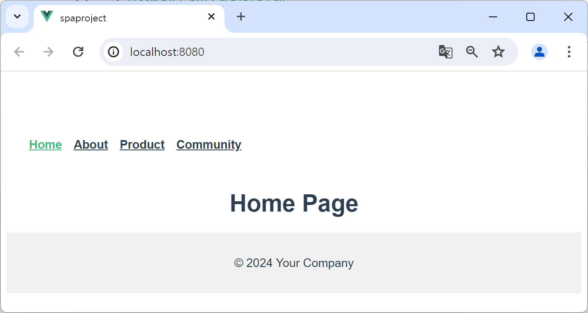

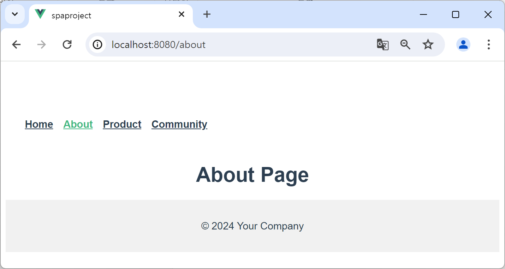

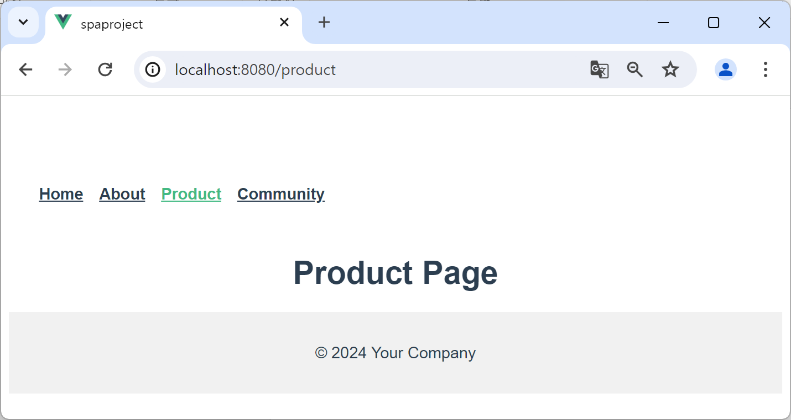

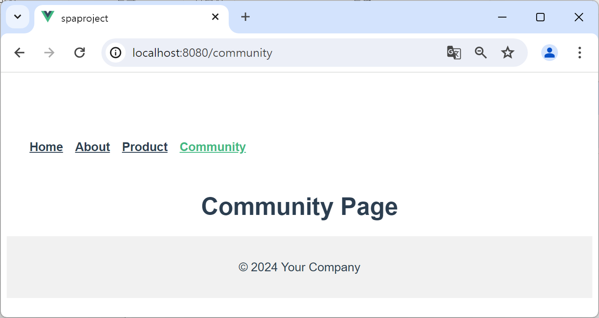

<br><br>

### 5-1-4. 여러 페이지 애플리케이션의 라우팅

#### 5-1-4-1. 흐름과 개념:

1. 여러 페이지 애플리케이션은 SPA와 비슷하지만, 애플리케이션의 각 페이지에 대해 별도의 HTML 파일이 있습니다. 
2. 각 페이지는 SPA처럼 동작하지만, 서버에서 각 페이지에 대한 HTML을 반환합니다.

<br>

#### 5-1-4-2. 장/단점

**장점** 

검색 엔진 최적화가 가능합니다. 각 페이지의 URL에 대한 별도의 메타데이터가 있으므로 검색 엔진이 내용을 쉽게 색인화할 수 있습니다. 또한, 초기 로딩 시간이 단일 페이지 애플리케이션에 비해 빠를 수 있습니다.

<br>

**단점** 

페이지 간의 전환 시 새로 고침이 발생하므로 사용자 경험이 덜 부드러울 수 있습니다.

<br><br>

#### 5-1-4-3. 애플리케이션 작성 실습

**MPA 프로젝트 생성**

```shell
D:\gitRepository\vuejs\study05>vue create mpaproject

Vue CLI v5.0.8
? Please pick a preset: Manually select features
? Check the features needed for your project: (Press <space> to select, <a> to toggle all, <i> to invert selection, and
<enter> to proceed)
 (*) Babel
 (*) TypeScript
 ( ) Progressive Web App (PWA) Support
 (*) Router
>(*) Vuex
 ( ) CSS Pre-processors
 ( ) Linter / Formatter
 ( ) Unit Testing
 ( ) E2E Testing
```

<br>

**프로젝트 구조도**

```lua
mpaproject/
├── node_modules/
├── public/
│   ├── index.html
│   ├── about.html
│   ├── community.html
│   ├── product.html
│   └── favicon.ico
├── src/
│   ├── assets/
│   ├── components/
│   │   ├── Footer.vue
│   │   └── Header.vue
│   ├── model/
│   │   └── index.ts
│   ├── store/
│   │   ├── actions.ts
│   │   ├── index.ts
│   │   ├── mutations.ts
│   │   └── state.ts
│   ├── pages/
│   │   ├── about.ts
│   │   ├── community.ts
│   │   ├── home.ts
│   │   └── product.ts
│   ├── views/
│   │   ├── AboutView.vue
│   │   ├── CommunityView.vue
│   │   ├── HomeView.vue
│   │   └── ProductView.vue
│   ├── main.ts
│   └── shims-vue.d.ts
├── babel.config.js
├── package-lock.json
├── package.json
├── tsconfig.json
└── vue.config.js
```

<br>

**각 파일 및 폴더의 설명**

public/: 각 페이지의 HTML 파일을 포함.
  index.html: 홈 페이지 HTML 파일.
  about.html: 어바웃 페이지 HTML 파일.
  community.html: 커뮤니티 페이지 HTML 파일.
  product.html: 제품 페이지 HTML 파일.
  favicon.ico: 웹사이트의 파비콘.
src/: 소스 코드가 위치하는 디렉토리.
assets/: 이미지, 폰트, 스타일 등 정적 자산.
components/: 재사용 가능한 Vue 컴포넌트.
model/: TypeScript 인터페이스 및 모델 정의.
store/: Vuex 상태 관리 파일.
pages/: 각 페이지의 진입점 파일.
  about.ts: 어바웃 페이지 진입점.
  community.ts: 커뮤니티 페이지 진입점.
  home.ts: 홈 페이지 진입점.
  product.ts: 제품 페이지 진입점.
views/: 페이지 컴포넌트.
main.ts: 공통 로직이 있는 메인 파일.
shims-vue.d.ts: TypeScript가 .vue 파일을 인식할 수 있도록 도와주는 파일.
babel.config.js: Babel 설정 파일.
package-lock.json: 설치된 정확한 의존성 트리를 보장하는 파일.
package.json: 프로젝트 메타데이터 및 의존성 관리 파일.
tsconfig.json: TypeScript 설정 파일.
vue.config.js: Vue CLI 프로젝트 설정 파일.

<br>

**01. package.json**

```json
{
  "name": "mpaproject",
  "version": "0.1.0",
  "private": true,
  "scripts": {
    "serve": "vue-cli-service serve",
    "build": "vue-cli-service build"
  },
  "dependencies": {
    "core-js": "^3.8.3",
    "vue": "^3.2.13",
    "vue-router": "^4.0.3",
    "vuex": "^4.0.0"
  },
  "devDependencies": {
    "@vue/cli-plugin-babel": "~5.0.0",
    "@vue/cli-plugin-router": "~5.0.0",
    "@vue/cli-plugin-typescript": "~5.0.0",
    "@vue/cli-plugin-vuex": "~5.0.0",
    "@vue/cli-service": "~5.0.0",
    "typescript": "~4.5.5"
  },
  "browserslist": [
    "> 1%",
    "last 2 versions",
    "not dead",
    "not ie 11"
  ]
}
```

<br>

**02. babel.config.js**

```javascript
module.exports = {
  presets: [
    '@vue/cli-plugin-babel/preset'
  ]
}
```

<br>

**03. tsconfig.json**

```json
{
  "compilerOptions": {
    "target": "esnext",
    "module": "esnext",
    "strict": true,
    "jsx": "preserve",
    "importHelpers": true,
    "moduleResolution": "node",
    "skipLibCheck": true,
    "esModuleInterop": true,
    "allowSyntheticDefaultImports": true,
    "experimentalDecorators": true,
    "sourceMap": true,
    "baseUrl": ".",
    "paths": {
      "@/*": [
        "src/*"
      ]
    },
    "lib": [
      "esnext",
      "dom"
    ]
  },
  "include": [
    "src/**/*.ts",
    "src/**/*.d.ts",
    "src/**/*.tsx",
    "src/**/*.vue"
  ],
  "exclude": [
    "node_modules"
  ]
}
```

<br>

**04. vue.config.js**

```javascript
module.exports = {
  pages: {
    index: {
      entry: 'src/pages/home.ts',
      template: 'public/index.html',
      filename: 'index.html',
      title: 'Home'
    },
    about: {
      entry: 'src/pages/about.ts',
      template: 'public/about.html',
      filename: 'about.html',
      title: 'About'
    },
    community: {
      entry: 'src/pages/community.ts',
      template: 'public/community.html',
      filename: 'community.html',
      title: 'Community'
    },
    product: {
      entry: 'src/pages/product.ts',
      template: 'public/product.html',
      filename: 'product.html',
      title: 'Product'
    }
  },
  configureWebpack: {
    devtool: 'source-map'
  }
}
```

<br>

**05. public/index.html**

```html
<!DOCTYPE html>
<html lang="en">
<head>
  <meta charset="UTF-8">
  <meta name="viewport" content="width=device-width, initial-scale=1.0">
  <title>Home</title>
</head>
<body>
  <div id="app"></div>
  <script src="/js/home.js"></script>
</body>
</html>
```

<br>

**06. public/about.html**

```html
<!DOCTYPE html>
<html lang="en">
<head>
  <meta charset="UTF-8">
  <meta name="viewport" content="width=device-width, initial-scale=1.0">
  <title>About</title>
</head>
<body>
  <div id="app"></div>
  <script src="/js/about.js"></script>
</body>
</html>
```

<br>

**07. public/community.html**

```html
<!DOCTYPE html>
<html lang="en">
<head>
  <meta charset="UTF-8">
  <meta name="viewport" content="width=device-width, initial-scale=1.0">
  <title>Community</title>
</head>
<body>
  <div id="app"></div>
  <script src="/js/community.js"></script>
</body>
</html>
```

<br>

**08. public/product.html**

```html
<!DOCTYPE html>
<html lang="en">
<head>
  <meta charset="UTF-8">
  <meta name="viewport" content="width=device-width, initial-scale=1.0">
  <title>Product</title>
</head>
<body>
  <div id="app"></div>
  <script src="/js/product.js"></script>
</body>
</html>
```

<br>

**09. src/main.ts**

```typescript
import { createApp } from 'vue'
import store from './store'
import Header from './components/Header.vue'
import Footer from './components/Footer.vue'

export function initApp(component: any) {
  const app = createApp(component)
  app.component('Header', Header)
  app.component('Footer', Footer)
  app.use(store)
  app.mount('#app')
}
```

<br>

**10. src/pages/home.ts**

```typescript
import { initApp } from '../main'
import HomeView from '../views/HomeView.vue'

initApp(HomeView)
```

<br>

**11. src/pages/about.ts**

```typescript
import { initApp } from '../main'
import AboutView from '../views/AboutView.vue'

initApp(AboutView)
```

<br>

**12. src/pages/community.ts**

```typescript
import { initApp } from '../main'
import CommunityView from '../views/CommunityView.vue'

initApp(CommunityView)
```

<br>

**13. src/pages/product.ts**

```typescript
import { initApp } from '../main'
import ProductView from '../views/ProductView.vue'

initApp(ProductView)
```

<br>

**14. src/views/HomeView.vue**

```vue
<template>
  <div>
    <Header />
    <h1>Home</h1>
    <Footer />
  </div>
</template>

<script lang="ts">
import { defineComponent } from 'vue'

export default defineComponent({
  name: 'HomeView'
})
</script>

<style scoped>
/* Add your styles here */
</style>
```

<br>

**15. src/views/AboutView.vue**

```vue
<template>
  <div>
    <Header />
    <h1>About</h1>
    <Footer />
  </div>
</template>

<script lang="ts">
import { defineComponent } from 'vue'

export default defineComponent({
  name: 'AboutView'
})
</script>

<style scoped>
/* Add your styles here */
</style>
```

<br>

**16. src/views/CommunityView.vue**

```vue
<template>
  <div>
    <Header />
    <h1>Community</h1>
    <Footer />
  </div>
</template>

<script lang="ts">
import { defineComponent } from 'vue'

export default defineComponent({
  name: 'CommunityView'
})
</script>

<style scoped>
/* Add your styles here */
</style>
```

<br>

**17. src/views/ProductView.vue**

```vue
<template>
  <div>
    <Header />
    <h1>Product</h1>
    <Footer />
  </div>
</template>

<script lang="ts">
import { defineComponent } from 'vue'

export default defineComponent({
  name: 'ProductView'
})
</script>

<style scoped>
/* Add your styles here */
</style>
```

<br>

**18. src/store/state.ts**

```typescript
import { Product } from '@/model'

export interface State {
  products: Product[]
}

export default {
  products: []
} as State
```

<br>

**19. src/store/mutations.ts**

```typescript
import { State } from './state'
import { Product } from '@/model'

export default {
  setProducts(state: State, products: Product[]) {
    state.products = products
  }
}
```

<br>

**20. src/store/actions.ts**

```typescript
import { ActionContext } from 'vuex'
import { State } from './state'
import { Product } from '@/model'

export default {
  fetchProducts({ commit }: ActionContext<State, State>) {
    const products: Product[] = [
      { id: 1, name: 'Product A', price: 100 },
      { id: 2, name: 'Product B', price: 200 }
    ]
    commit('setProducts', products)
  }
}
```

<br>

**21. src/store/index.ts**

```typescript
import { createStore } from 'vuex'
import state from './state'
import mutations from './mutations'
import actions from './actions'

export default createStore({
  state,
  mutations,
  actions
})
```

<br>

**22. src/model/index.ts**

```typescript
export interface Product {
  id: number;
  name: string;
  price: number;
}
```

<br>

**23. src/components/Header.vue**

```vue
<template>
  <header>
    <nav>
      <ul>
        <li><a href="/">Home</a></li>
        <li><a href="/about.html">About</a></li>
        <li><a href="/community.html">Community</a></li>
        <li><a href="/product.html">Product</a></li>
      </ul>
    </nav>
  </header>
</template>

<script lang="ts">
import { defineComponent } from 'vue'

export default defineComponent({
  name: 'Header'
})
</script>

<style scoped>
nav ul {
  list-style: none;
  display: flex;
}
nav ul li {
  margin-right: 1rem;
}
</style>
```

<br>

**24. src/components/Footer.vue**

```vue
<template>
  <footer>
    <p>&copy; 2024 My Company</p>
  </footer>
</template>

<script lang="ts">
import { defineComponent } from 'vue'

export default defineComponent({
  name: 'Footer'
})
</script>

<style scoped>
footer {
  text-align: center;
  margin-top: 2rem;
}
</style>
```

<br>

**25. src/shims-vue.d.ts**

```typescript
declare module '*.vue' {
  import { DefineComponent } from 'vue'
  const component: DefineComponent<{}, {}, any>
  export default component
}
```

- 각 페이지별로 별도의 HTML 파일을 가지고 있으며, 서버 측에서 라우팅을 처리할 수 있습니다.

<br>

**애플리케이션 실행**

```shell
D:\gitRepository\vuejs\study05\mpaproject>npm run serve

> mpaproject@0.1.0 serve
> vue-cli-service serve

 INFO  Starting development server...

 DONE  Compiled successfully in 1884ms                                                                      오후 4:46:49

  App running at:
  - Local:   http://localhost:8080/
  - Network: http://192.168.0.9:8080/

  Note that the development build is not optimized.
  To create a production build, run npm run build.

Issues checking in progress...
No issues found.
```

<br>


**프로젝트 브라우저에서 열기**

1. 브라우저의 주소 입력줄에 `http://localhost:8080/` 을 입력한다.
2. 나타난 화면에서 Home / About / Product / Community 를 각 각 클릭해본다.

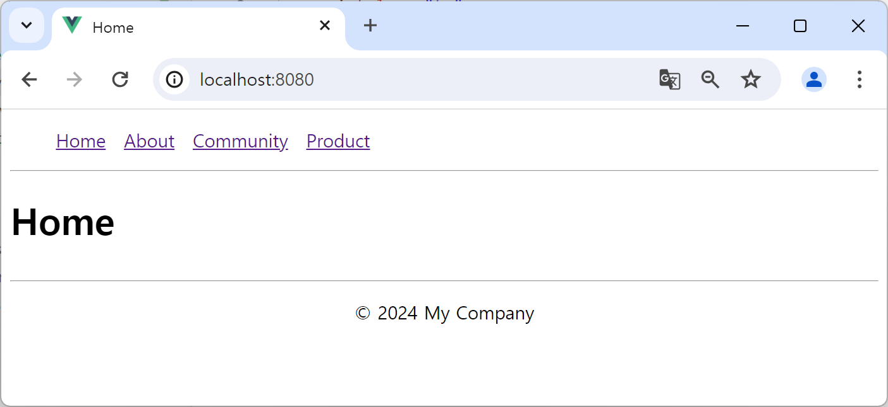

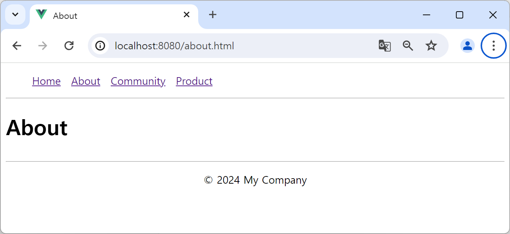

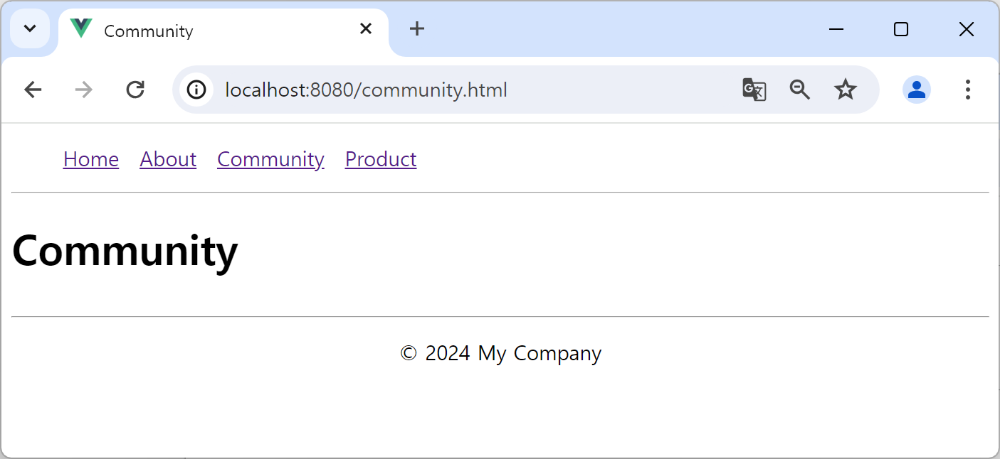

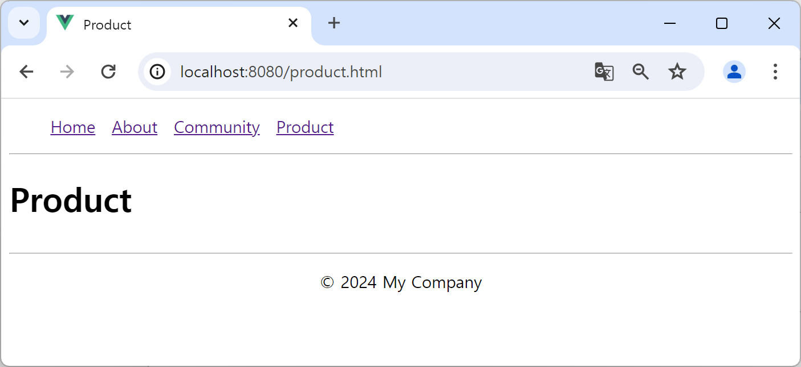

<br><br>

## 5-2. Vue Router의 기본 사용

### 5-2-1. Router의 사용 프로세스

1. 라우터 생성: Vue Router를 사용하기 위해 먼저 라우터를 생성해야 합니다. createRouter 함수를 사용하여 라우터를 생성합니다.
2. 라우트 정의: 라우트는 경로와 해당 경로에 대한 컴포넌트를 매핑합니다. 라우트는 routes 배열에 정의되며, 각 라우트는 path와 component 속성을 포함합니다.
3. 라우터 사용: 라우터를 애플리케이션에 적용하여 현재 경로에 대한 컴포넌트를 렌더링하고, 경로 간에 이동할 수 있습니다.

- Vue Router를 사용하면 Vue.js 애플리케이션에서 페이지 네비게이션을 관리할 수 있습니다. 라우터를 생성하고 라우트를 정의하여 각 경로에 해당하는 컴포넌트를 매핑합니다. 그런 다음 라우터를 애플리케이션에 적용하여 현재 경로에 대한 컴포넌트를 동적으로 렌더링하고, 사용자가 경로 간에 이동할 수 있습니다.

<br>

**예시 코드**

```typescript
// main.ts
import { createApp } from 'vue';
import { createRouter, createWebHistory } from 'vue-router';
import App from './App.vue';
import Home from './views/Home.vue';
import About from './views/About.vue';
import Product from './views/Product.vue';
import Community from './views/Community.vue';

const routes = [
  { path: '/', component: Home },
  { path: '/about', component: About },
  { path: '/product', component: Product },
  { path: '/community', component: Community }
];

const router = createRouter({
  history: createWebHistory(),
  routes
});

const app = createApp(App);
app.use(router);
app.mount('#app');
```

```html
<!-- App.vue -->
<template>
  <div id="app">
    <router-link to="/">Home</router-link>
    <router-link to="/about">About</router-link>
    <router-link to="/product">Product</router-link>
    <router-link to="/community">Community</router-link>
    <router-view></router-view>
  </div>
</template>

<script>
export default {
  name: 'App'
};
</script>
```

- Vue Router를 사용하여 간단한 라우팅을 구현한 예시이며, createRouter 함수를 사용하여 라우터를 생성하고, createWebHistory 함수를 사용하여 HTML5 히스토리 모드를 설정합니다. 
- 다음은 라우트를 정의하고 라우터를 애플리케이션에 적용합니다. 컴포넌트 내에서 `<router-link>` 컴포넌트를 사용하여 다른 경로로 이동하고, `<router-view>` 컴포넌트를 사용하여 현재 경로에 해당하는 컴포넌트를 동적으로 렌더링합니다.

<br><br>

## 5-3. Vue Router의 속성과 메소드

**라우터 속성**

| 이름            | 기본 문법                                | 설명                                           | 예시 코드                                                     |
|----------------|-----------------------------------------|------------------------------------------------|---------------------------------------------------------------|
| history        | `createWebHistory()` 또는 `createWebHashHistory()` | HTML5 히스토리 API 또는 해시 모드를 사용하여 라우터 히스토리를 관리합니다. | ```typescript createRouter({ history: createWebHistory(), routes })``` |
| currentRoute   | `$route`                                | 현재 활성화된 라우트에 대한 정보를 제공합니다.        | ```typescript const currentRoute = useRoute()```              |

<br>

**라우터 메소드**

코드 복사
| 이름            | 기본 문법                                | 설명                                           | 예시 코드                                                     |
|----------------|-----------------------------------------|------------------------------------------------|---------------------------------------------------------------|
| push           | `$router.push(location: RawLocation)`   | 주어진 경로로 이동하고 히스토리 스택에 새 항목을 추가합니다. | ```typescript router.push('/about')```                         |
| replace        | `$router.replace(location: RawLocation)`| 현재 경로를 주어진 경로로 교체하고 히스토리 스택을 수정하지 않습니다. | ```typescript router.replace('/about')```                      |
| go             | `$router.go(n: number)`                  | 히스토리 스택에서 n번째 이동합니다.               | ```typescript router.go(-1)```                                |
| back           | `$router.back()`                        | 뒤로 이동합니다.                               | ```typescript router.back()```                                |
| forward        | `$router.forward()`                     | 앞으로 이동합니다.                              | ```typescript router.forward()```                             |
| beforeEach     | `router.beforeEach(guard: NavigationGuard)` | 라우트 이동 전에 실행할 전역 가드를 등록합니다.         | ```typescript router.beforeEach((to, from) => { /* logic */ })``` |
| afterEach      | `router.afterEach(hook: (to: Route, from: Route) => void)` | 라우트 이동 후에 실행할 후킹 함수를 등록합니다.        | ```typescript router.afterEach((to, from) => { /* logic */ })``` |

<br>

### 5-3-1. Vue Router 를 활용한 애플리케이션 제작 실습

**프로젝트 생성**

```shell
D:\gitRepository\vuejs\study05>vue create vuerouterproject

Vue CLI v5.0.8
? Please pick a preset: Manually select features
? Check the features needed for your project: Babel, TS, Router, Vuex
? Choose a version of Vue.js that you want to start the project with 3.x
? Use class-style component syntax? No
? Use Babel alongside TypeScript (required for modern mode, auto-detected polyfills, transpiling JSX)? Yes
? Use history mode for router? (Requires proper server setup for index fallback in production) Yes
? Where do you prefer placing config for Babel, ESLint, etc.? In package.json
? Save this as a preset for future projects? No
```

<br>

**프로젝트 구조**

```lua
vuerouterproject/
├── node_modules/
├── public/
│   ├── index.html
│   └── favicon.ico
├── src/
│   ├── assets/
│   ├── components/
│   │   ├── Footer.vue
│   │   └── Header.vue
│   ├── model/
│   │   └── index.ts
│   ├── store/
│   │   ├── actions.ts
│   │   ├── index.ts
│   │   ├── mutations.ts
│   │   └── state.ts
│   ├── views/
│   │   ├── About.vue
│   │   ├── Community.vue
│   │   ├── Home.vue
│   │   └── Product.vue
│   ├── App.vue
│   ├── main.ts
│   └── shims-vue.d.ts
├── babel.config.js
├── package-lock.json
├── package.json
├── tsconfig.json
└── vue.config.js
```

<br>

**01. package.json**

```json
{
  "name": "vuerouterproject",
  "version": "0.1.0",
  "private": true,
  "scripts": {
    "serve": "vue-cli-service serve",
    "build": "vue-cli-service build"
  },
  "dependencies": {
    "core-js": "^3.8.3",
    "vue": "^3.2.13",
    "vue-router": "^4.0.3",
    "vuex": "^4.0.0"
  },
  "devDependencies": {
    "@vue/cli-plugin-babel": "~5.0.0",
    "@vue/cli-plugin-router": "~5.0.0",
    "@vue/cli-plugin-typescript": "~5.0.0",
    "@vue/cli-plugin-vuex": "~5.0.0",
    "@vue/cli-service": "~5.0.0",
    "typescript": "~4.5.5"
  },
  "browserslist": [
    "> 1%",
    "last 2 versions",
    "not dead",
    "not ie 11"
  ]
}
```

<br>

**02. babel.config.js**

```javascript
module.exports = {
  presets: [
    '@vue/cli-plugin-babel/preset'
  ]
};
```

<br>

**03. tsconfig.json**

```json
{
  "compilerOptions": {
    "target": "esnext",
    "module": "esnext",
    "strict": true,
    "jsx": "preserve",
    "importHelpers": true,
    "moduleResolution": "node",
    "skipLibCheck": true,
    "esModuleInterop": true,
    "allowSyntheticDefaultImports": true,
    "experimentalDecorators": true,
    "sourceMap": true,
    "baseUrl": ".",
    "paths": {
      "@/*": [
        "src/*"
      ]
    },
    "lib": [
      "esnext",
      "dom"
    ]
  },
  "include": [
    "src/**/*.ts",
    "src/**/*.d.ts",
    "src/**/*.tsx",
    "src/**/*.vue"
  ],
  "exclude": [
    "node_modules"
  ]
}
```

<br>

**04. vue.config.js**

```javascript
module.exports = {
  configureWebpack: {
    devtool: 'source-map'
  }
};
```

<br>

**05. public/index.html**

```html
<!DOCTYPE html>
<html lang="en">
<head>
  <meta charset="UTF-8">
  <meta name="viewport" content="width=device-width, initial-scale=1.0">
  <title>Vue Router Project</title>
</head>
<body>
  <div id="app"></div>
</body>
</html>
```

<br>

**06. src/main.ts**

```typescript
import { createApp } from 'vue';
import { createRouter, createWebHistory } from 'vue-router';
import App from './App.vue';
import Home from './views/Home.vue';
import About from './views/About.vue';
import Product from './views/Product.vue';
import Community from './views/Community.vue';

const routes = [
  { path: '/', component: Home },
  { path: '/about', component: About },
  { path: '/product', component: Product },
  { path: '/community', component: Community }
];

const router = createRouter({
  history: createWebHistory(),
  routes
});

const app = createApp(App);
app.use(router);
app.mount('#app');
```

<br>

**07. src/App.vue**

```vue
<template>
  <div id="app">
    <header>
      <router-link to="/">Home</router-link>
      <router-link to="/about">About</router-link>
      <router-link to="/product">Product</router-link>
      <router-link to="/community">Community</router-link>
    </header>
    <router-view></router-view>
  </div>
</template>

<script lang="ts">
import { defineComponent } from 'vue';

export default defineComponent({
  name: 'App'
});
</script>

<style scoped>
header {
  display: flex;
  justify-content: space-around;
  background-color: #f8f9fa;
  padding: 1rem;
}
header a {
  text-decoration: none;
  color: #42b983;
}
</style>
```

<br>

**08. src/views/Home.vue**

```vue
<template>
  <div>
    <h1>Home</h1>
    <Footer />
  </div>
</template>

<script lang="ts">
import { defineComponent } from 'vue';
import Header from '../components/Header.vue';
import Footer from '../components/Footer.vue';

export default defineComponent({
  name: 'Home',
  components: {
    Header,
    Footer
  }
});
</script>

<style scoped>
/* Add your styles here */
</style>
```

<br>

**09. src/views/About.vue**

```vue
<template>
  <div>
    <h1>About</h1>
    <Footer />
  </div>
</template>

<script lang="ts">
import { defineComponent } from 'vue';
import Header from '../components/Header.vue';
import Footer from '../components/Footer.vue';

export default defineComponent({
  name: 'About',
  components: {
    Header,
    Footer
  }
});
</script>

<style scoped>
/* Add your styles here */
</style>
```

<br>

**10. src/views/Product.vue**

```vue
<template>
  <div>
    <h1>Product</h1>
    <Footer />
  </div>
</template>

<script lang="ts">
import { defineComponent } from 'vue';
import Header from '../components/Header.vue';
import Footer from '../components/Footer.vue';

export default defineComponent({
  name: 'Product',
  components: {
    Header,
    Footer
  }
});
</script>

<style scoped>
/* Add your styles here */
</style>
```

<br>

**11. src/views/Community.vue**

```vue
<template>
  <div>
    <h1>Community</h1>
    <Footer />
  </div>
</template>

<script lang="ts">
import { defineComponent } from 'vue';
import Header from '../components/Header.vue';
import Footer from '../components/Footer.vue';

export default defineComponent({
  name: 'Community',
  components: {
    Header,
    Footer
  }
});
</script>

<style scoped>
/* Add your styles here */
</style>
```

<br>

**12. src/components/Header.vue**

```vue
<template>
  <header>
    <nav>
      <ul>
        <li><router-link to="/">Home</router-link></li>
        <li><router-link to="/about">About</router-link></li>
        <li><router-link to="/product">Product</router-link></li>
        <li><router-link to="/community">Community</router-link></li>
      </ul>
    </nav>
  </header>
</template>

<script lang="ts">
import { defineComponent } from 'vue';

export default defineComponent({
  name: 'Header'
});
</script>

<style scoped>
nav ul {
  list-style: none;
  display: flex;
  justify-content: space-around;
  padding: 0;
}
nav ul li {
  margin-right: 1rem;
}
nav ul li a {
  text-decoration: none;
  color: #42b983;
}
</style>
```

<br>

**13. src/components/Footer.vue**

```vue
<template>
  <footer>
    <p>&copy; 2024 My Company</p>
  </footer>
</template>

<script lang="ts">
import { defineComponent } from 'vue';

export default defineComponent({
  name: 'Footer'
});
</script>

<style scoped>
footer {
  text-align: center;
  margin-top: 2rem;
}
</style>
```

<br>

**14. src/store/state.ts**

```typescript
import { Product } from '@/model';

export interface State {
  products: Product[];
}

export default {
  products: []
} as State;
```

<br>

**15. src/store/mutations.ts**

```typescript
import { State } from './state';
import { Product } from '@/model';

export default {
  setProducts(state: State, products: Product[]) {
    state.products = products;
  }
};
```

<br>

**16. src/store/actions.ts**

```typescript
import { ActionContext } from 'vuex';
import { State } from './state';
import { Product } from '@/model';

export default {
  fetchProducts({ commit }: ActionContext<State, State>) {
    const products: Product[] = [
      { id: 1, name: 'Product A', price: 100 },
      { id: 2, name: 'Product B', price: 200 }
    ];
    commit('setProducts', products);
  }
};
```

<br>

**17. src/store/index.ts**

```typescript
import { createStore } from 'vuex';
import state from './state';
import mutations from './mutations';
import actions from './actions';

export default createStore({
  state,
  mutations,
  actions
});
```

<br>

**18. src/model/index.ts**

```typescript
export interface Product {
  id: number;
  name: string;
  price: number;
}
```

<br>

**19. src/shims-vue.d.ts**

```typescript
declare module '*.vue' {
  import { DefineComponent } from 'vue';
  const component: DefineComponent<{}, {}, any>;
  export default component;
}
```

<br>

**애플리케이션 실행**

```shell
D:\gitRepository\vuejs\study05\vuerouterproject>npm run serve

> mpaproject@0.1.0 serve
> vue-cli-service serve

 INFO  Starting development server...

 DONE  Compiled successfully in 1884ms                                                                      오후 4:46:49

  App running at:
  - Local:   http://localhost:8080/
  - Network: http://192.168.0.9:8080/

  Note that the development build is not optimized.
  To create a production build, run npm run build.

Issues checking in progress...
No issues found.
```

<br>


**프로젝트 브라우저에서 열기**

1. 브라우저의 주소 입력줄에 `http://localhost:8080/` 을 입력한다.
2. 나타난 화면에서 Home / About / Product / Community 를 각 각 클릭해본다.

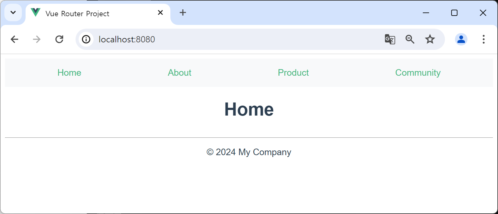

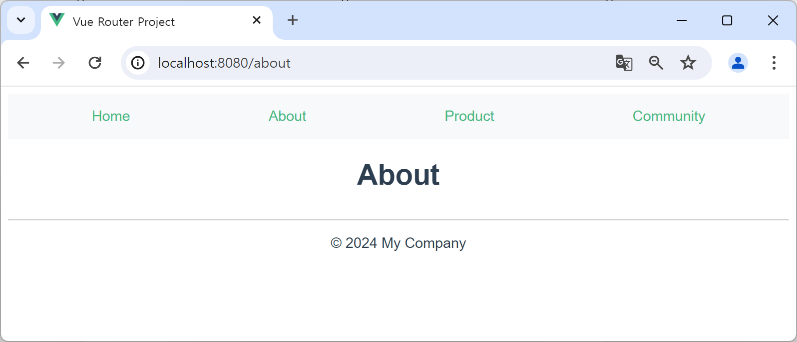

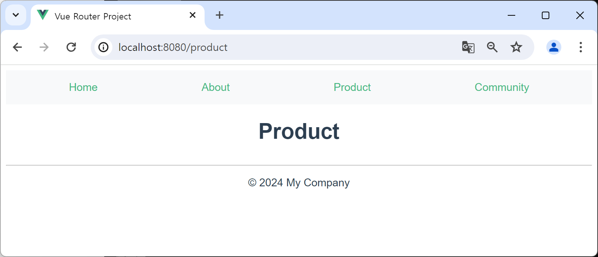

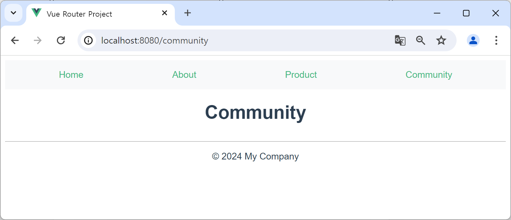

<br><br>

## 5-4. Dynamic Route Matching(동적 라우트 매칭)

- 동적 라우트 매칭은 라우터의 경로에 있는 특정 부분을 매개변수로 취급하여 URL을 동적으로 처리합니다. 예를 들어, 사용자의 ID에 따라 사용자 프로필 페이지를 동적으로 렌더링하는 경우가 있습니다. 이렇게 동적으로 변하는 매개변수를 효과적으로 처리하고 렌더링하기 위해 Vue Router에서는 동적 라우트 매칭을 지원합니다.

<br>

### 5-4-1. 동적 라우트 매칭 관련 메소드:

- Vue Router에서는 동적 라우트 매칭을 위해 $route 객체의 params 속성을 사용합니다. 이 속성은 현재 라우트에 매칭된 동적 세그먼트의 매개변수를 포함합니다.

**$route.params**	

현재 라우트에 매칭된 동적 세그먼트의 매개변수를 포함합니다.	

```typescript 
const userId = $route.params.userId
```

<br>

### 5-4-2. 동적 라우트 매칭 예시 코드

```javascript
// Vue Router 설정
import { createRouter, createWebHistory } from 'vue-router';
import UserProfile from './views/UserProfile.vue';

const routes = [
  { path: '/user/:userId', component: UserProfile }
];

const router = createRouter({
  history: createWebHistory(),
  routes
});

export default router;
```

```html
<!-- UserProfile.vue -->
<template>
  <div>
    <h2>User Profile</h2>
    <p>User ID: {{ $route.params.userId }}</p>
  </div>
</template>

<script>
export default {
  name: 'UserProfile'
};
</script>
```

위의 예시 코드에서는 `/user/:userId`와 같은 형태의 동적 경로를 정의하여 사용자 프로필 페이지를 렌더링합니다. 해당 경로에서 userId는 동적으로 변하는 매개변수를 나타냅니다. 이를 `$route.params.userId`를 통해 접근하여 현재 사용자의 ID를 가져올 수 있습니다.

<br><br>

### 5-4-3. 동작 라우트 매칭의 애플리케이션 제작 실습

**프로젝트 생성**

```shell
D:\gitRepository\vuejs\study05>vue create dynamicproject

Vue CLI v5.0.8
? Please pick a preset: Manually select features
? Check the features needed for your project: Babel, TS, Router, Vuex
? Choose a version of Vue.js that you want to start the project with 3.x
? Use class-style component syntax? No
? Use Babel alongside TypeScript (required for modern mode, auto-detected polyfills, transpiling JSX)? Yes
? Use history mode for router? (Requires proper server setup for index fallback in production) Yes
? Where do you prefer placing config for Babel, ESLint, etc.? In package.json
? Save this as a preset for future projects? No
```

<br>

**프로젝트 구조**

```lua
dynamicproject/
├── node_modules/
├── public/
│   └── index.html
├── src/
│   ├── assets/
│   ├── components/
│   │   ├── Header.vue
│   │   └── Footer.vue
│   ├── model/
│   │   └── index.ts
│   ├── router/
│   │   └── index.ts
│   ├── store/
│   │   ├── actions.ts
│   │   ├── mutations.ts
│   │   └── index.ts
│   ├── views/
│   │   ├── AboutView.vue
│   │   ├── CommunityView.vue
│   │   ├── HomeView.vue
│   │   ├── ProductView.vue
│   │   └── NotFound.vue
│   ├── App.vue
│   ├── main.ts
│   ├── shims-vue.d.ts
│   ├── types/
│   │   └── index.d.ts
├── babel.config.js
├── package.json
├── tsconfig.json
└── vue.config.js
```

<br>

**01. package.json**

```json
{
  "name": "dynamicproject",
  "version": "0.1.0",
  "private": true,
  "scripts": {
    "serve": "vue-cli-service serve",
    "build": "vue-cli-service build"
  },
  "dependencies": {
    "core-js": "^3.8.3",
    "vue": "^3.2.13",
    "vue-router": "^4.0.3",
    "vuex": "^4.0.0"
  },
  "devDependencies": {
    "@vue/cli-plugin-babel": "~5.0.0",
    "@vue/cli-plugin-router": "~5.0.0",
    "@vue/cli-plugin-typescript": "~5.0.0",
    "@vue/cli-plugin-vuex": "~5.0.0",
    "@vue/cli-service": "~5.0.0",
    "typescript": "~4.5.5"
  },
  "browserslist": [
    "> 1%",
    "last 2 versions",
    "not dead",
    "not ie 11"
  ]
}
```

<br>

**02. babel.config.js**

```javascript
// babel.config.js
module.exports = {
  presets: [
    '@vue/cli-plugin-babel/preset'
  ]
};
```

<br>

**03. tsconfig.json**

```json
// tsconfig.json
{
  "compilerOptions": {
    "target": "esnext",
    "module": "esnext",
    "strict": true,
    "jsx": "preserve",
    "moduleResolution": "node",
    "resolveJsonModule": true,
    "esModuleInterop": true,
    "skipLibCheck": true,
    "forceConsistentCasingInFileNames": true,
    "noEmit": true,
    "baseUrl": ".",
    "paths": {
      "@/*": ["src/*"]
    }
  },
  "include": ["src/**/*.ts", "src/**/*.d.ts", "src/**/*.tsx", "src/**/*.vue"],
  "exclude": ["node_modules"]
}
```

<br>

**04. vue.config.js**

```javascript
module.exports = {
  configureWebpack: {
    devtool: 'source-map'
  }
};
```

<br>

**05. public/index.html**

```html
<!-- public/index.html -->
<!DOCTYPE html>
<html lang="en">
<head>
  <meta charset="utf-8">
  <meta name="viewport" content="width=device-width, initial-scale=1.0">
  <title>Dynamic Project</title>
</head>
<body>
  <div id="app"></div>
  <!-- built files will be auto injected -->
</body>
</html>
```

<br>

**06. src/App.vue**

```vue
<!-- src/App.vue -->
<template>
  <div id="app">
    <Header />
    <nav>
      <router-link to="/">Home</router-link>
      <router-link to="/about">About</router-link>
      <router-link to="/product/123">Product</router-link>
      <router-link to="/community/some-slug">Community</router-link>
    </nav>
    <router-view></router-view>
    <Footer />
  </div>
</template>

<script setup>
import Header from '@/components/Header.vue';
import Footer from '@/components/Footer.vue';
</script>

<style>
nav {
  display: flex;
  gap: 10px;
  margin-bottom: 20px;
}
</style>
```

<br>

**07. src/components/Header.vue**

```vue
<!-- src/components/Header.vue -->
<template>
  <header>
    <h1>Dynamic Project</h1>
  </header>
</template>

<script setup>
</script>

<style scoped>
header {
  background-color: #333;
  color: #fff;
  padding: 10px;
  text-align: center;
}
</style>
```

<br>

**08. src/components/Footer.vue**

```vue
<!-- src/components/Footer.vue -->
<template>
  <footer>
    <p>© 2024 My Company</p>
  </footer>
</template>

<script setup>
</script>

<style scoped>
footer {
  background-color: #333;
  color: #fff;
  padding: 10px;
  text-align: center;
}
</style>
```

<br>

**09. src/router/index.ts**

```typescript
// src/router/index.ts
import { createRouter, createWebHistory, RouteRecordRaw } from 'vue-router';
import HomeView from '@/views/HomeView.vue';
import AboutView from '@/views/AboutView.vue';
import ProductView from '@/views/ProductView.vue';
import CommunityView from '@/views/CommunityView.vue';
import NotFound from '@/views/NotFound.vue';

const routes: Array<RouteRecordRaw> = [
  { path: '/', name: 'Home', component: HomeView },
  { path: '/about', name: 'About', component: AboutView },
  { path: '/product/:id', name: 'Product', component: ProductView },
  { path: '/community/:slug', name: 'Community', component: CommunityView },
  { path: '/:catchAll(.*)', name: 'NotFound', component: NotFound }
];

const router = createRouter({
  history: createWebHistory(),
  routes
});

export default router;
```

<br>

**10. src/views/HomeView.vue**

```vue
<!-- src/views/HomeView.vue -->
<template>
  <div>
    <h1>Home</h1>
    <p>Welcome to the home page.</p>
  </div>
</template>

<script setup>
</script>

<style scoped>
h1 {
  color: #42b983;
}
</style>
```

<br>

**11. src/views/AboutView.vue**

```vue
<!-- src/views/AboutView.vue -->
<template>
  <div>
    <h1>About</h1>
    <p>This is the about page.</p>
  </div>
</template>

<script setup>
</script>

<style scoped>
h1 {
  color: #42b983;
}
</style>
```

<br>

**12. src/views/ProductView.vue**

```vue
<!-- src/views/ProductView.vue -->
<template>
  <div>
    <h1>Product</h1>
    <p>Product details for ID: {{ $route.params.id }}</p>
  </div>
</template>

<script setup>
</script>

<style scoped>
h1 {
  color: #42b983;
}
</style>
```

<br>

**13. src/views/CommunityView.vue**

```vue
<!-- src/views/CommunityView.vue -->
<template>
  <div>
    <h1>Community</h1>
    <p>Community details for slug: {{ $route.params.slug }}</p>
  </div>
</template>

<script setup>
</script>

<style scoped>
h1 {
  color: #42b983;
}
</style>
```

<br>

**14. src/views/NotFound.vue**

```vue
<!-- src/views/NotFound.vue -->
<template>
  <div>
    <h1>404 Not Found</h1>
    <p>Sorry, the page you are looking for does not exist.</p>
  </div>
</template>

<script setup>
</script>

<style scoped>
h1 {
  color: red;
}
</style>
```

<br>

**15. src/store/state.ts**

```typescript
import { Product } from '@/model';

export interface State {
  products: Product[];
}

export default {
  products: []
} as State;
```

<br>

**16. src/store/mutations.ts**

```typescript
import { State } from './state';
import { Product } from '@/model';

export default {
  setProducts(state: State, products: Product[]) {
    state.products = products;
  }
};
```

<br>

**17. src/store/actions.ts**

```typescript
import { ActionContext } from 'vuex';
import { State } from './state';
import { Product } from '@/model';

export default {
  fetchProducts({ commit }: ActionContext<State, State>) {
    const products: Product[] = [
      { id: 1, name: 'Product A', price: 100 },
      { id: 2, name: 'Product B', price: 200 }
    ];
    commit('setProducts', products);
  }
};
```

<br>

**18. src/store/index.ts**

```typescript
import { createStore } from 'vuex';
import state from './state';
import mutations from './mutations';
import actions from './actions';

export default createStore({
  state,
  mutations,
  actions
});
```

<br>

**19. src/model/index.ts**

```typescript
export interface Product {
  id: number;
  name: string;
  price: number;
}
```

<br>


**20. src/shims-vue.d.ts**

```typescript
declare module '*.vue' {
  import { DefineComponent } from 'vue';
  const component: DefineComponent<{}, {}, any>;
  export default component;
}
```

<br>

**애플리케이션 실행**

```shell
D:\gitRepository\vuejs\study05>cd dynamicproject

D:\gitRepository\vuejs\study05\dynamicproject>npm run serve

> dynamicproject@0.1.0 serve
> vue-cli-service serve

 INFO  Starting development server...

 DONE  Compiled successfully in 1838ms                                                                      오후 7:04:28

  App running at:
  - Local:   http://localhost:8080/
  - Network: http://192.168.0.9:8080/

  Note that the development build is not optimized.
  To create a production build, run npm run build.

Issues checking in progress...
No issues found.
```

<br>


**프로젝트 브라우저에서 열기**

1. 브라우저의 주소 입력줄에 `http://localhost:8080/` 을 입력한다.
2. 나타난 화면에서 Home / About / Product / Community 를 각 각 클릭해본다.


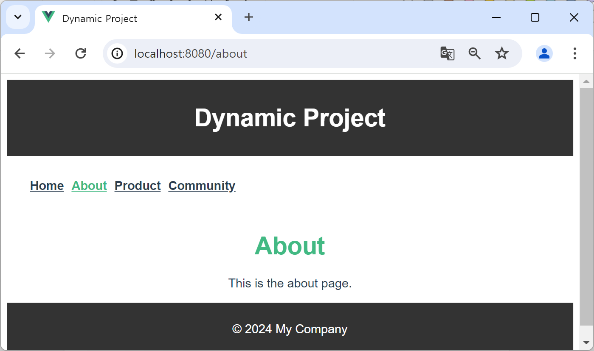

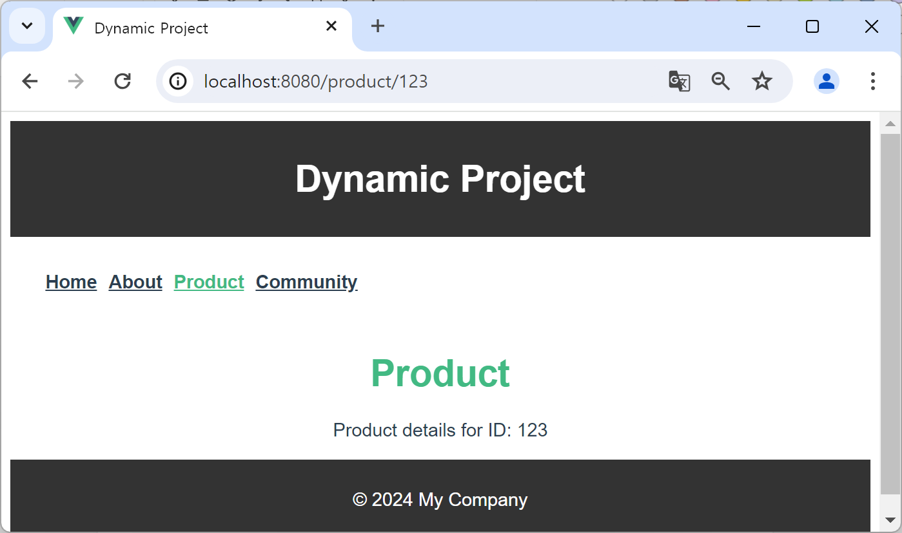

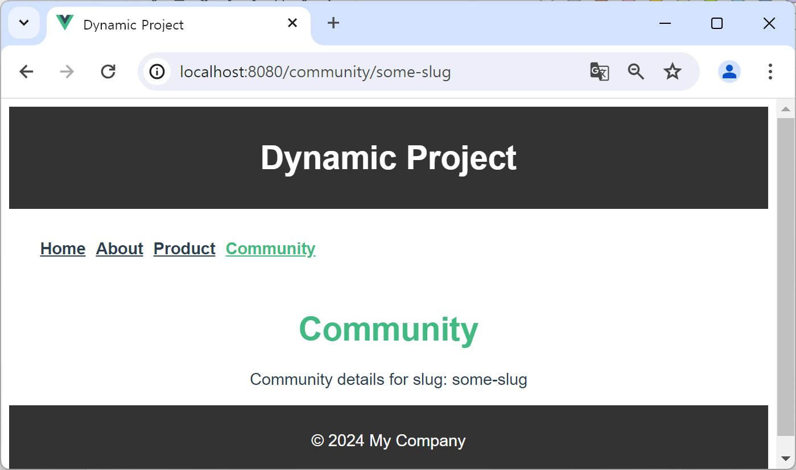

<br><br>


## 5-5. Nested Route(중첩 라우트)

- Nested Route(중첩 라우트)는 라우트가 중첩 구조를 가질 수 있도록 해줍니다. 
- Nested Route(중첩 라우트)를 통해 복잡한 애플리케이션에서 라우트 구성 요소를 계층 구조로 구성할 수 있으며, 부모-자식 관계의 라우트를 쉽게 정의할 수 있습니다.

<br>

### 5-5-1. 중첩 라우트의 개념

중첩 라우트는 URL 경로를 계층 구조로 정의하여 특정 URL 하위에 또 다른 URL을 정의하는 방식입니다. 이를 통해 부모 경로와 자식 경로가 명확하게 구분되며, 애플리케이션의 라우트 구조가 더 체계적으로 관리될 수 있습니다. 중첩 라우트를 사용하면 부모 컴포넌트 안에 자식 컴포넌트를 렌더링할 수 있습니다.

<br><br>

### 5-5-2. 중첩 라우트 매칭 관련 메소드

Vue Router에서는 중첩 라우트를 정의하기 위해 children 속성을 사용합니다. 이 속성은 자식 라우트를 정의하는 배열을 포함합니다. 자식 라우트는 부모 라우트의 경로를 기준으로 상대적으로 정의됩니다.

| 메소드 | 설명 | 예시 코드 |
|------------|----------------------------------------------------------|-------------------------------------------------------|
| children | 부모 라우트에 대한 자식 라우트를 정의하는 배열입니다. | ```javascript { path: '/parent', children: [{ path: 'child', component: ChildComponent }]``` } |
| router-view | 부모 컴포넌트에서 자식 컴포넌트를 렌더링하기 위해 사용됩니다. | ```html <router-view></router-view>``` |

<br><br>

### 5-5-3. 중첩 라우트 매칭 예시 코드

```javascript
// router/index.js
import { createRouter, createWebHistory } from 'vue-router';
import Home from '../views/Home.vue';
import Parent from '../views/Parent.vue';
import Child from '../views/Child.vue';

const routes = [
  { path: '/', component: Home },
  {
    path: '/parent',
    component: Parent,
    children: [
      {
        path: 'child',
        component: Child
      }
    ]
  }
];

const router = createRouter({
  history: createWebHistory(),
  routes
});

export default router;
```

1. path: '/parent' 경로를 정의하고 Parent 컴포넌트를 설정합니다.
2. children 속성을 사용하여 /parent/child 경로를 정의하고 Child 컴포넌트를 설정합니다.

<br>

```html
<!-- App.vue -->
<template>
  <div id="app">
    <router-link to="/">Home</router-link>
    <router-link to="/parent">Parent</router-link>
    <router-view></router-view>
  </div>
</template>

<script>
export default {
  name: 'App'
};
</script>
```

1. router-link를 사용하여 기본 홈 경로와 부모 경로로의 링크를 제공합니다.
2. router-view를 사용하여 현재 경로에 해당하는 컴포넌트를 렌더링합니다.

<br>

```html
<!-- Parent.vue -->
<template>
  <div>
    <h2>Parent Component</h2>
    <router-link to="child">Go to Child</router-link>
    <router-view></router-view>
  </div>
</template>

<script>
export default {
  name: 'Parent'
};
</script>
```

- 부모 컴포넌트로서, 자식 컴포넌트로의 링크를 제공하고 router-view를 사용하여 자식 컴포넌트를 렌더링합니다.

<br>

```html
<!-- Child.vue -->
<template>
  <div>
    <h3>Child Component</h3>
  </div>
</template>

<script>
export default {
  name: 'Child'
};
</script>
```

- 자식 컴포넌트로서, 부모 컴포넌트 내에서 렌더링됩니다.

<br>

- 중첩 라우트 매칭 방식으로 중첩 라우트를 정의하여 계층적인 라우팅 구조를 만들 수 있습니다. 
- router-view를 사용하여 부모 컴포넌트 내에서 자식 컴포넌트를 렌더링하며, 자식 라우트는 부모 라우트의 경로를 기준으로 상대적으로 정의됩니다.

<br><br>

### 5-5-4. 중첩 라우트 매칭 애플리케이션 제작

**프로젝트 생성**

```shell
D:\gitRepository\vuejs\study05>vue create nestedproject

Vue CLI v5.0.8
? Please pick a preset: Manually select features
? Check the features needed for your project: Babel, TS, Router, Vuex
? Choose a version of Vue.js that you want to start the project with 3.x
? Use class-style component syntax? No
? Use Babel alongside TypeScript (required for modern mode, auto-detected polyfills, transpiling JSX)? Yes
? Use history mode for router? (Requires proper server setup for index fallback in production) Yes
? Where do you prefer placing config for Babel, ESLint, etc.? In package.json
? Save this as a preset for future projects? No
```

<br>

**프로젝트 구조**

```lua
nestedproject/
├── node_modules/
├── public/
│   └── index.html
├── src/
│   ├── assets/
│   ├── components/
│   │   ├── Header.vue
│   │   └── Footer.vue
│   ├── model/
│   │   └── index.ts
│   ├── router/
│   │   └── index.ts
│   ├── store/
│   │   ├── actions.ts
│   │   ├── mutations.ts
│   │   ├── state.ts
│   │   └── index.ts
│   ├── views/
│   │   ├── About.vue
│   │   ├── Community.vue
│   │   ├── Home.vue
│   │   ├── Product.vue
│   │   └── ProductDetail.vue
│   ├── App.vue
│   ├── main.ts
│   ├── shims-vue.d.ts
│   └── types/
│       └── index.d.ts
├── babel.config.js
├── package.json
├── tsconfig.json
└── vue.config.js
```

<br>

**01. babel.config.js**

```javascript
// babel.config.js
module.exports = {
  presets: [
    '@vue/cli-plugin-babel/preset'
  ]
};
```

<br>

**02. tsconfig.json**

```json
// tsconfig.json
{
  "compilerOptions": {
    "target": "esnext",
    "module": "esnext",
    "strict": true,
    "jsx": "preserve",
    "moduleResolution": "node",
    "resolveJsonModule": true,
    "esModuleInterop": true,
    "skipLibCheck": true,
    "forceConsistentCasingInFileNames": true,
    "noEmit": true,
    "baseUrl": ".",
    "paths": {
      "@/*": ["src/*"]
    }
  },
  "include": ["src/**/*.ts", "src/**/*.d.ts", "src/**/*.tsx", "src/**/*.vue"],
  "exclude": ["node_modules"]
}
```

<br>

**03. vue.config.js**

```javascript
// vue.config.js
const { defineConfig } = require('@vue/cli-service')
module.exports = defineConfig({
  transpileDependencies: true
})
```

<br>

**04. public/index.html**

```html
<!DOCTYPE html>
<html lang="en">
<head>
  <meta charset="utf-8">
  <meta name="viewport" content="width=device-width, initial-scale=1.0">
  <title>Nested Project</title>
</head>
<body>
  <div id="app"></div>
  <!-- built files will be auto injected -->
</body>
</html>
```

<br>

**05. src/App.vue**

```vue
<template>
  <div id="app">
    <Header />
    <nav>
      <router-link to="/">Home</router-link>
      <router-link to="/about">About</router-link>
      <router-link to="/product">Product</router-link>
      <router-link to="/community">Community</router-link>
    </nav>
    <router-view></router-view>
    <Footer />
  </div>
</template>

<script setup>
import Header from '@/components/Header.vue';
import Footer from '@/components/Footer.vue';
</script>

<style>
nav {
  display: flex;
  gap: 10px;
  margin-bottom: 20px;
}
</style>
```

<br>

**06. src/main.ts**

```typescript
import { createApp } from 'vue';
import App from './App.vue';
import router from './router';
import store from './store';

const app = createApp(App);
app.use(router);
app.use(store);
app.mount('#app');
```

<br>

**07. src/router/index.ts**

```typescript
import { createRouter, createWebHistory, RouteRecordRaw } from 'vue-router';
import Home from '@/views/Home.vue';
import About from '@/views/About.vue';
import Product from '@/views/Product.vue';
import ProductDetail from '@/views/ProductDetail.vue';
import Community from '@/views/Community.vue';

const routes: Array<RouteRecordRaw> = [
  { path: '/', name: 'Home', component: Home },
  { path: '/about', name: 'About', component: About },
  {
    path: '/product',
    name: 'Product',
    component: Product,
    children: [
      { path: ':id', name: 'ProductDetail', component: ProductDetail }
    ]
  },
  { path: '/community', name: 'Community', component: Community }
];

const router = createRouter({
  history: createWebHistory(),
  routes
});

export default router;
```

<br>

**08. src/components/Header.vue**

```vue
<template>
  <header>
    <h1>Nested Project</h1>
  </header>
</template>

<script setup>
</script>

<style scoped>
header {
  background-color: #333;
  color: #fff;
  padding: 10px;
  text-align: center;
}
</style>
```

<br>

**09. src/components/Footer.vue**

```vue
<template>
  <footer>
    <p>© 2024 My Company</p>
  </footer>
</template>

<script setup>
</script>

<style scoped>
footer {
  background-color: #333;
  color: #fff;
  padding: 10px;
  text-align: center;
}
</style>
```

<br>

**10. src/views/Home.vue**

```vue
<template>
  <div>
    <h1>Home</h1>
    <p>Welcome to the home page.</p>
  </div>
</template>

<script setup>
</script>

<style scoped>
h1 {
  color: #42b983;
}
</style>
```

<br>

**11. src/views/About.vue**

```vue
<template>
  <div>
    <h1>About</h1>
    <p>This is the about page.</p>
  </div>
</template>

<script setup>
</script>

<style scoped>
h1 {
  color: #42b983;
}
</style>
```

<br>

**12. src/views/Product.vue**

```vue
<template>
  <div>
    <h1>Product</h1>
    <p>Select a product to view details:</p>
    <ul>
      <li><router-link :to="{ name: 'ProductDetail', params: { id: 1 } }">Product 1</router-link></li>
      <li><router-link :to="{ name: 'ProductDetail', params: { id: 2 } }">Product 2</router-link></li>
      <li><router-link :to="{ name: 'ProductDetail', params: { id: 3 } }">Product 3</router-link></li>
    </ul>
    <router-view></router-view>
  </div>
</template>

<script setup>
</script>

<style scoped>
h1 {
  color: #42b983;
}
</style>
```

<br>

**13. src/views/ProductDetail.vue**

```vue
<template>
  <div>
    <h2>Product Detail</h2>
    <p>Details for product with ID: {{ $route.params.id }}</p>
  </div>
</template>

<script setup>
</script>

<style scoped>
h2 {
  color: #42b983;
}
</style>
```

<br>

**14. src/views/Community.vue**

```vue
<template>
  <div>
    <h1>Community</h1>
    <p>Welcome to the community page.</p>
  </div>
</template>

<script setup>
</script>

<style scoped>
h1 {
  color: #42b983;
}
</style>
```

<br>

**15. src/store/index.ts**

```typescript
import { createStore } from 'vuex';
import state from './state';
import actions from './actions';
import mutations from './mutations';

export default createStore({
  state,
  actions,
  mutations
});
```

<br>

**16. src/store/state.ts**

```typescript
import { Product } from '@/model';

export interface State {
  products: Product[];
}

export default {
  products: []
} as State;
```

<br>

**17. src/store/mutations.ts**

```typescript
import { State } from './state';
import { Product } from '@/model';

export default {
  setProducts(state: State, products: Product[]) {
    state.products = products;
  }
};
```

<br>

**18. src/store/actions.ts**

```typescript
import { ActionContext } from 'vuex';
import { State } from './state';
import { Product } from '@/model';

export default {
  fetchProducts({ commit }: ActionContext<State, State>) {
    const products: Product[] = [
      { id: 1, name: 'Product A', price: 100 },
      { id: 2, name: 'Product B', price: 200 }
    ];
    commit('setProducts', products);
  }
};
```

<br>

**19. src/model/index.ts**

```typescript
export interface Product {
  id: number;
  name: string;
  price: number;
}
```

<br>


**20. src/shims-vue.d.ts**

```typescript
declare module '*.vue' {
  import type { DefineComponent } from 'vue';
  const component: DefineComponent<{}, {}, any>;
  export default component;
}
```

<br>

**애플리케이션 실행**

```shell
D:\gitRepository\vuejs\study05>cd nestedproject

D:\gitRepository\vuejs\study05\nestedproject>npm run serve

> dynamicproject@0.1.0 serve
> vue-cli-service serve

 INFO  Starting development server...

 DONE  Compiled successfully in 1838ms                                                                      오후 7:04:28

  App running at:
  - Local:   http://localhost:8080/
  - Network: http://192.168.0.9:8080/

  Note that the development build is not optimized.
  To create a production build, run npm run build.

Issues checking in progress...
No issues found.
```

<br>


**프로젝트 브라우저에서 열기**

1. 브라우저의 주소 입력줄에 `http://localhost:8080/` 을 입력한다.
2. 나타난 화면에서 Home / About / Product / Community 를 각 각 클릭해본다.
3. Product 페이지에서는 목록으로 나타난 제품목록에서 `Product 1` 을 클릭한다. 

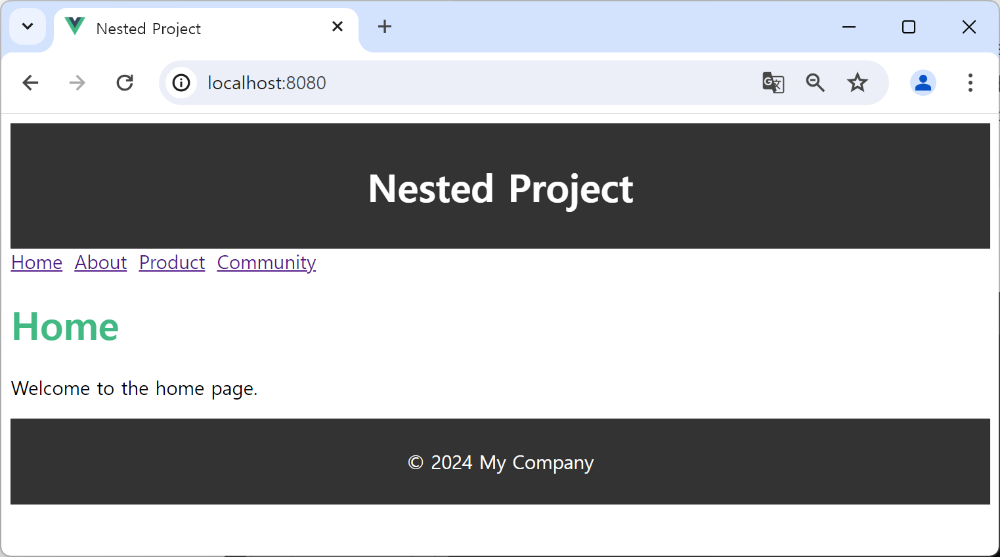

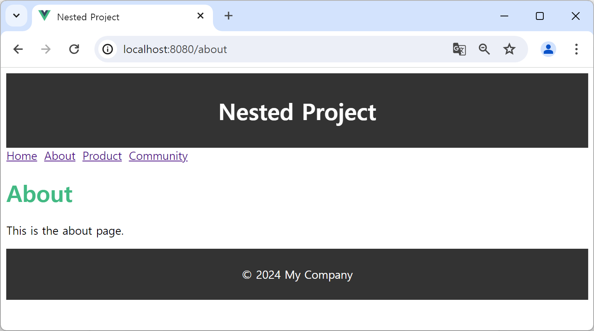

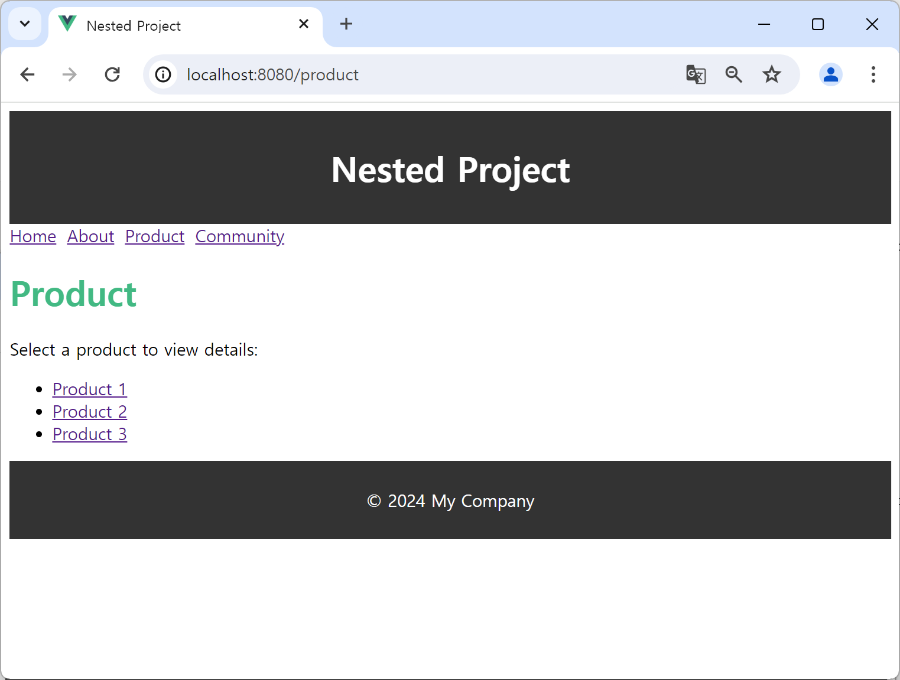

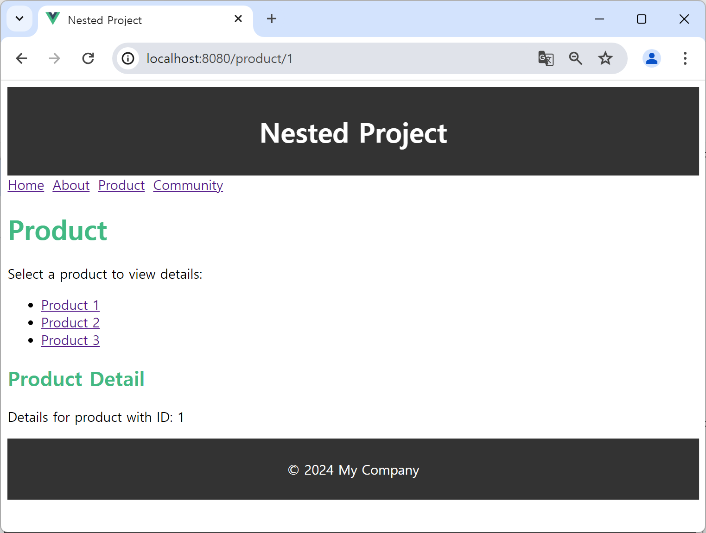

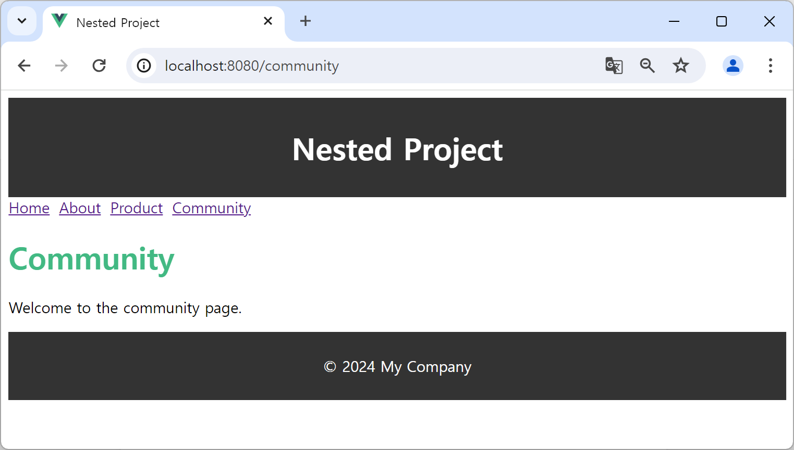

<br><br><br>

## 5-6. Navigation of Programming Method(프로그래밍 방식의 메뉴 구성)

- 프로그래밍 방식으로 라우터를 사용하여 애플리케이션 내의 메뉴를 구성할 수 있습니다. 이를 통해 사용자 인터페이스의 이벤트나 조건에 따라 라우팅을 동적으로 제어할 수 있습니다. Vue Router의 프로그래밍 방식 라우팅은 router.push와 router.replace와 같은 메소드를 사용하여 프로그래밍적으로 라우팅을 처리합니다.

<br>

### 5-6-1. 프로그래밍 방식의 메뉴 구성

프로그래밍 방식의 메뉴 구성은 사용자가 메뉴 항목을 클릭할 때, 조건이 변경될 때, 또는 특정 이벤트가 발생할 때 라우트를 변경하는 것을 의미합니다. 이를 통해 사용자 경험을 향상시키고, 사용자 인터페이스의 유연성을 높일 수 있습니다.

| 관련 메소드 | 설명 |
|---------------------------------------|--------------------------------------------------------------------------------|
| router.push(location: RawLocation) | 주어진 경로로 이동하고 히스토리 스택에 새 항목을 추가합니다. <br> 새로 추가된 경로로 브라우저를 이동시킵니다. |
| router.replace(location: RawLocation) | 현재 경로를 주어진 경로로 교체하고 히스토리 스택을 수정하지 않습니다. <br> 현재 페이지를 교체하는 방식으로 이동합니다. |
| router.go(n: number) | 히스토리 스택에서 n번째 위치로 이동합니다. <br> 양수일 경우 앞으로, 음수일 경우 뒤로 이동합니다. |
| router.back() | 히스토리 스택에서 한 단계 뒤로 이동합니다. |
| router.forward() | 히스토리 스택에서 한 단계 앞으로 이동합니다. |

<br>

### 5-6-2. router.push 사용 예시

```html
<template>
  <div>
    <button @click="goToHome">Go to Home</button>
    <button @click="goToAbout">Go to About</button>
  </div>
</template>

<script>
export default {
  methods: {
    goToHome() {
      this.$router.push('/');
    },
    goToAbout() {
      this.$router.push('/about');
    }
  }
};
</script>
```

<br>

### 5-6-3. router.replace 사용 예시

```html
<template>
  <div>
    <button @click="replaceToHome">Replace to Home</button>
  </div>
</template>

<script>
export default {
  methods: {
    replaceToHome() {
      this.$router.replace('/');
    }
  }
};
</script>
```

<br>

### 5-6-4. router.go 사용 예시

```html
<template>
  <div>
    <button @click="goBack">Go Back</button>
    <button @click="goForward">Go Forward</button>
  </div>
</template>

<script>
export default {
  methods: {
    goBack() {
      this.$router.go(-1);
    },
    goForward() {
      this.$router.go(1);
    }
  }
};
</script>
```

<br>

### 5-6-5. router.back 및 router.forward 사용 예시

```html
<template>
  <div>
    <button @click="navigateBack">Back</button>
    <button @click="navigateForward">Forward</button>
  </div>
</template>

<script>
export default {
  methods: {
    navigateBack() {
      this.$router.back();
    },
    navigateForward() {
      this.$router.forward();
    }
  }
};
</script>
```

<br>

### 5-6-6. 프로그래밍 방식의 메뉴 구성 종합 예시

```html
<template>
  <div>
    <button @click="goToPage('home')">Home</button>
    <button @click="goToPage('about')">About</button>
    <button @click="goToPage('contact')">Contact</button>
    <button @click="replaceToPage('home')">Replace to Home</button>
    <button @click="goBack">Back</button>
    <button @click="goForward">Forward</button>
  </div>
</template>

<script>
export default {
  methods: {
    goToPage(page) {
      this.$router.push({ name: page });
    },
    replaceToPage(page) {
      this.$router.replace({ name: page });
    },
    goBack() {
      this.$router.go(-1);
      //this.$router.back();
    },
    goForward() {
      this.$router.go(1);
      //this.$router.forward();
    }
  }
};
</script>
```

- Vue.js 애플리케이션에서 프로그래밍 방식으로 라우팅을 처리하는 다양한 방법을 보여줍니다. 
- 프로그래밍 방식의 메뉴 구성 방식으로 사용자가 특정 조건이나 이벤트에 따라 동적으로 경로를 변경할 수 있도록 라우팅을 구성할 수 있습니다.

<br><br>

### 5-6-7. 프로그래밍 방식의 메뉴 구성의 애플리케이션 제작 실습

**프로젝트 생성**

```shell
D:\gitRepository\vuejs\study05>vue create pgmenuproject

Vue CLI v5.0.8
? Please pick a preset: Manually select features
? Check the features needed for your project: Babel, TS, Router, Vuex
? Choose a version of Vue.js that you want to start the project with 3.x
? Use class-style component syntax? No
? Use Babel alongside TypeScript (required for modern mode, auto-detected polyfills, transpiling JSX)? Yes
? Use history mode for router? (Requires proper server setup for index fallback in production) Yes
? Where do you prefer placing config for Babel, ESLint, etc.? In package.json
? Save this as a preset for future projects? No
```

<br>

**프로젝트 구조**

```lua
pgmenuproject/
├── node_modules/
├── public/
│   └── index.html
├── src/
│   ├── assets/
│   ├── components/
│   │   ├── Header.vue
│   │   └── Footer.vue
│   ├── model/
│   │   └── index.ts
│   ├── router/
│   │   └── index.ts
│   ├── store/
│   │   ├── actions.ts
│   │   ├── mutations.ts
│   │   ├── state.ts
│   │   └── index.ts
│   ├── views/
│   │   ├── About.vue
│   │   ├── Community.vue
│   │   ├── Home.vue
│   │   └── Product.vue
│   ├── App.vue
│   ├── main.ts
│   ├── shims-vue.d.ts
│   └── types/
│       └── index.d.ts
├── babel.config.js
├── package.json
├── tsconfig.json
└── vue.config.js
```

<br>

**01. babel.config.js**

```javascript
// babel.config.js
module.exports = {
  presets: [
    '@vue/cli-plugin-babel/preset'
  ]
};
```

<br>

**02. tsconfig.json**

```json
// tsconfig.json
{
  "compilerOptions": {
    "target": "esnext",
    "module": "esnext",
    "strict": true,
    "jsx": "preserve",
    "moduleResolution": "node",
    "resolveJsonModule": true,
    "esModuleInterop": true,
    "skipLibCheck": true,
    "forceConsistentCasingInFileNames": true,
    "noEmit": true,
    "baseUrl": ".",
    "paths": {
      "@/*": ["src/*"]
    }
  },
  "include": ["src/**/*.ts", "src/**/*.d.ts", "src/**/*.tsx", "src/**/*.vue"],
  "exclude": ["node_modules"]
}
```

<br>

**03. vue.config.js**

```javascript
// vue.config.js
const { defineConfig } = require('@vue/cli-service')
module.exports = defineConfig({
  transpileDependencies: true
});
```

<br>

**04. public/index.html**

```html
<!DOCTYPE html>
<html lang="en">
<head>
  <meta charset="utf-8">
  <meta name="viewport" content="width=device-width, initial-scale=1.0">
  <title>PG Menu Project</title>
  <style>
  button { background-color:transparent; outline:0; border:0; color:#333; 
    font-weight:bold; padding:1.2em; cursor:pointer; }
  button:hover { color:deepskyblue; }  
  </style>
</head>
<body>
  <div id="app"></div>
  <!-- built files will be auto injected -->
</body>
</html>
```

<br>

**05. src/App.vue**

```vue
<template>
  <div id="app">
    <Header />
    <router-view></router-view>
    <Footer />
  </div>
</template>

<script setup>
import Header from '@/components/Header.vue';
import Footer from '@/components/Footer.vue';
</script>

<style>
nav {
  display: flex;
  gap: 10px;
  margin-bottom: 20px;
}
</style>
```

<br>

**06. src/main.ts**

```typescript
import { createApp } from 'vue';
import App from './App.vue';
import router from './router';
import store from './store';

const app = createApp(App);
app.use(router);
app.use(store);
app.mount('#app');
```

<br>

**07. src/shims-vue.d.ts**

```typescript
declare module '*.vue' {
  import type { DefineComponent } from 'vue';
  const component: DefineComponent<{}, {}, any>;
  export default component;
}
```

<br>

**08. src/router/index.ts**

```typescript
import { createRouter, createWebHistory, RouteRecordRaw } from 'vue-router';
import Home from '@/views/Home.vue';
import About from '@/views/About.vue';
import Product from '@/views/Product.vue';
import Community from '@/views/Community.vue';

const routes: Array<RouteRecordRaw> = [
  { path: '/', name: 'home', component: Home },
  { path: '/about', name: 'about', component: About },
  { path: '/product', name: 'product', component: Product },
  { path: '/community', name: 'community', component: Community }
];

const router = createRouter({
  history: createWebHistory(),
  routes
});

export default router;
```

<br>

**09. src/components/Header.vue**

```vue
<template>
  <div>
    <button @click="goToPage('home')">Home</button>
    <button @click="goToPage('about')">About</button>
    <button @click="goToPage('product')">Product</button>
    <button @click="goToPage('community')">Community</button>
  </div>
</template>

<script>
export default {
  methods: {
    goToPage(page) {
      this.$router.push({ name: page });
    }
  }
};
</script>
```

<br>

**10. src/components/Footer.vue**

```vue
<template>
  <footer>
    <p>© 2024 My Company</p>
  </footer>
</template>

<script setup>
</script>

<style scoped>
footer {
  background-color: #333;
  color: #fff;
  padding: 10px;
  text-align: center;
}
</style>
```

<br>

**11. src/views/Home.vue**

```vue
<template>
  <div>
    <h1>Home</h1>
    <p>Welcome to the home page.</p>
    <button @click="replaceToPage('home')">Replace to Home</button>
    <button @click="goBack">Back</button>
    <button @click="goForward">Forward</button>
  </div>
</template>

<script>
export default {
  methods: {
    replaceToPage(page) {
      this.$router.replace({ name: page });
    },
    goBack() {
      this.$router.go(-1);
    },
    goForward() {
      this.$router.go(1);
    }
  }
};
</script>

<style scoped>
h1 {
  color: #42b983;
}
</style>
```

<br>

**12. src/views/About.vue**

```vue
<template>
  <div>
    <h1>About</h1>
    <p>This is the about page.</p>
    <button @click="replaceToPage('home')">Replace to Home</button>
    <button @click="goBack">Back</button>
    <button @click="goForward">Forward</button>
  </div>
</template>

<script>
export default {
  methods: {
    replaceToPage(page) {
      this.$router.replace({ name: page });
    },
    goBack() {
      this.$router.go(-1);
    },
    goForward() {
      this.$router.go(1);
    }
  }
};
</script>

<style scoped>
h1 {
  color: #42b983;
}
</style>
```

<br>

**13. src/views/Product.vue**

```vue
<template>
  <div>
    <h1>Product</h1>
    <p>Here are our products.</p>
    <button @click="replaceToPage('home')">Replace to Home</button>
    <button @click="goBack">Back</button>
    <button @click="goForward">Forward</button>
  </div>
</template>

<script>
export default {
  methods: {
    replaceToPage(page) {
      this.$router.replace({ name: page });
    },
    goBack() {
      this.$router.go(-1);
    },
    goForward() {
      this.$router.go(1);
    }
  }
};
</script>

<style scoped>
h1 {
  color: #42b983;
}
</style>
```

<br>

**14. src/views/Community.vue**

```vue
<template>
  <div>
    <h1>Community</h1>
    <p>Welcome to the community page.</p>
    <button @click="replaceToPage('home')">Replace to Home</button>
    <button @click="goBack">Back</button>
    <button @click="goForward">Forward</button>
  </div>
</template>

<script>
export default {
  methods: {
    replaceToPage(page) {
      this.$router.replace({ name: page });
    },
    goBack() {
      this.$router.go(-1);
    },
    goForward() {
      this.$router.go(1);
    }
  }
};
</script>

<style scoped>
h1 {
  color: #42b983;
}
</style>
```

<br>

**15. src/store/index.ts**

```typescript
import { createStore } from 'vuex';
import state from './state';
import actions from './actions';
import mutations from './mutations';

export default createStore({
  state,
  actions,
  mutations
});
```

<br>

**16. src/store/state.ts**

```typescript
import { Product } from '@/model';

export interface State {
  products: Product[];
}

export default {
  products: []
} as State;
```

<br>

**17. src/store/mutations.ts**

```typescript
import { State } from './state';
import { Product } from '@/model';

export default {
  setProducts(state: State, products: Product[]) {
    state.products = products;
  }
};
```

<br>

**18. src/store/actions.ts**

```typescript
import { ActionContext } from 'vuex';
import { State } from './state';
import { Product } from '@/model';

export default {
  fetchProducts({ commit }: ActionContext<State, State>) {
    const products: Product[] = [
      { id: 1, name: 'Product A', price: 100 },
      { id: 2, name: 'Product B', price: 200 }
    ];
    commit('setProducts', products);
  }
};
```

<br>

**19. src/model/index.ts**

```typescript
export interface Product {
  id: number;
  name: string;
  price: number;
}
```

<br>

**애플리케이션 실행**

```shell
D:\gitRepository\vuejs\study05>cd pgmenuproject

D:\gitRepository\vuejs\study05\pgmenuproject>npm run serve

> dynamicproject@0.1.0 serve
> vue-cli-service serve

 INFO  Starting development server...

 DONE  Compiled successfully in 1838ms                                                                      오후 7:04:28

  App running at:
  - Local:   http://localhost:8080/
  - Network: http://192.168.0.9:8080/

  Note that the development build is not optimized.
  To create a production build, run npm run build.

Issues checking in progress...
No issues found.
```

<br>


**프로젝트 브라우저에서 열기**

1. 브라우저의 주소 입력줄에 `http://localhost:8080/` 을 입력한다.
2. 나타난 화면에서 Home / About / Product / Community 를 각 각 클릭해본다.
3. 각 페이지에서 Replace to Home/ Back / Forward 버튼 링크를 클릭해본다. 

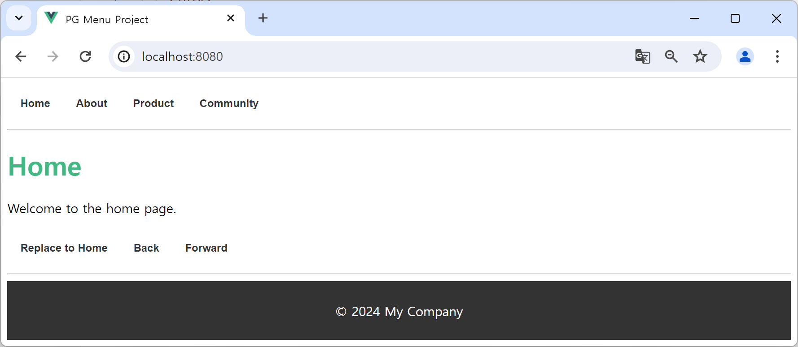

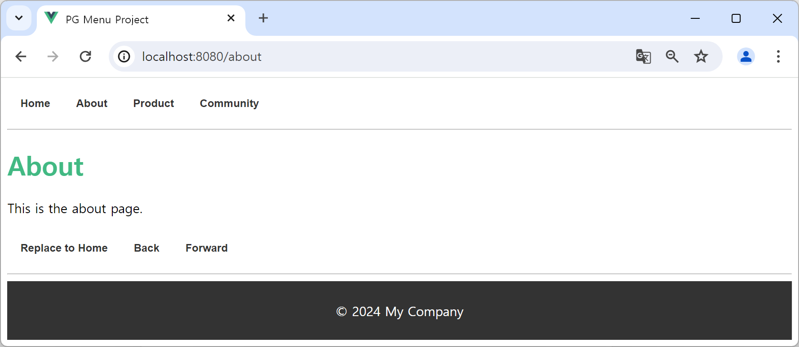


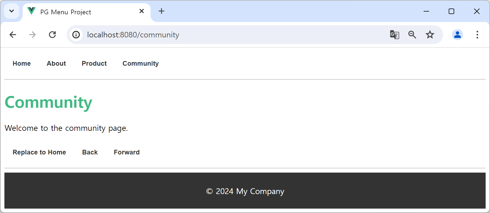

<br><br><br>

## 5-7. Redirect & Alias(리다이렉트와 별칭)

- Redirect(리다이렉트)와 Alias(별칭)는 라우팅을 보다 유연하고 편리하게 관리할 수 있도록 도와줍니다. 리다이렉트는 특정 경로를 다른 경로로 자동으로 이동시키는 기능이며, 별칭은 하나의 경로에 대해 여러 이름을 지정할 수 있는 기능입니다.

<br>

### 5-7-1. Redirect(리다이렉트)

- 리다이렉트는 사용자가 특정 경로에 접근할 때 자동으로 다른 경로로 이동시키는 기능입니다. 이를 통해 경로 변경, 경로 리팩토링, 특정 조건에 따른 경로 이동 등을 간단하게 처리할 수 있습니다.
- redirect 옵션을 사용하여 설정할 수 있습니다.

<br>

**기본 리다이렉트 설정**

```javascript
import { createRouter, createWebHistory } from 'vue-router';
import Home from './views/Home.vue';
import About from './views/About.vue';

const routes = [
  { path: '/', component: Home },
  { path: '/about', component: About },
  { path: '/home', redirect: '/' }
];

const router = createRouter({
  history: createWebHistory(),
  routes
});

export default router;
```

<br>

**함수 기반 리다이렉트**

```javascript
const routes = [
  { path: '/', component: Home },
  { path: '/about', component: About },
  { path: '/home', redirect: to => {
    // 특정 조건에 따라 리다이렉트 설정
    return { path: '/' };
  } }
];

const router = createRouter({
  history: createWebHistory(),
  routes
});

export default router;
```

<br><br>

### 5-7-2. Alias(별칭)

- 별칭은 특정 경로에 대해 여러 이름을 지정하여 동일한 컴포넌트를 다른 경로에서도 접근할 수 있도록 하는 기능입니다. 이를 통해 사용자에게 더 직관적인 URL을 제공할 수 있습니다.
- alias 옵션을 사용하여 설정할 수 있습니다.

<br>

**기본 별칭 설정**

```javascript
import { createRouter, createWebHistory } from 'vue-router';
import Home from './views/Home.vue';
import About from './views/About.vue';

const routes = [
  { path: '/', component: Home },
  { path: '/about', component: About },
  { path: '/alias-home', alias: '/home', component: Home }
];

const router = createRouter({
  history: createWebHistory(),
  routes
});

export default router;
```

<br>

**여러 별칭 설정**

```javascript
const routes = [
  { path: '/', component: Home },
  { path: '/about', component: About },
  { path: '/home', alias: ['/start', '/main'], component: Home }
];

const router = createRouter({
  history: createWebHistory(),
  routes
});

export default router;
```

<br>

### 5-7-3. 리다이렉트와 별칭의 종합 예시

```typescript
import { createRouter, createWebHistory } from 'vue-router';
import Home from './views/Home.vue';
import About from './views/About.vue';
import Contact from './views/Contact.vue';

const routes = [
  { path: '/', component: Home },
  { path: '/about', component: About },
  { path: '/contact', component: Contact },
  { path: '/home', redirect: '/' },
  { path: '/info', alias: '/about', component: About },
  { path: '/alias-home', alias: ['/start', '/main'], component: Home }
];

const router = createRouter({
  history: createWebHistory(),
  routes
});

export default router;
```

- 리다이렉트 설정: /home 경로로 접근하면 루트 경로(/)로 자동으로 이동됩니다. 이를 통해 경로가 변경되었거나 특정 조건에 따라 리다이렉트를 설정할 수 있습니다.
- 별칭 설정: /alias-home, /start, 그리고 /main 경로는 모두 Home 컴포넌트를 렌더링합니다. 사용자는 여러 경로를 통해 동일한 컴포넌트에 접근할 수 있습니다.
- 리다이렉트와 별칭을 적절히 활용하면 사용자 경험을 향상시키고, 애플리케이션의 경로 구조를 보다 유연하게 관리할 수 있습니다.

<br><br>

### 5-7-4. 리다이렉트와 별칭을 사용한 애플리케이션 제작 실습

**프로젝트 생성**

```shell
D:\gitRepository\vuejs\study05\pgmenuproject>vue create aliasproject

Vue CLI v5.0.8
? Please pick a preset: Manually select features
? Check the features needed for your project: Babel, TS, Router, Vuex
? Choose a version of Vue.js that you want to start the project with 3.x
? Use class-style component syntax? No
? Use Babel alongside TypeScript (required for modern mode, auto-detected polyfills, transpiling JSX)? Yes
? Use history mode for router? (Requires proper server setup for index fallback in production) Yes
? Where do you prefer placing config for Babel, ESLint, etc.? In dedicated config files
? Save this as a preset for future projects? No
```

**프로젝트 구조**

```lua
aliasproject/
├── node_modules/
├── public/
│   └── index.html
├── src/
│   ├── assets/
│   ├── components/
│   │   ├── Header.vue
│   │   └── Footer.vue
│   ├── model/
│   │   └── index.ts
│   ├── router/
│   │   └── index.ts
│   ├── store/
│   │   ├── actions.ts
│   │   ├── mutations.ts
│   │   ├── state.ts
│   │   └── index.ts
│   ├── views/
│   │   ├── About.vue
│   │   ├── Community.vue
│   │   ├── Home.vue
│   │   └── Product.vue
│   ├── App.vue
│   ├── main.ts
│   ├── shims-vue.d.ts
│   └── types/
│       └── index.d.ts
├── babel.config.js
├── package.json
├── tsconfig.json
└── vue.config.js
```

<br>

**01. babel.config.js**

```javascript
module.exports = {
  presets: [
    '@vue/cli-plugin-babel/preset'
  ]
};
```

<br>

**02. tsconfig.json**

```json
{
  "compilerOptions": {
    "target": "esnext",
    "module": "esnext",
    "strict": true,
    "jsx": "preserve",
    "moduleResolution": "node",
    "resolveJsonModule": true,
    "esModuleInterop": true,
    "skipLibCheck": true,
    "forceConsistentCasingInFileNames": true,
    "noEmit": true,
    "baseUrl": ".",
    "paths": {
      "@/*": ["src/*"]
    }
  },
  "include": ["src/**/*.ts", "src/**/*.d.ts", "src/**/*.tsx", "src/**/*.vue"],
  "exclude": ["node_modules"]
}
```

<br>

**03. vue.config.js**

```javascript
const { defineConfig } = require('@vue/cli-service')
module.exports = defineConfig({
  transpileDependencies: true
});
```

<br>

**04. public/index.html**

```html
<!DOCTYPE html>
<html lang="en">
<head>
  <meta charset="utf-8">
  <meta name="viewport" content="width=device-width, initial-scale=1.0">
  <style>
    button { background-color:transparent; outline:0; border:0; color:#333; 
      font-weight:bold; padding:1.2em; cursor:pointer; }
    button:hover { color:deepskyblue; }  
  </style>
  <title>Alias Project</title>
</head>
<body>
  <div id="app"></div>
  <!-- built files will be auto injected -->
</body>
</html>
```

<br>

**05. src/App.vue**

```vue
<template>
  <div id="app">
    <Header />
    <router-view></router-view>
    <Footer />
  </div>
</template>

<script setup>
import Header from '@/components/Header.vue';
import Footer from '@/components/Footer.vue';
</script>

<style>
nav {
  display: flex;
  gap: 10px;
  margin-bottom: 20px;
}
</style>
```

<br>

**06. src/main.ts**

```typescript
import { createApp } from 'vue';
import App from './App.vue';
import router from './router';
import store from './store';

const app = createApp(App);
app.use(router);
app.use(store);
app.mount('#app');
```

<br>

**07. src/shims-vue.d.ts**

```typescript
declare module '*.vue' {
  import type { DefineComponent } from 'vue';
  const component: DefineComponent<{}, {}, any>;
  export default component;
}
```

<br>

**08. src/router/index.ts**

```typescript
import { createRouter, createWebHistory } from 'vue-router';
import Home from '@/views/Home.vue';
import About from '@/views/About.vue';
import Product from '@/views/Product.vue';
import Community from '@/views/Community.vue';

const routes = [
  { path: '/', component: Home },
  { path: '/home', redirect: '/' },
  { path: '/about', alias: '/info', component: About },
  { path: '/product', alias:['/goods', '/event'], component: Product },
  { path: '/community', alias: ['/board', '/notice'], component: Community }
];

const router = createRouter({
  history: createWebHistory(),
  routes
});

export default router;
```

<br>

**09. src/components/Header.vue**

```vue
<template>
  <div>
    <button @click="goToPage('home')">홈</button>
    <button @click="goToPage('about')">소개</button>
    <button @click="goToPage('product')">상품</button>
    <button @click="goToPage('community')">커뮤니티</button>
  </div>
</template>

<script>
export default {
  methods: {
    goToPage(page) {
      this.$router.push({ path: `/${page}` });
    }
  }
};
</script>
```

<br>

**10. src/components/Footer.vue**

```vue
<template>
  <footer>
    <p>© 2024 My Company</p>
  </footer>
</template>

<script setup>
</script>

<style scoped>
footer {
  background-color: #333;
  color: #fff;
  padding: 10px;
  text-align: center;
}
</style>
```

<br>

**11. src/views/Home.vue**

```vue
<template>
  <div>
    <h1>Home</h1>
    <p>Welcome to the home page.</p>
    <button @click="replaceToPage('home')">Replace to Home</button>
    <button @click="goBack">Back</button>
    <button @click="goForward">Forward</button>
  </div>
</template>

<script>
export default {
  methods: {
    replaceToPage(page) {
      this.$router.push({ path: `/${page}` });
    },
    goBack() {
      this.$router.go(-1);
    },
    goForward() {
      this.$router.go(1);
    }
  }
};
</script>

<style scoped>
h1 {
  color: #42b983;
}
</style>
```

<br>

**12. src/views/About.vue**

```vue
<template>
  <div>
    <h1>About</h1>
    <p>This is the about page.</p>
    <button @click="replaceToPage('home')">Replace to Home</button>
    <button @click="replaceToPage('event')">Event</button>
    <button @click="replaceToPage('notice')">Notice</button>
  </div>
</template>

<script>
export default {
  methods: {
    replaceToPage(page) {
      this.$router.push({ path: `/${page}` });
    },
    goBack() {
      this.$router.go(-1);
    },
    goForward() {
      this.$router.go(1);
    }
  }
};
</script>

<style scoped>
h1 {
  color: #42b983;
}
</style>
```

<br>

**13. src/views/Product.vue**

```vue
<template>
    <div>
      <h1>Product</h1>
      <p>Here are our products.</p>
      <button @click="replaceToPage('home')">Replace to Home</button>
      <button @click="replaceToPage('info')">Info</button>
      <button @click="replaceToPage('board')">Board</button>
    </div>
  </template>
  
  <script>
  export default {
    methods: {
      replaceToPage(page) {
        this.$router.push({ path: `/${page}` });
      },
      goBack() {
        this.$router.go(-1);
      },
      goForward() {
        this.$router.go(1);
      }
    }
  };
  </script>
  
  <style scoped>
  h1 {
    color: #42b983;
  }
  </style>
```

<br>

**14. src/views/Community.vue**

```vue
<template>
    <div>
      <h1>Community</h1>
      <p>Welcome to the community page.</p>
      <button @click="replaceToPage('home')">Home</button>
      <button @click="replaceToPage('info')">Info</button>
      <button @click="replaceToPage('goods')">Goods</button>
    </div>
  </template>
  
  <script>
  export default {
    methods: {
      replaceToPage(page) {
        this.$router.push({ path: `/${page}` });
      },
      goBack() {
        this.$router.go(-1);
      },
      goForward() {
        this.$router.go(1);
      }
    }
  };
  </script>
  
  <style scoped>
  h1 {
    color: #42b983;
  }
  </style>
```

<br>

**15. src/store/index.ts**

```typescript
import { createStore } from 'vuex';
import state from './state';
import actions from './actions';
import mutations from './mutations';

export default createStore({
  state,
  actions,
  mutations
});
```

<br>

**16. src/store/state.ts**

```typescript
import { Product } from '@/model';

export interface State {
  products: Product[];
}

export default {
  products: []
} as State;
```

<br>

**17. src/store/mutations.ts**

```typescript
import { State } from './state';
import { Product } from '@/model';

export default {
  setProducts(state: State, products: Product[]) {
    state.products = products;
  }
};
```

<br>

**18. src/store/actions.ts**

```typescript
import { ActionContext } from 'vuex';
import { State } from './state';
import { Product } from '@/model';

export default {
  fetchProducts({ commit }: ActionContext<State, State>) {
    const products: Product[] = [
      { id: 1, name: 'Product A', price: 100 },
      { id: 2, name: 'Product B', price: 200 }
    ];
    commit('setProducts', products);
  }
};
```

<br>

**19. src/model/index.ts**

```typescript
export interface Product {
  id: number;
  name: string;
  price: number;
}
```

<br>

**애플리케이션 실행**

```shell
D:\gitRepository\vuejs\study05>cd aliasproject

D:\gitRepository\vuejs\study05\aliasproject>npm run serve

> dynamicproject@0.1.0 serve
> vue-cli-service serve

 INFO  Starting development server...

 DONE  Compiled successfully in 1838ms                                                                      오후 7:04:28

  App running at:
  - Local:   http://localhost:8080/
  - Network: http://192.168.0.9:8080/

  Note that the development build is not optimized.
  To create a production build, run npm run build.

Issues checking in progress...
No issues found.
```

<br>

**프로젝트 브라우저에서 열기**

1. 브라우저의 주소 입력줄에 `http://localhost:8080/` 을 입력한다.
2. 나타난 화면에서 Home / About / Product / Community 를 각 각 클릭해본다.
3. 각 페이지에서 Replace to Home / Event / Notice / Info / Board / Goods 버튼 링크를 클릭해본다. 

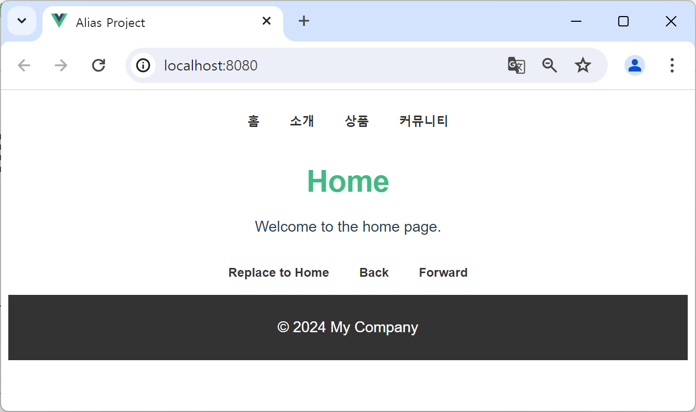

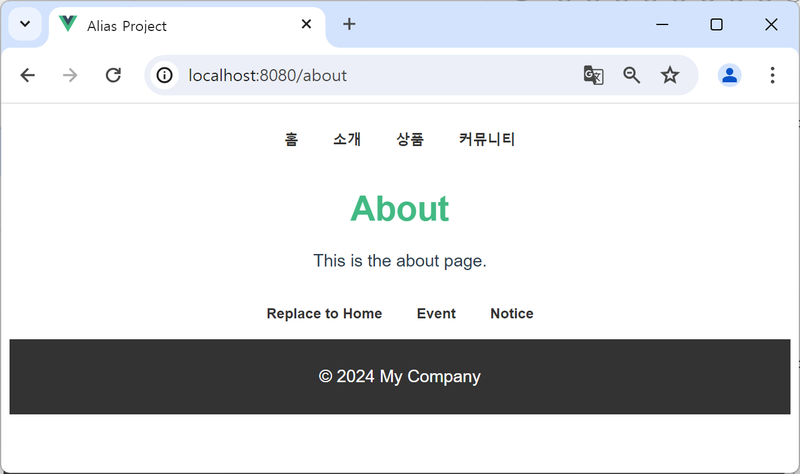

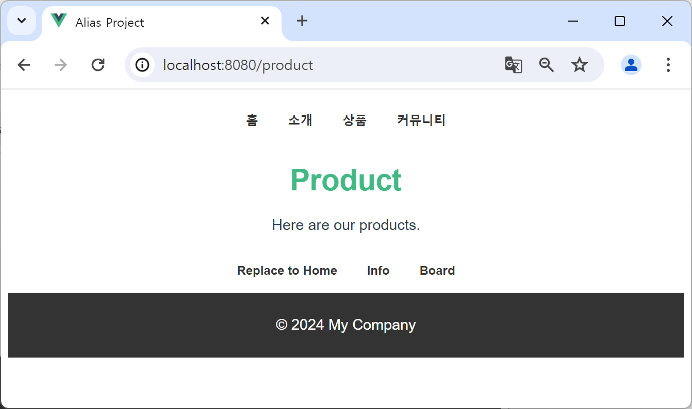

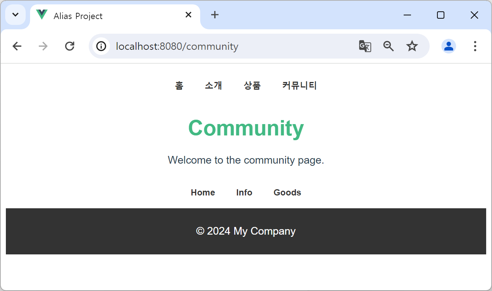

<br><br><br>

## 5-8. Forward To Route Component(라우트 컴포넌트에 데이터 전달)

- 라우트 컴포넌트에 데이터를 전달하는 방법은 다양합니다. 
- 주요 방법으로는 URL 파라미터, 쿼리 파라미터, props 옵션을 사용하는 방법 등이 있습니다. 각각의 방법은 특정 상황에 유용하게 사용할 수 있습니다.

<br>

### 5-8-1. URL 파라미터를 통한 데이터 전달

- URL 파라미터는 경로의 일부로 데이터를 전달하는 방법입니다. 이를 통해 사용자는 특정 경로에서 데이터를 추출할 수 있습니다.

**라우터 설정**

```javascript
import { createRouter, createWebHistory } from 'vue-router';
import User from './views/User.vue';

const routes = [
  { path: '/user/:id', component: User }
];

const router = createRouter({
  history: createWebHistory(),
  routes
});

export default router;
```

<br>

**User 컴포넌트**

```html
<template>
  <div>
    <h1>User ID: {{ userId }}</h1>
  </div>
</template>

<script>
export default {
  name: 'User',
  computed: {
    userId() {
      return this.$route.params.id;
    }
  }
};
</script>
```

<br>

### 5-8-2. 쿼리 파라미터를 통한 데이터 전달

- 쿼리 파라미터는 URL의 쿼리 문자열을 통해 데이터를 전달하는 방법입니다. 이를 통해 여러 파라미터를 쉽게 전달할 수 있습니다.

**라우터 설정**

```javascript
import { createRouter, createWebHistory } from 'vue-router';
import User from './views/User.vue';

const routes = [
  { path: '/user', component: User }
];

const router = createRouter({
  history: createWebHistory(),
  routes
});

export default router;
```

<br>

**User 컴포넌트**

```html
<template>
  <div>
    <h1>User ID: {{ userId }}</h1>
  </div>
</template>

<script>
export default {
  name: 'User',
  computed: {
    userId() {
      return this.$route.query.id;
    }
  }
};
</script>
```

<br>

**라우터 이동**

```javascript
this.$router.push({ path: '/user', query: { id: '123' } });
```

<br>

### 5-8-3. Props 옵션을 통한 데이터 전달

- props 옵션을 사용하여 라우트 컴포넌트에 데이터를 전달할 수 있습니다. 이를 통해 컴포넌트 내에서 전달된 데이터를 props로 쉽게 접근할 수 있습니다.

**라우터 설정**

```javascript
import { createRouter, createWebHistory } from 'vue-router';
import User from './views/User.vue';

const routes = [
  { path: '/user/:id', component: User, props: true }
];

const router = createRouter({
  history: createWebHistory(),
  routes
});

export default router;
```

<br>

**User 컴포넌트**

```html
<template>
  <div>
    <h1>User ID: {{ id }}</h1>
  </div>
</template>

<script>
export default {
  name: 'User',
  props: ['id']
};
</script>
```

<br>

**라우터 이동**

```javascript
this.$router.push({ path: '/user/123' });
```

<br>

### 5-8-4. 데이터 객체를 통한 전달

- props 옵션에 객체를 전달하여 데이터를 라우트 컴포넌트로 전달할 수 있습니다.

**라우터 설정**

```javascript
import { createRouter, createWebHistory } from 'vue-router';
import User from './views/User.vue';

const routes = [
  { path: '/user', component: User, props: { default: true, user: { id: '123', name: 'John' } } }
];

const router = createRouter({
  history: createWebHistory(),
  routes
});

export default router;
```

<br>

**User 컴포넌트**

```html
<template>
  <div>
    <h1>User ID: {{ user.id }}</h1>
    <h2>User Name: {{ user.name }}</h2>
  </div>
</template>

<script>
export default {
  name: 'User',
  props: ['user']
};
</script>
```

<br>

**라우터 이동**

```javascript
this.$router.push({ path: '/user', props: { user: { id: '456', name: 'Doe' } } });
```

<br>


### 5-8-5. route.params를 사용한 데이터 전달

- 컴포넌트 내부에서 this.$route.params를 사용하여 라우트 파라미터에 접근할 수 있습니다.

**라우터 설정**

```javascript
import { createRouter, createWebHistory } from 'vue-router';
import User from './views/User.vue';

const routes = [
  { path: '/user/:id', component: User }
];

const router = createRouter({
  history: createWebHistory(),
  routes
});

export default router;
```

<br>

**User 컴포넌트**

```html
<template>
  <div>
    <h1>User ID: {{ $route.params.id }}</h1>
  </div>
</template>

<script>
export default {
  name: 'User'
};
</script>
```

- 다양한 방법으로 Vue.js에서 라우트 컴포넌트에 데이터를 전달할 수 있습니다. 각 방법은 상황에 따라 다르게 사용될 수 있으며, 가장 적합한 방법을 선택하여 사용하면 됩니다.

<br><br>

### 5-8-6. 라우트 컴포넌트에 데이터 전달 애플리케이션 제작 실습

**프로젝트 생성**

```shell
D:\gitRepository\vuejs\study05>vue create datatransproject

Vue CLI v5.0.8
? Please pick a preset: Manually select features
? Check the features needed for your project: Babel, TS, Router, Vuex
? Choose a version of Vue.js that you want to start the project with 3.x
? Use class-style component syntax? No
? Use Babel alongside TypeScript (required for modern mode, auto-detected polyfills, transpiling JSX)? Yes
? Use history mode for router? (Requires proper server setup for index fallback in production) Yes
? Where do you prefer placing config for Babel, ESLint, etc.? In package.json
? Save this as a preset for future projects? No
```

<br>

**프로젝트 구조**

```lua
datatransproject
├── babel.config.js
├── package.json
├── public
│   └── index.html
├── src
│   ├── components
│   │   ├── Footer.vue
│   │   └── Header.vue
│   ├── main.ts
│   ├── model
│   │   └── index.ts
│   ├── router
│   │   └── index.ts
│   ├── shims-vue.d.ts
│   ├── store
│   │   ├── actions.ts
│   │   ├── index.ts
│   │   ├── mutations.ts
│   │   └── state.ts
│   └── views
│       ├── About.vue
│       ├── Community.vue
│       ├── Home.vue
│       ├── Product.vue
├── tsconfig.json
└── vue.config.js
```

<br>

**01. package.json**

```json
{
  "name": "datatransproject",
  "version": "0.1.0",
  "private": true,
  "scripts": {
    "serve": "vue-cli-service serve",
    "build": "vue-cli-service build"
  },
  "dependencies": {
    "core-js": "^3.8.3",
    "vue": "^3.2.13",
    "vue-router": "^4.0.3",
    "vuex": "^4.0.0"
  },
  "devDependencies": {
    "@vue/cli-plugin-babel": "~5.0.0",
    "@vue/cli-plugin-router": "~5.0.0",
    "@vue/cli-plugin-typescript": "~5.0.0",
    "@vue/cli-plugin-vuex": "~5.0.0",
    "@vue/cli-service": "~5.0.0",
    "typescript": "~4.5.5"
  },
  "browserslist": [
    "> 1%",
    "last 2 versions",
    "not dead",
    "not ie 11"
  ]
}
```

<br>

**02. babel.config.js**

```js
module.exports = {
  presets: [
    '@vue/cli-plugin-babel/preset'
  ]
};
```

<br>

**03. tsconfig.json**

```json
{
  "compilerOptions": {
    "target": "esnext",
    "module": "esnext",
    "strict": true,
    "jsx": "preserve",
    "importHelpers": true,
    "moduleResolution": "node",
    "experimentalDecorators": true,
    "skipLibCheck": true,
    "esModuleInterop": true,
    "allowSyntheticDefaultImports": true,
    "sourceMap": true,
    "baseUrl": ".",
    "types": [
      "webpack-env"
    ],
    "paths": {
      "@/*": [
        "src/*"
      ]
    },
    "lib": [
      "esnext",
      "dom",
      "dom.iterable",
      "scripthost"
    ]
  },
  "include": [
    "src/**/*.ts",
    "src/**/*.tsx",
    "src/**/*.vue",
    "tests/**/*.ts",
    "tests/**/*.tsx"
  ],
  "exclude": [
    "node_modules"
  ]
}
```

<br>

**04. vue.config.js**

```js
const { defineConfig } = require('@vue/cli-service')
module.exports = defineConfig({
  lintOnSave: false,
  transpileDependencies: true
});
```

<br>

**05. public/index.html**

```html
<!DOCTYPE html>
<html lang="en">
<head>
  <meta charset="UTF-8">
  <meta name="viewport" content="width=device-width, initial-scale=1.0">
  <title>datatransproject</title>
</head>
<body>
  <noscript>
    <strong>We're sorry but datatransproject doesn't work properly without JavaScript enabled. Please enable it to continue.</strong>
  </noscript>
  <div id="app"></div>
</body>
</html>
```

<br>

**06. src/main.ts**

```typescript
import { createApp } from 'vue';
import App from './App.vue';
import router from './router';
import store from './store';

const app = createApp(App);

app.use(router);
app.use(store);

app.mount('#app');
```

<br>

**07. src/shims-vue.d.ts**

```typescript
declare module '*.vue' {
  import { DefineComponent } from 'vue';
  const component: DefineComponent<{}, {}, any>;
  export default component;
}
```

<br>

**08. src/components/Header.vue**

```vue
<template>
  <div>
    <router-link to="/">홈</router-link>
    <router-link to="/about">소개</router-link>
    <router-link to="/product">상품</router-link>
    <router-link to="/community">커뮤니티</router-link>
  </div>
</template>

<script>
export default {
  name: 'Header'
};
</script>

<style scoped>
div {
  display: flex;
  gap: 10px;
}
</style>
```

<br>

**09. src/components/Footer.vue**

```vue
<template>
  <div>
    <p>© 2024 My Company</p>
  </div>
</template>

<script>
export default {
  name: 'Footer'
};
</script>

<style scoped>
div {
  text-align: center;
  margin-top: 20px;
}
</style>
```

<br>

**10. src/App.vue**

```vue
<template>
  <div id="app">
    <Header />
    <router-view />
    <Footer />
  </div>
</template>

<script>
import Header from '@/components/Header.vue';
import Footer from '@/components/Footer.vue';

export default {
  name: 'App',
  components: {
    Header,
    Footer
  }
};
</script>

<style>
#app {
  font-family: Avenir, Helvetica, Arial, sans-serif;
  -webkit-font-smoothing: antialiased;
  -moz-osx-font-smoothing: grayscale;
  text-align: center;
  color: #2c3e50;
  margin-top: 60px;
}
</style>
```

<br>

**11. src/views/Home.vue**

```vue
<template>
  <div>
    <h1>홈</h1>
    <p>환영합니다!</p>
    <button @click="replaceToPage('home')">홈으로 이동</button>
    <button @click="goBack">뒤로</button>
    <button @click="goForward">앞으로</button>
  </div>
</template>

<script>
export default {
  methods: {
    replaceToPage(page) {
      this.$router.replace({ path: `/${page}` });
    },
    goBack() {
      this.$router.go(-1);
    },
    goForward() {
      this.$router.go(1);
    }
  }
};
</script>

<style scoped>
h1 {
  color: #42b983;
}
</style>
```

<br>

**12. src/views/About.vue**

```vue
<template>
  <div>
    <h1>소개</h1>
    <p>이것은 소개 페이지입니다. 이 페이지는 /about 및 /info를 통해 접근할 수 있습니다.</p>
    <button @click="replaceToPage('home')">홈으로 이동</button>
    <button @click="goBack">뒤로</button>
    <button @click="goForward">앞으로</button>
  </div>
</template>

<script>
export default {
  methods: {
    replaceToPage(page) {
      this.$router.replace({ path: `/${page}` });
    },
    goBack() {
      this.$router.go(-1);
    },
    goForward() {
      this.$router.go(1);
    }
  }
};
</script>

<style scoped>
h1 {
  color: #42b983;
}
</style>
```

<br>

**13. src/views/Product.vue**

```vue
<template>
  <div>
    <h1>상품</h1>
    <div>
      <h2>제품 등록</h2>
      <input v-model="newProduct.name" placeholder="제품명"/>
      <input v-model="newProduct.description" placeholder="설명"/>
      <button @click="addProduct">추가</button>
    </div>
    <div>
      <h2>제품 목록</h2>
      <ul>
        <li v-for="product in products" :key="product.id">
          <router-link :to="{ name: 'product-detail', params: { id: product.id }}">{{ product.name }}</router-link>
          <button @click="editProduct(product)">수정</button>
          <button @click="deleteProduct(product.id)">삭제</button>
        </li>
      </ul>
    </div>
    <router-view></router-view>
    <button @click="replaceToPage('home')">홈으로 이동</button>
    <button @click="goBack">뒤로</button>
    <button @click="goForward">앞으로</button>
  </div>
</template>

<script>
import { mapState } from 'vuex';

export default {
  data() {
    return {
      newProduct: {
        id: null,
        name: '',
        description: ''
      }
    };
  },
  computed: {
    ...mapState(['products'])
  },
  methods: {
    addProduct() {
      if (this.newProduct.name && this.newProduct.description) {
        const id = this.products.length + 1;
        this.$store.dispatch('addProduct', { ...this.newProduct, id });
        this.newProduct.name = '';
        this.newProduct.description = '';
      }
    },
    editProduct(product) {
      this.$router.push({ name: 'product-edit', params: { id: product.id } });
    },
    deleteProduct(id) {
      this.$store.commit('DELETE_PRODUCT', id);
    },
    replaceToPage(page) {
      this.$router.replace({ path: `/${page}` });
    },
    goBack() {
      this.$router.go(-1);
    },
    goForward() {
      this.$router.go(1);
    }
  }
};
</script>

<style scoped>
h1 {
  color: #42b983;
}
</style>
```

<br>

**14. src/views/Community.vue**

```vue
<template>
  <div>
    <h1>커뮤니티</h1>
    <div>
      <h2>게시글 등록</h2>
      <input v-model="newPost.title" placeholder="제목"/>
      <input v-model="newPost.content" placeholder="내용"/>
      <button @click="addPost">추가</button>
    </div>
    <div>
      <h2>게시글 목록</h2>
      <ul>
        <li v-for="post in posts" :key="post.id">
          <router-link :to="{ name: 'post-detail', params: { id: post.id }}">{{ post.title }}</router-link>
          <button @click="editPost(post)">수정</button>
          <button @click="deletePost(post.id)">삭제</button>
        </li>
      </ul>
    </div>
    <router-view></router-view>
    <button @click="replaceToPage('home')">홈으로 이동</button>
    <button @click="goBack">뒤로</button>
    <button @click="goForward">앞으로</button>
  </div>
</template>

<script>
import { mapState } from 'vuex';

export default {
  data() {
    return {
      newPost: {
        id: null,
        title: '',
        content: ''
      }
    };
  },
  computed: {
    ...mapState(['posts'])
  },
  methods: {
    addPost() {
      if (this.newPost.title && this.newPost.content) {
        const id = this.posts.length + 1;
        this.$store.dispatch('addPost', { ...this.newPost, id });
        this.newPost.title = '';
        this.newPost.content = '';
      }
    },
    editPost(post) {
      this.$router.push({ name: 'post-edit', params: { id: post.id } });
    },
    deletePost(id) {
      this.$store.commit('DELETE_POST', id);
    },
    replaceToPage(page) {
      this.$router.replace({ path: `/${page}` });
    },
    goBack() {
      this.$router.go(-1);
    },
    goForward() {
      this.$router.go(1);
    }
  }
};
</script>

<style scoped>
h1 {
  color: #42b983;
}
</style>
```

<br>

**15. src/router/index.ts**

```typescript
import { createRouter, createWebHistory } from 'vue-router';
import Home from '@/views/Home.vue';
import About from '@/views/About.vue';
import Product from '@/views/Product.vue';
import Community from '@/views/Community.vue';

const routes = [
  { path: '/', component: Home },
  { path: '/home', redirect: '/' },
  { path: '/about', alias: '/info', component: About },
  { path: '/product', alias: ['/goods', '/event'], component: Product, 
    children: [
      { path: 'detail/:id', name: 'product-detail', component: Product },
      { path: 'edit/:id', name: 'product-edit', component: Product }
    ] 
  },
  { path: '/community', alias: ['/board', '/notice'], component: Community, 
    children: [
      { path: 'detail/:id', name: 'post-detail', component: Community },
      { path: 'edit/:id', name: 'post-edit', component: Community }
    ] 
  }
];

const router = createRouter({
  history: createWebHistory(),
  routes
});

export default router;
```

<br>

**16. src/store/index.ts**

```typescript
import { createStore } from 'vuex';
import state from './state';
import actions from './actions';
import mutations from './mutations';

export default createStore({
  state,
  actions,
  mutations,
  modules: {}
});
```

<br>

**17. src/store/state.ts**

```typescript
import { Product, Post } from '@/model';

export interface State {
  products: Product[];
  posts: Post[];
}

const state: State = {
  products: [],
  posts: []
};

export default state;
```

<br>

**18. src/store/actions.ts**

```typescript
import { ActionContext } from 'vuex';
import { Product, Post } from '@/model';
import { State } from './state';

export default {
  addProduct({ commit }: ActionContext<State, any>, product: Product) {
    commit('ADD_PRODUCT', product);
  },
  addPost({ commit }: ActionContext<State, any>, post: Post) {
    commit('ADD_POST', post);
  }
};
```

<br>

**19. src/store/mutations.ts**

```typescript
import { Product, Post } from '@/model';
import { State } from './state';

export default {
  ADD_PRODUCT(state: State, product: Product) {
    state.products.push(product);
  },
  ADD_POST(state: State, post: Post) {
    state.posts.push(post);
  },
  DELETE_PRODUCT(state: State, id: number) {
    state.products = state.products.filter(product => product.id !== id);
  },
  DELETE_POST(state: State, id: number) {
    state.posts = state.posts.filter(post => post.id !== id);
  }
};
```

<br>

**20. src/model/index.ts**

```typescript
export interface Product {
  id: number;
  name: string;
  description: string;
}

export interface Post {
  id: number;
  title: string;
  content: string;
}
```

<br>

**애플리케이션 실행**

```shell
D:\gitRepository\vuejs\study05>cd datatransproject

D:\gitRepository\vuejs\study05\datatransproject>npm run serve

> dynamicproject@0.1.0 serve
> vue-cli-service serve

 INFO  Starting development server...

 DONE  Compiled successfully in 1838ms                                                                      오후 7:04:28

  App running at:
  - Local:   http://localhost:8080/
  - Network: http://192.168.0.9:8080/

  Note that the development build is not optimized.
  To create a production build, run npm run build.

Issues checking in progress...
No issues found.
```

<br>

**프로젝트 브라우저에서 열기**

1. 브라우저의 주소 입력줄에 `http://localhost:8080/` 을 입력한다.
2. 나타난 화면에서 Home / About / Product / Community 를 각 각 클릭해본다.
3. 각 페이지에서 Replace to Home / Back / Forward 버튼 링크를 클릭해본다. 
4. Product 페이지에서 상품 추가, 상품 목록, 상품 상세보기, 상품 수정, 상품 제거를 진행해본다.
5. Community 페이지에서 글 추가, 글 목록, 글 상세보기, 글 수정, 글 제거를 진행해본다.

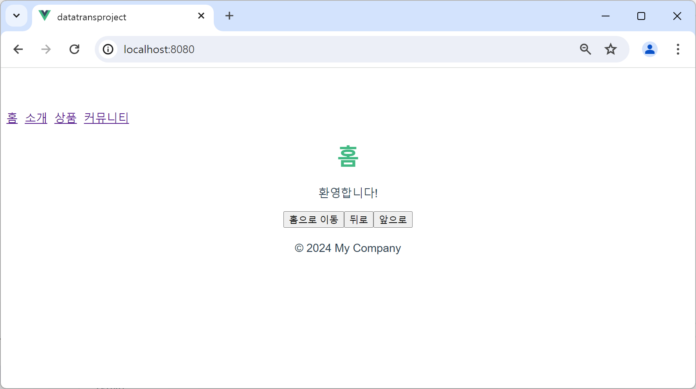

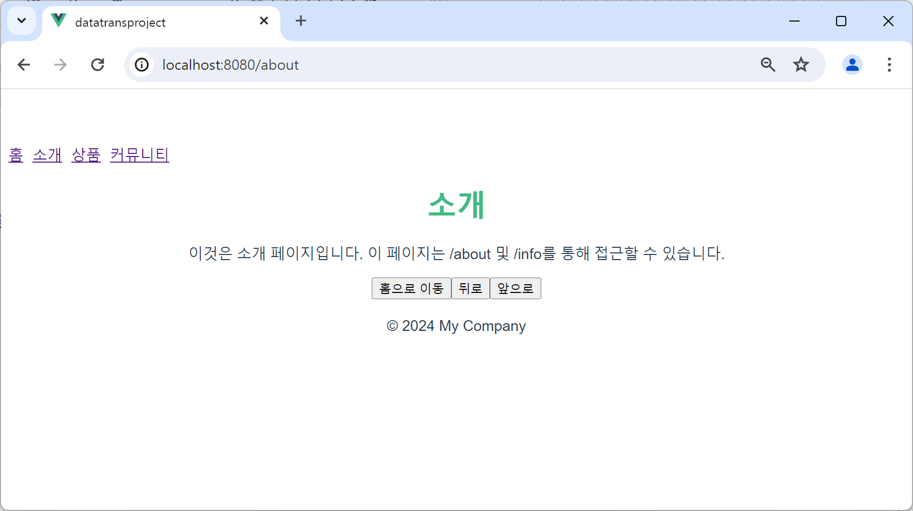

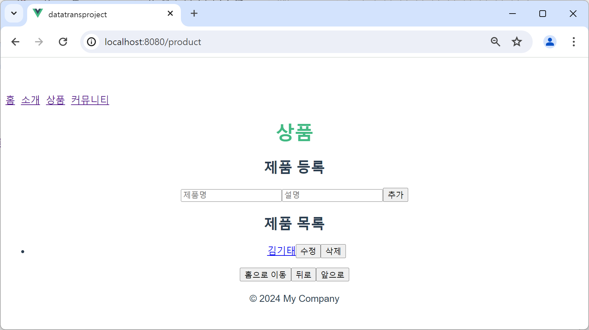

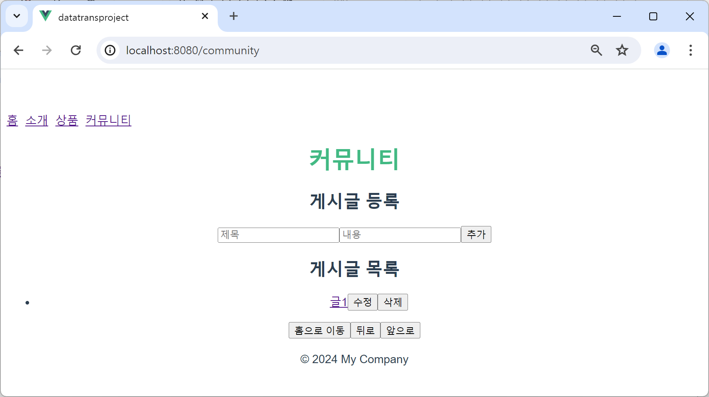


<br><br><br>


## 5-9. Route Mode(라우트 모드)

- 라우터 모드를 설정하여 브라우저의 주소(URL) 구조를 관리할 수 있습니다. 두 가지 주요 라우트 모드가 있습니다.
- Hash Mode(해시 모드)와 History Mode(히스토리 모드). 각각의 모드에는 고유의 특징과 사용 방법이 있습니다.
- 라우트 모드는 브라우저의 주소 구조를 제어하는 방식입니다. 
- Vue Router에서는 Hash Mode (해시 모드)와 History Mode (히스토리 모드)으로 두 가지 주요 모드를 지원합니다:

- Hash Mode는 서버 설정 없이 클라이언트 측 라우팅을 구현할 수 있는 쉬운 방법입니다. 주로 구형 브라우저와의 호환성을 위해 사용됩니다.
- History Mode는 깔끔한 URL 구조를 제공하며, SEO와 사용자 경험 향상을 위해 사용됩니다. 하지만 서버 측 설정이 필요합니다.

<br>

### 5-9-1. Hash Mode(해시 모드)

Hash Mode(해시 모드)

- 해시 모드는 URL의 해시(#) 기호를 사용하여 경로를 나타냅니다. 브라우저가 해시 기호 뒤에 오는 경로를 서버에 전송하지 않으므로, 서버 구성 없이도 클라이언트 측 라우팅을 쉽게 구현할 수 있습니다.

<br>

**특징**

1. 해시 기호(#)가 포함된 URL을 사용합니다.
2. 서버 설정이 필요 없습니다.
3. 구형 브라우저와 호환성이 좋습니다.

<br>

**라우터 설정**

```javascript
import { createRouter, createWebHashHistory } from 'vue-router';
import Home from './views/Home.vue';
import About from './views/About.vue';

const routes = [
  { path: '/', component: Home },
  { path: '/about', component: About }
];

const router = createRouter({
  history: createWebHashHistory(),
  routes
});

export default router;
```

<br>

**App.vue에서 라우터 사용**

```html
<template>
  <div id="app">
    <router-link to="/">Home</router-link>
    <router-link to="/about">About</router-link>
    <router-view></router-view>
  </div>
</template>

<script>
export default {
  name: 'App'
};
</script>
```

- 해시 모드로 라우터를 설정하면 URL은 다음과 같은 형태가 됩니다:

```bash
http://example.com/#/about
```

<br>

### 5-9-2. History Mode(히스토리 모드)

- 히스토리 모드는 HTML5 History API를 사용하여 브라우저의 주소를 관리합니다. 이 모드는 보다 깔끔한 URL 구조를 제공하며, 서버 측 설정이 필요합니다.

**특징**

1. 깔끔한 URL 구조 (해시 기호가 없음).
2. 서버 설정이 필요합니다 (모든 경로를 index.html로 리다이렉트해야 함).
3. 최신 브라우저와 호환됩니다.

<br>

**라우터 설정**

```javascript
import { createRouter, createWebHistory } from 'vue-router';
import Home from './views/Home.vue';
import About from './views/About.vue';

const routes = [
  { path: '/', component: Home },
  { path: '/about', component: About }
];

const router = createRouter({
  history: createWebHistory(),
  routes
});

export default router;
```

<br>

**App.vue에서 라우터 사용**

```html
<template>
  <div id="app">
    <router-link to="/">Home</router-link>
    <router-link to="/about">About</router-link>
    <router-view></router-view>
  </div>
</template>

<script>
export default {
  name: 'App'
};
</script>
```

-- 히스토리 모드로 라우터를 설정하면 URL은 다음과 같은 형태가 됩니다:

```bash
http://example.com/about
```

<br>

**서버 설정 (예: Node.js Express 서버)**

```javascript
const express = require('express');
const path = require('path');
const app = express();

app.use(express.static(path.join(__dirname, 'dist')));

app.get('*', (req, res) => {
  res.sendFile(path.resolve(__dirname, 'dist', 'index.html'));
});

app.listen(8080, () => {
  console.log('Server is running on port 8080');
});
```

<br><br>

### 5-9-3. 라우트 모드 종합 실습

**Hash Mode 설정**

```javascript
import { createRouter, createWebHashHistory } from 'vue-router';
import Home from './views/Home.vue';
import About from './views/About.vue';

const routes = [
  { path: '/', component: Home },
  { path: '/about', component: About }
];

const router = createRouter({
  history: createWebHashHistory(),
  routes
});

export default router;
```

<br>

**History Mode 설정**

```javascript
import { createRouter, createWebHistory } from 'vue-router';
import Home from './views/Home.vue';
import About from './views/About.vue';

const routes = [
  { path: '/', component: Home },
  { path: '/about', component: About }
];

const router = createRouter({
  history: createWebHistory(),
  routes
});

export default router;
```

<br><br>

### 5-9-4. 라우트 모드를 활용한 애플리케이션 제작 실습

**프로젝트 생성**

```shell
D:\gitRepository\vuejs\study05>vue create routemodeproject

Vue CLI v5.0.8
? Please pick a preset: Manually select features
? Check the features needed for your project: Babel, TS, Router, Vuex
? Choose a version of Vue.js that you want to start the project with 3.x
? Use class-style component syntax? No
? Use Babel alongside TypeScript (required for modern mode, auto-detected polyfills, transpiling JSX)? Yes
? Use history mode for router? (Requires proper server setup for index fallback in production) Yes
? Where do you prefer placing config for Babel, ESLint, etc.? In package.json
? Save this as a preset for future projects? No
```

<br>

**프로젝트 구조**

```lua
datatransproject
├── babel.config.js
├── package.json
├── public
│   ├── favicon.ico
│   └── index.html
├── src
│   ├── App.vue
│   ├── components
│   │   ├── Footer.vue
│   │   └── Header.vue
│   ├── main.ts
│   ├── model
│   │   ├── index.ts
│   │   ├── Post.ts
│   │   └── Product.ts
│   ├── router
│   │   ├── hash.ts
│   │   └── history.ts
│   ├── shims-vue.d.ts
│   ├── store
│   │   ├── actions.ts
│   │   ├── index.ts
│   │   ├── mutations.ts
│   │   └── state.ts
│   ├── views
│   │   ├── About.vue
│   │   ├── Community.vue
│   │   ├── Home.vue
│   │   └── Product.vue
├── tsconfig.json
└── vue.config.js
```

<br>

**01. package.json**

```json
{
  "name": "routemodeproject",
  "version": "0.1.0",
  "private": true,
  "scripts": {
    "serve": "vue-cli-service serve",
    "build": "vue-cli-service build"
  },
  "dependencies": {
    "core-js": "^3.8.3",
    "vue": "^3.2.13",
    "vue-router": "^4.0.3",
    "vuex": "^4.0.0"
  },
  "devDependencies": {
    "@vue/cli-plugin-babel": "~5.0.0",
    "@vue/cli-plugin-router": "~5.0.0",
    "@vue/cli-plugin-typescript": "~5.0.0",
    "@vue/cli-plugin-vuex": "~5.0.0",
    "@vue/cli-service": "~5.0.0",
    "typescript": "~4.5.5"
  },
  "browserslist": [
    "> 1%",
    "last 2 versions",
    "not dead",
    "not ie 11"
  ]
}
```

<br>

**02. babel.config.js**

```javascript
module.exports = {
  presets: [
    '@vue/cli-plugin-babel/preset'
  ]
};
```

<br>

**03. tsconfig.json**

```json
{
  "compilerOptions": {
    "target": "esnext",
    "module": "esnext",
    "strict": true,
    "jsx": "preserve",
    "importHelpers": true,
    "moduleResolution": "node",
    "esModuleInterop": true,
    "experimentalDecorators": true,
    "allowSyntheticDefaultImports": true,
    "sourceMap": true,
    "baseUrl": ".",
    "paths": {
      "@/*": ["src/*"]
    },
    "lib": [
      "esnext",
      "dom",
      "dom.iterable",
      "scripthost"
    ]
  },
  "include": [
    "src/**/*.ts",
    "src/**/*.tsx",
    "src/**/*.vue",
    "tests/**/*.ts",
    "tests/**/*.tsx"
  ],
  "exclude": [
    "node_modules"
  ]
}
```

<br>

**04. vue.config.js**

```javascript
const { defineConfig } = require('@vue/cli-service')
module.exports = defineConfig({
  lintOnSave: false,
  transpileDependencies: true
})
```

<br>

**05. public/index.html**

```html
<!DOCTYPE html>
<html lang="en">
  <head>
    <meta charset="UTF-8" />
    <meta name="viewport" content="width=device-width,initial-scale=1.0" />
    <title>datatransproject</title>
  </head>
  <body>
    <noscript>
      <strong>We're sorry but datatransproject doesn't work properly without JavaScript enabled. Please enable it to continue.</strong>
    </noscript>
    <div id="app"></div>
  </body>
</html>
```

<br>

**06. src/shims-vue.d.ts**

```typescript
declare module '*.vue' {
  import { DefineComponent } from 'vue';
  const component: DefineComponent<{}, {}, any>;
  export default component;
}
```

<br>

**07. src/main.ts**

```typescript
import { createApp } from 'vue';
import App from './App.vue';
import router from './router/history'; // Use 'hash' for hash mode
import store from './store';

createApp(App)
  .use(router)
  .use(store)
  .mount('#app');
```

<br>

**08. src/App.vue**

```vue
<template>
  <div id="app">
    <Header />
    <router-view />
    <Footer />
  </div>
</template>

<script>
import Header from '@/components/Header.vue';
import Footer from '@/components/Footer.vue';

export default {
  components: {
    Header,
    Footer
  }
};
</script>

<style>
#app {
  font-family: Avenir, Helvetica, Arial, sans-serif;
  -webkit-font-smoothing: antialiased;
  -moz-osx-font-smoothing: grayscale;
  text-align: center;
  color: #2c3e50;
  margin-top: 60px;
}
</style>
```

<br>

**09. src/components/Header.vue**

```vue
<template>
  <div>
    <router-link to="/">Home</router-link>
    <router-link to="/about">About</router-link>
    <router-link to="/product">Product</router-link>
    <router-link to="/community">Community</router-link>
  </div>
</template>

<script>
export default {};
</script>
```

<br>

**10. src/components/Footer.vue**

```vue
<template>
  <footer>
    <p>&copy; 2024 My Company</p>
  </footer>
</template>

<script>
export default {};
</script>

<style>
footer {
  position: fixed;
  bottom: 0;
  width: 100%;
  background-color: #333;
  color: white;
  text-align: center;
  padding: 10px 0;
}
</style>
```

<br>

**11. src/model/Product.ts**

```typescript
export interface Product {
  id: number;
  name: string;
  description: string;
  price: number;
}
```

<br>

**12. src/model/Post.ts**

```typescript
export interface Post {
  id: number;
  title: string;
  content: string;
}
```

<br>

**13. src/model/index.ts**

```typescript
export * from './Product';
export * from './Post';
```

<br>

**14. src/store/state.ts**

```typescript
import { Product, Post } from '@/model';

export interface State {
  products: Product[];
  posts: Post[];
}

const state: State = {
  products: [],
  posts: []
};

export default state;
```

<br>

**15. src/store/actions.ts**

```typescript
import { ActionContext } from 'vuex';
import { Product, Post } from '@/model';
import { State } from './state';

export default {
  addProduct({ commit }: ActionContext<State, any>, product: Product) {
    commit('ADD_PRODUCT', product);
  },
  addPost({ commit }: ActionContext<State, any>, post: Post) {
    commit('ADD_POST', post);
  }
};
```

<br>

**16. src/store/mutations.ts**

```typescript
import { Product, Post } from '@/model';
import { State } from './state';

export default {
  ADD_PRODUCT(state: State, product: Product) {
    state.products.push(product);
  },
  ADD_POST(state: State, post: Post) {
    state.posts.push(post);
  },
  DELETE_PRODUCT(state: State, id: number) {
    state.products = state.products.filter(product => product.id !== id);
  },
  DELETE_POST(state: State, id: number) {
    state.posts = state.posts.filter(post => post.id !== id);
  }
};
```

<br>

**17. src/store/index.ts**

```typescript
import { createStore } from 'vuex';
import state from './state';
import actions from './actions';
import mutations from './mutations';

export default createStore({
  state,
  actions,
  mutations
});
```

<br>

**18. src/router/history.ts**

```typescript
import { createRouter, createWebHistory } from 'vue-router';
import Home from '@/views/Home.vue';
import About from '@/views/About.vue';
import Product from '@/views/Product.vue';
import Community from '@/views/Community.vue';

const routes = [
  { path: '/', component: Home },
  { path: '/home', redirect: '/' },
  { path: '/about', alias: '/info', component: About },
  { path: '/product', alias: ['/goods', '/event'], component: Product },
  { path: '/community', alias: ['/board', '/notice'], component: Community }
];

const router = createRouter({
  history: createWebHistory(),
  routes
});

export default router;
```

<br>

**19. src/router/hash.ts**

```typescript
import { createRouter, createWebHashHistory } from 'vue-router';
import Home from '@/views/Home.vue';
import About from '@/views/About.vue';
import Product from '@/views/Product.vue';
import Community from '@/views/Community.vue';

const routes = [
  { path: '/', component: Home },
  { path: '/home', redirect: '/' },
  { path: '/about', alias: '/info', component: About },
  { path: '/product', alias: ['/goods', '/event'], component: Product },
  { path: '/community', alias: ['/board', '/notice'], component: Community }
];

const router = createRouter({
  history: createWebHashHistory(),
  routes
});

export default router;
```

<br>

**20. src/views/Home.vue**

```vue
<template>
  <div>
    <h1>Home Page</h1>
    <p>Welcome to the Home page!</p>
  </div>
</template>

<script>
export default {};
</script>
```

<br>

**21. src/views/About.vue**

```vue
<template>
  <div>
    <h1>About Page</h1>
    <p>Learn more about us on this page.</p>
    <button @click="replaceToPage('home')">Replace to Home</button>
    <button @click="goBack">Back</button>
    <button @click="goForward">Forward</button>
  </div>
</template>

<script>
export default {
  methods: {
    replaceToPage(page) {
      this.$router.replace({ name: page });
    },
    goBack() {
      this.$router.go(-1);
    },
    goForward() {
      this.$router.go(1);
    }
  }
};
</script>
```

<br>

**22. src/views/Product.vue**

```vue
<template>
  <div>
    <h1>Product Page</h1>
    <p>Manage your products here.</p>
    <div>
      <h2>Product List</h2>
      <ul>
        <li v-for="product in products" :key="product.id">
          {{ product.name }} - {{ product.description }} - ${{ product.price }}
          <button @click="deleteProduct(product.id)">Delete</button>
        </li>
      </ul>
    </div>
    <div>
      <h2>Add Product</h2>
      <form @submit.prevent="addProduct">
        <input v-model="newProduct.name" placeholder="Name" />
        <input v-model="newProduct.description" placeholder="Description" />
        <input v-model.number="newProduct.price" placeholder="Price" />
        <button type="submit">Add</button>
      </form>
    </div>
    <button @click="replaceToPage('home')">Replace to Home</button>
    <button @click="goBack">Back</button>
    <button @click="goForward">Forward</button>
  </div>
</template>

<script>
import { mapState, mapActions } from 'vuex';

export default {
  data() {
    return {
      newProduct: {
        id: 0,
        name: '',
        description: '',
        price: 0
      }
    };
  },
  computed: {
    ...mapState(['products'])
  },
  methods: {
    ...mapActions(['addProduct', 'deleteProduct']),
    addProduct() {
      this.addProduct({ ...this.newProduct, id: Date.now() });
      this.newProduct = { id: 0, name: '', description: '', price: 0 };
    },
    replaceToPage(page) {
      this.$router.replace({ name: page });
    },
    goBack() {
      this.$router.go(-1);
    },
    goForward() {
      this.$router.go(1);
    }
  }
};
</script>
```

<br>

**23. src/views/Community.vue**

```vue
<template>
  <div>
    <h1>Community Page</h1>
    <p>Manage your community posts here.</p>
    <div>
      <h2>Post List</h2>
      <ul>
        <li v-for="post in posts" :key="post.id">
          {{ post.title }} - {{ post.content }}
          <button @click="deletePost(post.id)">Delete</button>
        </li>
      </ul>
    </div>
    <div>
      <h2>Add Post</h2>
      <form @submit.prevent="addPost">
        <input v-model="newPost.title" placeholder="Title" />
        <input v-model="newPost.content" placeholder="Content" />
        <button type="submit">Add</button>
      </form>
    </div>
    <button @click="replaceToPage('home')">Replace to Home</button>
    <button @click="goBack">Back</button>
    <button @click="goForward">Forward</button>
  </div>
</template>

<script>
import { mapState, mapActions } from 'vuex';

export default {
  data() {
    return {
      newPost: {
        id: 0,
        title: '',
        content: ''
      }
    };
  },
  computed: {
    ...mapState(['posts'])
  },
  methods: {
    ...mapActions(['addPost', 'deletePost']),
    addPost() {
      this.addPost({ ...this.newPost, id: Date.now() });
      this.newPost = { id: 0, title: '', content: '' };
    },
    replaceToPage(page) {
      this.$router.replace({ name: page });
    },
    goBack() {
      this.$router.go(-1);
    },
    goForward() {
      this.$router.go(1);
    }
  }
};
</script>
```

<br>

**애플리케이션 실행**

```shell
D:\gitRepository\vuejs\study05>cd routemodeproject

D:\gitRepository\vuejs\study05\routemodeproject>npm run serve

> dynamicproject@0.1.0 serve
> vue-cli-service serve

 INFO  Starting development server...

 DONE  Compiled successfully in 1838ms                                                                      오후 7:04:28

  App running at:
  - Local:   http://localhost:8080/
  - Network: http://192.168.0.9:8080/

  Note that the development build is not optimized.
  To create a production build, run npm run build.

Issues checking in progress...
No issues found.
```

<br>

**프로젝트 브라우저에서 열기**

1. 브라우저의 주소 입력줄에 `http://localhost:8080/` 을 입력한다.
2. 나타난 화면에서 Home / About / Product / Community 를 각 각 클릭해본다.
3. 각 페이지에서 Replace to Home / Back / Forward 버튼 링크를 클릭해본다. 
4. Product 페이지에서 상품 추가, 상품 목록, 상품 상세보기, 상품 수정, 상품 제거를 진행해본다.
5. Community 페이지에서 글 추가, 글 목록, 글 상세보기, 글 수정, 글 제거를 진행해본다.

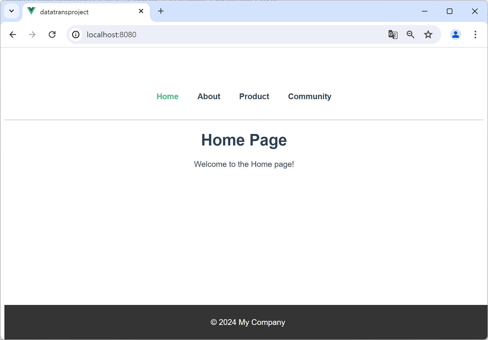

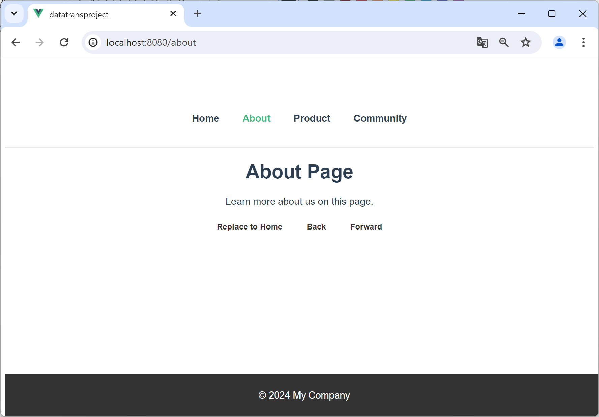

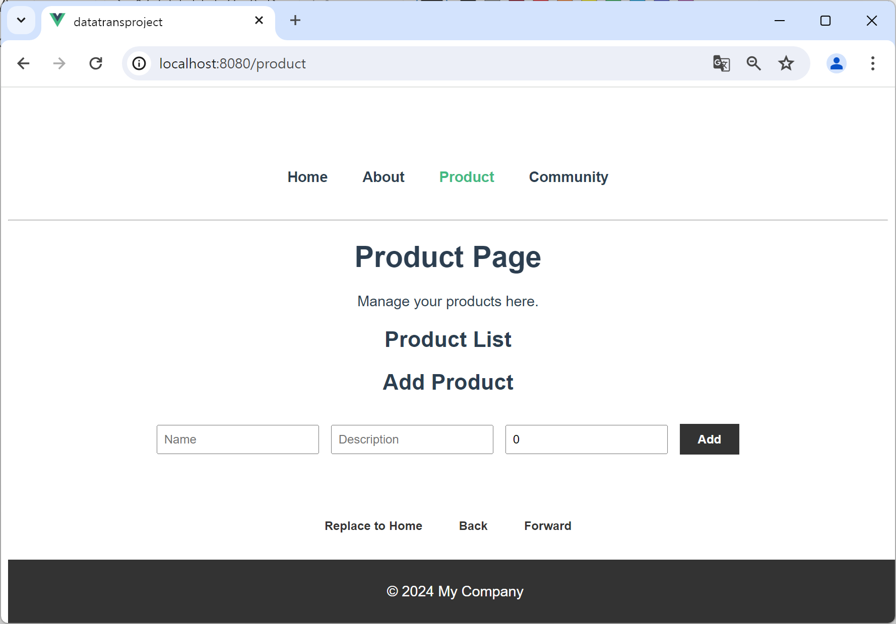

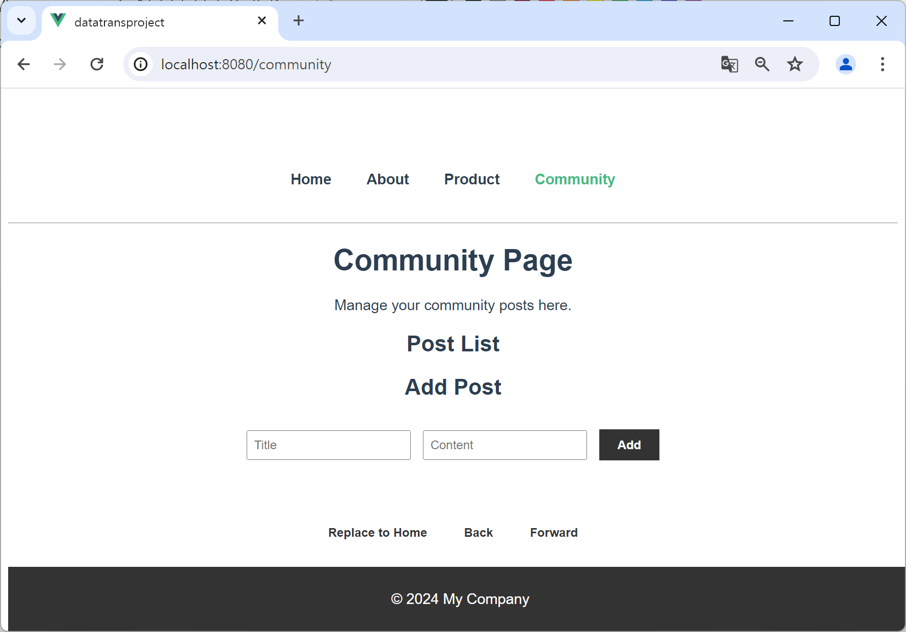

<br><br><br>

## 5-10. Navigation Gard(네비게이션 가드)

- 네비게이션 가드(Navigation Guard)를 사용하여 라우트 전환을 제어하고 특정 조건에 따라 라우팅을 허용하거나 거부할 수 있습니다. 네비게이션 가드는 글로벌 가드, 라우트별 가드, 컴포넌트별 가드의 세 가지 주요 유형으로 나뉩니다.

<br>

### 5-10-1. 글로벌 가드 (Global Guard)

- 글로벌 가드는 라우터 인스턴스에 직접 등록되며, 모든 라우트 전환에 대해 호출됩니다. 세 가지 주요 글로벌 가드가 있습니다:

beforeEach: 라우트 전환이 일어나기 전에 호출됩니다.
beforeResolve: 모든 라우트 가드와 비동기 컴포넌트가 완료된 후 호출됩니다.
afterEach: 라우트 전환이 완료된 후 호출됩니다.

<br>

**예시 코드**

```javascript
import { createRouter, createWebHistory } from 'vue-router';
import Home from './views/Home.vue';
import About from './views/About.vue';

const routes = [
  { path: '/', component: Home },
  { path: '/about', component: About }
];

const router = createRouter({
  history: createWebHistory(),
  routes
});

// beforeEach 가드
router.beforeEach((to, from, next) => {
  console.log('Global beforeEach');
  next(); // 반드시 next() 호출
});

// beforeResolve 가드
router.beforeResolve((to, from, next) => {
  console.log('Global beforeResolve');
  next();
});

// afterEach 가드
router.afterEach((to, from) => {
  console.log('Global afterEach');
});

export default router;
```

<br><br>

### 5-10-2. 라우트별 가드 (Route Guard)

- 라우트별 가드는 특정 라우트에 대해 정의되며, 라우트의 beforeEnter 속성을 사용하여 설정합니다.

**예시 코드**

```javascript
import { createRouter, createWebHistory } from 'vue-router';
import Home from './views/Home.vue';
import About from './views/About.vue';

const routes = [
  { path: '/', component: Home },
  { 
    path: '/about', 
    component: About,
    beforeEnter: (to, from, next) => {
      console.log('Route-specific beforeEnter');
      next();
    }
  }
];

const router = createRouter({
  history: createWebHistory(),
  routes
});

export default router;
```

<br>

### 5-10-3. 컴포넌트 가드 (Component Guard)

- 컴포넌트 가드는 컴포넌트 내부에 정의되며, 세 가지 주요 가드가 있습니다:

1. beforeRouteEnter: 라우트가 전환되기 전에 호출됩니다.
2. beforeRouteUpdate: 동일한 컴포넌트가 재사용될 때 호출됩니다.
3. beforeRouteLeave: 라우트가 떠나기 전에 호출됩니다.

<br>

#### 5-10-3-1. 예시 코드

**Home.vue**

```html
<template>
  <div>
    <h1>Home</h1>
  </div>
</template>

<script>
export default {
  name: 'Home',
  beforeRouteEnter(to, from, next) {
    console.log('Component beforeRouteEnter');
    next();
  },
  beforeRouteUpdate(to, from, next) {
    console.log('Component beforeRouteUpdate');
    next();
  },
  beforeRouteLeave(to, from, next) {
    console.log('Component beforeRouteLeave');
    next();
  }
};
</script>
```

<br>

**About.vue**

```html
<template>
  <div>
    <h1>About</h1>
  </div>
</template>

<script>
export default {
  name: 'About',
  beforeRouteEnter(to, from, next) {
    console.log('Component beforeRouteEnter');
    next();
  },
  beforeRouteUpdate(to, from, next) {
    console.log('Component beforeRouteUpdate');
    next();
  },
  beforeRouteLeave(to, from, next) {
    console.log('Component beforeRouteLeave');
    next();
  }
};
</script>
```

<br>

### 5-10-4. 네비게이션 가드 종합 예제

```javascript
import { createRouter, createWebHistory } from 'vue-router';
import Home from './views/Home.vue';
import About from './views/About.vue';

const routes = [
  { path: '/', component: Home },
  { 
    path: '/about', 
    component: About,
    beforeEnter: (to, from, next) => {
      console.log('Route-specific beforeEnter');
      next();
    }
  }
];

const router = createRouter({
  history: createWebHistory(),
  routes
});

// 글로벌 가드
router.beforeEach((to, from, next) => {
  console.log('Global beforeEach');
  next();
});

router.beforeResolve((to, from, next) => {
  console.log('Global beforeResolve');
  next();
});

router.afterEach((to, from) => {
  console.log('Global afterEach');
});

export default router;
```

- Home.vue와 About.vue는 이전 예시 코드와 동일하게 컴포넌트 가드를 포함합니다.

<br><br>

### 5-10-5. 네비게이션 가드를 활용한 애플리케이션 제작 실습

**프로젝트 생성**

```shell
D:\gitRepository\vuejs\study05>vue create navigardproject

Vue CLI v5.0.8
? Please pick a preset: Manually select features
? Check the features needed for your project: Babel, TS, Router, Vuex
? Choose a version of Vue.js that you want to start the project with 3.x
? Use class-style component syntax? No
? Use Babel alongside TypeScript (required for modern mode, auto-detected polyfills, transpiling JSX)? Yes
? Use history mode for router? (Requires proper server setup for index fallback in production) Yes
? Where do you prefer placing config for Babel, ESLint, etc.? In package.json
? Save this as a preset for future projects? No
```

<br>

**프로젝트 구조**

```lua
navigardproject/
├── babel.config.js
├── package.json
├── tsconfig.json
├── vue.config.js
├── public/
│   └── index.html
├── src/
│   ├── App.vue
│   ├── main.ts
│   ├── shims-vue.d.ts
│   ├── components/
│   │   ├── Header.vue
│   │   └── Footer.vue
│   ├── model/
│   │   └── index.ts
│   ├── router/
│   │   └── index.ts
│   ├── store/
│   │   ├── index.ts
│   │   ├── state.ts
│   │   ├── actions.ts
│   │   └── mutations.ts
│   └── views/
│       ├── Home.vue
│       ├── About.vue
│       ├── Product.vue
│       └── Community.vue
```

<br>

**01. package.json**

```json
{
  "name": "navigardproject",
  "version": "0.1.0",
  "private": true,
  "scripts": {
    "serve": "vue-cli-service serve",
    "build": "vue-cli-service build"
  },
  "dependencies": {
    "core-js": "^3.8.3",
    "vue": "^3.2.13",
    "vue-router": "^4.0.3",
    "vuex": "^4.0.0"
  },
  "devDependencies": {
    "@vue/cli-plugin-babel": "~5.0.0",
    "@vue/cli-plugin-router": "~5.0.0",
    "@vue/cli-plugin-typescript": "~5.0.0",
    "@vue/cli-plugin-vuex": "~5.0.0",
    "@vue/cli-service": "~5.0.0",
    "typescript": "~4.5.5"
  },
  "browserslist": [
    "> 1%",
    "last 2 versions",
    "not dead",
    "not ie 11"
  ]
}
```

<br>

**02. babel.config.js**

```js
module.exports = {
  presets: [
    '@vue/cli-plugin-babel/preset'
  ]
}
```

<br>

**03. tsconfig.json**

```json
{
  "compilerOptions": {
    "target": "esnext",
    "module": "esnext",
    "strict": true,
    "jsx": "preserve",
    "importHelpers": true,
    "moduleResolution": "node",
    "skipLibCheck": true,
    "esModuleInterop": true,
    "allowSyntheticDefaultImports": true,
    "sourceMap": true,
    "baseUrl": ".",
    "paths": {
      "@/*": ["src/*"]
    },
    "lib": ["esnext", "dom"]
  },
  "include": ["src/**/*.ts", "src/**/*.tsx", "src/**/*.vue", "tests/**/*.ts", "tests/**/*.tsx"],
  "exclude": ["node_modules"]
}
```

<br>

**04. vue.config.js**

```js
const { defineConfig } = require('@vue/cli-service')
module.exports = defineConfig({
  lintOnSave: false,
  transpileDependencies: true
})
```

<br>

**05. src/main.ts**

```typescript
import { createApp } from 'vue';
import App from './App.vue';
import router from './router';
import store from './store';

createApp(App).use(router).use(store).mount('#app');
```

<br>

**06. src/shims-vue.d.ts**

```typescript
declare module '*.vue' {
  import { DefineComponent } from 'vue';
  const component: DefineComponent<{}, {}, any>;
  export default component;
}
```

<br>

**07. src/store/index.ts**

```typescript
import { createStore } from 'vuex';
import state from './state';
import actions from './actions';
import mutations from './mutations';

export default createStore({
  state,
  actions,
  mutations
});
```

<br>

**08. src/store/state.ts**

```typescript
import { Product, Post } from '@/model';

interface State {
  products: Product[];
  posts: Post[];
}

const state: State = {
  products: [],
  posts: []
};

export default state;
```

<br>

**09. src/store/actions.ts**

```typescript
import { ActionContext } from 'vuex';
import { Product, Post } from '@/model';
import state from './state';

export default {
  addProduct({ commit }: ActionContext<typeof state, any>, product: Product) {
    commit('ADD_PRODUCT', product);
  },
  deleteProduct({ commit }: ActionContext<typeof state, any>, id: number) {
    commit('DELETE_PRODUCT', id);
  },
  addPost({ commit }: ActionContext<typeof state, any>, post: Post) {
    commit('ADD_POST', post);
  },
  deletePost({ commit }: ActionContext<typeof state, any>, id: number) {
    commit('DELETE_POST', id);
  }
};
```

<br>

**10. src/store/mutations.ts**

```typescript
import { MutationTree } from 'vuex';
import { State } from './state';
import { Product, Post } from '@/model';

const mutations: MutationTree<State> = {
  ADD_PRODUCT(state, product: Product) {
    state.products.push(product);
  },
  DELETE_PRODUCT(state, id: number) {
    state.products = state.products.filter(product => product.id !== id);
  },
  ADD_POST(state, post: Post) {
    state.posts.push(post);
  },
  DELETE_POST(state, id: number) {
    state.posts = state.posts.filter(post => post.id !== id);
  }
};

export default mutations;
```

<br>

**11. src/model/index.ts**

```typescript
export interface Product {
  id: number;
  name: string;
  price: number;
}

export interface Post {
  id: number;
  title: string;
  content: string;
}
```

<br>

**12. src/components/Header.vue**

```vue
<template>
  <div>
    <router-link to="/">Home</router-link>
    <router-link to="/about">About</router-link>
    <router-link to="/product">Product</router-link>
    <router-link to="/community">Community</router-link>
  </div>
</template>

<script lang="ts">
import { defineComponent } from 'vue';

export default defineComponent({
  name: 'Header'
});
</script>

<style scoped>
/* Add your styles here */
</style>
```

<br>

**13. src/components/Footer.vue**

```vue
<template>
  <footer>
    <p>&copy; 2024 My Company</p>
  </footer>
</template>

<script lang="ts">
import { defineComponent } from 'vue';

export default defineComponent({
  name: 'Footer'
});
</script>

<style scoped>
/* Add your styles here */
</style>
```

<br>

**14. public/index.html**

```html
<!DOCTYPE html>
<html lang="en">
<head>
  <meta charset="UTF-8">
  <meta name="viewport" content="width=device-width, initial-scale=1.0">
  <title>navigardproject</title>
</head>
<body>
  <div id="app"></div>
</body>
</html>
```

<br>

**15. src/App.vue**

```vue
<template>
  <div id="app">
    <Header />
    <router-view />
    <Footer />
  </div>
</template>

<script lang="ts">
import { defineComponent } from 'vue';
import Header from '@/components/Header.vue';
import Footer from '@/components/Footer.vue';

export default defineComponent({
  name: 'App',
  components: {
    Header,
    Footer
  }
});
</script>

<style>
#app {
  font-family: Avenir, Helvetica, Arial, sans-serif;
  -webkit-font-smoothing: antialiased;
  -moz-osx-font-smoothing: grayscale;
  text-align: center;
  color: #2c3e50;
  margin-top: 60px;
}

nav {
  padding: 30px;
}

nav a {
  font-weight: bold;
  color: #2c3e50;
  padding: 1.2em;
  text-decoration: none;
}

nav a.router-link-exact-active {
  color: #42b983;
}

form {
  margin-top: 2em;
  margin-bottom: 3em;
}

button { 
  background-color: transparent;
  outline: none;
  border: none;
  color: #333;
  padding: 0.7em 1.5em;
  font-weight: bold;
  margin-bottom: 1em;
}

form button {
  color: #fff;
  background-color: #333;
}

form input {
  padding: 0.5em;
  margin-right: 1em;
}
</style>
```

<br>

**16. src/router/index.ts**

```typescript
import { createRouter, createWebHistory, createWebHashHistory } from 'vue-router';
import Home from '@/views/Home.vue';
import About from '@/views/About.vue';
import Product from '@/views/Product.vue';
import Community from '@/views/Community.vue';

// Global guard example
const globalGuard = (to: any, from: any, next: any) => {
  console.log('Global Guard:', to, from);
  next();
};

const routes = [
  { path: '/', component: Home },
  { path: '/home', redirect: '/' },
  { path: '/about', alias: '/info', component: About },
  { path: '/product', alias: ['/goods', '/event'], component: Product },
  { path: '/community', alias: ['/board', '/notice'], component: Community }
];

const router = createRouter({
  // Use either createWebHistory() or createWebHashHistory()
  history: createWebHistory(),
  // history: createWebHashHistory(),
  routes
});

router.beforeEach(globalGuard);

export default router;
```

<br>

**17. src/views/Home.vue**

```vue
<template>
  <div>
    <h1>Home</h1>
  </div>
</template>

<script lang="ts">
import { defineComponent } from 'vue';

export default defineComponent({
  name: 'Home'
});
</script>

<style scoped>
/* Add your styles here */
</style>
```

<br>

**18. src/views/About.vue**

```vue
<template>
  <div>
    <h1>About</h1>
  </div>
</template>

<script lang="ts">
import { defineComponent } from 'vue';

export default defineComponent({
  name: 'About',
  beforeRouteEnter(to, from, next) {
    console.log('Component Guard: About - beforeRouteEnter');
    next();
  },
  beforeRouteUpdate(to, from, next) {
    console.log('Component Guard: About - beforeRouteUpdate');
    next();
  },
  beforeRouteLeave(to, from, next) {
    console.log('Component Guard: About - beforeRouteLeave');
    next();
  }
});
</script>

<style scoped>
/* Add your styles here */
</style>
```

<br>

**19. src/views/Product.vue**

```vue
<template>
  <div>
    <h1>Product</h1>
    <div>
      <input v-model="newProduct.name" placeholder="Product Name" />
      <input v-model.number="newProduct.price" placeholder="Product Price" />
      <button @click="addProduct">Add Product</button>
    </div>
    <ul>
      <li v-for="product in products" :key="product.id">
        <router-link :to="{ name: 'ProductDetail', params: { id: product.id } }">{{ product.name }}</router-link>
        <button @click="deleteProduct(product.id)">Delete</button>
      </li>
    </ul>
  </div>
</template>

<script lang="ts">
import { defineComponent, reactive, computed } from 'vue';
import { useStore } from 'vuex';
import { Product } from '@/model';

export default defineComponent({
  name: 'Product',
  setup() {
    const store = useStore();

    const newProduct = reactive({
      name: '',
      price: 0
    });

    const products = computed(() => store.state.products);

    const addProduct = () => {
      const product: Product = {
        id: Math.floor(Math.random() * 1000), // 임의의 ID 생성 (실제로는 서버에서 생성)
        name: newProduct.name,
        price: newProduct.price
      };
      store.dispatch('addProduct', product);
      newProduct.name = '';
      newProduct.price = 0;
    };

    const deleteProduct = (id: number) => {
      store.dispatch('deleteProduct', id);
    };

    return {
      newProduct,
      products,
      addProduct,
      deleteProduct
    };
  },
  beforeRouteEnter(to, from, next) {
    console.log('Route Guard: Product - beforeRouteEnter');
    next();
  },
  beforeRouteUpdate(to, from, next) {
    console.log('Route Guard: Product - beforeRouteUpdate');
    next();
  },
  beforeRouteLeave(to, from, next) {
    console.log('Route Guard: Product - beforeRouteLeave');
    next();
  }
});
</script>

<style scoped>
/* Add your styles here */
</style>
```

<br>

**20. src/views/Community.vue**

```vue
<template>
  <div>
    <h1>Community</h1>
    <div>
      <input v-model="newPost.title" placeholder="Post Title" />
      <textarea v-model="newPost.content" placeholder="Post Content"></textarea>
      <button @click="addPost">Add Post</button>
    </div>
    <ul>
      <li v-for="post in posts" :key="post.id">
        <router-link :to="{ name: 'PostDetail', params: { id: post.id } }">{{ post.title }}</router-link>
        <button @click="deletePost(post.id)">Delete</button>
      </li>
    </ul>
  </div>
</template>

<script lang="ts">
import { defineComponent, reactive, computed } from 'vue';
import { useStore } from 'vuex';
import { Post } from '@/model';

export default defineComponent({
  name: 'Community',
  setup() {
    const store = useStore();

    const newPost = reactive({
      title: '',
      content: ''
    });

    const posts = computed(() => store.state.posts);

    const addPost = () => {
      const post: Post = {
        id: Math.floor(Math.random() * 1000), // 임의의 ID 생성 (실제로는 서버에서 생성)
        title: newPost.title,
        content: newPost.content
      };
      store.dispatch('addPost', post);
      newPost.title = '';
      newPost.content = '';
    };

    const deletePost = (id: number) => {
      store.dispatch('deletePost', id);
    };

    return {
      newPost,
      posts,
      addPost,
      deletePost
    };
  },
  beforeRouteEnter(to, from, next) {
    console.log('Route Guard: Community - beforeRouteEnter');
    next();
  },
  beforeRouteUpdate(to, from, next) {
    console.log('Route Guard: Community - beforeRouteUpdate');
    next();
  },
  beforeRouteLeave(to, from, next) {
    console.log('Route Guard: Community - beforeRouteLeave');
    next();
  }
});
</script>

<style scoped>
/* Add your styles here */
</style>
```

<br>

**애플리케이션 실행**

```shell
D:\gitRepository\vuejs\study05>cd navigardproject

D:\gitRepository\vuejs\study05\navigardproject>npm run serve

> dynamicproject@0.1.0 serve
> vue-cli-service serve

 INFO  Starting development server...

 DONE  Compiled successfully in 1838ms                                                                      오후 7:04:28

  App running at:
  - Local:   http://localhost:8080/
  - Network: http://192.168.0.9:8080/

  Note that the development build is not optimized.
  To create a production build, run npm run build.

Issues checking in progress...
No issues found.
```

<br>

**프로젝트 브라우저에서 열기**

1. 브라우저의 주소 입력줄에 `http://localhost:8080/` 을 입력한다.
2. 나타난 화면에서 Home / About / Product / Community 를 각 각 클릭해본다.
3. 각 페이지에서 Replace to Home / Back / Forward 버튼 링크를 클릭해본다. 
4. Product 페이지에서 상품 추가, 상품 목록, 상품 상세보기, 상품 수정, 상품 제거를 진행해본다.
5. Community 페이지에서 글 추가, 글 목록, 글 상세보기, 글 수정, 글 제거를 진행해본다.

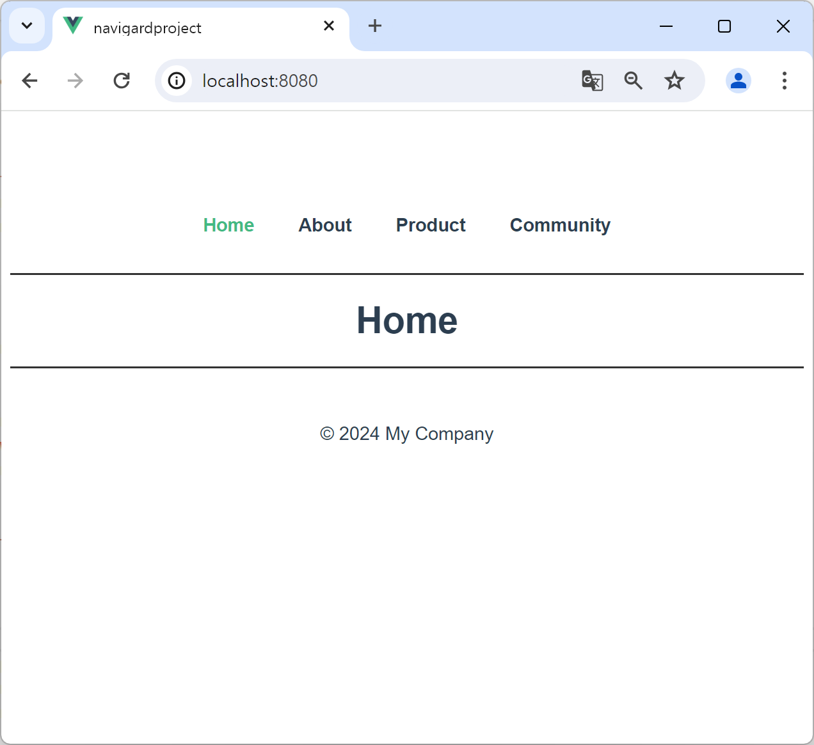

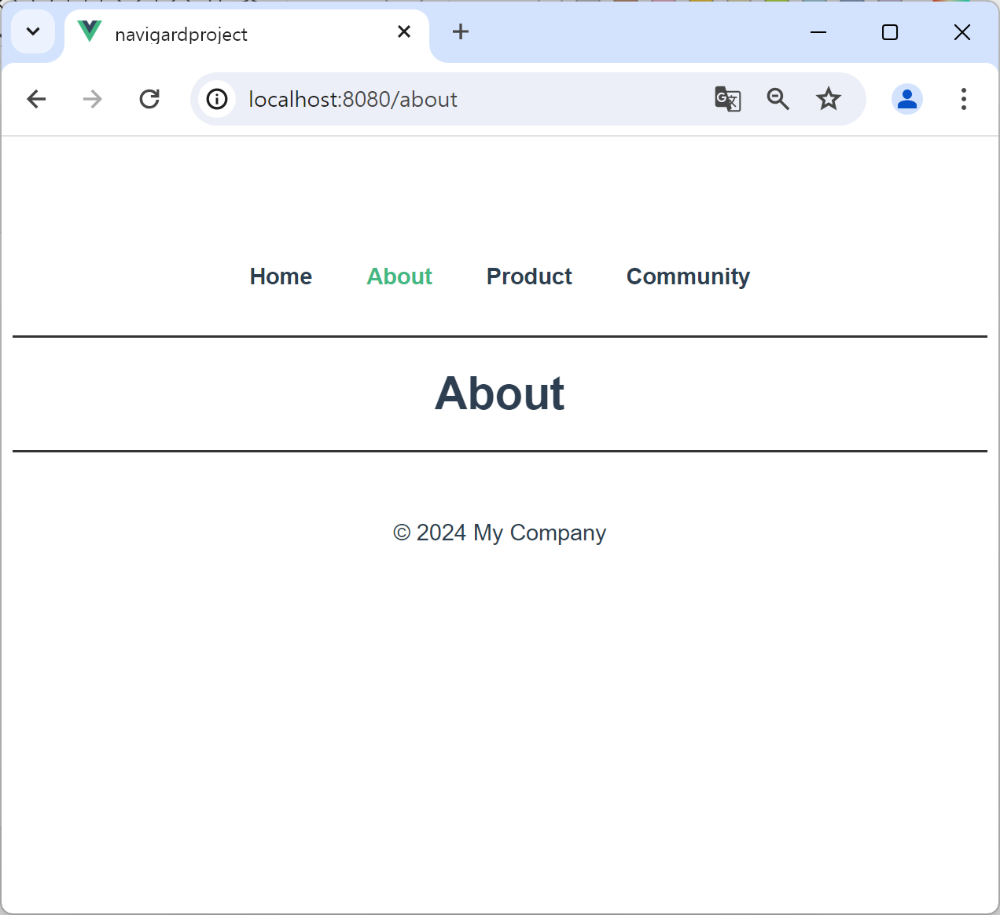

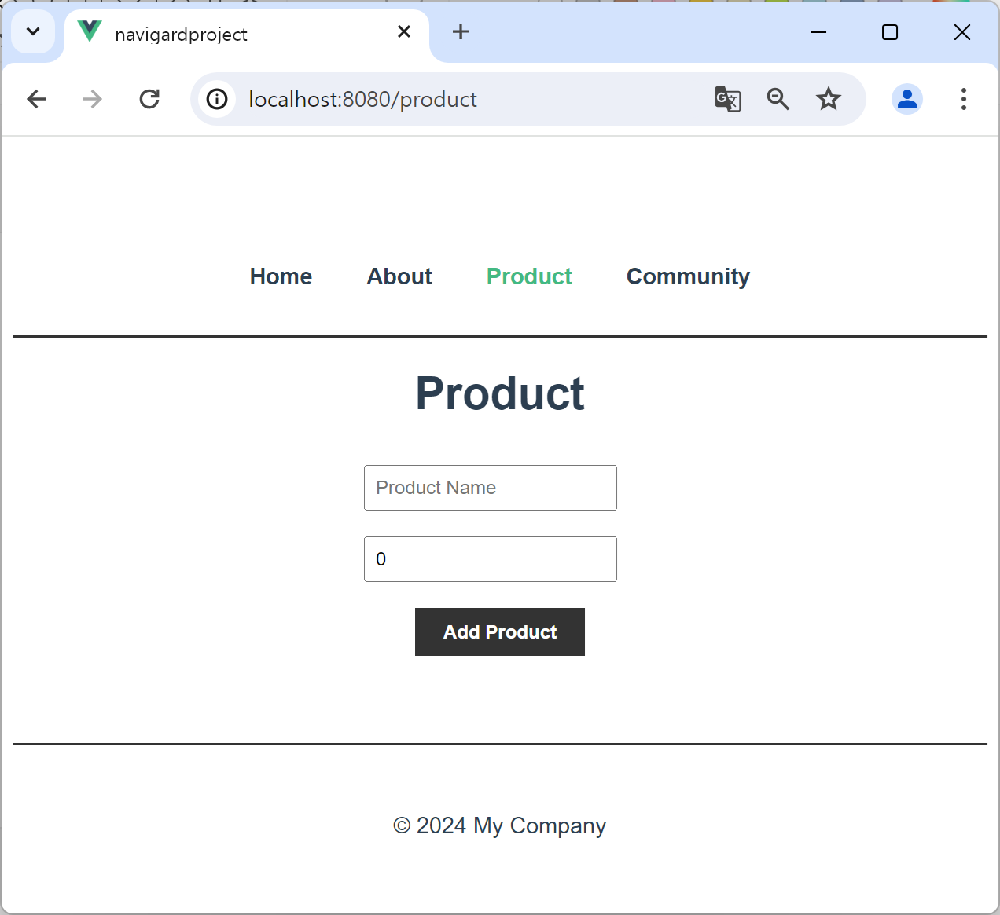

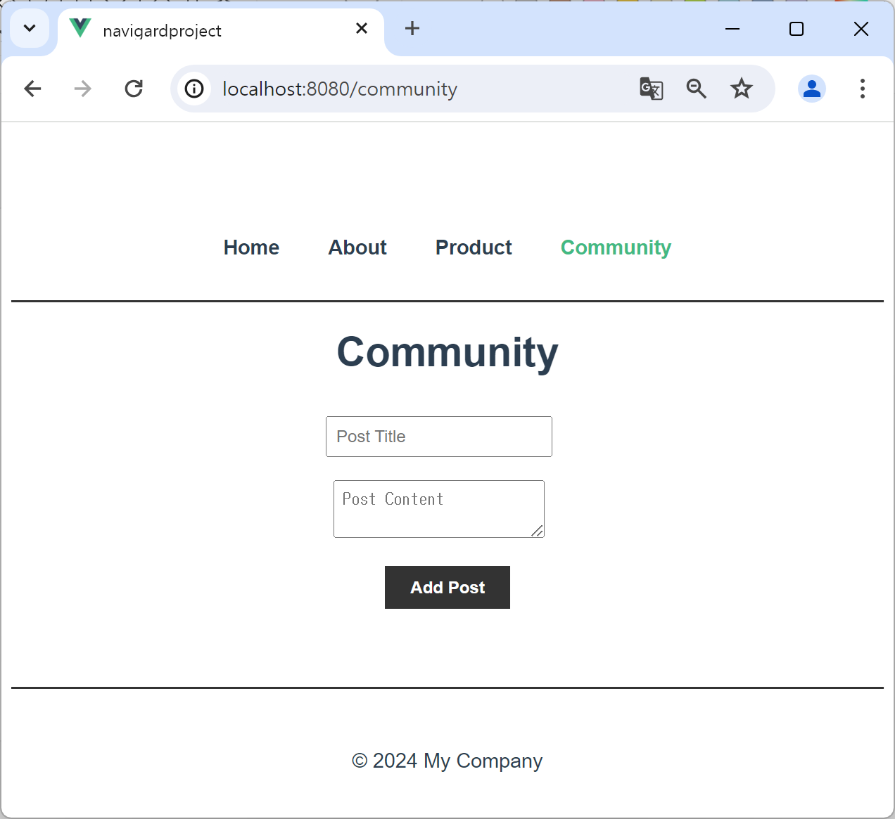


<br><br><br>

## 5-11. Route 를 활용한 메뉴 구성

```html
    <nav id="gnb">
        <ul class="menu">
            <li>
                <a href="/company" class="dp1">Company</a>
                <ul class="sub">
                    <li><a href="/company/intro">회사소개</a></li>
                    <li><a href="/company/hitory">회사연혁</a></li>
                    <li><a href="/company/greetings">인사말</a></li>
                    <li><a href="/company/organization">조직</a></li>
                </ul>
            </li>
            <li>
                <a href="/product" class="dp1">Product</a>
                <ul class="sub">
                    <li><a href="/product/a01">도서</a></li>
                    <li><a href="/product/b01">문구</a></li>
                    <li><a href="/product/c01">학습</a></li>
                    <li><a href="/product/d01">액세사리</a></li>
                </ul>
            </li>
            <li>
                <a href="/service" class="dp1">Service</a>
                <ul class="sub">
                    <li><a href="/service/online">온라인 서비스</a></li>
                    <li><a href="/service/visit">방문 서비스</a></li>
                    <li><a href="/service/delivery">택배 서비스</a></li>
                    <li><a href="/service/reservation">시설 이용 예약 서비스</a></li>
                </ul>
            </li>
            <li>
                <a href="/community" class="dp1">Cummunity</a>
                <ul class="sub">
                    <li><a href="/community/notice">공지사항</a></li>
                    <li><a href="/community/qna">질문 및 답변</a></li>
                    <li><a href="/community/faq">자주하는 질문</a></li>
                    <li><a href="/community/online">온라인 상담</a></li>
                    <li><a href="/community/chatbot">챗봇 상담</a></li>
                </ul>
            </li>
        </ul>
    </nav>
```

<div style="font-size:32px;color:red;"> 위와 같은 html에서 작성된 메뉴를 Vue 에서의 코드로 변환하도록 하겠습니다.</div>

### 5-11-1. 프로젝트 생성

```bash
D:\gitRepository\vuejs\study05>vue create routemenuproject

Vue CLI v5.0.8
? Please pick a preset: Manually select features
? Check the features needed for your project: Babel, TS, Router, Vuex
? Choose a version of Vue.js that you want to start the project with 3.x
? Use class-style component syntax? No
? Use Babel alongside TypeScript (required for modern mode, auto-detected polyfills, transpiling JSX)? Yes
? Use history mode for router? (Requires proper server setup for index fallback in production) Yes
? Where do you prefer placing config for Babel, ESLint, etc.? In package.json
? Save this as a preset for future projects? No
```

<br><br>

#### 15-11-1-1. 프로젝트의 구조

```lua
src/
|-- assets/
|-- components/
|-- views/
|   |-- company/
|   |   |-- Intro.vue
|   |   |-- History.vue
|   |   |-- Greetings.vue
|   |   |-- Organization.vue
|   |-- product/
|   |   |-- A01.vue
|   |   |-- B01.vue
|   |   |-- C01.vue
|   |   |-- D01.vue
|   |-- service/
|   |   |-- Online.vue
|   |   |-- Visit.vue
|   |   |-- Delivery.vue
|   |   |-- Reservation.vue
|   |-- community/
|   |   |-- Notice.vue
|   |   |-- QnA.vue
|   |   |-- FAQ.vue
|   |   |-- Online.vue
|   |   |-- Chatbot.vue
|   |-- Home.vue
|   |-- Company.vue
|   |-- Product.vue
|   |-- Service.vue
|   |-- Community.vue
|-- App.vue
|-- main.ts
|-- router/
|   |-- index.ts
```

<br><br>

### 5-11-2. 라우트 설정

- 라우트 설정을 위해 src/router/index.ts 파일을 생성하고, 다음과 같이 라우트를 설정합니다.

```typescript
import { createRouter, createWebHistory } from 'vue-router';
import Home from '../views/Home.vue';
import Company from '../views/Company.vue';
import CompanyIntro from '../views/company/Intro.vue';
import CompanyHistory from '../views/company/History.vue';
import CompanyGreetings from '../views/company/Greetings.vue';
import CompanyOrganization from '../views/company/Organization.vue';
import Product from '../views/Product.vue';
import ProductA01 from '../views/product/A01.vue';
import ProductB01 from '../views/product/B01.vue';
import ProductC01 from '../views/product/C01.vue';
import ProductD01 from '../views/product/D01.vue';
import Service from '../views/Service.vue';
import ServiceOnline from '../views/service/Online.vue';
import ServiceVisit from '../views/service/Visit.vue';
import ServiceDelivery from '../views/service/Delivery.vue';
import ServiceReservation from '../views/service/Reservation.vue';
import Community from '../views/Community.vue';
import CommunityNotice from '../views/community/Notice.vue';
import CommunityQnA from '../views/community/QnA.vue';
import CommunityFAQ from '../views/community/FAQ.vue';
import CommunityOnline from '../views/community/Online.vue';
import CommunityChatbot from '../views/community/Chatbot.vue';

const routes = [
  { path: '/', component: Home },
  { path: '/company', component: Company,
    children: [
      { path: 'intro', component: CompanyIntro },
      { path: 'history', component: CompanyHistory },
      { path: 'greetings', component: CompanyGreetings },
      { path: 'organization', component: CompanyOrganization }
    ]
  },
  { path: '/product', component: Product,
    children: [
      { path: 'a01', component: ProductA01 },
      { path: 'b01', component: ProductB01 },
      { path: 'c01', component: ProductC01 },
      { path: 'd01', component: ProductD01 }
    ]
  },
  { path: '/service', component: Service,
    children: [
      { path: 'online', component: ServiceOnline },
      { path: 'visit', component: ServiceVisit },
      { path: 'delivery', component: ServiceDelivery },
      { path: 'reservation', component: ServiceReservation }
    ]
  },
  { path: '/community', component: Community,
    children: [
      { path: 'notice', component: CommunityNotice },
      { path: 'qna', component: CommunityQnA },
      { path: 'faq', component: CommunityFAQ },
      { path: 'online', component: CommunityOnline },
      { path: 'chatbot', component: CommunityChatbot }
    ]
  }
];

const router = createRouter({
  history: createWebHistory(),
  routes
});

export default router;
```

<br><br>

### 5-11-3. App.vue 업데이트

- App.vue 파일을 업데이트하여 네비게이션 메뉴와 `<router-view>`를 추가합니다.

```html
<template>
  <div id="app">
    <nav id="gnb">
      <ul class="menu">
        <li>
          <router-link to="/company" class="dp1">Company</router-link>
          <ul class="sub">
            <li><router-link to="/company/intro">회사소개</router-link></li>
            <li><router-link to="/company/history">회사연혁</router-link></li>
            <li><router-link to="/company/greetings">인사말</router-link></li>
            <li><router-link to="/company/organization">조직</router-link></li>
          </ul>
        </li>
        <li>
          <router-link to="/product" class="dp1">Product</router-link>
          <ul class="sub">
            <li><router-link to="/product/a01">도서</router-link></li>
            <li><router-link to="/product/b01">문구</router-link></li>
            <li><router-link to="/product/c01">학습</router-link></li>
            <li><router-link to="/product/d01">액세사리</router-link></li>
          </ul>
        </li>
        <li>
          <router-link to="/service" class="dp1">Service</router-link>
          <ul class="sub">
            <li><router-link to="/service/online">온라인 서비스</router-link></li>
            <li><router-link to="/service/visit">방문 서비스</router-link></li>
            <li><router-link to="/service/delivery">택배 서비스</router-link></li>
            <li><router-link to="/service/reservation">시설 이용 예약 서비스</router-link></li>
          </ul>
        </li>
        <li>
          <router-link to="/community" class="dp1">Community</router-link>
          <ul class="sub">
            <li><router-link to="/community/notice">공지사항</router-link></li>
            <li><router-link to="/community/qna">질문 및 답변</router-link></li>
            <li><router-link to="/community/faq">자주하는 질문</router-link></li>
            <li><router-link to="/community/online">온라인 상담</router-link></li>
            <li><router-link to="/community/chatbot">챗봇 상담</router-link></li>
          </ul>
        </li>
      </ul>
    </nav>
    <router-view></router-view>
  </div>
</template>

<script>
export default {
  name: 'App'
};
</script>

<style>
/* 스타일을 추가하세요 */
</style>
```

<br><br>

### 5-11-4. 네비게이션에 기입된 컴포넌트 작성

- 각 라우트에 대한 컴포넌트를 작성합니다.

**01. views/Home.vue**

```html
<template>
  <div>
    <h1>Home</h1>
  </div>
</template>

<script>
export default {
  name: 'Home'
};
</script>
```

<br>

**02. views/Company.vue**

```html
<template>
  <div>
    <h1>Company</h1>
    <router-view></router-view>
  </div>
</template>

<script>
export default {
  name: 'Company'
};
</script>
```

<br>

**03. views/company/Intro.vue**

```html
<template>
  <div>
    <h1>회사소개</h1>
  </div>
</template>

<script>
export default {
  name: 'CompanyIntro'
};
</script>
```

<br>

**04. views/company/History.vue**

```html
<template>
  <div>
    <h1>회사연혁</h1>
  </div>
</template>

<script>
export default {
  name: 'CompanyHistory'
};
</script>
```

<br>

**05. views/company/Greetings.vue**

```html
<template>
  <div>
    <h1>인사말</h1>
  </div>
</template>

<script>
export default {
  name: 'CompanyGreetings'
};
</script>
```

<br>

**06. views/company/Organization.vue**

```html
<template>
  <div>
    <h1>조직</h1>
  </div>
</template>

<script>
export default {
  name: 'CompanyOrganization'
};
</script>
```

<br>

**07. views/Product.vue**

```html
<template>
  <div>
    <h1>Product</h1>
    <router-view></router-view>
  </div>
</template>

<script>
export default {
  name: 'Product'
};
</script>
```

<br>

**08. views/product/A01.vue**

```html
<template>
  <div>
    <h1>도서</h1>
  </div>
</template>

<script>
export default {
  name: 'ProductA01'
};
</script>
```

<br>

**09. views/product/B01.vue**

```html
<template>
  <div>
    <h1>문구</h1>
  </div>
</template>

<script>
export default {
  name: 'ProductB01'
};
</script>
```

<br>

**10. views/product/C01.vue**

```html
<template>
  <div>
    <h1>학습</h1>
  </div>
</template>

<script>
export default {
  name: 'ProductC01'
};
</script>
```

<br>

**11. views/product/D01.vue**

```html
<template>
  <div>
    <h1>액세사리</h1>
  </div>
</template>

<script>
export default {
  name: 'ProductD01'
};
</script>
```

<br>

**12. views/Service.vue**

```html
<template>
  <div>
    <h1>Service</h1>
    <router-view></router-view>
  </div>
</template>

<script>
export default {
  name: 'Service'
};
</script>
```

<br>

**13. views/service/Online.vue**

```html
<template>
  <div>
    <h1>온라인 서비스</h1>
  </div>
</template>

<script>
export default {
  name: 'ServiceOnline'
};
</script>
```

<br>

**14. views/service/Visit.vue**

```html
<template>
  <div>
    <h1>방문 서비스</h1>
  </div>
</template>

<script>
export default {
  name: 'ServiceVisit'
};
</script>
```

<br>

**15. views/service/Delivery.vue**

```html
<template>
  <div>
    <h1>택배 서비스</h1>
  </div>
</template>

<script>
export default {
  name: 'ServiceDelivery'
};
</script>
```

<br>

**16. views/service/Reservation.vue**

```html
<template>
  <div>
    <h1>시설 이용 예약 서비스</h1>
  </div>
</template>

<script>
export default {
  name: 'ServiceReservation'
};
</script>
```

<br>

**17. views/Community.vue**

```html
<template>
  <div>
    <h1>Community</h1>
    <router-view></router-view>
  </div>
</template>

<script>
export default {
  name: 'Community'
};
</script>
```

<br>

**18. views/community/Notice.vue**

```html
<template>
  <div>
    <h1>공지사항</h1>
  </div>
</template>

<script>
export default {
  name: 'CommunityNotice'
};
</script>
```

<br>

**19. views/community/QnA.vue**

```html
<template>
  <div>
    <h1>질문 및 답변</h1>
  </div>
</template>

<script>
export default {
  name: 'CommunityQnA'
};
</script>
```

<br>

**20. views/community/FAQ.vue**

```html
<template>
  <div>
    <h1>자주하는 질문</h1>
  </div>
</template>

<script>
export default {
  name: 'CommunityFAQ'
};
</script>
```

<br>

**21. views/community/Online.vue**

```html
<template>
  <div>
    <h1>온라인 상담</h1>
  </div>
</template>

<script>
export default {
  name: 'CommunityOnline'
};
</script>
```

<br>

**22. views/community/Chatbot.vue**

```html
<template>
  <div>
    <h1>챗봇 상담</h1>
  </div>
</template>

<script>
export default {
  name: 'CommunityChatbot'
};
</script>
```

<br>

**애플리케이션 실행**

```shell
D:\gitRepository\vuejs\study05>cd routemenuproject

D:\gitRepository\vuejs\study05\routemenuproject>npm run serve

> dynamicproject@0.1.0 serve
> vue-cli-service serve

 INFO  Starting development server...

 DONE  Compiled successfully in 1838ms                                                                      오후 7:04:28

  App running at:
  - Local:   http://localhost:8080/
  - Network: http://192.168.0.9:8080/

  Note that the development build is not optimized.
  To create a production build, run npm run build.

Issues checking in progress...
No issues found.
```

<br>

**프로젝트 브라우저에서 열기**

1. 브라우저의 주소 입력줄에 `http://localhost:8080/` 을 입력한다.
2. 나타난 화면에서 Company / Product / Service / Community 를 각 각 클릭해본다.
3. 각 페이지에서 서브 메뉴를 클릭한다.

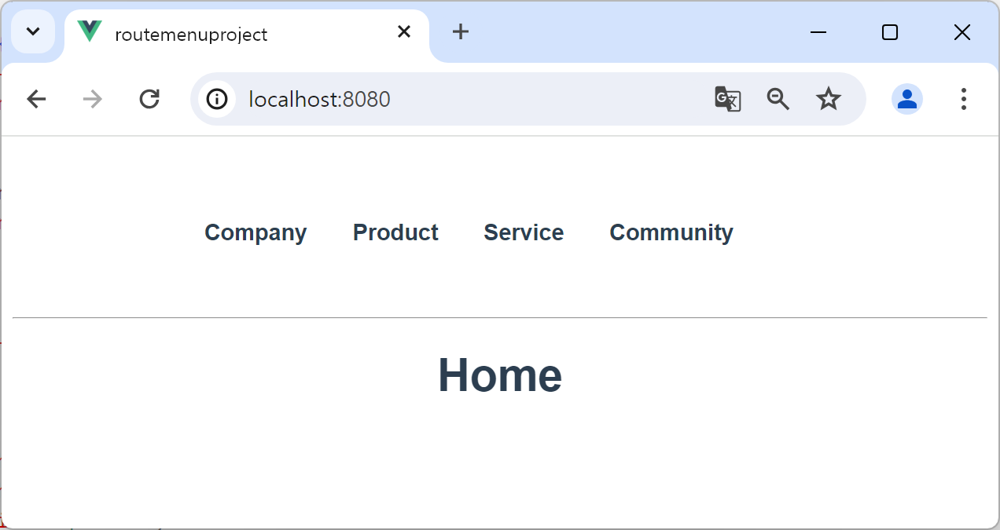

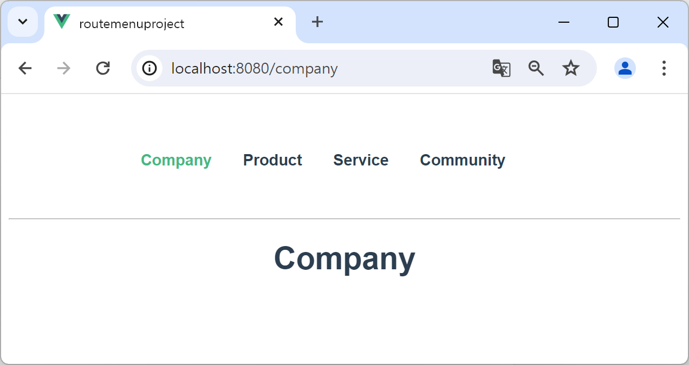

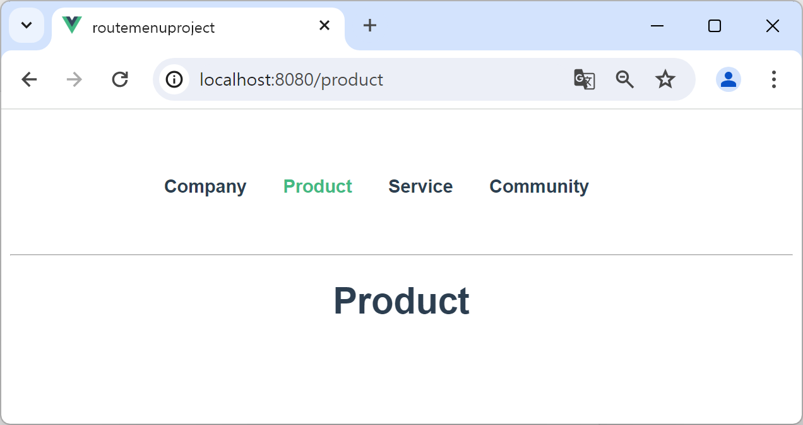

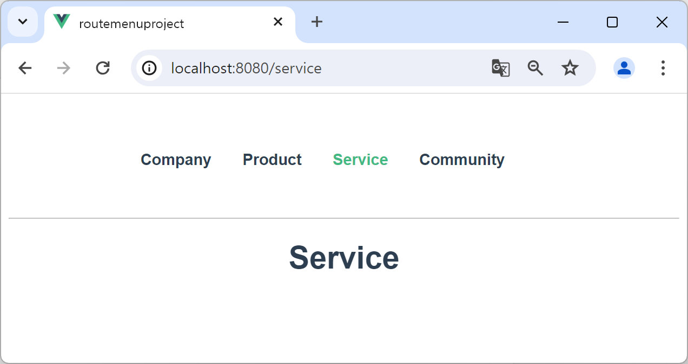

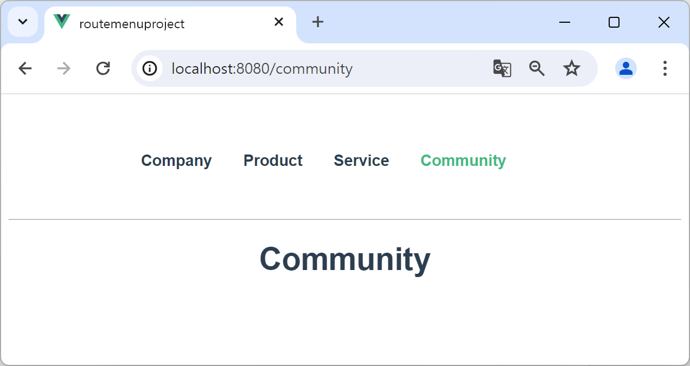


<br><br><br>

## 5-12. Axios

- Axios를 사용하면 Vue.js 애플리케이션에서 HTTP 요청을 효율적으로 관리할 수 있습니다.

**Axios 구성 요소**

| 구성 요소       | 설명                                                                 | 기본 문법 및 예시 코드                                                                                                     |
|----------------|--------------------------------------------------------------------|--------------------------------------------------------------------------------------------------------------------------|
| **Axios 인스턴스** | Axios는 기본 인스턴스 외에도 설정을 커스터마이징한 인스턴스를 생성할 수 있습니다. | ```javascript<br>import axios from 'axios';<br>const instance = axios.create({<br>  baseURL: 'https://api.example.com',<br>  timeout: 1000,<br>  headers: {'X-Custom-Header': 'foobar'}<br>});<br>``` |
| **요청 메서드**   | Axios는 GET, POST, PUT, DELETE 등 다양한 HTTP 요청 메서드를 지원합니다. | ```javascript<br>axios.get('/user?ID=12345')<br>  .then(response => {<br>    console.log(response);<br>  })<br>  .catch(error => {<br>    console.log(error);<br>  });<br>``` |
| **응답 인터셉터** | 요청이나 응답을 가로채고 처리할 수 있는 메서드입니다.                               | ```javascript<br>axios.interceptors.response.use(function (response) {<br>  // 응답 데이터 가공<br>  return response;<br>}, function (error) {<br>  // 오류 응답 처리<br>  return Promise.reject(error);<br>});<br>``` |
| **요청 취소**    | Axios는 요청을 취소할 수 있는 기능을 제공합니다.                                     | ```javascript<br>const CancelToken = axios.CancelToken;<br>const source = CancelToken.source();<br>axios.get('/user/12345', {<br>  cancelToken: source.token<br>})<br>  .catch(function (thrown) {<br>    if (axios.isCancel(thrown)) {<br>      console.log('Request canceled', thrown.message);<br>    } else {<br>      // handle error<br>    }<br>  });<br>source.cancel('Operation canceled by the user.');<br>``` |
| **병렬 요청**    | 여러 요청을 병렬로 처리할 수 있습니다.                                               | ```javascript<br>function getUserAccount() {<br>  return axios.get('/user/12345');<br>}<br>function getUserPermissions() {<br>  return axios.get('/user/12345/permissions');<br>}<br>axios.all([getUserAccount(), getUserPermissions()])<br>  .then(axios.spread(function (acct, perms) {<br>    // 두 요청이 모두 완료될 때 실행<br>  }));<br>``` |

<br><br>

### 5-12-1. Axios를 Vue.js와 함께 사용하기

#### 5-12-1-1. Axios 설치

```bash
npm install axios
```

<br>

#### 5-12-1-2. Axios 기본 설정

```javascript
// main.js
import { createApp } from 'vue';
import App from './App.vue';
import axios from 'axios';

const app = createApp(App);

// Axios를 Vue 애플리케이션에 플러그인으로 추가
app.config.globalProperties.$axios = axios;

app.mount('#app');
```

<br>

#### 5-12-1-3. 컴포넌트에서의 사용 예시

```javascript
<template>
  <div>
    <h1>{{ user.name }}</h1>
  </div>
</template>

<script>
export default {
  data() {
    return {
      user: {}
    };
  },
  created() {
    this.fetchData();
  },
  methods: {
    async fetchData() {
      try {
        const response = await this.$axios.get('https://api.example.com/user/12345');
        this.user = response.data;
      } catch (error) {
        console.error(error);
      }
    }
  }
};
</script>
```

<br><br>

### 5-12-2. Axios 의 메소드

| 메소드명      | 기본 문법                                                      | 설명                                                                 | 사용 예시                                                                                   |
|--------------|----------------------------------------------------------------|--------------------------------------------------------------------|------------------------------------------------------------------------------------------|
| **axios.get** | `axios.get(url[, config])`                                      | 지정된 URL로 GET 요청을 보냅니다.                                      | ```javascript<br>axios.get('/user?ID=12345')<br>  .then(response => {<br>    console.log(response);<br>  })<br>  .catch(error => {<br>    console.log(error);<br>  });<br>``` |
| **axios.post** | `axios.post(url[, data[, config]])`                            | 지정된 URL로 POST 요청을 보냅니다.                                    | ```javascript<br>axios.post('/user', {<br>  firstName: 'Fred',<br>  lastName: 'Flintstone'<br>})<br>  .then(response => {<br>    console.log(response);<br>  })<br>  .catch(error => {<br>    console.log(error);<br>  });<br>``` |
| **axios.put** | `axios.put(url[, data[, config]])`                              | 지정된 URL로 PUT 요청을 보냅니다.                                     | ```javascript<br>axios.put('/user/12345', {<br>  firstName: 'Fred',<br>  lastName: 'Flintstone'<br>})<br>  .then(response => {<br>    console.log(response);<br>  })<br>  .catch(error => {<br>    console.log(error);<br>  });<br>``` |
| **axios.delete** | `axios.delete(url[, config])`                                    | 지정된 URL로 DELETE 요청을 보냅니다.                                  | ```javascript<br>axios.delete('/user/12345')<br>  .then(response => {<br>    console.log(response);<br>  })<br>  .catch(error => {<br>    console.log(error);<br>  });<br>``` |
| **axios.head** | `axios.head(url[, config])`                                      | 지정된 URL로 HEAD 요청을 보냅니다.                                    | ```javascript<br>axios.head('/user?ID=12345')<br>  .then(response => {<br>    console.log(response);<br>  })<br>  .catch(error => {<br>    console.log(error);<br>  });<br>``` |
| **axios.patch** | `axios.patch(url[, data[, config]])`                            | 지정된 URL로 PATCH 요청을 보냅니다.                                   | ```javascript<br>axios.patch('/user/12345', {<br>  firstName: 'Fred'<br>})<br>  .then(response => {<br>    console.log(response);<br>  })<br>  .catch(error => {<br>    console.log(error);<br>  });<br>``` |
| **axios.options** | `axios.options(url[, config])`                                    | 지정된 URL로 OPTIONS 요청을 보냅니다.                                 | ```javascript<br>axios.options('/user?ID=12345')<br>  .then(response => {<br>    console.log(response);<br>  })<br>  .catch(error => {<br>    console.log(error);<br>  });<br>``` |
| **axios.request** | `axios.request(config)`                                           | 설정을 바탕으로 요청을 보냅니다.                                      | ```javascript<br>axios.request({<br>  method: 'get',<br>  url: '/user/12345'<br>})<br>  .then(response => {<br>    console.log(response);<br>  })<br>  .catch(error => {<br>    console.log(error);<br>  });<br>``` |
| **axios.create** | `axios.create([config])`                                          | 새로운 Axios 인스턴스를 생성합니다.                                    | ```javascript<br>const instance = axios.create({<br>  baseURL: 'https://api.example.com'<br>});<br>instance.get('/user/12345');<br>``` |
| **axios.all** | `axios.all(iterable)`                                             | 여러 요청을 병렬로 수행합니다.                                         | ```javascript<br>axios.all([<br>  axios.get('/user/12345'),<br>  axios.get('/user/67890')<br>])<br>  .then(axios.spread((acct, perms) => {<br>    console.log(acct, perms);<br>  }));<br>``` |
| **axios.spread** | `axios.spread(callback)`                                           | 여러 요청의 응답을 분리된 인수로 전달하는 헬퍼 함수입니다.                     | ```javascript<br>function getUserAccount() {<br>  return axios.get('/user/12345');<br>}<br>function getUserPermissions() {<br>  return axios.get('/user/12345/permissions');<br>}<br>axios.all([getUserAccount(), getUserPermissions()])<br>  .then(axios.spread((acct, perms) => {<br>    console.log(acct, perms);<br>  }));<br>``` |
| **axios.interceptors** | `axios.interceptors`                                             | 요청 및 응답을 가로채고 처리하는 인터셉터를 정의할 수 있습니다.                    | ```javascript<br>axios.interceptors.request.use(config => {<br>  console.log('Request made with ', config);<br>  return config;<br>}, error => {<br>  return Promise.reject(error);<br>});<br>``` |

<br>

#### 5-12-2-1. axios.get()

- 지정된 URL로 GET 요청을 보냅니다.

**문법**

```javascript
axios.get(url[, config])
```

<br>

**예시 코드**

```javascript
axios.get('/user?ID=12345')
  .then(response => {
    console.log(response);
  })
  .catch(error => {
    console.log(error);
  });
```

<br>

#### 5-12-2-2. axios.post()

- 지정된 URL로 POST 요청을 보냅니다.

**문법**

```javascript
axios.post(url[, data[, config]])
```

<br>

**예시 코드**

```javascript
axios.post('/user', {
  firstName: 'Fred',
  lastName: 'Flintstone'
})
  .then(response => {
    console.log(response);
  })
  .catch(error => {
    console.log(error);
  });
```

<br>

#### 5-12-2-3. axios.put()

- 지정된 URL로 PUT 요청을 보냅니다.

**문법** 

```
axios.put(url[, data[, config]])
```

<br>

**예시 코드**

```javascript
axios.put('/user/12345', {
  firstName: 'Fred',
  lastName: 'Flintstone'
})
  .then(response => {
    console.log(response);
  })
  .catch(error => {
    console.log(error);
  });
```

<br>

#### 5-12-2-4. axios.delete()

- 지정된 URL로 DELETE 요청을 보냅니다.

**문법**

```javascript
axios.delete(url[, config])
```

<br>

**예시 코드**

```javascript
axios.delete('/user/12345')
  .then(response => {
    console.log(response);
  })
  .catch(error => {
    console.log(error);
  });
```

<br>

#### 5-12-2-5. axios.head()

- 지정된 URL로 HEAD 요청을 보냅니다.

**문법**

```javascript
axios.head(url[, config])
```


<br>

**예시 코드**

```javascript
axios.head('/user?ID=12345')
  .then(response => {
    console.log(response);
  })
  .catch(error => {
    console.log(error);
  });
```

<br>

#### 5-12-2-6. axios.patch()

- 지정된 URL로 PATCH 요청을 보냅니다.

**문법**

```javascript
axios.patch(url[, data[, config]])
```

<br>

**예시 코드**

```javascript
axios.patch('/user/12345', {
  firstName: 'Fred'
})
  .then(response => {
    console.log(response);
  })
  .catch(error => {
    console.log(error);
  });
```

<br>

#### 5-12-2-7. axios.options()

- 지정된 URL로 OPTIONS 요청을 보냅니다.

**문법**

```javascript
axios.options(url[, config])
```

<br>

**예시 코드**

```javascript
axios.options('/user?ID=12345')
  .then(response => {
    console.log(response);
  })
  .catch(error => {
    console.log(error);
  });
```

<br>

#### 5-12-2-8. axios.request()

- 설정을 바탕으로 요청을 보냅니다.

**문법**

```javascript
axios.request(config)
```

<br>

**예시 코드**

```javascript
axios.request({
  method: 'get',
  url: '/user/12345'
})
  .then(response => {
    console.log(response);
  })
  .catch(error => {
    console.log(error);
  });
```

<br>

#### 5-12-2-9. axios.create()

- 새로운 Axios 인스턴스를 생성합니다.

**문법**

```javascript
axios.create([config])
```

<br>

**예시 코드**

```javascript
const instance = axios.create({
  baseURL: 'https://api.example.com'
});

instance.get('/user/12345')
  .then(response => {
    console.log(response);
  })
  .catch(error => {
    console.log(error);
  });
```

<br>

#### 5-12-2-10. axios.all()

- 여러 요청을 병렬로 수행합니다.

**문법**

```javascript
axios.all(iterable)
```

<br>

**예시 코드**

```javascript
axios.all([
  axios.get('/user/12345'),
  axios.get('/user/67890')
])
  .then(axios.spread((acct, perms) => {
    console.log(acct);
    console.log(perms);
  }));
```

<br>

#### 5-12-2-11. axios.spread()

- 여러 요청의 응답을 분리된 인수로 전달하는 헬퍼 함수입니다.

**문법**

```javascript
axios.spread(callback)
```

<br>


**예시 코드**

```javascript
function getUserAccount() {
  return axios.get('/user/12345');
}

function getUserPermissions() {
  return axios.get('/user/12345/permissions');
}

axios.all([getUserAccount(), getUserPermissions()])
  .then(axios.spread((acct, perms) => {
    console.log(acct);
    console.log(perms);
  }));
```

<br>

#### 5-12-2-12. axios.interceptors

- 요청 및 응답을 가로채고 처리하는 인터셉터를 정의할 수 있습니다.

**문법**

```javascript
axios.interceptors.request.use(onFulfilled, onRejected) 및 axios.interceptors.response.use(onFulfilled, onRejected)
```

<br>

**예시 코드**

```javascript
// 요청 인터셉터
axios.interceptors.request.use(config => {
  console.log('Request made with ', config);
  return config;
}, error => {
  return Promise.reject(error);
});

// 응답 인터셉터
axios.interceptors.response.use(response => {
  console.log('Response received', response);
  return response;
}, error => {
  return Promise.reject(error);
});
```

<br><br>

### 5-12-3. Axios 를 활용한 애플리케이션 제작 실습

**프로젝트 생성**

```shell
D:\gitRepository\vuejs\study05>vue create axiosproject

Vue CLI v5.0.8
? Please pick a preset: Manually select features
? Check the features needed for your project: Babel, TS, Router, Vuex
? Choose a version of Vue.js that you want to start the project with 3.x
? Use class-style component syntax? No
? Use Babel alongside TypeScript (required for modern mode, auto-detected polyfills, transpiling JSX)? Yes
? Use history mode for router? (Requires proper server setup for index fallback in production) Yes
? Where do you prefer placing config for Babel, ESLint, etc.? In package.json
? Save this as a preset for future projects? No
```

<br>

**필요한 라이브러리 및 패키지 설치**

```shell
npm install axios
```

<br>

**프로젝트 구조**

```lua
axiosproject
├── babel.config.js
├── package.json
├── public
│   └── index.html
├── src
│   ├── components
│   │   ├── Footer.vue
│   │   └── Header.vue
│   ├── main.ts
│   ├── model
│   │   └── index.ts
│   ├── router
│   │   └── index.ts
│   ├── shims-vue.d.ts
│   ├── store
│   │   ├── actions.ts
│   │   ├── index.ts
│   │   ├── mutations.ts
│   │   └── state.ts
│   ├── views
│   │   ├── About.vue
│   │   ├── Community.vue
│   │   ├── Home.vue
│   │   └── Product.vue
│   └── App.vue
├── tsconfig.json
└── vue.config.js
```

<br>

**package.json**

```json
{
  "name": "axiosproject",
  "version": "0.1.0",
  "private": true,
  "scripts": {
    "serve": "vue-cli-service serve",
    "build": "vue-cli-service build"
  },
  "dependencies": {
    "core-js": "^3.8.3",
    "vue": "^3.2.13",
    "vue-router": "^4.0.3",
    "vuex": "^4.0.0"
  },
  "devDependencies": {
    "@vue/cli-plugin-babel": "~5.0.0",
    "@vue/cli-plugin-router": "~5.0.0",
    "@vue/cli-plugin-typescript": "~5.0.0",
    "@vue/cli-plugin-vuex": "~5.0.0",
    "@vue/cli-service": "~5.0.0",
    "axios": "^1.7.2",
    "typescript": "~4.5.5"
  },
  "browserslist": [
    "> 1%",
    "last 2 versions",
    "not dead",
    "not ie 11"
  ]
}
```

<br>

**babel.config.js**

```javascript
module.exports = {
  presets: [
    '@vue/cli-plugin-babel/preset'
  ]
};
```

<br>

**tsconfig.json**

```json
{
  "compilerOptions": {
    "target": "esnext",
    "module": "esnext",
    "strict": true,
    "jsx": "preserve",
    "importHelpers": true,
    "moduleResolution": "node",
    "esModuleInterop": true,
    "experimentalDecorators": true,
    "skipLibCheck": true,
    "forceConsistentCasingInFileNames": true,
    "useDefineForClassFields": true,
    "baseUrl": ".",
    "paths": {
      "@/*": ["src/*"]
    },
    "lib": ["esnext", "dom"]
  },
  "include": ["src/**/*.ts", "src/**/*.d.ts", "src/**/*.tsx", "src/**/*.vue"]
}
```

<br>

**vue.config.js**

```javascript
const { defineConfig } = require('@vue/cli-service')
module.exports = defineConfig({
  lintOnSave: false,
  transpileDependencies: true
})
```

<br>

**public/index.html**

```html
<!DOCTYPE html>
<html lang="en">
<head>
  <meta charset="UTF-8">
  <meta name="viewport" content="width=device-width, initial-scale=1.0">
  <title>axiosproject</title>
</head>
<body>
  <div id="app"></div>
</body>
</html>
```

<br>

**src/main.ts**

```typescript
import { createApp } from 'vue';
import App from './App.vue';
import router from './router';
import store from './store';
import axios from 'axios';

const app = createApp(App);

app.config.globalProperties.$axios = axios;

app.use(router);
app.use(store);
app.mount('#app');
```

<br>

**src/shims-vue.d.ts**

```typescript
declare module '*.vue' {
  import { DefineComponent } from 'vue';
  const component: DefineComponent<{}, {}, any>;
  export default component;
}
```

<br>

**src/components/Header.vue**

```vue
<template>
  <header>
    <nav>
      <router-link to="/">Home</router-link>
      <router-link to="/about">About</router-link>
      <router-link to="/product">Product</router-link>
      <router-link to="/community">Community</router-link>
    </nav>
  </header>
</template>

<script lang="ts">
import { defineComponent } from 'vue';

export default defineComponent({
  name: 'Header'
});
</script>

<style scoped>
nav {
  display: flex;
  gap: 10px;
}
</style>
```

<br>

**src/components/Footer.vue**

```vue
<template>
  <footer>
    <p>&copy; 2024 axiosproject</p>
  </footer>
</template>

<script lang="ts">
import { defineComponent } from 'vue';

export default defineComponent({
  name: 'Footer'
});
</script>

<style scoped>
footer {
  text-align: center;
  margin-top: 20px;
}
</style>
```

<br>

**src/App.vue**

```vue
<template>
  <div id="app">
    <Header />
    <router-view />
    <Footer />
  </div>
</template>

<script lang="ts">
import { defineComponent } from 'vue';
import Header from './components/Header.vue';
import Footer from './components/Footer.vue';

export default defineComponent({
  name: 'App',
  components: {
    Header,
    Footer
  }
});
</script>

<style>
#app {
  font-family: Avenir, Helvetica, Arial, sans-serif;
  -webkit-font-smoothing: antialiased;
  -moz-osx-font-smoothing: grayscale;
  text-align: center;
  color: #2c3e50;
  margin-top: 60px;
}
</style>
```

<br>

**src/model/index.ts**

```typescript
export interface Product {
  id: number;
  name: string;
  price: number;
}

export interface Post {
  id: number;
  title: string;
  content: string;
}
```

<br>

**src/router/index.ts**

```typescript
import { createRouter, createWebHistory } from 'vue-router';
import Home from '@/views/Home.vue';
import About from '@/views/About.vue';
import Product from '@/views/Product.vue';
import Community from '@/views/Community.vue';

const routes = [
  { path: '/', component: Home },
  { path: '/about', component: About },
  { path: '/product', component: Product },
  { path: '/community', component: Community }
];

const router = createRouter({
  history: createWebHistory(),
  routes
});

export default router;
```

<br>

**src/store/index.ts**

```typescript
import { createStore } from 'vuex';
import state from './state';
import actions from './actions';
import mutations from './mutations';

export default createStore({
  state,
  actions,
  mutations
});
```

<br>

**src/store/state.ts**

```typescript
import { Product, Post } from '@/model';

export interface State {
  products: Product[];
  posts: Post[];
}

const state: State = {
  products: [],
  posts: []
};

export default state;
```

<br>

**src/store/actions.ts**

```typescript
import { ActionTree } from 'vuex';
import { State } from './state';
import axios from 'axios';
import { Product, Post } from '@/model';

const actions: ActionTree<State, State> = {
  async addProduct({ commit }, product: Product) {
    // 임의의 API 호출
    const response = await axios.post('/api/products', product);
    commit('ADD_PRODUCT', response.data);
  },
  async deleteProduct({ commit }, id: number) {
    // 임의의 API 호출
    await axios.delete(`/api/products/${id}`);
    commit('DELETE_PRODUCT', id);
  },
  async addPost({ commit }, post: Post) {
    // 임의의 API 호출
    const response = await axios.post('/api/posts', post);
    commit('ADD_POST', response.data);
  },
  async deletePost({ commit }, id: number) {
    // 임의의 API 호출
    await axios.delete(`/api/posts/${id}`);
    commit('DELETE_POST', id);
  }
};

export default actions;
```

<br>

**src/store/mutations.ts**

```typescript
import { MutationTree } from 'vuex';
import { State } from './state';
import { Product, Post } from '@/model';

const mutations: MutationTree<State> = {
  ADD_PRODUCT(state, product: Product) {
    state.products.push(product);
  },
  DELETE_PRODUCT(state, id: number) {
    state.products = state.products.filter((product) => product.id !== id);
  },
  ADD_POST(state, post: Post) {
    state.posts.push(post);
  },
  DELETE_POST(state, id: number) {
    state.posts = state.posts.filter((post) => post.id !== id);
  }
};

export default mutations;
```

<br>

**src/views/Home.vue**

```vue
<template>
  <div>
    <h1>Home</h1>
    <p>Welcome to axiosproject!</p>
  </div>
</template>

<script lang="ts">
import { defineComponent } from 'vue';

export default defineComponent({
  name: 'Home'
});
</script>

<style scoped>
/* Add your styles here */
</style>
```

<br>

**src/views/About.vue**

```vue
<template>
  <div>
    <h1>About</h1>
    <p>This is an about page.</p>
  </div>
</template>

<script lang="ts">
import { defineComponent } from 'vue';

export default defineComponent({
  name: 'About'
});
</script>

<style scoped>
/* Add your styles here */
</style>
```

<br>

**src/views/Product.vue**

```vue
<template>
  <div>
    <h1>Product</h1>
    <div>
      <input v-model="newProduct.name" placeholder="Product Name" />
      <input v-model.number="newProduct.price" placeholder="Product Price" />
      <button @click="addProduct">Add Product</button>
    </div>
    <ul>
      <li v-for="product in products" :key="product.id">
        <router-link :to="{ name: 'ProductDetail', params: { id: product.id } }">{{ product.name }}</router-link>
        <button @click="deleteProduct(product.id)">Delete</button>
      </li>
    </ul>
  </div>
</template>

<script lang="ts">
import { defineComponent } from 'vue';
import { useStore } from 'vuex';
import { Product } from '@/model';

export default defineComponent({
  name: 'Product',
  data() {
    return {
      newProduct: {
        name: '',
        price: 0
      }
    };
  },
  computed: {
    products(): Product[] {
      return this.$store.state.products;
    }
  },
  methods: {
    async addProduct() {
      const product: Product = {
        id: Math.floor(Math.random() * 1000), // 임의의 ID 생성 (실제로는 서버에서 생성)
        name: this.newProduct.name,
        price: this.newProduct.price
      };
      await this.$store.dispatch('addProduct', product);
      this.newProduct.name = '';
      this.newProduct.price = 0;
    },
    async deleteProduct(id: number) {
      await this.$store.dispatch('deleteProduct', id);
    }
  }
});
</script>

<style scoped>
/* Add your styles here */
</style>
```

<br>

**src/views/Community.vue**

```vue
<template>
  <div>
    <h1>Community</h1>
    <div>
      <input v-model="newPost.title" placeholder="Post Title" />
      <textarea v-model="newPost.content" placeholder="Post Content"></textarea>
      <button @click="addPost">Add Post</button>
    </div>
    <ul>
      <li v-for="post in posts" :key="post.id">
        <router-link :to="{ name: 'PostDetail', params: { id: post.id } }">{{ post.title }}</router-link>
        <button @click="deletePost(post.id)">Delete</button>
      </li>
    </ul>
  </div>
</template>

<script lang="ts">
import { defineComponent } from 'vue';
import { useStore } from 'vuex';
import { Post } from '@/model';

export default defineComponent({
  name: 'Community',
  data() {
    return {
      newPost: {
        title: '',
        content: ''
      }
    };
  },
  computed: {
    posts(): Post[] {
      return this.$store.state.posts;
    }
  },
  methods: {
    async addPost() {
      const post: Post = {
        id: Math.floor(Math.random() * 1000), // 임의의 ID 생성 (실제로는 서버에서 생성)
        title: this.newPost.title,
        content: this.newPost.content
      };
      await this.$store.dispatch('addPost', post);
      this.newPost.title = '';
      this.newPost.content = '';
    },
    async deletePost(id: number) {
      await this.$store.dispatch('deletePost', id);
    }
  }
});
</script>

<style scoped>
/* Add your styles here */
</style>
```

<br>

**애플리케이션 실행**

```shell
D:\gitRepository\vuejs\study05>cd axiosproject

D:\gitRepository\vuejs\study05\axiosproject>npm run serve

> dynamicproject@0.1.0 serve
> vue-cli-service serve

 INFO  Starting development server...

 DONE  Compiled successfully in 1838ms                                                                      오후 7:04:28

  App running at:
  - Local:   http://localhost:8080/
  - Network: http://192.168.0.9:8080/

  Note that the development build is not optimized.
  To create a production build, run npm run build.

Issues checking in progress...
No issues found.
```

<br>

**프로젝트 브라우저에서 열기**

1. 브라우저의 주소 입력줄에 `http://localhost:8080/` 을 입력한다.
2. 나타난 화면에서 Home / About / Product / Community 를 각 각 클릭해본다.
3. 각 페이지에서 Replace to Home / Back / Forward 버튼 링크를 클릭해본다. 
4. Product 페이지에서 상품 추가, 상품 목록, 상품 상세보기, 상품 수정, 상품 제거를 진행해본다.
5. Community 페이지에서 글 추가, 글 목록, 글 상세보기, 글 수정, 글 제거를 진행해본다.

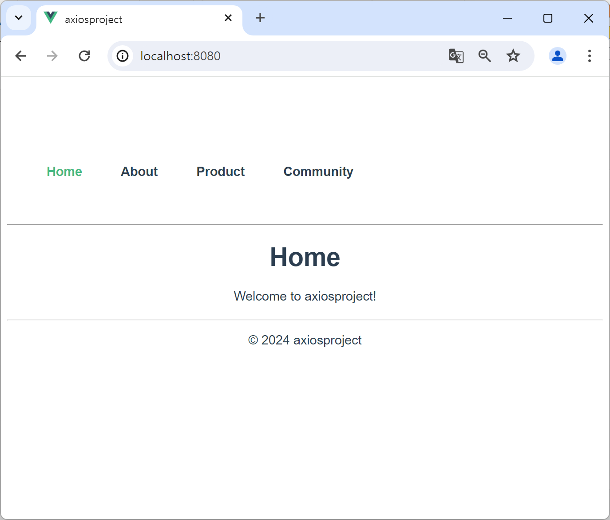

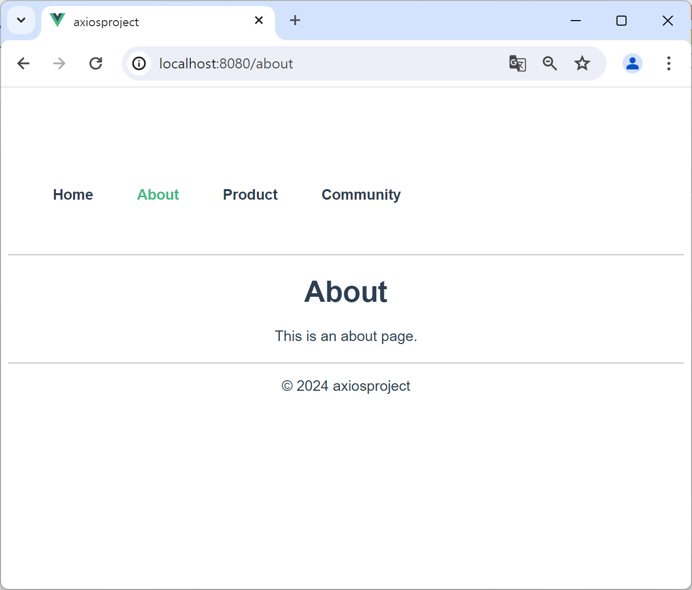

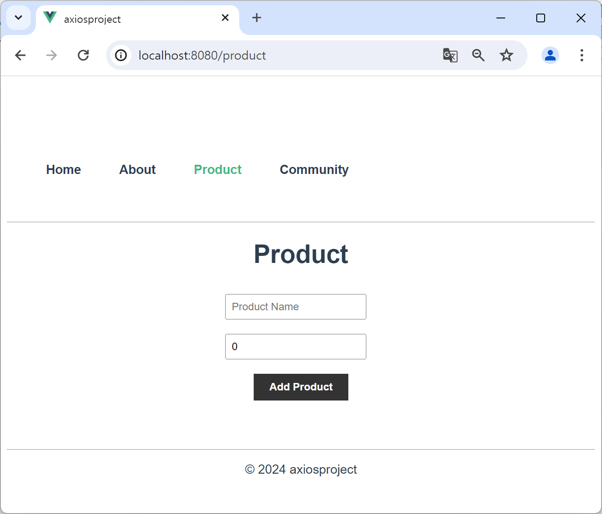

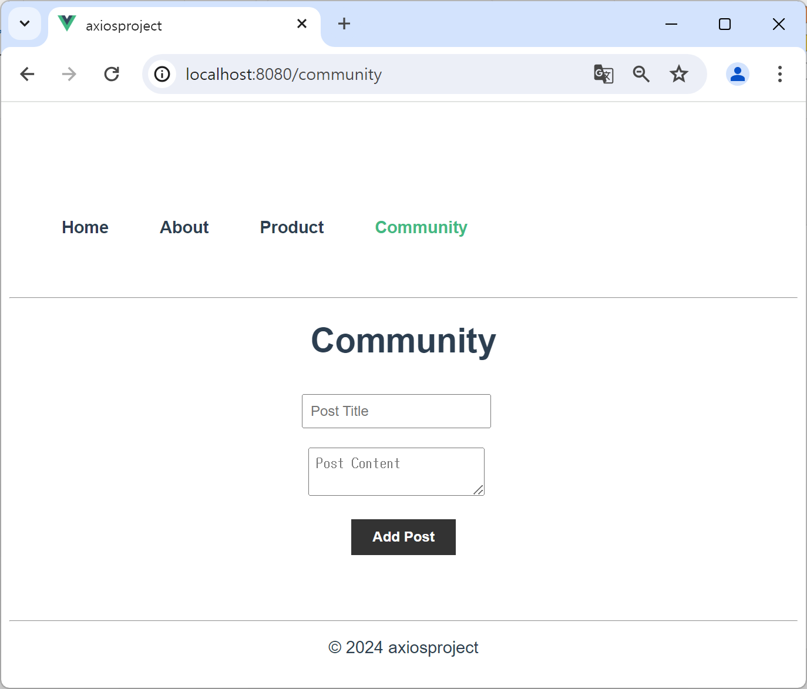

<br><br><br>

# 6. Vuejs에 CSS Framework 적용

## 6-1. Bootstrap 적용

### 6-1-1. Bootstrap 특징

- Bootstrap은 가장 인기 있는 오픈 소스 CSS 프레임워크 중 하나로, 다양한 웹 애플리케이션과 웹사이트의 프론트엔드를 쉽게 구축할 수 있도록 돕습니다. 
- Bootstrap은 빠르고 일관성 있는 UI 개발을 가능하게 하는 강력한 CSS 프레임워크입니다. 반응형 디자인, 다양한 컴포넌트, 풍부한 유틸리티 클래스 등을 통해 웹 개발의 생산성을 높여줍니다. 그러나 파일 크기, 디자인 유연성 제한, 오버라이딩 필요성 등의 단점도 고려해야 합니다. Bootstrap은 빠른 프로토타이핑과 일관된 디자인이 중요한 프로젝트에 특히 유용합니다.

<br>

**특징**

1. 반응형 디자인: Bootstrap은 기본적으로 반응형 디자인을 지원하며, 모바일 퍼스트 접근 방식을 채택합니다.
2. 컴포넌트 기반: 다양한 UI 컴포넌트(버튼, 네비게이션 바, 모달 등)를 제공하여 빠르게 인터페이스를 구축할 수 있습니다.
3. 그리드 시스템: 12열 기반의 유연한 그리드 시스템을 제공하여 다양한 레이아웃을 손쉽게 구현할 수 있습니다.
4. 풍부한 유틸리티 클래스: 마진, 패딩, 텍스트 정렬 등 다양한 유틸리티 클래스를 제공하여 스타일링을 쉽게 할 수 있습니다.
5. 커스터마이징 가능: SCSS 변수를 사용하여 손쉽게 테마와 스타일을 커스터마이징할 수 있습니다.
6. 크로스 브라우저 호환성: 다양한 최신 브라우저와 호환되도록 설계되었습니다.
7. 자바스크립트 플러그인: 다양한 자바스크립트 플러그인을 제공하여 동적인 웹 기능을 쉽게 추가할 수 있습니다.

<br>

**장점**

1. 빠른 개발 속도: 미리 정의된 스타일과 컴포넌트를 사용하여 빠르게 UI를 구축할 수 있습니다.
2. 일관성: 프레임워크 전체에서 일관된 디자인과 사용자 경험을 유지할 수 있습니다.
3. 광범위한 문서화: 자세한 문서와 예제 코드가 제공되어 학습과 활용이 용이합니다.
4. 커뮤니티 지원: 큰 사용자 커뮤니티 덕분에 다양한 리소스와 지원을 쉽게 찾을 수 있습니다.
5. 풍부한 컴포넌트: 버튼, 카드, 모달, 알림 등 다양한 UI 컴포넌트를 제공하여 다양한 요구 사항을 충족할 수 있습니다.
6. 크로스 브라우저 호환성: 최신 브라우저와 잘 호환되며, 크로스 브라우저 이슈를 최소화합니다.

<br>

**단점**

1. 파일 크기: 기본 Bootstrap 파일은 비교적 크기 때문에, 성능 최적화를 위해 불필요한 부분을 제거하거나 커스터마이징이 필요할 수 있습니다.
2. 의존성: 자바스크립트 플러그인 사용 시 jQuery에 의존성이 있을 수 있습니다(특히 Bootstrap 4 이전 버전).
3. 제한된 디자인 유연성: 기본 제공되는 스타일이 강력하여, 독창적인 디자인을 구현하려면 상당한 커스터마이징이 필요할 수 있습니다.
4. 오버라이딩 필요성: 기본 스타일이 강력해서 프로젝트의 특정 요구사항에 맞추기 위해 CSS를 많이 오버라이딩해야 할 수 있습니다.
5. 비슷한 디자인: 많은 웹사이트가 Bootstrap을 사용하기 때문에, 기본 테마를 사용하는 경우 다른 사이트와 비슷한 디자인이 될 수 있습니다.

<br><br>

### 6-1-2. Bootstrap 의 설치와 도입

#### 6-1-2-1. Bootstap 설치

```bash
npm install bootstrap --save-dev
```

<br>

#### 6-1-2-2. Bootstrap 연결

**src/main.ts에서 연결**

```typescript
// Bootstrap의 JavaScript 파일 임포트
import 'bootstrap/dist/js/bootstrap.js';
// Bootstrap의 CSS 파일 임포트
import 'bootstrap/dist/css/bootstrap.css';
```

<br><br>

### 6-1-3. Bootstrap 레이아웃 요소

#### 6-1-3-1. Breakpoint

- 중단점(Breakpoint)은 반응형 디자인의 구성 요소입니다. 이를 사용하여 레이아웃을 특정 뷰포트나 장치 크기에 맞게 조정할 수 있는 시기를 제어합니다.

- 미디어 쿼리(Media queries)를 사용하여 중단점별로 CSS를 설계하시고, 미디어 쿼리(Media queries)는 일련의 브라우저 및 운영 체제 매개변수를 기반으로 스타일을 조건부로 적용할 수 있는 CSS 기능입니다. 우리는 미디어 쿼리(Media queries)에서 가장 일반적으로 최소 너비(min-width)를 사용합니다.

- 모바일 우선, 반응형 디자인이 목표입니다. Bootstrap의 CSS는 최소한의 스타일을 적용하여 레이아웃이 가장 작은 중단점에서 작동하도록 한 다음 스타일을 계층화하여 더 큰 장치에 맞게 해당 디자인을 조정하는 것을 목표로 합니다. 이를 통해 CSS가 최적화되고, 렌더링 시간이 향상되며, 방문자에게 훌륭한 경험이 제공됩니다.

| Breakpoint             | Class infix | Dimensions  |
|------------------------|-------------|-------------|
| X-Small                | None        | <576px      |
| Small                  | sm          | ≥576px      |
| Medium                 | md          | ≥768px      |
| Large                  | lg          | ≥992px      |
| Extra large            | xl          | ≥1200px     |
| Extra extra large      | xxl         | ≥1400px     |

- Breakpoint: 미디어 쿼리 브레이크포인트 이름
- Class infix: Bootstrap의 클래스 접두사 또는 접미사
- Dimensions: 해당 브레이크포인트의 최소 너비

- xs 는 논리적 해상도(화면너비)가 576px 미만의 기기를 의미합니다.
- sm 은 논리적 해상도(화면너비)가 576px 이상 ~ 767px 이하 범위의 기기를 의미합니다.
- md 는 논리적 해상도(화면너비)가 768px 이상 ~ 991px 이하 범위의 기기를 의미합니다.
- lg 는 논리적 해상도(화면너비)가 992px 이상 ~ 1199px 이하 범위의 기기를 의미합니다.
- xl 는 논리적 해상도(화면너비)가 1200px 이상 ~ 1399px 이하 범위의 기기를 의미합니다.
- xxl 는 논리적 해상도(화면너비)가 1400px 이상 범위의 기기를 의미합니다.

<br>

#### 6-1-3-2. Container

- 컨테이너(Container)는 하나의 영역으로 화면에 나타나는 콘텐츠들을 하나로 묶어 담는 박스나 그릇의 개념입니다.
- 컨테이너(Container)는 Bootstrap의 가장 기본적인 레이아웃 요소이며 기본 그리드 시스템(Basic Grid System)을 사용할 때 필요합니다. 컨테이너(Container)는 콘텐츠를 포함하고, 채우고, 중앙에 배치하는 데 사용됩니다. 컨테이너는 중첩될 수 있지만, 대부분의 레이아웃에는 중첩된 컨테이너가 필요하지 않습니다.

| Breakpoint       | .container      | .container-sm   | .container-md   | .container-lg   | .container-xl   | .container-xxl  | .container-fluid  |
|------------------|-----------------|-----------------|-----------------|-----------------|-----------------|-----------------|-------------------|
| Extra small      | 100% / 540px    | 100% / 540px    | 100% / 540px    | 100% / 540px    | 100% / 540px    | 100% / 540px    | 100%              |
| Small            | 100% / 540px    | 100% / 540px    | 100% / 540px    | 100% / 720px    | 100% / 960px    | 100% / 1140px   | 100%              |
| Medium           | 100% / 720px    | 100% / 720px    | 100% / 720px    | 100% / 960px    | 100% / 1140px   | 100% / 1320px   | 100%              |
| Large            | 100% / 960px    | 100% / 960px    | 100% / 960px    | 100% / 960px    | 100% / 1140px   | 100% / 1320px   | 100%              |
| X-Large          | 100% / 1140px   | 100% / 1140px   | 100% / 1140px   | 100% / 1140px   | 100% / 1140px   | 100% / 1320px   | 100%              |
| XX-Large         | 100% / 1320px   | 100% / 1320px   | 100% / 1320px   | 100% / 1320px   | 100% / 1320px   | 100% / 1320px   | 100%              |

- Breakpoint: 브레이크포인트 범위
- `.container` : 각 브레이크포인트에서 `.container` 클래스의 너비
- `.container-sm`, `.container-md` : 각 브레이크포인트에서 해당 클래스의 너비
- `.container-fluid` : `.container-fluid` 클래스의 너비는 모든 브레이크포인트에서 항상 100%입니다.

<br>

**기본 컨테이너(Basic Container)**

```html
<div class="container">
  <!-- 기본 ".container" 클래스는 반응형 고정 너비 컨테이너입니다. 즉, 각 중단점에서 최대 너비가 변경됩니다. -->
  <!-- Content here -->
</div>
```

<br>

**반응형 컨테이너(Responsive containers)**

```html
<div class="container-sm">100% wide until small breakpoint</div>
<div class="container-md">100% wide until medium breakpoint</div>
<div class="container-lg">100% wide until large breakpoint</div>
<div class="container-xl">100% wide until extra large breakpoint</div>
<div class="container-xxl">100% wide until extra extra large breakpoint</div>
```

<br>

**전체 너비 컨테이너(Fluid containers)**

```html
<div class="container-fluid">
  <!-- 뷰포트의 전체 너비에 걸쳐 있는 전체 너비 컨테이너의 경우 ".container-fluid"를 사용합니다. -->
  <!-- Content here -->
</div>
```

<br>

#### 6-1-3-3. Grid

| Breakpoint       | Container max-width | Class 접두사  | # of columns | Gutter width   | Custom gutters | Nestable | Column ordering |
|------------------|---------------------|---------------|--------------|----------------|----------------|----------|-----------------|
| xs               | None (auto)         | .col-         | 12           | 1.5rem         | Yes            | Yes      | Yes             |
| sm               | 540px               | .col-sm-      | 12           | 1.5rem         | Yes            | Yes      | Yes             |
| md               | 720px               | .col-md-      | 12           | 1.5rem         | Yes            | Yes      | Yes             |
| lg               | 960px               | .col-lg-      | 12           | 1.5rem         | Yes            | Yes      | Yes             |
| xl               | 1140px              | .col-xl-      | 12           | 1.5rem         | Yes            | Yes      | Yes             |
| xxl              | 1320px              | .col-xxl-     | 12           | 1.5rem         | Yes            | Yes      | Yes             |

- Breakpoint: 브레이크포인트 범위
- Container max-width: .container 클래스의 최대 너비
- Class prefix: 각 브레이크포인트에서 사용되는 컬럼 클래스의 접두사
- of columns: 컬럼 수
- Gutter width: 거터(여백) 너비
- Custom gutters: 사용자 정의 거터가 가능한지 여부
- Nestable: 중첩 가능 여부
- Column ordering: 컬럼의 순서를 조정할 수 있는지 여부

- xs 는 논리적 해상도(화면너비)가 576px 미만의 기기로 저해상도 또는 화면 크기가 작은 스마트 기기를 의미합니다.
- sm 은 논리적 해상도(화면너비)가 576px 이상 ~ 767px 이하 범위의 기기를 의미하므로 보통은 스마트폰 화면의 크기를 갖는 기기를 의미합니다.
- md 는 논리적 해상도(화면너비)가 768px 이상 ~ 991px 이하 범위의 기기를 의미하므로 보통은 화면이 큰 스마트폰이나 스마트 노트 또는 일반적인 태블릿 정도 화면의 기기를 의미합니다.
- lg 는 논리적 해상도(화면너비)가 992px 이상 ~ 1199px 이하 범위의 기기를 의미하므로 보통은 태블릿 기기 중에서 화면이 큰 기기를 의미합니다.
- xl 는 논리적 해상도(화면너비)가 1200px 이상 ~ 1399px 이하 범위의 기기를 의미하므로 보통은 일반적인 데스크탑 정도의 모니터를 의미합니다.
- xxl 는 논리적 해상도(화면너비)가 1400px 이상 범위의 기기를 의미하므로 보통은 화면이 큰 데스크탑 모니터를 의미합니다.

<br>

**.col 클래스 활용**

```html
<div class="container">
  <div class="row">
    <div class="col">
      1 of 2
    </div>
    <div class="col">
      2 of 2
    </div>
  </div>
  <div class="row">
    <div class="col">
      1 of 3
    </div>
    <div class="col">
      2 of 3
    </div>
    <div class="col">
      3 of 3
    </div>
  </div>
</div>
```

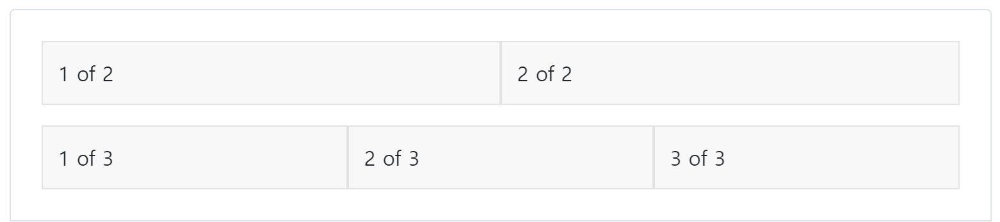

<br>

**.col 클래스와 .col-n 클래스의 혼용**

```html
<div class="container">
  <div class="row">
    <div class="col">
      1 of 3
    </div>
    <div class="col-6">
      2 of 3 (wider)
    </div>
    <div class="col">
      3 of 3
    </div>
  </div>
  <div class="row">
    <div class="col">
      1 of 3
    </div>
    <div class="col-5">
      2 of 3 (wider)
    </div>
    <div class="col">
      3 of 3
    </div>
  </div>
</div>
```

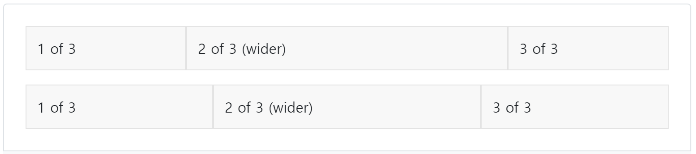

<br>

**.col, .col-x-n, .col-x-auto 클래스의 혼용**

```html
<div class="container">
  <div class="row justify-content-md-center">
    <div class="col col-lg-2">
      1 of 3
    </div>
    <div class="col-md-auto">
      Variable width content
    </div>
    <div class="col col-lg-2">
      3 of 3
    </div>
  </div>
  <div class="row">
    <div class="col">
      1 of 3
    </div>
    <div class="col-md-auto">
      Variable width content
    </div>
    <div class="col col-lg-2">
      3 of 3
    </div>
  </div>
</div>
```

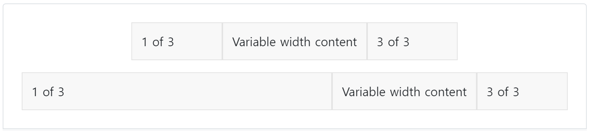

<br>

**.col-n, .col-x-n 의 혼용**

```html
<div class="container">
  <!-- 하나는 전폭, 다른 하나는 반폭으로 만들어 모바일에서 열을 쌓습니다. -->
  <div class="row">
    <div class="col-md-8">.col-md-8</div>
    <div class="col-6 col-md-4">.col-6 .col-md-4</div>
  </div>

  <!-- 열 너비는 모바일에서 50%에서 시작하고 데스크톱에서는 너비가 최대 33.3%까지 늘어납니다. -->
  <div class="row">
    <div class="col-6 col-md-4">.col-6 .col-md-4</div>
    <div class="col-6 col-md-4">.col-6 .col-md-4</div>
    <div class="col-6 col-md-4">.col-6 .col-md-4</div>
  </div>

  <!-- 모바일 및 데스크톱에서 열 너비는 항상 50%입니다. -->
  <div class="row">
    <div class="col-6">.col-6</div>
    <div class="col-6">.col-6</div>
  </div>
</div>
```

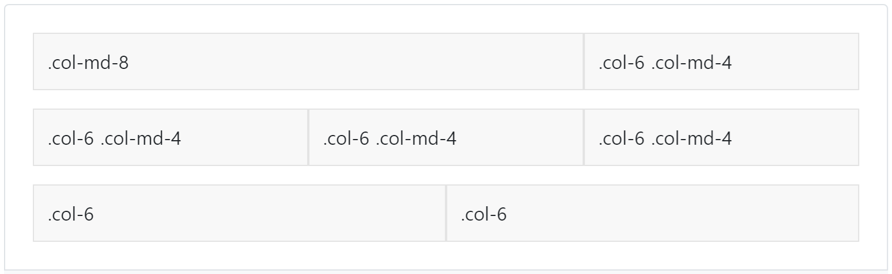

<br>

**컬럼의 수직 정렬1**

```html
<div class="container">
  <div class="row align-items-start">
    <div class="col">
      One of three columns
    </div>
    <div class="col">
      One of three columns
    </div>
    <div class="col">
      One of three columns
    </div>
  </div>
  <div class="row align-items-center">
    <div class="col">
      One of three columns
    </div>
    <div class="col">
      One of three columns
    </div>
    <div class="col">
      One of three columns
    </div>
  </div>
  <div class="row align-items-end">
    <div class="col">
      One of three columns
    </div>
    <div class="col">
      One of three columns
    </div>
    <div class="col">
      One of three columns
    </div>
  </div>
</div>
```

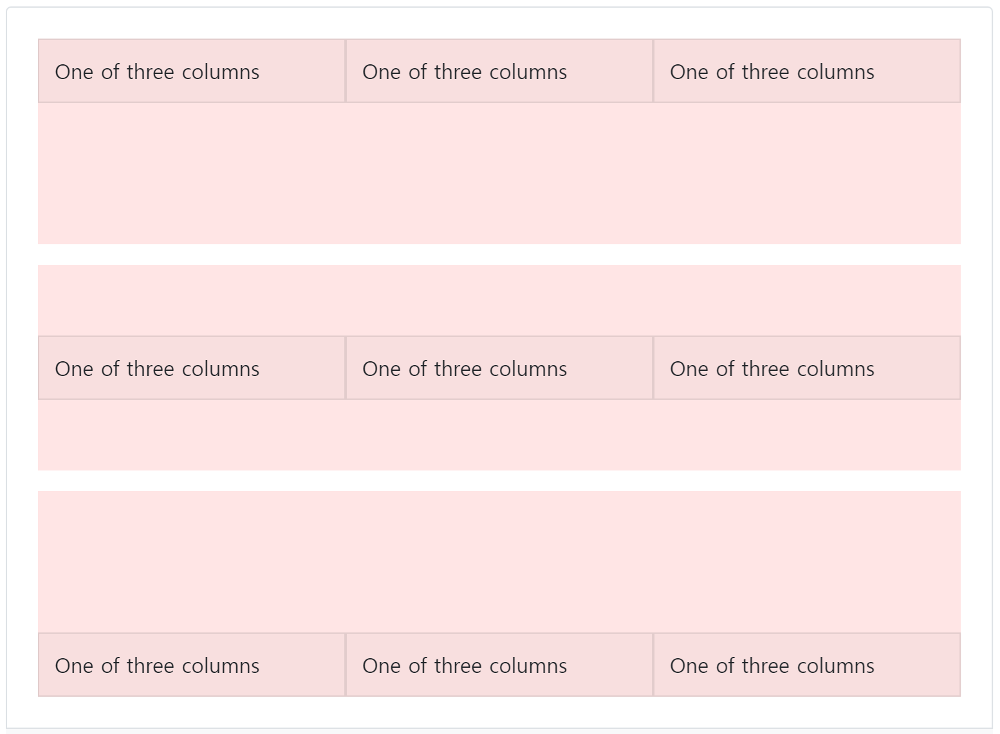

<br>

**컬럼의 수직 정렬2**

```html
<div class="container">
  <div class="row">
    <div class="col align-self-start">
      One of three columns
    </div>
    <div class="col align-self-center">
      One of three columns
    </div>
    <div class="col align-self-end">
      One of three columns
    </div>
  </div>
</div>
```

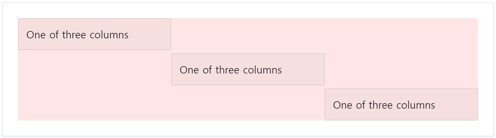

<br>

**수평 거터 적용**

```html
<div class="container overflow-hidden">
  <div class="row gx-5">
    <div class="col">
     <div class="p-3 border bg-light">Custom column padding</div>
    </div>
    <div class="col">
      <div class="p-3 border bg-light">Custom column padding</div>
    </div>
  </div>
</div>
```

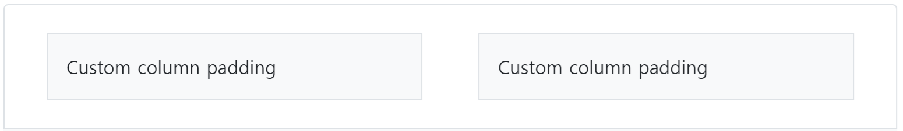

<br>

**수직 거터 적용**

```html
<div class="container overflow-hidden">
  <div class="row gy-5">
    <div class="col-6">
      <div class="p-3 border bg-light">Custom column padding</div>
    </div>
    <div class="col-6">
      <div class="p-3 border bg-light">Custom column padding</div>
    </div>
    <div class="col-6">
      <div class="p-3 border bg-light">Custom column padding</div>
    </div>
    <div class="col-6">
      <div class="p-3 border bg-light">Custom column padding</div>
    </div>
  </div>
</div>
```

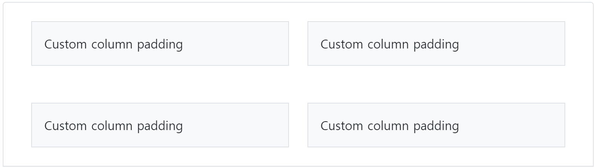

<br>

**수평/수직 거터 혼용**

```html
<div class="container">
  <div class="row g-2">
    <div class="col-6">
      <div class="p-3 border bg-light">Custom column padding</div>
    </div>
    <div class="col-6">
      <div class="p-3 border bg-light">Custom column padding</div>
    </div>
    <div class="col-6">
      <div class="p-3 border bg-light">Custom column padding</div>
    </div>
    <div class="col-6">
      <div class="p-3 border bg-light">Custom column padding</div>
    </div>
  </div>
</div>
```

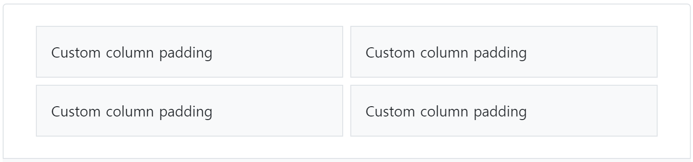

<br>

**화면 너비 기준의 거터 적용**

```html
<div class="container">
  <div class="row row-cols-2 row-cols-lg-5 g-2 g-lg-3">
    <div class="col">
      <div class="p-3 border bg-light">Row column</div>
    </div>
    <div class="col">
      <div class="p-3 border bg-light">Row column</div>
    </div>
    <div class="col">
      <div class="p-3 border bg-light">Row column</div>
    </div>
    <div class="col">
      <div class="p-3 border bg-light">Row column</div>
    </div>
    <div class="col">
      <div class="p-3 border bg-light">Row column</div>
    </div>
    <div class="col">
      <div class="p-3 border bg-light">Row column</div>
    </div>
    <div class="col">
      <div class="p-3 border bg-light">Row column</div>
    </div>
    <div class="col">
      <div class="p-3 border bg-light">Row column</div>
    </div>
    <div class="col">
      <div class="p-3 border bg-light">Row column</div>
    </div>
    <div class="col">
      <div class="p-3 border bg-light">Row column</div>
    </div>
  </div>
</div>
```

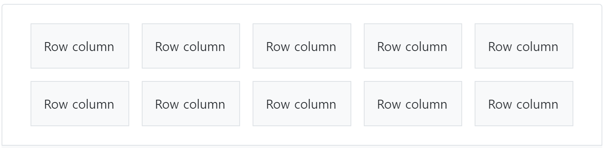

<br><br>

### 6-1-4. Bootstrap 콘텐츠 요소

#### 6-1-4-1. Typograph

**고정 크기 제목**

```html
<p class="h1">h1. Bootstrap heading</p>
<p class="h2">h2. Bootstrap heading</p>
<p class="h3">h3. Bootstrap heading</p>
<p class="h4">h4. Bootstrap heading</p>
<p class="h5">h5. Bootstrap heading</p>
<p class="h6">h6. Bootstrap heading</p>
```

```html
<h1>h1. Bootstrap heading</h1>
<h2>h2. Bootstrap heading</h2>
<h3>h3. Bootstrap heading</h3>
<h4>h4. Bootstrap heading</h4>
<h5>h5. Bootstrap heading</h5>
<h6>h6. Bootstrap heading</h6>
```

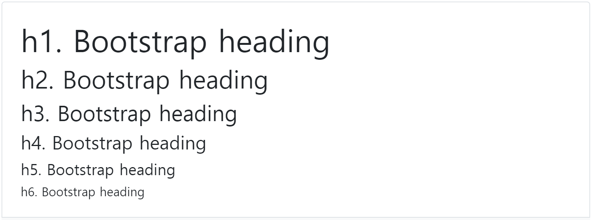

<br>

**Display 크기 제목**

```html
<h1 class="display-1">Display 1</h1>
<h1 class="display-2">Display 2</h1>
<h1 class="display-3">Display 3</h1>
<h1 class="display-4">Display 4</h1>
<h1 class="display-5">Display 5</h1>
<h1 class="display-6">Display 6</h1>
```

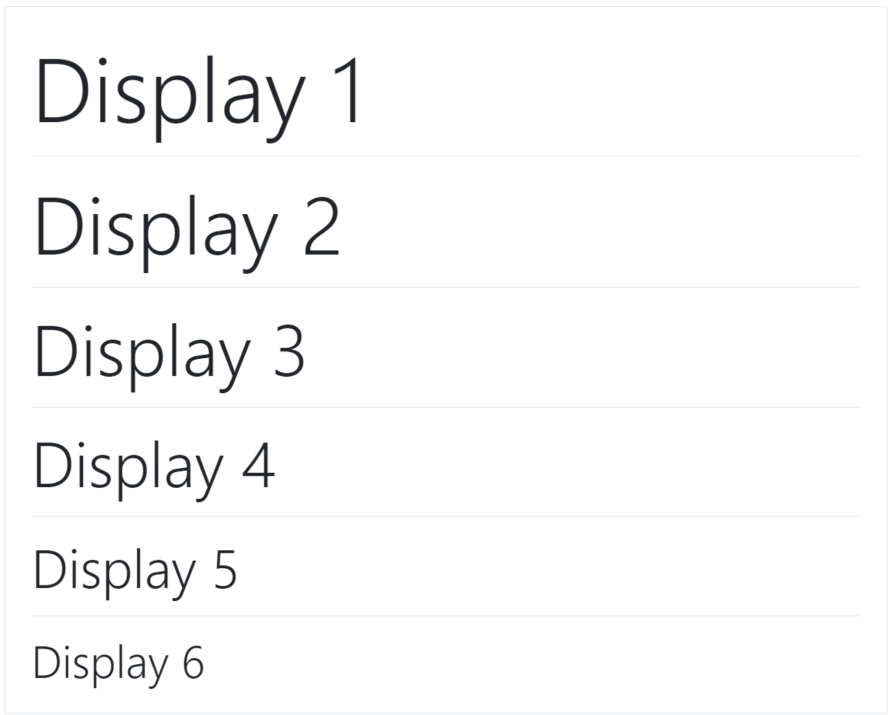

<br>

**문장(Paragraph)의 강조**

```html
<p>You can use the mark tag to <mark>highlight</mark> text.</p>
<p><del>This line of text is meant to be treated as deleted text.</del></p>
<p><s>This line of text is meant to be treated as no longer accurate.</s></p>
<p><ins>This line of text is meant to be treated as an addition to the document.</ins></p>
<p><u>This line of text will render as underlined.</u></p>
<p><small>This line of text is meant to be treated as fine print.</small></p>
<p><strong>This line rendered as bold text.</strong></p>
<p><em>This line rendered as italicized text.</em></p>
```

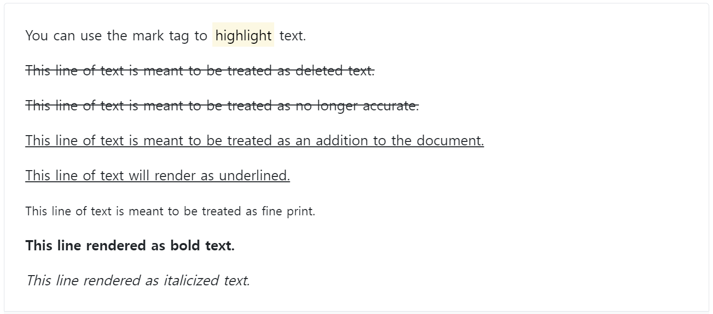

<br>

**약어(Abbreviation)과 툴팁(풍선도움말)의 활용**

```html
<p><abbr title="attribute">attr</abbr></p>
<p><abbr title="HyperText Markup Language" class="initialism">HTML</abbr></p>
```

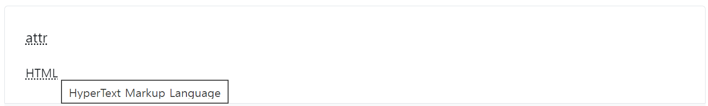

<br>

**Blockquote(인용문) 왼쪽 정렬의 활용**

```html
<figure>
  <blockquote class="blockquote">
    <p>A well-known quote, contained in a blockquote element.</p>
  </blockquote>
  <figcaption class="blockquote-footer">
    Someone famous in <cite title="Source Title">Source Title</cite>
  </figcaption>
</figure>
```


<br>

**Blockquote(인용문) 가운데 정렬의 활용**

```html
<figure class="text-center">
  <blockquote class="blockquote">
    <p>A well-known quote, contained in a blockquote element.</p>
  </blockquote>
  <figcaption class="blockquote-footer">
    Someone famous in <cite title="Source Title">Source Title</cite>
  </figcaption>
</figure>
```


<br>

**Blockquote(인용문) 오른쪽 정렬의 활용**

```html
<figure class="text-end">
  <blockquote class="blockquote">
    <p>A well-known quote, contained in a blockquote element.</p>
  </blockquote>
  <figcaption class="blockquote-footer">
    Someone famous in <cite title="Source Title">Source Title</cite>
  </figcaption>
</figure>
```

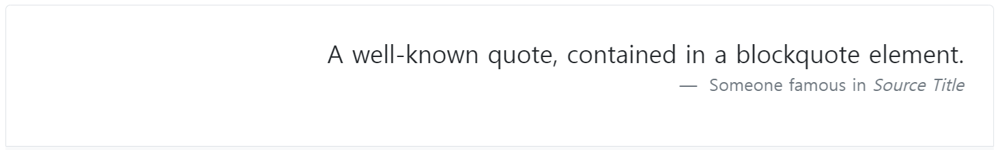

<br>

**List(목록) 크기 제목**

```html
<ul class="list-unstyled">
  <li>This is a list.</li>
  <li>It appears completely unstyled.</li>
  <li>Structurally, it's still a list.</li>
  <li>However, this style only applies to immediate child elements.</li>
  <li>Nested lists:
    <ul>
      <li>are unaffected by this style</li>
      <li>will still show a bullet</li>
      <li>and have appropriate left margin</li>
    </ul>
  </li>
  <li>This may still come in handy in some situations.</li>
</ul>
```

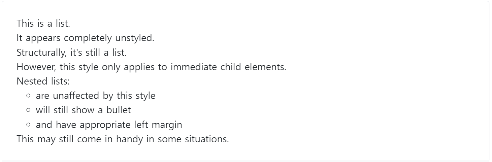

<br>

#### 6-1-4-2. Image 

<br>

**반응형 이미지**

```html

```

```html
<figure class="figure">
  
  <figcaption class="figure-caption">A caption for the above image.</figcaption>
</figure>
```

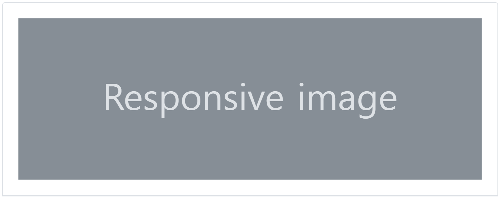

<br>

**썸네일 이미지**

```html

```

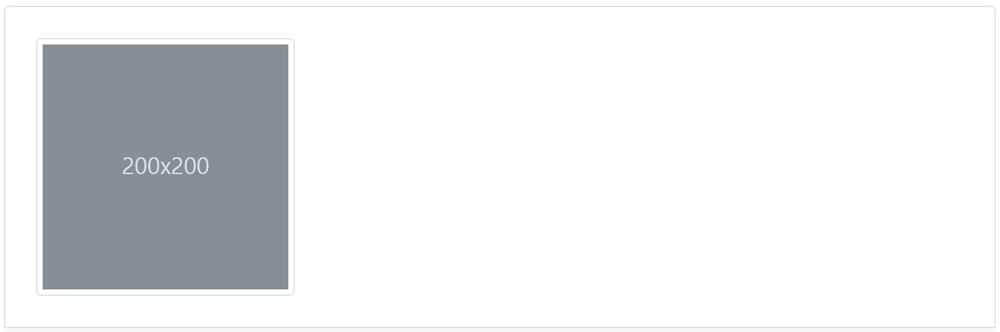

<br>

**이미지의 정렬**

```html


```

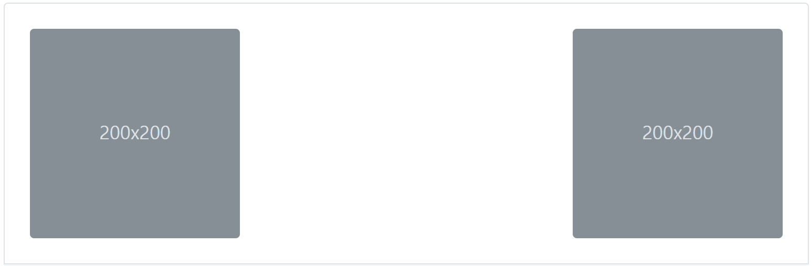

<br>

**이미지 가운데 정렬**

```html

```

```html
<div class="text-center">
  
</div>
```


<br>

#### 6-1-4-3. Table

**기본 테이블**

```html
<table class="table">
  <thead>
    <tr>
      <th scope="col">#</th>
      <th scope="col">First</th>
      <th scope="col">Last</th>
      <th scope="col">Handle</th>
    </tr>
  </thead>
  <tbody>
    <tr>
      <th scope="row">1</th>
      <td>Mark</td>
      <td>Otto</td>
      <td>@mdo</td>
    </tr>
    <tr>
      <th scope="row">2</th>
      <td>Jacob</td>
      <td>Thornton</td>
      <td>@fat</td>
    </tr>
    <tr>
      <th scope="row">3</th>
      <td colspan="2">Larry the Bird</td>
      <td>@twitter</td>
    </tr>
  </tbody>
</table>
```

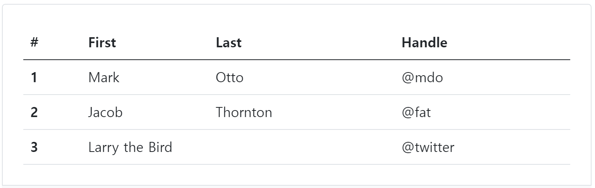

<br>

**컬러 테이블**

```html
<table class="table">
  <thead>
    <tr>
      <th>Class</th>
      <th>Heading</th>
      <th>Heading</th>
    </tr>
  </thead>
  <tbody>
    <tr>
      <td>Default</td>
      <td class="cell">Cell</td>
      <td class="cell">Cell</td>
    </tr>
    <tr class="table-primary">
      <td>Primary</td>
      <td class="cell">Cell</td>
      <td class="cell">Cell</td>
    </tr>
    <tr class="table-secondary">
      <td>Secondary</td>
      <td class="cell">Cell</td>
      <td class="cell">Cell</td>
    </tr>
    <tr class="table-success">
      <td>Success</td>
      <td class="cell">Cell</td>
      <td class="cell">Cell</td>
    </tr>
    <tr class="table-danger">
      <td>Danger</td>
      <td class="cell">Cell</td>
      <td class="cell">Cell</td>
    </tr>
    <tr class="table-warning">
      <td>Warning</td>
      <td class="cell">Cell</td>
      <td class="cell">Cell</td>
    </tr>
    <tr class="table-info">
      <td>Info</td>
      <td class="cell">Cell</td>
      <td class="cell">Cell</td>
    </tr>
    <tr class="table-light">
      <td>Light</td>
      <td class="cell">Cell</td>
      <td class="cell">Cell</td>
    </tr>
    <tr class="table-dark">
      <td>Dark</td>
      <td class="cell">Cell</td>
      <td class="cell">Cell</td>
    </tr>
  </tbody>
</table>
```

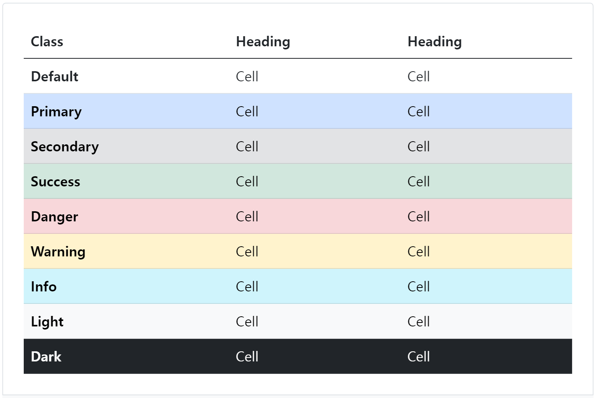

<br>

**음영 교대 테이블**

```html
<table class="table table-striped">
  <thead>
    <tr>
      <th scope="col">#</th>
      <th scope="col">First</th>
      <th scope="col">Last</th>
      <th scope="col">Handle</th>
    </tr>
  </thead>
  <tbody>
    <tr>
      <th scope="row">1</th>
      <td>Mark</td>
      <td>Otto</td>
      <td>@mdo</td>
    </tr>
    <tr>
      <th scope="row">2</th>
      <td>Jacob</td>
      <td>Thornton</td>
      <td>@fat</td>
    </tr>
    <tr>
      <th scope="row">3</th>
      <td colspan="2">Larry the Bird</td>
      <td>@twitter</td>
    </tr>
  </tbody>
</table>
```

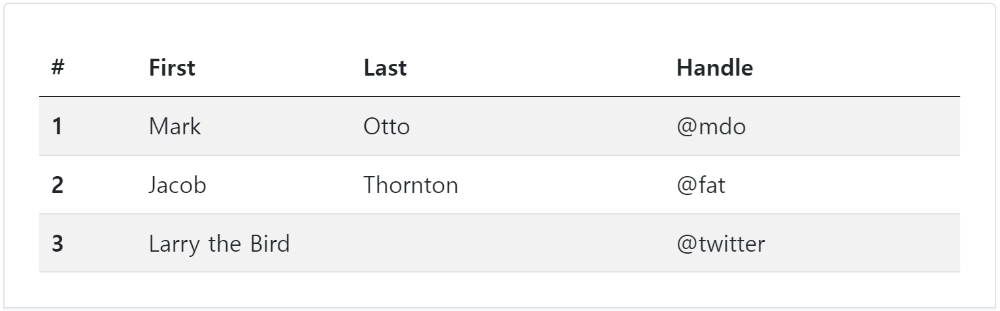

<br>

**어두운 음영 교대 테이블**

```html
<table class="table table-dark table-striped">
  <thead>
    <tr>
      <th scope="col">#</th>
      <th scope="col">First</th>
      <th scope="col">Last</th>
      <th scope="col">Handle</th>
    </tr>
  </thead>
  <tbody>
    <tr>
      <th scope="row">1</th>
      <td>Mark</td>
      <td>Otto</td>
      <td>@mdo</td>
    </tr>
    <tr>
      <th scope="row">2</th>
      <td>Jacob</td>
      <td>Thornton</td>
      <td>@fat</td>
    </tr>
    <tr>
      <th scope="row">3</th>
      <td colspan="2">Larry the Bird</td>
      <td>@twitter</td>
    </tr>
  </tbody>
</table>
```

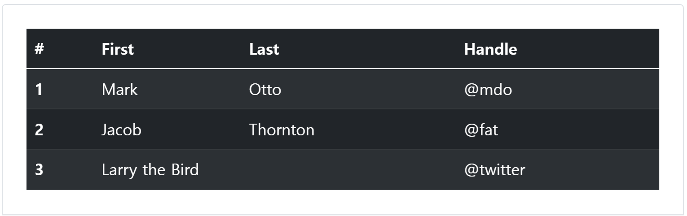

<br>

**초록 음영 교대 테이블**

```html
<table class="table table-success table-striped">
  <thead>
    <tr>
      <th scope="col">#</th>
      <th scope="col">First</th>
      <th scope="col">Last</th>
      <th scope="col">Handle</th>
    </tr>
  </thead>
  <tbody>
    <tr>
      <th scope="row">1</th>
      <td>Mark</td>
      <td>Otto</td>
      <td>@mdo</td>
    </tr>
    <tr>
      <th scope="row">2</th>
      <td>Jacob</td>
      <td>Thornton</td>
      <td>@fat</td>
    </tr>
    <tr>
      <th scope="row">3</th>
      <td colspan="2">Larry the Bird</td>
      <td>@twitter</td>
    </tr>
  </tbody>
</table>
```

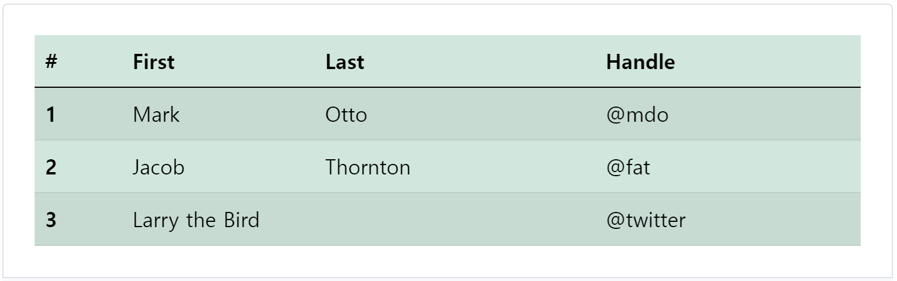

<br>

**셀 호버시 인터랙션 테이블**

```html
<table class="table table-hover">
  <thead>
    <tr>
      <th scope="col">#</th>
      <th scope="col">First</th>
      <th scope="col">Last</th>
      <th scope="col">Handle</th>
    </tr>
  </thead>
  <tbody>
    <tr>
      <th scope="row">1</th>
      <td>Mark</td>
      <td>Otto</td>
      <td>@mdo</td>
    </tr>
    <tr>
      <th scope="row">2</th>
      <td>Jacob</td>
      <td>Thornton</td>
      <td>@fat</td>
    </tr>
    <tr>
      <th scope="row">3</th>
      <td colspan="2">Larry the Bird</td>
      <td>@twitter</td>
    </tr>
  </tbody>
</table>
```

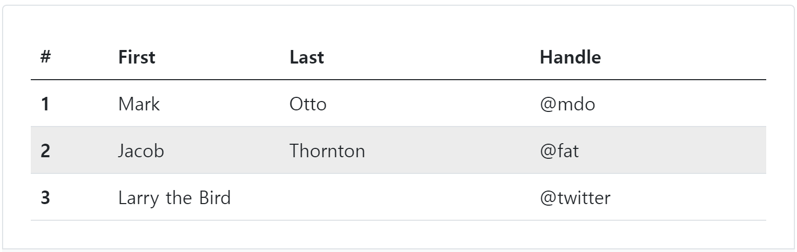

<br><br>

### 6-1-5. Bootstrap 폼 요소

#### 6-1-5-1. 폼 컨트롤 요소

**기본 입력 컨트롤**

```html
<div class="mb-3">
  <label for="exampleFormControlInput1" class="form-label">Email address</label>
  <input type="email" class="form-control" id="exampleFormControlInput1" placeholder="name@example.com">
</div>
<div class="mb-3">
  <label for="exampleFormControlTextarea1" class="form-label">Example textarea</label>
  <textarea class="form-control" id="exampleFormControlTextarea1" rows="3"></textarea>
</div>
```

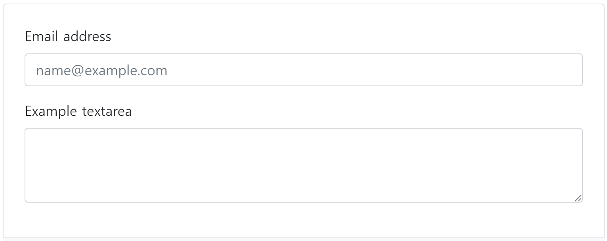

<br>

**폼 컨트롤의 크기조절**

```html
<input class="form-control form-control-lg" type="text" placeholder=".form-control-lg" aria-label=".form-control-lg example">
<input class="form-control" type="text" placeholder="Default input" aria-label="default input example">
<input class="form-control form-control-sm" type="text" placeholder=".form-control-sm" aria-label=".form-control-sm example">
```

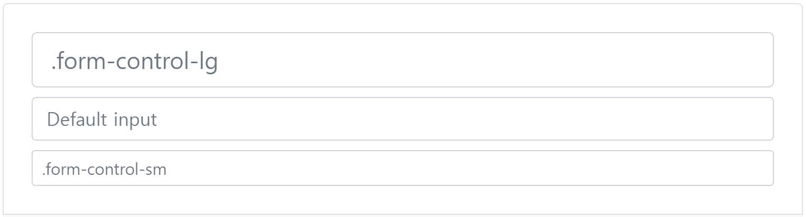

<br>

**비활성화된 폼 컨트롤**

```html
<input class="form-control" type="text" placeholder="Disabled input" aria-label="Disabled input example" disabled>
<input class="form-control" type="text" value="Disabled readonly input" aria-label="Disabled input example" disabled readonly>
```

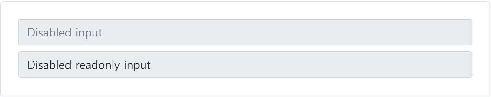

<br>

**읽기 전용 폼 컨트롤**

```html
<input class="form-control" type="text" value="Readonly input here..." aria-label="readonly input example" readonly>
```

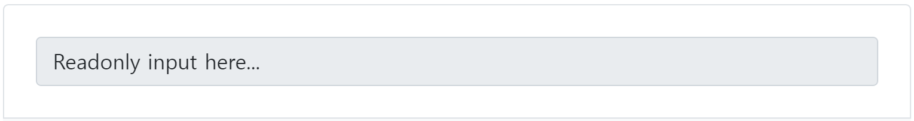

<br>

**텍스트 읽기 전용 폼 컨트롤**

```html
  <div class="mb-3 row">
    <label for="staticEmail" class="col-sm-2 col-form-label">Email</label>
    <div class="col-sm-10">
      <input type="text" readonly class="form-control-plaintext" id="staticEmail" value="email@example.com">
    </div>
  </div>
  <div class="mb-3 row">
    <label for="inputPassword" class="col-sm-2 col-form-label">Password</label>
    <div class="col-sm-10">
      <input type="password" class="form-control" id="inputPassword">
    </div>
  </div>
```

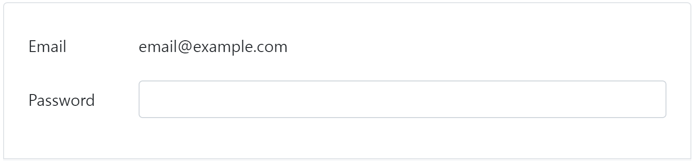

<br>

**값 읽기 전용 폼 컨트롤**

```html
<form class="row g-3">
  <div class="col-auto">
    <label for="staticEmail2" class="visually-hidden">Email</label>
    <input type="text" readonly class="form-control-plaintext" id="staticEmail2" value="email@example.com">
  </div>
  <div class="col-auto">
    <label for="inputPassword2" class="visually-hidden">Password</label>
    <input type="password" class="form-control" id="inputPassword2" placeholder="Password">
  </div>
  <div class="col-auto">
    <button type="submit" class="btn btn-primary mb-3">Confirm identity</button>
  </div>
</form>
```

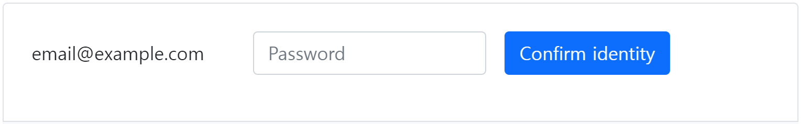

<br>

**파일 입력 폼 컨트롤**

```html
<div class="mb-3">
  <label for="formFile" class="form-label">Default file input example</label>
  <input class="form-control" type="file" id="formFile">
</div>
<div class="mb-3">
  <label for="formFileMultiple" class="form-label">Multiple files input example</label>
  <input class="form-control" type="file" id="formFileMultiple" multiple>
</div>
<div class="mb-3">
  <label for="formFileDisabled" class="form-label">Disabled file input example</label>
  <input class="form-control" type="file" id="formFileDisabled" disabled>
</div>
<div class="mb-3">
  <label for="formFileSm" class="form-label">Small file input example</label>
  <input class="form-control form-control-sm" id="formFileSm" type="file">
</div>
<div>
  <label for="formFileLg" class="form-label">Large file input example</label>
  <input class="form-control form-control-lg" id="formFileLg" type="file">
</div>
```

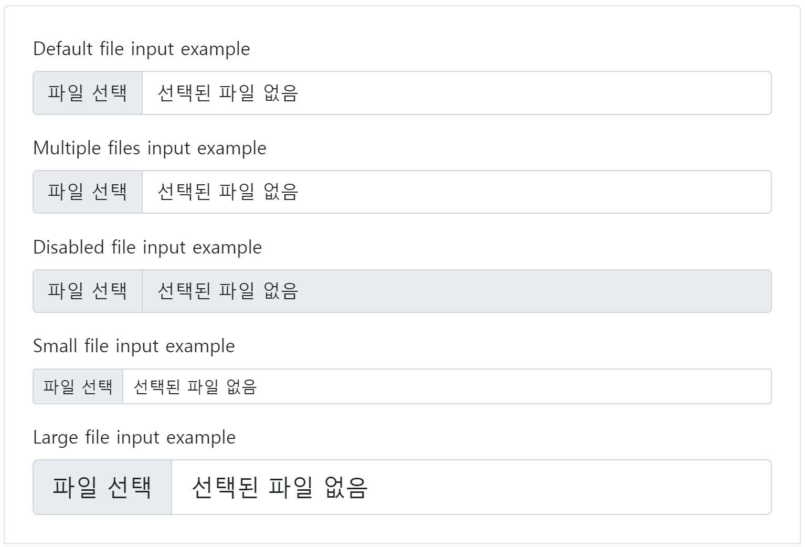

<br>

**컬러 입력 폼 컨트롤**

```html
<label for="exampleColorInput" class="form-label">Color picker</label>
<input type="color" class="form-control form-control-color" id="exampleColorInput" value="#563d7c" title="Choose your color">
```

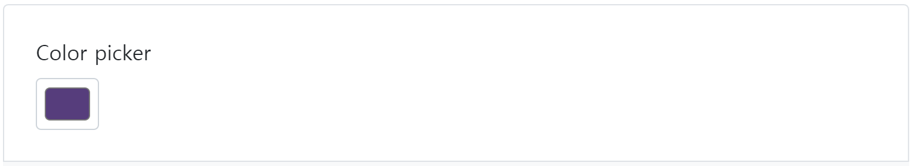

<br>

**데이터리스트 폼 컨트롤**

```html
<label for="exampleDataList" class="form-label">Datalist example</label>
<input class="form-control" list="datalistOptions" id="exampleDataList" placeholder="Type to search...">
<datalist id="datalistOptions">
  <option value="San Francisco">
  <option value="New York">
  <option value="Seattle">
  <option value="Los Angeles">
  <option value="Chicago">
</datalist>
```

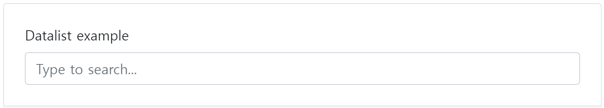

<br>

**기본 선택(Select) 컨트롤**

```html
<select class="form-select" aria-label="Default select example">
  <option selected>Open this select menu</option>
  <option value="1">One</option>
  <option value="2">Two</option>
  <option value="3">Three</option>
</select>
```

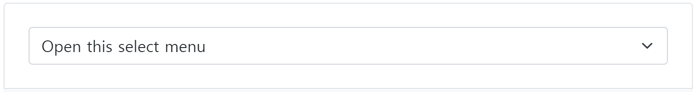

<br>

**선택(Select) 컨트롤의 크기**

```html
<select class="form-select form-select-lg mb-3" aria-label=".form-select-lg example">
  <option selected>Open this select menu</option>
  <option value="1">One</option>
  <option value="2">Two</option>
  <option value="3">Three</option>
</select>

<select class="form-select form-select-sm" aria-label=".form-select-sm example">
  <option selected>Open this select menu</option>
  <option value="1">One</option>
  <option value="2">Two</option>
  <option value="3">Three</option>
</select>
```

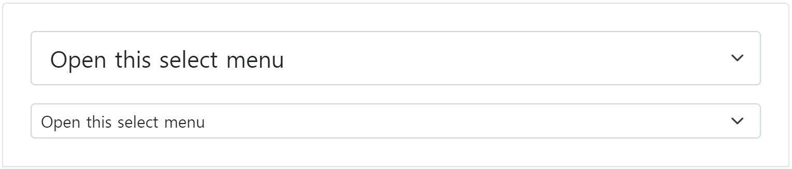

<br>

**다중 선택(Select) 컨트롤**

```html
<select class="form-select" multiple aria-label="multiple select example">
  <option selected>Open this select menu</option>
  <option value="1">One</option>
  <option value="2">Two</option>
  <option value="3">Three</option>
</select>
```

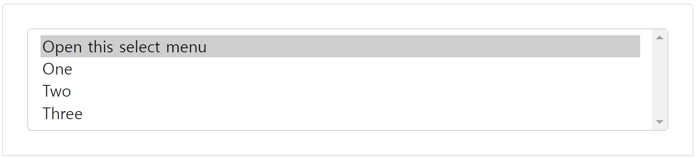

<br>

**체크박스 컨트롤**

```html
<div class="form-check">
  <input class="form-check-input" type="checkbox" value="" id="flexCheckDefault">
  <label class="form-check-label" for="flexCheckDefault">
    Default checkbox
  </label>
</div>
<div class="form-check">
  <input class="form-check-input" type="checkbox" value="" id="flexCheckChecked" checked>
  <label class="form-check-label" for="flexCheckChecked">
    Checked checkbox
  </label>
</div>
```

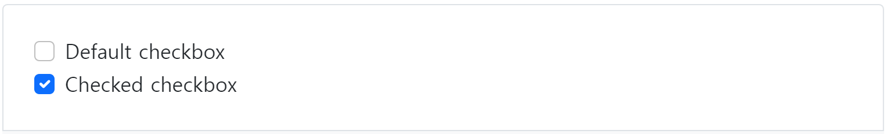

<br>

**라디오 버튼 컨트롤**

```html
<div class="form-check">
  <input class="form-check-input" type="radio" name="flexRadioDefault" id="flexRadioDefault1">
  <label class="form-check-label" for="flexRadioDefault1">
    Default radio
  </label>
</div>
<div class="form-check">
  <input class="form-check-input" type="radio" name="flexRadioDefault" id="flexRadioDefault2" checked>
  <label class="form-check-label" for="flexRadioDefault2">
    Default checked radio
  </label>
</div>
```

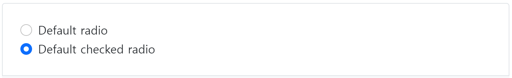

<br>

**체크박스를 활용한 스위치 컨트롤**

```html
<div class="form-check form-switch">
  <input class="form-check-input" type="checkbox" id="flexSwitchCheckDefault">
  <label class="form-check-label" for="flexSwitchCheckDefault">Default switch checkbox input</label>
</div>
<div class="form-check form-switch">
  <input class="form-check-input" type="checkbox" id="flexSwitchCheckChecked" checked>
  <label class="form-check-label" for="flexSwitchCheckChecked">Checked switch checkbox input</label>
</div>
<div class="form-check form-switch">
  <input class="form-check-input" type="checkbox" id="flexSwitchCheckDisabled" disabled>
  <label class="form-check-label" for="flexSwitchCheckDisabled">Disabled switch checkbox input</label>
</div>
<div class="form-check form-switch">
  <input class="form-check-input" type="checkbox" id="flexSwitchCheckCheckedDisabled" checked disabled>
  <label class="form-check-label" for="flexSwitchCheckCheckedDisabled">Disabled checked switch checkbox input</label>
</div>
```

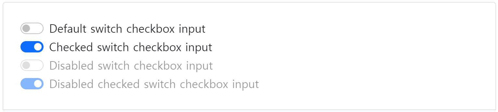

<br>

**인라인 방식의 체크박스 컨트롤**

```html
<div class="form-check form-check-inline">
  <input class="form-check-input" type="checkbox" id="inlineCheckbox1" value="option1">
  <label class="form-check-label" for="inlineCheckbox1">1</label>
</div>
<div class="form-check form-check-inline">
  <input class="form-check-input" type="checkbox" id="inlineCheckbox2" value="option2">
  <label class="form-check-label" for="inlineCheckbox2">2</label>
</div>
<div class="form-check form-check-inline">
  <input class="form-check-input" type="checkbox" id="inlineCheckbox3" value="option3" disabled>
  <label class="form-check-label" for="inlineCheckbox3">3 (disabled)</label>
</div>
```

```html
<div class="form-check form-check-inline">
  <input class="form-check-input" type="radio" name="inlineRadioOptions" id="inlineRadio1" value="option1">
  <label class="form-check-label" for="inlineRadio1">1</label>
</div>
<div class="form-check form-check-inline">
  <input class="form-check-input" type="radio" name="inlineRadioOptions" id="inlineRadio2" value="option2">
  <label class="form-check-label" for="inlineRadio2">2</label>
</div>
<div class="form-check form-check-inline">
  <input class="form-check-input" type="radio" name="inlineRadioOptions" id="inlineRadio3" value="option3" disabled>
  <label class="form-check-label" for="inlineRadio3">3 (disabled)</label>
</div>
```

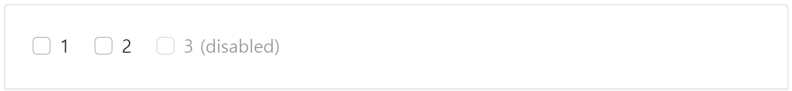

<br>

**체크박스를 활용한 스위치 버튼 컨트롤**

```html
<input type="checkbox" class="btn-check" id="btn-check" autocomplete="off">
<label class="btn btn-primary" for="btn-check">Single toggle</label>
```

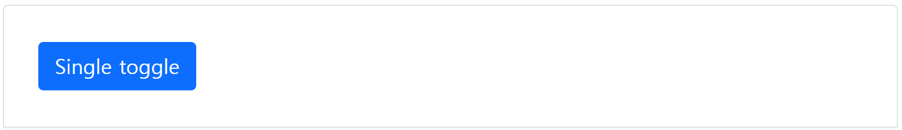

<br>

**범위(Range) 컨트롤**

```html
<label for="customRange3" class="form-label">Example range</label>
<input type="range" class="form-range" min="0" max="5" step="0.5" id="customRange3">
```

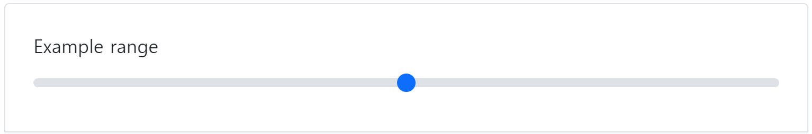

<br>

#### 6-1-5-2. 폼 컨트롤 그룹

**레이블 결합 컨트롤**

```html
<div class="input-group mb-3">
  <span class="input-group-text" id="basic-addon1">@</span>
  <input type="text" class="form-control" placeholder="Username" aria-label="Username" aria-describedby="basic-addon1">
</div>

<div class="input-group mb-3">
  <input type="text" class="form-control" placeholder="Recipient's username" aria-label="Recipient's username" aria-describedby="basic-addon2">
  <span class="input-group-text" id="basic-addon2">@example.com</span>
</div>

<label for="basic-url" class="form-label">Your vanity URL</label>
<div class="input-group mb-3">
  <span class="input-group-text" id="basic-addon3">https://example.com/users/</span>
  <input type="text" class="form-control" id="basic-url" aria-describedby="basic-addon3">
</div>

<div class="input-group mb-3">
  <span class="input-group-text">$</span>
  <input type="text" class="form-control" aria-label="Amount (to the nearest dollar)">
  <span class="input-group-text">.00</span>
</div>

<div class="input-group mb-3">
  <input type="text" class="form-control" placeholder="Username" aria-label="Username">
  <span class="input-group-text">@</span>
  <input type="text" class="form-control" placeholder="Server" aria-label="Server">
</div>

<div class="input-group">
  <span class="input-group-text">With textarea</span>
  <textarea class="form-control" aria-label="With textarea"></textarea>
</div>
```

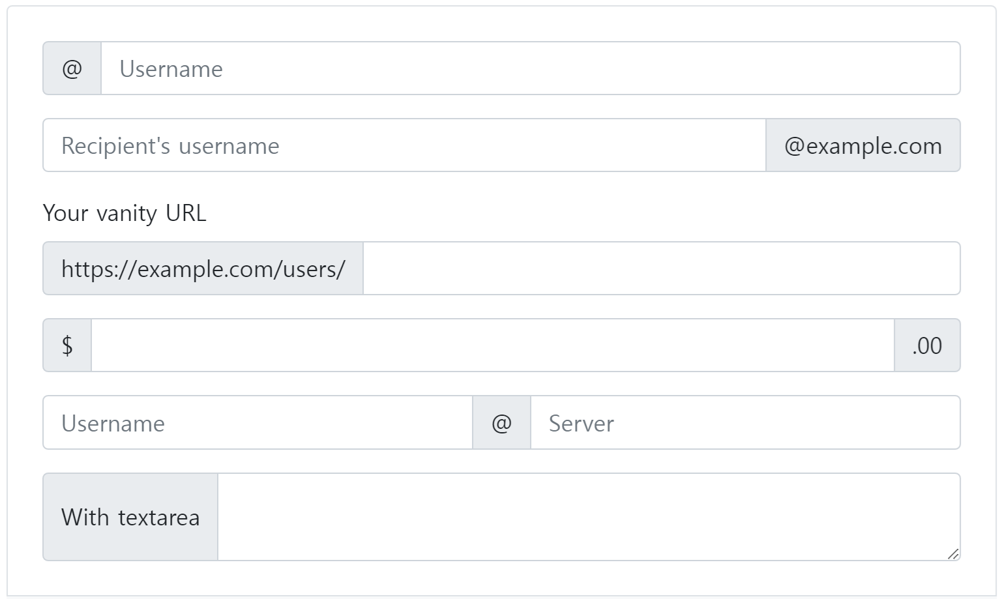

<br>

**버튼 결합 컨트롤**

```html
<div class="input-group mb-3">
  <button class="btn btn-outline-secondary" type="button" id="button-addon1">Button</button>
  <input type="text" class="form-control" placeholder="" aria-label="Example text with button addon" aria-describedby="button-addon1">
</div>

<div class="input-group mb-3">
  <input type="text" class="form-control" placeholder="Recipient's username" aria-label="Recipient's username" aria-describedby="button-addon2">
  <button class="btn btn-outline-secondary" type="button" id="button-addon2">Button</button>
</div>

<div class="input-group mb-3">
  <button class="btn btn-outline-secondary" type="button">Button</button>
  <button class="btn btn-outline-secondary" type="button">Button</button>
  <input type="text" class="form-control" placeholder="" aria-label="Example text with two button addons">
</div>

<div class="input-group">
  <input type="text" class="form-control" placeholder="Recipient's username" aria-label="Recipient's username with two button addons">
  <button class="btn btn-outline-secondary" type="button">Button</button>
  <button class="btn btn-outline-secondary" type="button">Button</button>
</div>
```

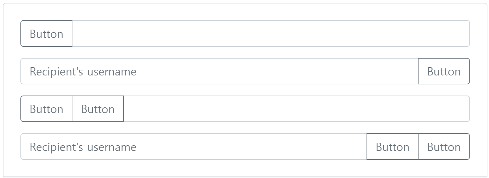

<br>


**드롭다운 버튼 결합 컨트롤**

```html
<div class="input-group mb-3">
  <button class="btn btn-outline-secondary dropdown-toggle" type="button" data-bs-toggle="dropdown" aria-expanded="false">Dropdown</button>
  <ul class="dropdown-menu">
    <li><a class="dropdown-item" href="#">Action</a></li>
    <li><a class="dropdown-item" href="#">Another action</a></li>
    <li><a class="dropdown-item" href="#">Something else here</a></li>
    <li><hr class="dropdown-divider"></li>
    <li><a class="dropdown-item" href="#">Separated link</a></li>
  </ul>
  <input type="text" class="form-control" aria-label="Text input with dropdown button">
</div>

<div class="input-group mb-3">
  <input type="text" class="form-control" aria-label="Text input with dropdown button">
  <button class="btn btn-outline-secondary dropdown-toggle" type="button" data-bs-toggle="dropdown" aria-expanded="false">Dropdown</button>
  <ul class="dropdown-menu dropdown-menu-end">
    <li><a class="dropdown-item" href="#">Action</a></li>
    <li><a class="dropdown-item" href="#">Another action</a></li>
    <li><a class="dropdown-item" href="#">Something else here</a></li>
    <li><hr class="dropdown-divider"></li>
    <li><a class="dropdown-item" href="#">Separated link</a></li>
  </ul>
</div>

<div class="input-group">
  <button class="btn btn-outline-secondary dropdown-toggle" type="button" data-bs-toggle="dropdown" aria-expanded="false">Dropdown</button>
  <ul class="dropdown-menu">
    <li><a class="dropdown-item" href="#">Action before</a></li>
    <li><a class="dropdown-item" href="#">Another action before</a></li>
    <li><a class="dropdown-item" href="#">Something else here</a></li>
    <li><hr class="dropdown-divider"></li>
    <li><a class="dropdown-item" href="#">Separated link</a></li>
  </ul>
  <input type="text" class="form-control" aria-label="Text input with 2 dropdown buttons">
  <button class="btn btn-outline-secondary dropdown-toggle" type="button" data-bs-toggle="dropdown" aria-expanded="false">Dropdown</button>
  <ul class="dropdown-menu dropdown-menu-end">
    <li><a class="dropdown-item" href="#">Action</a></li>
    <li><a class="dropdown-item" href="#">Another action</a></li>
    <li><a class="dropdown-item" href="#">Something else here</a></li>
    <li><hr class="dropdown-divider"></li>
    <li><a class="dropdown-item" href="#">Separated link</a></li>
  </ul>
</div>
```

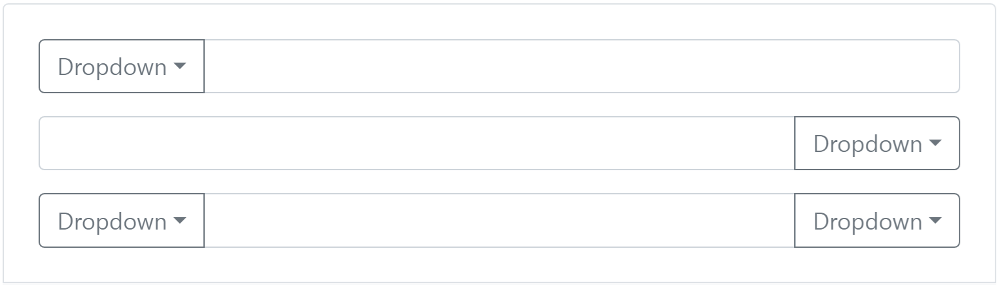

<br>


**버튼과 드롭다운 메뉴 결합 컨트롤**

```html
<div class="input-group mb-3">
  <button type="button" class="btn btn-outline-secondary">Action</button>
  <button type="button" class="btn btn-outline-secondary dropdown-toggle dropdown-toggle-split" data-bs-toggle="dropdown" aria-expanded="false">
    <span class="visually-hidden">Toggle Dropdown</span>
  </button>
  <ul class="dropdown-menu">
    <li><a class="dropdown-item" href="#">Action</a></li>
    <li><a class="dropdown-item" href="#">Another action</a></li>
    <li><a class="dropdown-item" href="#">Something else here</a></li>
    <li><hr class="dropdown-divider"></li>
    <li><a class="dropdown-item" href="#">Separated link</a></li>
  </ul>
  <input type="text" class="form-control" aria-label="Text input with segmented dropdown button">
</div>

<div class="input-group">
  <input type="text" class="form-control" aria-label="Text input with segmented dropdown button">
  <button type="button" class="btn btn-outline-secondary">Action</button>
  <button type="button" class="btn btn-outline-secondary dropdown-toggle dropdown-toggle-split" data-bs-toggle="dropdown" aria-expanded="false">
    <span class="visually-hidden">Toggle Dropdown</span>
  </button>
  <ul class="dropdown-menu dropdown-menu-end">
    <li><a class="dropdown-item" href="#">Action</a></li>
    <li><a class="dropdown-item" href="#">Another action</a></li>
    <li><a class="dropdown-item" href="#">Something else here</a></li>
    <li><hr class="dropdown-divider"></li>
    <li><a class="dropdown-item" href="#">Separated link</a></li>
  </ul>
</div>
```

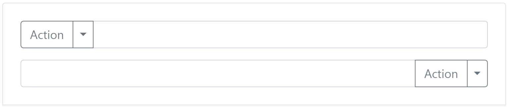

<br>

#### 6-1-5-3. 폼 컨트롤 레이아웃

**기본 폼 레이아웃**

```html
<div class="mb-3">
  <label for="formGroupExampleInput" class="form-label">Example label</label>
  <input type="text" class="form-control" id="formGroupExampleInput" placeholder="Example input placeholder">
</div>
<div class="mb-3">
  <label for="formGroupExampleInput2" class="form-label">Another label</label>
  <input type="text" class="form-control" id="formGroupExampleInput2" placeholder="Another input placeholder">
</div>
```

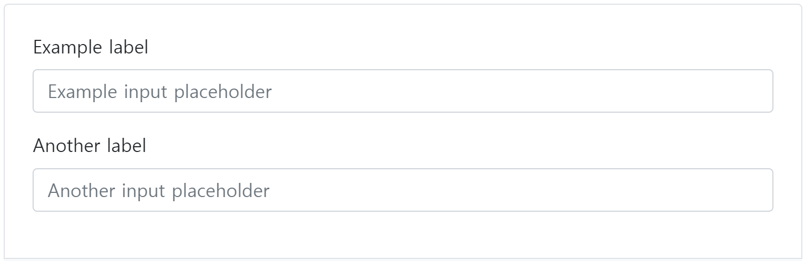

<br>

**폼 그리드 레이아웃**

```html
<div class="row">
  <div class="col">
    <input type="text" class="form-control" placeholder="First name" aria-label="First name">
  </div>
  <div class="col">
    <input type="text" class="form-control" placeholder="Last name" aria-label="Last name">
  </div>
</div>
```

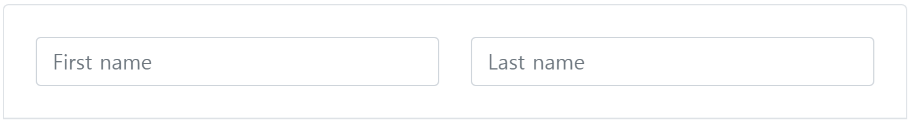

<br>

**폼 거터**

```html
<div class="row g-3">
  <div class="col">
    <input type="text" class="form-control" placeholder="First name" aria-label="First name">
  </div>
  <div class="col">
    <input type="text" class="form-control" placeholder="Last name" aria-label="Last name">
  </div>
</div>
```

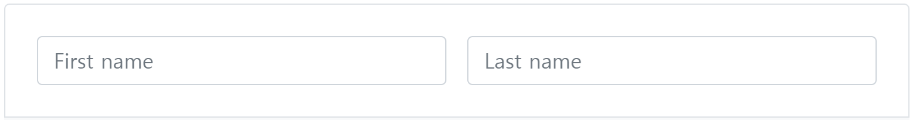

<br>

**컴플렉스 그리드 레이아웃**

```html
<form class="row g-3">
  <div class="col-md-6">
    <label for="inputEmail4" class="form-label">Email</label>
    <input type="email" class="form-control" id="inputEmail4">
  </div>
  <div class="col-md-6">
    <label for="inputPassword4" class="form-label">Password</label>
    <input type="password" class="form-control" id="inputPassword4">
  </div>
  <div class="col-12">
    <label for="inputAddress" class="form-label">Address</label>
    <input type="text" class="form-control" id="inputAddress" placeholder="1234 Main St">
  </div>
  <div class="col-12">
    <label for="inputAddress2" class="form-label">Address 2</label>
    <input type="text" class="form-control" id="inputAddress2" placeholder="Apartment, studio, or floor">
  </div>
  <div class="col-md-6">
    <label for="inputCity" class="form-label">City</label>
    <input type="text" class="form-control" id="inputCity">
  </div>
  <div class="col-md-4">
    <label for="inputState" class="form-label">State</label>
    <select id="inputState" class="form-select">
      <option selected>Choose...</option>
      <option>...</option>
    </select>
  </div>
  <div class="col-md-2">
    <label for="inputZip" class="form-label">Zip</label>
    <input type="text" class="form-control" id="inputZip">
  </div>
  <div class="col-12">
    <div class="form-check">
      <input class="form-check-input" type="checkbox" id="gridCheck">
      <label class="form-check-label" for="gridCheck">
        Check me out
      </label>
    </div>
  </div>
  <div class="col-12">
    <button type="submit" class="btn btn-primary">Sign in</button>
  </div>
</form>
```

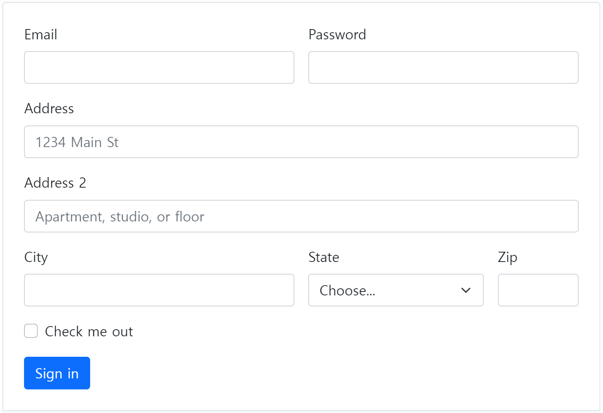

<br>

**가로형 폼 레이아웃**

```html
<form>
  <div class="row mb-3">
    <label for="inputEmail3" class="col-sm-2 col-form-label">Email</label>
    <div class="col-sm-10">
      <input type="email" class="form-control" id="inputEmail3">
    </div>
  </div>
  <div class="row mb-3">
    <label for="inputPassword3" class="col-sm-2 col-form-label">Password</label>
    <div class="col-sm-10">
      <input type="password" class="form-control" id="inputPassword3">
    </div>
  </div>
  <fieldset class="row mb-3">
    <legend class="col-form-label col-sm-2 pt-0">Radios</legend>
    <div class="col-sm-10">
      <div class="form-check">
        <input class="form-check-input" type="radio" name="gridRadios" id="gridRadios1" value="option1" checked>
        <label class="form-check-label" for="gridRadios1">
          First radio
        </label>
      </div>
      <div class="form-check">
        <input class="form-check-input" type="radio" name="gridRadios" id="gridRadios2" value="option2">
        <label class="form-check-label" for="gridRadios2">
          Second radio
        </label>
      </div>
      <div class="form-check disabled">
        <input class="form-check-input" type="radio" name="gridRadios" id="gridRadios3" value="option3" disabled>
        <label class="form-check-label" for="gridRadios3">
          Third disabled radio
        </label>
      </div>
    </div>
  </fieldset>
  <div class="row mb-3">
    <div class="col-sm-10 offset-sm-2">
      <div class="form-check">
        <input class="form-check-input" type="checkbox" id="gridCheck1">
        <label class="form-check-label" for="gridCheck1">
          Example checkbox
        </label>
      </div>
    </div>
  </div>
  <button type="submit" class="btn btn-primary">Sign in</button>
</form>
```

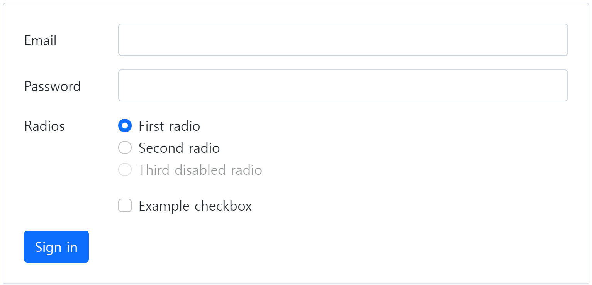

<br>

**가로형 크기 조절 폼 레이아웃**

```html
<div class="row mb-3">
  <label for="colFormLabelSm" class="col-sm-2 col-form-label col-form-label-sm">Email</label>
  <div class="col-sm-10">
    <input type="email" class="form-control form-control-sm" id="colFormLabelSm" placeholder="col-form-label-sm">
  </div>
</div>
<div class="row mb-3">
  <label for="colFormLabel" class="col-sm-2 col-form-label">Email</label>
  <div class="col-sm-10">
    <input type="email" class="form-control" id="colFormLabel" placeholder="col-form-label">
  </div>
</div>
<div class="row">
  <label for="colFormLabelLg" class="col-sm-2 col-form-label col-form-label-lg">Email</label>
  <div class="col-sm-10">
    <input type="email" class="form-control form-control-lg" id="colFormLabelLg" placeholder="col-form-label-lg">
  </div>
</div>
```

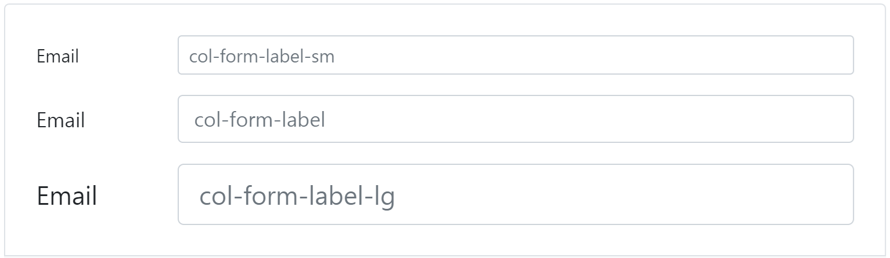

<br>

**가로 배치 컬럼 사이징 레이아웃**

```html
<div class="row g-3">
  <div class="col-sm-7">
    <input type="text" class="form-control" placeholder="City" aria-label="City">
  </div>
  <div class="col-sm">
    <input type="text" class="form-control" placeholder="State" aria-label="State">
  </div>
  <div class="col-sm">
    <input type="text" class="form-control" placeholder="Zip" aria-label="Zip">
  </div>
</div>
```

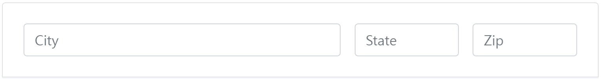

<br>

**자동 크기 조절 폼 레이아웃**

```html
<form class="row gy-2 gx-3 align-items-center">
  <div class="col-auto">
    <label class="visually-hidden" for="autoSizingInput">Name</label>
    <input type="text" class="form-control" id="autoSizingInput" placeholder="Jane Doe">
  </div>
  <div class="col-auto">
    <label class="visually-hidden" for="autoSizingInputGroup">Username</label>
    <div class="input-group">
      <div class="input-group-text">@</div>
      <input type="text" class="form-control" id="autoSizingInputGroup" placeholder="Username">
    </div>
  </div>
  <div class="col-auto">
    <label class="visually-hidden" for="autoSizingSelect">Preference</label>
    <select class="form-select" id="autoSizingSelect">
      <option selected>Choose...</option>
      <option value="1">One</option>
      <option value="2">Two</option>
      <option value="3">Three</option>
    </select>
  </div>
  <div class="col-auto">
    <div class="form-check">
      <input class="form-check-input" type="checkbox" id="autoSizingCheck">
      <label class="form-check-label" for="autoSizingCheck">
        Remember me
      </label>
    </div>
  </div>
  <div class="col-auto">
    <button type="submit" class="btn btn-primary">Submit</button>
  </div>
</form>
```

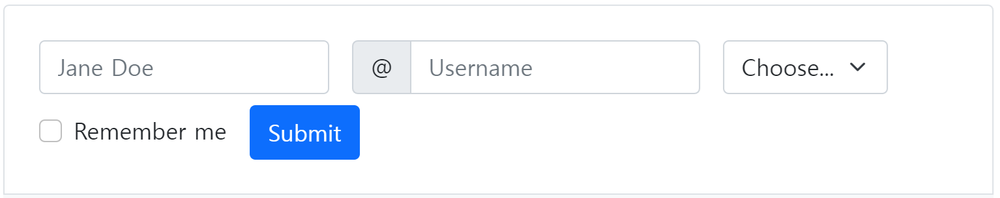


<br>

**인라인 폼 레이아웃**

```html
<form class="row row-cols-lg-auto g-3 align-items-center">
  <div class="col-12">
    <label class="visually-hidden" for="inlineFormInputGroupUsername">Username</label>
    <div class="input-group">
      <div class="input-group-text">@</div>
      <input type="text" class="form-control" id="inlineFormInputGroupUsername" placeholder="Username">
    </div>
  </div>

  <div class="col-12">
    <label class="visually-hidden" for="inlineFormSelectPref">Preference</label>
    <select class="form-select" id="inlineFormSelectPref">
      <option selected>Choose...</option>
      <option value="1">One</option>
      <option value="2">Two</option>
      <option value="3">Three</option>
    </select>
  </div>

  <div class="col-12">
    <div class="form-check">
      <input class="form-check-input" type="checkbox" id="inlineFormCheck">
      <label class="form-check-label" for="inlineFormCheck">
        Remember me
      </label>
    </div>
  </div>

  <div class="col-12">
    <button type="submit" class="btn btn-primary">Submit</button>
  </div>
</form>
```


<br>

#### 6-1-5-4. 폼 검증

**자바스크립트 연동 기본 폼 검증**

```html
<form class="row g-3 needs-validation" novalidate>
  <div class="col-md-4">
    <label for="validationCustom01" class="form-label">First name</label>
    <input type="text" class="form-control" id="validationCustom01" value="Mark" required>
    <div class="valid-feedback">
      Looks good!
    </div>
  </div>
  <div class="col-md-4">
    <label for="validationCustom02" class="form-label">Last name</label>
    <input type="text" class="form-control" id="validationCustom02" value="Otto" required>
    <div class="valid-feedback">
      Looks good!
    </div>
  </div>
  <div class="col-md-4">
    <label for="validationCustomUsername" class="form-label">Username</label>
    <div class="input-group has-validation">
      <span class="input-group-text" id="inputGroupPrepend">@</span>
      <input type="text" class="form-control" id="validationCustomUsername" aria-describedby="inputGroupPrepend" required>
      <div class="invalid-feedback">
        Please choose a username.
      </div>
    </div>
  </div>
  <div class="col-md-6">
    <label for="validationCustom03" class="form-label">City</label>
    <input type="text" class="form-control" id="validationCustom03" required>
    <div class="invalid-feedback">
      Please provide a valid city.
    </div>
  </div>
  <div class="col-md-3">
    <label for="validationCustom04" class="form-label">State</label>
    <select class="form-select" id="validationCustom04" required>
      <option selected disabled value="">Choose...</option>
      <option>...</option>
    </select>
    <div class="invalid-feedback">
      Please select a valid state.
    </div>
  </div>
  <div class="col-md-3">
    <label for="validationCustom05" class="form-label">Zip</label>
    <input type="text" class="form-control" id="validationCustom05" required>
    <div class="invalid-feedback">
      Please provide a valid zip.
    </div>
  </div>
  <div class="col-12">
    <div class="form-check">
      <input class="form-check-input" type="checkbox" value="" id="invalidCheck" required>
      <label class="form-check-label" for="invalidCheck">
        Agree to terms and conditions
      </label>
      <div class="invalid-feedback">
        You must agree before submitting.
      </div>
    </div>
  </div>
  <div class="col-12">
    <button class="btn btn-primary" type="submit">Submit form</button>
  </div>
</form>
<script>
// Example starter JavaScript for disabling form submissions if there are invalid fields
(function () {
  'use strict'

  // Fetch all the forms we want to apply custom Bootstrap validation styles to
  var forms = document.querySelectorAll('.needs-validation')

  // Loop over them and prevent submission
  Array.prototype.slice.call(forms)
    .forEach(function (form) {
      form.addEventListener('submit', function (event) {
        if (!form.checkValidity()) {
          event.preventDefault()
          event.stopPropagation()
        }

        form.classList.add('was-validated')
      }, false)
    })
})()
</script>
```

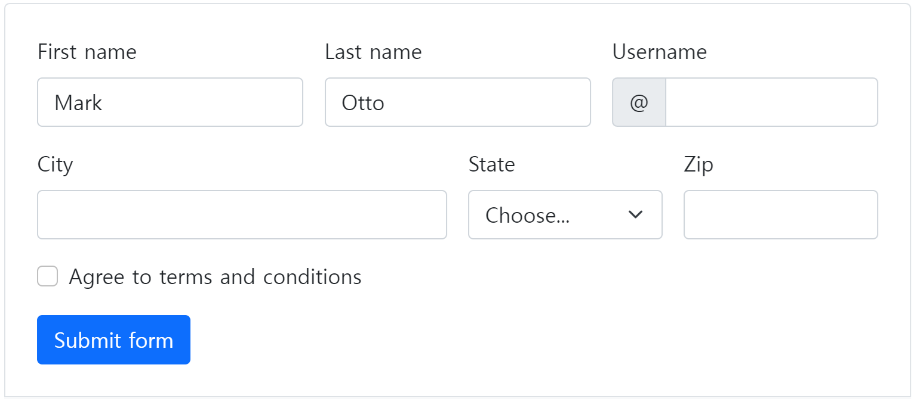

<br>

**브라우저 기본 폼 검증**

```html
<form class="row g-3">
  <div class="col-md-4">
    <label for="validationDefault01" class="form-label">First name</label>
    <input type="text" class="form-control" id="validationDefault01" value="Mark" required>
  </div>
  <div class="col-md-4">
    <label for="validationDefault02" class="form-label">Last name</label>
    <input type="text" class="form-control" id="validationDefault02" value="Otto" required>
  </div>
  <div class="col-md-4">
    <label for="validationDefaultUsername" class="form-label">Username</label>
    <div class="input-group">
      <span class="input-group-text" id="inputGroupPrepend2">@</span>
      <input type="text" class="form-control" id="validationDefaultUsername"  aria-describedby="inputGroupPrepend2" required>
    </div>
  </div>
  <div class="col-md-6">
    <label for="validationDefault03" class="form-label">City</label>
    <input type="text" class="form-control" id="validationDefault03" required>
  </div>
  <div class="col-md-3">
    <label for="validationDefault04" class="form-label">State</label>
    <select class="form-select" id="validationDefault04" required>
      <option selected disabled value="">Choose...</option>
      <option>...</option>
    </select>
  </div>
  <div class="col-md-3">
    <label for="validationDefault05" class="form-label">Zip</label>
    <input type="text" class="form-control" id="validationDefault05" required>
  </div>
  <div class="col-12">
    <div class="form-check">
      <input class="form-check-input" type="checkbox" value="" id="invalidCheck2" required>
      <label class="form-check-label" for="invalidCheck2">
        Agree to terms and conditions
      </label>
    </div>
  </div>
  <div class="col-12">
    <button class="btn btn-primary" type="submit">Submit form</button>
  </div>
</form>
```


<br>

**서버사이드 연동 폼 검증**

```html
<form class="row g-3">
  <div class="col-md-4">
    <label for="validationServer01" class="form-label">First name</label>
    <input type="text" class="form-control is-valid" id="validationServer01" value="Mark" required>
    <div class="valid-feedback">
      Looks good!
    </div>
  </div>
  <div class="col-md-4">
    <label for="validationServer02" class="form-label">Last name</label>
    <input type="text" class="form-control is-valid" id="validationServer02" value="Otto" required>
    <div class="valid-feedback">
      Looks good!
    </div>
  </div>
  <div class="col-md-4">
    <label for="validationServerUsername" class="form-label">Username</label>
    <div class="input-group has-validation">
      <span class="input-group-text" id="inputGroupPrepend3">@</span>
      <input type="text" class="form-control is-invalid" id="validationServerUsername" aria-describedby="inputGroupPrepend3 validationServerUsernameFeedback" required>
      <div id="validationServerUsernameFeedback" class="invalid-feedback">
        Please choose a username.
      </div>
    </div>
  </div>
  <div class="col-md-6">
    <label for="validationServer03" class="form-label">City</label>
    <input type="text" class="form-control is-invalid" id="validationServer03" aria-describedby="validationServer03Feedback" required>
    <div id="validationServer03Feedback" class="invalid-feedback">
      Please provide a valid city.
    </div>
  </div>
  <div class="col-md-3">
    <label for="validationServer04" class="form-label">State</label>
    <select class="form-select is-invalid" id="validationServer04" aria-describedby="validationServer04Feedback" required>
      <option selected disabled value="">Choose...</option>
      <option>...</option>
    </select>
    <div id="validationServer04Feedback" class="invalid-feedback">
      Please select a valid state.
    </div>
  </div>
  <div class="col-md-3">
    <label for="validationServer05" class="form-label">Zip</label>
    <input type="text" class="form-control is-invalid" id="validationServer05" aria-describedby="validationServer05Feedback" required>
    <div id="validationServer05Feedback" class="invalid-feedback">
      Please provide a valid zip.
    </div>
  </div>
  <div class="col-12">
    <div class="form-check">
      <input class="form-check-input is-invalid" type="checkbox" value="" id="invalidCheck3" aria-describedby="invalidCheck3Feedback" required>
      <label class="form-check-label" for="invalidCheck3">
        Agree to terms and conditions
      </label>
      <div id="invalidCheck3Feedback" class="invalid-feedback">
        You must agree before submitting.
      </div>
    </div>
  </div>
  <div class="col-12">
    <button class="btn btn-primary" type="submit">Submit form</button>
  </div>
</form>
```

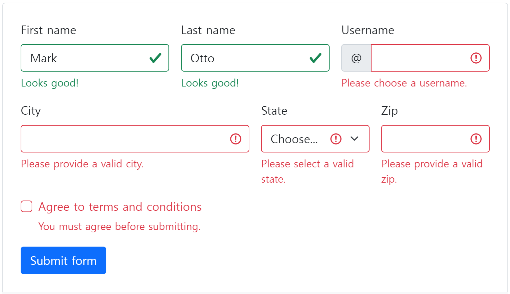

<br>

**폼 컨트롤 지원 폼 검증**

```html
<form class="was-validated">
  <div class="mb-3">
    <label for="validationTextarea" class="form-label">Textarea</label>
    <textarea class="form-control is-invalid" id="validationTextarea" placeholder="Required example textarea" required></textarea>
    <div class="invalid-feedback">
      Please enter a message in the textarea.
    </div>
  </div>

  <div class="form-check mb-3">
    <input type="checkbox" class="form-check-input" id="validationFormCheck1" required>
    <label class="form-check-label" for="validationFormCheck1">Check this checkbox</label>
    <div class="invalid-feedback">Example invalid feedback text</div>
  </div>

  <div class="form-check">
    <input type="radio" class="form-check-input" id="validationFormCheck2" name="radio-stacked" required>
    <label class="form-check-label" for="validationFormCheck2">Toggle this radio</label>
  </div>
  <div class="form-check mb-3">
    <input type="radio" class="form-check-input" id="validationFormCheck3" name="radio-stacked" required>
    <label class="form-check-label" for="validationFormCheck3">Or toggle this other radio</label>
    <div class="invalid-feedback">More example invalid feedback text</div>
  </div>

  <div class="mb-3">
    <select class="form-select" required aria-label="select example">
      <option value="">Open this select menu</option>
      <option value="1">One</option>
      <option value="2">Two</option>
      <option value="3">Three</option>
    </select>
    <div class="invalid-feedback">Example invalid select feedback</div>
  </div>

  <div class="mb-3">
    <input type="file" class="form-control" aria-label="file example" required>
    <div class="invalid-feedback">Example invalid form file feedback</div>
  </div>

  <div class="mb-3">
    <button class="btn btn-primary" type="submit" disabled>Submit form</button>
  </div>
</form>
```

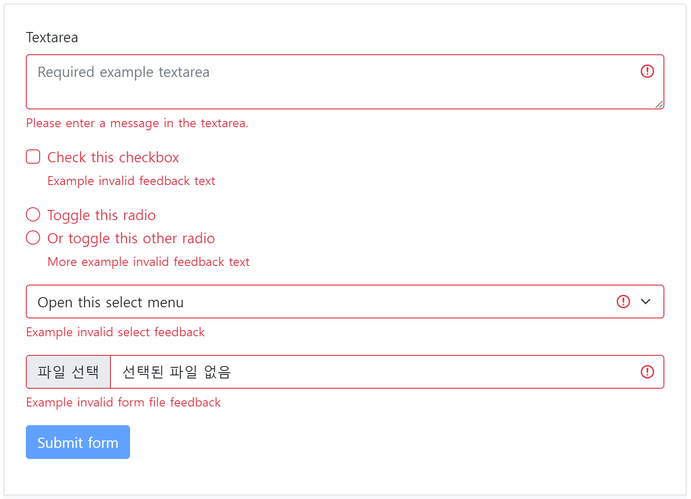

<br>

**폼 검증 툴팁**

```html
<form class="row g-3 needs-validation" novalidate>
  <div class="col-md-4 position-relative">
    <label for="validationTooltip01" class="form-label">First name</label>
    <input type="text" class="form-control" id="validationTooltip01" value="Mark" required>
    <div class="valid-tooltip">
      Looks good!
    </div>
  </div>
  <div class="col-md-4 position-relative">
    <label for="validationTooltip02" class="form-label">Last name</label>
    <input type="text" class="form-control" id="validationTooltip02" value="Otto" required>
    <div class="valid-tooltip">
      Looks good!
    </div>
  </div>
  <div class="col-md-4 position-relative">
    <label for="validationTooltipUsername" class="form-label">Username</label>
    <div class="input-group has-validation">
      <span class="input-group-text" id="validationTooltipUsernamePrepend">@</span>
      <input type="text" class="form-control" id="validationTooltipUsername" aria-describedby="validationTooltipUsernamePrepend" required>
      <div class="invalid-tooltip">
        Please choose a unique and valid username.
      </div>
    </div>
  </div>
  <div class="col-md-6 position-relative">
    <label for="validationTooltip03" class="form-label">City</label>
    <input type="text" class="form-control" id="validationTooltip03" required>
    <div class="invalid-tooltip">
      Please provide a valid city.
    </div>
  </div>
  <div class="col-md-3 position-relative">
    <label for="validationTooltip04" class="form-label">State</label>
    <select class="form-select" id="validationTooltip04" required>
      <option selected disabled value="">Choose...</option>
      <option>...</option>
    </select>
    <div class="invalid-tooltip">
      Please select a valid state.
    </div>
  </div>
  <div class="col-md-3 position-relative">
    <label for="validationTooltip05" class="form-label">Zip</label>
    <input type="text" class="form-control" id="validationTooltip05" required>
    <div class="invalid-tooltip">
      Please provide a valid zip.
    </div>
  </div>
  <div class="col-12">
    <button class="btn btn-primary" type="submit">Submit form</button>
  </div>
</form>
```

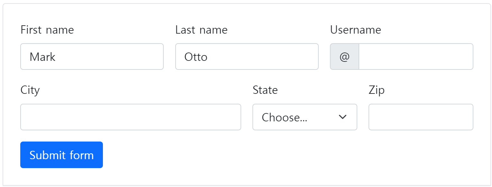


<br><br>

### 6-1-6. Bootstrap 컴포넌트 요소

#### 6-1-6-1. Accordion

```html
<div class="accordion" id="accordionExample">
  <div class="accordion-item">
    <h2 class="accordion-header" id="headingOne">
      <button class="accordion-button" type="button" data-bs-toggle="collapse" data-bs-target="#collapseOne" aria-expanded="true" aria-controls="collapseOne">
        Accordion Item #1
      </button>
    </h2>
    <div id="collapseOne" class="accordion-collapse collapse show" aria-labelledby="headingOne" data-bs-parent="#accordionExample">
      <div class="accordion-body">
        <strong>This is the first item's accordion body.</strong> It is shown by default, until the collapse plugin adds the appropriate classes that we use to style each element. These classes control the overall appearance, as well as the showing and hiding via CSS transitions. You can modify any of this with custom CSS or overriding our default variables. It's also worth noting that just about any HTML can go within the <code>.accordion-body</code>, though the transition does limit overflow.
      </div>
    </div>
  </div>
  <div class="accordion-item">
    <h2 class="accordion-header" id="headingTwo">
      <button class="accordion-button collapsed" type="button" data-bs-toggle="collapse" data-bs-target="#collapseTwo" aria-expanded="false" aria-controls="collapseTwo">
        Accordion Item #2
      </button>
    </h2>
    <div id="collapseTwo" class="accordion-collapse collapse" aria-labelledby="headingTwo" data-bs-parent="#accordionExample">
      <div class="accordion-body">
        <strong>This is the second item's accordion body.</strong> It is hidden by default, until the collapse plugin adds the appropriate classes that we use to style each element. These classes control the overall appearance, as well as the showing and hiding via CSS transitions. You can modify any of this with custom CSS or overriding our default variables. It's also worth noting that just about any HTML can go within the <code>.accordion-body</code>, though the transition does limit overflow.
      </div>
    </div>
  </div>
  <div class="accordion-item">
    <h2 class="accordion-header" id="headingThree">
      <button class="accordion-button collapsed" type="button" data-bs-toggle="collapse" data-bs-target="#collapseThree" aria-expanded="false" aria-controls="collapseThree">
        Accordion Item #3
      </button>
    </h2>
    <div id="collapseThree" class="accordion-collapse collapse" aria-labelledby="headingThree" data-bs-parent="#accordionExample">
      <div class="accordion-body">
        <strong>This is the third item's accordion body.</strong> It is hidden by default, until the collapse plugin adds the appropriate classes that we use to style each element. These classes control the overall appearance, as well as the showing and hiding via CSS transitions. You can modify any of this with custom CSS or overriding our default variables. It's also worth noting that just about any HTML can go within the <code>.accordion-body</code>, though the transition does limit overflow.
      </div>
    </div>
  </div>
</div>
```

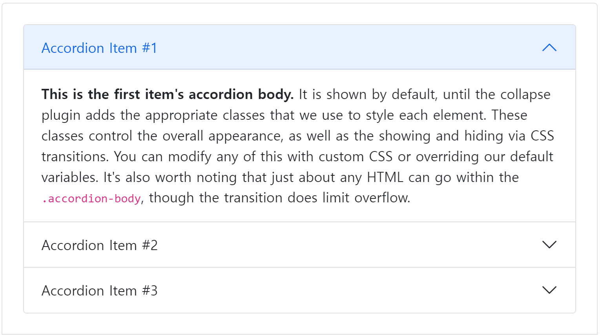

<br>

#### 6-1-6-2. Alert

```html
<div class="alert alert-warning alert-dismissible fade show" role="alert">
  <strong>입력 오류~!</strong> 아래 항목 중 일부를 확인해야 합니다. 입력되지 않은 항목이나 잘못 입력된 내용이 있을 수 있습니다.
  <button type="button" class="btn-close" data-bs-dismiss="alert" aria-label="Close"></button>
</div>
```

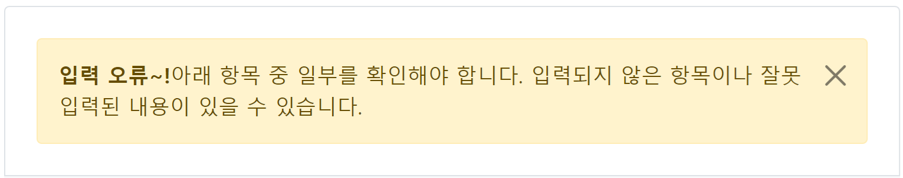

<br>

#### 6-1-6-3. Badge

```html
<button type="button" class="btn btn-primary position-relative">
  Inbox
  <span class="position-absolute top-0 start-100 translate-middle badge rounded-pill bg-danger">
    99+
    <span class="visually-hidden">unread messages</span>
  </span>
</button>
```


<br>

#### 6-1-6-4. Breadcrumb

```html
<nav aria-label="breadcrumb">
  <ol class="breadcrumb">
    <li class="breadcrumb-item active" aria-current="page">Home</li>
  </ol>
</nav>

<nav aria-label="breadcrumb">
  <ol class="breadcrumb">
    <li class="breadcrumb-item"><a href="#">Home</a></li>
    <li class="breadcrumb-item active" aria-current="page">Library</li>
  </ol>
</nav>

<nav aria-label="breadcrumb">
  <ol class="breadcrumb">
    <li class="breadcrumb-item"><a href="#">Home</a></li>
    <li class="breadcrumb-item"><a href="#">Library</a></li>
    <li class="breadcrumb-item active" aria-current="page">Data</li>
  </ol>
</nav>
```

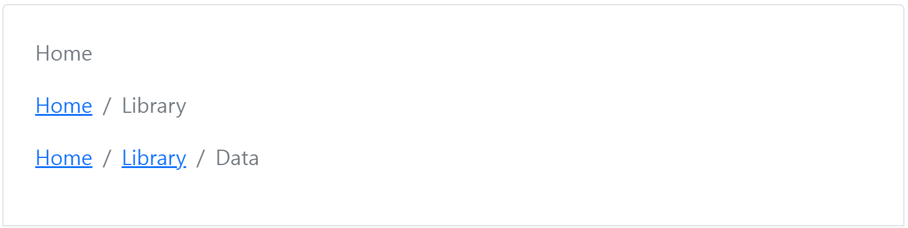

<br>

#### 6-1-6-5. Button

**버튼의 종류**

```html
<button type="button" class="btn btn-primary">Primary</button>
<button type="button" class="btn btn-secondary">Secondary</button>
<button type="button" class="btn btn-success">Success</button>
<button type="button" class="btn btn-danger">Danger</button>
<button type="button" class="btn btn-warning">Warning</button>
<button type="button" class="btn btn-info">Info</button>
<button type="button" class="btn btn-light">Light</button>
<button type="button" class="btn btn-dark">Dark</button>
<button type="button" class="btn btn-link">Link</button>
```

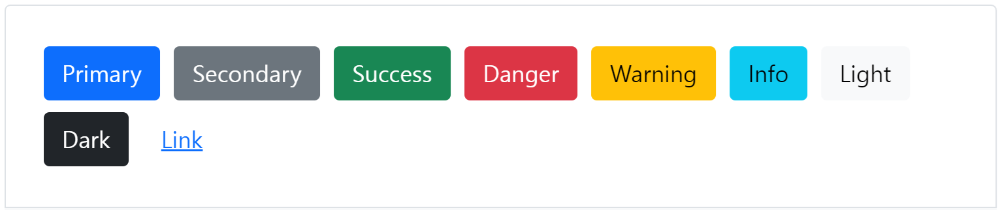

<br>

**기능별 버튼**

```html
<a class="btn btn-primary" href="#" role="button">Link</a>
<button class="btn btn-primary" type="submit">Button</button>
<input class="btn btn-primary" type="button" value="Input">
<input class="btn btn-primary" type="submit" value="Submit">
<input class="btn btn-primary" type="reset" value="Reset">
```

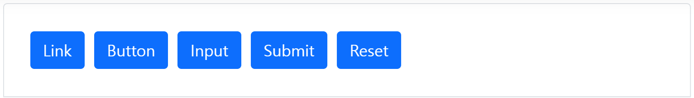


<br>

**윤곽선 버튼**

```html
<button type="button" class="btn btn-outline-primary">Primary</button>
<button type="button" class="btn btn-outline-secondary">Secondary</button>
<button type="button" class="btn btn-outline-success">Success</button>
<button type="button" class="btn btn-outline-danger">Danger</button>
<button type="button" class="btn btn-outline-warning">Warning</button>
<button type="button" class="btn btn-outline-info">Info</button>
<button type="button" class="btn btn-outline-light">Light</button>
<button type="button" class="btn btn-outline-dark">Dark</button>
```

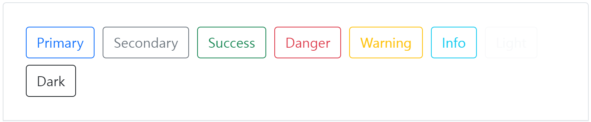

<br>

**크기별 버튼**

```html
<button type="button" class="btn btn-primary btn-lg">Large button</button>
<button type="button" class="btn btn-secondary btn-md">Medium button</button>
<button type="button" class="btn btn-secondary btn-sm">Small button</button>
```

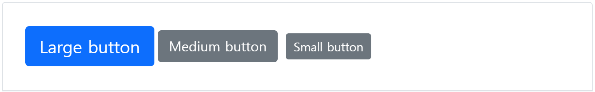

<br>

**버튼 위치과 배치**

```html
<div class="bd-example">
  <div class="d-grid gap-2">
    <button class="btn btn-primary" type="button">Button</button>
    <button class="btn btn-primary" type="button">Button</button>
  </div>
</div>
<div class="bd-example">
  <div class="d-grid gap-2 d-md-block">
    <button class="btn btn-primary" type="button">Button</button>
    <button class="btn btn-primary" type="button">Button</button>
  </div>
</div>
<div class="bd-example">
  <div class="d-grid gap-2 col-6 mx-auto">
    <button class="btn btn-primary" type="button">Button</button>
    <button class="btn btn-primary" type="button">Button</button>
  </div>
</div>
<div class="bd-example">
  <div class="d-grid gap-2 d-md-flex justify-content-md-end">
    <button class="btn btn-primary" type="button">Button</button>
    <button class="btn btn-primary" type="button">Button</button>
  </div>
</div>
```

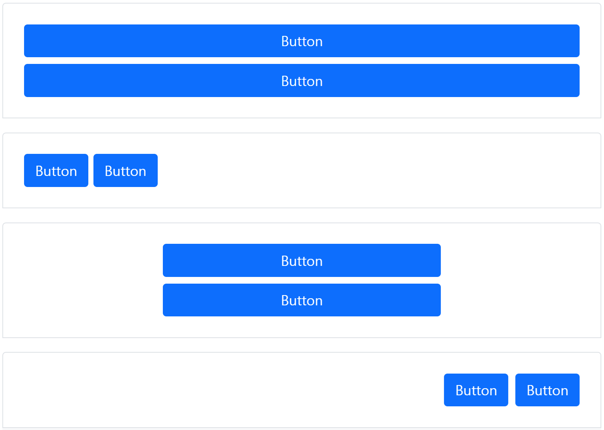

<br>

**버튼 그룹**

```html
<div class="btn-group" role="group" aria-label="Basic mixed styles example">
  <button type="button" class="btn btn-danger">Left</button>
  <button type="button" class="btn btn-warning">Middle</button>
  <button type="button" class="btn btn-success">Right</button>
</div>
```

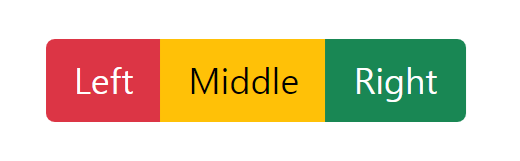

<br>

#### 6-1-6-6. Card

```html
<div class="card" style="width: 18rem;">
  
  <div class="card-body">
    <h5 class="card-title">Card title</h5>
    <p class="card-text">Some quick example text to build on the card title and make up the bulk of the card's content.</p>
    <a href="#" class="btn btn-primary">Go somewhere</a>
  </div>
</div>
```

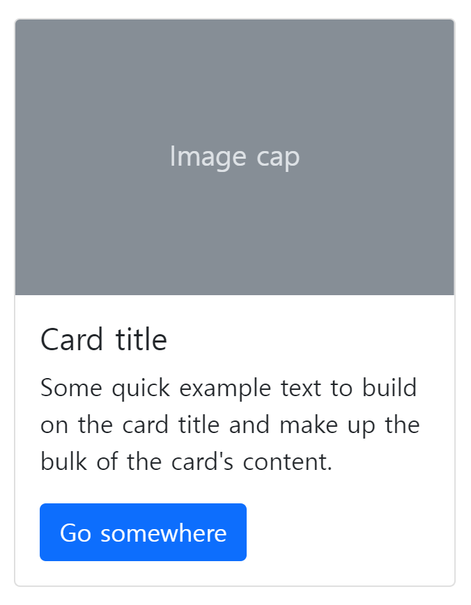

<br>

#### 6-1-6-7. Carousel

```html
<div id="carouselExampleCaptions" class="carousel slide" data-bs-ride="carousel">
  <div class="carousel-indicators">
    <button type="button" data-bs-target="#carouselExampleCaptions" data-bs-slide-to="0" class="active" aria-current="true" aria-label="Slide 1"></button>
    <button type="button" data-bs-target="#carouselExampleCaptions" data-bs-slide-to="1" aria-label="Slide 2"></button>
    <button type="button" data-bs-target="#carouselExampleCaptions" data-bs-slide-to="2" aria-label="Slide 3"></button>
  </div>
  <div class="carousel-inner">
    <div class="carousel-item active">
      
      <div class="carousel-caption d-none d-md-block">
        <h5>First slide label</h5>
        <p>Some representative placeholder content for the first slide.</p>
      </div>
    </div>
    <div class="carousel-item">
      
      <div class="carousel-caption d-none d-md-block">
        <h5>Second slide label</h5>
        <p>Some representative placeholder content for the second slide.</p>
      </div>
    </div>
    <div class="carousel-item">
      
      <div class="carousel-caption d-none d-md-block">
        <h5>Third slide label</h5>
        <p>Some representative placeholder content for the third slide.</p>
      </div>
    </div>
  </div>
  <button class="carousel-control-prev" type="button" data-bs-target="#carouselExampleCaptions" data-bs-slide="prev">
    <span class="carousel-control-prev-icon" aria-hidden="true"></span>
    <span class="visually-hidden">Previous</span>
  </button>
  <button class="carousel-control-next" type="button" data-bs-target="#carouselExampleCaptions" data-bs-slide="next">
    <span class="carousel-control-next-icon" aria-hidden="true"></span>
    <span class="visually-hidden">Next</span>
  </button>
</div>
```

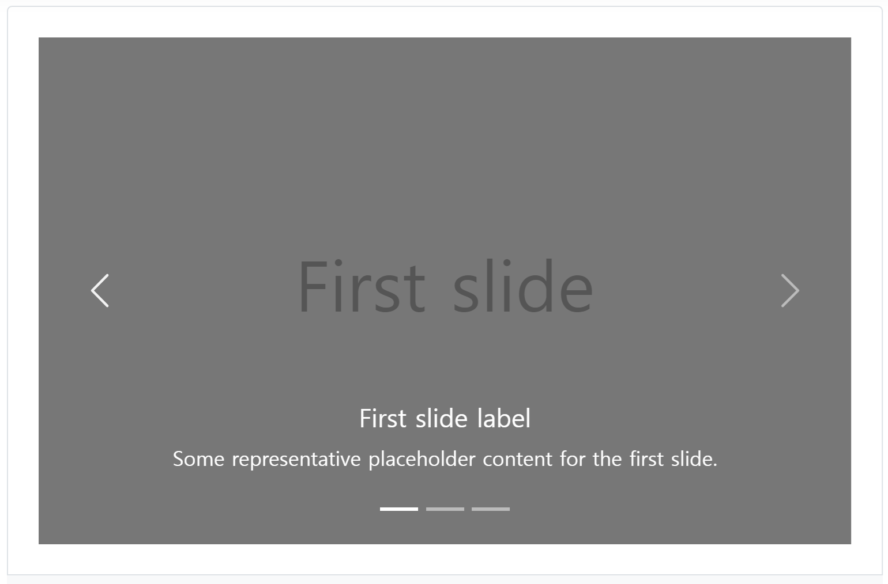

<br>

#### 6-1-6-8. Close Button

```html

```


<br>


#### 6-1-6-9. Collapse

```html
<p>
  <a class="btn btn-primary" data-bs-toggle="collapse" href="#collapseExample" role="button" aria-expanded="false" aria-controls="collapseExample">
    Link with href
  </a>
  <button class="btn btn-primary" type="button" data-bs-toggle="collapse" data-bs-target="#collapseExample" aria-expanded="false" aria-controls="collapseExample">
    Button with data-bs-target
  </button>
</p>
<div class="collapse" id="collapseExample">
  <div class="card card-body">
    Some placeholder content for the collapse component. This panel is hidden by default but revealed when the user activates the relevant trigger.
  </div>
</div>
```

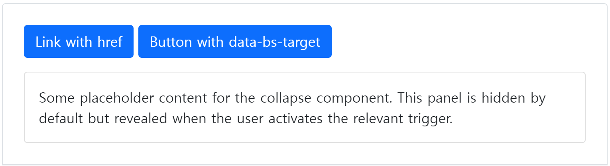

<br>


#### 6-1-6-10. Dropdown

```html
<!-- Example single danger button -->
<div class="btn-group">
  <button type="button" class="btn btn-danger dropdown-toggle" data-bs-toggle="dropdown" aria-expanded="false">
    Action
  </button>
  <ul class="dropdown-menu">
    <li><a class="dropdown-item" href="#">Action</a></li>
    <li><a class="dropdown-item" href="#">Another action</a></li>
    <li><a class="dropdown-item" href="#">Something else here</a></li>
    <li><hr class="dropdown-divider"></li>
    <li><a class="dropdown-item" href="#">Separated link</a></li>
  </ul>
</div>
```

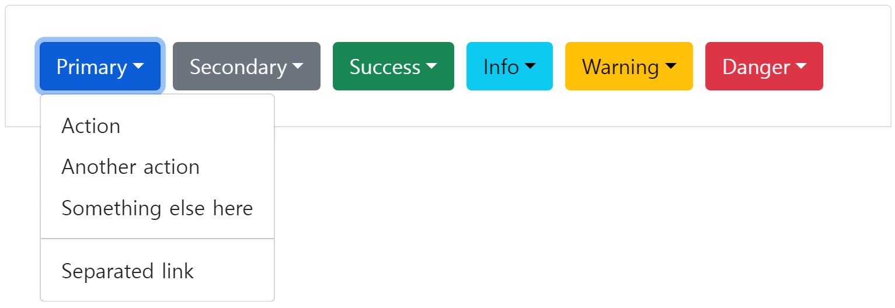

<br>

#### 6-1-6-11. List Group 

```html
<div class="list-group">
  <button type="button" class="list-group-item list-group-item-action active" aria-current="true">
    The current button
  </button>
  <button type="button" class="list-group-item list-group-item-action">A second item</button>
  <button type="button" class="list-group-item list-group-item-action">A third button item</button>
  <button type="button" class="list-group-item list-group-item-action">A fourth button item</button>
  <button type="button" class="list-group-item list-group-item-action" disabled>A disabled button item</button>
</div>
```

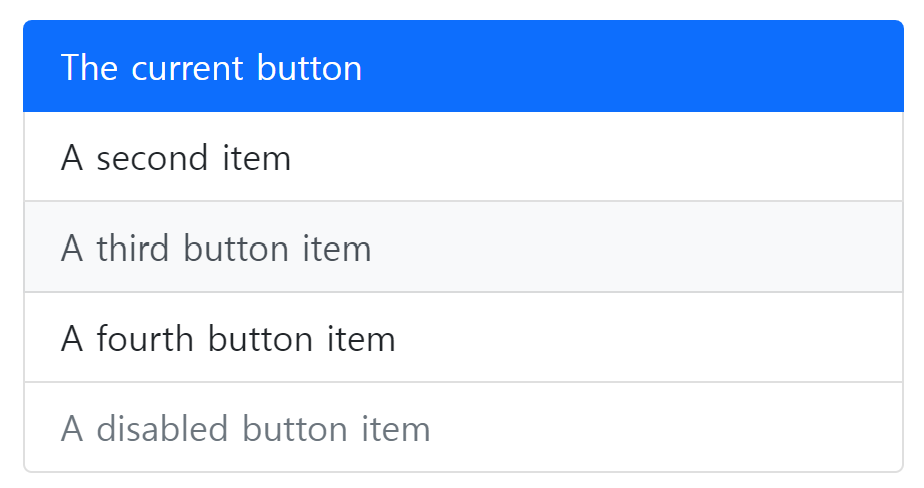

<br>


#### 6-1-6-12. Modal

```html
<div class="modal" tabindex="-1">
  <div class="modal-dialog">
    <div class="modal-content">
      <div class="modal-header">
        <h5 class="modal-title">Modal title</h5>
        <button type="button" class="btn-close" data-bs-dismiss="modal" aria-label="Close"></button>
      </div>
      <div class="modal-body">
        <p>Modal body text goes here.</p>
      </div>
      <div class="modal-footer">
        <button type="button" class="btn btn-secondary" data-bs-dismiss="modal">Close</button>
        <button type="button" class="btn btn-primary">Save changes</button>
      </div>
    </div>
  </div>
</div>
```

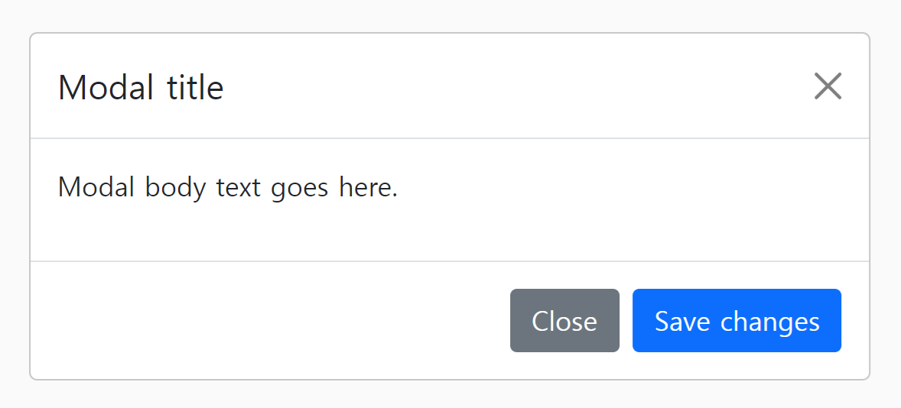

<br>

#### 6-1-6-13. Tabs 

```html
<ul class="nav nav-tabs">
  <li class="nav-item">
    <a class="nav-link active" aria-current="page" href="#">Active</a>
  </li>
  <li class="nav-item">
    <a class="nav-link" href="#">Link</a>
  </li>
  <li class="nav-item">
    <a class="nav-link" href="#">Link</a>
  </li>
  <li class="nav-item">
    <a class="nav-link disabled" href="#" tabindex="-1" aria-disabled="true">Disabled</a>
  </li>
</ul>
```


<br>


#### 6-1-6-14. Navbar

```html
<nav class="navbar navbar-expand-lg navbar-light bg-light">
  <div class="container-fluid">
    <a class="navbar-brand" href="#">Navbar scroll</a>
    <button class="navbar-toggler" type="button" data-bs-toggle="collapse" data-bs-target="#navbarScroll" aria-controls="navbarScroll" aria-expanded="false" aria-label="Toggle navigation">
      <span class="navbar-toggler-icon"></span>
    </button>
    <div class="collapse navbar-collapse" id="navbarScroll">
      <ul class="navbar-nav me-auto my-2 my-lg-0 navbar-nav-scroll" style="--bs-scroll-height: 100px;">
        <li class="nav-item">
          <a class="nav-link active" aria-current="page" href="#">Home</a>
        </li>
        <li class="nav-item">
          <a class="nav-link" href="#">Link</a>
        </li>
        <li class="nav-item dropdown">
          <a class="nav-link dropdown-toggle" href="#" id="navbarScrollingDropdown" role="button" data-bs-toggle="dropdown" aria-expanded="false">
            Link
          </a>
          <ul class="dropdown-menu" aria-labelledby="navbarScrollingDropdown">
            <li><a class="dropdown-item" href="#">Action</a></li>
            <li><a class="dropdown-item" href="#">Another action</a></li>
            <li><hr class="dropdown-divider"></li>
            <li><a class="dropdown-item" href="#">Something else here</a></li>
          </ul>
        </li>
        <li class="nav-item">
          <a class="nav-link disabled" href="#" tabindex="-1" aria-disabled="true">Link</a>
        </li>
      </ul>
      <form class="d-flex">
        <input class="form-control me-2" type="search" placeholder="Search" aria-label="Search">
        <button class="btn btn-outline-success" type="submit">Search</button>
      </form>
    </div>
  </div>
</nav>
```

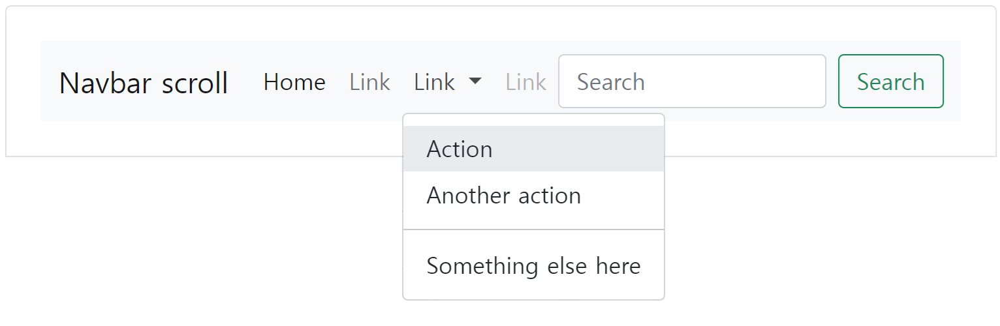

<br>

#### 6-1-6-15. Off Canvas

```html
<a class="btn btn-primary" data-bs-toggle="offcanvas" href="#offcanvasExample" role="button" aria-controls="offcanvasExample">
  Link with href
</a>
<button class="btn btn-primary" type="button" data-bs-toggle="offcanvas" data-bs-target="#offcanvasExample" aria-controls="offcanvasExample">
  Button with data-bs-target
</button>

<div class="offcanvas offcanvas-start" tabindex="-1" id="offcanvasExample" aria-labelledby="offcanvasExampleLabel">
  <div class="offcanvas-header">
    <h5 class="offcanvas-title" id="offcanvasExampleLabel">Offcanvas</h5>
    <button type="button" class="btn-close text-reset" data-bs-dismiss="offcanvas" aria-label="Close"></button>
  </div>
  <div class="offcanvas-body">
    <div>
      Some text as placeholder. In real life you can have the elements you have chosen. Like, text, images, lists, etc.
    </div>
    <div class="dropdown mt-3">
      <button class="btn btn-secondary dropdown-toggle" type="button" id="dropdownMenuButton" data-bs-toggle="dropdown">
        Dropdown button
      </button>
      <ul class="dropdown-menu" aria-labelledby="dropdownMenuButton">
        <li><a class="dropdown-item" href="#">Action</a></li>
        <li><a class="dropdown-item" href="#">Another action</a></li>
        <li><a class="dropdown-item" href="#">Something else here</a></li>
      </ul>
    </div>
  </div>
</div>
```

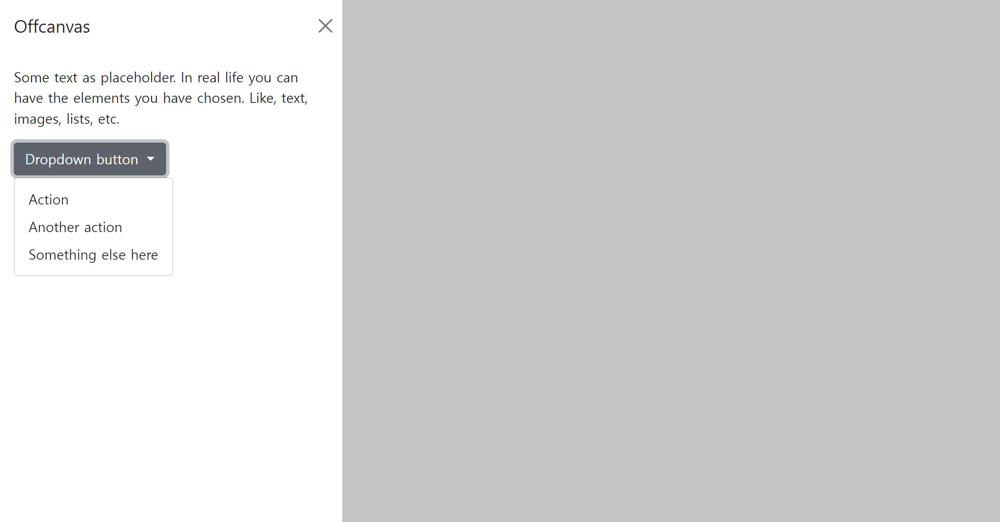

<br>


#### 6-1-6-16. Pagenation

```html
<nav aria-label="Page navigation example">
  <ul class="pagination">
    <li class="page-item">
      <a class="page-link" href="#" aria-label="Previous">
        <span aria-hidden="true">&laquo;</span>
      </a>
    </li>
    <li class="page-item"><a class="page-link" href="#">1</a></li>
    <li class="page-item"><a class="page-link" href="#">2</a></li>
    <li class="page-item"><a class="page-link" href="#">3</a></li>
    <li class="page-item">
      <a class="page-link" href="#" aria-label="Next">
        <span aria-hidden="true">&raquo;</span>
      </a>
    </li>
  </ul>
</nav>
```

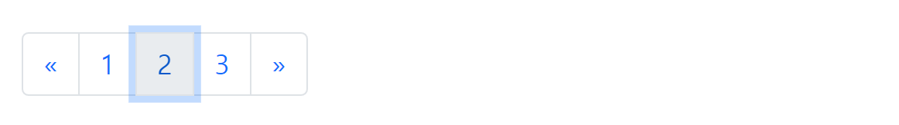

<br>

#### 6-1-6-17. Provers

```html
<button type="button" class="btn btn-lg btn-danger" data-bs-toggle="popover" title="Popover title" data-bs-content="And here's some amazing content. It's very engaging. Right?">Click to toggle popover</button>
```

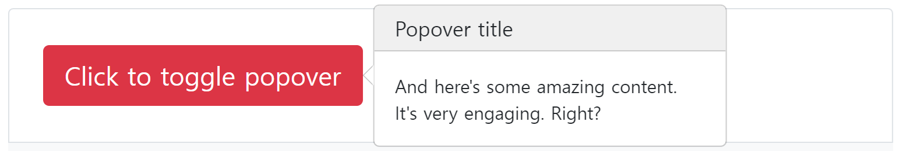

<br>


#### 6-1-6-18. Progressbar

```html
<div class="progress">
  <div class="progress-bar progress-bar-striped" role="progressbar" style="width: 10%" aria-valuenow="10" aria-valuemin="0" aria-valuemax="100"></div>
</div>
<div class="progress">
  <div class="progress-bar progress-bar-striped bg-success" role="progressbar" style="width: 25%" aria-valuenow="25" aria-valuemin="0" aria-valuemax="100"></div>
</div>
<div class="progress">
  <div class="progress-bar progress-bar-striped bg-info" role="progressbar" style="width: 50%" aria-valuenow="50" aria-valuemin="0" aria-valuemax="100"></div>
</div>
<div class="progress">
  <div class="progress-bar progress-bar-striped bg-warning" role="progressbar" style="width: 75%" aria-valuenow="75" aria-valuemin="0" aria-valuemax="100"></div>
</div>
<div class="progress">
  <div class="progress-bar progress-bar-striped bg-danger" role="progressbar" style="width: 100%" aria-valuenow="100" aria-valuemin="0" aria-valuemax="100"></div>
</div>
```

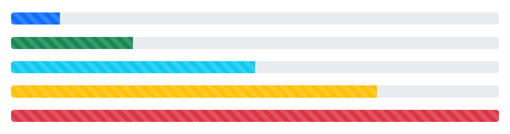

<br>

#### 6-1-6-19. Scrollspy

```html
<nav id="navbar-example2" class="navbar navbar-light bg-light px-3">
  <a class="navbar-brand" href="#">Navbar</a>
  <ul class="nav nav-pills">
    <li class="nav-item">
      <a class="nav-link" href="#scrollspyHeading1">First</a>
    </li>
    <li class="nav-item">
      <a class="nav-link" href="#scrollspyHeading2">Second</a>
    </li>
    <li class="nav-item dropdown">
      <a class="nav-link dropdown-toggle" data-bs-toggle="dropdown" href="#" role="button" aria-expanded="false">Dropdown</a>
      <ul class="dropdown-menu">
        <li><a class="dropdown-item" href="#scrollspyHeading3">Third</a></li>
        <li><a class="dropdown-item" href="#scrollspyHeading4">Fourth</a></li>
        <li><hr class="dropdown-divider"></li>
        <li><a class="dropdown-item" href="#scrollspyHeading5">Fifth</a></li>
      </ul>
    </li>
  </ul>
</nav>
<div data-bs-spy="scroll" data-bs-target="#navbar-example2" data-bs-offset="0" class="scrollspy-example" tabindex="0">
  <h4 id="scrollspyHeading1">First heading</h4>
  <p>...</p>
  <h4 id="scrollspyHeading2">Second heading</h4>
  <p>...</p>
  <h4 id="scrollspyHeading3">Third heading</h4>
  <p>...</p>
  <h4 id="scrollspyHeading4">Fourth heading</h4>
  <p>...</p>
  <h4 id="scrollspyHeading5">Fifth heading</h4>
  <p>...</p>
</div>
```

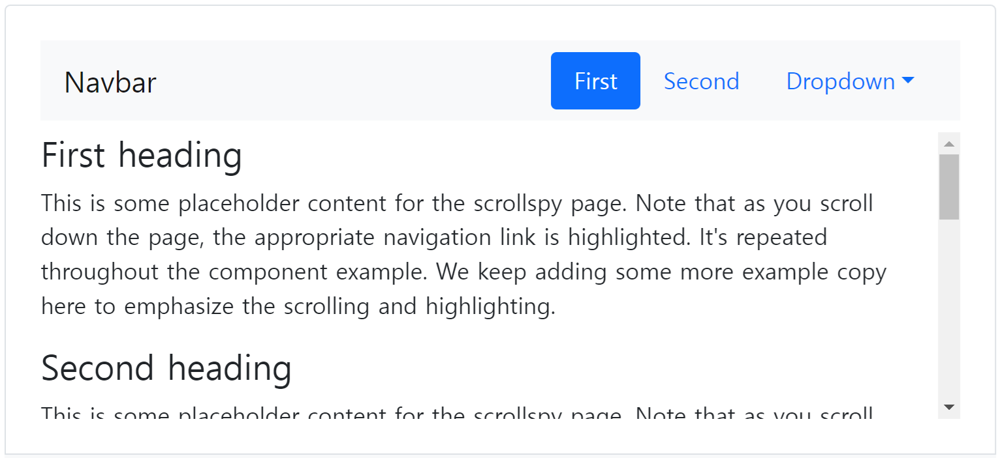

<br>

#### 6-1-6-20. Spinner

```html
<div class="spinner-border text-primary" role="status">
  <span class="visually-hidden">Loading...</span>
</div>
<div class="spinner-border text-secondary" role="status">
  <span class="visually-hidden">Loading...</span>
</div>
<div class="spinner-border text-success" role="status">
  <span class="visually-hidden">Loading...</span>
</div>
<div class="spinner-border text-danger" role="status">
  <span class="visually-hidden">Loading...</span>
</div>
<div class="spinner-border text-warning" role="status">
  <span class="visually-hidden">Loading...</span>
</div>
<div class="spinner-border text-info" role="status">
  <span class="visually-hidden">Loading...</span>
</div>
<div class="spinner-border text-light" role="status">
  <span class="visually-hidden">Loading...</span>
</div>
<div class="spinner-border text-dark" role="status">
  <span class="visually-hidden">Loading...</span>
</div>
```

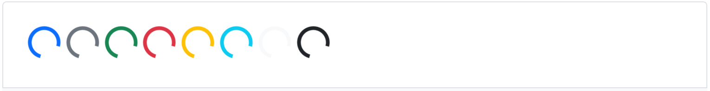

<br>

#### 6-1-6-21. Toasts

```html
<div class="toast-container">
  <div class="toast" role="alert" aria-live="assertive" aria-atomic="true">
    <div class="toast-header">
      
      <strong class="me-auto">Bootstrap</strong>
      <small class="text-muted">just now</small>
      <button type="button" class="btn-close" data-bs-dismiss="toast" aria-label="Close"></button>
    </div>
    <div class="toast-body">
      See? Just like this.
    </div>
  </div>

  <div class="toast" role="alert" aria-live="assertive" aria-atomic="true">
    <div class="toast-header">
      
      <strong class="me-auto">Bootstrap</strong>
      <small class="text-muted">2 seconds ago</small>
      <button type="button" class="btn-close" data-bs-dismiss="toast" aria-label="Close"></button>
    </div>
    <div class="toast-body">
      Heads up, toasts will stack automatically
    </div>
  </div>
</div>
```

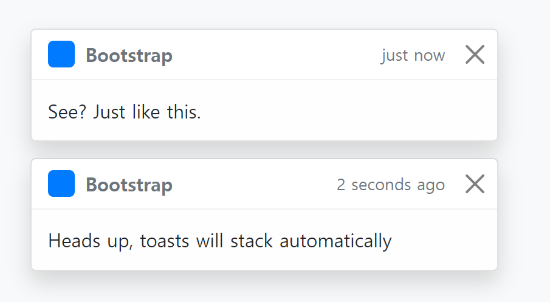

<br>

#### 6-1-6-22. Tooltips

```html
<button type="button" class="btn btn-secondary" data-bs-toggle="tooltip" data-bs-placement="top" title="Tooltip on top">
  Tooltip on top
</button>
<button type="button" class="btn btn-secondary" data-bs-toggle="tooltip" data-bs-placement="right" title="Tooltip on right">
  Tooltip on right
</button>
<button type="button" class="btn btn-secondary" data-bs-toggle="tooltip" data-bs-placement="bottom" title="Tooltip on bottom">
  Tooltip on bottom
</button>
<button type="button" class="btn btn-secondary" data-bs-toggle="tooltip" data-bs-placement="left" title="Tooltip on left">
  Tooltip on left
</button>
```

<br><br>

### 6-1-7. Bootstrap 심볼 요소

#### 6-1-7-1. Bootstrap Icon 설치

```shell
npm install bootstrap-icons --save-dev
```

<br>

#### 6-1-7-2. Bootstrap Icon 목록

[부트스트랩 아이콘 바로가기](https://icons.getbootstrap.com/)


<br>

#### 6-1-7-3. Bootstrap Icon 적용

**Embedded Icon**

```html
<svg xmlns="http://www.w3.org/2000/svg" width="16" height="16" fill="currentColor" class="bi bi-emoji-heart-eyes" viewBox="0 0 16 16"><path d="M8 15A7 7 0 1 1 8 1a7 7 0 0 1 0 14zm0 1A8 8 0 1 0 8 0a8 8 0 0 0 0 16z"/><path d="M11.315 10.014a.5.5 0 0 1 .548.736A4.498 4.498 0 0 1 7.965 13a4.498 4.498 0 0 1-3.898-2.25.5.5 0 0 1 .548-.736h.005l.017.005.067.015.252.055c.215.046.515.108.857.169.693.124 1.522.242 2.152.242.63 0 1.46-.118 2.152-.242a26.58 26.58 0 0 0 1.109-.224l.067-.015.017-.004.005-.002zM4.756 4.566c.763-1.424 4.02-.12.952 3.434-4.496-1.596-2.35-4.298-.952-3.434zm6.488 0c1.398-.864 3.544 1.838-.952 3.434-3.067-3.554.19-4.858.952-3.434z"/></svg>
```

<br>

**Sprite Icon**

```html
<svg class="bi" width="32" height="32" fill="currentColor">
  <use xlink:href="bootstrap-icons.svg#heart-fill"/>
</svg>
<svg class="bi" width="32" height="32" fill="currentColor">
  <use xlink:href="bootstrap-icons.svg#toggles"/>
</svg>
<svg class="bi" width="32" height="32" fill="currentColor">
  <use xlink:href="bootstrap-icons.svg#shop"/>
</svg>
```

<br>

**External image**

```html

```

<br>

**Icon font Icon**

```html
<i class="bi-alarm"></i>
<i class="bi-alarm" style="font-size: 2rem; color: cornflowerblue;"></i>
```

<br>

**CSS Include**

```css
.bi::before {
  display: inline-block;
  content: "";
  vertical-align: -.125em;
  background-image: url("data:image/svg+xml,<svg viewBox='0 0 16 16' fill='%23333' xmlns='http://www.w3.org/2000/svg'><path fill-rule='evenodd' d='M8 9.5a1.5 1.5 0 1 0 0-3 1.5 1.5 0 0 0 0 3z' clip-rule='evenodd'/></svg>");
  background-repeat: no-repeat;
  background-size: 1rem 1rem;
}
```

<br><br>

### 6-1-8. Bootstrap 을 적용한 애플리케이션 제작 실습

#### 6-1-8-1. 애플리케이션 생성 및 구조

**프로젝트 생성**

```shell
D:\gitRepository\vuejs\study06>vue create bootstrap

Vue CLI v5.0.8
? Please pick a preset: Manually select features
? Check the features needed for your project: Babel, TS, Router, Vuex
? Choose a version of Vue.js that you want to start the project with 3.x
? Use class-style component syntax? No
? Use Babel alongside TypeScript (required for modern mode, auto-detected polyfills, transpiling JSX)? Yes
? Use history mode for router? (Requires proper server setup for index fallback in production) Yes
? Where do you prefer placing config for Babel, ESLint, etc.? In package.json
? Save this as a preset for future projects? No
```

<br>

**필요한 라이브러리 및 패키지 설치**

```shell
D:\gitRepository\vuejs\study06>cd bootstrap
D:\gitRepository\vuejs\study06\bootstrap>npm install bootstrap --save-dev
D:\gitRepository\vuejs\study06\bootstrap>npm install axios --save-dev
D:\gitRepository\vuejs\study06\bootstrap>npm install webpack webpack-cli --save-dev
D:\gitRepository\vuejs\study06\bootstrap>npm install css-loader style-loader file-loader --save-dev
D:\gitRepository\vuejs\study06\bootstrap>npm install vue-loader vue-template-compiler --save-dev
D:\gitRepository\vuejs\study06\bootstrap>npm install express multer fs --save-dev
```

<br>

**프로젝트 구조**

```lua
bootstrap/
├── babel.config.js
├── package.json
├── public/
│   └── index.html
├── server.js
├── src/
│   ├── App.vue
│   ├── assets/
│   │   ├── product/
│   │   ├── styles/
│   │   │   └── main.css
│   │   ├── upload/
│   │   ├── bords.json
│   │   ├── dataroom.json
│   │   ├── products.json
│   │   ├── qnas.json
│   │   └── users.json
│   ├── components/
│   │   ├── Breadcrumb.vue
│   │   ├── Footer.vue
│   │   ├── Header.vue
│   │   ├── NavBar.vue
│   │   └── Visual.vue
│   ├── main.ts
│   ├── model/
│   │   └── index.ts
│   ├── router/
│   │   └── index.ts
│   ├── shims-vue.d.ts
│   ├── store/
│   │   └── index.ts
│   ├── views/
│   │   ├── AnswerCreate.vue
│   │   ├── BoardCreate.vue
│   │   ├── BoardDetail.vue
│   │   ├── BoardEdit.vue
│   │   ├── BoardList.vue
│   │   ├── Chat.vue
│   │   ├── DataCreate.vue
│   │   ├── DataDetail.vue
│   │   ├── DataEdit.vue
│   │   ├── DataList.vue
│   │   ├── DeliveryService.vue
│   │   ├── Faq.vue
│   │   ├── Greetings.vue
│   │   ├── History.vue
│   │   ├── Home.vue
│   │   ├── Intro.vue
│   │   ├── Login.vue
│   │   ├── OnlineService.vue
│   │   ├── Organization.vue
│   │   ├── ProductDetail.vue
│   │   ├── ProductList.vue
│   │   ├── QnaDetail.vue
│   │   ├── QnaEdit.vue
│   │   ├── QnaList.vue
│   │   ├── QuestionCreate.vue
│   │   ├── ReservationService.vue
│   │   ├── SendEmail.vue
│   │   ├── Signup.vue
│   │   ├── UserDetail.vue
│   │   └── VisitService.vue
├── tsconfig.json
├── vue.config.js
└── webpack.config.js
```

<br><br>

#### 6-1-8-2. 프로젝트 설정

**package.json**

```json
{
  "name": "bootstrap",
  "version": "0.1.0",
  "private": true,
  "scripts": {
    "serve": "vue-cli-service serve",
    "build": "vue-cli-service build"
  },
  "dependencies": {
    "axios": "^1.7.2",
    "core-js": "^3.8.3",
    "vue": "^3.2.13",
    "vue-router": "^4.0.3",
    "vuex": "^4.0.0"
  },
  "devDependencies": {
    "@vue/cli-plugin-babel": "~5.0.0",
    "@vue/cli-plugin-router": "~5.0.0",
    "@vue/cli-plugin-typescript": "~5.0.0",
    "@vue/cli-plugin-vuex": "~5.0.0",
    "@vue/cli-service": "~5.0.0",
    "bootstrap": "^5.0.2",
    "css-loader": "^7.1.2",
    "express": "^4.19.2",
    "file-loader": "^6.2.0",
    "fs": "^0.0.1-security",
    "multer": "^1.4.5-lts.1",
    "postcss-loader": "^8.1.1",
    "source-map-loader": "^5.0.0",
    "style-loader": "^4.0.0",
    "typescript": "~4.5.5",
    "url-loader": "^4.1.1",
    "vue-loader": "^17.4.2",
    "vue-template-compiler": "^2.7.16",
    "webpack": "^5.92.1",
    "webpack-cli": "^5.1.4"
  },
  "browserslist": [
    "> 1%",
    "last 2 versions",
    "not dead",
    "not ie 11"
  ]
}
```

<br><br>

**babel.config.js**

```javascript
module.exports = {
  presets: [
    '@vue/cli-plugin-babel/preset'
  ]
}
```

<br><br>

**server.js**

```javascript
const express = require('express');
const multer = require('multer');
const path = require('path');
const fs = require('fs');

const app = express();
const upload = multer({ dest: 'uploads/' });

app.use(express.static('public'));

app.post('/upload', upload.single('file'), (req, res) => {
  const tempPath = req.file.path;
  const targetPath = path.join(__dirname, 'public/assets/upload', req.file.originalname);

  fs.rename(tempPath, targetPath, err => {
    if (err) return res.status(500).json({ success: false });

    res.json({ success: true });
  });
});

app.post('/update-file/:filename', upload.single('file'), (req, res) => {
  const tempPath = req.file.path;
  const targetPath = path.join(__dirname, 'public/assets/upload', req.file.originalname);
  const oldFilePath = path.join(__dirname, 'public/assets/upload', req.params.filename);

  fs.rename(tempPath, targetPath, err => {
    if (err) return res.status(500).json({ success: false });

    fs.unlink(oldFilePath, unlinkErr => {
      if (unlinkErr) return res.status(500).json({ success: false });

      res.json({ success: true });
    });
  });
});

app.delete('/delete-file/:filename', (req, res) => {
  const filePath = path.join(__dirname, 'public/assets/upload', req.params.filename);

  fs.unlink(filePath, err => {
    if (err) return res.status(500).json({ success: false });

    res.json({ success: true });
  });
});

app.listen(3000, () => {
  console.log('Server started on http://localhost:3000');
});
```

<br><br>

**tsconfig.json**

```json
{
  "compilerOptions": {
    "target": "esnext",
    "module": "esnext",
    "strict": true,
    "jsx": "preserve",
    "moduleResolution": "node",
    "skipLibCheck": true,
    "esModuleInterop": true,
    "allowSyntheticDefaultImports": true,
    "forceConsistentCasingInFileNames": true,
    "resolveJsonModule": true,
    "useDefineForClassFields": true,
    "sourceMap": true,
    "baseUrl": ".",
    "types": [
      "webpack-env"
    ],
    "paths": {
      "@/*": [
        "src/*"
      ]
    },
    "lib": [
      "esnext",
      "dom",
      "dom.iterable",
      "scripthost"
    ]
  },
  "include": [
    "src/**/*.ts",
    "src/**/*.tsx",
    "src/**/*.vue",
    "tests/**/*.ts",
    "tests/**/*.tsx"
  ],
  "exclude": [
    "node_modules"
  ]
}
```

<br><br>

**vue.config.js**

```javascript
const { defineConfig } = require('@vue/cli-service')
module.exports = defineConfig({
  transpileDependencies: true
})
```

<br><br>

**webpack.config.js**

```javascript
const path = require('path');
const HtmlWebpackPlugin = require('html-webpack-plugin');
const { VueLoaderPlugin } = require('vue-loader');

module.exports = {
  entry: './src/main.js',
  output: {
    path: path.resolve(__dirname, 'dist'),
    filename: 'bundle.js'
  },
  resolve: {
    extensions: ['.js', '.vue', '.json'],
    alias: {
      '@': path.resolve(__dirname, 'src')
    }
  },
  module: {
    rules: [
      // Bootstrap의 JavaScript 파일을 처리하는 로더
      {
        test: /bootstrap\.js$/,
        use: {
          loader: 'babel-loader',
          options: {
            presets: ['@babel/preset-env']
          }
        }
      },
      // Bootstrap의 CSS 파일을 처리하는 로더
      {
        test: /bootstrap\.css$/,
        use: [
          'style-loader',
          'css-loader'
        ]
      },
      {
        test: /\.vue$/,
        use: 'vue-loader'
      },
      {
        test: /\.js$/,
        use: 'babel-loader',
        exclude: /node_modules/
      },
      {
        test: /\.css$/,
        use: [
          'style-loader',
          'css-loader'
        ]
      },
      {
        test: /\.(png|jpe?g|gif|svg)$/,
        loader: 'file-loader',
        options: {
          name: '[name].[ext]',
          outputPath: 'images/'
        }
      }
    ]
  },
  plugins: [
    new HtmlWebpackPlugin({
      template: './public/index.html',
      filename: 'index.html'
    }),
    new VueLoaderPlugin()
  ]
};
```

<br><br>

**src/main.ts**

- 프로젝트의 진입점 파일입니다.

```typescript
import { createApp } from 'vue';
import App from './App.vue';
import router from './router';
import store from './store';

// Bootstrap의 JavaScript 파일 임포트
import 'bootstrap/dist/js/bootstrap.js';
// Bootstrap의 CSS 파일 임포트
import 'bootstrap/dist/css/bootstrap.css';

createApp(App).use(router).use(store).mount('#app');
```

<br><br>

**src/router/index.ts**

- 라우터 설정 파일입니다.

```typescript
import { createRouter, createWebHistory } from 'vue-router';
import Home from '../views/Home.vue';
import Intro from '../views/Intro.vue';
import History from '../views/History.vue';
import Greetings from '../views/Greetings.vue';
import Organization from '../views/Organization.vue';
import BoardList from '../views/BoardList.vue';
import BoardDetail from '../views/BoardDetail.vue';
import BoardCreate from '../views/BoardCreate.vue';
import BoardEdit from '../views/BoardEdit.vue';
import OnlineService from '../views/OnlineService.vue';
import VisitService from '../views/VisitService.vue';
import DelyveryService from '../views/DelyveryService.vue';
import ReservationService from '../views/ReservationService.vue';
import ProductList from '../views/ProductList.vue';
import ProductDetail from '../views/ProductDetail.vue';
import Signup from '../views/Signup.vue';
import Login from '../views/Login.vue';
import UserDetail from '../views/UserDetail.vue';
import QnaList from '@/views/QnaList.vue';
import QnaDetail from '@/views/QnaDetail.vue';
import QuestionCreate from '@/views/QuestionCreate.vue';
import AnswerCreate from '@/views/AnswerCreate.vue';
import QnaEdit from '@/views/QnaEdit.vue';
import Faq from '@/views/Faq.vue';
import SendEmail from '@/views/SendEmail.vue';
import Chat from '@/views/Chat.vue';
import DataList from '@/views/DataList.vue';
import DataDetail from '@/views/DataDetail.vue';
import DataCreate from '@/views/DataCreate.vue';
import DataEdit from '@/views/DataEdit.vue';

const routes = [
  { path: '/', component: Home },
  { path: '/company/intro', component: Intro },
  { path: '/company/history', component: History },
  { path: '/company/greetings', component: Greetings },  
  { path: '/company/organization', component: Organization },
  { path: '/community/notice', component: BoardList },  
  { path: '/board/list', component: BoardList },
  { path: '/board/create', component: BoardCreate },
  { path: '/board/:id', name: 'BoardDetail', component: BoardDetail, props: true },
  { path: '/board/edit/:id', name: 'BoardEdit', component: BoardEdit, props: true },
  { path: '/service/online', component: OnlineService },
  { path: '/service/visit', component: VisitService },
  { path: '/service/delivery', component: DelyveryService },
  { path: '/service/reservation', component: ReservationService },
  { path: '/products', component: ProductList },
  { path: '/product/list', component: ProductList },
  { path: '/product/:id', name: 'ProductDetail', component: ProductDetail, props: true},
  { path: '/signup', component: Signup },
  { path: '/login', component: Login },
  { path: '/user/:id', component: UserDetail, props: true },
  { path: '/qna/list', component: QnaList },
  { path: '/qna/:id', component: QnaDetail, props: true },
  { path: '/qna/create', component: QuestionCreate },
  { path: '/qna/answer/:id', component: AnswerCreate, props: true },
  { path: '/qna/edit/:id', component: QnaEdit, props: true },
  { path: '/qnas', redirect: '/qna/list' },
  { path: '/data/list', name: 'DataList', component: DataList },
  { path: '/data/:id', name: 'DataDetail', component: DataDetail, props: true },
  { path: '/data/create', name: 'DataCreate', component: DataCreate },
  { path: '/data/edit/:id', name: 'DataEdit', component: DataEdit, props: true },
  { path: '/community/faq', component: Faq },
  { path: '/send-email', component: SendEmail },
  { path: '/chat', component: Chat }
];

const router = createRouter({
  history: createWebHistory(process.env.BASE_URL),
  routes,
});

export default router;
```

<br><br>

**store/index.ts**

- Vuex 스토어 설정 파일입니다.

```typescript
import { createStore } from 'vuex';

export default createStore({
  state: {},
  mutations: {},
  actions: {},
  modules: {}
});
```

<br><br>

#### 6-1-8-3. 컴포넌트 작성

**src/App.vue**

- 최상위 Vue 컴포넌트입니다.

```vue
<template>
  <div id="app">
    <NavBar />
    <router-view />
  </div>
</template>

<script lang="ts">
import { defineComponent } from 'vue';
import NavBar from './components/NavBar.vue';

export default defineComponent({
  name: 'App',
  components: {
    NavBar
  }
});
</script>

<style>
@import './assets/styles/main.css';
</style>
```

<br><br>

**src/components/NavBar.vue**

- 네비게이션 바 컴포넌트입니다.

```vue
<template>
  <nav class="navbar navbar-expand-lg navbar-light bg-light">
    <div class="container-fluid" style="width: 900px; margin: 0 auto;">
      <router-link class="navbar-brand" to="/">Morning</router-link>
      <button class="navbar-toggler" type="button" data-bs-toggle="collapse" data-bs-target="#navbarNav" aria-controls="navbarNav" aria-expanded="false" aria-label="Toggle navigation">
        <span class="navbar-toggler-icon"></span>
      </button>
      <div class="collapse navbar-collapse" id="navbarNav">
        <ul class="navbar-nav me-auto mb-2 mb-lg-0" style="justify-content: flex-end;">
          <li class="nav-item">
            <router-link v-if="isLoggedIn" :to="getUserDetailPath()" class="nav-link">My Page</router-link>
            <router-link v-else to="/signup" class="nav-link">SignUp</router-link>
          </li>
          <li class="nav-item">
            <a v-if="isLoggedIn" @click.prevent="logout" href="#" class="nav-link">Logout</a>
            <router-link v-else to="/login" class="nav-link">Login</router-link>
          </li>
        </ul>
      </div>
    </div>
  </nav>
</template>

<script lang="ts">
import { defineComponent, ref, watch, onMounted } from 'vue';
import { useRouter } from 'vue-router';

export default defineComponent({
  name: 'NavBar',
  setup() {
    const router = useRouter();
    const isLoggedIn = ref(false); // 반응성 변수로 로그인 상태 관리

    const getUserDetailPath = () => {
      const currentUser = JSON.parse(sessionStorage.getItem('currentUser') || '{}');
      return `/user/${currentUser.id}`;
    };

    const logout = () => {
      // 세션 스토리지에서 사용자 정보 삭제
      sessionStorage.removeItem('currentUser');
      isLoggedIn.value = false; // 로그아웃 상태로 변경

      // 로그아웃 후 메인 페이지로 이동
      router.push('/');
    };

    const checkSession = () => {
      const currentUser = sessionStorage.getItem('currentUser');
      isLoggedIn.value = currentUser !== null;
    };

    // 페이지 로드 시 세션 체크
    onMounted(checkSession);

    // 세션 변경 감지
    watch(() => sessionStorage.getItem('currentUser'), (newValue, oldValue) => {
      if (newValue !== oldValue) {
        isLoggedIn.value = newValue !== null;
        window.location.reload();
      }
      router.push('/');
    });

    return {
      isLoggedIn,
      getUserDetailPath,
      logout
    };
  }
});
</script>
```

<br><br>

**src/components/Breadcrumb.vue**

```vue
<template>
    <div class="full-screen">
        <nav aria-label="breadcrumb" class="container" >
            <ol class="breadcrumb">
                <li class="breadcrumb-item"><a href="#">Home</a></li>
                <li class="breadcrumb-item"><a :href="href" id="group">{{ group }}</a></li>
                <li class="breadcrumb-item active" aria-current="page" id="current">{{ current }}</li>
            </ol>
        </nav>
    </div>
</template>

<script lang="ts">
import { defineComponent } from 'vue';

export default defineComponent({
  name: 'Breadcrumb',
  props: {
    group: {
      type: String,
      required: true
    },
    current: {
      type: String,
      required: true
    },
    href: {
      type: String,
      required: true
    }
  }
});
</script>

<style>
.full-screen {
    margin: 0;
    padding: 0;
    width: 100%;
    padding-top: 0.8em;
    background-color: #ececec;
}

.breadcrumb {
    height: 40px;
    line-height: 40px;
}

.breadcrumb a {
    text-decoration: none;
}
</style>
```

<br><br>

**src/components/footer.vue**

```vue
<template>
    <footer class="bg-light">
      <div class="container">
        <!-- Add your footer content here -->
        <p>&copy; 2024 MyApp. All Rights Reserved.</p>
      </div>
    </footer>
  </template>
  
  <script>
  export default {
    name: 'Footer'
  };
  </script>
  
  <style scoped>
  /* Your footer styles here */
  </style>
```

<br><br>

**src/components/header.vue**

```vue
<template>
  <header>
    <nav class="navbar navbar-expand-lg navbar-light bg-light">
      <div class="container-fluid" style="width:900px; margin:0 auto;">
        <!-- Logo -->
        <a href="/" class="navbar-brand logo">
          
        </a>
        <button class="navbar-toggler" type="button" data-bs-toggle="collapse" data-bs-target="#navbarSupportedContent" aria-controls="navbarSupportedContent" aria-expanded="false" aria-label="Toggle navigation">
            <span class="navbar-toggler-icon"></span>
        </button>
        <!-- Main Menu -->
        <nav class="collapse navbar-collapse" id="navbarSupportedContent" style="margin-left:60px;">
          <ul class="navbar-nav me-auto mb-2 mb-lg-0">
            <li class="nav-item dropdown">
              <a href="/company" class="nav-link dropdown-toggle" id="navbarDropdown1" role="button" data-bs-toggle="dropdown" aria-expanded="false">Company</a>
              <ul class="dropdown-menu" aria-labelledby="navbarDropdown1">
                <li><a href="/company/intro" class="dropdown-item" >회사소개</a></li>
                <li><a href="/company/history" class="dropdown-item" >회사연혁</a></li>
                <li><a href="/company/greetings" class="dropdown-item" >인사말</a></li>
                <li><a href="/company/organization" class="dropdown-item" >조직</a></li>
              </ul>
            </li>
            <li class="nav-item dropdown">
              <a href="/product" class="nav-link dropdown-toggle" id="navbarDropdown2" role="button" data-bs-toggle="dropdown" aria-expanded="false">Product</a>
              <ul class="dropdown-menu" aria-labelledby="navbarDropdown2">
                <li><a href="/products" class="dropdown-item" >비스켓</a></li>
                <li><a href="/products" class="dropdown-item" >스낵</a></li>
                <li><a href="/products" class="dropdown-item" >기타</a></li>
              </ul>
            </li>
            <li class="nav-item dropdown">
              <a href="/service" class="nav-link dropdown-toggle" id="navbarDropdown3" role="button" data-bs-toggle="dropdown" aria-expanded="false">Service</a>
              <ul class="dropdown-menu" aria-labelledby="navbarDropdown3">
                <li><a href="/service/online" class="dropdown-item" >온라인 서비스</a></li>
                <li><a href="/service/visit" class="dropdown-item" >방문 서비스</a></li>
                <li><a href="/service/delivery" class="dropdown-item" >택배 서비스</a></li>
                <li><a href="/service/reservation" class="dropdown-item" >시설 이용 예약 서비스</a></li>
              </ul>
            </li>
            <li class="nav-item dropdown">
              <a href="/community" class="nav-link dropdown-toggle" id="navbarDropdown4" role="button" data-bs-toggle="dropdown" aria-expanded="false">Community</a>
              <ul class="dropdown-menu" aria-labelledby="navbarDropdown4">
                <li><a href="/community/notice" class="dropdown-item" >공지사항</a></li>
                <li><a href="/qna/list" class="dropdown-item" >질문 및 답변</a></li>
                <li><a href="/data/list" class="dropdown-item" >자료실</a></li>
                <li><a href="/community/faq" class="dropdown-item" >자주하는 질문</a></li>
                <li><a href="/send-email" class="dropdown-item" >온라인 상담</a></li>
                <li><a href="/chat" class="dropdown-item" >챗봇 상담</a></li>
              </ul>
            </li>
          </ul>
        </nav>
 
      </div>
    </nav>
  </header>
</template>

<script lang="ts">
import { defineComponent } from 'vue';

export default defineComponent({
  name: 'Header',
  data() {
    return {
      isAuthenticated: false // 이 값은 실제 로그인 여부에 따라 변경되어야 합니다.
    };
  }
});
</script>

<style scoped>
/* Add custom CSS for hover dropdown */
.nav-item.dropdown:hover .dropdown-menu {
  display: block;
}

.dropdown-menu {
  margin-top: 0; /* Adjust margin if needed */
}
.logo {
  display: block;
  width: 90px;
}

.logo img {
  display: block;
  width: 100%;
  height: auto;
}

.dropdown-toggle::after {
  border: none;
}

.nav-link {
  min-width: 180px; 
  font-size: 1.4em;
}
</style>
```

<br><br>

**src/components/Visual.vue**

```vue
<template>
    <figure class="full-screen">
      
    </figure>
</template>

<script lang="ts">
import { defineComponent } from 'vue';

export default defineComponent({
  name: 'Visual',
  props: {
    src: {
      type: String,
      required: true
    },
    alt: {
      type: String,
      required: true
    }
  }
});
</script>

<style>
.full-screen {
  margin: 0;
  padding: 0;
  width: 100%;
  max-height: 400px;
  overflow: hidden;
}

.full-screen .img {
  display: block;
  width: 100%;
  height: auto;
}
</style>
```

<br><br>

### 6-1-8-4. View 작성

**views/Home.vue**

- 메인 페이지입니다.

```vue
<template>
  <div>
    <div class="container-fluid mt-5">
      <div id="carouselExampleCaptions" class="carousel slide" data-bs-ride="carousel">
        <div class="carousel-indicators">
          <button type="button" data-bs-target="#carouselExampleCaptions" data-bs-slide-to="0" class="active" aria-label="Slide 1" aria-current="true"></button>
          <button type="button" data-bs-target="#carouselExampleCaptions" data-bs-slide-to="1" aria-label="Slide 2" class=""></button>
          <button type="button" data-bs-target="#carouselExampleCaptions" data-bs-slide-to="2" aria-label="Slide 3" class=""></button>
        </div>
        <div class="carousel-inner">
          <div class="carousel-item item1 active">
            <div class="carousel-caption d-none d-md-block">
              <h5>First slide label</h5>
              <p>Some representative placeholder content for the first slide.</p>
            </div>
          </div>
          <div class="carousel-item item2">
            <div class="carousel-caption d-none d-md-block">
              <h5>Second slide label</h5>
              <p>Some representative placeholder content for the second slide.</p>
            </div>
          </div>
          <div class="carousel-item item3">
            <div class="carousel-caption d-none d-md-block">
              <h5>Third slide label</h5>
              <p>Some representative placeholder content for the third slide.</p>
            </div>
          </div>
        </div>
        <button class="carousel-control-prev" type="button" data-bs-target="#carouselExampleCaptions" data-bs-slide="prev">
          <span class="carousel-control-prev-icon" aria-hidden="true"></span>
          <span class="visually-hidden">Previous</span>
        </button>
        <button class="carousel-control-next" type="button" data-bs-target="#carouselExampleCaptions" data-bs-slide="next">
          <span class="carousel-control-next-icon" aria-hidden="true"></span>
          <span class="visually-hidden">Next</span>
        </button>
      </div>
    </div>

    <!-- 제품 목록 카드 -->
    <div class="container my-5">
      <h2 class="mb-4">Hot Item</h2>
      <div class="row">
        <div v-for="product in products" :key="product.id" class="col-md-4 mb-4">
          <div class="card h-100">
            
            <div class="card-body">
              <h5 class="card-title">{{ product.name }}</h5>
              <!-- 수정된 부분: v-html을 이용하여 제품 설명 HTML을 출력 -->
              <div v-html="product.description"></div>
              <p class="card-text"><strong>Price:</strong> {{ product.price }}원</p>
            </div>
          </div>
        </div>
      </div>
    </div>
  </div>  
</template>

<script lang="ts">
import { defineComponent } from 'vue';
import products from '@/assets/products.json';

interface Product {
  id: number;
  name: string;
  price: number;
  description: string; // HTML 형식의 제품 설명
  image: string;
}

export default defineComponent({
  name: 'Home',
  data() {
    return {
      products: [] as Product[],
      loading: false,
      error: null,
    };
  },
  methods: {
    reloadPage() {
      window.location.reload();
    }
  },
  created() {
    this.products = products.slice(0, 3).map(product => ({
      ...product,
      image: require(`@/assets/product/${product.image.split('/').pop()}`),
    })); 
  },
});
</script>

<style>
body {  -ms-overflow-style: none;  }
::-webkit-scrollbar {   display: none;  }
.container-fluid { margin: 0; padding: 0; width: 100vw; box-sizing: border-box; }
#carouselExampleCaptions { width: 100%; margin: 0; padding: 0; }
.carousel-item { 
  height: 400px;
  background-repeat: no-repeat; 
  background-size:100% auto; 
  background-position:center center; 
}
.carousel-item.item1 { 
  background-image: url("../assets/vs001.jpg");
}
.carousel-item.item2 { 
  background-image: url("../assets/vs005.jpg");
}
.carousel-item.item3 { 
  background-image: url("../assets/vs004.jpg");
}
</style>
```

<br><br>

**BoardList.vue**

```vue
<template>
  <div>
    <Visual :src="src" alt="Board" />
    <Breadcrumb group="Board" current="List" :href="href" />
    <div class="container mt-5">
      <h1>Board List</h1>
      <hr />
      <!-- 검색 입력 폼 -->
      <div class="mb-3">
        <label for="searchText" class="form-label">검색</label>
        <input type="text" class="form-control" id="searchText" v-model="searchText" @input="filterPosts" />
      </div>
      <!-- 글 목록 테이블 -->
      <table class="table table-striped">
        <thead>
          <tr>
            <th>#</th>
            <th>Title</th>
            <th>Author</th>
            <th>Date</th>
          </tr>
        </thead>
        <tbody>
          <tr v-for="(post, index) in paginatedPosts" :key="post.id">
            <td>{{ index + 1 + (currentPage - 1) * postsPerPage }}</td>
            <td><router-link :to="`/board/${post.id}`">{{ post.title }}</router-link></td>
            <td>{{ post.author }}</td>
            <td>{{ post.date }}</td>
          </tr>
        </tbody>
      </table>
      <!-- 페이지네이션 -->
      <nav aria-label="Page navigation example">
        <ul class="pagination">
          <li class="page-item" :class="{ 'disabled': currentPage === 1 }">
            <button class="page-link" @click="prevPage">&laquo;</button>
          </li>
          <li class="page-item" v-for="pageNumber in totalPages" :key="pageNumber" :class="{ 'active': pageNumber === currentPage }">
            <button class="page-link" @click="goToPage(pageNumber)">{{ pageNumber }}</button>
          </li>
          <li class="page-item" :class="{ 'disabled': currentPage === totalPages }">
            <button class="page-link" @click="nextPage">&raquo;</button>
          </li>
        </ul>
      </nav>
      <!-- 글쓰기 버튼 -->
      <div class="btn-group">
        <router-link to="/board/create" class="btn btn-primary">글쓰기</router-link>
      </div>
    </div>
  </div>
</template>

<script lang="ts">
import { defineComponent } from 'vue';
import Breadcrumb from '@/components/Breadcrumb.vue';
import Visual from '@/components/Visual.vue';
import boards from '@/assets/boards.json'; // boards.json 파일 import

interface Post {
  id: number;
  title: string;
  author: string;
  date: string;
  content: string;
}

export default defineComponent({
  name: 'BoardList',
  components: {
    Breadcrumb,
    Visual
  },
  data() {
    return {
      posts: [] as Post[], // 타입 정의 추가
      filteredPosts: [] as Post[], // 타입 정의 추가
      searchText: '',
      src: new URL('@/assets/vs029.jpg', import.meta.url).href,
      href: "/board/list",
      currentPage: 1,
      postsPerPage: 5 // 페이지당 글 개수
    };
  },
  computed: {
    // 필터된 포스트를 현재 페이지에 맞게 슬라이스하여 보여줍니다.
    paginatedPosts(): Post[] {
      const startIndex = (this.currentPage - 1) * this.postsPerPage;
      return this.filteredPosts.slice(startIndex, startIndex + this.postsPerPage);
    },
    // 전체 페이지 수 계산
    totalPages(): number {
      return Math.ceil(this.filteredPosts.length / this.postsPerPage);
    }
  },
  mounted() {
    this.posts = boards as Post[]; // boards.json에서 데이터 가져오기
    this.filterPosts(); // 초기 필터링 적용
  },
  methods: {
    // 검색어에 따라 글 목록 필터링
    filterPosts(): void {
      if (this.searchText.trim() === '') {
        this.filteredPosts = this.posts;
      } else {
        this.filteredPosts = this.posts.filter(post =>
          post.title.toLowerCase().includes(this.searchText.toLowerCase())
        );
      }
      this.currentPage = 1; // 필터링 후 첫 페이지로 이동
    },
    // 페이지 이동
    goToPage(pageNumber: number): void {
      this.currentPage = pageNumber;
    },
    // 이전 페이지로 이동
    prevPage(): void {
      if (this.currentPage > 1) {
        this.currentPage--;
      }
    },
    // 다음 페이지로 이동
    nextPage(): void {
      if (this.currentPage < this.totalPages) {
        this.currentPage++;
      }
    }
  }
});
</script>

<style scoped>
/* 추가적인 스타일링 필요 시 여기에 작성 */
</style>
```

<br><br>

**views/BoardDetail.vue**

- 게시판 글 상세보기 페이지입니다.

```vue
<template>
    <div>
      <Visual :src="src" alt="Board" />
      <Breadcrumb group="Board" current="Detail" :href="href" />
      <div class="container mt-5">
        <h1>Board Detail</h1>
        <table v-if="post" class="table table-bordered">
        <tr>
          <th>Title</th>
          <td>{{ post.title }}</td>
        </tr>
        <tr>
          <th>Author</th>
          <td>{{ post.author }}</td>
        </tr>
        <tr>
          <th>Date</th>
          <td>{{ post.date }}</td>
        </tr>
        <tr>
          <th>Content</th>
          <td>{{ post.content }}</td>
        </tr>
      </table>
      <div v-else>
        <p>Post not found.</p>
      </div>      
      <div class="btn-group">
        <a :href="`/board/edit/${id}`" class="btn btn-warning">글 수정</a>
        <a @click="deletePost(post.id)" class="btn btn-danger">글 삭제</a>
        <a href="/board/create" class="btn btn-info">글 쓰기</a>
        <a href="/board/list" class="btn btn-primary" aria-current="page">글 목록</a>
      </div>
    </div>
    </div>
  </template>
  
  <script lang="ts">
  import { defineComponent } from 'vue';
  import Breadcrumb from '@/components/Breadcrumb.vue';
  import Visual from '@/components/Visual.vue';
  import boards from '@/assets/boards.json'; // Import boards.json file

  interface Post {
    id: number;
    title: string;
    author: string;
    date: string;
    content: string;
  }

export default defineComponent({
  name: 'BoardDetail',
  components: {
    Visual,
    Breadcrumb
  },
  props: {
    id: {
      type: String,
      required: true
    }
  },
  data() {
    return {
      src: new URL('@/assets/vs028.jpg', import.meta.url).href,
      post: {} as Post,
      href: "/board/list"
    };
  },
  mounted() {
    this.fetchPost();
  },
  methods: {
    fetchPost() {
      const route = this.$route;
      const postId = Number(route.params.id);
      this.post = boards.find(post => post.id === postId) || {} as Post;
    },
    deletePost(id: number) {
      // Filter out the post with the given id and update boards.json
      const updatedPosts = boards.filter(post => post.id !== id);
      // Replace the original boards.json (simulated action, replace with actual logic)
      console.log(updatedPosts);
      alert('게시글이 삭제되었습니다.');
      // Redirect to the list page
      this.$router.push('/board/list');
    }
  }
});
  </script>
```

<br><br>

**views/BoardCreate.vue**

- 게시판 글 등록 페이지입니다.

```vue
<template>
  <div>
    <Visual :src="src" alt="Board" />
    <Breadcrumb group="Board" current="Create" :href="href"/>
    <div class="container mt-5">
      <h1>Create New Post</h1>
      <hr>
      <form @submit.prevent="createPost">
        <div class="mb-3">
          <label for="title" class="form-label">Title</label>
          <input type="text" class="form-control" id="title" v-model="title" required>
        </div>
        <div class="mb-3">
          <label for="author" class="form-label">Author</label>
          <input type="text" class="form-control" id="author" v-model="author" required>
        </div>
        <div class="mb-3">
          <label for="content" class="form-label">Content</label>
          <textarea class="form-control" id="content" v-model="content" rows="3" required></textarea>
        </div>
        <div class="btn-group">
          <button type="submit" class="btn btn-danger">글 쓰기</button>
          <router-link to="/board/list" class="btn btn-primary" aria-current="page">글 목록</router-link>
        </div>
      </form>
    </div>
  </div>
</template>

<script lang="ts">
import { defineComponent } from 'vue';
import Breadcrumb from '@/components/Breadcrumb.vue';
import Visual from '@/components/Visual.vue';
import boards from '@/assets/boards.json'; // Import boards.json file

interface Post {
  id: number;
  title: string;
  author: string;
  date: string; // Optional if you want to track creation date
  content: string;
}

export default defineComponent({
  name: 'BoardCreate',
  components: {
    Breadcrumb,
    Visual
  },
  data() {
    return {
      title: '',
      author: 'Admin', // Default author is 'Admin'
      content: '',
      src: new URL('@/assets/vs029.jpg', import.meta.url).href,
      href: "/board/list"
    };
  },
  methods: {
    createPost() {
      const newPost: Post = {
        id: boards.length > 0 ? boards[boards.length - 1].id + 1 : 1, // Generate new ID
        title: this.title,
        author: this.author,
        content: this.content,
        date: new Date().toISOString() // Optional: Set current date/time
      };

      boards.push(newPost); // Add new post to the boards array

      // Optional: Save to localStorage or perform backend API call to persist data

      alert('Post created!'); // Inform user about successful creation

      // Redirect to board list view
      this.$router.push('/board/list');
    }
  }
});
</script>

<style scoped>
/* Your scoped styles here */
</style>
```

<br><br>

**views/BoardEdit.vue**

```vue
<template>
    <div>
      <Visual :src="src" alt="Board" />
      <Breadcrumb group="Board" current="Edit" :href="href"/>
      <div class="container mt-5">
        <h1>Edit Post</h1>
        <hr>
        <form @submit.prevent="editPost">
          <div class="mb-3">
            <label for="title" class="form-label">Title</label>
            <input type="text" class="form-control" id="title" v-model="post.title" required>
          </div>
          <div class="mb-3">
            <label for="author" class="form-label">Author</label>
            <input type="text" class="form-control" id="author" v-model="post.author" required>
          </div>
          <div class="mb-3">
            <label for="content" class="form-label">Content</label>
            <textarea class="form-control" id="content" v-model="post.content" rows="3" required></textarea>
          </div>
          <div class="btn-group">
            <button type="submit" class="btn btn-success">Save Changes</button>
            <router-link to="/board/list" class="btn btn-primary" aria-current="page">Cancel</router-link>
          </div>
        </form>
      </div>
    </div>
  </template>
  
  <script lang="ts">
  import { defineComponent } from 'vue';
  import { RouteLocationNormalizedLoaded, useRoute } from 'vue-router';
  import Breadcrumb from '@/components/Breadcrumb.vue';
  import Visual from '@/components/Visual.vue';
  import boards from '@/assets/boards.json';
  
  interface Post {
    id: number;
    title: string;
    author: string;
    date: string;
    content: string;
  }
  
  export default defineComponent({
    name: 'BoardEdit',
    components: {
      Breadcrumb,
      Visual
    },
    data() {
      return {
        src: new URL('@/assets/vs029.jpg', import.meta.url).href,
        post: {} as Post,
        href: "/board/list"
      };
    },
    mounted() {
      this.fetchPost();
    },
    methods: {
      fetchPost() {
        const route = useRoute();
        const postId = Number(route.params.id);
        this.post = boards.find(post => post.id === postId) || {} as Post;
      },
      editPost() {
        // Find index of the post in the array
        const index = boards.findIndex(post => post.id === this.post.id);
        if (index !== -1) {
          // Update post in the array
          boards[index] = { ...this.post };
          // Optional: Save to localStorage or perform backend API call to persist data
          alert('Post updated successfully!');
          // Redirect to board list view
          this.$router.push('/board/list');
        } else {
          alert('Post not found!');
        }
      }
    }
  });
  </script>
  
  <style scoped>
  /* Your scoped styles here */
  </style>
```

<br><br>

**views/ProductList.vue**

- 제품 목록 페이지입니다.

```vue
<template>
  <div>
    <Visual :src="src" alt="Product" />
    <Breadcrumb group="Product" current="List" :href="href" />
    <div class="container my-5">
      <h1>Product List</h1>
      <hr>
      <div v-if="loading" class="text-center">Loading...</div>
      <div v-if="error" class="alert alert-danger">{{ error }}</div>
      <div v-if="products.length" class="row">
        <div v-for="product in products" :key="product.id" class="col-md-4 mb-4">
          <router-link :to="`/product/${product.id}`">
            <div class="card h-100">
              
              <div class="card-body">
                <h5 class="card-title" style="font-weight:800;">{{ product.name }}</h5>
                <p class="card-text" v-html="product.description"></p>
                <p class="card-text"><strong>Price:</strong> {{ product.price }}원</p>
              </div>
            </div>
          </router-link>
        </div>
      </div>
    </div>
  </div>
</template>

<script>
import { defineComponent } from 'vue';
import Breadcrumb from '@/components/Breadcrumb.vue';
import Visual from '@/components/Visual.vue';
import products from '@/assets/products.json';

export default {
  name: 'ProductList',
  components: {
    Breadcrumb,
    Visual
  },
  data() {
    return {
      products: [],
      loading: false,
      error: null,
      src: new URL('@/assets/vs013.jpg', import.meta.url).href,
      href: "/products"
    };
  },
  created() {
    this.fetchProducts();
  },
  methods: {
    fetchProducts() {
      this.loading = true;
      try {
        this.products = products.map(product => ({
          ...product,
          imageUrl: require(`../assets/product/${product.image.split('/').pop()}`),
          image2: require(`../assets/product/${product.image2.split('/').pop()}`)
        }));
      } catch (error) {
        this.error = 'Failed to load products.';
      } finally {
        this.loading = false;
      }
    }
  }
};
</script>

<style scoped>
.card {
  text-align: center;
}
.card-img-top {
  width: 100%;
  height: auto;
}

a {
  text-decoration: none;
}
</style>
```

<br><br>

**views/ProductDetail.vue**

```vue
<template>
    <div>
        <Visual :src="src" alt="Product" />
        <Breadcrumb group="Product" current="Detail" :href="href" />
        <div class="container mt-5">
        <h1>제품 상세 정보</h1>
        <hr />
        <table class="table" style="width:900px; margin:0 auto;">
            <tbody v-if="product">
                <tr>
                    <td style="background-color: #fff;">
                        <div class="product-images">
                            
                        </div>
                    </td>
                    <td style="background-color: #fff;">
                        <br><br>
                        <h2>{{ product.name }}</h2>
                        <p><strong>가격:</strong> {{ product.price }} 원</p>
                        <div v-html="product.description"></div>
                    </td>
                </tr>
                <tr>
                    <td colspan="2">
                        <br><br><br>        
                        <div class="product-images" style="text-align: center;">   
                            
                        </div>
                    </td>
                </tr>
            </tbody>
            <tbody v-else>
                <tr>
                    <td colspan="2"><p>제품 정보를 불러오는 중 오류가 발생했습니다.</p></td>
                </tr>
            </tbody>
        </table>
        <div class="btn-group mt-3">
            <router-link to="/product/list" class="btn btn-primary">제품 목록</router-link>
        </div>
    </div>
    </div>
  </template>
  
  <script lang="ts">
  import { defineComponent } from 'vue';
  import { RouteLocationNormalizedLoaded } from 'vue-router';
  import products from '@/assets/products.json';
  
  interface Product {
    id: number;
    name: string;
    price: number;
    description: string;
    image: string;
    image2: string;
  }
  
  export default defineComponent({
    name: 'ProductDetail',
    data() {
      return {
        product: null as Product | null,
        productImage: '',
        productImage2: '',
        src: new URL('@/assets/vs013.jpg', import.meta.url).href,
        href: "/products"
      };
    },
    mounted() {
      this.fetchProduct();
    },
    methods: {
      fetchProduct() {
        const route = this.$route as RouteLocationNormalizedLoaded;
        const productId = Number(route.params.id);
        const product = products.find(product => product.id === productId) || null;
        if(product) {
            this.product = product;
            this.productImage = require(`../assets/product/${product.image.split('/').pop()}`);
            this.productImage2 = require(`../assets/product/${product.image2.split('/').pop()}`);
        }
      }
    }
  });
  </script>
  
  <style scoped>
  .product-images img {
    max-width: 100%;
    margin-bottom: 10px;
  }
  </style>
```

<br><br>

**views/QnaList.vue**

```vue
<template>
  <div>
    <Visual :src="src" alt="QnA" />
    <Breadcrumb group="QnA" current="List" :href="href" />
    <div class="container mt-5">
      <h1>QnA 목록</h1>
      <!-- 검색 입력 폼 -->
      <div class="mb-3">
        <label for="searchText" class="form-label">검색</label>
        <input type="text" class="form-control" id="searchText" v-model="searchText" @input="filterPosts" />
      </div>
      <ul class="list-group">
        <li class="list-group-item" v-for="post in paginatedPosts" :key="post.id">
          <router-link :to="`/qna/${post.id}`">
            <strong>{{ post.title }}</strong> - {{ post.author }} ({{ post.date }})
          </router-link>
        </li>
      </ul>
      <!-- 페이지네이션 -->
      <nav aria-label="Page navigation example">
        <ul class="pagination">
          <li class="page-item" :class="{ 'disabled': currentPage === 1 }">
            <button class="page-link" @click="prevPage">&laquo;</button>
          </li>
          <li class="page-item" v-for="pageNumber in totalPages" :key="pageNumber" :class="{ 'active': pageNumber === currentPage }">
            <button class="page-link" @click="goToPage(pageNumber)">{{ pageNumber }}</button>
          </li>
          <li class="page-item" :class="{ 'disabled': currentPage === totalPages }">
            <button class="page-link" @click="nextPage">&raquo;</button>
          </li>
        </ul>
      </nav>
      <!-- 글쓰기 버튼 -->
      <div class="btn-group">
        <router-link to="/qna/create" class="btn btn-secondary">글쓰기</router-link>
      </div>
    </div>
  </div>
</template>

<script lang="ts">
import { defineComponent } from 'vue';
import Breadcrumb from '@/components/Breadcrumb.vue';
import Visual from '@/components/Visual.vue';
import qnas from '@/assets/qnas.json';

interface Post {
  id: number;
  lev: number;
  parno: number;
  title: string;
  author: string;
  date: string;
  content: string;
}

export default defineComponent({
  name: 'QnaList',
  components: {
    Breadcrumb,
    Visual
  },
  data() {
    return {
      posts: [] as Post[], // 타입 정의 추가
      filteredPosts: [] as Post[], // 타입 정의 추가
      searchText: '',
      src: new URL('@/assets/vs025.jpg', import.meta.url).href,
      href: "/qna/list",
      currentPage: 1,
      postsPerPage: 5 // 페이지당 글 개수
    };
  },
  computed: {
    // 필터된 포스트를 현재 페이지에 맞게 슬라이스하여 보여줍니다.
    paginatedPosts(): Post[] {
      const startIndex = (this.currentPage - 1) * this.postsPerPage;
      return this.filteredPosts.slice(startIndex, startIndex + this.postsPerPage);
    },
    // 전체 페이지 수 계산
    totalPages(): number {
      return Math.ceil(this.filteredPosts.length / this.postsPerPage);
    }
  },
  mounted() {
    this.posts = qnas as Post[]; // qnas.json에서 데이터 가져오기
    this.filterPosts(); // 초기 필터링 적용
  },
  methods: {
    // 검색어에 따라 글 목록 필터링
    filterPosts(): void {
      if (this.searchText.trim() === '') {
        this.filteredPosts = this.posts;
      } else {
        this.filteredPosts = this.posts.filter(post =>
          post.title.toLowerCase().includes(this.searchText.toLowerCase())
        );
      }
      this.currentPage = 1; // 필터링 후 첫 페이지로 이동
    },
    // 페이지 이동
    goToPage(pageNumber: number): void {
      this.currentPage = pageNumber;
    },
    // 이전 페이지로 이동
    prevPage(): void {
      if (this.currentPage > 1) {
        this.currentPage--;
      }
    },
    // 다음 페이지로 이동
    nextPage(): void {
      if (this.currentPage < this.totalPages) {
        this.currentPage++;
      }
    }
  }
});
</script>

<style scoped>
/* 추가적인 스타일링 필요 시 여기에 작성 */
</style>
```

<br><br>

**views/QnaDetail.vue**

```vue
<template>
  <div>
    <Visual :src="src" alt="QnA" />
    <Breadcrumb group="QnA" current="Detail" :href="href" />
    <div class="container mt-5">
      <h1>QnA 상세 정보</h1>
      <hr />
      <div v-if="post">
        <table class="table table-bordered">
          <tr>
            <th>제목</th>
            <td>{{ post.title }}</td>
          </tr>
          <tr>
            <th>작성자</th>
            <td>{{ post.author }}</td>
          </tr>
          <tr>
            <th>작성일</th>
            <td>{{ post.date }}</td>
          </tr>
          <tr>
            <th>내용</th>
            <td>{{ post.content }}</td>
          </tr>
        </table>
        <div class="btn-group" v-if="post.lev === 0">
          <router-link :to="`/qna/answer/${post.id}`" class="btn btn-info">답변하기</router-link>
          <router-link :to="`/qna/edit/${post.id}`" class="btn btn-warning">글 수정</router-link>
          <button @click="deletePost(post.id)" class="btn btn-danger">글 삭제</button>
          <router-link to="/qna/list" class="btn btn-primary" aria-current="page">글 목록</router-link>
        </div>
        <div class="btn-group" v-else>
          <router-link :to="`/qna/edit/${post.id}`" class="btn btn-warning">글 수정</router-link>
          <button @click="deletePost(post.id)" class="btn btn-danger">글 삭제</button>
          <router-link to="/qna/list" class="btn btn-primary" aria-current="page">글 목록</router-link>
        </div>
      </div>
      <div v-else>
        <p>해당 글을 찾을 수 없습니다.</p>
      </div>
    </div>
  </div>
</template>

<script lang="ts">
import { defineComponent } from 'vue';
import { useRoute } from 'vue-router';
import Breadcrumb from '@/components/Breadcrumb.vue';
import Visual from '@/components/Visual.vue';
import qnas from '@/assets/qnas.json';

interface Post {
  id: number;
  lev: number;
  parno: number;
  title: string;
  author: string;
  date: string;
  content: string;
}

export default defineComponent({
  name: 'QnaDetail',
  components: {
    Breadcrumb,
    Visual
  },
  data() {
    return {
      post: null as Post | null,
      src: new URL('@/assets/vs025.jpg', import.meta.url).href,
      href: "/qna/list"
    };
  },
  created() {
    this.fetchPost();
  },
  methods: {
    fetchPost() {
      const route = useRoute();
      const id = parseInt(route.params.id as string, 10);
      const posts: Post[] = qnas;
      this.post = posts.find(post => post.id === id) || null;
    },
    deletePost(id: number) {
      const posts: Post[] = qnas;
      const updatedPosts = posts.filter(post => post.id !== id);
      console.log('Updated posts:', updatedPosts);
      alert('글이 삭제되었습니다.');
      this.$router.push('/qna/list');
    }
  }
});
</script>
```

<br><br>

**views/QuestionCreate.vue**

```vue
<template>
  <div>
    <Visual :src="src" alt="QnA" />
    <Breadcrumb group="QnA" current="Question Create" :href="href" />
    <div class="container mt-5">
      <h1>질문 작성</h1>
      <form @submit.prevent="createPost">
        <div class="mb-3">
          <label for="title" class="form-label">제목</label>
          <input type="text" class="form-control" id="title" v-model="title" required />
        </div>
        <div class="mb-3">
          <label for="content" class="form-label">내용</label>
          <textarea class="form-control" id="content" v-model="content" rows="3" required></textarea>
        </div>
        <div class="btn-group">
          <button type="submit" class="btn btn-primary">제출하기</button>
          <router-link to="/qna/list" class="btn btn-secondary">취소</router-link>
        </div>
      </form>
    </div>
  </div>
</template>

<script lang="ts">
import { defineComponent } from 'vue';
import Breadcrumb from '@/components/Breadcrumb.vue';
import Visual from '@/components/Visual.vue';

export default defineComponent({
  name: 'QuestionCreate',
  components: {
    Breadcrumb,
    Visual
  },
  data() {
    return {
      title: '',
      content: '',
      src: require('@/assets/vs025.jpg'),
      href: "/qna/list"
    };
  },
  methods: {
    createPost() {
      // 새 질문을 추가하는 로직
      alert('질문이 작성되었습니다.');
      this.$router.push('/qna/list');
    }
  }
});
</script>
```

<br><br>

**views/AnswerCreate.vue**

```vue
<template>
  <div>
    <Visual :src="src" alt="QnA" />
    <Breadcrumb group="QnA" current="Answer Create" :href="href" />
    <div class="container mt-5">
      <h1>답변 작성</h1>
      <form @submit.prevent="createAnswer">
        <div class="mb-3">
          <label for="content" class="form-label">답변 내용</label>
          <textarea class="form-control" id="content" v-model="content" rows="3" required></textarea>
        </div>
        <div class="btn-group">
          <button type="submit" class="btn btn-primary">제출하기</button>
          <router-link to="/qna/list" class="btn btn-secondary">취소</router-link>
      </div>  
      </form>
    </div>
  </div>
</template>

<script lang="ts">
import { defineComponent } from 'vue';
import Breadcrumb from '@/components/Breadcrumb.vue';
import Visual from '@/components/Visual.vue';

export default defineComponent({
  name: 'AnswerCreate',
  components: {
    Breadcrumb,
    Visual
  },
  data() {
    return {
      content: '',
      src: require('@/assets/vs025.jpg'),
      href: "/qna/list"
    };
  },
  methods: {
    createAnswer() {
      // 새 답변을 추가하는 로직
      alert('답변이 작성되었습니다.');
      this.$router.push('/qna/list');
    }
  }
});
</script>
```

<br><br>

<br><br>

<br><br>

<br><br>

<br><br>

<br><br>

<br><br>

<br><br>

<br><br>

<br><br>

<br><br>

<br><br>

<br><br>

<br><br>

<br><br>

<br><br>

**views/Signup.vue**

- 회원가입 페이지입니다.

```vue
<template>
  <div>
    <Header/>
    <div class="container mt-5">
      <h1>Sign Up</h1>
      <form @submit.prevent="signup">
        <div class="mb-3">
          <label for="username" class="form-label">Username</label>
          <input type="text" class="form-control" id="username" v-model="username" required>
        </div>
        <div class="mb-3">
          <label for="email" class="form-label">Email address</label>
          <input type="email" class="form-control" id="email" v-model="email" required>
        </div>
        <div class="mb-3">
          <label for="password" class="form-label">Password</label>
          <input type="password" class="form-control" id="password" v-model="password" required>
        </div>
        <button type="submit" class="btn btn-primary">Submit</button>
      </form>
    </div>
    <Footer/>
  </div>
</template>

<script lang="ts">
import { defineComponent } from 'vue';
import Header from './header.vue';
import Footer from './footer.vue';

export default defineComponent({
  name: 'Signup',
  components: {
    Header,
    Footer
  },
  data() {
    return {
      username: '',
      email: '',
      password: ''
    };
  },
  methods: {
    signup() {
      // Logic to sign up
      alert('Signed up successfully!');
    }
  }
});
</script>
```

<br><br>

**views/Login.vue**

- 로그인 페이지입니다.

```vue
<template>
  <div>
    <Header/>
    <div class="container mt-5">
      <h1>Login</h1>
      <form @submit.prevent="login">
        <div class="mb-3">
          <label for="email" class="form-label">Email address</label>
          <input type="email" class="form-control" id="email" v-model="email" required>
        </div>
        <div class="mb-3">
          <label for="password" class="form-label">Password</label>
          <input type="password" class="form-control" id="password" v-model="password" required>
        </div>
        <button type="submit" class="btn btn-primary">Submit</button>
      </form>
    </div>
    <Footer/>
  </div>
</template>

<script lang="ts">
import { defineComponent } from 'vue';
import Header from '@/components/header/header.vue';
import Footer from '@/components/footer/footer.vue';

export default defineComponent({
  name: 'Login',
  components: {
    Header,
    Footer
  },
  data() {
    return {
      email: '',
      password: ''
    };
  },
  methods: {
    login() {
      // Logic to login
      alert('Logged in successfully!');
    }
  }
});
</script>
```

<br><br>

**UserDetail.vue**

```vue
<template>
  <div>
    <Header/>
    <div class="container mt-5">
      <h1>User Detail</h1>
      <table class="table table-bordered">
        <tr>
          <th>Username</th>
          <td>{{ user.username }}</td>
        </tr>
        <tr>
          <th>Email</th>
          <td>{{ user.email }}</td>
        </tr>
      </table>
    </div>
    <Footer/>
  </div>
</template>

<script lang="ts">
import { defineComponent } from 'vue';
import Header from './header.vue';
import Footer from './footer.vue';

export default defineComponent({
  name: 'UserDetail',
  components: {
    Header,
    Footer
  },
  data() {
    return {
      user: {
        username: 'JohnDoe',
        email: 'johndoe@example.com'
      }
    };
  }
});
</script>
```

<br><br>

## 6-2. Tailwind 적용

- Tailwind CSS는 유틸리티-퍼스트(Utility-First) 접근 방식을 사용하는 CSS 프레임워크로, 미리 정의된 클래스를 사용하여 스타일링을 빠르고 효율적으로 할 수 있도록 설계되었습니다.
- Tailwind CSS는 유틸리티-퍼스트 접근 방식을 통해 빠르고 일관성 있는 스타일링을 가능하게 합니다. 설정 가능성과 유연성이 뛰어나며, 반응형 디자인을 쉽게 구현할 수 있습니다. 그러나 HTML 코드의 가독성이 떨어질 수 있고, 초기 학습 곡선이 있을 수 있습니다. 

<br>

**특징**

1. 유틸리티-퍼스트: Tailwind CSS는 미리 정의된 유틸리티 클래스를 사용하여 스타일을 적용합니다. 이는 재사용성과 일관성을 높입니다.
2. 모듈화: 각 클래스는 하나의 스타일링 작업만 수행하며, 이를 조합하여 복잡한 스타일을 만들 수 있습니다.
3. 설정 가능성: Tailwind는 매우 설정 가능하여, 설정 파일을 통해 쉽게 커스터마이징할 수 있습니다.
4. 모던 CSS: 최신 CSS 기능을 적극적으로 활용하며, 개발자에게 익숙한 Flexbox 및 Grid 레이아웃을 기본으로 사용합니다.
5. 미리 처리된 CSS: Tailwind는 PostCSS와 같은 도구와 통합되어, 빌드 단계에서 불필요한 CSS를 제거하고 최적화할 수 있습니다.
6. 반응형 디자인: 반응형 디자인을 쉽게 구현할 수 있도록 다양한 반응형 유틸리티 클래스를 제공합니다.

<br>

**장점**

1. 빠른 개발 속도: 유틸리티 클래스를 사용하여 빠르게 스타일을 적용할 수 있어 개발 속도가 빨라집니다.
2. 일관된 디자인: 모든 스타일이 클래스 기반으로 적용되므로, 프로젝트 전체에서 일관된 디자인을 유지할 수 있습니다.
3. 높은 설정 가능성: Tailwind는 설정 파일을 통해 쉽게 테마, 색상, 폰트 등을 커스터마이징할 수 있어, 프로젝트 요구 사항에 맞출 수 있습니다.
4. 반응형 유틸리티: 반응형 디자인을 위한 유틸리티 클래스가 잘 갖춰져 있어, 다양한 화면 크기에 맞는 디자인을 쉽게 구현할 수 있습니다.
5. 작은 빌드 크기: PurgeCSS와 통합하여 사용하지 않는 CSS를 제거하면, 최종 빌드 크기를 최소화할 수 있습니다.
6. 유연성: 각 유틸리티 클래스가 하나의 스타일링 작업만 수행하기 때문에, 매우 유연하게 스타일을 적용하고 조합할 수 있습니다.

<br>

**단점**

1. 가독성 저하: HTML 파일에 많은 클래스가 포함되기 때문에, HTML 코드의 가독성이 떨어질 수 있습니다.
2. 초기 학습 곡선: 처음 사용하는 개발자에게는 유틸리티 클래스의 사용 방식이 다소 생소할 수 있습니다.
3. 복잡한 커스터마이징: Tailwind의 기본 스타일을 변경하는 것은 쉬우나, 매우 복잡한 커스터마이징이 필요할 경우 설정 파일을 많이 수정해야 할 수 있습니다.
4. HTML에 의존: 스타일이 HTML에 직접 정의되기 때문에, 디자인 변경 시 HTML 파일을 많이 수정해야 할 수 있습니다.
6. 설치 및 설정 필요: Tailwind를 효과적으로 사용하려면 빌드 도구와 통합해야 하며, 이를 위한 초기 설정이 필요합니다.

<br>

**프로젝트 구조**

```lua
src/
|-- assets/
|   |-- styles/
|       |-- main.css
|-- components/
|   |-- NavBar.vue
|-- views/
|   |-- Header.vue
|   |-- Footer.vue
|   |-- Home.vue
|   |-- BoardList.vue
|   |-- BoardDetail.vue
|   |-- BoardCreate.vue
|   |-- ProductList.vue
|   |-- Signup.vue
|   |-- Login.vue
|   |-- UserDetail.vue
|-- App.vue
|-- main.ts
|-- router/
|   |-- index.ts
|-- store/
|   |-- index.ts
``` 

<br>

### 6-2-1. 프로젝트 설정

#### 6-2-1-1. 프로젝트 생성 및 Tailwind 설치

```bash
# Vue 3 프로젝트 생성
vue create study062
cd study062

# Tailwind CSS 설치
npm install -D tailwindcss@latest postcss@latest autoprefixer@latest

# Tailwind CSS 초기화
npx tailwindcss init -p
```

<br>

#### 6-2-1-2. tailwind.config.js 설정

```javascript
module.exports = {
  content: [
    "./index.html",
    "./src/**/*.{vue,js,ts,jsx,tsx}",
  ],
  theme: {
    extend: {},
  },
  plugins: [],
}
```

<br>

#### 6-2-1-3. main.css 파일 설정

**src/assets/styles/main.css 파일 설정**

```css
@tailwind base;
@tailwind components;
@tailwind utilities;
```

<br>

#### 6-2-1-4. Vue 프로젝트에 Tailwind CSS 통합

**src/main.ts 파일에서 Tailwind CSS를 불러오기**

```typescript
import { createApp } from 'vue'
import App from './App.vue'
import './assets/styles/main.css'

createApp(App).mount('#app')
```

<br><br>

### 6-2-2. 컴포넌트 및 뷰에 Tailwind CSS 적용

#### 6-2-2-1. NavBar.vue

```vue
<template>
  <nav class="bg-blue-500 p-4 text-white">
    <ul class="flex space-x-4">
      <li><router-link to="/">Home</router-link></li>
      <li><router-link to="/board">Board</router-link></li>
      <li><router-link to="/products">Products</router-link></li>
      <li><router-link to="/signup">Signup</router-link></li>
      <li><router-link to="/login">Login</router-link></li>
    </ul>
  </nav>
</template>

<script>
export default {
  name: 'NavBar'
}
</script>
```

<br>

#### 6-2-2-2. Header.vue

```vue
<template>
  <header class="bg-gray-800 text-white p-4 text-center">
    <h1 class="text-2xl">My Application</h1>
  </header>
</template>

<script>
export default {
  name: 'Header'
}
</script>
```

<br>

#### 6-2-2-3. Footer.vue

```vue
<template>
  <footer class="bg-gray-800 text-white p-4 text-center">
    <p>&copy; 2023 My Application</p>
  </footer>
</template>

<script>
export default {
  name: 'Footer'
}
</script>
```

<br>

#### 6-2-2-4. Home.vue

```vue
<template>
  <div class="p-4">
    <Header />
    <h2 class="text-xl mt-4">Welcome to the Home Page</h2>
    <p>This is a sample Vue 3 application using Tailwind CSS for styling.</p>
    <Footer />
  </div>
</template>

<script>
import Header from './Header.vue'
import Footer from './Footer.vue'

export default {
  name: 'Home',
  components: {
    Header,
    Footer
  }
}
</script>
```

<br>

#### 6-2-2-5. BoardList.vue

```vue
<template>
  <div class="p-4">
    <Header />
    <h2 class="text-xl mt-4">Board List</h2>
    <ul>
      <li v-for="board in boards" :key="board.id" class="mb-2">
        <router-link :to="'/board/' + board.id" class="text-blue-500 hover:underline">
          {{ board.title }}
        </router-link>
      </li>
    </ul>
    <Footer />
  </div>
</template>

<script>
import Header from './Header.vue'
import Footer from './Footer.vue'

export default {
  name: 'BoardList',
  components: {
    Header,
    Footer
  },
  data() {
    return {
      boards: [
        { id: 1, title: 'Board 1' },
        { id: 2, title: 'Board 2' },
        // ... more boards
      ]
    }
  }
}
</script>
```

<br>

#### 6-2-2-6. BoardDetail.vue

```vue
<template>
  <div class="p-4">
    <Header />
    <h2 class="text-xl mt-4">Board Detail</h2>
    <p>{{ board.title }}</p>
    <p>{{ board.content }}</p>
    <Footer />
  </div>
</template>

<script>
import Header from './Header.vue'
import Footer from './Footer.vue'

export default {
  name: 'BoardDetail',
  components: {
    Header,
    Footer
  },
  data() {
    return {
      board: {
        id: 1,
        title: 'Board 1',
        content: 'This is the content of board 1.'
      }
    }
  }
}
</script>
```

<br>

#### 6-2-2-7. BoardCreate.vue

```vue
<template>
  <div class="p-4">
    <Header />
    <h2 class="text-xl mt-4">Create Board</h2>
    <form @submit.prevent="createBoard">
      <input v-model="title" placeholder="Title" class="border p-2 mb-4 w-full" />
      <textarea v-model="content" placeholder="Content" class="border p-2 mb-4 w-full"></textarea>
      <button type="submit" class="bg-blue-500 text-white p-2">Create</button>
    </form>
    <Footer />
  </div>
</template>

<script>
import Header from './Header.vue'
import Footer from './Footer.vue'

export default {
  name: 'BoardCreate',
  components: {
    Header,
    Footer
  },
  data() {
    return {
      title: '',
      content: ''
    }
  },
  methods: {
    createBoard() {
      // Logic to create board
    }
  }
}
</script>
```

<br>

#### 6-2-2-8. ProductList.vue

```vue
<template>
  <div class="p-4">
    <Header />
    <h2 class="text-xl mt-4">Product List</h2>
    <ul>
      <li v-for="product in products" :key="product.id" class="mb-2">
        <p>{{ product.name }} - {{ product.price }}</p>
      </li>
    </ul>
    <Footer />
  </div>
</template>

<script>
import Header from './Header.vue'
import Footer from './Footer.vue'

export default {
  name: 'ProductList',
  components: {
    Header,
    Footer
  },
  data() {
    return {
      products: [
        { id: 1, name: 'Product 1', price: '$10' },
        { id: 2, name: 'Product 2', price: '$20' },
        // ... more products
      ]
    }
  }
}
</script>
```

<br>

#### 6-2-2-9. Signup.vue

```vue
<template>
  <div class="p-4">
    <Header />
    <h2 class="text-xl mt-4">Signup</h2>
    <form @submit.prevent="signup">
      <input v-model="username" placeholder="Username" class="border p-2 mb-4 w-full" />
      <input v-model="email" type="email" placeholder="Email" class="border p-2 mb-4 w-full" />
      <input v-model="password" type="password" placeholder="Password" class="border p-2 mb-4 w-full" />
      <button type="submit" class="bg-blue-500 text-white p-2">Signup</button>
    </form>
    <Footer />
  </div>
</template>

<script>
import Header from './Header.vue'
import Footer from './Footer.vue'

export default {
  name: 'Signup',
  components: {
    Header,
    Footer
  },
  data() {
    return {
      username: '',
      email: '',
      password: ''
    }
  },
  methods: {
    signup() {
      // Logic to sign up
    }
  }
}
</script>
```

<br>

#### 6-2-2-10. Login.vue

```vue
<template>
  <div class="p-4">
    <Header />
    <h2 class="text-xl mt-4">Login</h2>
    <form @submit.prevent="login">
      <input v-model="email" type="email" placeholder="Email" class="border p-2 mb-4 w-full" />
      <input v-model="password" type="password" placeholder="Password" class="border p-2 mb-4 w-full" />
      <button type="submit" class="bg-blue-500 text-white p-2">Login</button>
    </form>
    <Footer />
  </div>
</template>

<script>
import Header from './Header.vue'
import Footer from './Footer.vue'

export default {
  name: 'Login',
  components: {
    Header,
    Footer
  },
  data() {
    return {
      email: '',
      password: ''
    }
  },
  methods: {
    login() {
      // Logic to log in
    }
  }
}
</script>
```

<br>

#### 6-2-2-11. UserDetail.vue

```vue
<template>
  <div class="p-4">
    <Header />
    <h2 class="text-xl mt-4">User Detail</h2>
    <p>{{ user.name }}</p>
    <p>{{ user.email }}</p>
    <Footer />
  </div>
</template>

<script>
import Header from './Header.vue'
import Footer from './Footer.vue'

export default {
  name: 'UserDetail',
  components: {
    Header,
    Footer
  },
  data() {
    return {
      user: {
        name: 'John Doe',
        email: 'john@example.com'
      }
    }
  }
}
</script>
```

<br><br>

### 6-2-3. Vue Route 설정

#### 6-2-3-1. router/index.ts

```typescript
import { createRouter, createWebHistory } from 'vue-router'
import Home from '../views/Home.vue'
import BoardList from '../views/BoardList.vue'
import BoardDetail from '../views/BoardDetail.vue'
import BoardCreate from '../views/BoardCreate.vue'
import ProductList from '../views/ProductList.vue'
import Signup from '../views/Signup.vue'
import Login from '../views/Login.vue'
import UserDetail from '../views/UserDetail.vue'

const routes = [
  { path: '/', component: Home },
  { path: '/board', component: BoardList },
  { path: '/board/:id', component: BoardDetail },
  { path: '/board/create', component: BoardCreate },
  { path: '/products', component: ProductList },
  { path: '/signup', component: Signup },
  { path: '/login', component: Login },
  { path: '/user', component: UserDetail },
]

const router = createRouter({
  history: createWebHistory(),
  routes
})

export default router
```

<br>

### 6-2-4. Store Vue Route 설정

#### 6-2-4-1. store/index.ts 기본적인 Vuex 스토어 설정

```typescript
import { createStore } from 'vuex'

export default createStore({
  state: {
    user: null
  },
  mutations: {
    setUser(state, user) {
      state.user = user
    }
  },
  actions: {
    login({ commit }, user) {
      commit('setUser', user)
    },
    logout({ commit }) {
      commit('setUser', null)
    }
  },
  getters: {
    isAuthenticated: state => !!state.user,
    getUser: state => state.user
  }
})
```

<br><br>

### 6-2-5. 애플리케이션 설정

#### 6-2-5-1. App.vue

**App.vue 파일 설정**

```vue
<template>
  <div id="app" class="min-h-screen flex flex-col">
    <NavBar />
    <main class="flex-grow">
      <router-view />
    </main>
  </div>
</template>

<script>
import NavBar from './components/NavBar.vue'

export default {
  name: 'App',
  components: {
    NavBar
  }
}
</script>

<style>
/* 전역 스타일을 설정할 수 있습니다. */
</style>
```

<br><br><br>

## 6-3. Bulma 적용

- Bulma는 모던한 CSS 프레임워크로, 간편하고 효율적으로 웹사이트의 스타일을 지정할 수 있도록 설계되었습니다. 
- Bulma는 간단하고 직관적인 CSS 프레임워크로, 빠르고 쉽게 반응형 웹사이트를 개발하는 데 유용합니다. 그러나 JavaScript 기반의 상호작용이나 고급 커스터마이징이 필요한 경우 다른 도구나 프레임워크와 함께 사용하는 것이 좋습니다.

<br>

**특징**

1. 순수 CSS: Bulma는 순수 CSS 프레임워크로, JavaScript를 사용하지 않습니다. 이는 단순성과 가벼움을 보장합니다.
2. 모듈화: Bulma는 매우 모듈화되어 있어 필요한 부분만 선택적으로 사용할 수 있습니다. 이를 통해 코드 크기를 줄일 수 있습니다.
3. Flexbox 기반: Bulma는 CSS Flexbox 레이아웃을 기반으로 하여 유연하고 직관적인 레이아웃 구성이 가능합니다.
4. 응답형 디자인: Bulma는 기본적으로 반응형 디자인을 지원하며, 다양한 장치에서 잘 동작하도록 설계되었습니다.
5. 다양한 컴포넌트: Bulma는 버튼, 카드, 네비게이션 바, 폼 요소 등 다양한 UI 컴포넌트를 제공합니다.
6. 가독성 높은 코드: Bulma의 클래스 이름은 읽기 쉽고 직관적이어서 코드를 이해하고 유지보수하기 쉽습니다.

<br>

**장점**

1. 쉽고 빠른 개발: Bulma의 간단한 문법과 직관적인 클래스 이름 덕분에 빠르게 스타일을 적용할 수 있습니다.
2. 유연한 레이아웃: Flexbox 기반의 레이아웃 시스템은 다양한 레이아웃을 손쉽게 구성할 수 있도록 도와줍니다.
3. 높은 가독성: 클래스 이름이 직관적이어서 코드 가독성이 높고, 유지보수가 용이합니다.
4. 경량성: 순수 CSS로 작성되어 있어 프레임워크 자체가 가볍고, 성능에 미치는 영향이 적습니다.
5. 응답형 지원: 모바일 친화적인 디자인을 기본으로 지원하여 다양한 장치에서 잘 동작합니다.
6. 모듈화: 필요한 부분만 선택적으로 사용할 수 있어 프로젝트에 맞게 최적화할 수 있습니다.

<br>

**단점**

1. 제한된 기능: 순수 CSS로만 구성되어 있어, JavaScript 기반의 동적 기능이나 상호작용을 추가하려면 별도의 JavaScript 라이브러리가 필요합니다.
2. 배우기 어려운 경우: Flexbox를 처음 접하는 사용자에게는 약간의 학습 곡선이 있을 수 있습니다.
3. 커스터마이징 한계: Bulma의 기본 스타일을 커스터마이징하는 데는 다소 제한이 있을 수 있으며, 대규모 프로젝트에서는 커스터마이징이 복잡해질 수 있습니다.
4. 글로벌 클래스 네임스페이스: Bulma는 전역 클래스 이름을 사용하므로, 다른 CSS 프레임워크나 라이브러리와 함께 사용할 때 네이밍 충돌이 발생할 수 있습니다.
5. 브라우저 지원: 최신 브라우저에서는 잘 동작하지만, 오래된 브라우저에서는 일부 Flexbox 기능이 제대로 지원되지 않을 수 있습니다.

<br>

**프로젝트 구조** 

```lua
src/
|-- assets/
|   |-- styles/
|       |-- main.css
|-- components/
|   |-- NavBar.vue
|-- views/
|   |-- Header.vue
|   |-- Footer.vue
|   |-- Home.vue
|   |-- BoardList.vue
|   |-- BoardDetail.vue
|   |-- BoardCreate.vue
|   |-- ProductList.vue
|   |-- Signup.vue
|   |-- Login.vue
|   |-- UserDetail.vue
|-- App.vue
|-- main.ts
|-- router/
|   |-- index.ts
|-- store/
|   |-- index.ts
``` 

<br><br>

### 6-3-1. Bulma 설치 및 설정

**프로젝트 생성 및 Bulma 설치**

```bash
# Vue 3 프로젝트 생성
vue create my-project
cd my-project

# Bulma 설치
npm install bulma
```

<br>

#### 16-3-1-1. main.css 파일 설정

**src/assets/styles/main.css 파일 설정**

```css
/* Import Bulma CSS */
@import 'bulma/css/bulma.css';

/* Custom styles can be added here */
```

<br>

#### 16-3-1-2. Bulma CSS를 Vue 프로젝트에 통합

**src/main.ts 파일 수정**

```typescript
import { createApp } from 'vue'
import App from './App.vue'
import './assets/styles/main.css'
import router from './router'
import store from './store'

createApp(App)
  .use(router)
  .use(store)
  .mount('#app')
```

<br><br>

### 16-3-2. 컴포넌트 및 뷰에 Bulma CSS 적용

#### 16-3-2-1. NavBar.vue

```vue
<template>
  <nav class="navbar is-primary">
    <div class="navbar-brand">
      <router-link class="navbar-item" to="/">MyApp</router-link>
    </div>
    <div class="navbar-menu">
      <div class="navbar-start">
        <router-link class="navbar-item" to="/">Home</router-link>
        <router-link class="navbar-item" to="/board">Board</router-link>
        <router-link class="navbar-item" to="/products">Products</router-link>
        <router-link class="navbar-item" to="/signup">Signup</router-link>
        <router-link class="navbar-item" to="/login">Login</router-link>
      </div>
    </div>
  </nav>
</template>

<script>
export default {
  name: 'NavBar'
}
</script>
```

<br>

#### 16-3-2-2. Header.vue

```vue
<template>
  <header class="hero is-info">
    <div class="hero-body">
      <div class="container">
        <h1 class="title">My Application</h1>
      </div>
    </div>
  </header>
</template>

<script>
export default {
  name: 'Header'
}
</script>
```

<br>

#### 16-3-2-3. Footer.vue

```vue
<template>
  <footer class="footer">
    <div class="content has-text-centered">
      <p>&copy; 2023 My Application</p>
    </div>
  </footer>
</template>

<script>
export default {
  name: 'Footer'
}
</script>
```

<br>

#### 16-3-2-4. Home.vue

```vue
<template>
  <div>
    <Header />
    <section class="section">
      <div class="container">
        <h2 class="title">Welcome to the Home Page</h2>
        <p>This is a sample Vue 3 application using Bulma for styling.</p>
      </div>
    </section>
    <Footer />
  </div>
</template>

<script>
import Header from './Header.vue'
import Footer from './Footer.vue'

export default {
  name: 'Home',
  components: {
    Header,
    Footer
  }
}
</script>
```

<br>

#### 16-3-2-5. BoardList.vue

```vue
<template>
  <div>
    <Header />
    <section class="section">
      <div class="container">
        <h2 class="title">Board List</h2>
        <ul>
          <li v-for="board in boards" :key="board.id" class="mb-2">
            <router-link :to="'/board/' + board.id" class="has-text-primary">
              {{ board.title }}
            </router-link>
          </li>
        </ul>
      </div>
    </section>
    <Footer />
  </div>
</template>

<script>
import Header from './Header.vue'
import Footer from './Footer.vue'

export default {
  name: 'BoardList',
  components: {
    Header,
    Footer
  },
  data() {
    return {
      boards: [
        { id: 1, title: 'Board 1' },
        { id: 2, title: 'Board 2' },
        // ... more boards
      ]
    }
  }
}
</script>
```

<br>

#### 16-3-2-6. BoardDetail.vue

```vue
<template>
  <div>
    <Header />
    <section class="section">
      <div class="container">
        <h2 class="title">Board Detail</h2>
        <p>{{ board.title }}</p>
        <p>{{ board.content }}</p>
      </div>
    </section>
    <Footer />
  </div>
</template>

<script>
import Header from './Header.vue'
import Footer from './Footer.vue'

export default {
  name: 'BoardDetail',
  components: {
    Header,
    Footer
  },
  data() {
    return {
      board: {
        id: 1,
        title: 'Board 1',
        content: 'This is the content of board 1.'
      }
    }
  }
}
</script>
```

<br>

#### 16-3-2-7. BoardCreate.vue

```vue
<template>
  <div>
    <Header />
    <section class="section">
      <div class="container">
        <h2 class="title">Create Board</h2>
        <form @submit.prevent="createBoard">
          <div class="field">
            <label class="label">Title</label>
            <div class="control">
              <input v-model="title" class="input" type="text" placeholder="Title" />
            </div>
          </div>
          <div class="field">
            <label class="label">Content</label>
            <div class="control">
              <textarea v-model="content" class="textarea" placeholder="Content"></textarea>
            </div>
          </div>
          <div class="control">
            <button class="button is-primary">Create</button>
          </div>
        </form>
      </div>
    </section>
    <Footer />
  </div>
</template>

<script>
import Header from './Header.vue'
import Footer from './Footer.vue'

export default {
  name: 'BoardCreate',
  components: {
    Header,
    Footer
  },
  data() {
    return {
      title: '',
      content: ''
    }
  },
  methods: {
    createBoard() {
      // Logic to create board
    }
  }
}
</script>
```

<br>

#### 16-3-2-8. ProductList.vue

```vue
<template>
  <div>
    <Header />
    <section class="section">
      <div class="container">
        <h2 class="title">Product List</h2>
        <ul>
          <li v-for="product in products" :key="product.id" class="mb-2">
            <p>{{ product.name }} - {{ product.price }}</p>
          </li>
        </ul>
      </div>
    </section>
    <Footer />
  </div>
</template>

<script>
import Header from './Header.vue'
import Footer from './Footer.vue'

export default {
  name: 'ProductList',
  components: {
    Header,
    Footer
  },
  data() {
    return {
      products: [
        { id: 1, name: 'Product 1', price: '$10' },
        { id: 2, name: 'Product 2', price: '$20' },
        // ... more products
      ]
    }
  }
}
</script>
```

<br>

#### 16-3-2-9. Signup.vue

```vue
<template>
  <div>
    <Header />
    <section class="section">
      <div class="container">
        <h2 class="title">Signup</h2>
        <form @submit.prevent="signup">
          <div class="field">
            <label class="label">Username</label>
            <div class="control">
              <input v-model="username" class="input" type="text" placeholder="Username" />
            </div>
          </div>
          <div class="field">
            <label class="label">Email</label>
            <div class="control">
              <input v-model="email" class="input" type="email" placeholder="Email" />
            </div>
          </div>
          <div class="field">
            <label class="label">Password</label>
            <div class="control">
              <input v-model="password" class="input" type="password" placeholder="Password" />
            </div>
          </div>
          <div class="control">
            <button class="button is-primary">Signup</button>
          </div>
        </form>
      </div>
    </section>
    <Footer />
  </div>
</template>

<script>
import Header from './Header.vue'
import Footer from './Footer.vue'

export default {
  name: 'Signup',
  components: {
    Header,
    Footer
  },
  data() {
    return {
      username: '',
      email: '',
      password: ''
    }
  },
  methods: {
    signup() {
      // Logic to sign up
    }
  }
}
</script>
```

<br>

#### 16-3-2-10. Login.vue

```vue
<template>
  <div>
    <Header />
    <section class="section">
      <div class="container">
        <h2 class="title">Login</h2>
        <form @submit.prevent="login">
          <div class="field">
            <label class="label">Email</label>
            <div class="control">
              <input v-model="email" class="input" type="email" placeholder="Email" />
            </div>
          </div>
          <div class="field">
            <label class="label">Password</label>
            <div class="control">
              <input v-model="password" class="input" type="password" placeholder="Password" />
            </div>
          </div>
          <div class="control">
            <button class="button is-primary">Login</button>
          </div>
        </form>
      </div>
    </section>
    <Footer />
  </div>
</template>

<script>
import Header from './Header.vue'
import Footer from './Footer.vue'

export default {
  name: 'Login',
  components: {
    Header,
    Footer
  },
  data() {
    return {
      email: '',
      password: ''
    }
  },
  methods: {
    login() {
      // Logic to log in
    }
  }
}
</script>
```

<br>

#### 16-3-2-11. UserDetail.vue

```vue
<template>
  <div>
    <Header />
    <section class="section">
      <div class="container">
        <h2 class="title">User Detail</h2>
        <p>{{ user.name }}</p>
        <p>{{ user.email }}</p>
      </div>
    </section>
    <Footer />
  </div>
</template>

<script>
import Header from './Header.vue'
import Footer from './Footer.vue'

export default {
  name: 'UserDetail',
  components: {
    Header,
    Footer
  },
  data() {
    return {
      user: {
        name: 'John Doe',
        email: 'john@example.com'
      }
    }
  }
}
</script>
```

<br><br>

### 16-3-3. Vue Router 설정

**src/router/index.ts 파일 설정**

```typescript
import { createRouter, createWebHistory } from 'vue-router'
import Home from '../views/Home.vue'
import BoardList from '../views/BoardList.vue'
import BoardDetail from '../views/BoardDetail.vue'
import BoardCreate from '../views/BoardCreate.vue'
import ProductList from '../views/ProductList.vue'
import Signup from '../views/Signup.vue'
import Login from '../views/Login.vue'
import UserDetail from '../views/UserDetail.vue'

const routes = [
  { path: '/', component: Home },
  { path: '/board', component: BoardList },
  { path: '/board/:id', component: BoardDetail },
  { path: '/board/create', component: BoardCreate },
  { path: '/products', component: ProductList },
  { path: '/signup', component: Signup },
  { path: '/login', component: Login },
  { path: '/user', component: UserDetail },
]

const router = createRouter({
  history: createWebHistory(),
  routes
})

export default router
```

<br><br>

### 16-3-4. Vuex 설정

**src/store/index.ts 파일 설정**

```typescript
import { createStore } from 'vuex'

export default createStore({
  state: {
    user: null
  },
  mutations: {
    setUser(state, user) {
      state.user = user
    }
  },
  actions: {
    login({ commit }, user) {
      commit('setUser', user)
    },
    logout({ commit }) {
      commit('setUser', null)
    }
  },
  getters: {
    isAuthenticated: state => !!state.user,
    getUser: state => state.user
  }
})
```

<br><br>

### 16-3-5. App.vue 설정

**src/App.vue 파일 설정**

```vue
<template>
  <div id="app">
    <NavBar />
    <router-view />
  </div>
</template>

<script>
import NavBar from './components/NavBar.vue'

export default {
  name: 'App',
  components: {
    NavBar
  }
}
</script>

<style>
/* 전역 스타일을 설정할 수 있습니다. */
</style>
```

<br><br><br>

# 7. 백엔드 개발하기

## 7-1. MariaDB 데이터베이스 설정

### 7-1-1. MariaDB 연결

**1. 윈도우의 시작 버튼을 누르고 설치된 MariaDB 10.11(x64) 메뉴 안의 HeidiSQL 을 클릭하여 실행합니다.**


<br>

**2. HeidiSQL 에서 Connection 을 새롭게 추가한 후 MariaDB 10.11(x64) 을 연결하도록 합니다.**


<br>

**2. MariaDB가 연결되면, "쿼리" 탭을 누르고, SQL 명령을 입력하고, 입력된 명령을 범위지정한 후 SQL 실행(F9)을 하도록 합니다.**


<br><br>


### 7-1-2. MariaDB 데이터베이스 생성

```sql
-- 데이터베이스 생성
CREATE DATABASE company;

-- 데이터베이스 선택
USE company;
```

<br>

### 7-1-3. 테이블 생성

```sql
-- board 테이블 생성
CREATE TABLE board (
    no INT AUTO_INCREMENT PRIMARY KEY,      -- 글번호, 자동 증가
    title VARCHAR(255) NOT NULL,            -- 글제목
    content TEXT NOT NULL,                  -- 글내용
    author VARCHAR(100) NOT NULL,           -- 작성자
    resdate DATETIME DEFAULT CURRENT_TIMESTAMP,  -- 작성일, 기본값 현재 날짜/시간
    hits INT DEFAULT 0                      -- 조회수, 기본값 0
);

-- member 테이블 생성
CREATE TABLE member (
    id VARCHAR(50) PRIMARY KEY,             -- 아이디
    pw VARCHAR(255) NOT NULL,               -- 비밀번호
    name VARCHAR(100) NOT NULL,             -- 회원명
    birth DATE NOT NULL,                    -- 생년월일
    email VARCHAR(255) NOT NULL,            -- 이메일
    tel VARCHAR(20),                        -- 연락처
    addr1 VARCHAR(255),                     -- 기본 주소
    addr2 VARCHAR(255),                     -- 상세 주소
    postcode VARCHAR(10),                   -- 우편번호
    regdate DATETIME DEFAULT CURRENT_TIMESTAMP  -- 가입일, 기본값 현재 날짜/시간
);
```

<br><br>

## 7-2. Node Back-end 개발

### 7-2-1. Node Back-end 프로젝트 구조 

```lua
node-back/
├── node_modules/
├── app.js
├── db.js
├── package.json
└── package-lock.json
```

<br>

**주요 구성요소 및 파일 역할**

node_modules/: 프로젝트에 필요한 모든 npm 패키지들이 저장되는 디렉터리입니다. express와 mysql2 패키지가 이곳에 설치됩니다.
app.js: Express 애플리케이션이 정의된 메인 파일로, 서버 설정 및 API 엔드포인트가 포함되어 있습니다.
db.js: MariaDB와의 연결을 설정하는 파일로, 데이터베이스 풀을 생성하여 다른 모듈에서 사용할 수 있도록 합니다.
package.json: 프로젝트의 기본 설정 파일로, 프로젝트 이름, 버전, 의존성 패키지 목록 등을 포함합니다.
package-lock.json: 프로젝트에 설치된 정확한 패키지 버전과 종속성 트리를 기록하여 npm이 동일한 환경을 재현할 수 있도록 합니다.

<br>

### 7-2-2. 프로젝트의 생성

#### 7-2-2-1. 프로젝트 초기 설정

- Node.js 프로젝트를 초기화하고 필요한 패키지를 설치합니다.

```sh
mkdir node-back
cd node-back
npm init -y
npm install express mysql2
```

<br>

#### 7-2-2-2. MariaDB 연결 설정

- MariaDB와의 연결을 설정합니다. db.js 파일을 만들어 연결 설정을 포함시킵니다.

```javascript
// db.js
const mysql = require('mysql2');

const pool = mysql.createPool({
    host: 'localhost',
    user: 'your_username',
    password: 'your_password',
    database: 'company',
    waitForConnections: true,
    connectionLimit: 10,
    queueLimit: 0
});

module.exports = pool.promise();
```

<br>

#### 7-2-2-3. Express 서버 설정

- Express 애플리케이션을 설정하고 기본적인 API 엔드포인트를 만듭니다. app.js 파일을 만듭니다.

```javascript
// app.js
const express = require('express');
const app = express();
const port = 3000;
const db = require('./db');

app.use(express.json());

// 게시판 글 목록 조회
app.get('/api/board', async (req, res) => {
    try {
        const [rows] = await db.query('SELECT * FROM board');
        res.json(rows);
    } catch (err) {
        res.status(500).send(err.message);
    }
});

// 게시판 글 상세보기
app.get('/api/board/:no', async (req, res) => {
    try {
        const [rows] = await db.query('SELECT * FROM board WHERE no = ?', [req.params.no]);
        if (rows.length > 0) {
            res.json(rows[0]);
        } else {
            res.status(404).send('Post not found');
        }
    } catch (err) {
        res.status(500).send(err.message);
    }
});

// 게시판 글 작성
app.post('/api/board', async (req, res) => {
    const { title, content, author } = req.body;
    try {
        const [result] = await db.query('INSERT INTO board (title, content, author) VALUES (?, ?, ?)', [title, content, author]);
        res.status(201).json({ id: result.insertId });
    } catch (err) {
        res.status(500).send(err.message);
    }
});

// 게시판 글 수정
app.put('/api/board/:no', async (req, res) => {
    const { title, content, author } = req.body;
    try {
        const [result] = await db.query('UPDATE board SET title = ?, content = ?, author = ? WHERE no = ?', [title, content, author, req.params.no]);
        if (result.affectedRows > 0) {
            res.send('Post updated');
        } else {
            res.status(404).send('Post not found');
        }
    } catch (err) {
        res.status(500).send(err.message);
    }
});

// 게시판 글 삭제
app.delete('/api/board/:no', async (req, res) => {
    try {
        const [result] = await db.query('DELETE FROM board WHERE no = ?', [req.params.no]);
        if (result.affectedRows > 0) {
            res.send('Post deleted');
        } else {
            res.status(404).send('Post not found');
        }
    } catch (err) {
        res.status(500).send(err.message);
    }
});

app.listen(port, () => {
    console.log(`Server is running on http://localhost:${port}`);
});
```

<br>

#### 7-2-2-4. 실행

- 프로젝트를 실행합니다.

```sh
node app.js
```

<br>

**API 엔드포인트**

1. GET /api/board: 게시판 글 목록 조회
2. GET /api/board/:no: 게시판 글 상세보기
3. POST /api/board: 게시판 글 작성
4. PUT /api/board/:no: 게시판 글 수정
5. DELETE /api/board/:no: 게시판 글 삭제

<br><br>

## 7-3. Jsp/Servlet Back-end 개발

- MariaDB와 MySQL은 기본적으로 호환되는 부분이 많으므로, JDBC 드라이버를 mysql-connector-java 대신 mariadb-java-client를 사용하면 됩니다. 또한, 드라이버 클래스 이름도 변경해야 합니다.

<br>

### 7-3-1. 프로젝트 구조


```lua
study073/
├── src/
│   ├── com/
│   │   └── example/
│   │       ├── controller/
│   │       │   └── BoardController.java
│   │       ├── dao/
│   │       │   └── BoardDao.java
│   │       ├── model/
│   │       │   └── Board.java
│   │       └── util/
│   │           └── DatabaseUtil.java
├── web/
│   ├── WEB-INF/
│   │   ├── lib/
│   │   │   ├── gson-2.8.8.jar
│   │   │   ├── mariadb-java-client-2.7.4.jar
│   │   │   ├── servlet-api.jar
│   │   │   ├── jsp-api.jar
│   │   │   ├── jstl-1.2.jar
│   │   ├── web.xml
│   ├── index.jsp
```

<br><br>

### 7-3-2. 필요한 라이브러리

- WEB-INF/lib 디렉토리에 아래 라이브러리 파일들을 추가해야 합니다:

```
gson-2.8.8.jar
mariadb-java-client-2.7.4.jar
servlet-api.jar
jsp-api.jar
jstl-1.2.jar
```

- 라이브러리 .jar 파일들은 각 라이브러리의 공식 사이트나 Maven 중앙 저장소(mvnrepository)에서 검색하여 다운로드할 수 있습니다.

<br><br>

### 7-3-3. 데이터베이스 유틸리티

- MariaD와의 연결을 위한 유틸리티 클래스입니다.

```java
// src/com/example/util/DatabaseUtil.java
package com.example.util;

import java.sql.Connection;
import java.sql.DriverManager;
import java.sql.SQLException;

public class DatabaseUtil {
    private static final String URL = "jdbc:mariadb://localhost:3308/company";
    private static final String USER = "root";
    private static final String PASSWORD = "1234";

    public static Connection getConnection() throws SQLException {
        try {
            Class.forName("org.mariadb.jdbc.Driver");
        } catch (ClassNotFoundException e) {
            e.printStackTrace();
        }
        return DriverManager.getConnection(URL, USER, PASSWORD);
    }
}
```

<br><br>

### 7-3-4. 모델 클래스

- 게시판 글을 나타내는 모델 클래스입니다.

```java
// src/com/example/model/Board.java
package com.example.model;

import java.util.Date;

public class Board {
    private int no;
    private String title;
    private String content;
    private String author;
    private Date resdate;
    private int hits;

    // Getters and Setters
}
```

<br><br>

### 7-3-5. DAO 클래스

- 데이터베이스와의 상호작용을 담당하는 클래스입니다.

```java
// src/com/example/dao/BoardDao.java
package com.example.dao;

import com.example.model.Board;
import com.example.util.DatabaseUtil;

import java.sql.*;
import java.util.ArrayList;
import java.util.List;

public class BoardDao {

    public List<Board> getAllBoards() throws SQLException {
        List<Board> boards = new ArrayList<>();
        String query = "SELECT * FROM board";

        try (Connection conn = DatabaseUtil.getConnection();
             Statement stmt = conn.createStatement();
             ResultSet rs = stmt.executeQuery(query)) {

            while (rs.next()) {
                Board board = new Board();
                board.setNo(rs.getInt("no"));
                board.setTitle(rs.getString("title"));
                board.setContent(rs.getString("content"));
                board.setAuthor(rs.getString("author"));
                board.setResdate(rs.getTimestamp("resdate"));
                board.setHits(rs.getInt("hits"));
                boards.add(board);
            }
        }
        return boards;
    }

    public Board getBoard(int no) throws SQLException {
        Board board = null;
        String query = "SELECT * FROM board WHERE no = ?";

        try (Connection conn = DatabaseUtil.getConnection();
             PreparedStatement pstmt = conn.prepareStatement(query)) {
            pstmt.setInt(1, no);

            try (ResultSet rs = pstmt.executeQuery()) {
                if (rs.next()) {
                    board = new Board();
                    board.setNo(rs.getInt("no"));
                    board.setTitle(rs.getString("title"));
                    board.setContent(rs.getString("content"));
                    board.setAuthor(rs.getString("author"));
                    board.setResdate(rs.getTimestamp("resdate"));
                    board.setHits(rs.getInt("hits"));
                }
            }
        }
        return board;
    }

    public void addBoard(Board board) throws SQLException {
        String query = "INSERT INTO board (title, content, author) VALUES (?, ?, ?)";

        try (Connection conn = DatabaseUtil.getConnection();
             PreparedStatement pstmt = conn.prepareStatement(query)) {
            pstmt.setString(1, board.getTitle());
            pstmt.setString(2, board.getContent());
            pstmt.setString(3, board.getAuthor());
            pstmt.executeUpdate();
        }
    }

    public void updateBoard(Board board) throws SQLException {
        String query = "UPDATE board SET title = ?, content = ?, author = ? WHERE no = ?";

        try (Connection conn = DatabaseUtil.getConnection();
             PreparedStatement pstmt = conn.prepareStatement(query)) {
            pstmt.setString(1, board.getTitle());
            pstmt.setString(2, board.getContent());
            pstmt.setString(3, board.getAuthor());
            pstmt.setInt(4, board.getNo());
            pstmt.executeUpdate();
        }
    }

    public void deleteBoard(int no) throws SQLException {
        String query = "DELETE FROM board WHERE no = ?";

        try (Connection conn = DatabaseUtil.getConnection();
             PreparedStatement pstmt = conn.prepareStatement(query)) {
            pstmt.setInt(1, no);
            pstmt.executeUpdate();
        }
    }
}
```

<br><br>

### 7-3-6. 컨트롤러 클래스

- Servlet을 사용하여 HTTP 요청을 처리하는 클래스입니다.

```java
// src/com/example/controller/BoardController.java
package com.example.controller;

import com.example.dao.BoardDao;
import com.example.model.Board;
import com.google.gson.Gson;

import javax.servlet.ServletException;
import javax.servlet.annotation.WebServlet;
import javax.servlet.http.*;
import java.io.IOException;
import java.io.PrintWriter;
import java.sql.SQLException;
import java.util.List;

@WebServlet("/api/board/*")
public class BoardController extends HttpServlet {
    private static final long serialVersionUID = 1L;
    private BoardDao boardDao;
    private Gson gson;

    public void init() {
        boardDao = new BoardDao();
        gson = new Gson();
    }

    protected void doOptions(HttpServletRequest request, HttpServletResponse response) throws ServletException, IOException {
        // CORS 헤더 설정
        response.setHeader("Access-Control-Allow-Origin", "*");
        response.setHeader("Access-Control-Allow-Methods", "GET, POST, PUT, DELETE, OPTIONS");
        response.setHeader("Access-Control-Allow-Headers", "Content-Type, Authorization");
        response.setHeader("Access-Control-Max-Age", "3600");
        response.setStatus(HttpServletResponse.SC_OK);
    }

    protected void doGet(HttpServletRequest request, HttpServletResponse response) throws ServletException, IOException {
        response.setContentType("application/json");
        response.setCharacterEncoding("UTF-8");
        response.setHeader("Access-Control-Allow-Origin", "*");
        PrintWriter out = response.getWriter();

        String pathInfo = request.getPathInfo();
        if (pathInfo == null || pathInfo.equals("/")) {
            try {
                List<Board> boards = boardDao.getAllBoards();
                out.print(gson.toJson(boards));
            } catch (SQLException e) {
                response.setStatus(HttpServletResponse.SC_INTERNAL_SERVER_ERROR);
                out.print(gson.toJson(e.getMessage()));
            }
        } else {
            String[] splits = pathInfo.split("/");
            if (splits.length == 2) {
                try {
                    int no = Integer.parseInt(splits[1]);
                    Board board = boardDao.getBoard(no);
                    if (board != null) {
                        out.print(gson.toJson(board));
                    } else {
                        response.setStatus(HttpServletResponse.SC_NOT_FOUND);
                    }
                } catch (SQLException e) {
                    response.setStatus(HttpServletResponse.SC_INTERNAL_SERVER_ERROR);
                    out.print(gson.toJson(e.getMessage()));
                }
            } else {
                response.setStatus(HttpServletResponse.SC_BAD_REQUEST);
            }
        }
    }

    protected void doPost(HttpServletRequest request, HttpServletResponse response) throws ServletException, IOException {
        response.setContentType("application/json");
        response.setCharacterEncoding("UTF-8");
        response.setHeader("Access-Control-Allow-Origin", "*");
        PrintWriter out = response.getWriter();

        try {
            Board board = gson.fromJson(request.getReader(), Board.class);
            boardDao.addBoard(board);
            response.setStatus(HttpServletResponse.SC_CREATED);
        } catch (SQLException e) {
            response.setStatus(HttpServletResponse.SC_INTERNAL_SERVER_ERROR);
            out.print(gson.toJson(e.getMessage()));
        }
    }

    protected void doPut(HttpServletRequest request, HttpServletResponse response) throws ServletException, IOException {
        response.setContentType("application/json");
        response.setCharacterEncoding("UTF-8");
        response.setHeader("Access-Control-Allow-Origin", "*");
        PrintWriter out = response.getWriter();

        String pathInfo = request.getPathInfo();
        if (pathInfo != null && pathInfo.split("/").length == 2) {
            try {
                int no = Integer.parseInt(pathInfo.split("/")[1]);
                Board board = gson.fromJson(request.getReader(), Board.class);
                board.setNo(no);
                boardDao.updateBoard(board);
                response.setStatus(HttpServletResponse.SC_OK);
            } catch (SQLException e) {
                response.setStatus(HttpServletResponse.SC_INTERNAL_SERVER_ERROR);
                out.print(gson.toJson(e.getMessage()));
            }
        } else {
            response.setStatus(HttpServletResponse.SC_BAD_REQUEST);
        }
    }

    protected void doDelete(HttpServletRequest request, HttpServletResponse response) throws ServletException, IOException {
        response.setContentType("application/json");
        response.setCharacterEncoding("UTF-8");
        response.setHeader("Access-Control-Allow-Origin", "*");
        PrintWriter out = response.getWriter();

        String pathInfo = request.getPathInfo();
        if (pathInfo != null && pathInfo.split("/").length == 2) {
            try {
                int no = Integer.parseInt(pathInfo.split("/")[1]);
                boardDao.deleteBoard(no);
                response.setStatus(HttpServletResponse.SC_OK);
            } catch (SQLException e) {
                response.setStatus(HttpServletResponse.SC_INTERNAL_SERVER_ERROR);
                out.print(gson.toJson(e.getMessage()));
            }
        } else {
            response.setStatus(HttpServletResponse.SC_BAD_REQUEST);
        }
    }
}
```

<br><br>

### 7-3-7. 웹 애플리케이션 설정

- web.xml 파일에서 Servlet 매핑을 설정합니다.

```xml
<!-- web/WEB-INF/web.xml -->
<web-app xmlns="http://xmlns.jcp.org/xml/ns/javaee"
         xmlns:xsi="http://www.w3.org/2001/XMLSchema-instance"
         xsi:schemaLocation="http://xmlns.jcp.org/xml/ns/javaee
         http://xmlns.jcp.org/xml/ns/javaee/web-app_3_1.xsd"
         version="3.1">

    <servlet>
        <servlet-name>BoardController</servlet-name>
        <servlet-class>com.example.controller.BoardController</servlet-class>
    </servlet>

    <servlet-mapping>
        <servlet-name>BoardController</servlet-name>
        <url-pattern>/api/board/*</url-pattern>
    </servlet-mapping>

</web-app>
```

<br><br>

## 7-4. Springframework Legacy Back-end 개발

### 7-4-1. 프로젝트 구조

```lua
study074/
src
├── main
│   ├── java
│   │   └── com
│   │       └── example
│   │           └── demo
│   │               ├── config
│   │               │   ├── RootConfig.java
│   │               │   ├── ServletConfig.java
│   │               │   └── WebConfig.java
│   │               ├── controller
│   │               │   └── PostController.java
│   │               ├── mapper
│   │               │   └── PostMapper.java
│   │               ├── model
│   │               │   └── Post.java
│   │               ├── repository
│   │               │   └── PostRepository.java
│   │               └── service
│   │                   └── PostService.java
│   └── resources
│       ├── mybatis-config.xml
│       └── views
│           └── (JSP 파일들)
└── test
    └── java
        └── com
            └── example
                └── demo
                    └── DemoApplicationTests.java
```

<br>

#### 7-4-1-1. 의존성 라이브러리 

**pom.xml**

```xml
<project xmlns="http://maven.apache.org/POM/4.0.0"
         xmlns:xsi="http://www.w3.org/2001/XMLSchema-instance"
         xsi:schemaLocation="http://maven.apache.org/POM/4.0.0 http://maven.apache.org/xsd/maven-4.0.0.xsd">
    <modelVersion>4.0.0</modelVersion>
    
    <groupId>com.example</groupId>
    <artifactId>demo</artifactId>
    <version>1.0-SNAPSHOT</version>
    <packaging>war</packaging>
    
    <properties>
        <java.version>17</java.version>
        <spring-framework.version>5.3.20</spring-framework.version>
        <mybatis.version>3.5.7</mybatis.version>
        <mariadb.version>2.7.0</mariadb.version>
    </properties>
    
    <dependencies>
        <!-- Spring Framework -->
        <dependency>
            <groupId>org.springframework</groupId>
            <artifactId>spring-context</artifactId>
            <version>${spring-framework.version}</version>
        </dependency>
        <dependency>
            <groupId>org.springframework</groupId>
            <artifactId>spring-webmvc</artifactId>
            <version>${spring-framework.version}</version>
        </dependency>
        <dependency>
            <groupId>org.springframework</groupId>
            <artifactId>spring-jdbc</artifactId>
            <version>${spring-framework.version}</version>
        </dependency>
        <dependency>
            <groupId>org.springframework</groupId>
            <artifactId>spring-tx</artifactId>
            <version>${spring-framework.version}</version>
        </dependency>
        
        <!-- MyBatis -->
        <dependency>
            <groupId>org.mybatis</groupId>
            <artifactId>mybatis</artifactId>
            <version>${mybatis.version}</version>
        </dependency>
        <dependency>
            <groupId>org.mybatis</groupId>
            <artifactId>mybatis-spring</artifactId>
            <version>${mybatis.version}</version>
        </dependency>
        
        <!-- MariaDB JDBC Driver -->
        <dependency>
            <groupId>org.mariadb.jdbc</groupId>
            <artifactId>mariadb-java-client</artifactId>
            <version>${mariadb.version}</version>
        </dependency>
        
        <!-- Lombok -->
        <dependency>
            <groupId>org.projectlombok</groupId>
            <artifactId>lombok</artifactId>
            <version>1.18.22</version>
            <scope>provided</scope>
        </dependency>
        
        <!-- Servlet API -->
        <dependency>
            <groupId>javax.servlet</groupId>
            <artifactId>javax.servlet-api</artifactId>
            <version>4.0.1</version>
            <scope>provided</scope>
        </dependency>
        
        <!-- JSP API -->
        <dependency>
            <groupId>javax.servlet.jsp</groupId>
            <artifactId>javax.servlet.jsp-api</artifactId>
            <version>2.3.3</version>
            <scope>provided</scope>
        </dependency>
        
        <!-- JSTL -->
        <dependency>
            <groupId>javax.servlet</groupId>
            <artifactId>jstl</artifactId>
            <version>1.2</version>
            <scope>provided</scope>
        </dependency>
    </dependencies>
    
    <build>
        <finalName>demo</finalName>
        <plugins>
            <plugin>
                <groupId>org.apache.maven.plugins</groupId>
                <artifactId>maven-war-plugin</artifactId>
                <version>3.2.3</version>
            </plugin>
        </plugins>
    </build>
</project>
```

<br><br>

### 7-4-2. DTO 작성

#### 7-4-2-1. Post.java

**com.example.demo.model.Post**

```java
package com.example.demo.model;

import lombok.AllArgsConstructor;
import lombok.Getter;
import lombok.NoArgsConstructor;
import lombok.Setter;
import lombok.ToString;

@Getter
@Setter
@ToString
@NoArgsConstructor
@AllArgsConstructor
public class Post {
    private Long postId;
    private String title;
    private String content;
    private String author;
    private String createdAt;
    private String updatedAt;
}
```

<br><br>

### 7-4-3. Mapper 작성

#### 7-4-3-1. PostMapper.java

**com.example.demo.mapper.PostMapper**

```java
package com.example.demo.mapper;

import com.example.demo.model.Post;
import org.apache.ibatis.annotations.*;

import java.util.List;

@Mapper
public interface PostMapper {

    @Select("SELECT * FROM posts")
    List<Post> getAllPosts();

    @Select("SELECT * FROM posts WHERE id = #{id}")
    Post getPostById(Long id);

    @Insert("INSERT INTO posts (title, content) VALUES (#{title}, #{content})")
    @Options(useGeneratedKeys = true, keyProperty = "id")
    void createPost(Post post);

    @Update("UPDATE posts SET title = #{title}, content = #{content} WHERE id = #{id}")
    void updatePost(Post post);

    @Delete("DELETE FROM posts WHERE id = #{id}")
    void deletePost(Long id);
}
```

<br><br>

### 7-4-4. Service 작성

#### 7-4-4-1. PostService.java:

**com.example.demo.service.PostService**

```java
package com.example.demo.service;

import com.example.demo.model.Post;
import com.example.demo.mapper.PostMapper;
import org.springframework.beans.factory.annotation.Autowired;
import org.springframework.stereotype.Service;

import java.util.List;

@Service
public class PostService {

    @Autowired
    private PostMapper postRepository;

    public List<Post> getAllPosts() {
        return postRepository.findAll();
    }

    public Post getPostById(Long id) {
        return postRepository.findById(id).orElse(null);
    }

    public Post createPost(Post post) {
        return postRepository.save(post);
    }

    public Post updatePost(Long id, Post updatedPost) {
        Post existingPost = postRepository.findById(id).orElse(null);
        if (existingPost != null) {
            existingPost.setTitle(updatedPost.getTitle());
            existingPost.setContent(updatedPost.getContent());
            return postRepository.save(existingPost);
        }
        return null;
    }

    public void deletePost(Long id) {
        postRepository.deleteById(id);
    }
}
```

<br><br>

### 7-4-5. Controller 작성

#### 7-4-5-1. PostController.java

**com.example.demo.controller.PostController**

```java
package com.example.demo.controller;

import com.example.demo.model.Post;
import com.example.demo.service.PostService;
import org.springframework.beans.factory.annotation.Autowired;
import org.springframework.web.bind.annotation.*;

import java.util.List;

@RestController
@RequestMapping("/api/posts")
public class PostController {

    @Autowired
    private PostService postService;

    @GetMapping
    public List<Post> getAllPosts() {
        return postService.getAllPosts();
    }

    @GetMapping("/{id}")
    public Post getPostById(@PathVariable Long id) {
        return postService.getPostById(id);
    }

    @PostMapping
    public Post createPost(@RequestBody Post post) {
        return postService.createPost(post);
    }

    @PutMapping("/{id}")
    public Post updatePost(@PathVariable Long id, @RequestBody Post post) {
        return postService.updatePost(id, post);
    }

    @DeleteMapping("/{id}")
    public void deletePost(@PathVariable Long id) {
        postService.deletePost(id);
    }
}
```

<br>

### 7-4-6. Configuration 작성

### 7-4-6-1. WebConfig.java

```java
package com.example.demo.config;

import org.springframework.context.annotation.Bean;
import org.springframework.context.annotation.ComponentScan;
import org.springframework.context.annotation.Configuration;
import org.springframework.web.filter.CharacterEncodingFilter;
import org.springframework.web.servlet.config.annotation.EnableWebMvc;
import org.springframework.web.servlet.config.annotation.WebMvcConfigurer;
import org.springframework.web.servlet.config.annotation.ResourceHandlerRegistry;
import org.springframework.web.servlet.view.InternalResourceViewResolver;
import org.springframework.web.multipart.support.StandardServletMultipartResolver;

import javax.servlet.Filter;

@Configuration
@EnableWebMvc
@ComponentScan(basePackages = {"com.example.demo.controller"})
public class WebConfig implements WebMvcConfigurer {

    // 한글 인코딩 필터 설정
    @Bean
    public Filter characterEncodingFilter() {
        CharacterEncodingFilter filter = new CharacterEncodingFilter();
        filter.setEncoding("UTF-8");
        filter.setForceEncoding(true);
        return filter;
    }

    @Override
    public void addResourceHandlers(ResourceHandlerRegistry registry) {
        registry.addResourceHandler("/resources/**").addResourceLocations("/resources/");
    }
}
```

<br>

### 7-4-6-2. RootConfig.java

```java
package com.example.demo.config;

import org.apache.ibatis.session.SqlSessionFactory;
import org.mybatis.spring.SqlSessionFactoryBean;
import org.mybatis.spring.annotation.MapperScan;
import org.springframework.context.annotation.Bean;
import org.springframework.context.annotation.ComponentScan;
import org.springframework.context.annotation.Configuration;
import org.springframework.core.io.support.PathMatchingResourcePatternResolver;
import org.springframework.jdbc.datasource.DataSourceTransactionManager;
import org.springframework.transaction.annotation.EnableTransactionManagement;

import javax.sql.DataSource;

@Configuration
@ComponentScan(basePackages = {"com.example.demo.service", "com.example.demo.repository"})
@MapperScan(basePackages = {"com.example.demo.mapper"}, sqlSessionFactoryRef = "sqlSessionFactory")
@EnableTransactionManagement
public class RootConfig {

    @Bean
    public SqlSessionFactory sqlSessionFactory(DataSource dataSource) throws Exception {
        SqlSessionFactoryBean sqlSessionFactoryBean = new SqlSessionFactoryBean();
        sqlSessionFactoryBean.setDataSource(dataSource);
        // MyBatis의 Mapper XML 파일 위치 지정
        sqlSessionFactoryBean.setMapperLocations(new PathMatchingResourcePatternResolver().getResources("classpath:mappers/**/*Mapper.xml"));
        // MyBatis 설정 파일 지정
        sqlSessionFactoryBean.setConfigLocation(new ClassPathResource("classpath:mybatis-config.xml"));
        return sqlSessionFactoryBean.getObject();
    }

    @Bean
    public DataSourceTransactionManager transactionManager(DataSource dataSource) {
        return new DataSourceTransactionManager(dataSource);
    }

    // MariaDB JDBC 드라이버 로딩 및 DataSource 생성
    @Bean
    public DataSource dataSource() {
        DriverManagerDataSource dataSource = new DriverManagerDataSource();
        dataSource.setDriverClassName("org.mariadb.jdbc.Driver");
        dataSource.setUrl("jdbc:mariadb://localhost:3308/company"); // 포트 번호가 3308인 경우: jdbc:mariadb://localhost:3308/company
        dataSource.setUsername("root");
        dataSource.setPassword("1234");
        return dataSource;
    }
}
```

<br>

### 7-4-6-3. ServletConfig.java

```java
package com.example.demo.config;

import org.springframework.context.annotation.Configuration;
import org.springframework.web.servlet.config.annotation.EnableWebMvc;
import org.springframework.web.servlet.config.annotation.WebMvcConfigurer;
import org.springframework.web.servlet.config.annotation.ResourceHandlerRegistry;
import org.springframework.web.servlet.config.annotation.DefaultServletHandlerConfigurer;
import org.springframework.web.servlet.view.InternalResourceViewResolver;
import org.springframework.web.multipart.support.StandardServletMultipartResolver;

@Configuration
@EnableWebMvc
public class ServletConfig implements WebMvcConfigurer {

    @Override
    public void addResourceHandlers(ResourceHandlerRegistry registry) {
        registry.addResourceHandler("/resources/**").addResourceLocations("/resources/");
    }

    @Override
    public void configureDefaultServletHandling(DefaultServletHandlerConfigurer configurer) {
        configurer.enable();
    }

    // ViewResolver 설정
    @Bean
    public InternalResourceViewResolver viewResolver() {
        InternalResourceViewResolver resolver = new InternalResourceViewResolver();
        resolver.setPrefix("/WEB-INF/views/");
        resolver.setSuffix(".jsp");
        return resolver;
    }

    // MultipartResolver 설정
    @Bean
    public StandardServletMultipartResolver multipartResolver() {
        return new StandardServletMultipartResolver();
    }
}
```

<br>

### 7-4-6-4. mybatis-config.xml

```xml
<?xml version="1.0" encoding="UTF-8"?>
<!DOCTYPE configuration PUBLIC "-//mybatis.org//DTD Config 3.0//EN"
        "http://mybatis.org/dtd/mybatis-3-config.dtd">
<configuration>
    <settings>
        <setting name="mapUnderscoreToCamelCase" value="true"/>
    </settings>
    
    <!-- typeAlias 설정 -->
    <typeAliases>
        <package name="com.example.demo"/>
    </typeAliases>
</configuration>
```

<br>

#### 7-4-6-5. CorsFilter.java:

**com.example.demo.config.CorsFilter**

```java
package com.example.demo.config;

import org.springframework.core.Ordered;
import org.springframework.core.annotation.Order;
import org.springframework.stereotype.Component;

import javax.servlet.*;
import javax.servlet.http.HttpServletRequest;
import javax.servlet.http.HttpServletResponse;
import java.io.IOException;

@Component
@Order(Ordered.HIGHEST_PRECEDENCE)
public class CorsFilter implements Filter {

    @Override
    public void doFilter(ServletRequest req, ServletResponse res, FilterChain chain) throws IOException, ServletException {
        HttpServletResponse response = (HttpServletResponse) res;
        HttpServletRequest request = (HttpServletRequest) req;

        response.setHeader("Access-Control-Allow-Origin", "*");
        response.setHeader("Access-Control-Allow-Methods", "POST, GET, PUT, OPTIONS, DELETE");
        response.setHeader("Access-Control-Allow-Headers", "Content-Type, Access-Control-Allow-Headers, Authorization, X-Requested-With,observe");
        response.setHeader("Access-Control-Max-Age", "3600");
        response.setHeader("Access-Control-Allow-Credentials", "true");
        response.setHeader("Access-Control-Expose-Headers", "Authorization");

        if (!"OPTIONS".equalsIgnoreCase(request.getMethod())) {
            chain.doFilter(req, res);
        }
    }

    @Override
    public void init(FilterConfig filterConfig) {
    }

    @Override
    public void destroy() {
    }
}
```


<br><br>

## 7-5. Spring Boot Back-end 개발

### 7-5-1. 프로젝트 구조

```lua
study075/
src
├── main
│   ├── java
│   │   └── com
│   │       └── example
│   │           └── demo
│   │               ├── config
│   │               │   ├── RootConfig.java
│   │               │   ├── WebConfig.java
│   │               │   └── SecurityConfig.java  # 보안 설정 (필요시)
│   │               ├── controller
│   │               │   └── PostController.java
│   │               ├── model
│   │               │   ├── Post.java
│   │               │   └── Member.java
│   │               ├── repository
│   │               │   ├── PostRepository.java
│   │               │   └── MemberRepository.java
│   │               └── service
│   │                   ├── PostService.java
│   │                   └── MemberService.java
│   └── resources
│       ├── application.properties
│       ├── static
│       │   └── (정적 파일들: css, js 등)
│       └── templates
│           └── (뷰 템플릿 파일들: HTML, JSP 등)
└── test
    └── java
        └── com
            └── example
                └── demo
                    └── DemoApplicationTests.java
```

<br>

**프로젝트 파일 설명**

config: Spring 애플리케이션의 설정 클래스들을 포함합니다. RootConfig는 데이터베이스 및 MyBatis 설정과 같은 애플리케이션의 루트 설정을 담당하고, WebConfig는 웹 관련 설정을 담당합니다. SecurityConfig는 보안 설정을 담당합니다.
controller: MVC 패턴의 컨트롤러 클래스를 포함합니다. 이 클래스들은 클라이언트 요청을 처리하고 응답을 반환합니다.
model: 애플리케이션의 데이터 모델을 정의하는 클래스들을 포함합니다. 각 클래스는 데이터베이스 테이블과 일치하도록 설계되었습니다.
repository: 데이터베이스와 상호작용하는 인터페이스들을 포함합니다. Spring Data JPA를 사용하는 경우 JpaRepository를 확장한 인터페이스가 여기에 위치합니다.
service: 비즈니스 로직을 수행하는 서비스 클래스들을 포함합니다.
resources: 애플리케이션의 리소스 파일을 포함합니다. 여기에는 설정 파일, 정적 파일 및 뷰 템플릿이 포함됩니다.
test: 단위 테스트를 위한 테스트 클래스들을 포함합니다.

<br><br>

### 7-5-2. 프로젝트 설정

#### 7-5-1-1. Gradle 방식으로 의존성 라이브러리 설정

**build.gradle**

```groovy
plugins {
    id 'org.springframework.boot' version '3.1.0'
    id 'io.spring.dependency-management' version '1.0.11.RELEASE'
    id 'java'
}

group = 'com.example'
version = '1.0-SNAPSHOT'
sourceCompatibility = '17'

repositories {
    mavenCentral()
}

dependencies {
    // Spring Boot Starter Web
    implementation 'org.springframework.boot:spring-boot-starter-web'

    // Spring Boot Starter Data JPA
    implementation 'org.springframework.boot:spring-boot-starter-data-jpa'

    // MariaDB JDBC 드라이버
    implementation 'org.mariadb.jdbc:mariadb-java-client'

    // Lombok
    implementation 'org.projectlombok:lombok'

    // Servlet API
    providedCompile 'javax.servlet:javax.servlet-api:4.0.1'

    // JSP API
    providedCompile 'javax.servlet.jsp:javax.servlet.jsp-api:2.3.3'

    // JSTL
    providedCompile 'javax.servlet:jstl:1.2'
}
```

<br>

#### 7-5-1-2. 프로젝트 설정

**application.properties**

```properties
# 데이터베이스 연결 설정
spring.datasource.url=jdbc:mariadb://localhost:3308/company  # 포트 번호가 3308인 경우: jdbc:mariadb://localhost:3308/company
spring.datasource.username=root
spring.datasource.password=1234
spring.datasource.driver-class-name=org.mariadb.jdbc.Driver

# JPA 설정
spring.jpa.show-sql=true
spring.jpa.hibernate.ddl-auto=update
spring.jpa.properties.hibernate.dialect=org.hibernate.dialect.MariaDBDialect

# CORS 설정 (필요한 경우에만 활성화)
# spring.mvc.cors.allowed-origins=http://localhost:8080
# spring.mvc.cors.allowed-methods=GET,POST,PUT,DELETE
# spring.mvc.cors.allowed-headers=Content-Type,Authorization
# spring.mvc.cors.allow-credentials=true
```

<br><br>

### 7-5-3. 모델 클래스 작성

#### 7-5-3-1. 게시글(Post) 모델 클래스

```java
package com.example.demo.model;

import lombok.AllArgsConstructor;
import lombok.Getter;
import lombok.NoArgsConstructor;
import lombok.Setter;

import javax.persistence.*;
import java.util.Date;

@Entity
@Getter
@Setter
@NoArgsConstructor
@AllArgsConstructor
@Table(name = "board")
public class Post {
    @Id
    @GeneratedValue(strategy = GenerationType.IDENTITY)
    private Long no;
    private String title;
    private String content;
    private String author;
    @Temporal(TemporalType.TIMESTAMP)
    @Column(name = "resdate")
    private Date resDate;
    private int hits;
}
```

<br>

#### 7-5-3-2. 회원(Member) 모델 클래스:

```java
package com.example.demo.model;

import lombok.AllArgsConstructor;
import lombok.Getter;
import lombok.NoArgsConstructor;
import lombok.Setter;

import javax.persistence.*;
import java.util.Date;

@Entity
@Getter
@Setter
@NoArgsConstructor
@AllArgsConstructor
@Table(name = "member")
public class Member {
    @Id
    @Column(name = "id")
    private String memberId;
    private String pw;
    private String name;
    @Temporal(TemporalType.DATE)
    private Date birth;
    private String email;
    private String tel;
    private String addr1;
    private String addr2;
    private String postcode;
    @Temporal(TemporalType.TIMESTAMP)
    @Column(name = "regdate")
    private Date regDate;
}
```

<br><br>

### 7-5-4. Repository 작성

#### 7-5-4-1. 게시글(Post) Repository

```java
package com.example.demo.repository;

import com.example.demo.model.Post;
import org.springframework.data.jpa.repository.JpaRepository;

public interface PostRepository extends JpaRepository<Post, Long> {
}
```

<br>

#### 7-5-4-2. 회원(Member) Repository

```java
package com.example.demo.repository;

import com.example.demo.model.Member;
import org.springframework.data.jpa.repository.JpaRepository;

public interface MemberRepository extends JpaRepository<Member, String> {
}
```

<br><br>

### 7-5-5. Service 작성

#### 7-5-5-1. 게시글(Post) 서비스(Service) 클래스

```java
package com.example.demo.service;

import com.example.demo.model.Post;
import com.example.demo.repository.PostRepository;
import org.springframework.beans.factory.annotation.Autowired;
import org.springframework.stereotype.Service;

import java.util.List;

@Service
public class PostService {

    @Autowired
    private PostRepository postRepository;

    public List<Post> getAllPosts() {
        return postRepository.findAll();
    }

    public Post getPostById(Long id) {
        return postRepository.findById(id).orElse(null);
    }

    public Post createPost(Post post) {
        return postRepository.save(post);
    }

    public Post updatePost(Post post) {
        return postRepository.save(post);
    }

    public void deletePost(Long id) {
        postRepository.deleteById(id);
    }
}
```

<br>

#### 7-5-5-2. 회원(Member) 서비스(Service) 클래스

```java
package com.example.demo.service;

import com.example.demo.model.Member;
import com.example.demo.repository.MemberRepository;
import org.springframework.beans.factory.annotation.Autowired;
import org.springframework.stereotype.Service;

import java.util.List;

@Service
public class MemberService {

    @Autowired
    private MemberRepository memberRepository;

    public List<Member> getAllMembers() {
        return memberRepository.findAll();
    }

    public Member getMemberById(String id) {
        return memberRepository.findById(id).orElse(null);
    }

    public Member createMember(Member member) {
        return memberRepository.save(member);
    }

    public Member updateMember(Member member) {
        return memberRepository.save(member);
    }

    public void deleteMember(String id) {
        memberRepository.deleteById(id);
    }
}
```

<br><br>

### 7-5-6. Controller 작성

#### 7-5-6-1. 게시판(Post) 컨트롤러(Controller) 클래스

```java
package com.example.demo.controller;

import com.example.demo.model.Post;
import com.example.demo.service.PostService;
import org.springframework.beans.factory.annotation.Autowired;
import org.springframework.http.HttpStatus;
import org.springframework.http.ResponseEntity;
import org.springframework.web.bind.annotation.*;

import java.util.List;

@RestController
@RequestMapping("/api/posts")
public class PostController {

    @Autowired
    private PostService postService;

    @GetMapping
    public ResponseEntity<List<Post>> getAllPosts() {
        List<Post> posts = postService.getAllPosts();
        return new ResponseEntity<>(posts, HttpStatus.OK);
    }

    @GetMapping("/{id}")
    public ResponseEntity<Post> getPostById(@PathVariable("id") Long id) {
        Post post = postService.getPostById(id);
        if (post != null) {
            return new ResponseEntity<>(post, HttpStatus.OK);
        } else {
            return new ResponseEntity<>(HttpStatus.NOT_FOUND);
        }
    }

    @PostMapping
    public ResponseEntity<Post> createPost(@RequestBody Post post) {
        Post createdPost = postService.createPost(post);
        return new ResponseEntity<>(createdPost, HttpStatus.CREATED);
    }

    @PutMapping("/{id}")
    public ResponseEntity<Post> updatePost(@PathVariable("id") Long id, @RequestBody Post post) {
        post.setNo(id);
        Post updatedPost = postService.updatePost(post);
        if (updatedPost != null) {
            return new ResponseEntity<>(updatedPost, HttpStatus.OK);
        } else {
            return new ResponseEntity<>(HttpStatus.NOT_FOUND);
        }
    }

    @DeleteMapping("/{id}")
    public ResponseEntity<Void> deletePost(@PathVariable("id") Long id) {
        postService.deletePost(id);
        return new ResponseEntity<>(HttpStatus.NO_CONTENT);
    }
}
```

<br><br><br>

## 7-6. Python Flask Back-end 개발

### 7-6-1. 프로젝트 설정과 구조

#### 7-6-1-1. 의존성 라이브러리 설치

**필요한 라이브러리 설치**

```bash
pip install Flask Flask-RESTful pymysql
```

<br>

#### 7-6-1-2. 프로젝트 구조

**Flask 애플리케이션의 구조**

```lua
study076/
├── app.py
├── requirements.txt
├── database.py
├── models/
│   └── post.py
├── controllers/
│   └── post_controller.py
├── services/
│   └── post_service.py
└── __init__.py
```

<br>

**프로젝트 구성요소**

app.py: 애플리케이션의 진입점으로, Flask 애플리케이션을 초기화하고 라우터를 등록하는 파일입니다.
requirements.txt: 프로젝트에 필요한 모든 패키지 목록이 포함된 파일입니다.
database.py: 데이터베이스 연결을 설정하고 반환하는 파일입니다.
models/: 데이터베이스 모델과 Pydantic 모델을 정의하는 디렉토리입니다.
post.py: 게시글(Post) 관련 모델 정의 파일입니다.
controllers/: 요청을 처리하는 컨트롤러 클래스가 포함된 디렉토리입니다.
post_controller.py: 게시글 CRUD 기능을 처리하는 컨트롤러 클래스 파일입니다.
services/: 비즈니스 로직과 데이터베이스 작업을 수행하는 서비스 클래스가 포함된 디렉토리입니다.
post_service.py: 게시글 관련 데이터베이스 작업을 수행하는 서비스 클래스 파일입니다.
`__init__.py`: 패키지를 초기화하는 파일로, 필요시 디렉토리 안에 포함되어야 합니다.


<br>

#### 7-6-1-3. 프로젝트 설정

**database.py**

```python
import pymysql.cursors

def get_db():
    connection = pymysql.connect(
        host='localhost',
        user='root',
        password='1234',
        database='company',
        port=3308,  # MariaDB의 포트 번호 추가
        cursorclass=pymysql.cursors.DictCursor
    )
    return connection
```

<br><br>

### 7-6-2. Model 작성

**post.py (모델 클래스)**

```python
from pydantic import BaseModel
from datetime import datetime
from typing import Optional

class Post(BaseModel):
    no: int
    title: str
    content: str
    author: str
    resdate: datetime
    hits: int

class PostCreate(BaseModel):
    title: str
    content: str
    author: str

class PostUpdate(BaseModel):
    title: Optional[str] = None
    content: Optional[str] = None
    author: Optional[str] = None
```

<br><br>

### 7-6-3. Service 작성

**post_service.py (서비스 클래스)**

```python
from typing import List, Optional
from model.post import Post, PostCreate, PostUpdate
from database import get_db

class PostService:
    def __init__(self):
        self.db = get_db()

    def get_all_posts(self) -> List[Post]:
        cursor = self.db.cursor()
        cursor.execute("SELECT * FROM board")
        rows = cursor.fetchall()
        posts = [Post(**row) for row in rows]
        cursor.close()
        return posts

    def get_post(self, post_id: int) -> Optional[Post]:
        cursor = self.db.cursor()
        cursor.execute("SELECT * FROM board WHERE no = %s", (post_id,))
        row = cursor.fetchone()
        cursor.close()
        if row:
            return Post(**row)
        return None

    def create_post(self, post_create: PostCreate) -> Post:
        cursor = self.db.cursor()
        cursor.execute(
            "INSERT INTO board (title, content, author) VALUES (%s, %s, %s)",
            (post_create.title, post_create.content, post_create.author),
        )
        self.db.commit()
        post_id = cursor.lastrowid
        cursor.close()
        return self.get_post(post_id)

    def update_post(self, post_id: int, post_update: PostUpdate) -> Optional[Post]:
        cursor = self.db.cursor()
        cursor.execute(
            "UPDATE board SET title = %s, content = %s, author = %s WHERE no = %s",
            (post_update.title, post_update.content, post_update.author, post_id),
        )
        self.db.commit()
        cursor.close()
        return self.get_post(post_id)

    def delete_post(self, post_id: int) -> bool:
        cursor = self.db.cursor()
        cursor.execute("DELETE FROM board WHERE no = %s", (post_id,))
        self.db.commit()
        affected_rows = cursor.rowcount
        cursor.close()
        return affected_rows > 0
```

<br><br>

### 7-6-4. Controller 작성

**post_controller.py (컨트롤러 클래스)**

```python
from flask import jsonify, request
from flask_restful import Resource
from service.post_service import PostService
from model.post import PostCreate, PostUpdate

post_service = PostService()

class PostList(Resource):
    def get(self):
        try:
            posts = post_service.get_all_posts()
            return jsonify(posts)
        except Exception as e:
            return {"message": str(e)}, 500

    def post(self):
        try:
            data = request.get_json()
            new_post = PostCreate(**data)
            created_post = post_service.create_post(new_post)
            return jsonify(created_post), 201
        except Exception as e:
            return {"message": str(e)}, 500

class Post(Resource):
    def get(self, post_id):
        try:
            post = post_service.get_post(post_id)
            if post is None:
                return {"message": "Post not found"}, 404
            return jsonify(post)
        except Exception as e:
            return {"message": str(e)}, 500

    def put(self, post_id):
        try:
            data = request.get_json()
            post_update = PostUpdate(**data)
            updated_post = post_service.update_post(post_id, post_update)
            if updated_post is None:
                return {"message": "Post not found"}, 404
            return jsonify(updated_post)
        except Exception as e:
            return {"message": str(e)}, 500

    def delete(self, post_id):
        try:
            success = post_service.delete_post(post_id)
            if not success:
                return {"message": "Post not found"}, 404
            return {"message": "Post deleted successfully"}
        except Exception as e:
            return {"message": str(e)}, 500
```

<br><br>

### 7-6-5. Application Settings

**app.py (Flask 애플리케이션 설정)**

```python
from flask import Flask
from flask_restful import Api
from controllers.post_controller import PostList, Post

app = Flask(__name__)
api = Api(app)

# CORS 설정
from flask_cors import CORS
CORS(app)

# 라우터 등록
api.add_resource(PostList, '/posts')
api.add_resource(Post, '/posts/<int:post_id>')

if __name__ == '__main__':
    app.run(debug=True)
```

<br>

**requirements.txt**

```text
flask
flask-restful
pydantic
pymysql
flask-cors
```

<br><br>

## 7-7. Python FastAPI Back-end 개발

### 7-7-1. 프로젝트 설정과 구조

#### 7-7-1-1. 의존성 라이브러리 설치

**필요한 라이브러리 설치**

```bash
pip install fastapi uvicorn pymysql
```

<br>

#### 7-7-1-2. 프로젝트 구조

**FastAPI 애플리케이션의 구조**

```lua
study077/
├── app.py
├── database.py
├── models
│   └── post.py
├── routers
│   └── post_controller.py
├── services
│   └── post_service.py
├── requirements.txt
└── __init__.py
```

<br>

#### 7-7-1-3. 프로젝트 설정

**config.py**

```python
DB_CONFIG = {
    'host': 'localhost',
    'user': 'root',
    'password': '1234',
    'database': 'company',  # 데이터베이스 이름
    'port': 3308,  # 포트 번호
    'charset': 'utf8mb4',
}
```

<br><br>

### 7-7-2. Model 작성

**post.py (모델 클래스)**

```python
from pydantic import BaseModel
from datetime import datetime
from typing import Optional

class Post(BaseModel):
    no: int
    title: str
    content: str
    author: str
    resdate: datetime
    hits: int

    class Config:
        orm_mode = True

class PostCreate(BaseModel):
    title: str
    content: str
    author: str

class PostUpdate(BaseModel):
    title: Optional[str] = None
    content: Optional[str] = None
    author: Optional[str] = None
```

<br><br>

### 7-7-3. Service 작성

**post_service.py (서비스 클래스)**

```python
from typing import List, Optional
from model.post import Post, PostCreate, PostUpdate
from database import get_db
from sqlalchemy.orm import Session

class PostService:
    def __init__(self):
        self.db = get_db()

    def get_all_posts(self) -> List[Post]:
        posts = self.db.query(Post).all()
        return posts

    def get_post(self, post_id: int) -> Optional[Post]:
        post = self.db.query(Post).filter(Post.no == post_id).first()
        return post

    def create_post(self, post_create: PostCreate) -> Post:
        new_post = Post(**post_create.dict())
        self.db.add(new_post)
        self.db.commit()
        self.db.refresh(new_post)
        return new_post

    def update_post(self, post_id: int, post_update: PostUpdate) -> Optional[Post]:
        post = self.get_post(post_id)
        if post:
            for key, value in post_update.dict(exclude_unset=True).items():
                setattr(post, key, value)
            self.db.commit()
            self.db.refresh(post)
        return post

    def delete_post(self, post_id: int) -> bool:
        post = self.get_post(post_id)
        if post:
            self.db.delete(post)
            self.db.commit()
            return True
        return False
```

<br><br>

### 7-7-4. Controller 작성

**post_controller.py (컨트롤러 클래스)**

```python
from fastapi import APIRouter, HTTPException, Depends
from typing import List
from service.post_service import PostService
from model.post import Post, PostCreate, PostUpdate

router = APIRouter()
post_service = PostService()

@router.get("/posts", response_model=List[Post])
def get_all_posts():
    try:
        return post_service.get_all_posts()
    except Exception as e:
        raise HTTPException(status_code=500, detail=str(e))

@router.get("/posts/{post_id}", response_model=Post)
def get_post(post_id: int):
    try:
        post = post_service.get_post(post_id)
        if post is None:
            raise HTTPException(status_code=404, detail="Post not found")
        return post
    except Exception as e:
        raise HTTPException(status_code=500, detail=str(e))

@router.post("/posts", response_model=Post)
def create_post(post: PostCreate):
    try:
        return post_service.create_post(post)
    except Exception as e:
        raise HTTPException(status_code=500, detail=str(e))

@router.put("/posts/{post_id}", response_model=Post)
def update_post(post_id: int, post: PostUpdate):
    try:
        updated_post = post_service.update_post(post_id, post)
        if updated_post is None:
            raise HTTPException(status_code=404, detail="Post not found")
        return updated_post
    except Exception as e:
        raise HTTPException(status_code=500, detail=str(e))

@router.delete("/posts/{post_id}")
def delete_post(post_id: int):
    try:
        success = post_service.delete_post(post_id)
        if not success:
            raise HTTPException(status_code=404, detail="Post not found")
        return {"message": "Post deleted successfully"}
    except Exception as e:
        raise HTTPException(status_code=500, detail=str(e))
```

<br><br>

### 7-7-5. 애플리케이션 설정

**app.py (FastAPI 애플리케이션 설정)**

```python
from fastapi import FastAPI
from routers import post_controller
from fastapi.middleware.cors import CORSMiddleware

app = FastAPI()

# CORS 설정
origins = [
    "http://localhost",
    "http://localhost:8000",
    # 추가적인 허용 도메인을 여기에 추가
]

app.add_middleware(
    CORSMiddleware,
    allow_origins=origins,
    allow_credentials=True,
    allow_methods=["*"],
    allow_headers=["*"],
)

# 라우터 등록
app.include_router(post_controller.router)

if __name__ == "__main__":
    import uvicorn
    uvicorn.run(app, host="0.0.0.0", port=8000)
```
<br><br>

## 7-8. Node Javascript Framework Next Back-end 개발

### 7-8-1. 프로젝트 구조와 설정

#### 7-8-1-1. 의존성 라이브러리

**필요한 라이브러리 설치**

```bash
npm install express mysql2 body-parser
```

<br>

#### 7-8-1-2. 프로젝트 구조

**Next.js 프로젝트의 구조**

```lua
study078/
├── config.js
├── controllers/
│   └── postController.js
├── models/
│   └── postModel.js
├── routes/
│   └── postRoutes.js
├── app.js
└── server.js
```

<br>

#### 7-8-1-3. 프로젝트 설정

**config.js**

```javascript
const DB_CONFIG = {
    host: 'localhost',
    user: 'root',
    password: '1234',
    database: 'company',  // 데이터베이스 이름
    port: 3308,  // 포트 번호
    charset: 'utf8mb4',
};

module.exports = {
    DB_CONFIG
};
```

<br><br>

### 7-8-2. Model 작성

**postModel.js (모델 클래스)**

```javascript
const db = require('mysql2/promise');
const { DB_CONFIG } = require('../config');

class Post {
    constructor(postData) {
        this.postData = postData;
    }

    static async getAllPosts() {
        const connection = await db.createConnection(DB_CONFIG);
        const [rows] = await connection.execute('SELECT * FROM board');
        await connection.end();
        return rows;
    }

    static async getPostById(postId) {
        const connection = await db.createConnection(DB_CONFIG);
        const [rows] = await connection.execute('SELECT * FROM board WHERE no = ?', [postId]);
        await connection.end();
        return rows[0];
    }

    static async createPost(postData) {
        const connection = await db.createConnection(DB_CONFIG);
        const { title, content, author } = postData;
        const [result] = await connection.execute(
            'INSERT INTO board (title, content, author) VALUES (?, ?, ?)',
            [title, content, author]
        );
        const [newPost] = await connection.execute('SELECT * FROM board WHERE no = ?', [result.insertId]);
        await connection.end();
        return newPost[0];
    }

    static async updatePost(postId, postData) {
        const connection = await db.createConnection(DB_CONFIG);
        const { title, content, author } = postData;
        const [result] = await connection.execute(
            'UPDATE board SET title = ?, content = ?, author = ? WHERE no = ?',
            [title, content, author, postId]
        );
        if (result.affectedRows === 0) return null;
        const [updatedPost] = await connection.execute('SELECT * FROM board WHERE no = ?', [postId]);
        await connection.end();
        return updatedPost[0];
    }

    static async deletePost(postId) {
        const connection = await db.createConnection(DB_CONFIG);
        const [result] = await connection.execute('DELETE FROM board WHERE no = ?', [postId]);
        await connection.end();
        return result.affectedRows > 0;
    }
}

module.exports = Post;
```

<br><br>

### 7-8-3. Controller 작성

**postController.js (컨트롤러 클래스)**

```javascript
const Post = require('../models/postModel');

const getAllPosts = async (req, res) => {
    try {
        const posts = await Post.getAllPosts();
        res.status(200).json(posts);
    } catch (err) {
        res.status(500).json({ message: err.message });
    }
};

const getPostById = async (req, res) => {
    try {
        const postId = req.params.id;
        const post = await Post.getPostById(postId);
        if (post) {
            res.status(200).json(post);
        } else {
            res.status(404).json({ message: 'Post not found' });
        }
    } catch (err) {
        res.status(500).json({ message: err.message });
    }
};

const createPost = async (req, res) => {
    try {
        const { title, content, author } = req.body;
        const newPost = await Post.createPost({ title, content, author });
        res.status(201).json(newPost);
    } catch (err) {
        res.status(500).json({ message: err.message });
    }
};

const updatePost = async (req, res) => {
    try {
        const postId = req.params.id;
        const { title, content, author } = req.body;
        const updatedPost = await Post.updatePost(postId, { title, content, author });
        if (updatedPost) {
            res.status(200).json(updatedPost);
        } else {
            res.status(404).json({ message: 'Post not found' });
        }
    } catch (err) {
        res.status(500).json({ message: err.message });
    }
};

const deletePost = async (req, res) => {
    try {
        const postId = req.params.id;
        const deleted = await Post.deletePost(postId);
        if (deleted) {
            res.status(200).json({ message: 'Post deleted successfully' });
        } else {
            res.status(404).json({ message: 'Post not found' });
        }
    } catch (err) {
        res.status(500).json({ message: err.message });
    }
};

module.exports = {
    getAllPosts,
    getPostById,
    createPost,
    updatePost,
    deletePost
};
```

<br><br>

### 7-8-4. Router 설정

**postRoutes.js (라우터 설정)**

```javascript
const express = require('express');
const postController = require('../controllers/postController');

const router = express.Router();

// 모든 글 목록을 반환하는 엔드포인트
router.get('/posts', postController.get('/posts'));

// 특정 글 상세 정보를 반환하는 엔드포인트
router.get('/posts/:id', postController.get('/posts/:id'));

// 새 글을 생성하는 엔드포인트
router.post('/posts', postController.post('/posts'));

// 글을 수정하는 엔드포인트
router.put('/posts/:id', postController.put('/posts/:id'));

// 글을 삭제하는 엔드포인트
router.delete('/posts/:id', postController.delete('/posts/:id'));

module.exports = router;
```

<br><br>

### 7-8-5. Application 설정

**app.js (Express 애플리케이션 설정)**

```javascript
const express = require('express');
const bodyParser = require('body-parser');
const cors = require('cors');
const postRoutes = require('./routes/postRoutes');

const app = express();

// Body parser middleware
app.use(bodyParser.json());
app.use(bodyParser.urlencoded({ extended: false }));

// CORS 미들웨어
app.use(cors());

// Routes
app.use('/api', postRoutes);

const PORT = process.env.PORT || 5000;

app.listen(PORT, () => console.log(`Server running on port ${PORT}`));

module.exports = app;
```

<br><br>

### 7-8-6. Server 실행

**server.js (서버 실행)**

```javascript
const app = require('./app');

const PORT = process.env.PORT || 5000;

app.listen(PORT, () => console.log(`Server running on port ${PORT}`));
```

<br><br><br>

# 8. Vuejs와 Back-end 연동

## 8-1. Vuejs와 Back-end 연동 방법

- vue.js 3에서 Back-end와의 연동은 주로 HTTP 클라이언트를 사용하여 이루어집니다. 
- 일반적으로 사용하는 HTTP 클라이언트는 Axios이며, Fetch API도 많이 사용됩니다. 

### 8-1-1. Axios

#### 8-1-1-1. Axios 설치 및 설정

- 터미널에서 Axios를 프로젝트에 설치해야 합니다.

```sh
npm install axios
```

- 설치가 완료되면, Axios를 사용하여 HTTP 요청을 보낼 수 있습니다.

<br>

#### 8-1-1-2. Axios 기본 사용법

**Axios를 사용하여 Back-end API에 요청을 보내는 기본적인 방법 - Get 요청**

```js
import axios from 'axios';

export default {
  name: 'App',
  data() {
    return {
      data: null,
      error: null
    };
  },
  methods: {
    fetchData() {
      axios.get('https://api.example.com/data')
        .then(response => {
          this.data = response.data;
        })
        .catch(error => {
          this.error = error;
        });
    }
  },
  created() {
    this.fetchData();
  }
};
```

- 위 예제에서는 Vue 컴포넌트가 생성될 때 created 훅에서 fetchData 메서드를 호출하여 API로부터 데이터를 가져옵니다.

<br>

**Axios를 사용하여 Back-end API에 요청을 보내는 기본적인 방법 - Post 요청**

```js
import axios from 'axios';

export default {
  name: 'App',
  data() {
    return {
      postData: null,
      error: null
    };
  },
  methods: {
    sendData() {
      axios.post('https://api.example.com/data', {
        key: 'value'
      })
        .then(response => {
          this.postData = response.data;
        })
        .catch(error => {
          this.error = error;
        });
    }
  }
};
```

- 위 예제에서는 sendData 메서드를 사용하여 데이터를 서버로 전송합니다.

<br>

#### 8-1-1-3. Axios를 Vue 전역에서 사용

- Axios를 Vue 전역에서 사용하면 여러 컴포넌트에서 쉽게 Axios를 사용할 수 있습니다. 이를 위해 Axios를 플러그인 형태로 설정할 수 있습니다.

<br>

**1. Axios 플러그인 설정**

- 먼저, src/plugins/axios.js 파일을 생성하고 다음과 같이 설정합니다:

```js
import axios from 'axios';

const axiosInstance = axios.create({
  baseURL: 'https://api.example.com',
  timeout: 1000,
  headers: { 'X-Custom-Header': 'foobar' }
});

export default axiosInstance;
```

<br>

**2. main.js에서 작성된 axios.js를 인스턴스로 추가**

- 작성된 axios.js 파일을 main.js에서 불러와서 Vue 인스턴스에 추가합니다.

<br>

```js
import { createApp } from 'vue';
import App from './App.vue';
import axiosInstance from './plugins/axios';

const app = createApp(App);

app.config.globalProperties.$axios = axiosInstance;

app.mount('#app');
```

<br>

**3. Axios 인스턴스 사용**

- 각 컴포넌트에서 전역으로 설정된 Axios 인스턴스를 사용할 수 있습니다.

<br>

```js
export default {
  name: 'App',
  data() {
    return {
      data: null,
      error: null
    };
  },
  methods: {
    fetchData() {
      this.$axios.get('/data')
        .then(response => {
          this.data = response.data;
        })
        .catch(error => {
          this.error = error;
        });
    }
  },
  created() {
    this.fetchData();
  }
};
```

<br>

### 8-1-2. Vuex와의 연동

- Vuex를 사용한다면, Vuex 액션에서 Axios를 사용하여 API 요청을 처리할 수 있습니다.

<br>

#### 8-1-2-1. Vuex 액션에서 Axios 사용

**Vuex 스토어 설정**

```js
import { createStore } from 'vuex';
import axiosInstance from '../plugins/axios';

const store = createStore({
  state() {
    return {
      data: null,
      error: null
    };
  },
  mutations: {
    setData(state, payload) {
      state.data = payload;
    },
    setError(state, payload) {
      state.error = payload;
    }
  },
  actions: {
    fetchData({ commit }) {
      axiosInstance.get('/data')
        .then(response => {
          commit('setData', response.data);
        })
        .catch(error => {
          commit('setError', error);
        });
    }
  }
});

export default store;
```

<br>

**main.js에 Vuex 스토어 등록**

```js
import { createApp } from 'vue';
import App from './App.vue';
import store from './store';

const app = createApp(App);

app.use(store);

app.mount('#app');
```

<br>

**컴포넌트에서 Vuex 액션을 디스패치**

```js
export default {
  name: 'App',
  computed: {
    data() {
      return this.$store.state.data;
    },
    error() {
      return this.$store.state.error;
    }
  },
  methods: {
    fetchData() {
      this.$store.dispatch('fetchData');
    }
  },
  created() {
    this.fetchData();
  }
};
```

- Vue.js 3에서 Axios를 사용하여 Back-end와 연동하는 방법입니다. 
- Axios를 개별 컴포넌트에서 직접 사용할 수도 있고, 플러그인 형태로 설정하여 전역에서 사용할 수도 있으며, Vuex와 함께 사용하여 상태 관리를 효율적으로 할 수도 있습니다. 필요에 따라 적절한 방법을 선택하여 사용할 수 있습니다.

<br><br><br>

## 8-2. Vuejs의 Node Back-end 연동

### 8-2-1. Vue 프로젝트 생성 및 설정

- Vue 3 프로젝트를 생성하려면 Vue CLI를 사용하여 프로젝트를 생성합니다:

```bash
vue create study082
cd study082
npm install axios
```

<br>

**프로젝트 구조도**

```lua
study082/
├── src/
│   ├── api/
│   │   └── index.js          # Axios를 이용한 API 호출 관련 설정 및 함수
│   ├── components/
│   │   ├── BoardList.vue     # 게시판 글 목록 컴포넌트
│   │   ├── BoardDetail.vue   # 게시글 상세보기 컴포넌트
│   │   ├── BoardInsert.vue   # 게시글 작성 컴포넌트
│   │   └── BoardUpdate.vue   # 게시글 수정 컴포넌트
│   ├── router/
│   │   └── index.js          # Vue Router 설정 파일
│   ├── App.vue               # 루트 컴포넌트
│   └── main.js               # 애플리케이션 진입점
├── public/
│   ├── index.html            # 기본 HTML 파일
│   └── ...                   # 기타 정적 자원 (이미지 등)
├── package.json              # 프로젝트 메타데이터 및 종속성 관리
└── ...                       # 기타 설정 파일 등
```

<br>

**프로젝트 구성요소의 역할**

src/: 소스 코드가 위치하는 디렉토리입니다.
api/: API 호출 관련 설정과 함수들을 모아놓은 디렉토리입니다.
index.js: Axios를 이용하여 서버 API와 통신하는 함수들을 정의한 파일입니다.
components/: Vue 컴포넌트들을 모아놓은 디렉토리입니다.
BoardList.vue: 게시판 글 목록을 표시하는 컴포넌트입니다.
BoardDetail.vue: 게시글 상세보기를 표시하는 컴포넌트입니다.
BoardInsert.vue: 새로운 게시글을 작성하는 컴포넌트입니다.
BoardUpdate.vue: 기존 게시글을 수정하는 컴포넌트입니다.
router/: Vue Router 설정 파일을 모아놓은 디렉토리입니다.
index.js: 라우터 설정을 정의한 파일입니다.
App.vue: 루트 Vue 컴포넌트로서, 전체 애플리케이션의 레이아웃을 정의합니다.
main.js: Vue 애플리케이션의 진입점 파일로서, Vue 인스턴스를 생성하고 필요한 전역 설정을 합니다.
public/: 정적 파일들이 위치하는 디렉토리입니다. 주로 index.html과 이미지 등의 자원이 여기에 포함됩니다.
package.json: 프로젝트의 메타데이터와 종속성 관리를 위한 파일로, npm 패키지 관리를 위한 설정을 포함합니다.

<br><br>

### 8-2-2. Axios 설정

- src 폴더에 api 폴더를 만들고, 그 안에 index.js 파일을 생성합니다:
- src/api/index.js 파일에 게시글 목록, 게시글 상세보기, 게시글 생성, 수정, 삭제 기능을 추가합니다:

```javascript
// src/api/index.js
import axios from 'axios';

const apiClient = axios.create({
    baseURL: 'http://localhost:3000/api',
    withCredentials: false,
    headers: {
        'Accept': 'application/json',
        'Content-Type': 'application/json'
    }
});

export default {
    getBoardList() {
        return apiClient.get('/board');
    },
    getBoardDetail(no) {
        return apiClient.get(`/board/${no}`);
    },
    createBoard(post) {
        return apiClient.post('/board', post);
    },
    updateBoard(no, post) {
        return apiClient.put(`/board/${no}`, post);
    },
    deleteBoard(no) {
        return apiClient.delete(`/board/${no}`);
    }
};
```

<br><br>

### 8-2-3. 라우터 설정

- Vue Router를 설정하여 게시판 글 목록, 상세보기, 글 등록, 글 수정, 글 삭제를 라우팅합니다

```javascript
// src/router/index.js
import { createRouter, createWebHistory } from 'vue-router';
import BoardList from '../components/BoardList.vue';
import BoardDetail from '../components/BoardDetail.vue';
import BoardInsert from '../components/BoardInsert.vue';
import BoardUpdate from '../components/BoardUpdate.vue';

const routes = [
  {
    path: '/',
    name: 'BoardList',
    component: BoardList
  },
  {
    path: '/board/:no',
    name: 'BoardDetail',
    component: BoardDetail,
    props: true
  },
  {
    path: '/board/insert',
    name: 'BoardInsert',
    component: BoardInsert
  },
  {
    path: '/board/update/:no',
    name: 'BoardUpdate',
    component: BoardUpdate,
    props: true
  }
];

const router = createRouter({
  history: createWebHistory(process.env.BASE_URL),
  routes
});

export default router;
```

<br><br>

### 8-2-4. Vue 컴포넌트에서 API 호출

#### 8-2-4-1. 게시판 글 목록 컴포넌트

```vue
<!-- src/components/BoardList.vue -->
<template>
  <div>
    <h1>게시판 글 목록</h1>
    <ul>
      <li v-for="post in posts" :key="post.no">
        <router-link :to="{ name: 'BoardDetail', params: { no: post.no } }">{{ post.title }}</router-link>
      </li>
    </ul>
  </div>
</template>

<script>
import { ref, onMounted } from 'vue';
import api from '../api';

export default {
  setup() {
    const posts = ref([]);

    onMounted(async () => {
      try {
        const response = await api.getBoardList();
        posts.value = response.data;
      } catch (error) {
        console.error(error);
      }
    });

    return {
      posts
    };
  }
};
</script>
```

<br>

#### 8-2-4-2. 글 상세보기 컴포넌트

```vue
<!-- src/components/BoardDetail.vue -->
<template>
  <div>
    <h1>{{ post.title }}</h1>
    <p>{{ post.content }}</p>
    <p><em>작성자: {{ post.author }}</em></p>
  </div>
</template>

<script>
import { ref, onMounted } from 'vue';
import { useRoute } from 'vue-router';
import api from '../api';

export default {
  setup() {
    const route = useRoute();
    const post = ref({});

    onMounted(async () => {
      try {
        const response = await api.getBoardDetail(route.params.no);
        post.value = response.data;
      } catch (error) {
        console.error(error);
      }
    });

    return {
      post
    };
  }
};
</script>
```

<br>

#### 8-2-4-3. 글 등록 컴포넌트

**BoardInsert 컴포넌트**

```vue
<!-- src/components/BoardInsert.vue -->
<template>
  <div>
    <h1>게시글 작성</h1>
    <form @submit.prevent="submitForm">
      <div>
        <label for="title">제목:</label>
        <input type="text" id="title" v-model="post.title" required>
      </div>
      <div>
        <label for="content">내용:</label>
        <textarea id="content" v-model="post.content" required></textarea>
      </div>
      <div>
        <label for="author">작성자:</label>
        <input type="text" id="author" v-model="post.author" required>
      </div>
      <button type="submit">작성</button>
    </form>
  </div>
</template>

<script>
import { ref } from 'vue';
import api from '../api';

export default {
  setup() {
    const post = ref({
      title: '',
      content: '',
      author: ''
    });

    const submitForm = async () => {
      try {
        await api.createBoard(post.value);
        alert('게시글이 작성되었습니다.');
      } catch (error) {
        console.error(error);
        alert('게시글 작성에 실패했습니다.');
      }
    };

    return {
      post,
      submitForm
    };
  }
};
</script>
```

<br>

#### 8-2-4-4. 글 수정 컴포넌트

**BoardUpdate 컴포넌트**

```vue
<!-- src/components/BoardUpdate.vue -->
<template>
  <div>
    <h1>게시글 수정</h1>
    <form @submit.prevent="submitForm">
      <div>
        <label for="title">제목:</label>
        <input type="text" id="title" v-model="post.title" required>
      </div>
      <div>
        <label for="content">내용:</label>
        <textarea id="content" v-model="post.content" required></textarea>
      </div>
      <div>
        <label for="author">작성자:</label>
        <input type="text" id="author" v-model="post.author" required>
      </div>
      <button type="submit">수정</button>
    </form>
  </div>
</template>

<script>
import { ref, onMounted } from 'vue';
import { useRoute } from 'vue-router';
import api from '../api';

export default {
  setup() {
    const route = useRoute();
    const post = ref({
      title: '',
      content: '',
      author: ''
    });

    onMounted(async () => {
      try {
        const response = await api.getBoardDetail(route.params.no);
        post.value = response.data;
      } catch (error) {
        console.error(error);
        alert('게시글을 불러오는데 실패했습니다.');
      }
    });

    const submitForm = async () => {
      try {
        await api.updateBoard(route.params.no, post.value);
        alert('게시글이 수정되었습니다.');
      } catch (error) {
        console.error(error);
        alert('게시글 수정에 실패했습니다.');
      }
    };

    return {
      post,
      submitForm
    };
  }
};
</script>
```

<br>

#### 8-2-4-5. 글 삭제 컴포넌트

**BoardDelete 기능**

```vue
<!-- src/components/BoardDetail.vue -->
<template>
  <div>
    <h1>{{ post.title }}</h1>
    <p>{{ post.content }}</p>
    <p><em>작성자: {{ post.author }}</em></p>
    <button @click="deletePost">삭제</button>
    <router-link :to="{ name: 'BoardUpdate', params: { no: post.no } }">수정</router-link>
  </div>
</template>

<script>
import { ref, onMounted } from 'vue';
import { useRoute, useRouter } from 'vue-router';
import api from '../api';

export default {
  setup() {
    const route = useRoute();
    const router = useRouter();
    const post = ref({});

    onMounted(async () => {
      try {
        const response = await api.getBoardDetail(route.params.no);
        post.value = response.data;
      } catch (error) {
        console.error(error);
        alert('게시글을 불러오는데 실패했습니다.');
      }
    });

    const deletePost = async () => {
      try {
        await api.deleteBoard(route.params.no);
        alert('게시글이 삭제되었습니다.');
        router.push({ name: 'BoardList' });
      } catch (error) {
        console.error(error);
        alert('게시글 삭제에 실패했습니다.');
      }
    };

    return {
      post,
      deletePost
    };
  }
};
</script>
```

<br><br><br>

## 8-3. Vuejs의 Jsp/Servlet Back-end 연동

### 8-3-1. 프로젝트 생성 및 구조

#### 8-3-1-1. Vue.js 프로젝트 생성과 구조 설정

**Vue.js 프로젝트 생성**

```bash
npm install -g @vue/cli
vue create study083
cd study083
```

<br>

#### 8-3-1-2. Tailwind CSS 설정

```bash
npm install -D tailwindcss@latest postcss@latest autoprefixer@latest
npx tailwindcss init -p
```

<br>

**tailwind.config.js 파일을 수정하여 필요한 설정 추가**

```javascript
// tailwind.config.js
module.exports = {
  mode: 'jit',
  purge: [
    './src/**/*.html',
    './src/**/*.vue',
    './src/**/*.js',
  ],
  darkMode: false, // or 'media' or 'class'
  theme: {
    extend: {},
  },
  variants: {
    extend: {},
  },
  plugins: [],
}
```

<br>

**주요 설정 구성 요소**

mode: 'jit': Just-in-Time 컴파일 모드로, 필요한 CSS 클래스만을 동적으로 생성하여 번들 크기를 줄이는 방식입니다.
purge: 사용하지 않는 CSS를 자동으로 제거하기 위한 경로입니다. Vue.js의 파일 경로를 포함하여 모든 파일을 지정합니다.
darkMode: 테마 모드 설정입니다. 필요에 따라 media 또는 class로 설정할 수 있습니다.
theme와 variants: Tailwind CSS의 확장 옵션을 설정합니다.
plugins: Tailwind CSS의 플러그인을 추가하는 옵션입니다.

<br>

#### 8-3-1-3. 프로젝트 구조

```lua
study083/
├── public/
│   ├── index.html
├── src/
│   ├── assets/
│   │   └── tailwind.css
│   ├── components/
│   │   ├── BoardList.vue
│   │   ├── BoardDetail.vue
│   │   ├── BoardCreate.vue
│   │   ├── BoardEdit.vue
│   ├── router/
│   │   └── index.js
│   ├── views/
│   │   ├── Home.vue
│   ├── App.vue
│   ├── main.js
└── package.json
```

<br><br>

### 8-3-2. Axios 설정

#### 8-3-2-1. Axios 설치

- Axios를 설치하고 설정 파일을 추가합니다.

```bash
npm install axios
```

<br>

#### 8-3-2-2. Axios 설정

**src/plugins/axios.js 파일을 생성하고 다음과 같이 설정합니다.**

```javascript
import axios from 'axios';

const axiosInstance = axios.create({
  baseURL: 'http://localhost:8080/api',
  timeout: 1000,
});

export default axiosInstance;
```

<br><br>

### 8-3-3. 라우터 설정

- Vue Router를 사용하여 라우터를 설정합니다.

**src/router/index.js 파일**

```javascript
import { createRouter, createWebHistory } from 'vue-router';
import Home from '../views/Home.vue';
import BoardList from '../components/BoardList.vue';
import BoardDetail from '../components/BoardDetail.vue';
import BoardCreate from '../components/BoardCreate.vue';
import BoardEdit from '../components/BoardEdit.vue';

const routes = [
  { path: '/', name: 'Home', component: Home },
  { path: '/boards', name: 'BoardList', component: BoardList },
  { path: '/boards/:no', name: 'BoardDetail', component: BoardDetail },
  { path: '/create', name: 'BoardCreate', component: BoardCreate },
  { path: '/edit/:no', name: 'BoardEdit', component: BoardEdit }
];

const router = createRouter({
  history: createWebHistory(),
  routes
});

export default router;
```

<br>

### 8-3-4. Vue 컴포넌트 작성

**src/components/BoardList.vue**

```vue
<template>
  <div>
    <h1>게시판 목록</h1>
    <ul>
      <li v-for="board in boards" :key="board.no">
        <router-link :to="`/boards/${board.no}`">{{ board.title }}</router-link>
      </li>
    </ul>
  </div>
</template>

<script>
import axios from '../plugins/axios';

export default {
  data() {
    return {
      boards: []
    };
  },
  mounted() {
    this.fetchBoards();
  },
  methods: {
    fetchBoards() {
      axios.get('/board')
        .then(response => {
          this.boards = response.data;
        })
        .catch(error => {
          console.error('Error fetching boards:', error);
        });
    }
  }
};
</script>

<style scoped>
/* Tailwind CSS styles */
</style>
```

<br>

**src/components/BoardDetail.vue**

```vue
<template>
  <div>
    <h1>{{ board.title }}</h1>
    <p>{{ board.content }}</p>
    <router-link :to="`/edit/${board.no}`">수정</router-link>
    <button @click="deleteBoard">삭제</button>
  </div>
</template>

<script>
import axios from '../plugins/axios';

export default {
  data() {
    return {
      board: {}
    };
  },
  mounted() {
    this.fetchBoard();
  },
  methods: {
    fetchBoard() {
      axios.get(`/board/${this.$route.params.no}`)
        .then(response => {
          this.board = response.data;
        })
        .catch(error => {
          console.error('Error fetching board details:', error);
        });
    },
    deleteBoard() {
      axios.delete(`/board/${this.$route.params.no}`)
        .then(() => {
          this.$router.push('/boards');
        })
        .catch(error => {
          console.error('Error deleting board:', error);
        });
    }
  }
};
</script>

<style scoped>
/* Tailwind CSS styles */
</style>
```

<br>

**src/components/BoardCreate.vue**

```vue
<template>
  <form @submit.prevent="createBoard">
    <label>제목</label>
    <input v-model="newBoard.title" type="text">
    <label>내용</label>
    <textarea v-model="newBoard.content"></textarea>
    <button type="submit">등록</button>
  </form>
</template>

<script>
import axios from '../plugins/axios';

export default {
  data() {
    return {
      newBoard: {
        title: '',
        content: ''
      }
    };
  },
  methods: {
    createBoard() {
      axios.post('/board', this.newBoard)
        .then(() => {
          this.$router.push('/boards');
        })
        .catch(error => {
          console.error('Error creating board:', error);
        });
    }
  }
};
</script>

<style scoped>
/* Tailwind CSS styles */
</style>
```

<br>

**src/components/BoardEdit.vue**

```vue
<template>
  <form @submit.prevent="updateBoard">
    <label>제목</label>
    <input v-model="board.title" type="text">
    <label>내용</label>
    <textarea v-model="board.content"></textarea>
    <button type="submit">수정</button>
  </form>
</template>

<script>
import axios from '../plugins/axios';

export default {
  data() {
    return {
      board: {}
    };
  },
  mounted() {
    this.fetchBoard();
  },
  methods: {
    fetchBoard() {
      axios.get(`/board/${this.$route.params.no}`)
        .then(response => {
          this.board = response.data;
        })
        .catch(error => {
          console.error('Error fetching board details:', error);
        });
    },
    updateBoard() {
      axios.put(`/board/${this.$route.params.no}`, this.board)
        .then(() => {
          this.$router.push(`/boards/${this.$route.params.no}`);
        })
        .catch(error => {
          console.error('Error updating board:', error);
        });
    }
  }
};
</script>

<style scoped>
/* Tailwind CSS styles */
</style>
```

<br>

**src/views/Home.vue**

```vue
<template>
  <div>
    <Header />
    <router-view></router-view>
    <Footer />
  </div>
</template>

<script>
import Header from '../components/Header.vue';
import Footer from '../components/Footer.vue';

export default {
  components: {
    Header,
    Footer
  }
};
</script>

<style scoped>
/* Tailwind CSS styles */
</style>
```

<br>

**src/components/Header.vue**

```vue
<template>
  <header>
    <h1>Header</h1>
    <!-- Header content -->
  </header>
</template>

<script>
export default {
  // Header component logic
};
</script>

<style scoped>
/* Tailwind CSS styles */
</style>
```

<br>

**src/components/Footer.vue**

```vue
<template>
  <footer>
    <h1>Footer</h1>
    <!-- Footer content -->
  </footer>
</template>

<script>
export default {
  // Footer component logic
};
</script>

<style scoped>
/* Tailwind CSS styles */
</style>
```

<br><br><br>

## 8-4. Vuejs의 Springframework Legacy Back-end 연동

### 8-4-1. 프로젝트 생성 및 구조

#### 8-4-1-1. Vue.js 3 프로젝트 생성

```bash
vue create study084
```

<br>

#### 8-4-1-2. 프로젝트 구조

```lua
study084/
├── node_modules/
├── public/
│   ├── index.html
├── src/
│   ├── assets/
│   ├── components/
│   │   ├── Header.vue
│   │   ├── Footer.vue
│   │   ├── BoardList.vue
│   │   ├── BoardDetail.vue
│   │   ├── BoardCreate.vue
│   │   ├── BoardEdit.vue
│   ├── App.vue
│   ├── main.js
│   ├── router/
│   │   └── index.js
├── package.json
└── tailwind.config.js
```

<br><br>

### 8-4-2. Tailwind CSS 설정

#### 8-4-2-1. Tailwind CSS 추가

```bash
npm install -D tailwindcss@latest postcss@latest autoprefixer@latest
npx tailwindcss init -p
```

<br>

#### 8-4-2-2. Tailwind CSS 설정

**tailwind.config.js 파일을 통한 설정**

```javascript
module.exports = {
  purge: ['./src/**/*.{vue,js,ts,jsx,tsx}'],
  darkMode: false, // or 'media' or 'class'
  theme: {
    extend: {},
  },
  variants: {
    extend: {},
  },
  plugins: [],
};
```

<br><br>

### 8-4-3. Axios 설정

#### 8-4-3-1. Axios 설치

```bash
npm install axios
```

<br>

#### 8-4-3-2. Axios 설정

**src/utils/axios.js 파일을 생성하고 Axios 인스턴스를 설정**

```javascript
import axios from 'axios';

const instance = axios.create({
  baseURL: 'http://localhost:8080/api/posts',
  headers: {
    'Content-Type': 'application/json',
  },
});

export default instance;
```

<br><br>

### 8-4-4. 라우터 설정

- Vue Router를 사용하여 라우팅을 설정합니다.

**src/router/index.js 파일을 통해 설정**

```javascript
import { createRouter, createWebHistory } from 'vue-router';
import Header from '../components/Header.vue';
import Footer from '../components/Footer.vue';
import BoardList from '../components/BoardList.vue';
import BoardDetail from '../components/BoardDetail.vue';
import BoardCreate from '../components/BoardCreate.vue';
import BoardEdit from '../components/BoardEdit.vue';

const routes = [
  {
    path: '/',
    components: {
      default: BoardList,
      header: Header,
      footer: Footer,
    },
  },
  {
    path: '/post/:id',
    components: {
      default: BoardDetail,
      header: Header,
      footer: Footer,
    },
  },
  {
    path: '/create',
    components: {
      default: BoardCreate,
      header: Header,
      footer: Footer,
    },
  },
  {
    path: '/edit/:id',
    components: {
      default: BoardEdit,
      header: Header,
      footer: Footer,
    },
  },
];

const router = createRouter({
  history: createWebHistory(process.env.BASE_URL),
  routes,
});

export default router;
```

<br><br>

### 8-4-5. Vue 컴포넌트 작성

#### 8-4-5-1. Header 및 Footer 컴포넌트

**src/components/Header.vue**

```vue
<template>
  <header class="bg-gray-800 text-white p-4">
    <div class="container mx-auto">
      <h1 class="text-xl font-bold">My Blog</h1>
    </div>
  </header>
</template>

<script>
export default {
  // Component logic if needed
};
</script>

<style scoped>
/* Scoped styles for header */
</style>
```

<br>

**src/components/Footer.vue**

```vue
<template>
  <footer class="bg-gray-800 text-white p-4">
    <div class="container mx-auto">
      <p class="text-center">© 2024 My Blog. All rights reserved.</p>
    </div>
  </footer>
</template>

<script>
export default {
  // Component logic if needed
};
</script>

<style scoped>
/* Scoped styles for footer */
</style>
```

<br>

#### 8-4-5-2. 게시판 글 목록 (BoardList.vue)

```vue
<template>
  <div class="container mx-auto">
    <h1 class="text-3xl font-bold mb-6">Board List</h1>
    <router-link to="/create" class="btn btn-primary mb-4">Create New Post</router-link>
    <ul>
      <li v-for="post in posts" :key="post.no" class="mb-4">
        <router-link :to="{ name: 'BoardDetail', params: { id: post.no } }">
          <h2 class="text-xl font-bold">{{ post.title }}</h2>
        </router-link>
        <p>{{ post.content }}</p>
        <p>Author: {{ post.author }} | Views: {{ post.hits }}</p>
      </li>
    </ul>
  </div>
</template>

<script>
import axios from '../utils/axios';

export default {
  data() {
    return {
      posts: [],
    };
  },
  async created() {
    try {
      const response = await axios.get('/');
      this.posts = response.data;
    } catch (error) {
      console.error('There was an error!', error);
    }
  },
};
</script>

<style scoped>
.btn {
  @apply bg-blue-500 hover:bg-blue-700 text-white font-bold py-2 px-4 rounded;
}
</style>
```

<br>

#### 8-4-5-3. 게시판 글 상세보기 (BoardDetail.vue)

```vue
<template>
  <div class="container mx-auto">
    <h1 class="text-3xl font-bold mb-6">{{ post.title }}</h1>
    <p>{{ post.content }}</p>
    <p>Author: {{ post.author }} | Views: {{ post.hits }}</p>
    <router-link :to="{ name: 'BoardEdit', params: { id: post.no } }" class="btn btn-primary">Edit</router-link>
    <button @click="deletePost" class="btn btn-danger">Delete</button>
  </div>
</template>

<script>
import axios from '../utils/axios';

export default {
  data() {
    return {
      post: {},
    };
  },
  async created() {
    const id = this.$route.params.id;
    try {
      const response = await axios.get(`/${id}`);
      this.post = response.data;
    } catch (error) {
      console.error('There was an error!', error);
    }
  },
  methods: {
    async deletePost() {
      const id = this.$route.params.id;
      try {
        await axios.delete(`/${id}`);
        this.$router.push('/');
      } catch (error) {
        console.error('There was an error!', error);
      }
    },
  },
};
</script>

<style scoped>
.btn {
  @apply bg-blue-500 hover:bg-blue-700 text-white font-bold py-2 px-4 rounded;
}

.btn-danger {
  @apply bg-red-500 hover:bg-red-700;
}
</style>
```

<br>

#### 8-4-5-4. 게시글 등록 (BoardCreate.vue)

```vue
<template>
  <div class="container mx-auto">
    <h1 class="text-3xl font-bold mb-6">Create New Post</h1>
    <form @submit.prevent="createPost">
      <div class="mb-4">
        <label class="block text-gray-700 text-sm font-bold mb-2">Title</label>
        <input v-model="post.title" class="shadow appearance-none border rounded w-full py-2 px-3 text-gray-700 leading-tight focus:outline-none focus:shadow-outline" type="text">
      </div>
      <div class="mb-4">
        <label class="block text-gray-700 text-sm font-bold mb-2">Content</label>
        <textarea v-model="post.content" class="shadow appearance-none border rounded w-full py-2 px-3 text-gray-700 leading-tight focus:outline-none focus:shadow-outline"></textarea>
      </div>
      <div class="mb-4">
        <label class="block text-gray-700 text-sm font-bold mb-2">Author</label>
        <input v-model="post.author" class="shadow appearance-none border rounded w-full py-2 px-3 text-gray-700 leading-tight focus:outline-none focus:shadow-outline" type="text">
      </div>
      <button type="submit" class="btn btn-primary">Create</button>
    </form>
  </div>
</template>

<script>
import axios from '../utils/axios';

export default {
  data() {
    return {
      post: {
        title: '',
        content: '',
        author: '',
      },
    };
  },
  methods: {
    async createPost() {
      try {
        await axios.post('/', this.post);
        this.$router.push('/');
      } catch (error) {
        console.error('There was an error!', error);
      }
    },
  },
};
</script>

<style scoped>
.btn {
  @apply bg-blue-500 hover:bg-blue-700 text-white font-bold py-2 px-4 rounded;
}
</style>
```

<br>

#### 8-4-5-5. 게시글 수정 (BoardEdit.vue)

```vue
<template>
  <div class="container mx-auto">
    <h1 class="text-3xl font-bold mb-6">Edit Post</h1>
    <form @submit.prevent="updatePost">
      <div class="mb-4">
        <label class="block text-gray-700 text-sm font-bold mb-2">Title</label>
        <input v-model="post.title" class="shadow appearance-none border rounded w-full py-2 px-3 text-gray-700 leading-tight focus:outline-none focus:shadow-outline" type="text">
      </div>
      <div class="mb-4">
        <label class="block text-gray-700 text-sm font-bold mb-2">Content</label>
        <textarea v-model="post.content" class="shadow appearance-none border rounded w-full py-2 px-3 text-gray-700 leading-tight focus:outline-none focus:shadow-outline"></textarea>
      </div>
      <div class="mb-4">
        <label class="block text-gray-700 text-sm font-bold mb-2">Author</label>
        <input v-model="post.author" class="shadow appearance-none border rounded w-full py-2 px-3 text-gray-700 leading-tight focus:outline-none focus:shadow-outline" type="text">
      </div>
      <button type="submit" class="btn btn-primary">Update</button>
    </form>
  </div>
</template>

<script>
import axios from '../utils/axios';

export default {
  data() {
    return {
      post: {},
    };
  },
  async created() {
    const id = this.$route.params.id;
    try {
      const response = await axios.get(`/${id}`);
      this.post = response.data;
    } catch (error) {
      console.error('There was an error!', error);
    }
  },
  methods: {
    async updatePost() {
      const id = this.$route.params.id;
      try {
        await axios.put(`/${id}`, this.post);
        this.$router.push('/');
      } catch (error) {
        console.error('There was an error!', error);
      }
    },
  },
};
</script>

<style scoped>
.btn {
  @apply bg-blue-500 hover:bg-blue-700 text-white font-bold py-2 px-4 rounded;
}
</style>
```

<br><br>

### 8-4-6. Main.js 파일 수정

- src/main.js 파일을 열고 Vue 애플리케이션에 헤더 및 푸터 컴포넌트를 추가합니다.

```javascript
import { createApp } from 'vue';
import App from './App.vue';
import router from './router';
import Header from './components/Header.vue';
import Footer from './components/Footer.vue';

// 전역 컴포넌트 등록
const app = createApp(App);
app.component('Header', Header);
app.component('Footer', Footer);

app.use(router).mount('#app');
```

<br><br><br>

## 8-5. Vuejs의 Spring Boot Back-end 연동

### 8-5-1. 프로젝트 설정

#### 8-5-1-1. Vue.js 프로젝트 생성

```bash
vue create study085
cd study085
```

<br>

#### 8-5-1-2. Tailwind CSS 설치

```bash
npm install -D tailwindcss@latest postcss@latest autoprefixer@latest
npx tailwindcss init -p
```

<br>

#### 8-5-1-3. Axios 설치

```bash
npm install axios
```

<br>

#### 8-5-1-4. 프로젝트 구조

```lua
study085/
├── src/
│   ├── assets/
│   │   └── (이미지, 아이콘 등)
│   ├── components/
│   │   ├── common/
│   │   │   ├── Header.vue
│   │   │   └── Footer.vue
│   │   ├── PostList.vue
│   │   ├── PostDetail.vue
│   │   └── PostForm.vue
│   ├── services/
│   │   ├── api.js
│   │   └── postService.js
│   ├── views/
│   │   ├── Home.vue
│   │   ├── PostDetailPage.vue
│   │   └── PostFormPage.vue
│   ├── App.vue
│   ├── main.js
│   └── router.js
└── node_modules/
```

<br><br>

### 8-5-2. 애플리케이션 설정

**main.js (Vue 애플리케이션 진입점)**

```javascript
import { createApp } from 'vue';
import App from './App.vue';
import router from './router';

import './assets/main.css'; // Tailwind CSS

createApp(App).use(router).mount('#app');
```

<br><br>

### 8-5-3. 라우터 설정

**router.js (Vue Router 설정)**

```javascript
import { createRouter, createWebHistory } from 'vue-router';
import Home from './views/Home.vue';
import PostDetailPage from './views/PostDetailPage.vue';
import PostFormPage from './views/PostFormPage.vue';

const routes = [
  { path: '/', component: Home },
  { path: '/post/:id', component: PostDetailPage },
  { path: '/post/new', component: PostFormPage },
  { path: '/post/edit/:id', component: PostFormPage }
];

const router = createRouter({
  history: createWebHistory(),
  routes
});

export default router;
```

### 8-5-4. Axios 설정

**api.js (Axios 설정)**

```javascript
import axios from 'axios';

const apiClient = axios.create({
  baseURL: 'http://localhost:8080/api', // Spring Boot 백엔드 API 엔드포인트
  headers: {
    'Content-type': 'application/json'
  }
});

export default apiClient;
```

<br><br>

### 8-5-5. 공통 Component 작성

**Header.vue**

```vue
<template>
  <header class="bg-gray-800 text-white p-4">
    <div class="container mx-auto">
      <h1 class="text-2xl font-bold">Vue Spring Boot Board</h1>
    </div>
  </header>
</template>

<script>
export default {
  name: 'Header'
}
</script>

<style scoped>
/* Tailwind CSS를 이용한 Header 스타일 */
</style>
```

<br>

**Footer.vue**

```vue
<template>
  <footer class="bg-gray-800 text-white p-4 mt-8">
    <div class="container mx-auto">
      <p class="text-center">&copy; 2024 Vue Spring Boot Board</p>
    </div>
  </footer>
</template>

<script>
export default {
  name: 'Footer'
}
</script>

<style scoped>
/* Tailwind CSS를 이용한 Footer 스타일 */
</style>
```

<br><br>

### 8-5-6.  전용 Component 작성

**PostList.vue**

```vue
<template>
  <div>
    <h2 class="text-2xl font-bold mb-4">게시글 목록</h2>
    <!-- 여기에 게시글 목록을 표시 -->
  </div>
</template>

<script>
export default {
  name: 'PostList',
  data() {
    return {
      posts: []
    };
  },
  mounted() {
    // 백엔드에서 게시글 목록을 가져오는 로직
  }
}
</script>

<style scoped>
/* Tailwind CSS를 이용한 PostList 컴포넌트 스타일 */
</style>
```

<br>

**PostDetail.vue**

```vue
<template>
  <div>
    <h2 class="text-2xl font-bold mb-4">게시글 상세보기</h2>
    <!-- 여기에 게시글 상세 내용을 표시 -->
  </div>
</template>

<script>
export default {
  name: 'PostDetail',
  data() {
    return {
      post: {}
    };
  },
  mounted() {
    // 백엔드에서 게시글 상세 내용을 가져오는 로직
  }
}
</script>

<style scoped>
/* Tailwind CSS를 이용한 PostDetail 컴포넌트 스타일 */
</style>
```

<br>

**PostForm.vue**

```vue
<template>
  <div>
    <h2 class="text-2xl font-bold mb-4">게시글 등록/수정</h2>
    <!-- 여기에 게시글 등록 및 수정 폼을 작성 -->
  </div>
</template>

<script>
export default {
  name: 'PostForm',
  data() {
    return {
      formData: {
        title: '',
        content: '',
        author: ''
      }
    };
  },
  methods: {
    savePost() {
      // API를 통해 게시글 저장 또는 수정
    }
  }
}
</script>

<style scoped>
/* Tailwind CSS를 이용한 PostForm 컴포넌트 스타일 */
</style>
```

<br>

**PostDetailPage.vue**

```vue
<template>
  <div>
    <Header />
    <main class="container mx-auto">
      <PostDetail />
    </main>
    <Footer />
  </div>
</template>

<script>
import Header from '../components/common/Header.vue';
import Footer from '../components/common/Footer.vue';
import PostDetail from '../components/PostDetail.vue';

export default {
  components: {
    Header,
    Footer,
    PostDetail
  },
  mounted() {
    // 라우팅 매개변수를 기반으로 게시글 상세 내용 가져오기
  }
}
</script>

<style scoped>
/* Tailwind CSS를 이용한 PostDetailPage 컴포넌트 스타일 */
</style>
```

<br>

**PostFormPage.vue**

```vue
<template>
  <div>
    <Header />
    <main class="container mx-auto">
      <PostForm />
    </main>
    <Footer />
  </div>
</template>

<script>
import Header from '../components/common/Header.vue';
import Footer from '../components/common/Footer.vue';
import PostForm from '../components/PostForm.vue';

export default {
  components: {
    Header,
    Footer,
    PostForm
  },
  mounted() {
    // 새로 만들기 또는 수정을 위한 폼 데이터 초기화
  }
}
</script>

<style scoped>
/* Tailwind CSS를 이용한 PostFormPage 컴포넌트 스타일 */
</style>
```

<br><br>

### 8-5-7. Home Compnent 작성

**Home.vue**

```vue
<template>
  <div>
    <Header />
    <main class="container mx-auto">
      <PostList />
    </main>
    <Footer />
  </div>
</template>

<script>
import Header from '../components/common/Header.vue';
import Footer from '../components/common/Footer.vue';
import PostList from '../components/PostList.vue';

export default {
  components: {
    Header,
    Footer,
    PostList
  }
}
</script>

<style scoped>
/* Tailwind CSS를 이용한 Home 컴포넌트 스타일 */
</style>
```

<br><br><br>

## 8-6. Vuejs의 Python Flask Back-end 연동

### 8-6-1. 프로젝트의 구조와 설정

```lua
study083/
├── app.py
├── service/
│   └── post_service.py
├── static/
├── templates/
└── frontend/
    ├── public/
    ├── src/
    │   ├── assets/
    │   ├── components/
    │   │   ├── Header.vue
    │   │   ├── Footer.vue
    │   │   ├── BoardList.vue
    │   │   ├── PostDetail.vue
    │   │   └── PostForm.vue
    │   ├── views/
    │   │   └── Home.vue
    │   ├── router/
    │   │   └── index.js
    │   ├── services/
    │   │   └── api.js
    │   └── main.js
    ├── .gitignore
    ├── babel.config.js
    ├── package.json
    ├── README.md
    ├── tailwind.config.js
    └── vue.config.js
```

<br>

**프로젝트 구성 요소의 역할**

app.py: Python Flask 애플리케이션 진입점 및 API 엔드포인트를 정의합니다.
service/: 백엔드의 서비스 로직을 포함하는 디렉터리입니다. post_service.py는 게시글 관련 비즈니스 로직을 정의합니다.
static/: 정적 파일을 저장하는 디렉터리로, Vue.js 프론트엔드에서 사용할 수 있습니다.
templates/: Flask에서 렌더링할 HTML 템플릿을 저장하는 디렉터리입니다.
frontend/: Vue.js 프론트엔드 코드가 위치하는 디렉터리입니다.
public/: 정적 파일을 저장하는 디렉터리로, 빌드된 파일이 여기에 저장됩니다.
src/: Vue.js 애플리케이션의 소스 코드가 포함된 디렉터리입니다.
assets/: 이미지 및 기타 정적 리소스를 저장하는 디렉터리입니다.
components/: Vue 컴포넌트들이 위치하는 디렉터리입니다.
views/: Vue 라우터에 의해 렌더링되는 각 페이지의 Vue 컴포넌트가 위치하는 디렉터리입니다.
router/: Vue Router 설정 파일이 위치하는 디렉터리입니다.
services/: Axios 인스턴스를 생성하여 API 호출을 관리하는 디렉터리입니다.
main.js: Vue 애플리케이션 진입점입니다.
기타 Vue.js 관련 파일들은 프로젝트 설정 파일(babel.config.js, package.json, README.md, tailwind.config.js, vue.config.js) 등이 포함됩니다.

<br>

**Vue.js 설정 (main.js)**

```javascript
// main.js

import { createApp } from 'vue';
import App from './App.vue';
import router from './router';
import axios from './services/api';

createApp(App)
  .use(router)
  .mount('#app');
```

<br>

**Axios 설정 (services/api.js)**

```javascript
// services/api.js
import axios from 'axios';

const instance = axios.create({
  baseURL: 'http://localhost:5000/api', // Flask 서버의 기본 URL
  timeout: 10000, // 타임아웃 설정
  headers: {
    'Content-Type': 'application/json',
  },
});

export default instance;
```

<br>

**Vue Router 설정 (router/index.js)**

```javascript
// router/index.js

import { createRouter, createWebHistory } from 'vue-router';
import Home from '../views/Home.vue';
import BoardList from '../components/BoardList.vue';
import PostDetail from '../components/PostDetail.vue';
import PostForm from '../components/PostForm.vue';

const routes = [
  {
    path: '/',
    name: 'Home',
    component: Home,
  },
  {
    path: '/board',
    name: 'BoardList',
    component: BoardList,
  },
  {
    path: '/post/:id',
    name: 'PostDetail',
    component: PostDetail,
    props: true,
  },
  {
    path: '/new',
    name: 'NewPost',
    component: PostForm,
  },
  {
    path: '/edit/:id',
    name: 'EditPost',
    component: PostForm,
    props: true,
  },
];

const router = createRouter({
  history: createWebHistory(),
  routes,
});

export default router;
```

<br><br>

### 8-6-2. 공통 Vue 컴포넌트 작성

**Home.vue**

```vue
<template>
  <div>
    <h1>환영합니다!</h1>
    <p>이 곳은 간단한 게시판 애플리케이션입니다.</p>
    <router-link to="/board">게시판 바로 가기</router-link>
  </div>
</template>

<script>
export default {
  // Home.vue 컴포넌트 로직
};
</script>

<style>
/* 필요한 CSS 스타일링 */
</style>
```

**Header.vue**

```vue
<template>
  <header>
    <nav>
      <!-- Header 내용 -->
    </nav>
  </header>
</template>

<script>
export default {
  // Header 컴포넌트 로직
};
</script>

<style>
/* 필요한 CSS 스타일링 */
</style>
```

<br>

**Footer.vue**

```vue
<template>
  <footer>
    <!-- Footer 내용 -->
  </footer>
</template>

<script>
export default {
  // Footer 컴포넌트 로직
};
</script>

<style>
/* 필요한 CSS 스타일링 */
</style>
```

<br><br>

### 8-6-3. 전용 Vue 컴포넌트 작성

#### 8-6-3-1. BoardList.vue (게시판 글 목록 컴포넌트)

```vue
<template>
  <div>
    <h2>게시글 목록</h2>
    <ul>
      <li v-for="post in posts" :key="post.no">
        <router-link :to="'/post/' + post.no">
          {{ post.title }}
        </router-link>
        <p>작성자: {{ post.author }}</p>
        <p>작성일: {{ post.resdate }}</p>
        <p>조회수: {{ post.hits }}</p>
      </li>
    </ul>
  </div>
</template>

<script>
import axios from '../services/api';

export default {
  data() {
    return {
      posts: [],
    };
  },
  created() {
    this.fetchPosts();
  },
  methods: {
    fetchPosts() {
      axios.get('/posts')
        .then(response => {
          this.posts = response.data;
        })
        .catch(error => {
          console.error('게시글 목록을 불러오는 중 오류 발생:', error);
        });
    }
  }
};
</script>

<style>
/* 필요한 CSS 스타일링 */
</style>
```

<br>

#### 8-6-3-2. PostDetail.vue (게시글 상세 보기 컴포넌트)

```vue
<template>
  <div v-if="post">
    <h2>{{ post.title }}</h2>
    <p>작성자: {{ post.author }}</p>
    <p>작성일: {{ post.resdate }}</p>
    <p>조회수: {{ post.hits }}</p>
    <div>{{ post.content }}</div>
    <router-link :to="'/edit/' + post.no">수정하기</router-link>
    <button @click="deletePost(post.no)">삭제하기</button>
  </div>
  <div v-else>
    <p>게시글을 불러오는 중입니다...</p>
  </div>
</template>

<script>
import axios from '../services/api';

export default {
  data() {
    return {
      post: null,
    };
  },
  created() {
    this.fetchPost();
  },
  methods: {
    fetchPost() {
      const postId = this.$route.params.id;
      axios.get(`/post/${postId}`)
        .then(response => {
          this.post = response.data;
        })
        .catch(error => {
          console.error('게시글을 불러오는 중 오류 발생:', error);
        });
    },
    deletePost(postId) {
      if (confirm('정말로 삭제하시겠습니까?')) {
        axios.delete(`/post/${postId}`)
          .then(() => {
            alert('게시글이 삭제되었습니다.');
            this.$router.push('/'); // 삭제 후 홈으로 이동
          })
          .catch(error => {
            console.error('게시글 삭제 중 오류 발생:', error);
          });
      }
    }
  }
};
</script>

<style>
/* 필요한 CSS 스타일링 */
</style>
```

<br>

#### 8-6-3-3. PostForm.vue (게시글 등록 폼 컴포넌트)

```vue
<template>
  <form @submit.prevent="handleSubmit">
    <div>
      <label for="title">제목</label>
      <input type="text" id="title" v-model="formData.title" required>
    </div>
    <div>
      <label for="author">작성자</label>
      <input type="text" id="author" v-model="formData.author" required>
    </div>
    <div>
      <label for="content">내용</label>
      <textarea id="content" v-model="formData.content" required></textarea>
    </div>
    <button type="submit">등록하기</button>
  </form>
</template>

<script>
import axios from '../services/api';

export default {
  data() {
    return {
      formData: {
        title: '',
        author: '',
        content: ''
      }
    };
  },
  methods: {
    handleSubmit() {
      axios.post('/posts', this.formData)
        .then(() => {
          alert('게시글이 등록되었습니다.');
          this.$router.push('/'); // 등록 후 홈으로 이동
        })
        .catch(error => {
          console.error('게시글 등록 중 오류 발생:', error);
        });
    }
  }
};
</script>

<style>
/* 필요한 CSS 스타일링 */
</style>
```

<br>

#### 8-6-3-4. PostEdit.vue (게시글 수정 폼 컴포넌트)

```vue
<template>
  <form @submit.prevent="handleSubmit">
    <div>
      <label for="title">제목</label>
      <input type="text" id="title" v-model="formData.title" required>
    </div>
    <div>
      <label for="author">작성자</label>
      <input type="text" id="author" v-model="formData.author" required>
    </div>
    <div>
      <label for="content">내용</label>
      <textarea id="content" v-model="formData.content" required></textarea>
    </div>
    <button type="submit">수정하기</button>
  </form>
</template>

<script>
import axios from '../services/api';

export default {
  data() {
    return {
      formData: {
        title: '',
        author: '',
        content: ''
      }
    };
  },
  created() {
    this.fetchPost();
  },
  methods: {
    fetchPost() {
      const postId = this.$route.params.id;
      axios.get(`/post/${postId}`)
        .then(response => {
          this.formData = response.data;
        })
        .catch(error => {
          console.error('게시글을 불러오는 중 오류 발생:', error);
        });
    },
    handleSubmit() {
      const postId = this.$route.params.id;
      axios.put(`/post/${postId}`, this.formData)
        .then(() => {
          alert('게시글이 수정되었습니다.');
          this.$router.push(`/post/${postId}`); // 수정 후 상세 페이지로 이동
        })
        .catch(error => {
          console.error('게시글 수정 중 오류 발생:', error);
        });
    }
  }
};
</script>

<style>
/* 필요한 CSS 스타일링 */
</style>
```

<br><br><br>

## 8-7. Vuejs의 Python FastAPI Back-end 연동

### 8-7-1. 프로젝트 생성 및 구조

#### 8-7-1-1. 프로젝트 생성

```bash
mkdir study087
cd study087
```

<br>

#### 8-7-1-2. 프로젝트 구조

```lua
study087/
├── frontend/         # Vue.js 프론트엔드
│   ├── public/
│   ├── src/
│   │   ├── assets/
│   │   ├── components/
│   │   ├── views/
│   │   ├── App.vue
│   │   └── main.js   # Axios 설정 및 라우터 설정
│   └── package.json
├── backend/          # FastAPI 백엔드
│   ├── main.py      # FastAPI 앱 생성 및 라우터 연결
│   ├── service/
│   │   └── post_service.py  # 비즈니스 로직
│   └── model/
│       └── post.py   # Pydantic 모델 정의
└── README.md
```

<br><br>

### 8-7-2. 프로젝트 설정

**Vue.js Front-end 설정 (frontend/main.js)**

```javascript
// main.js
import { createApp } from 'vue'
import App from './App.vue'
import axios from 'axios'
import { createRouter, createWebHistory } from 'vue-router'

// Axios 설정
const axiosInstance = axios.create({
  baseURL: 'http://localhost:8000/api',  // FastAPI 서버 주소
  timeout: 10000,  // 타임아웃 설정
})

// 라우터 설정
const router = createRouter({
  history: createWebHistory(),
  routes: [
    { path: '/', component: Home },
    { path: '/posts', component: PostList },
    { path: '/posts/:id', component: PostDetail },
    { path: '/post/create', component: PostCreate },
    { path: '/posts/:id/edit', component: PostEdit },
  ],
})

const app = createApp(App)
app.use(router)
app.mount('#app')
```

<br><br>

### 8-7-3. Axios 설정

```javascript
// frontend/components/PostService.js
import axios from 'axios'

const axiosInstance = axios.create({
  baseURL: 'http://localhost:8000/api',
  timeout: 10000,
})

export default {
  getAllPosts() {
    return axiosInstance.get('/posts')
  },

  getPost(postId) {
    return axiosInstance.get(`/posts/${postId}`)
  },

  createPost(postData) {
    return axiosInstance.post('/posts', postData)
  },

  updatePost(postId, postData) {
    return axiosInstance.put(`/posts/${postId}`, postData)
  },

  deletePost(postId) {
    return axiosInstance.delete(`/posts/${postId}`)
  },
}
```

<br>

### 8-7-4. Tailwind CSS Framework 설정

#### 8-7-4-1. App.vue

```html
<!-- frontend/src/App.vue -->
<template>
  <div class="min-h-screen bg-gray-100">
    <Header />
    <router-view />
    <Footer />
  </div>
</template>

<script>
import Header from './components/Header.vue'
import Footer from './components/Footer.vue'

export default {
  components: {
    Header,
    Footer,
  },
}
</script>

<style>
/* Tailwind CSS classes */
@import 'tailwindcss/base';
@import 'tailwindcss/components';
@import 'tailwindcss/utilities';
</style>
```

<br>

### 8-7-5. Component 작성

#### 8-7-5-1. 게시판 글 목록 (components/PostList.vue)

```html
<template>
  <div>
    <h1 class="text-2xl font-bold">게시판</h1>
    <ul>
      <li v-for="post in posts" :key="post.id">
        <router-link :to="{ name: 'PostDetail', params: { id: post.id }}">
          {{ post.title }}
        </router-link>
      </li>
    </ul>
  </div>
</template>

<script>
import PostService from '../services/PostService'

export default {
  data() {
    return {
      posts: [],
    }
  },
  mounted() {
    this.fetchPosts()
  },
  methods: {
    fetchPosts() {
      PostService.getAllPosts()
        .then(response => {
          this.posts = response.data
        })
        .catch(error => {
          console.error('Error fetching posts:', error)
        })
    },
  },
}
</script>
```

#### 8-7-5-2. 게시판 글 상세보기 (components/PostDetail.vue)

```html
<template>
  <div>
    <h1 class="text-2xl font-bold">{{ post.title }}</h1>
    <p>{{ post.content }}</p>
  </div>
</template>

<script>
import PostService from '../services/PostService'

export default {
  data() {
    return {
      post: {},
    }
  },
  mounted() {
    this.fetchPost()
  },
  methods: {
    fetchPost() {
      const postId = this.$route.params.id
      PostService.getPost(postId)
        .then(response => {
          this.post = response.data
        })
        .catch(error => {
          console.error('Error fetching post:', error)
        })
    },
  },
}
</script>
```

<br>

#### 8-7-5-3. 게시글 등록 (components/PostCreate.vue)

```html
<template>
  <form @submit.prevent="createPost">
    <input type="text" v-model="post.title" placeholder="제목" required />
    <textarea v-model="post.content" placeholder="내용" required></textarea>
    <button type="submit">등록</button>
  </form>
</template>

<script>
import PostService from '../services/PostService'

export default {
  data() {
    return {
      post: {
        title: '',
        content: '',
        author: '사용자',  // 사용자명 설정
      },
    }
  },
  methods: {
    createPost() {
      PostService.createPost(this.post)
        .then(response => {
          console.log('Post created:', response.data)
          // 게시글 등록 후 처리 로직 추가
        })
        .catch(error => {
          console.error('Error creating post:', error)
        })
    },
  },
}
</script>
```

<br>

#### 8-7-5-4. 게시글 수정 (components/PostEdit.vue)

```html
<template>
  <form @submit.prevent="updatePost">
    <input type="text" v-model="post.title" placeholder="제목" required />
    <textarea v-model="post.content" placeholder="내용" required></textarea>
    <button type="submit">수정</button>
  </form>
</template>

<script>
import PostService from '../services/PostService'

export default {
  data() {
    return {
      post: {},
    }
  },
  mounted() {
    this.fetchPost()
  },
  methods: {
    fetchPost() {
      const postId = this.$route.params.id
      PostService.getPost(postId)
        .then(response => {
          this.post = response.data
        })
        .catch(error => {
          console.error('Error fetching post:', error)
        })
    },
    updatePost() {
      const postId = this.$route.params.id
      PostService.updatePost(postId, this.post)
        .then(response => {
          console.log('Post updated:', response.data)
          // 게시글 수정 후 처리 로직 추가
        })
        .catch(error => {
          console.error('Error updating post:', error)
        })
    },
  },
}
</script>
```

<br>

#### 8-7-5-5. 게시글 삭제 (components/PostDetail.vue 에서)

```html
<template>
  <div>
    <h1 class="text-2xl font-bold">{{ post.title }}</h1>
    <p>{{ post.content }}</p>
    <button @click="deletePost">삭제</button>
  </div>
</template>

<script>
import PostService from '../services/PostService'

export default {
  methods: {
    deletePost() {
      const postId = this.$route.params.id
      PostService.deletePost(postId)
        .then(() => {
          console.log('Post deleted')
          // 게시글 삭제 후 처리 로직 추가
        })
        .catch(error => {
          console.error('Error deleting post:', error)
        })
    },
  },
}
</script>
```

<br><br>

### 8-7-6. 공통 Vue 컴포넌트 모듈화 (components/Header.vue, components/Footer.vue)

**Header.vue**

```html
<!-- frontend/src/components/Header.vue -->
<template>
  <header class="bg-gray-800 text-white py-4 px-6">
    <h1 class="text-xl font-bold">Study083</h1>
    <nav>
      <router-link to="/">홈</router-link>
      <router-link to="/posts">게시판</router-link>
    </nav>
  </header>
</template>

<script>
export default {
  // 필요한 경우 헤더와 관련된 자바스크립트 로직 추가
}
</script>

<style scoped>
/* Tailwind CSS 클래스들을 사용하여 스타일링 */
</style>
```

<br>

**Footer.vue**

```html
<!-- frontend/src/components/Footer.vue -->

<template>
  <footer class="bg-gray-800 text-white py-4 px-6">
    &copy; 2024 Study083. All rights reserved.
  </footer>
</template>

<script>
export default {
  // 필요한 경우 푸터와 관련된 자바스크립트 로직 추가
}
</script>

<style scoped>
/* Tailwind CSS 클래스들을 사용하여 스타일링 */
</style>
```

<br>

**메인 Vue 어플리케이션에서 공통 컴포넌트 연결 (App.vue)**

```html
<!-- frontend/src/App.vue -->
<template>
  <div class="min-h-screen bg-gray-100">
    <Header />
    <router-view />
    <Footer />
  </div>
</template>

<script>
import Header from './components/Header.vue'
import Footer from './components/Footer.vue'

export default {
  components: {
    Header,
    Footer,
  },
}
</script>

<style>
/* 필요한 경우 전역 스타일링 추가 */
</style>
```

<br><br><br>

## 8-8. Vuejs의 Node Javascript Next Framework Back-end 연동

### 8-8-1. 프로젝트 생성

Vue 프로젝트 생성

```bash
npm install -g @vue/cli
vue create study083
```

<br><br>

### 8-8-2. 프로젝트 구조

```lua
study088/
├── src/
│   ├── assets/
│   ├── components/
│   │   ├── Header.vue
│   │   ├── Footer.vue
│   ├── views/
│   │   ├── PostList.vue
│   │   ├── PostDetail.vue
│   │   ├── PostCreate.vue
│   │   ├── PostEdit.vue
│   ├── router/
│   │   └── index.js
│   ├── App.vue
│   ├── main.js
│   └── tailwind.config.js
├── package.json
└── vue.config.js
```

<br><br>

### 8-8-3. 애플리케이션 설정

**1. main.js**

```javascript
import { createApp } from 'vue';
import App from './App.vue';
import router from './router';
import './assets/tailwind.css';

createApp(App).use(router).mount('#app');
```

<br>

**2. tailwind.config.js**

```javascript
module.exports = {
  purge: ['./index.html', './src/**/*.{vue,js,ts,jsx,tsx}'],
  darkMode: false, // or 'media' or 'class'
  theme: {
    extend: {},
  },
  variants: {
    extend: {},
  },
  plugins: [],
};
```

<br>

**3. router/index.js**

```javascript
import { createRouter, createWebHistory } from 'vue-router';
import PostList from '../views/PostList.vue';
import PostDetail from '../views/PostDetail.vue';
import PostCreate from '../views/PostCreate.vue';
import PostEdit from '../views/PostEdit.vue';

const routes = [
    { path: '/', component: PostList },
    { path: '/posts/:id', component: PostDetail },
    { path: '/create', component: PostCreate },
    { path: '/edit/:id', component: PostEdit },
];

const router = createRouter({
    history: createWebHistory(),
    routes,
});

export default router;
```

<br><br>

### 8-8-4. 공통 Component 작성

**components/Header.vue**

```vue
<template>
  <header class="bg-blue-500 text-white p-4">
    <h1 class="text-2xl">My Board</h1>
    <nav>
      <router-link to="/">Home</router-link>
      <router-link to="/create">Create Post</router-link>
    </nav>
  </header>
</template>

<script>
export default {
  name: 'Header',
};
</script>

<style scoped>
nav {
  display: flex;
  gap: 10px;
}
</style>
```

<br>

**components/Footer.vue**

```vue
<template>
  <footer class="bg-gray-800 text-white p-4 text-center">
    <p>&copy; 2024 My Board</p>
  </footer>
</template>

<script>
export default {
  name: 'Footer',
};
</script>
```

<br>

**App.vue**

```vue
<template>
  <div id="app">
    <Header />
    <router-view></router-view>
    <Footer />
  </div>
</template>

<script>
import Header from './components/Header.vue';
import Footer from './components/Footer.vue';

export default {
  name: 'App',
  components: {
    Header,
    Footer
  }
};
</script>
```

<br><br>

### 8-8-5. 개별 Component 작성

**views/PostList.vue**

```vue
<template>
  <div>
    <h1 class="text-2xl">Post List</h1>
    <ul>
      <li v-for="post in posts" :key="post.no">
        <router-link :to="'/posts/' + post.no">{{ post.title
}}</router-link>
</li>
</ul>

  </div>
</template>
<script>
import axios from 'axios';

export default {
  data() {
    return {
      posts: [],
    };
  },
  async created() {
    try {
      const response = await axios.get('http://localhost:3000/api/posts');
      this.posts = response.data;
    } catch (error) {
      console.error(error);
    }
  },
};
</script>
```

<br>

**views/PostDetail.vue**

```vue
<template>
  <div>
    <h1 class="text-2xl">{{ post.title }}</h1>
    <p>{{ post.content }}</p>
    <p><strong>Author:</strong> {{ post.author }}</p>
    <p><strong>Date:</strong> {{ new Date(post.resdate).toLocaleString() }}</p>
    <button @click="deletePost">Delete</button>
    <router-link :to="'/edit/' + post.no">Edit</router-link>
  </div>
</template>

<script>
import axios from 'axios';
import { useRouter, useRoute } from 'vue-router';

export default {
  data() {
    return {
      post: {},
    };
  },
  async created() {
    const route = useRoute();
    try {
      const response = await axios.get(`http://localhost:3000/api/posts/${route.params.id}`);
      this.post = response.data;
    } catch (error) {
      console.error(error);
    }
  },
  methods: {
    async deletePost() {
      const router = useRouter();
      try {
        await axios.delete(`http://localhost:3000/api/posts/${this.post.no}`);
        router.push('/');
      } catch (error) {
        console.error(error);
      }
    },
  },
};
</script>
```

<br>

**views/PostCreate.vue**

```vue
<template>
  <div>
    <h1 class="text-2xl">Create Post</h1>
    <form @submit.prevent="createPost">
      <div>
        <label for="title">Title</label>
        <input type="text" v-model="title" required />
      </div>
      <div>
        <label for="content">Content</label>
        <textarea v-model="content" required></textarea>
      </div>
      <div>
        <label for="author">Author</label>
        <input type="text" v-model="author" required />
      </div>
      <button type="submit">Submit</button>
    </form>
  </div>
</template>

<script>
import axios from 'axios';

export default {
  data() {
    return {
      title: '',
      content: '',
      author: '',
    };
  },
  methods: {
    async createPost() {
      try {
        await axios.post('http://localhost:3000/api/posts', {
          title: this.title,
          content: this.content,
          author: this.author,
        });
        this.$router.push('/');
      } catch (error) {
        console.error(error);
      }
    },
  },
};
</script>
```

<br>

**views/PostEdit.vue**

```vue
<template>
  <div>
    <h1 class="text-2xl">Edit Post</h1>
    <form @submit.prevent="updatePost">
      <div>
        <label for="title">Title</label>
        <input type="text" v-model="post.title" required />
      </div>
      <div>
        <label for="content">Content</label>
        <textarea v-model="post.content" required></textarea>
      </div>
      <div>
        <label for="author">Author</label>
        <input type="text" v-model="post.author" required />
      </div>
      <button type="submit">Submit</button>
    </form>
  </div>
</template>

<script>
import axios from 'axios';
import { useRoute, useRouter } from 'vue-router';

export default {
  data() {
    return {
      post: {
        title: '',
        content: '',
        author: '',
      },
    };
  },
  async created() {
    const route = useRoute();
    try {
      const response = await axios.get(`http://localhost:3000/api/posts/${route.params.id}`);
      this.post = response.data;
    } catch (error) {
      console.error(error);
    }
  },
  methods: {
    async updatePost() {
      const router = useRouter();
      try {
        await axios.put(`http://localhost:3000/api/posts/${this.post.no}`, this.post);
        router.push(`/posts/${this.post.no}`);
      } catch (error) {
        console.error(error);
      }
    },
  },
};
</script>
```

<br><br>

### 8-8-6. Axios 설정

- 프론트엔드에서 Axios를 사용할 때, Axios를 공통 설정 파일로 설정해 두는 것이 좋습니다. 
- 예를 들어, src/axios.js 파일을 만들어서 Axios 인스턴스를 설정할 수 있습니다.

```javascript
import axios from 'axios';

const instance = axios.create({
  baseURL: 'http://localhost:3000/api',
});

export default instance;
```

<br><br><br>

# 9. Vue 3 Company Web Application

## 9-1. Back-end MariaDB 데이터베이스 준비

### 9-1-1. 데이터베이스 테이블 생성

```sql
USE company

-- board 테이블 생성
CREATE TABLE board (
    no INT AUTO_INCREMENT PRIMARY KEY,      -- 글번호, 자동 증가
    title VARCHAR(255) NOT NULL,            -- 글제목
    content TEXT NOT NULL,                  -- 글내용
    author VARCHAR(100) NOT NULL,           -- 작성자
    resdate DATETIME DEFAULT CURRENT_TIMESTAMP,  -- 작성일, 기본값 현재 날짜/시간
    hits INT DEFAULT 0                      -- 조회수, 기본값 0
);

-- member 테이블 생성
CREATE TABLE member (
    id VARCHAR(50) PRIMARY KEY,             -- 아이디
    pw VARCHAR(255) NOT NULL,               -- 비밀번호
    name VARCHAR(100) NOT NULL,             -- 회원명
    birth DATE NOT NULL,                    -- 생년월일
    email VARCHAR(255) NOT NULL,            -- 이메일
    tel VARCHAR(20),                        -- 연락처
    addr1 VARCHAR(255),                     -- 기본 주소
    addr2 VARCHAR(255),                     -- 상세 주소
    postcode VARCHAR(10),                   -- 우편번호
    regdate DATETIME DEFAULT CURRENT_TIMESTAMP  -- 가입일, 기본값 현재 날짜/시간
);


CREATE TABLE qna (
    qno INT AUTO_INCREMENT PRIMARY KEY,
    lev INT DEFAULT 0,
    parno INT,
    title VARCHAR(255),
    content TEXT,
    author VARCHAR(255),
    resdate DATETIME DEFAULT CURRENT_TIMESTAMP,
    hits INT DEFAULT 0
);


CREATE TABLE dataroom (
    dno INT AUTO_INCREMENT PRIMARY KEY,
    title VARCHAR(255),
    content TEXT,
    author VARCHAR(255),
    datafile VARCHAR(255),
    resdate DATETIME DEFAULT CURRENT_TIMESTAMP,
    hits INT DEFAULT 0
);


CREATE TABLE product (
    pno INT AUTO_INCREMENT PRIMARY KEY,
    cate VARCHAR(255),
    pname VARCHAR(255),
    pcontent TEXT,
    img1 VARCHAR(255),
    img2 VARCHAR(255),
    img3 VARCHAR(255),
    resdate DATETIME DEFAULT CURRENT_TIMESTAMP,
    hits INT DEFAULT 0
);
```

### 9-1-2. 더미 데이터 추가

<br><br><br>

## 9-2. Vue 3 + Tailwind + Node + Express + MariaDB 프로젝트

### 9-2-1. Back-End 

- 각 기능에 대한 CRUD 작업과 RESTful API 디자인을 포함하고 있습니다. 
- 데이터베이스 연동은 Sequelize ORM을 사용하여 구현하였습니다. 
- 세션 관리와 비밀번호 암호화도 추가되어 있습니다.

<br>

#### 9-2-1-1. 프로젝트 구조

```lua
project/
├── app.js                // Express 애플리케이션 진입점
├── controllers/
│   ├── memberController.js   // 회원 관련 컨트롤러
│   ├── boardController.js    // 게시판 관련 컨트롤러
│   ├── qnaController.js      // QNA 관련 컨트롤러
│   ├── dataroomController.js // 자료실 관련 컨트롤러
│   └── productController.js  // 제품 관련 컨트롤러
├── models/
│   ├── Member.js         // 회원 모델
│   ├── Board.js          // 게시판 모델
│   ├── QNA.js            // QNA 모델
│   ├── Dataroom.js       // 자료실 모델
│   └── Product.js        // 제품 모델
├── routes/
│   ├── memberRoutes.js   // 회원 관련 라우팅
│   ├── boardRoutes.js    // 게시판 관련 라우팅
│   ├── qnaRoutes.js      // QNA 관련 라우팅
│   ├── dataroomRoutes.js // 자료실 관련 라우팅
│   └── productRoutes.js  // 제품 관련 라우팅
└── utils/
    ├── auth.js           // 인증 관련 유틸리티 (세션, 인증 검사)
    └── bcrypt.js         // 비밀번호 암호화 유틸리티
```

<br>

#### 9-2-1-2. 백엔드 애플리케이션 설정

**app.js (Express 애플리케이션 진입점)**

```javascript
const express = require('express');
const session = require('express-session');
const bodyParser = require('body-parser');
const memberRoutes = require('./routes/memberRoutes');
const boardRoutes = require('./routes/boardRoutes');
const qnaRoutes = require('./routes/qnaRoutes');
const dataroomRoutes = require('./routes/dataroomRoutes');
const productRoutes = require('./routes/productRoutes');
const app = express();

// Middleware
app.use(bodyParser.json());
app.use(bodyParser.urlencoded({ extended: true }));
app.use(session({
  secret: 'your_secret_key',
  resave: false,
  saveUninitialized: true
}));

// Routes
app.use('/member', memberRoutes);
app.use('/board', boardRoutes);
app.use('/qna', qnaRoutes);
app.use('/dataroom', dataroomRoutes);
app.use('/product', productRoutes);

// Error handling middleware (optional)
app.use((err, req, res, next) => {
  console.error(err.stack);
  res.status(500).send('Something broke!');
});

// Server listening
const PORT = process.env.PORT || 3000;
app.listen(PORT, () => {
  console.log(`Server is running on port ${PORT}`);
});
```

<br>

**db.js (데이터베이스 연결 설정)**

```javascript
const { Sequelize } = require('sequelize');

const sequelize = new Sequelize('company', 'root', '1234', {
  host: 'localhost',
  dialect: 'mariadb',
  port: 3308, // MariaDB 포트번호
  define: {
    timestamps: false // 자동 생성되는 createdAt, updatedAt 필드 비활성화
  }
});

// 데이터베이스 연결 테스트
async function testConnection() {
  try {
    await sequelize.authenticate();
    console.log('Database connection has been established successfully.');
  } catch (error) {
    console.error('Unable to connect to the database:', error);
  }
}

testConnection();

module.exports = sequelize;
```

- db.js: Sequelize를 사용하여 MariaDB 데이터베이스에 연결하는 설정입니다. 
- company 데이터베이스에 접속하며, 호스트는 localhost이고 포트는 3308로 설정하였습니다. 
- define 객체 내부의 timestamps: false 설정으로 Sequelize 모델에서 자동 생성되는 createdAt, updatedAt 필드를 비활성화하였습니다. 
- 연결 설정 후 testConnection() 함수를 통해 데이터베이스 연결을 테스트합니다.


<br>

**bcrypt.js (비밀번호 해싱 설정)**

```javascript
const bcrypt = require('bcrypt');

const saltRounds = 10;

// 비밀번호 해싱
async function hashPassword(password) {
  try {
    const hashedPassword = await bcrypt.hash(password, saltRounds);
    return hashedPassword;
  } catch (error) {
    console.error('Error hashing password:', error);
    throw error;
  }
}

// 비밀번호 비교
async function comparePassword(inputPassword, hashedPassword) {
  try {
    const match = await bcrypt.compare(inputPassword, hashedPassword);
    return match;
  } catch (error) {
    console.error('Error comparing password:', error);
    throw error;
  }
}

module.exports = { hashPassword, comparePassword };
```

- bcrypt.js: 비밀번호 해싱과 비교를 위한 함수들을 정의한 파일입니다. 
- bcrypt 패키지를 사용하여 비밀번호를 해싱하고, 해싱된 비밀번호와 사용자가 입력한 비밀번호를 비교하는 기능을 구현하였습니다. 
- saltRounds 변수를 통해 해싱에 사용되는 솔트의 강도를 설정하였습니다.

<br><br>

#### 9-2-1-3. Member 기능 구현

**회원 컨트롤러 (memberController.js)**

```javascript
const express = require('express');
const router = express.Router();
const Member = require('../models/Member');
const bcrypt = require('../utils/bcrypt');

// 회원 가입
router.post('/register', async (req, res, next) => {
  try {
    const { id, pw, name, birth, email, tel, addr1, addr2, postcode } = req.body;
    const hashedPassword = await bcrypt.hashPassword(pw);
    const newMember = await Member.create({
      id,
      pw: hashedPassword,
      name,
      birth,
      email,
      tel,
      addr1,
      addr2,
      postcode
    });
    res.json(newMember);
  } catch (error) {
    next(error);
  }
});

// 로그인
router.post('/login', async (req, res, next) => {
  try {
    const { id, pw } = req.body;
    const member = await Member.findOne({ where: { id } });
    if (!member) {
      return res.status(404).json({ message: 'Member not found' });
    }
    const isValidPassword = await bcrypt.comparePassword(pw, member.pw);
    if (!isValidPassword) {
      return res.status(401).json({ message: 'Invalid password' });
    }
    // 세션 생성
    req.session.memberId = member.id;
    res.json({ message: 'Login successful' });
  } catch (error) {
    next(error);
  }
});

// 개인 정보 조회
router.get('/:id', async (req, res, next) => {
  try {
    const memberId = req.params.id;
    const member = await Member.findOne({ where: { id: memberId } });
    if (!member) {
      return res.status(404).json({ message: 'Member not found' });
    }
    res.json(member);
  } catch (error) {
    next(error);
  }
});

// 개인 정보 수정
router.put('/:id', async (req, res, next) => {
  try {
    const memberId = req.params.id;
    const updatedMember = req.body;
    await Member.update(updatedMember, { where: { id: memberId } });
    res.json({ message: 'Member updated successfully' });
  } catch (error) {
    next(error);
  }
});

module.exports = router;
```

<br>

**회원 모델 (Member.js)**

```javascript
const { DataTypes } = require('sequelize');
const db = require('../utils/database');

const Member = db.define('member', {
  id: {
    type: DataTypes.STRING(50),
    primaryKey: true
  },
  pw: {
    type: DataTypes.STRING(255),
    allowNull: false
  },
  name: {
    type: DataTypes.STRING(100),
    allowNull: false
  },
  birth: {
    type: DataTypes.DATE,
    allowNull: false
  },
  email: {
    type: DataTypes.STRING(255),
    allowNull: false
  },
  tel: {
    type: DataTypes.STRING(20)
  },
  addr1: {
    type: DataTypes.STRING(255)
  },
  addr2: {
    type: DataTypes.STRING(255)
  },
  postcode: {
    type: DataTypes.STRING(10)
  }
});

module.exports = Member;
```

<br>

**memberRoutes.js**

```javascript
const express = require('express');
const router = express.Router();
const Member = require('../models/Member');
const bcrypt = require('../utils/bcrypt');

// 회원 가입
router.post('/register', async (req, res, next) => {
  try {
    const { id, pw, name, birth, email, tel, addr1, addr2, postcode } = req.body;
    const hashedPassword = await bcrypt.hashPassword(pw);
    const newMember = await Member.create({
      id,
      pw: hashedPassword,
      name,
      birth,
      email,
      tel,
      addr1,
      addr2,
      postcode
    });
    res.json(newMember);
  } catch (error) {
    next(error); // 에러 처리 미들웨어로 전달
  }
});

// 로그인
router.post('/login', async (req, res, next) => {
  try {
    const { id, pw } = req.body;
    const member = await Member.findOne({ where: { id } });
    if (!member) {
      return res.status(404).json({ message: 'Member not found' });
    }
    const isValidPassword = await bcrypt.comparePassword(pw, member.pw);
    if (!isValidPassword) {
      return res.status(401).json({ message: 'Invalid password' });
    }
    // 세션 생성 (예시로, 실제 프로젝트에서는 세션 관리 방법에 맞게 구현해야 함)
    req.session.memberId = member.id;
    res.json({ message: 'Login successful' });
  } catch (error) {
    next(error); // 에러 처리 미들웨어로 전달
  }
});

// 로그아웃 (세션 제거 예시)
router.post('/logout', (req, res) => {
  req.session.destroy(err => {
    if (err) {
      return res.status(500).json({ message: 'Logout failed' });
    }
    res.clearCookie('connect.sid'); // 세션 쿠키 제거 (옵션)
    res.json({ message: 'Logout successful' });
  });
});

// 개인 정보 조회
router.get('/:id', async (req, res, next) => {
  try {
    const memberId = req.params.id;
    const member = await Member.findOne({ where: { id: memberId } });
    if (!member) {
      return res.status(404).json({ message: 'Member not found' });
    }
    res.json(member);
  } catch (error) {
    next(error); // 에러 처리 미들웨어로 전달
  }
});

// 개인 정보 수정
router.put('/:id', async (req, res, next) => {
  try {
    const memberId = req.params.id;
    const updatedMember = req.body;
    await Member.update(updatedMember, { where: { id: memberId } });
    res.json({ message: 'Member updated successfully' });
  } catch (error) {
    next(error); // 에러 처리 미들웨어로 전달
  }
});

// 회원 탈퇴
router.delete('/:id', async (req, res, next) => {
  try {
    const memberId = req.params.id;
    await Member.destroy({ where: { id: memberId } });
    res.json({ message: 'Member deleted successfully' });
  } catch (error) {
    next(error); // 에러 처리 미들웨어로 전달
  }
});

module.exports = router;
```

- POST /register: 회원 가입 기능입니다. 요청 바디에서 받은 데이터를 사용하여 회원 정보를 생성하고 데이터베이스에 저장합니다. 비밀번호는 bcrypt를 사용하여 해시화하여 저장합니다.
- POST /login: 로그인 기능입니다. 요청 바디에서 받은 아이디와 비밀번호를 검증하여 성공하면 세션을 생성합니다. 실제 프로젝트에서는 세션 관리 방법에 맞게 구현해야 합니다.
- POST /logout: 로그아웃 기능입니다. 세션을 파괴하여 로그아웃 처리를 합니다.
- GET /:id: 특정 회원 정보 조회 기능입니다. 회원 아이디를 통해 해당 회원의 정보를 가져옵니다.
- PUT /:id: 특정 회원 정보 수정 기능입니다. 회원 아이디를 통해 해당 회원의 정보를 업데이트합니다.
- DELETE /:id: 회원 탈퇴 기능입니다. 회원 아이디를 통해 해당 회원의 정보를 삭제합니다.

<br><br>

#### 9-2-1-4. Board 기능 구현

**Board 모델 (Board.js)**

```javascript
const { DataTypes } = require('sequelize');
const db = require('../utils/database');

const Board = db.define('board', {
  no: {
    type: DataTypes.INTEGER,
    primaryKey: true,
    autoIncrement: true
  },
  title: {
    type: DataTypes.STRING(255),
    allowNull: false
  },
  content: {
    type: DataTypes.TEXT,
    allowNull: false
  },
  author: {
    type: DataTypes.STRING(100),
    allowNull: false
  },
  resdate: {
    type: DataTypes.DATE,
    defaultValue: DataTypes.NOW
  },
  hits: {
    type: DataTypes.INTEGER,
    defaultValue: 0
  }
});

module.exports = Board;
```

<br>

**boardController.js**

```javascript
const express = require('express');
const router = express.Router();
const Board = require('../models/Board');

// 글 목록 조회
router.get('/', async (req, res, next) => {
  try {
    const boards = await Board.findAll();
    res.json(boards);
  } catch (error) {
    next(error);
  }
});

// 글 상세 조회
router.get('/:no', async (req, res, next) => {
  try {
    const boardNo = req.params.no;
    const board = await Board.findByPk(boardNo);
    if (!board) {
      return res.status(404).json({ message: 'Board not found' });
    }
    res.json(board);
  } catch (error) {
    next(error);
  }
});

// 글 작성
router.post('/', async (req, res, next) => {
  try {
    const { title, content, author } = req.body;
    const newBoard = await Board.create({
      title,
      content,
      author
    });
    res.json(newBoard);
  } catch (error) {
    next(error);
  }
});

// 글 수정
router.put('/:no', async (req, res, next) => {
  try {
    const boardNo = req.params.no;
    const updatedBoard = req.body;
    await Board.update(updatedBoard, { where: { no: boardNo } });
    res.json({ message: 'Board updated successfully' });
  } catch (error) {
    next(error);
  }
});

// 글 삭제
router.delete('/:no', async (req, res, next) => {
  try {
    const boardNo = req.params.no;
    await Board.destroy({ where: { no: boardNo } });
    res.json({ message: 'Board deleted successfully' });
  } catch (error) {
    next(error);
  }
});

module.exports = router;
```

<br>

**boardRoutes.js**

```javascript
const express = require('express');
const router = express.Router();
const boardController = require('../controllers/boardController');

// 글 목록 조회
router.get('/', boardController.list);

// 글 상세 조회
router.get('/:no', boardController.detail);

// 글 작성
router.post('/', boardController.create);

// 글 수정
router.put('/:no', boardController.update);

// 글 삭제
router.delete('/:no', boardController.delete);

module.exports = router;
```

- Board 모델: Sequelize를 사용하여 데이터베이스와 연동된 Board 모델을 정의합니다. no, title, content, author, resdate, hits 필드를 포함합니다.
- boardController: Express 라우터에서 사용할 컨트롤러입니다. 각 HTTP 요청에 따라 데이터베이스에서 데이터를 조회하고 수정하는 등의 작업을 합니다.
- boardRoutes: Express 라우터를 정의하여 HTTP 요청에 따라 적절한 컨트롤러 함수를 호출합니다. RESTful API 디자인을 따릅니다.
위의 코드 예시는 각 기능의 기본적인 CRUD(Create, Read, Update, Delete) 기능을 구현한 것입니다. 실제 프로젝트에서는 필요에 따라 더 많은 기능을 추가하거나 보안, 유효성 검사 등을 강화할 수 있습니다. 또한, 데이터베이스 연결 설정과 모델 정의는 프로젝트에 맞게 세밀하게 조정되어야 합니다.

<br><br>

#### 9-2-1-5. QnA 기능 구현

**QNA 모델 (QNA.js)**

```javascript
const { DataTypes } = require('sequelize');
const db = require('../utils/database');

const QNA = db.define('qna', {
  qno: {
    type: DataTypes.INTEGER,
    primaryKey: true,
    autoIncrement: true
  },
  lev: {
    type: DataTypes.INTEGER,
    defaultValue: 0
  },
  parno: {
    type: DataTypes.INTEGER,
    allowNull: true
  },
  title: {
    type: DataTypes.STRING(255),
    allowNull: false
  },
  content: {
    type: DataTypes.TEXT,
    allowNull: true
  },
  author: {
    type: DataTypes.STRING(255),
    allowNull: false
  },
  resdate: {
    type: DataTypes.DATE,
    defaultValue: DataTypes.NOW
  },
  hits: {
    type: DataTypes.INTEGER,
    defaultValue: 0
  }
});

module.exports = QNA;
```

<br>

**qnaController.js**

```javascript
const express = require('express');
const router = express.Router();
const QNA = require('../models/QNA');

// 질문 목록 조회
exports.list = async (req, res, next) => {
  try {
    const qnas = await QNA.findAll();
    res.json(qnas);
  } catch (error) {
    next(error);
  }
};

// 질문 상세 조회
exports.detail = async (req, res, next) => {
  try {
    const qno = req.params.qno;
    const qna = await QNA.findByPk(qno);
    if (!qna) {
      return res.status(404).json({ message: 'QNA not found' });
    }
    res.json(qna);
  } catch (error) {
    next(error);
  }
};

// 질문 작성
exports.create = async (req, res, next) => {
  try {
    const { title, content, author } = req.body;
    const newQNA = await QNA.create({
      title,
      content,
      author
    });
    res.json(newQNA);
  } catch (error) {
    next(error);
  }
};

// 답변 조회
exports.getAnswer = async (req, res, next) => {
  try {
    const qno = req.params.qno;
    const answer = await QNA.findAll({ where: { parno: qno } });
    if (!answer) {
      return res.status(404).json({ message: 'Answer not found' });
    }
    res.json(answer);
  } catch (error) {
    next(error);
  }
};

// 질문 수정
exports.update = async (req, res, next) => {
  try {
    const qno = req.params.qno;
    const updatedQNA = req.body;
    await QNA.update(updatedQNA, { where: { qno } });
    res.json({ message: 'QNA updated successfully' });
  } catch (error) {
    next(error);
  }
};

// 질문 삭제
exports.delete = async (req, res, next) => {
  try {
    const qno = req.params.qno;
    await QNA.destroy({ where: { qno } });
    res.json({ message: 'QNA deleted successfully' });
  } catch (error) {
    next(error);
  }
};

module.exports = router;
```

<br>

**qnaRoutes.js**

```javascript
const express = require('express');
const router = express.Router();
const qnaController = require('../controllers/qnaController');

// 질문 목록 조회
router.get('/', qnaController.list);

// 질문 상세 조회
router.get('/:qno', qnaController.detail);

// 질문 작성
router.post('/', qnaController.create);

// 답변 조회
router.get('/:qno/answer', qnaController.getAnswer);

// 질문 수정
router.put('/:qno', qnaController.update);

// 질문 삭제
router.delete('/:qno', qnaController.delete);

module.exports = router;
```

- QNA 모델: Sequelize를 사용하여 데이터베이스와 연동된 QNA 모델을 정의합니다. qno, lev, parno, title, content, author, resdate, hits 필드를 포함합니다.
- qnaController: Express 라우터에서 사용할 컨트롤러입니다. 각 HTTP 요청에 따라 데이터베이스에서 데이터를 조회하고 수정하는 등의 작업을 합니다. getAnswer 함수는 특정 질문에 대한 답변을 조회하는 기능을 추가로 구현하였습니다.
- qnaRoutes: Express 라우터를 정의하여 HTTP 요청에 따라 적절한 컨트롤러 함수를 호출합니다. RESTful API 디자인을 따릅니다.
위의 코드 예시는 각 기능의 기본적인 CRUD(Create, Read, Update, Delete) 기능을 구현한 것입니다. 실제 프로젝트에서는 필요에 따라 더 많은 기능을 추가하거나 보안, 유효성 검사 등을 강화할 수 있습니다. 또한, 데이터베이스 연결 설정과 모델 정의는 프로젝트에 맞게 세밀하게 조정되어야 합니다.

<br><br>

#### 9-2-1-6. Dataroom(자료실) 기능 구현

**Dataroom 모델 (Dataroom.js)**

```javascript
const { DataTypes } = require('sequelize');
const db = require('../utils/database');

const Dataroom = db.define('dataroom', {
  dno: {
    type: DataTypes.INTEGER,
    primaryKey: true,
    autoIncrement: true
  },
  title: {
    type: DataTypes.STRING(255),
    allowNull: false
  },
  content: {
    type: DataTypes.TEXT,
    allowNull: true
  },
  author: {
    type: DataTypes.STRING(255),
    allowNull: false
  },
  datafile: {
    type: DataTypes.STRING(255),
    allowNull: true
  },
  resdate: {
    type: DataTypes.DATE,
    defaultValue: DataTypes.NOW
  },
  hits: {
    type: DataTypes.INTEGER,
    defaultValue: 0
  }
});

module.exports = Dataroom;
```

<br>

**dataroomController.js**

```javascript
const express = require('express');
const multer = require('multer');
const fs = require('fs');
const path = require('path');
const router = express.Router();
const Dataroom = require('../models/Dataroom');

// 파일 업로드 설정
const storage = multer.diskStorage({
  destination: (req, file, cb) => {
    cb(null, './uploads'); // 업로드할 디렉토리 설정
  },
  filename: (req, file, cb) => {
    cb(null, Date.now() + '-' + file.originalname); // 파일 이름 설정
  }
});
const upload = multer({ storage });

// 파일 업로드 및 글 등록
router.post('/', upload.single('datafile'), async (req, res, next) => {
  try {
    const { title, content, author } = req.body;
    const datafile = req.file ? req.file.path : null; // 업로드된 파일 경로
    const newDataroom = await Dataroom.create({
      title,
      content,
      author,
      datafile
    });
    res.json(newDataroom);
  } catch (error) {
    next(error);
  }
});

// 글 수정 및 파일 변경
router.put('/:dno', upload.single('datafile'), async (req, res, next) => {
  try {
    const dno = req.params.dno;
    let updatedDataroom = req.body;
    if (req.file) {
      updatedDataroom.datafile = req.file.path; // 새로 업로드된 파일 경로로 변경
    }
    await Dataroom.update(updatedDataroom, { where: { dno } });
    res.json({ message: 'Dataroom updated successfully' });
  } catch (error) {
    next(error);
  }
});

// 글 삭제 및 파일 삭제
router.delete('/:dno', async (req, res, next) => {
  try {
    const dno = req.params.dno;
    const dataroom = await Dataroom.findByPk(dno);
    if (!dataroom) {
      return res.status(404).json({ message: 'Dataroom not found' });
    }
    if (dataroom.datafile) {
      // 파일이 존재할 경우 삭제
      fs.unlinkSync(dataroom.datafile);
    }
    await Dataroom.destroy({ where: { dno } });
    res.json({ message: 'Dataroom deleted successfully' });
  } catch (error) {
    next(error);
  }
});

// 글 목록 조회
router.get('/', async (req, res, next) => {
  try {
    const datarooms = await Dataroom.findAll();
    res.json(datarooms);
  } catch (error) {
    next(error);
  }
});

// 글 상세 조회
router.get('/:dno', async (req, res, next) => {
  try {
    const dno = req.params.dno;
    const dataroom = await Dataroom.findByPk(dno);
    if (!dataroom) {
      return res.status(404).json({ message: 'Dataroom not found' });
    }
    res.json(dataroom);
  } catch (error) {
    next(error);
  }
});

module.exports = router;
```

<br>

**dataroomRoutes.js**

```javascript
const express = require('express');
const router = express.Router();
const dataroomController = require('../controllers/dataroomController');

// 글 등록 및 파일 업로드
router.post('/', dataroomController.create);

// 글 수정 및 파일 변경
router.put('/:dno', dataroomController.update);

// 글 삭제 및 파일 삭제
router.delete('/:dno', dataroomController.delete);

// 글 목록 조회
router.get('/', dataroomController.list);

// 글 상세 조회
router.get('/:dno', dataroomController.detail);

module.exports = router;
```

- Dataroom 모델: Sequelize를 사용하여 데이터베이스와 연동된 Dataroom 모델을 정의합니다. dno, title, content, author, datafile, resdate, hits 필드를 포함합니다. datafile은 파일 경로를 저장하는 문자열 타입으로 설정하였습니다.
- dataroomController: Express 라우터에서 사용할 컨트롤러입니다. multer를 사용하여 파일 업로드 기능을 구현하였습니다. 업로드된 파일은 /uploads 디렉토리에 저장되며, 글 수정 시에도 파일을 변경할 수 있는 기능을 추가하였습니다.
- dataroomRoutes: Express 라우터를 정의하여 HTTP 요청에 따라 적절한 컨트롤러 함수를 호출합니다. RESTful API 디자인을 따릅니다.

<br><br>

#### 9-2-1-7. Product(상품) 기능 구현

**Product 모델 (Product.js)**

```javascript
const { DataTypes } = require('sequelize');
const db = require('../utils/database');

const Product = db.define('product', {
  pno: {
    type: DataTypes.INTEGER,
    primaryKey: true,
    autoIncrement: true
  },
  cate: {
    type: DataTypes.STRING(255),
    allowNull: false
  },
  pname: {
    type: DataTypes.STRING(255),
    allowNull: false
  },
  pcontent: {
    type: DataTypes.TEXT,
    allowNull: true
  },
  img1: {
    type: DataTypes.STRING(255),
    allowNull: true
  },
  img2: {
    type: DataTypes.STRING(255),
    allowNull: true
  },
  img3: {
    type: DataTypes.STRING(255),
    allowNull: true
  },
  resdate: {
    type: DataTypes.DATE,
    defaultValue: DataTypes.NOW
  },
  hits: {
    type: DataTypes.INTEGER,
    defaultValue: 0
  }
});

module.exports = Product;
```

<br>

**productController.js**

```javascript
const express = require('express');
const multer = require('multer');
const fs = require('fs');
const path = require('path');
const router = express.Router();
const Product = require('../models/Product');

// 파일 업로드 설정
const storage = multer.diskStorage({
  destination: (req, file, cb) => {
    cb(null, './uploads/products'); // 업로드할 디렉토리 설정
  },
  filename: (req, file, cb) => {
    cb(null, Date.now() + '-' + file.originalname); // 파일 이름 설정
  }
});
const upload = multer({ storage });

// 상품 등록 및 이미지 파일 업로드
router.post('/', upload.fields([{ name: 'img1', maxCount: 1 }, { name: 'img2', maxCount: 1 }, { name: 'img3', maxCount: 1 }]), async (req, res, next) => {
  try {
    const { cate, pname, pcontent } = req.body;
    const img1 = req.files['img1'] ? req.files['img1'][0].path : null; // 업로드된 파일 경로
    const img2 = req.files['img2'] ? req.files['img2'][0].path : null;
    const img3 = req.files['img3'] ? req.files['img3'][0].path : null;
    const newProduct = await Product.create({
      cate,
      pname,
      pcontent,
      img1,
      img2,
      img3
    });
    res.json(newProduct);
  } catch (error) {
    next(error);
  }
});

// 상품 정보 수정 및 이미지 파일 변경
router.put('/:pno', upload.fields([{ name: 'img1', maxCount: 1 }, { name: 'img2', maxCount: 1 }, { name: 'img3', maxCount: 1 }]), async (req, res, next) => {
  try {
    const pno = req.params.pno;
    let updatedProduct = req.body;
    if (req.files['img1']) {
      updatedProduct.img1 = req.files['img1'][0].path; // 새로 업로드된 파일 경로로 변경
    }
    if (req.files['img2']) {
      updatedProduct.img2 = req.files['img2'][0].path;
    }
    if (req.files['img3']) {
      updatedProduct.img3 = req.files['img3'][0].path;
    }
    await Product.update(updatedProduct, { where: { pno } });
    res.json({ message: 'Product updated successfully' });
  } catch (error) {
    next(error);
  }
});

// 상품 삭제 및 이미지 파일 삭제
router.delete('/:pno', async (req, res, next) => {
  try {
    const pno = req.params.pno;
    const product = await Product.findByPk(pno);
    if (!product) {
      return res.status(404).json({ message: 'Product not found' });
    }
    if (product.img1) {
      fs.unlinkSync(product.img1); // 파일 삭제
    }
    if (product.img2) {
      fs.unlinkSync(product.img2);
    }
    if (product.img3) {
      fs.unlinkSync(product.img3);
    }
    await Product.destroy({ where: { pno } });
    res.json({ message: 'Product deleted successfully' });
  } catch (error) {
    next(error);
  }
});

// 상품 목록 조회
router.get('/', async (req, res, next) => {
  try {
    const products = await Product.findAll();
    res.json(products);
  } catch (error) {
    next(error);
  }
});

// 상품 상세 조회
router.get('/:pno', async (req, res, next) => {
  try {
    const pno = req.params.pno;
    const product = await Product.findByPk(pno);
    if (!product) {
      return res.status(404).json({ message: 'Product not found' });
    }
    res.json(product);
  } catch (error) {
    next(error);
  }
});

module.exports = router;
```

<br>

**productRoutes.js**

```javascript
const express = require('express');
const router = express.Router();
const productController = require('../controllers/productController');

// 상품 등록 및 이미지 파일 업로드
router.post('/', productController.create);

// 상품 정보 수정 및 이미지 파일 변경
router.put('/:pno', productController.update);

// 상품 삭제 및 이미지 파일 삭제
router.delete('/:pno', productController.delete);

// 상품 목록 조회
router.get('/', productController.list);

// 상품 상세 조회
router.get('/:pno', productController.detail);

module.exports = router;
```

- Product 모델: Sequelize를 사용하여 데이터베이스와 연동된 Product 모델을 정의합니다. pno, cate, pname, pcontent, img1, img2, img3, resdate, hits 필드를 포함합니다. img1, img2, img3는 상품의 썸네일 이미지, 배너 이미지, 설명 이미지의 경로를 저장하는 문자열 타입으로 설정하였습니다.
- productController: Express 라우터에서 사용할 컨트롤러입니다. multer를 사용하여 이미지 파일 업로드 기능을 구현하였습니다. 상품 정보 수정 시에는 이미지 파일을 변경할 수 있는 기능을 추가하였습니다. 상품 삭제 시에는 해당 이미지 파일도 함께 삭제되도록 구현하였습니다.
- productRoutes: Express 라우터를 정의하여 HTTP 요청에 따라 적절한 컨트롤러 함수를 호출합니다. RESTful API 디자인을 따릅니다.

<br><br>

#### 9-2-1-8. 온라인 상담(이메일 보내기) 기능 구현

**1. Express 애플리케이션 설정**

- Express 애플리케이션에 필요한 패키지들을 설치합니다.

```bash
npm install express nodemailer body-parser
```

<br>

**2. 온라인 상담신청 폼 구현**

- 온라인 상담신청 폼을 HTML로 작성합니다. 
- Vue.js와 Tailwind CSS를 사용합니다.

```html
<!-- /views/onlineForm.vue -->
<template>
  <div>
    <h2>온라인 상담 신청</h2>
    <form @submit.prevent="submitForm">
      <label for="email">이메일 주소:</label>
      <input type="email" id="email" v-model="email" required>
      
      <label for="subject">메일 제목:</label>
      <input type="text" id="subject" v-model="subject" required>
      
      <label for="message">메일 내용:</label>
      <textarea id="message" v-model="message" required></textarea>
      
      <button type="submit">온라인 상담 신청</button>
    </form>
  </div>
</template>

<script>
export default {
  data() {
    return {
      email: '',
      subject: '',
      message: ''
    };
  },
  methods: {
    async submitForm() {
      const response = await fetch('/sendEmail', {
        method: 'POST',
        headers: {
          'Content-Type': 'application/json'
        },
        body: JSON.stringify({
          email: this.email,
          subject: this.subject,
          message: this.message
        })
      });
      const result = await response.json();
      console.log(result); // Optional: handle response from server
    }
  }
};
</script>

<style scoped>
/* Tailwind CSS classes or custom styles */
</style>
```

<br>

**3. Express 라우터 및 이메일 발송 기능 구현**

- Express 애플리케이션에 nodemailer를 사용하여 이메일 발송 기능을 추가합니다. 아래는 /sendEmail 엔드포인트에 대한 처리 로직입니다.

```javascript
// app.js 또는 index.js 등 Express 애플리케이션 진입점 파일

const express = require('express');
const nodemailer = require('nodemailer');
const bodyParser = require('body-parser');
const path = require('path');

const app = express();

// Body-parser middleware
app.use(bodyParser.json());
app.use(bodyParser.urlencoded({ extended: true }));

// Serve static files (if needed)
app.use(express.static(path.join(__dirname, 'public')));

// POST 요청을 처리하는 라우터 설정
app.post('/sendEmail', async (req, res) => {
  const { email, subject, message } = req.body;

  try {
    // SMTP transporter 설정 (Gmail 예시)
    const transporter = nodemailer.createTransport({
      service: 'gmail',
      auth: {
        user: 'your-email@gmail.com', // 발송할 Gmail 계정
        pass: 'your-password' // Gmail 계정 비밀번호 또는 앱 비밀번호
      }
    });

    // 발송할 이메일 정보
    const mailOptions = {
      from: 'your-email@gmail.com',
      to: 'kkt09072@gmail.com', // 받는 사람 이메일 주소
      subject: subject,
      text: `보낸 사람 이메일 주소: ${email}\n\n${message}`
    };

    // 이메일 발송
    const info = await transporter.sendMail(mailOptions);
    console.log('Email sent:', info.response);

    res.json({ message: 'Email sent successfully' });
  } catch (error) {
    console.error('Error sending email:', error);
    res.status(500).json({ error: 'Error sending email' });
  }
});

// 기타 라우터 설정
// ...

const PORT = process.env.PORT || 3000;
app.listen(PORT, () => {
  console.log(`Server running on port ${PORT}`);
});
```

- 온라인 상담신청 폼: Vue.js와 Tailwind CSS를 사용하여 간단한 폼을 구현했습니다. 사용자가 이메일 주소, 메일 제목, 메일 내용을 입력하고 폼을 제출하면, /sendEmail 엔드포인트로 POST 요청을 보냅니다.
- Express 라우터: /sendEmail 엔드포인트는 POST 요청을 받아서 nodemailer를 사용하여 구글 이메일 주소인 kkt09072@gmail.com로 이메일을 발송하는 기능을 구현합니다.
- nodemailer 설정: Gmail을 예시로 사용하였으며, 실제 프로덕션 환경에서는 Gmail의 보안 설정에 따라 앱 비밀번호를 사용할 수 있습니다.


<br><br><br>

### 9-2-2. Front-End

#### 9-2-2-1. 프로젝트 구조

**프로젝트 구조**

```lua
study09/
├── node_modules/
├── public/
│   ├── favicon.ico
│   ├── index.html
├── src/
│   ├── api/
│   │   └── index.js
│   ├── assets/
│   │   ├── logo.png
│   ├── components/
│   │   ├── Header.vue
│   │   ├── Footer.vue
│   │   ├── BoardList.vue
│   │   ├── BoardDetail.vue
│   │   ├── BoardInsert.vue
│   │   ├── BoardUpdate.vue
│   │   ├── QnaList.vue
│   │   ├── QnaDetail.vue
│   │   ├── QnaInsert.vue
│   │   ├── QnaUpdate.vue
│   │   ├── DataroomList.vue
│   │   ├── DataroomDetail.vue
│   │   ├── DataroomInsert.vue
│   │   ├── DataroomUpdate.vue
│   │   ├── ProductList.vue
│   │   ├── ProductDetail.vue
│   │   ├── ProductInsert.vue
│   │   ├── ProductUpdate.vue
│   │   ├── MemberList.vue
│   │   ├── MemberDetail.vue
│   │   ├── MemberRegister.vue
│   │   ├── MemberLogin.vue
│   │   ├── MemberInfo.vue
│   │   ├── MemberUpdate.vue
│   ├── router/
│   │   └── index.js
│   ├── App.vue
│   ├── main.js
├── .gitignore
├── babel.config.js
├── package.json
├── postcss.config.js
├── tailwind.config.js
├── README.md
└── vite.config.js
```

<br>

**주요 구성 요소 및 파일/폴더**

public/: 정적 파일을 저장하는 폴더로, favicon.ico와 index.html을 포함합니다.
src/: 소스 코드가 위치한 폴더로, 애플리케이션의 주요 구성 요소를 포함합니다.
api/: Axios를 사용하여 API 요청을 처리하는 모듈이 있는 폴더입니다.
index.js: API 요청을 처리하는 Axios 인스턴스입니다.
assets/: 이미지, 폰트 등 정적 자산을 저장하는 폴더입니다.
logo.png: 로고 이미지입니다.
components/: Vue 컴포넌트가 위치한 폴더입니다.
Header.vue, Footer.vue: 모든 페이지에 공통으로 포함될 헤더와 푸터 컴포넌트입니다.
BoardList.vue, BoardDetail.vue, BoardInsert.vue, BoardUpdate.vue: 게시판 관련 컴포넌트입니다.
QnaList.vue, QnaDetail.vue, QnaInsert.vue, QnaUpdate.vue: Q&A 관련 컴포넌트입니다.
DataroomList.vue, DataroomDetail.vue, DataroomInsert.vue, DataroomUpdate.vue: 자료실 관련 컴포넌트입니다.
ProductList.vue, ProductDetail.vue, ProductInsert.vue, ProductUpdate.vue: 제품 관련 컴포넌트입니다.
MemberList.vue, MemberDetail.vue, MemberRegister.vue, MemberLogin.vue, MemberInfo.vue, MemberUpdate.vue: 회원 관련 컴포넌트입니다.
router/: Vue Router 설정 파일이 있는 폴더입니다.
index.js: 라우터 설정 파일입니다.
App.vue: 애플리케이션의 루트 컴포넌트입니다.
main.js: 애플리케이션의 진입 파일로, Vue 인스턴스를 생성하고 마운트합니다.
.gitignore: Git이 무시할 파일과 폴더를 지정하는 파일입니다.
babel.config.js: Babel 설정 파일입니다.
package.json: 프로젝트 메타데이터 및 의존성을 지정하는 파일입니다.
postcss.config.js: PostCSS 설정 파일입니다.
tailwind.config.js: Tailwind CSS 설정 파일입니다.
README.md: 프로젝트에 대한 설명을 담은 파일입니다.

<br><br>

#### 9-2-2-2. 프로젝트 생성 및 설정

**프로젝트 생성 및 필요한 자원 설치**

```bash
# 프로젝트 생성
vue create study09

# 프로젝트 디렉토리로 이동
cd study09

# Tailwind CSS 설치
npm install -D tailwindcss@latest postcss@latest autoprefixer@latest

# Tailwind CSS 설정 파일 생성
npx tailwindcss init
```

<br>

**tailwind.config.js 파일 수정**

```javascript
module.exports = {
  purge: ['./index.html', './src/**/*.{vue,js,ts,jsx,tsx}'],
  darkMode: false, // or 'media' or 'class'
  theme: {
    extend: {},
  },
  variants: {
    extend: {},
  },
  plugins: [],
};
```

<br>

**src/assets/tailwind.css 파일 생성 및 내용 추가**

```javascript
@tailwind base;
@tailwind components;
@tailwind utilities;
```

<br>

**src/main.js 파일 수정**

```javascript
import { createApp } from 'vue';
import App from './App.vue';
import router from './router';
import './assets/tailwind.css';

createApp(App).use(router).mount('#app');
```

<br>

#### 9-2-2-3. 애플리케이션 설정 

**src/api/index.js**

```javascript
import axios from 'axios';

const apiClient = axios.create({
  baseURL: 'http://localhost:3000/api',
  headers: {
    'Content-Type': 'application/json'
  }
});

export default apiClient;
```

<br>

#### 9-2-2-4. 라우터 설정 

**src/router/index.js**

```javascript
코드 복사
import { createRouter, createWebHistory } from 'vue-router';
import BoardList from '../components/BoardList.vue';
import BoardDetail from '../components/BoardDetail.vue';
import BoardInsert from '../components/BoardInsert.vue';
import BoardUpdate from '../components/BoardUpdate.vue';
import QnaList from '../components/QnaList.vue';
import QnaDetail from '../components/QnaDetail.vue';
import QnaInsert from '../components/QnaInsert.vue';
import QnaUpdate from '../components/QnaUpdate.vue';
import DataroomList from '../components/DataroomList.vue';
import DataroomDetail from '../components/DataroomDetail.vue';
import DataroomInsert from '../components/DataroomInsert.vue';
import DataroomUpdate from '../components/DataroomUpdate.vue';
import ProductList from '../components/ProductList.vue';
import ProductDetail from '../components/ProductDetail.vue';
import ProductInsert from '../components/ProductInsert.vue';
import ProductUpdate from '../components/ProductUpdate.vue';
import MemberRegister from '../components/MemberRegister.vue';
import MemberLogin from '../components/MemberLogin.vue';
import MemberInfo from '../components/MemberInfo.vue';
import MemberUpdate from '../components/MemberUpdate.vue';

const routes = [
  { path: '/', component: BoardList },
  { path: '/board/:id', component: BoardDetail },
  { path: '/board/insert', component: BoardInsert },
  { path: '/board/update/:id', component: BoardUpdate },
  { path: '/qna', component: QnaList },
  { path: '/qna/:id', component: QnaDetail },
  { path: '/qna/insert', component: QnaInsert },
  { path: '/qna/update/:id', component: QnaUpdate },
  { path: '/dataroom', component: DataroomList },
  { path: '/dataroom/:id', component: DataroomDetail },
  { path: '/dataroom/insert', component: DataroomInsert },
  { path: '/dataroom/update/:id', component: DataroomUpdate },
  { path: '/product', component: ProductList },
  { path: '/product/:id', component: ProductDetail },
  { path: '/product/insert', component: ProductInsert },
  { path: '/product/update/:id', component: ProductUpdate },
  { path: '/member/register', component: MemberRegister },
  { path: '/member/login', component: MemberLogin },
  { path: '/member/info', component: MemberInfo },
  { path: '/member/update', component: MemberUpdate }
];

const router = createRouter({
  history: createWebHistory(),
  routes
});

export default router;
```

<br>

#### 9-2-2-5. 공통 컴포넌트 작성

**src/components/Header.vue**

```vue
<template>
  <header id="hd" class="header">
    <a class="logo">
      
    </a>
    <nav id="tnb">
      <ul class="menu">
        <li><a href="/member/login">로그인</a></li>
        <li><a href="/member/terms">회원가입</a></li>
      </ul>
    </nav>
    <nav id="gnb">
      <ul class="menu">
        <li>
          <a href="/company" class="dp1">Company</a>
          <ul class="sub">
            <li><a href="/company/intro">회사소개</a></li>
            <li><a href="/company/hitory">회사연혁</a></li>
            <li><a href="/company/greetings">인사말</a></li>
            <li><a href="/company/organization">조직</a></li>
          </ul>
        </li>
        <li>
          <a href="/product" class="dp1">Product</a>
          <ul class="sub">
            <li><a href="/product/a01">도서</a></li>
            <li><a href="/product/b01">문구</a></li>
            <li><a href="/product/c01">학습</a></li>
            <li><a href="/product/d01">액세사리</a></li>
          </ul>
        </li>
        <li>
          <a href="/service" class="dp1">Service</a>
          <ul class="sub">
            <li><a href="/service/online">온라인 서비스</a></li>
            <li><a href="/service/visit">방문 서비스</a></li>
            <li><a href="/service/delivery">택배 서비스</a></li>
            <li><a href="/service/reservation">시설 이용 예약 서비스</a></li>
          </ul>
        </li>
        <li>
          <a href="/community" class="dp1">Community</a>
          <ul class="sub">
            <li><a href="/community/notice">공지사항</a></li>
            <li><a href="/community/qna">질문 및 답변</a></li>
            <li><a href="/community/dataroom">자료실</a></li>
            <li><a href="/community/faq">자주하는 질문</a></li>
            <li><a href="/community/online">온라인 상담</a></li>
            <li><a href="/community/chatbot">챗봇 상담</a></li>
          </ul>
        </li>
      </ul>
    </nav>
  </header>
</template>

<script>
export default {
  name: 'Header'
}
</script>

<style scoped>
.header {
  @apply flex flex-col items-center bg-gray-100 p-4 shadow-md;
}

.logo img {
  @apply w-32;
}

#tnb .menu, #gnb .menu {
  @apply flex space-x-4 mt-2;
}

.dp1 {
  @apply font-bold text-lg;
}

.sub {
  @apply hidden;
}

.dp1:hover + .sub, .sub:hover {
  @apply block;
}

.sub li {
  @apply bg-gray-200 p-2;
}
</style>
```

<br>

**src/components/Footer.vue**

```vue
<template>
  <footer id="ft">
    <nav id="fnb">
      <ul class="menu">
        <li><a href="/member/privacy">개인정보처리방침</a></li>
        <li><a href="/member/term">회원약관</a></li>
        <li><a href="/member/maps">오시는 길</a></li>
        <li><a href="/member/tomail">관리자에게</a></li>
      </ul>
      <div class="loc">
        <select id="sel" name="sel">
          <option value="">사이트 바로가기</option>
          <option value="">문구 쇼핑몰</option>
          <option value="">도서 쇼핑몰</option>
          <option value="">온라인 학습</option>
          <option value="">액세사리 쇼핑몰</option>
        </select>
      </div>
    </nav>
    <div class="ft_wrap">
      <p class="ft_content"><span class="info">법인명 : (주)기태</span>     
        <span class="info">대표자 : 김기태</span>
        <span class="info">사업자등록번호안내: 104-32-278391 </span>
        <span class="info">통신판매업신고번호 제2024-서울중구-0218호</span></p>
      <p class="ft_content"><span class="info">대표전화 : 02-3214-0414</span>
        <span class="info">팩스 : 02-3214-0420</span>
        <span class="info">본사주소 : 서울시 중구 삼각동 271-38 [11013]</span></p>
      <p class="ft_content">개인정보관리책임자: 김기태(admin@gitae.co.kr)</p>
      <p class="copyright">Copryight (C) 2024 gitae. All Rights Reserved.</p>
    </div>
  </footer>
</template>

<script>
export default {
  name: 'Footer'
}
</script>

<style scoped>
#ft {
  @apply bg-gray-100 p-4 mt-4;
}

#fnb .menu {
  @apply flex space-x-4 mb-2;
}

.ft_content {
  @apply mb-1;
}

.info {
  @apply mr-4;
}

.copyright {
  @apply text-center mt-4;
}
</style>
```

<br>

#### 9-2-2-6. Board 관련 컴포넌트

**src/components/BoardList.vue**

```vue
<template>
  <div>
    <Header />
    <h1 class="text-2xl font-bold mb-4">Board List</h1>
    <router-link to="/board/insert" class="btn">Create New Post</router-link>
    <ul>
      <li v-for="board in boards" :key="board.id">
        <router-link :to="'/board/' + board.id">{{ board.title }}</router-link>
      </li>
    </ul>
    <Footer />
  </div>
</template>

<script>
import Header from './Header.vue';
import Footer from './Footer.vue';
import apiClient from '../api';

export default {
  name: 'BoardList',
  components: { Header, Footer },
  data() {
    return {
      boards: []
    };
  },
  async created() {
    const response = await apiClient.get('/boards');
    this.boards = response.data;
  }
};
</script>

<style scoped>
.btn {
  @apply bg-blue-500 text-white px-4 py-2 rounded;
}
</style>
```

<br>

**src/components/BoardDetail.vue**

```vue
<template>
  <div>
    <Header />
    <h1 class="text-2xl font-bold mb-4">Board Detail</h1>
    <div v-if="board">
      <h2>{{ board.title }}</h2>
      <p>{{ board.content }}</p>
      <router-link :to="'/board/update/' + board.id" class="btn">Edit</router-link>
      <button @click="deleteBoard" class="btn">Delete</button>
    </div>
    <Footer />
  </div>
</template>

<script>
import Header from './Header.vue';
import Footer from './Footer.vue';
import apiClient from '../api';

export default {
  name: 'BoardDetail',
  components: { Header, Footer },
  data() {
    return {
      board: null
    };
  },
  async created() {
    const response = await apiClient.get(`/boards/${this.$route.params.id}`);
    this.board = response.data;
  },
  methods: {
    async deleteBoard() {
      await apiClient.delete(`/boards/${this.$route.params.id}`);
      this.$router.push('/');
    }
  }
};
</script>

<style scoped>
.btn {
  @apply bg-red-500 text-white px-4 py-2 rounded;
}
</style>
```

<br>

**src/components/BoardInsert.vue**

```vue
<template>
  <div>
    <Header />
    <h1 class="text-2xl font-bold mb-4">Create New Board</h1>
    <form @submit.prevent="insertBoard">
      <div class="mb-4">
        <label class="block mb-1">Title</label>
        <input v-model="title" class="border p-2 w-full" />
      </div>
      <div class="mb-4">
        <label class="block mb-1">Content</label>
        <textarea v-model="content" class="border p-2 w-full"></textarea>
      </div>
      <button type="submit" class="btn">Create</button>
    </form>
    <Footer />
  </div>
</template>

<script>
import Header from './Header.vue';
import Footer from './Footer.vue';
import apiClient from '../api';

export default {
  name: 'BoardInsert',
  components: { Header, Footer },
  data() {
    return {
      title: '',
      content: ''
    };
  },
  methods: {
    async insertBoard() {
      await apiClient.post('/boards', {
        title: this.title,
        content: this.content
      });
      this.$router.push('/');
    }
  }
};
</script>

<style scoped>
.btn {
  @apply bg-green-500 text-white px-4 py-2 rounded;
}
</style>
```

<br>

**src/components/BoardUpdate.vue**

```vue
<template>
  <div>
    <Header />
    <h1 class="text-2xl font-bold mb-4">Edit Board</h1>
    <form @submit.prevent="updateBoard">
      <div class="mb-4">
        <label class="block mb-1">Title</label>
        <input v-model="title" class="border p-2 w-full" />
      </div>
      <div class="mb-4">
        <label class="block mb-1">Content</label>
        <textarea v-model="content" class="border p-2 w-full"></textarea>
      </div>
      <button type="submit" class="btn">Update</button>
    </form>
    <Footer />
  </div>
</template>

<script>
import Header from './Header.vue';
import Footer from './Footer.vue';
import apiClient from '../api';

export default {
  name: 'BoardUpdate',
  components: { Header, Footer },
  data() {
    return {
      title: '',
      content: ''
    };
  },
  async created() {
    const response = await apiClient.get(`/boards/${this.$route.params.id}`);
    const board = response.data;
    this.title = board.title;
    this.content = board.content;
  },
  methods: {
    async updateBoard() {
      await apiClient.put(`/boards/${this.$route.params.id}`, {
        title: this.title,
        content: this.content
      });
      this.$router.push(`/board/${this.$route.params.id}`);
    }
  }
};
</script>

<style scoped>
.btn {
  @apply bg-blue-500 text-white px-4 py-2 rounded;
}
</style>
```

<br>

#### 9-2-2-7. Qna 관련 컴포넌트

**src/components/QnaList.vue**

```vue
<template>
  <div>
    <Header />
    <h1 class="text-2xl font-bold mb-4">Q&A List</h1>
    <router-link to="/qna/insert" class="btn">Create New Q&A</router-link>
    <ul>
      <li v-for="qna in qnas" :key="qna.id">
        <router-link :to="'/qna/' + qna.id">{{ qna.title }}</router-link>
      </li>
    </ul>
    <Footer />
  </div>
</template>

<script>
import Header from './Header.vue';
import Footer from './Footer.vue';
import apiClient from '../api';

export default {
  name: 'QnaList',
  components: { Header, Footer },
  data() {
    return {
      qnas: []
    };
  },
  async created() {
    const response = await apiClient.get('/qnas');
    this.qnas = response.data;
  }
};
</script>

<style scoped>
.btn {
  @apply bg-blue-500 text-white px-4 py-2 rounded;
}
</style>
```

<br>

**src/components/QnaDetail.vue**

```vue
<template>
  <div>
    <Header />
    <h1 class="text-2xl font-bold mb-4">Q&A Detail</h1>
    <div v-if="qna">
      <h2>{{ qna.title }}</h2>
      <p>{{ qna.content }}</p>
      <router-link :to="'/qna/update/' + qna.id" class="btn">Edit</router-link>
      <button @click="deleteQna" class="btn">Delete</button>
    </div>
    <Footer />
  </div>
</template>

<script>
import Header from './Header.vue';
import Footer from './Footer.vue';
import apiClient from '../api';

export default {
  name: 'QnaDetail',
  components: { Header, Footer },
  data() {
    return {
      qna: null
    };
  },
  async created() {
    const response = await apiClient.get(`/qnas/${this.$route.params.id}`);
    this.qna = response.data;
  },
  methods: {
    async deleteQna() {
      await apiClient.delete(`/qnas/${this.$route.params.id}`);
      this.$router.push('/qna');
    }
  }
};
</script>

<style scoped>
.btn {
  @apply bg-red-500 text-white px-4 py-2 rounded;
}
</style>
```

<br>

**src/components/QnaInsert.vue**

```vue
<template>
  <div>
    <Header />
    <h1 class="text-2xl font-bold mb-4">Create New Q&A</h1>
    <form @submit.prevent="insertQna">
      <div class="mb-4">
        <label class="block mb-1">Title</label>
        <input v-model="title" class="border p-2 w-full" />
      </div>
      <div class="mb-4">
        <label class="block mb-1">Content</label>
        <textarea v-model="content" class="border p-2 w-full"></textarea>
      </div>
      <button type="submit" class="btn">Create</button>
    </form>
    <Footer />
  </div>
</template>

<script>
import Header from './Header.vue';
import Footer from './Footer.vue';
import apiClient from '../api';

export default {
  name: 'QnaInsert',
  components: { Header, Footer },
  data() {
    return {
      title: '',
      content: ''
    };
  },
  methods: {
    async insertQna() {
      await apiClient.post('/qnas', {
        title: this.title,
        content: this.content
      });
      this.$router.push('/qna');
    }
  }
};
</script>

<style scoped>
.btn {
  @apply bg-green-500 text-white px-4 py-2 rounded;
}
</style>
```

<br>

**src/components/QnaUpdate.vue**

```vue
<template>
  <div>
    <Header />
    <h1 class="text-2xl font-bold mb-4">Edit Q&A</h1>
    <form @submit.prevent="updateQna">
      <div class="mb-4">
        <label class="block mb-1">Title</label>
        <input v-model="title" class="border p-2 w-full" />
      </div>
      <div class="mb-4">
        <label class="block mb-1">Content</label>
        <textarea v-model="content" class="border p-2 w-full"></textarea>
      </div>
      <button type="submit" class="btn">Update</button>
    </form>
    <Footer />
  </div>
</template>

<script>
import Header from './Header.vue';
import Footer from './Footer.vue';
import apiClient from '../api';

export default {
  name: 'QnaUpdate',
  components: { Header, Footer },
  data() {
    return {
      title: '',
      content: ''
    };
  },
  async created() {
    const response = await apiClient.get(`/qnas/${this.$route.params.id}`);
    const qna = response.data;
    this.title = qna.title;
    this.content = qna.content;
  },
  methods: {
    async updateQna() {
      await apiClient.put(`/qnas/${this.$route.params.id}`, {
        title: this.title,
        content: this.content
      });
      this.$router.push(`/qna/${this.$route.params.id}`);
    }
  }
};
</script>

<style scoped>
.btn {
  @apply bg-blue-500 text-white px-4 py-2 rounded;
}
</style>
```

<br><br>

#### 9-2-2-8. Dataroom 관련 컴포넌트

**src/components/DataroomList.vue**

```vue
<template>
  <div>
    <Header />
    <h1 class="text-2xl font-bold mb-4">Dataroom List</h1>
    <router-link to="/dataroom/insert" class="btn">Create New Data</router-link>
    <ul>
      <li v-for="dataroom in datarooms" :key="dataroom.id">
        <router-link :to="'/dataroom/' + dataroom.id">{{ dataroom.title }}</router-link>
      </li>
    </ul>
    <Footer />
  </div>
</template>

<script>
import Header from './Header.vue';
import Footer from './Footer.vue';
import apiClient from '../api';

export default {
  name: 'DataroomList',
  components: { Header, Footer },
  data() {
    return {
      datarooms: []
    };
  },
  async created() {
    const response = await apiClient.get('/datarooms');
    this.datarooms = response.data;
  }
};
</script>

<style scoped>
.btn {
  @apply bg-blue-500 text-white px-4 py-2 rounded;
}
</style>
```

<br>

**src/components/DataroomDetail.vue**

```vue
<template>
  <div>
    <Header />
    <h1 class="text-2xl font-bold mb-4">Dataroom Detail</h1>
    <div v-if="dataroom">
      <h2>{{ dataroom.title }}</h2>
      <p>{{ dataroom.content }}</p>
      <router-link :to="'/dataroom/update/' + dataroom.id" class="btn">Edit</router-link>
      <button @click="deleteDataroom" class="btn">Delete</button>
    </div>
    <Footer />
  </div>
</template>

<script>
import Header from './Header.vue';
import Footer from './Footer.vue';
import apiClient from '../api';

export default {
  name: 'DataroomDetail',
  components: { Header, Footer },
  data() {
    return {
      dataroom: null
    };
  },
  async created() {
    const response = await apiClient.get(`/datarooms/${this.$route.params.id}`);
    this.dataroom = response.data;
  },
  methods: {
    async deleteDataroom() {
      await apiClient.delete(`/datarooms/${this.$route.params.id}`);
      this.$router.push('/dataroom');
    }
  }
};
</script>

<style scoped>
.btn {
  @apply bg-red-500 text-white px-4 py-2 rounded;
}
</style>
```

<br>

**src/components/DataroomInsert.vue**

```vue
<template>
  <div>
    <Header />
    <h1 class="text-2xl font-bold mb-4">Create New Data</h1>
    <form @submit.prevent="insertDataroom">
      <div class="mb-4">
        <label class="block mb-1">Title</label>
        <input v-model="title" class="border p-2 w-full" />
      </div>
      <div class="mb-4">
        <label class="block mb-1">Content</label>
        <textarea v-model="content" class="border p-2 w-full"></textarea>
      </div>
      <button type="submit" class="btn">Create</button>
    </form>
    <Footer />
  </div>
</template>

<script>
import Header from './Header.vue';
import Footer from './Footer.vue';
import apiClient from '../api';

export default {
  name: 'DataroomInsert',
  components: { Header, Footer },
  data() {
    return {
      title: '',
      content: ''
    };
  },
  methods: {
    async insertDataroom() {
      await apiClient.post('/datarooms', {
        title: this.title,
        content: this.content
      });
      this.$router.push('/dataroom');
    }
  }
};
</script>

<style scoped>
.btn {
  @apply bg-green-500 text-white px-4 py-2 rounded;
}
</style>
```

<br>

**src/components/DataroomUpdate.vue**

```vue
<template>
  <div>
    <Header />
    <h1 class="text-2xl font-bold mb-4">Edit Data</h1>
    <form @submit.prevent="updateDataroom">
      <div class="mb-4">
        <label class="block mb-1">Title</label>
        <input v-model="title" class="border p-2 w-full" />
      </div>
      <div class="mb-4">
        <label class="block mb-1">Content</label>
        <textarea v-model="content" class="border p-2 w-full"></textarea>
      </div>
      <button type="submit" class="btn">Update</button>
    </form>
    <Footer />
  </div>
</template>

<script>
import Header from './Header.vue';
import Footer from './Footer.vue';
import apiClient from '../api';

export default {
  name: 'DataroomUpdate',
  components: { Header, Footer },
  data() {
    return {
      title: '',
      content: ''
    };
  },
  async created() {
    const response = await apiClient.get(`/datarooms/${this.$route.params.id}`);
    const dataroom = response.data;
    this.title = dataroom.title;
    this.content = dataroom.content;
  },
  methods: {
    async updateDataroom() {
      await apiClient.put(`/datarooms/${this.$route.params.id}`, {
        title: this.title,
        content: this.content
      });
      this.$router.push(`/dataroom/${this.$route.params.id}`);
    }
  }
};
</script>

<style scoped>
.btn {
  @apply bg-blue-500 text-white px-4 py-2 rounded;
}
</style>
```

#### 9-2-2-9. Product 관련 컴포넌트

**src/components/ProductList.vue**

```vue
<template>
  <div>
    <Header />
    <h1 class="text-2xl font-bold mb-4">Product List</h1>
    <router-link to="/product/insert" class="btn">Create New Product</router-link>
    <ul>
      <li v-for="product in products" :key="product.id">
        <router-link :to="'/product/' + product.id">{{ product.name }}</router-link>
      </li>
    </ul>
    <Footer />
  </div>
</template>

<script>
import Header from './Header.vue';
import Footer from './Footer.vue';
import apiClient from '../api';

export default {
  name: 'ProductList',
  components: { Header, Footer },
  data() {
    return {
      products: []
    };
  },
  async created() {
    const response = await apiClient.get('/products');
    this.products = response.data;
  }
};
</script>

<style scoped>
.btn {
  @apply bg-blue-500 text-white px-4 py-2 rounded;
}
</style>
```

<br>

**src/components/ProductDetail.vue**

```vue
<template>
  <div>
    <Header />
    <h1 class="text-2xl font-bold mb-4">Product Detail</h1>
    <div v-if="product">
      <h2>{{ product.name }}</h2>
      <p>{{ product.description }}</p>
      <router-link :to="'/product/update/' + product.id" class="btn">Edit</router-link>
      <button @click="deleteProduct" class="btn">Delete</button>
    </div>
    <Footer />
  </div>
</template>

<script>
import Header from './Header.vue';
import Footer from './Footer.vue';
import apiClient from '../api';

export default {
  name: 'ProductDetail',
  components: { Header, Footer },
  data() {
    return {
      product: null
    };
  },
  async created() {
    const response = await apiClient.get(`/products/${this.$route.params.id}`);
    this.product = response.data;
  },
  methods: {
    async deleteProduct() {
      await apiClient.delete(`/products/${this.$route.params.id}`);
      this.$router.push('/product');
    }
  }
};
</script>

<style scoped>
.btn {
  @apply bg-red-500 text-white px-4 py-2 rounded;
}
</style>
```

<br>

**src/components/ProductInsert.vue**

```vue
<template>
  <div>
    <Header />
    <h1 class="text-2xl font-bold mb-4">Create New Product</h1>
    <form @submit.prevent="insertProduct">
      <div class="mb-4">
        <label class="block mb-1">Name</label>
        <input v-model="name" class="border p-2 w-full" />
      </div>
      <div class="mb-4">
        <label class="block mb-1">Description</label>
        <textarea v-model="description" class="border p-2 w-full"></textarea>
      </div>
      <button type="submit" class="btn">Create</button>
    </form>
    <Footer />
  </div>
</template>

<script>
import Header from './Header.vue';
import Footer from './Footer.vue';
import apiClient from '../api';

export default {
  name: 'ProductInsert',
  components: { Header, Footer },
  data() {
    return {
      name: '',
      description: ''
    };
  },
  methods: {
    async insertProduct() {
      await apiClient.post('/products', {
        name: this.name,
        description: this.description
      });
      this.$router.push('/product');
    }
  }
};
</script>

<style scoped>
.btn {
  @apply bg-green-500 text-white px-4 py-2 rounded;
}
</style>
```

<br>

**src/components/ProductUpdate.vue**

```vue
<template>
  <div>
    <Header />
    <h1 class="text-2xl font-bold mb-4">Edit Product</h1>
    <form @submit.prevent="updateProduct">
      <div class="mb-4">
        <label class="block mb-1">Name</label>
        <input v-model="name" class="border p-2 w-full" />
      </div>
      <div class="mb-4">
        <label class="block mb-1">Description</label>
        <textarea v-model="description" class="border p-2 w-full"></textarea>
      </div>
      <button type="submit" class="btn">Update</button>
    </form>
    <Footer />
  </div>
</template>

<script>
import Header from './Header.vue';
import Footer from './Footer.vue';
import apiClient from '../api';

export default {
  name: 'ProductUpdate',
  components: { Header, Footer },
  data() {
    return {
      name: '',
      description: ''
    };
  },
  async created() {
    const response = await apiClient.get(`/products/${this.$route.params.id}`);
    const product = response.data;
    this.name = product.name;
    this.description = product.description;
  },
  methods: {
    async updateProduct() {
      await apiClient.put(`/products/${this.$route.params.id}`, {
        name: this.name,
        description: this.description
      });
      this.$router.push(`/product/${this.$route.params.id}`);
    }
  }
};
</script>

<style scoped>
.btn {
  @apply bg-blue-500 text-white px-4 py-2 rounded;
}
</style>
```

#### 9-2-2-10. Router 설정

**src/router/index.js**

```js
import { createRouter, createWebHistory } from 'vue-router';
import Home from '../components/Home.vue';
import BoardList from '../components/BoardList.vue';
import BoardDetail from '../components/BoardDetail.vue';
import BoardInsert from '../components/BoardInsert.vue';
import BoardUpdate from '../components/BoardUpdate.vue';
import QnaList from '../components/QnaList.vue';
import QnaDetail from '../components/QnaDetail.vue';
import QnaInsert from '../components/QnaInsert.vue';
import QnaUpdate from '../components/QnaUpdate.vue';
import DataroomList from '../components/DataroomList.vue';
import DataroomDetail from '../components/DataroomDetail.vue';
import DataroomInsert from '../components/DataroomInsert.vue';
import DataroomUpdate from '../components/DataroomUpdate.vue';
import ProductList from '../components/ProductList.vue';
import ProductDetail from '../components/ProductDetail.vue';
import ProductInsert from '../components/ProductInsert.vue';
import ProductUpdate from '../components/ProductUpdate.vue';
import MemberList from '../components/MemberList.vue';
import MemberDetail from '../components/MemberDetail.vue';
import MemberRegister from '../components/MemberRegister.vue';
import MemberLogin from '../components/MemberLogin.vue';
import MemberInfo from '../components/MemberInfo.vue';
import MemberUpdate from '../components/MemberUpdate.vue';

const routes = [
  { path: '/', component: Home },
  { path: '/board', component: BoardList },
  { path: '/board/:id', component: BoardDetail },
  { path: '/board/insert', component: BoardInsert },
  { path: '/board/update/:id', component: BoardUpdate },
  { path: '/qna', component: QnaList },
  { path: '/qna/:id', component: QnaDetail },
  { path: '/qna/insert', component: QnaInsert },
  { path: '/qna/update/:id', component: QnaUpdate },
  { path: '/dataroom', component: DataroomList },
  { path: '/dataroom/:id', component: DataroomDetail },
  { path: '/dataroom/insert', component: DataroomInsert },
  { path: '/dataroom/update/:id', component: DataroomUpdate },
  { path: '/product', component: ProductList },
  { path: '/product/:id', component: ProductDetail },
  { path: '/product/insert', component: ProductInsert },
  { path: '/product/update/:id', component: ProductUpdate },
  { path: '/member', component: MemberList },
  { path: '/member/:id', component: MemberDetail },
  { path: '/member/register', component: MemberRegister },
  { path: '/member/login', component: MemberLogin },
  { path: '/member/info', component: MemberInfo },
  { path: '/member/update/:id', component: MemberUpdate },
];

const router = createRouter({
  history: createWebHistory(process.env.BASE_URL),
  routes,
});

export default router;
```

<br><br>

#### 9-2-2-11. Member 관련 컴포넌트

**src/components/MemberList.vue**

```vue
<template>
  <div>
    <Header />
    <h1 class="text-2xl font-bold mb-4">Member List</h1>
    <router-link to="/member/register" class="btn">Register New Member</router-link>
    <ul>
      <li v-for="member in members" :key="member.id">
        <router-link :to="'/member/' + member.id">{{ member.name }}</router-link>
      </li>
    </ul>
    <Footer />
  </div>
</template>

<script>
import Header from './Header.vue';
import Footer from './Footer.vue';
import apiClient from '../api';

export default {
  name: 'MemberList',
  components: { Header, Footer },
  data() {
    return {
      members: []
    };
  },
  async created() {
    const response = await apiClient.get('/members');
    this.members = response.data;
  }
};
</script>

<style scoped>
.btn {
  @apply bg-blue-500 text-white px-4 py-2 rounded;
}
</style>
```

<br>

**src/components/MemberDetail.vue**

```vue
<template>
  <div>
    <Header />
    <h1 class="text-2xl font-bold mb-4">Member Detail</h1>
    <div v-if="member">
      <h2>{{ member.name }}</h2>
      <p>{{ member.email }}</p>
      <router-link :to="'/member/update/' + member.id" class="btn">Edit</router-link>
      <button @click="deleteMember" class="btn">Delete</button>
    </div>
    <Footer />
  </div>
</template>

<script>
import Header from './Header.vue';
import Footer from './Footer.vue';
import apiClient from '../api';

export default {
  name: 'MemberDetail',
  components: { Header, Footer },
  data() {
    return {
      member: null
    };
  },
  async created() {
    const response = await apiClient.get(`/members/${this.$route.params.id}`);
    this.member = response.data;
  },
  methods: {
    async deleteMember() {
      await apiClient.delete(`/members/${this.$route.params.id}`);
      this.$router.push('/member');
    }
  }
};
</script>

<style scoped>
.btn {
  @apply bg-red-500 text-white px-4 py-2 rounded;
}
</style>
```

<br>

**src/components/MemberRegister.vue**

```vue
<template>
  <div>
    <Header />
    <h1 class="text-2xl font-bold mb-4">Register New Member</h1>
    <form @submit.prevent="registerMember">
      <div class="mb-4">
        <label class="block mb-1">Name</label>
        <input v-model="name" class="border p-2 w-full" />
      </div>
      <div class="mb-4">
        <label class="block mb-1">Email</label>
        <input v-model="email" type="email" class="border p-2 w-full" />
      </div>
      <div class="mb-4">
        <label class="block mb-1">Password</label>
        <input v-model="password" type="password" class="border p-2 w-full" />
      </div>
      <button type="submit" class="btn">Register</button>
    </form>
    <Footer />
  </div>
</template>

<script>
import Header from './Header.vue';
import Footer from './Footer.vue';
import apiClient from '../api';

export default {
  name: 'MemberRegister',
  components: { Header, Footer },
  data() {
    return {
      name: '',
      email: '',
      password: ''
    };
  },
  methods: {
    async registerMember() {
      await apiClient.post('/members', {
        name: this.name,
        email: this.email,
        password: this.password
      });
      this.$router.push('/member');
    }
  }
};
</script>

<style scoped>
.btn {
  @apply bg-green-500 text-white px-4 py-2 rounded;
}
</style>
```

<br>

**src/components/MemberLogin.vue**

```vue
<template>
  <div>
    <Header />
    <h1 class="text-2xl font-bold mb-4">Login</h1>
    <form @submit.prevent="loginMember">
      <div class="mb-4">
        <label class="block mb-1">Email</label>
        <input v-model="email" type="email" class="border p-2 w-full" />
      </div>
      <div class="mb-4">
        <label class="block mb-1">Password</label>
        <input v-model="password" type="password" class="border p-2 w-full" />
      </div>
      <button type="submit" class="btn">Login</button>
    </form>
    <Footer />
  </div>
</template>

<script>
import Header from './Header.vue';
import Footer from './Footer.vue';
import apiClient from '../api';

export default {
  name: 'MemberLogin',
  components: { Header, Footer },
  data() {
    return {
      email: '',
      password: ''
    };
  },
  methods: {
    async loginMember() {
      const response = await apiClient.post('/auth/login', {
        email: this.email,
        password: this.password
      });
      localStorage.setItem('token', response.data.token);
      this.$router.push('/member/info');
    }
  }
};
</script>

<style scoped>
.btn {
  @apply bg-blue-500 text-white px-4 py-2 rounded;
}
</style>
```

<br>

**src/components/MemberInfo.vue**

```vue
<template>
  <div>
    <Header />
    <h1 class="text-2xl font-bold mb-4">Member Info</h1>
    <div v-if="member">
      <h2>{{ member.name }}</h2>
      <p>{{ member.email }}</p>
      <router-link :to="'/member/update/' + member.id" class="btn">Edit</router-link>
    </div>
    <Footer />
  </div>
</template>

<script>
import Header from './Header.vue';
import Footer from './Footer.vue';
import apiClient from '../api';

export default {
  name: 'MemberInfo',
  components: { Header, Footer },
  data() {
    return {
      member: null
    };
  },
  async created() {
    const response = await apiClient.get('/auth/me', {
      headers: {
        Authorization: `Bearer ${localStorage.getItem('token')}`
      }
    });
    this.member = response.data;
  }
};
</script>

<style scoped>
.btn {
  @apply bg-blue-500 text-white px-4 py-2 rounded;
}
</style>
```

<br>

**src/components/MemberUpdate.vue**

```vue
<template>
  <div>
    <Header />
    <h1 class="text-2xl font-bold mb-4">Update Member Info</h1>
    <form @submit.prevent="updateMember">
      <div class="mb-4">
        <label class="block mb-1">Name</label>
        <input v-model="name" class="border p-2 w-full" />
      </div>
      <div class="mb-4">
        <label class="block mb-1">Email</label>
        <input v-model="email" type="email" class="border p-2 w-full" />
      </div>
      <button type="submit" class="btn">Update</button>
    </form>
    <Footer />
  </div>
</template>

<script>
import Header from './Header.vue';
import Footer from './Footer.vue';
import apiClient from '../api';

export default {
  name: 'MemberUpdate',
  components: { Header, Footer },
  data() {
    return {
      name: '',
      email: ''
    };
  },
  async created() {
    const response = await apiClient.get(`/members/${this.$route.params.id}`);
    const member = response.data;
    this.name = member.name;
    this.email = member.email;
  },
  methods: {
    async updateMember() {
      await apiClient.put(`/members/${this.$route.params.id}`, {
        name: this.name,
        email: this.email
      });
      this.$router.push(`/member/${this.$route.params.id}`);
    }
  }
};
</script>

<style scoped>
.btn {
  @apply bg-blue-500 text-white px-4 py-2 rounded;
}
</style>
```


