# 1. Vuejs 설치 및 환경설정

## 1-1. node 설치

### 1-1-1. node 다운로드

https://nodejs.org/en/download/package-manager

[node 최신 버전 다운로드 바로가기](https://nodejs.org/en/download/package-manager)

[node v20.11 버전 다운로드 바로가기](https://nodejs.org/en/blog/release/v20.11.0)

**최신버전 다운로드**

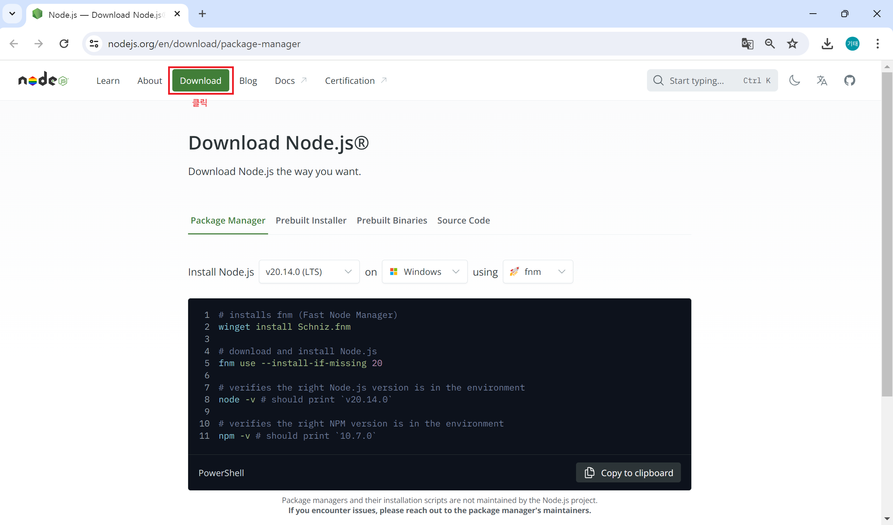

<br>

**V20.11버전 다운로드**

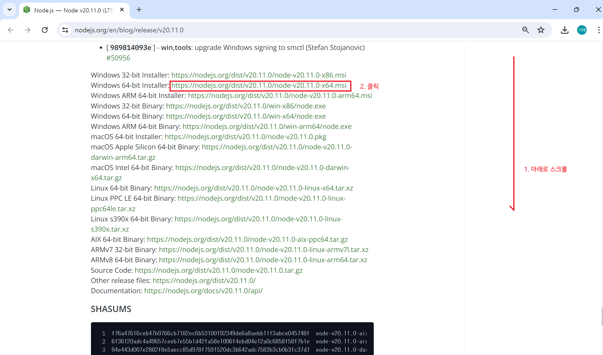

**※ 최신버전 또는 node V20.11 버전 둘 중에서 하나를 선택하여 다운로드 받은 후 다운로드 폴더로 이동하여 설치합니다.**

<br>

### 1-1-2. node 설치

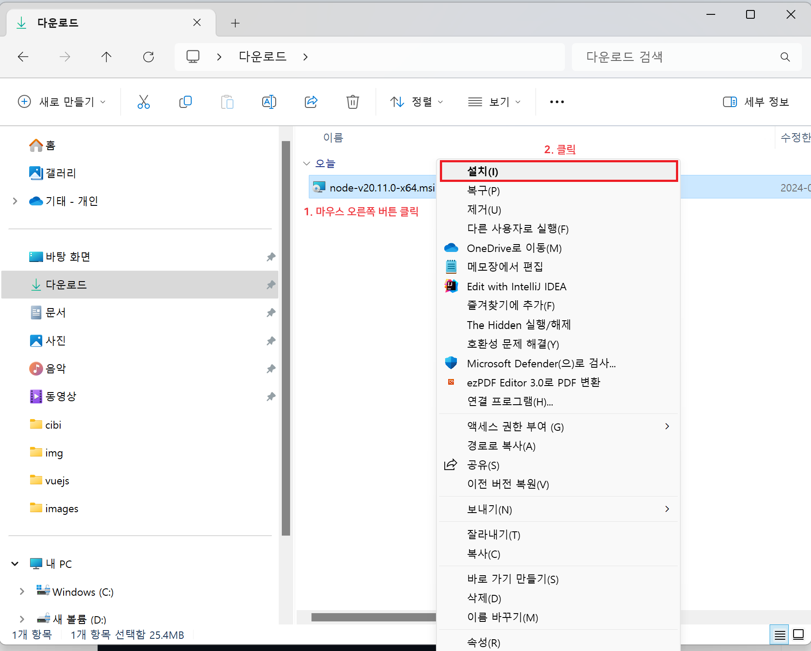

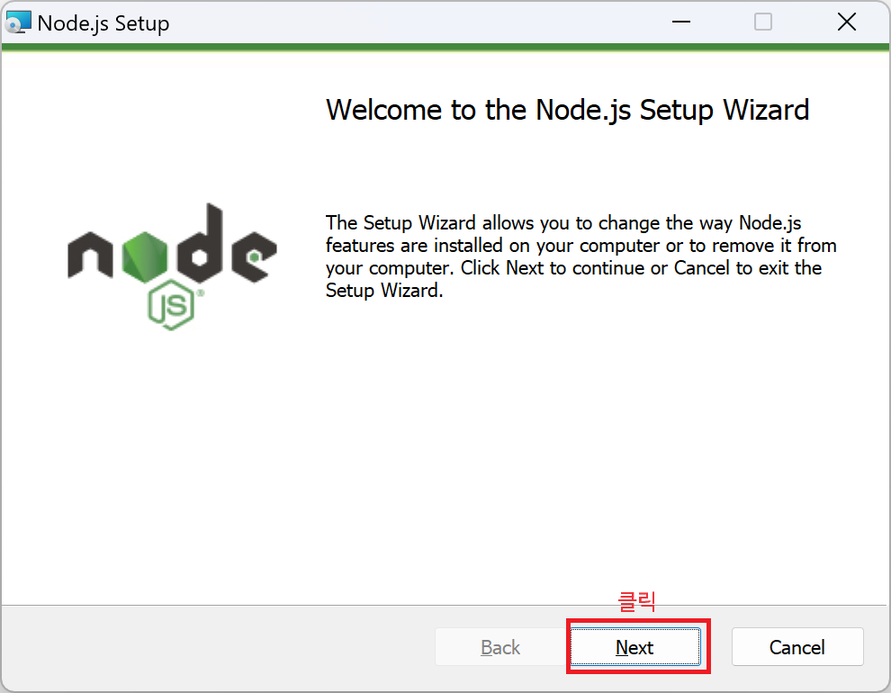

**※ 설치 화면에서 계속 [Next] 버튼을 눌러 설치를 합니다.**

<br>

**node 버전 확인**

```command
D:\gitRepository\kkt09072\vuejs>node -v
v20.11.0
```

<br>

### 1-1-3. node 패키지 관리

- Node.js에서 패키지를 관리하기 위해 주로 사용하는 도구는 npm(Node Package Manager)과 Yarn입니다. 두 가지 모두 패키지 설치, 업데이트, 제거 및 관리에 유용한 기능을 제공합니다.

<br>

#### 1-1-3-1. npm을 사용한 패키지 관리

**1. npm 초기화 및 설정**

- 프로젝트 폴더에서 package.json 파일을 생성합니다.

```bash
npm init
```

- 이 명령어는 프로젝트에 대한 정보를 입력하라는 여러 질문을 합니다. 모든 질문에 답하면 package.json 파일이 생성됩니다.

<br>

**2-1. 패키지 설치 - 로컬 설치**

- 프로젝트 폴더에 패키지를 설치합니다. 이 패키지는 node_modules 폴더에 저장되고 package.json의 dependencies 섹션에 추가됩니다.

```bash
npm install <package-name>
# 예시
npm install express
```

<br>

**2-2. 패키지 설치 - 전역 설치**

- 전역 설치는 패키지를 시스템 전체에서 사용할 수 있도록 설치합니다.

```bash
npm install -g <package-name>
# 예시
npm install -g nodemon
```

<br>

**3-1. 패키지 제거 - 로컬 제거**

- 로컬에 설치된 패키지를 제거합니다.

```bash
npm uninstall <package-name>
# 예시:
npm uninstall express
```

<br>

**3-2. 패키지 제거 - 전역 제거**

- 전역으로 설치된 패키지를 제거합니다.

```bash
npm uninstall -g <package-name>
# 예시:
npm uninstall -g nodemon
```

<br>

**4. 패키지 업데이트**

```bash
npm update <package-name>
# 예시:
npm update express
# 모든 패키지를 업데이트하려면:
npm update
```

<br>

**5. 패키지 확인**

- 설치된 패키지 목록을 확인합니다.

```bash
# 로컬 패키지 확인
코드 복사
npm list
# 전역 패키지 확인
npm list -g --depth=0
```

<br>

**6. 특정 버전 설치**

- 특정 버전의 패키지를 설치합니다.

```bash
npm install <package-name>@<version>
# 예시:
npm install express@4.17.1
```

<br><br>

#### 1-1-3-2. Yarn을 사용한 패키지 관리

**1. Yarn 초기화**

```bash
yarn init
```

- package.json 파일을 생성합니다.

<br>

**2-1. 패키지 설치 - 로컬 설치**

```bash
yarn add <package-name>
# 예시:
yarn add express
```

<br>

**2-2. 패키지 설치 - 전역 설치**

```bash
yarn global add <package-name>
# 예시:
yarn global add nodemon
```

<br>

**3-1. 패키지 제거 - 로컬 제거**

```bash
yarn remove <package-name>
# 예시:
yarn remove express
```

<br>

**3-2. 패키지 제거 - 전역 제거**

```bash
yarn global remove <package-name>
# 예시:
yarn global remove nodemon
```

<br>

**4. 패키지 업데이트**

```bash
yarn upgrade <package-name>
# 예시:
yarn upgrade express
# 모든 패키지를 업데이트하려면:
yarn upgrade
```

<br>

**5. 패키지 확인**

```bash
# 로컬 패키지 확인
yarn list
# 전역 패키지 확인
yarn global list
```

<br>

**6. 특정 버전 설치**

```bash
yarn add <package-name>@<version>
# 예시:
yarn add express@4.17.1
```

<br>

### 1-1-4. Express 웹 애플리케이션 패키지 구성

#### 1-1-4-1. 프로젝트 초기화

```bash
mkdir myapp
cd myapp
npm init -y
```

<br>

#### 1-1-4-2. Express 설치

```bash
npm install express
```

<br>

#### 1-1-4-3. app.js 파일 생성 및 내용 추가

```javascript
// app.js
const express = require('express');
const app = express();
const port = 3000;

app.get('/', (req, res) => {
  res.send('Hello World!');
});

app.listen(port, () => {
  console.log(`Example app listening at http://localhost:${port}`);
});
```

<br>

#### 1-1-4-4. 애플리케이션 실행

```bash
node app.js
```

- 브라우저에서 http://localhost:3000을 열면 "Hello World!" 메시지를 볼 수 있습니다.
- npm과 Yarn을 사용하여 Node.js 프로젝트에서 패키지를 관리할 수 있습니다. 

<br><br>

## 1-2. Visual Studio Code 설치

### 1-2-1. Visual Studio Code 다운로드

https://code.visualstudio.com/download

[Visual Studio Code 다운로드 바로가기](https://code.visualstudio.com/download)

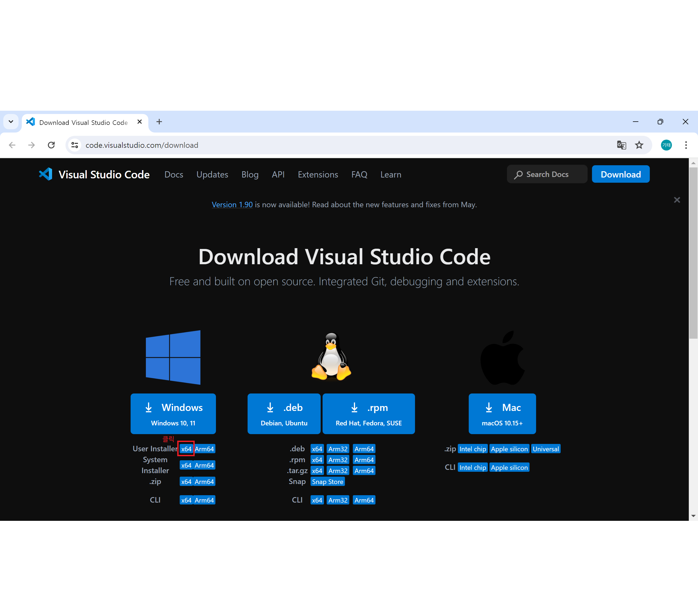

**※ Visual Studio Code 를 다운로드 받은 후 다운로드 폴더로 이동하여 설치합니다.**

<br>

### 1-2-2. Visual Studio Code 설치

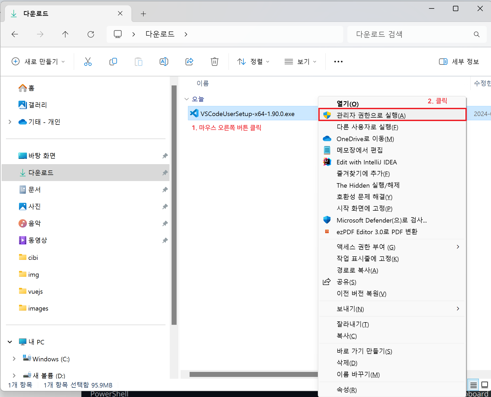

**※ 설치 화면이 나타나면 계속 [Next] 버튼을 눌러 설치를 합니다.**

<br>

### 1-2-2. Visual Studio Code 확장 프로그램 설치

<br><br>

## 1-3. Vuejs 설치

```shell
D:\gitRepository\kkt09072\vuejs> npm install -g @vue/cli
```

<br><br>

## 1-3-1. Vuejs 환경설정

```shell
D:\gitRepository\kkt09072\vuejs>vue --version
@vue/cli 5.0.8
```

<br>

### 1-3-2. Vuejs 확장 도구

<br><br>

## 1-4. MariaDB 설치

### 1-4-1. MariaDB 다운로드

https://mariadb.org/download/?t=mariadb&p=mariadb&r=10.11.8&os=windows&cpu=x86_64&pkg=msi&mirror=blendbyte

[MariaDB 다운로드 바로가기](https://mariadb.org/download/?t=mariadb&p=mariadb&r=10.11.8&os=windows&cpu=x86_64&pkg=msi&mirror=blendbyte)

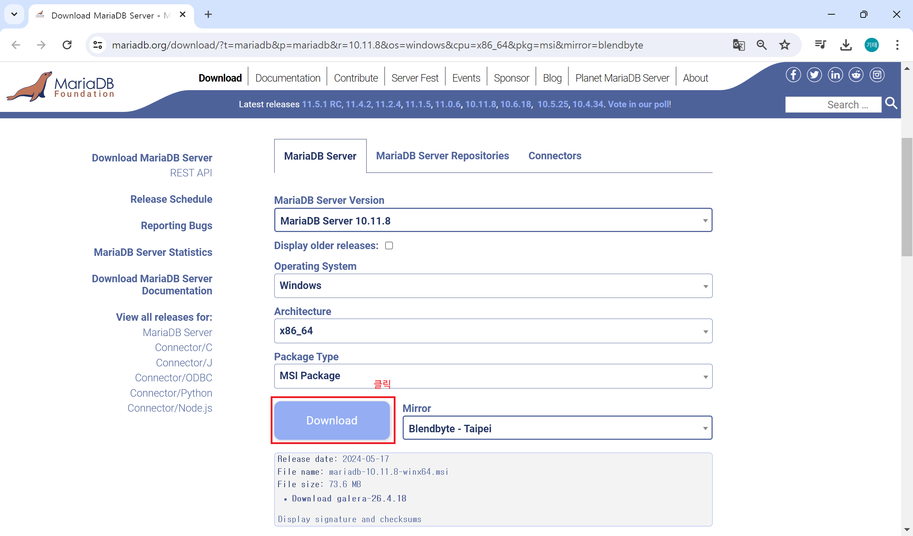

<br>

### 1-4-2. MariaDB 설치

**1. 다운로드 받은 파일에서 오른쪽 버튼을 눌러 설치를 시작합니다.**

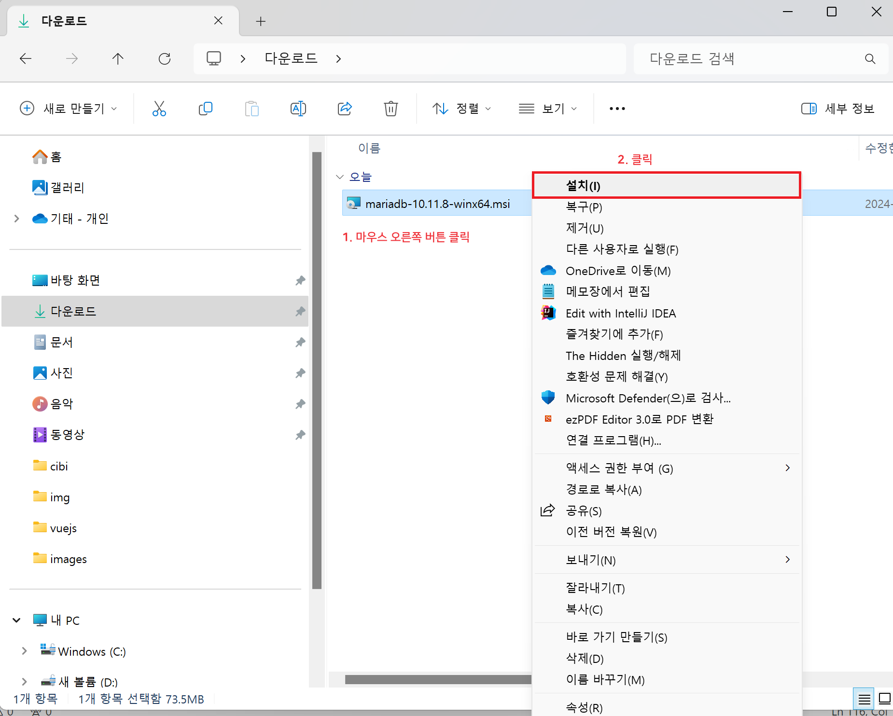

<br>

**2. 설치 화면이 나타나면 [Next] 버튼을 누르고 설치를 계속 진행합니다.**

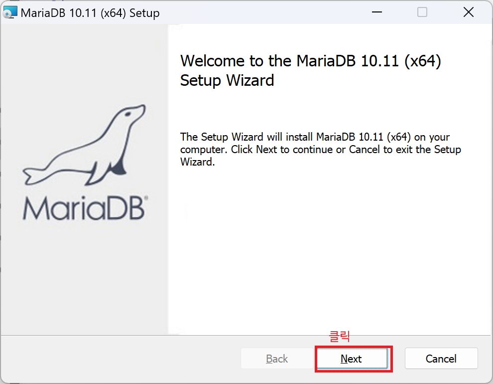

<br>

**3. 약관 동의 화면이 나타나면 약관에 동의(I accept the terms in the License Agreement)를 체크하고, [Next] 버튼을 누르고 설치를 계속 진행합니다.**

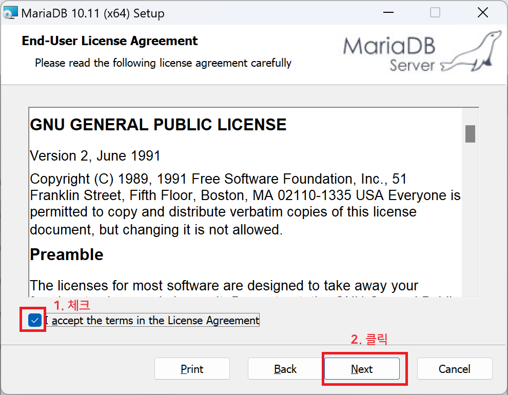

<br>

**4. 인스턴스 생성 선택 화면이 나타나면 새로운 인스턴스 생성(Create new database instance)를 선택하고, [Next] 버튼을 누르고 설치를 계속 진행합니다.**

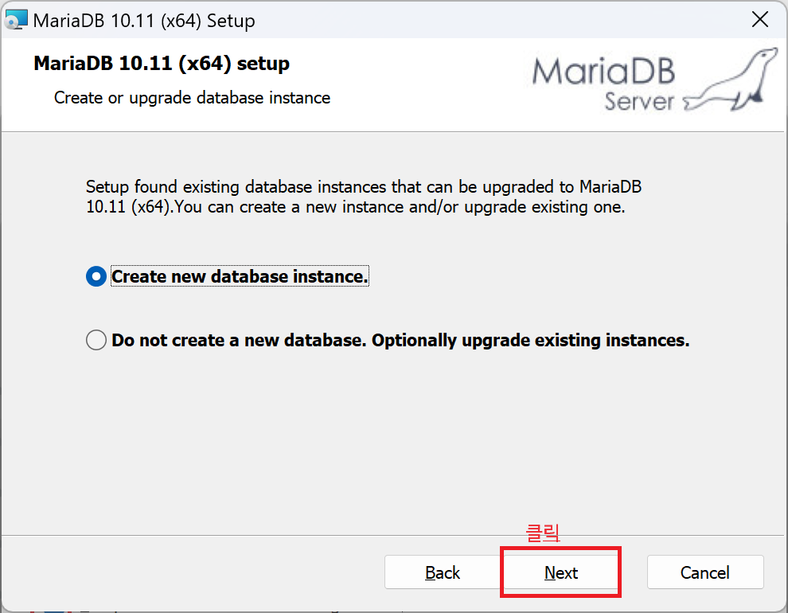

<br>

**5. 사용자 설정(Custom Setup) 화면이 나타나면 설치 옵션 및 설치 디렉토리를 확인하고, [Next] 버튼을 누르고 설치를 계속 진행합니다.**

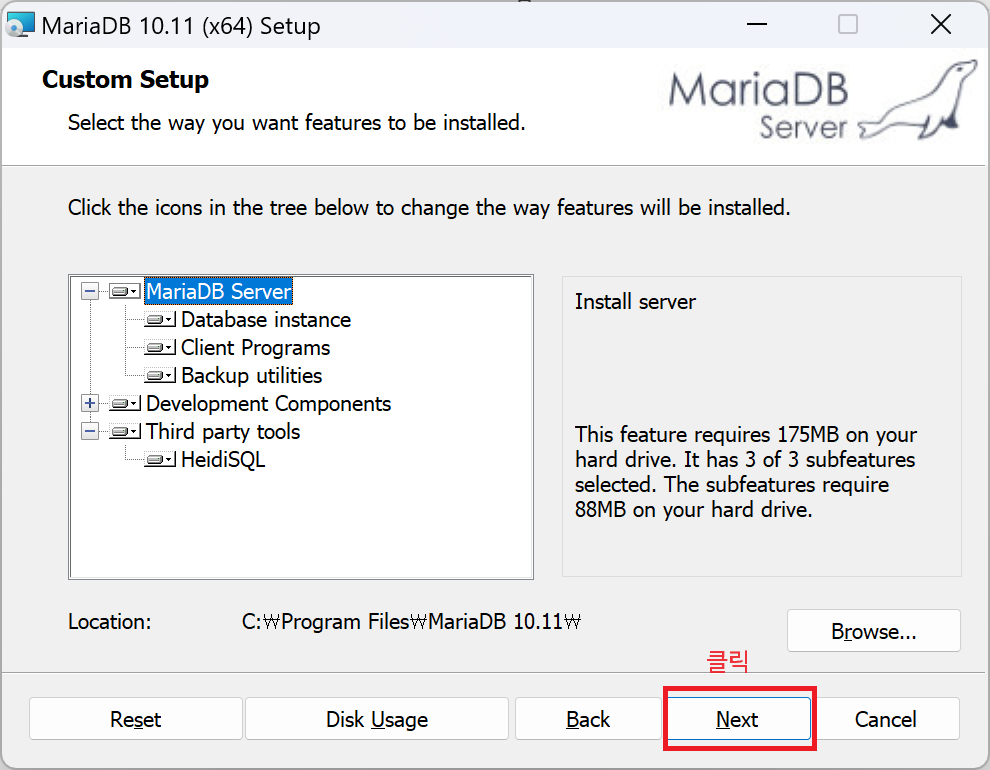

<br>

**6. 기본 인스턴스 속성(Default instance properties) 화면이 나타나면 비밀번호(New root password), 비밀번호 확인(Confirm)를 입력하고, 루트 사용자 원격 접속 허용(Enable access from remote machines for root user)와 캐릭터셋을 UTF8(Use UTF8 as default server's character set)로 설정을 모두 체크하고, [Next] 버튼을 누르고 설치를 계속 진행합니다.**

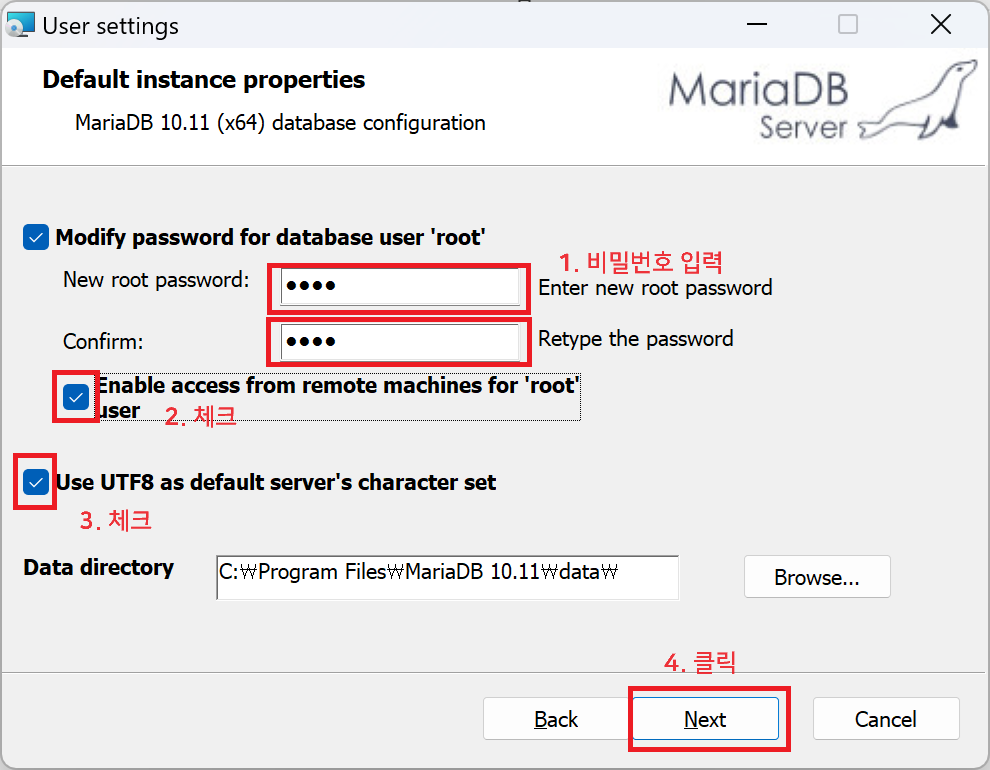

<br>

**7. 기본 인스턴스 속성(Default instance properties)의 두 번째 화면이 나타나면 서비스 이름(Service Name)과 포트 번호(Tcp port)를 각 각 입력하고, [Next] 버튼을 누르고 설치를 계속 진행합니다.**

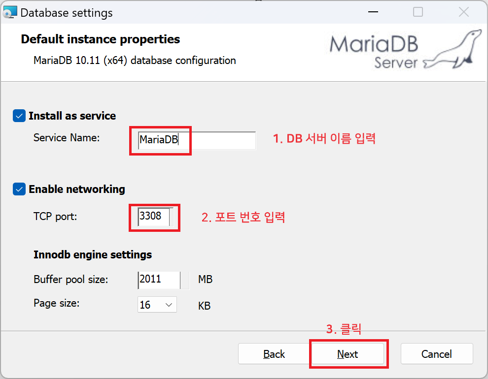

<br>

**7. 설치 준비(Ready to install MariaDB) 화면이 나타나면 [Install] 버튼을 누르고 설치를 계속 진행합니다.**

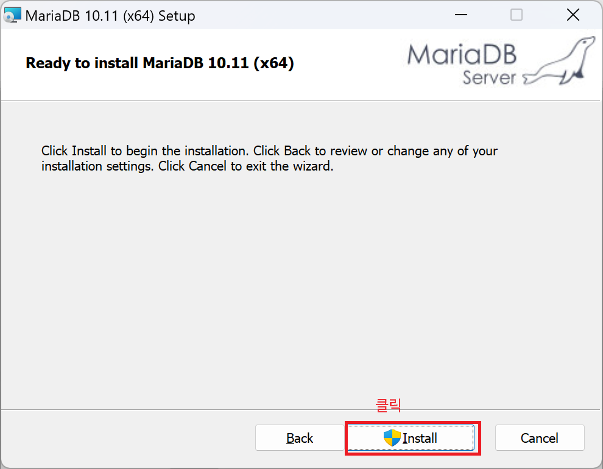

<br><br><br>

# 2. 프로젝트 생성 및 환경 설정

## 2-1. 프로젝트 생성

**Terminal 에서 study01 Vue 3로 프로젝트를 생성합니다.**

```shell
D:\gitRepository\kkt09072\vuejs>vue create study01

Vue CLI v5.0.8
? Please pick a preset: (Use arrow keys)
> Default ([Vue 3] babel, eslint)
  Default ([Vue 2] babel, eslint)
  Manually select features

✨  Creating project in D:\gitRepository\kkt09072\vuejs\study01.
🗃  Initializing git repository...
⚙️  Installing CLI plugins. This might take a while...
```

<br>

**Terminal 에서 study02 세부사항을 개발자가 선택하여 프로젝트를 생성합니다.**

```shell
Vue CLI v5.0.8  # 사전 설정을 선택하세요.
? Please pick a preset:
  Default ([Vue 3] babel, eslint)
  Default ([Vue 2] babel, eslint)
> Manually select features          # 수동으로 기능 선택

Vue CLI v5.0.8
? Please pick a preset: Manually select features
? Check the features needed for your project: (Press <space> to select, <a> to toggle all, <i> to invert selection, and
<enter> to proceed)   # 프로젝트에 필요한 기능을 확인하세요. (선택하려면 <space>를 누르고, 모두 전환하려면 <a>를 누르고, 선택을 반전하려면 <i>를 누르고, 계속하려면 <enter>하세요)
 (*) Babel
 (*) TypeScript
>(*) Progressive Web App (PWA) Support
 (*) Router
 (*) Vuex
 (*) CSS Pre-processors
 (*) Linter / Formatter
 (*) Unit Testing
 ( ) E2E Testing

Vue CLI v5.0.8
? Please pick a preset: Manually select features
? Check the features needed for your project: Babel, TS, PWA, Router, Vuex, CSS Pre-processors, Linter, Unit
? Choose a version of Vue.js that you want to start the project with (Use arrow keys)  # 프로젝트를 시작하려는 Vue.js 버전을 선택하세요(화살표 키 사용).
> 3.x
  2.x

Vue CLI v5.0.8
? Please pick a preset: Manually select features
? Check the features needed for your project: Babel, TS, PWA, Router, Vuex, CSS Pre-processors, Linter, Unit
? Choose a version of Vue.js that you want to start the project with 3.x
? Use class-style component syntax? No    # 클래스 스타일 구성 요소 구문을 사용하시겠습니까?
? Use Babel alongside TypeScript (required for modern mode, auto-detected polyfills, transpiling JSX)? Yes   # TypeScript와 함께 Babel 사용하시겠습니까? 
? Use history mode for router? (Requires proper server setup for index fallback in production) Yes    # 라우터에 기록 모드를 사용하시겠습니까?
? Pick a CSS pre-processor (PostCSS, Autoprefixer and CSS Modules are supported by default): (Use arrow keys)   # CSS 전처리기를 선택하세요
> Sass/SCSS (with dart-sass)
  Less
  Stylus

? Pick a linter / formatter config:     # linter / formatter 설정 방법을 선택하세요
  ESLint with error prevention only
  ESLint + Airbnb config
> ESLint + Standard config
  ESLint + Prettier

? Pick additional lint features: (Press <space> to select, <a> to toggle all, <i> to invert selection, and <enter> to
proceed)    # 추가 Lint 기능 선택: (선택하려면 <space>를 누르고, 모두 전환하려면 <a>를 누르고, 선택을 반전하려면 <i>를, <enter>를 눌러
진행하다)
>(*) Lint on save
 ( ) Lint and fix on commit

? Pick a unit testing solution: (Use arrow keys)      # 단위 테스트 솔루션 선택: (화살표 키 사용)
> Jest
  Mocha + Chai

? Where do you prefer placing config for Babel, ESLint, etc.?     # Babel, ESLint 등의 구성을 어디에 배치하는 것을 선호하시나요?
  In dedicated config files
> In package.json  

? Save this as a preset for future projects? (y/N) y      # 향후 프로젝트를 위한 사전 설정으로 저장하시겠습니까?

? Save preset as: project02       # 사전 설정을 위한 파일 이름 입력


# 프로젝트 구성 결과

? Please pick a preset: Manually select features
? Check the features needed for your project: Babel, TS, PWA, Router, Vuex, CSS Pre-processors, Linter, Unit
? Choose a version of Vue.js that you want to start the project with 3.x
? Use class-style component syntax? No
? Use Babel alongside TypeScript (required for modern mode, auto-detected polyfills, transpiling JSX)? Yes
? Use history mode for router? (Requires proper server setup for index fallback in production) Yes
? Pick a CSS pre-processor (PostCSS, Autoprefixer and CSS Modules are supported by default): Sass/SCSS (with dart-sass)
? Pick a linter / formatter config: Standard
? Pick additional lint features: Lint on save
? Pick a unit testing solution: Jest
? Where do you prefer placing config for Babel, ESLint, etc.? In package.json
? Save this as a preset for future projects? Yes
? Save preset as: project02


# 설치된 내용 출력

Vue CLI v5.0.8
✨  Creating project in D:\gitRepository\kkt09072\vuejs\study02.
🗃  Initializing git repository...
⚙️  Installing CLI plugins. This might take a while...

added 1427 packages, and audited 1428 packages in 2m

170 packages are looking for funding
  run `npm fund` for details

4 moderate severity vulnerabilities

To address all issues (including breaking changes), run:
  npm audit fix --force

Run `npm audit` for details.
🚀  Invoking generators...
📦  Installing additional dependencies...


added 156 packages, and audited 1584 packages in 28s

201 packages are looking for funding
  run `npm fund` for details

4 moderate severity vulnerabilities

To address all issues (including breaking changes), run:
  npm audit fix --force

Run `npm audit` for details.
⚓  Running completion hooks...

📄  Generating README.md...

🎉  Successfully created project study02.
👉  Get started with the following commands:

 $ cd study02
 $ npm run serve
```


<br>

### 2-1-1. 프로젝트의 구성

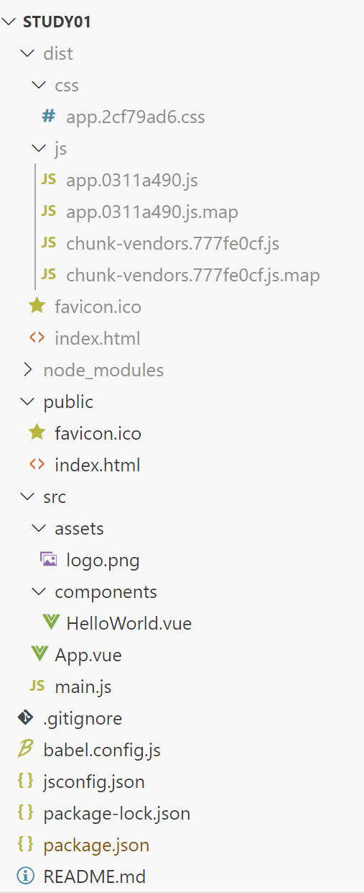

<br>

#### 2-1-1-1. 프로젝트 구조 및 파일 설명

**루트 디렉토리**

babel.config.js: Babel 설정 파일로, ES6 이상의 최신 JavaScript 문법을 구버전 브라우저에서도 호환되도록 변환하는 설정이 담깁니다.
jsconfig.json: JavaScript 프로젝트 설정 파일로, IDE(통합 개발 환경)에서 더 나은 지원을 제공하기 위한 설정이 포함됩니다. 파일 경로 단축, IntelliSense(코드 자동 완성), 코드 내비게이션 등을 설정할 수 있습니다.
package.json: 프로젝트의 메타데이터를 포함하는 파일로, 프로젝트 이름, 버전, 의존성 패키지 목록, 스크립트, 라이선스 등의 정보를 담고 있습니다.
package-lock.json: npm이 생성하는 파일로, 설치된 각 패키지의 정확한 버전과 종속성을 잠금(lock)으로써, 프로젝트의 동일한 환경을 보장합니다.
node_modules: 프로젝트의 의존성 패키지들이 설치되는 디렉토리입니다. 이 디렉토리는 package.json의 의존성 목록을 바탕으로 npm install 명령어를 실행하면 자동으로 생성됩니다.

<br>

**dist 디렉토리**

/dist/index.html: 빌드 후 생성되는 HTML 파일입니다. Vue CLI를 사용하여 프로젝트를 빌드하면, 소스 코드가 번들링되고 최적화된 파일들이 이 디렉토리에 생성됩니다.
/dist/css: 빌드 후 생성되는 CSS 파일이 저장되는 디렉토리입니다.
/dist/js: 빌드 후 생성되는 JavaScript 파일이 저장되는 디렉토리입니다.

<br>

**public 디렉토리**

/public/index.html: 프로젝트의 기본 HTML 템플릿 파일로, Vue 앱의 루트 HTML 파일입니다. 이 파일에 Vue 앱이 마운트됩니다. 빌드 시 이 파일을 기반으로 최종 HTML 파일이 생성됩니다.

<br>

**src 디렉토리**

/src/assets: 이미지, 폰트, 스타일시트 등 정적 자산을 저장하는 디렉토리입니다.
/src/components: Vue 컴포넌트를 저장하는 디렉토리입니다. Vue 컴포넌트는 UI의 재사용 가능한 부분을 정의합니다.
/src/components/HelloWorld.vue: 기본 생성되는 예제 컴포넌트 파일로, 새로운 컴포넌트를 만들 때 참고할 수 있습니다.
/src/App.vue: 루트 컴포넌트 파일로, 모든 다른 컴포넌트가 포함되는 최상위 컴포넌트입니다.
/src/main.js: Vue 애플리케이션의 진입점 파일로, Vue 인스턴스를 생성하고, App.vue를 마운트합니다.

<br>

**기본 프로젝트 구조**

```lua
study01
├── babel.config.js
├── jsconfig.json
├── package.json
├── package-lock.json
├── node_modules/
├── dist/
│   ├── index.html
│   ├── css/
│   └── js/
├── public/
│   └── index.html
└── src/
    ├── assets/
    ├── components/
    │   └── HelloWorld.vue
    ├── App.vue
    └── main.js
```

<br><br>

#### 2-1-1-2. 주요 파일의 용도

| 주요 파일 | 용도 |
|----------------------|------------------------------------------------------|
| babel.config.js | Babel 설정 파일. | 
| jsconfig.json | JavaScript 프로젝트 설정 파일. | 
| package.json | 프로젝트 메타데이터 및 의존성 관리 파일. | 
| package-lock.json | 의존성 버전을 고정하여 동일한 환경을 보장하는 파일. | 
| /dist/ | 빌드 결과물이 저장되는 디렉토리. | 
| /dist/index.html | 빌드된 HTML 파일. | 
| /dist/css/ | 빌드된 CSS 파일. | 
| /dist/js/ | 빌드된 JavaScript 파일. | 
| /public/ | 정적 파일을 저장하는 디렉토리. | 
| /public/index.html | 기본 HTML 템플릿 파일. | 
| /src/ | 소스 파일을 저장하는 디렉토리. | 
| /src/assets/ | 정적 자산 디렉토리. | 
| /src/components/ | Vue 컴포넌트 디렉토리. | 
| /src/components/HelloWorld.vue | 예제 컴포넌트 파일. | 
| /src/App.vue | 루트 컴포넌트 파일. | 
| /src/main.js | 애플리케이션 진입점 파일. | 


<br><br>

## 2-2. 프로젝트 환경설정

### 2-2-1. 포트번호 변경

**package.json 에서 포트 번호 변경** 

```javascript
{
  "name": "study01",
  "version": "0.1.0",
  "private": true,
  "scripts": {
    "serve": "vue-cli-service serve --port 8502",
    "build": "vue-cli-service build --port 8501",
    "lint": "vue-cli-service lint"
  },
  "dependencies": {
    "core-js": "^3.8.3",
    "vue": "^3.2.13"
  },
  "devDependencies": {
    "@babel/core": "^7.12.16",
    "@babel/eslint-parser": "^7.12.16",
    "@vue/cli-plugin-babel": "~5.0.0",
    "@vue/cli-plugin-eslint": "~5.0.0",
    "@vue/cli-service": "~5.0.0",
    "eslint": "^7.32.0",
    "eslint-plugin-vue": "^8.0.3"
  },
  //중간 생략
```

<br><br>

## 2-3. 프로젝트 실행


```shell
D:\gitRepository\kkt09072\vuejs>cd study01

D:\gitRepository\kkt09072\vuejs\study01>npm run serve

> study01@0.1.0 serve
> vue-cli-service serve

 INFO  Starting development server...
```

<br><br><br>

# 3. Vuejs의 요소


<br><br>

## 3-1. Typescript

**Vue.js 3에서 TypeScript를 사용하는 이유**

| 항목 | 설명 |
|--------------|-----------------------------------------------------------------------------|
| 타입 안전성 | 코드 작성 시 타입 오류를 사전에 잡을 수 있어 런타임 오류를 줄일 수 있습니다. |
| 자동 완성 | 타입 정보가 IDE에 제공되어 더 나은 코드 완성 기능을 제공합니다. |
| 리팩토링 지원 | 타입 정보를 통해 리팩토링 시 발생할 수 있는 오류를 최소화합니다. |

<br>

### 3-1-1. TypeScript의 기본 사용

1. `<script lang="ts">`를 사용하여 TypeScript로 스크립트를 작성합니다.
2. ref를 사용하여 반응형 데이터를 정의하고, as 키워드를 사용하여 타입 캐스팅을 수행합니다.

<br>

### 3-1-2. 타입 정의

1. TypeScript의 강점은 데이터 타입을 정의할 수 있으며, Event 타입과 HTMLInputElement 타입을 사용하여 이벤트 핸들러를 구현할 수 있습니다.

<br>

### 3-1-3. 컴포지션 API

- Vue 3의 setup 함수를 사용하여 컴포넌트 로직을 작성합니다.
- 함수 기반의 코드 구성과 클래스 기반의 코드 구성 방식으로 작성합니다.

<br>

### 3-1-4. Vuex와 TypeScript 사용

**store/index.ts**

```typescript
import { createStore } from 'vuex';

interface State {
  count: number;
}

export default createStore<State>({
  state: {
    count: 0
  },
  mutations: {
    increment(state) {
      state.count++;
    }
  },
  actions: {
    increment({ commit }) {
      commit('increment');
    }
  },
  getters: {
    doubleCount(state): number {
      return state.count * 2;
    }
  }
});
```

<br>

**main.ts**

```typescript
import { createApp } from 'vue';
import App from './App.vue';
import store from './store';

createApp(App)
  .use(store)
  .mount('#app');
```

<br><br>

## 3-2. Vuejs의 인스턴스

- Vue 애플리케이션의 모든 것은 새로운 Vue 인스턴스를 생성하는 것으로 시작됩니다. Vue 인스턴스는 애플리케이션의 데이터와 메서드를 포함하며, HTML 요소와 연결되어 DOM을 조작합니다.

### 3-2-1. 인스턴스의 정의

- Vue 애플리케이션의 인스턴스는 createApp 함수를 사용하여 정의됩니다. 
- TypeScript를 사용하면 인스턴스에 타입을 명시하여 코드의 안전성을 높일 수 있습니다.

```typescript
코드 복사
import { createApp } from 'vue';
import App from './App.vue';

const app = createApp(App);
app.mount('#app');
```

- createApp 함수는 App.vue 컴포넌트를 루트 컴포넌트로 사용하는 새로운 Vue 애플리케이션 인스턴스를 생성합니다. 
이 인스턴스는 #app 요소에 마운트됩니다.

<br>

### 3-2-2. 인스턴스의 옵션

- Vue 인스턴스는 여러 옵션을 통해 설정할 수 있습니다. 
- 주요 옵션에는 data, methods, computed, watch, components 등이 있습니다. 
- TypeScript를 사용하면 각 옵션의 타입을 명시하여 안전성을 확보할 수 있습니다.

```typescript
import { createApp, defineComponent, reactive, computed } from 'vue';

const app = createApp(defineComponent({
  name: 'MyComponent',
  data() {
    return {
      message: 'Hello, Vue with TypeScript!'
    };
  },
  methods: {
    updateMessage(newMessage: string) {
      this.message = newMessage;
    }
  },
  computed: {
    reversedMessage(): string {
      return this.message.split('').reverse().join('');
    }
  },
  watch: {
    message(newValue: string, oldValue: string) {
      console.log(`Message changed from ${oldValue} to ${newValue}`);
    }
  },
  components: {
    // 다른 컴포넌트들을 등록할 수 있습니다.
  }
}));

app.mount('#app');
```

<br>

### 3-2-3. 인스턴스의 생명주기

- Vue 인스턴스에는 여러 생명주기 hook(훅)이 있습니다. 
- 이 hook(훅)들은 인스턴스의 생성, 마운트, 업데이트, 소멸 등의 단계에서 호출됩니다. 
- 주요 생명주기 훅으로는 beforeCreate, created, beforeMount, mounted, beforeUpdate, updated, beforeUnmount, unmounted 등이 있습니다.


```typescript
import { createApp, defineComponent } from 'vue';

const app = createApp(defineComponent({
  name: 'LifecycleComponent',
  data() {
    return {
      message: 'Hello, Vue!'
    };
  },
  methods: {
    updateMessage(newMessage: string) {
      this.message = newMessage;
    }
  },
  // 생명주기 훅들
  beforeCreate() {
    console.log('beforeCreate');
  },
  created() {
    console.log('created');
  },
  beforeMount() {
    console.log('beforeMount');
  },
  mounted() {
    console.log('mounted');
  },
  beforeUpdate() {
    console.log('beforeUpdate');
  },
  updated() {
    console.log('updated');
  },
  beforeUnmount() {
    console.log('beforeUnmount');
  },
  unmounted() {
    console.log('unmounted');
  }
}));

app.mount('#app');
```

<br>

**인스턴스 종합 예시코드**

```typescript
import { createApp, defineComponent, ref, computed, watch } from 'vue';

// 루트 컴포넌트 정의
const RootComponent = defineComponent({
  name: 'RootComponent',
  setup() {
    const message = ref<string>('Hello, Vue with TypeScript!');
    const newMessage = ref<string>('');

    const reversedMessage = computed<string>(() => {
      return message.value.split('').reverse().join('');
    });

    watch(message, (newValue, oldValue) => {
      console.log(`Message changed from ${oldValue} to ${newValue}`);
    });

    const updateMessage = () => {
      message.value = newMessage.value;
    };

    return {
      message,
      newMessage,
      reversedMessage,
      updateMessage
    };
  },
  // 생명주기 훅들
  beforeCreate() {
    console.log('beforeCreate');
  },
  created() {
    console.log('created');
  },
  beforeMount() {
    console.log('beforeMount');
  },
  mounted() {
    console.log('mounted');
  },
  beforeUpdate() {
    console.log('beforeUpdate');
  },
  updated() {
    console.log('updated');
  },
  beforeUnmount() {
    console.log('beforeUnmount');
  },
  unmounted() {
    console.log('unmounted');
  },
  template: `
    <div>
      <h1>{{ message }}</h1>
      <input v-model="newMessage" placeholder="Enter new message">
      <button @click="updateMessage">Update Message</button>
      <p>Reversed Message: {{ reversedMessage }}</p>
    </div>
  `
});

// 애플리케이션 생성 및 마운트
const app = createApp(RootComponent);
app.mount('#app');
```

<br>

### 3-2-4. Vue 인스턴스의 속성과 메소드

**속성**

| 속성명             | 문법                                           | 설명                                                          | 예시 코드                                                    |
|--------------------|------------------------------------------------|---------------------------------------------------------------|--------------------------------------------------------------|
| `data`             | `data: () => ({ /* ... */ })`                  | 컴포넌트의 반응형 상태를 정의합니다.                           | ```typescript<br>data() { return { message: 'Hello Vue!' }; }<br>```|
| `props`            | `props: { /* ... */ }`                         | 컴포넌트가 받을 수 있는 속성을 정의합니다.                     | ```typescript<br>props: { title: String }<br>```             |
| `computed`         | `computed: { /* ... */ }`                      | 계산된 속성을 정의합니다.                                      | ```typescript<br>computed: { reversedMessage() { return this.message.split('').reverse().join(''); } }<br>```|
| `watch`            | `watch: { /* ... */ }`                         | 반응형 데이터의 변화를 감지하여 특정 함수를 실행합니다.        | ```typescript<br>watch: { message(newValue, oldValue) { console.log('Message changed:', oldValue, '->', newValue); } }<br>```|
| `mounted`          | `mounted() { /* ... */ }`                      | 컴포넌트가 마운트된 후 호출됩니다.                              | ```typescript<br>mounted() { console.log('Component mounted'); }<br>```|
| `beforeCreate`     | `beforeCreate() { /* ... */ }`                 | 컴포넌트 인스턴스가 초기화되기 전에 호출됩니다.                | ```typescript<br>beforeCreate() { console.log('Before create'); }<br>```|
| `created`          | `created() { /* ... */ }`                      | 컴포넌트가 생성된 후 호출됩니다.                                | ```typescript<br>created() { console.log('Created'); }<br>```|
| `beforeMount`      | `beforeMount() { /* ... */ }`                  | 컴포넌트가 마운트되기 전에 호출됩니다.                          | ```typescript<br>beforeMount() { console.log('Before mount'); }<br>```|
| `beforeUpdate`     | `beforeUpdate() { /* ... */ }`                 | 데이터가 변경되어 DOM이 다시 렌더링되기 전에 호출됩니다.        | ```typescript<br>beforeUpdate() { console.log('Before update'); }<br>```|
| `updated`          | `updated() { /* ... */ }`                      | 데이터가 변경되어 DOM이 다시 렌더링된 후 호출됩니다.            | ```typescript<br>updated() { console.log('Updated'); }<br>```|
| `beforeUnmount`    | `beforeUnmount() { /* ... */ }`                | 컴포넌트가 파괴되기 전에 호출됩니다.                            | ```typescript<br>beforeUnmount() { console.log('Before unmount'); }<br>```|
| `unmounted`        | `unmounted() { /* ... */ }`                    | 컴포넌트가 파괴된 후 호출됩니다.                                | ```typescript<br>unmounted() { console.log('Unmounted'); }<br>```|
| `$refs`            | `this.$refs`                                   | `ref` 속성을 통해 DOM 요소나 컴포넌트를 참조합니다.            | ```typescript<br>this.$refs.myElement<br>```                  |
| `$el`              | `this.$el`                                     | 컴포넌트 인스턴스가 마운트된 루트 DOM 요소를 참조합니다.        | ```typescript<br>console.log(this.$el);<br>```               |
| `provide`          | `provide: { /* ... */ }`                       | 하위 컴포넌트에 데이터를 제공합니다.                           | ```typescript<br>provide() { return { dataKey: 'dataValue' }; }<br>```|
| `inject`           | `inject: ['dataKey']`                          | 상위 컴포넌트로부터 데이터를 주입받습니다.                      | ```typescript<br>inject: ['dataKey']<br>```                  |

<br>

**메소드**

| 메소드명           | 문법                                           | 설명                                                           | 예시 코드                                                    |
|--------------------|------------------------------------------------|----------------------------------------------------------------|--------------------------------------------------------------|
| `$emit`            | `this.$emit(eventName, payload)`               | 사용자 정의 이벤트를 트리거합니다.                               | ```typescript<br>this.$emit('my-event', data);<br>```        |
| `$nextTick`        | `this.$nextTick(callback)`                     | 다음 DOM 업데이트 후에 콜백을 실행합니다.                       | ```typescript<br>this.$nextTick(() => { console.log('DOM updated'); });<br>```|주입받습니다.                       | ```typescript<br>inject: ['dataKey']<br>```                  |


<br>

**Vue 인스턴스의 속성과 메소드 종합 실습**

```typescript
import { createApp, defineComponent, ref, computed, watch, nextTick } from 'vue';

const MyComponent = defineComponent({
  name: 'MyComponent',
  data() {
    return {
      message: 'Hello, Vue!',
      newMessage: ''
    };
  },
  props: {
    title: {
      type: String,
      required: true
    }
  },
  computed: {
    reversedMessage(): string {
      return this.message.split('').reverse().join('');
    }
  },
  methods: {
    updateMessage(newMessage: string) {
      this.message = newMessage;
      this.$nextTick(() => {
        console.log('Message updated and DOM updated');
      });
    },
    emitEvent() {
      this.$emit('custom-event', this.message);
    }
  },
  watch: {
    message(newValue: string, oldValue: string) {
      console.log('Message changed from', oldValue, 'to', newValue);
    }
  },
  mounted() {
    console.log('Component mounted');
  },
  beforeCreate() {
    console.log('Before create');
  },
  created() {
    console.log('Created');
  },
  beforeMount() {
    console.log('Before mount');
  },
  beforeUpdate() {
    console.log('Before update');
  },
  updated() {
    console.log('Updated');
  },
  beforeUnmount() {
    console.log('Before unmount');
  },
  unmounted() {
    console.log('Unmounted');
  },
  template: `
    <div>
      <h1>{{ title }}</h1>
      <p>{{ message }}</p>
      <p>Reversed: {{ reversedMessage }}</p>
      <input v-model="newMessage" placeholder="Enter new message">
      <button @click="updateMessage(newMessage)">Update Message</button>
      <button @click="emitEvent">Emit Event</button>
    </div>
  `
});

const app = createApp(MyComponent, {
  title: 'My Vue Component'
});
app.mount('#app');
```

<br><br>

## 3-3. Vuejs의 템플릿과 디렉티브

### 3-3-1. Vue Template(템플릿)

- 템플릿은 Vue 컴포넌트의 UI 구조를 정의하는 HTML 기반의 구문입니다. 
- Vue는 템플릿을 DOM에 렌더링할 수 있는 Virtual DOM으로 컴파일합니다.
- Vue 템플릿은 HTML을 기본으로 하여 데이터 바인딩, 디렉티브, 조건부 렌더링, 반복 렌더링 등 다양한 기능을 지원합니다.

**템플릿의 주요 기능**

1. 데이터 바인딩: `{{ }}` 구문을 사용하여 Vue 인스턴스의 데이터 속성을 HTML에 바인딩합니다.
2. 디렉티브: v-if, v-for, v-bind, v-on 등 특별한 기능을 수행하는 속성입니다.
3. 컴포넌트 사용: 다른 Vue 컴포넌트를 템플릿 내에서 사용할 수 있습니다.
4. 메서드 호출: 이벤트 핸들러에서 Vue 인스턴스의 메서드를 호출할 수 있습니다.

<br>

**템플릿 바인딩 예시코드**

```html
<template>
  <div>
    <p>{{ message }}</p>
  </div>
</template>

<script lang="ts">
import { defineComponent, ref } from 'vue';

export default defineComponent({
  setup() {
    const message = ref('Hello, Vue!');
    return {
      message
    };
  }
});
</script>
```

<br>

### 3-3-2. Vue Directive(디렉티브)

- 디렉티브는 HTML 태그에 특별한 반응형 동작을 적용하는 데 사용되는 특수한 속성입니다. Vue에는 v-bind, v-model, v-if, v-for 등의 내장 디렉티브가 있습니다.

v-model: 양방향 데이터 바인딩
v-if: 조건부 렌더링
v-for: 리스트 렌더링
v-bind : 데이터 바인딩

<br>

#### 3-3-2-1. v-if와 v-else

```html
<template>
  <div>
    <p v-if="isVisible">This is visible</p>
    <p v-else>This is not visible</p>
    <button @click="toggleVisibility">Toggle Visibility</button>
  </div>
</template>

<script lang="ts">
import { defineComponent, ref } from 'vue';

export default defineComponent({
  setup() {
    const isVisible = ref(true);

    const toggleVisibility = () => {
      isVisible.value = !isVisible.value;
    };

    return {
      isVisible,
      toggleVisibility
    };
  }
});
</script>
```

<br>

#### 3-3-2-2. v-for

```html
<template>
  <div>
    <ul>
      <li v-for="item in items" :key="item.id">{{ item.name }}</li>
    </ul>
  </div>
</template>

<script lang="ts">
import { defineComponent, ref } from 'vue';

export default defineComponent({
  setup() {
    const items = ref([
      { id: 1, name: 'Item 1' },
      { id: 2, name: 'Item 2' },
      { id: 3, name: 'Item 3' }
    ]);

    return {
      items
    };
  }
});
</script>
```

<br>

#### 3-3-2-3. v-bind

```html
<template>
  <div>
    
  </div>
</template>

<script lang="ts">
import { defineComponent, ref } from 'vue';

export default defineComponent({
  setup() {
    const imageUrl = ref('https://vuejs.org/images/logo.png');
    return {
      imageUrl
    };
  }
});
</script>
```

<br>

#### 3-3-2-4. v-on

```html
<template>
  <div>
    <button @click="showAlert">Click me</button>
  </div>
</template>

<script lang="ts">
import { defineComponent } from 'vue';

export default defineComponent({
  setup() {
    const showAlert = () => {
      alert('Button clicked!');
    };

    return {
      showAlert
    };
  }
});
</script>
```

<br>

### 3-3-3. 컴포넌트 사용

```html
<!-- ParentComponent.vue -->
<template>
  <div>
    <ChildComponent :message="parentMessage" />
  </div>
</template>

<script lang="ts">
import { defineComponent, ref } from 'vue';
import ChildComponent from './ChildComponent.vue';

export default defineComponent({
  components: {
    ChildComponent
  },
  setup() {
    const parentMessage = ref('Message from parent');
    return {
      parentMessage
    };
  }
});
</script>
```

<br>

```html
<!-- ChildComponent.vue -->
<template>
  <div>
    <p>{{ message }}</p>
  </div>
</template>

<script lang="ts">
import { defineComponent, PropType } from 'vue';

export default defineComponent({
  props: {
    message: {
      type: String,
      required: true
    }
  }
});
</script>
```

<br>

### 3-3-4. 메서드 호출

```html
<template>
  <div>
    <button @click="increment">Increment</button>
    <p>{{ count }}</p>
  </div>
</template>

<script lang="ts">
import { defineComponent, ref } from 'vue';

export default defineComponent({
  setup() {
    const count = ref(0);

    const increment = () => {
      count.value++;
    };

    return {
      count,
      increment
    };
  }
});
</script>
```

<br><br>

## 3-4. Vuejs의 컴포넌트

- Vue.js 3에서 컴포넌트는 재사용 가능한 UI 구성 요소입니다. 
- 각 컴포넌트는 템플릿, 스크립트, 스타일을 포함하고 있으며, 이러한 요소들을 하나로 묶어 캡슐화된 형태로 구성됩니다. 
- 컴포넌트를 통해 코드의 재사용성, 유지보수성, 확장성이 향상되며, 대규모 어플리케이션 개발을 용이하게 합니다.

<br>

### 3-4-1. Vue.js 3의 컴포넌트 종류

1. 단일 파일 컴포넌트(Single File Component, SFC): 템플릿, 스크립트, 스타일을 한 파일에 작성하는 방식입니다. .vue 확장자를 가지며, Vue CLI를 통해 프로젝트 구성 시 주로 사용됩니다.
2. 함수형 컴포넌트(Functional Component): 함수형 컴포넌트는 상태를 가지지 않고 입력된 속성(props)만을 통해 UI를 렌더링하는 간단한 형태의 컴포넌트입니다. 주로 성능 최적화를 위해 사용됩니다.
3. 클래스형 컴포넌트(Class-based Component): Vue 3에서는 클래스 기반의 컴포넌트 대신 Composition API를 권장하지만, 이전 버전과의 호환성을 위해 여전히 사용할 수 있습니다. 클래스형 컴포넌트는 ES6 클래스를 사용하여 정의됩니다.
4. 동적 컴포넌트(Dynamic Component): Vue.js에서는 컴포넌트를 동적으로 교체하고 렌더링할 수 있는 동적 컴포넌트 기능을 제공합니다. component 태그를 사용하여 동적으로 컴포넌트를 변경할 수 있습니다.
5. 재귀적 컴포넌트(Recursive Component): 자기 자신을 호출하여 재귀적으로 사용되는 컴포넌트입니다. 트리 구조와 같은 구조를 표현할 때 유용합니다.

<br>

### 3-4-2. 단일 파일 컴포넌트(Single File Component, SFC)

- 단일 파일 컴포넌트는 .vue 확장자를 가지며, 템플릿, 스크립트, 스타일을 하나의 파일에 작성하는 방식이며, Vue.js의 대표적인 코드 구조로 사용됩니다.

```vue
<!-- MyComponent.vue -->
<template>
  <div>
    <h1>{{ title }}</h1>
    <p>{{ message }}</p>
  </div>
</template>

<script lang="ts">
import { defineComponent, ref } from 'vue';

export default defineComponent({
  name: 'MyComponent',
  setup() {
    const title = ref('Hello Vue 3');
    const message = ref('This is a single file component');
    return {
      title,
      message
    };
  }
});
</script>

<style scoped>
h1 {
  color: blue;
}
</style>
```

<br>

### 3-4-3. 함수형 컴포넌트(Functional Component)

- Vue.js 3에서 함수형 컴포넌트는 상태를 가지지 않고 입력된 속성(props)만을 통해 UI를 렌더링하는 간단한 형태의 컴포넌트입니다. 
- 함수형 컴포넌트는 단순하고 성능적으로 유리한 경우에 사용됩니다. 

```vue
<template functional>
  <div>
    <h1>{{ props.title }}</h1>
    <p>{{ props.message }}</p>
  </div>
</template>

<script lang="ts">
import { defineComponent } from 'vue';

export default defineComponent({
  props: {
    title: String,
    message: String
  }
});
</script>
```

- 위 코드는 functional 속성을 템플릿에 추가하여 함수형 컴포넌트임을 명시하였습니다. 함수형 컴포넌트는 props를 통해 데이터를 전달받고, 이를 템플릿 내에서 사용하여 UI를 렌더링합니다. 함수형 컴포넌트 내부에는 상태나 메서드를 정의하지 않으며, 단순한 데이터의 표현에 주로 사용됩니다.

<br>


### 3-4-4. 클래스형 컴포넌트(Class-based Component)

- 주로 Composition API를 사용하여 컴포넌트를 정의하고 관리합니다. 그러나 이전 버전과의 호환성을 유지하기 위해 클래스형 컴포넌트를 사용할 수도 있습니다.

```vue
<template>
  <div>
    <h1>{{ title }}</h1>
    <p>{{ message }}</p>
    <button @click="updateMessage">Update Message</button>
  </div>
</template>

<script lang="ts">
import { Vue, Component, Prop } from 'vue-property-decorator';

@Component
export default class MyComponent extends Vue {
  @Prop(String) readonly title!: string;
  @Prop(String) readonly message!: string;

  updateMessage() {
    this.message = 'Message updated!';
  }
}
</script>
```

위 코드는 @Component 데코레이터를 사용하여 클래스형 컴포넌트임을 명시하고, @Prop 데코레이터를 사용하여 props를 정의합니다. 클래스 내부에는 Vue 인스턴스의 속성과 메서드를 정의할 수 있습니다. 클래스형 컴포넌트는 Vue 인스턴스의 라이프사이클 훅과 같은 기능을 사용할 수 있습니다.

<br>

### 3-4-5. 동적 컴포넌트(Dynamic Component)

- 동적 컴포넌트는 템플릿에서 컴포넌트를 동적으로 교체하고 렌더링할 수 있는 기능입니다. Vue.js에서는 <component> 태그를 사용하여 동적으로 컴포넌트를 변경할 수 있습니다.

```vue
<template>
  <div>
    <button @click="toggleComponent">Toggle Component</button>
    <component :is="currentComponent"></component>
  </div>
</template>

<script lang="ts">
import { defineComponent, ref } from 'vue';
import FirstComponent from './FirstComponent.vue';
import SecondComponent from './SecondComponent.vue';

export default defineComponent({
  setup() {
    const currentComponent = ref('FirstComponent');

    const toggleComponent = () => {
      currentComponent.value = currentComponent.value === 'FirstComponent'
        ? 'SecondComponent'
        : 'FirstComponent';
    };

    return {
      currentComponent,
      toggleComponent
    };
  }
});
</script>
```

- 위 코드는 `<component :is="currentComponent"></component>` 부분은 currentComponent에 따라 동적으로 컴포넌트를 변경합니다. currentComponent 값에 따라 렌더링되는 컴포넌트가 변경됩니다. toggleComponent 메서드는 버튼 클릭 시 currentComponent 값을 토글하여 다른 컴포넌트를 렌더링하도록 합니다.
- 동적 컴포넌트를 사용하면 조건부로 컴포넌트를 교체하거나, 다양한 상황에 따라 동적으로 컴포넌트를 선택할 수 있습니다.

<br>

### 3-4-6. 재귀적 컴포넌트(Recursive Component)

- 재귀적 컴포넌트는 자기 자신을 호출하여 재귀적으로 사용되는 컴포넌트입니다. 이를 통해 트리 구조와 같은 구조를 표현할 수 있습니다. 

```vue
<template>
  <div>
    <p>{{ node.name }}</p>
    <ul v-if="node.children && node.children.length">
      <recursive-component v-for="child in node.children" :key="child.id" :node="child" />
    </ul>
  </div>
</template>

<script lang="ts">
import { defineComponent } from 'vue';

export default defineComponent({
  name: 'RecursiveComponent',
  props: {
    node: {
      type: Object,
      required: true
    }
  }
});
</script>
```

- 위 코드는 RecursiveComponent는 node라는 props를 받아 해당 노드의 이름을 출력하고, 그 자식 노드에 대해 재귀적으로 자신을 호출하여 트리 구조를 생성합니다. 부모 노드에는 자식 노드가 있다면 <ul> 태그로 감싸진 재귀적인 구조가 만들어집니다.
- 재귀적 컴포넌트를 사용하면 트리 구조를 포함한 복잡한 데이터 구조를 표현할 수 있으며, 코드의 재사용성과 가독성을 높일 수 있습니다

<br>

### 3-4-7. 멀티 파일 컴포넌트(Multi File Component)

- 멀티 파일 컴포넌트는 템플릿, 스크립트, 스타일을 별도의 파일로 분리하여 작성하는 방식입니다. 
- 이 방식은 코드의 재사용성과 모듈화를 향상시킬 수 있습니다.

**템플릿 파일: MyComponent.template.html**

```html
<div>
  <h1>{{ title }}</h1>
  <p>{{ message }}</p>
</div>
```

<br>

**스크립트 파일: MyComponent.ts**

```typescript
import { defineComponent, ref } from 'vue';
import template from './MyComponent.template.html';

export default defineComponent({
  name: 'MyComponent',
  template,
  setup() {
    const title = ref('Hello Vue 3');
    const message = ref('This is a multi file component');
    return {
      title,
      message
    };
  }
});
```

<br>

**스타일 파일: MyComponent.style.css**

```css
h1 {
  color: blue;
}
```

<br>

### 3-4-8. FIRST 원칙

- FIRST 원칙은 Vue.js의 구성 요소 설계에서 고려할 중요한 특성들을 의미합니다. 

1. Flexible (유연성)
2. Isolated (격리성)
3. Reusable (재사용성)
4. Simple (단순성)
5. Testable (테스트 가능성)

- 이 원칙들은 컴포넌트가 독립적이고 유지보수 가능하며, 쉽게 테스트할 수 있도록 설계해야 함을 강조합니다.

<br>

### 3-4-9. 가상 DOM의 원리

- Vue.js는 가상 DOM(Virtual DOM)을 사용하여 성능을 최적화합니다. 가상 DOM은 실제 DOM의 가벼운 복사본으로, 상태 변화가 일어나면 새 가상 DOM을 생성하고 이전 가상 DOM과 비교(diffing)하여 최소한의 실제 DOM 변경을 수행합니다. 이 과정은 효율적인 업데이트를 가능하게 하며, 성능을 크게 향상시킵니다.

**예시 코드**

```javascript
// 초기 렌더링
const oldVNode = createElement('div', { id: 'container' }, [
  createElement('p', {}, 'Hello, Vue!')
]);

// 상태 변경 후 새로운 가상 DOM 생성
const newVNode = createElement('div', { id: 'container' }, [
  createElement('p', {}, 'Hello, Vue 3!')
]);

// 두 가상 DOM을 비교하여 차이점만 실제 DOM에 적용
patch(oldVNode, newVNode);
```

<br>

### 3-4-10. 범위 컴파일(Scoped CSS)

- Vue SFC에서 `<style scoped>`를 사용하면 해당 스타일은 컴포넌트의 범위 내에서만 적용됩니다. 이는 컴포넌트 간 스타일 충돌을 방지합니다.

**예시 코드**

```vue
<template>
  <div class="container">
    <p class="text">Scoped CSS Example</p>
  </div>
</template>

<script lang="ts">
import { defineComponent } from 'vue';

export default defineComponent({
  name: 'ScopedComponent'
});
</script>

<style scoped>
.container {
  background-color: lightgrey;
}
.text {
  color: blue;
}
</style>
```

<br>

### 3-4-11. 다양한 개념의 종합한 예시

#### 3-4-11-1. 단일 파일 컴포넌트

**단일 파일 컴포넌트: MyComponent.vue**

```vue
<template>
  <div>
    <h1>{{ title }}</h1>
    <p>{{ message }}</p>
    <button @click="toggleMessage">Toggle Message</button>
  </div>
</template>

<script lang="ts">
import { defineComponent, ref } from 'vue';

export default defineComponent({
  name: 'MyComponent',
  setup() {
    const title = ref('Hello Vue 3');
    const message = ref('This is a single file component');
    
    const toggleMessage = () => {
      message.value = message.value === 'This is a single file component'
        ? 'Message toggled!'
        : 'This is a single file component';
    };

    return {
      title,
      message,
      toggleMessage
    };
  }
});
</script>

<style scoped>
h1 {
  color: blue;
}
</style>
```

<br><br>

#### 3-4-11-2. 멀티 파일 컴포넌트

**템플릿 파일: MyComponent.template.html**

```html
<div>
  <h1>{{ title }}</h1>
  <p>{{ message }}</p>
</div>
```

<br>

**스크립트 파일: MyComponent.ts**

```typescript
import { defineComponent, ref } from 'vue';
import template from './MyComponent.template.html';

export default defineComponent({
  name: 'MyComponent',
  template,
  setup() {
    const title = ref('Hello Vue 3');
    const message = ref('This is a multi file component');
    return {
      title,
      message
    };
  }
});
```

<br>

**스타일 파일: MyComponent.style.css**

```css
h1 {
  color: blue;
}
```

<br><br><br>


# 4. Vuex

## 4-1. MVC 패턴

- MVC (Model-View-Controller) 패턴은 애플리케이션을 세 가지 주요 부분으로 나누는 디자인 패턴입니다:

Model: 데이터와 비즈니스 로직을 처리.
View: 사용자 인터페이스를 담당.
Controller: Model과 View를 연결하고 사용자 입력을 처리.

<br>

### 4-1-1. Model

```javascript
// model.js
export default {
  data() {
    return {
      message: 'Hello Vue!'
    };
  },
  methods: {
    setMessage(newMessage) {
      this.message = newMessage;
    }
  }
};
```

<br>

### 4-1-2. View

```html
<!-- view.html -->
<template>
  <div>
    <h1>{{ message }}</h1>
    <input v-model="newMessage" @input="updateMessage">
    <button @click="submitMessage">Update Message</button>
  </div>
</template>
```

<br>

### 4-1-3. Controller

```javascript
코드 복사
// controller.js
import model from './model.js';

export default {
  data() {
    return {
      newMessage: ''
    };
  },
  computed: {
    message() {
      return model.data().message;
    }
  },
  methods: {
    updateMessage(event) {
      this.newMessage = event.target.value;
    },
    submitMessage() {
      model.methods.setMessage(this.newMessage);
    }
  }
};
```

### 4-1-4. App Initialization

```javascript
// main.js
import { createApp } from 'vue';
import View from './view.html';
import Controller from './controller.js';

const app = createApp({
  ...View,
  ...Controller
});
app.mount('#app');
```

<br><br>

## 4-2. Flux 패턴

- Flux 패턴은 Facebook에서 개발한 애플리케이션 아키텍처 패턴으로, 단방향 데이터 흐름을 강조합니다. Flux는 다음과 같은 네 가지 주요 요소로 구성됩니다.

Action: 상태 변경을 설명하는 객체.
Dispatcher: 액션을 받아서 등록된 콜백으로 전달.
Store: 상태와 상태 변경 로직을 포함.
View: 상태를 표시하고 사용자 입력을 액션으로 변환.

<br>

### 4-2-1. Action

```javascript
// actions.js
export const updateMessage = (newMessage) => ({
  type: 'UPDATE_MESSAGE',
  payload: newMessage
});
```

<br>

### 4-2-2. Dispatcher

```javascript
// dispatcher.js
import { Dispatcher } from 'flux';

const dispatcher = new Dispatcher();
export default dispatcher;
```

<br>

### 4-2-3. Store

```javascript
// store.js
import dispatcher from './dispatcher.js';
import { EventEmitter } from 'events';

class Store extends EventEmitter {
  constructor() {
    super();
    this.state = {
      message: 'Hello Vue!'
    };

    dispatcher.register(this.handleActions.bind(this));
  }

  handleActions(action) {
    switch(action.type) {
      case 'UPDATE_MESSAGE':
        this.state.message = action.payload;
        this.emit('change');
        break;
      default:
        break;
    }
  }

  getState() {
    return this.state;
  }
}

const store = new Store();
export default store;
```

<br>

### 4-2-4. View

```html
<!-- view.html -->
<template>
  <div>
    <h1>{{ message }}</h1>
    <input v-model="newMessage" @input="handleInput">
    <button @click="handleSubmit">Update Message</button>
  </div>
</template>
```

<br>

### 4-2-5. Controller

```javascript
// controller.js
import store from './store.js';
import { updateMessage } from './actions.js';
import dispatcher from './dispatcher.js';

export default {
  data() {
    return {
      newMessage: ''
    };
  },
  computed: {
    message() {
      return store.getState().message;
    }
  },
  methods: {
    handleInput(event) {
      this.newMessage = event.target.value;
    },
    handleSubmit() {
      const action = updateMessage(this.newMessage);
      dispatcher.dispatch(action);
    }
  },
  created() {
    store.on('change', () => {
      this.$
      forceUpdate();
    });
  }
};
```

<br>

### 4-2-6. App Initialization

```javascript
// main.js
import { createApp } from 'vue';
import View from './view.html';
import Controller from './controller.js';

const app = createApp({
  ...View,
  ...Controller
});
app.mount('#app');
```

<br><br>

## 4-3. State(상태)

- 상태(State)는 애플리케이션의 데이터로, 컴포넌트의 data 옵션을 통해 정의됩니다. Vue의 반응형 시스템은 상태 변경을 감지하여 DOM을 업데이트합니다.
- 상태(State)는 애플리케이션의 데이터를 관리하는 중심 역할을 합니다. Vue.js에서는 상태를 관리하기 위해 reactive 객체나 ref를 사용합니다.

<br>

### 4-3-1. reactive 객체

- reactive 객체는 객체 또는 배열을 반응형으로 만들어주는 Vue의 내장 함수입니다. 이 객체 내의 속성이 변경될 때 Vue는 자동으로 UI를 업데이트합니다.

```typescript
import { reactive } from 'vue';

const state = reactive({
  count: 0,
  message: 'Hello Vue!'
});
```

- reactive 함수를 사용하여 상태 객체를 생성합니다.
- 객체의 속성이 변경될 때마다 Vue가 자동으로 반응하여 UI를 업데이트합니다.

```vue
<template>
  <div>
    <p>Count: {{ state.count }}</p>
    <p>Message: {{ state.message }}</p>
    <button @click="increment">Increment</button>
    <button @click="changeMessage">Change Message</button>
  </div>
</template>

<script lang="ts">
import { defineComponent, reactive } from 'vue';

export default defineComponent({
  setup() {
    const state = reactive({
      count: 0,
      message: 'Hello Vue!'
    });

    const increment = () => {
      state.count++;
    };

    const changeMessage = () => {
      state.message = 'Message changed!';
    };

    return {
      state,
      increment,
      changeMessage
    };
  }
});
</script>
```

<br>

### 4-3-2. ref

- ref는 기본 자료형의 값을 감싸는 래퍼(wrapper) 객체를 생성합니다. 이 객체를 통해 기본 자료형 값을 반응형으로 만들 수 있습니다.

```typescript
import { ref } from 'vue';

const count = ref(0);
const message = ref('Hello Vue!');
```

- ref 함수를 사용하여 기본 자료형 값을 반응형으로 만듭니다.
- 이 객체를 직접 변경하거나 .value 속성을 통해 접근할 수 있습니다.

```vue
<template>
  <div>
    <p>Count: {{ count }}</p>
    <p>Message: {{ message }}</p>
    <button @click="increment">Increment</button>
    <button @click="changeMessage">Change Message</button>
  </div>
</template>

<script lang="ts">
import { defineComponent, ref } from 'vue';

export default defineComponent({
  setup() {
    const count = ref(0);
    const message = ref('Hello Vue!');

    const increment = () => {
      count.value++;
    };

    const changeMessage = () => {
      message.value = 'Message changed!';
    };

    return {
      count,
      message,
      increment,
      changeMessage
    };
  }
});
</script>
```

- 이 방식으로 reactive 객체와 ref를 사용하여 Vue.js 애플리케이션의 상태를 관리할 수 있습니다. 
- 각 상태의 변경은 Vue의 반응성 시스템에 의해 자동으로 감지되어 UI를 업데이트합니다.

<br><br>

### 4-3-3. Vuex를 이용한 상태(State) 관리

#### 4-3-3-1. Vuex Store 생성

- 먼저 Vuex Store를 생성합니다. Store는 애플리케이션의 상태를 중앙 집중식으로 관리하는 곳입니다.

**store/index.ts**

```typescript
import { createStore } from 'vuex';

export default createStore({
  state: {
    count: 0
  },
  mutations: {
    increment(state) {
      state.count++;
    }
  },
  actions: {
    incrementAsync({ commit }) {
      setTimeout(() => {
        commit('increment');
      }, 1000);
    }
  },
  getters: {
    doubleCount(state) {
      return state.count * 2;
    }
  }
});
```

<br>

#### 4-3-3-2. Vue 인스턴스에 Store 주입

- Vue 인스턴스에 Vuex Store를 주입하여 컴포넌트에서 사용할 수 있도록 합니다.

**main.ts**

```typescript
import { createApp } from 'vue';
import App from './App.vue';
import store from './store';

createApp(App).use(store).mount('#app');
```

<br>

#### 4-3-3-3. 컴포넌트에서 Store 상태에 접근하는 방법

- 컴포넌트에서 Store에 접근하고 상태를 변경하기 위해 mapState 헬퍼 함수나 객체 전개 연산자를 사용할 수 있습니다.

**App.vue**

```vue
<template>
  <div>
    <p>Count: {{ count }}</p>
    <p>Double Count: {{ doubleCount }}</p>
    <button @click="increment">Increment</button>
  </div>
</template>

<script lang="ts">
import { defineComponent } from 'vue';
import { mapState } from 'vuex';

export default defineComponent({
  computed: {
    ...mapState(['count', 'doubleCount'])
  },
  methods: {
    increment() {
      this.$store.commit('increment');
    }
  }
});
</script>
```

- 위 코드의 mapState 헬퍼 함수는 Vuex Store의 상태를 컴포넌트의 계산된 속성(computed property)으로 매핑합니다. 
- this.$store를 통해 Store에 접근하여 commit 메소드를 사용하여 변경할 수 있습니다.
- Vuex를 사용하면 Vue.js 애플리케이션에서 상태를 효과적으로 관리할 수 있습으며, 상태를 중앙 집중식으로 관리하면 컴포넌트 간의 상태 공유와 상태 변경이 용이해지므로 애플리케이션의 복잡성을 줄일 수 있습니다.


<br><br>

## 4-4. Getters(게터)

- Vuex의 경우, 게터(Getter)는 상태에서 값을 도출하는 역할을 합니다. 컴포넌트에서 상태를 쉽게 접근하고 계산할 수 있도록 합니다.
- Getters(게터)는 Vuex를 통해 상태를 조작하고 반환하는 함수입니다. 
- Getters를 사용하면 상태를 가공하거나 필터링하여 컴포넌트에서 사용하기 편리한 형태로 변환할 수 있습니다. 

### 4-4-1. 기본 Getters

- 기본적인 형태의 Getters는 Vuex Store에 정의되어 있는 상태(state)에 접근하여 가공된 값을 반환하는 함수입니다.

#### 4-4-1-1. 사용 문법:

```typescript
import { GetterTree } from 'vuex';

export const getters: GetterTree<State, RootState> = {
  doubleCount(state) {
    return state.count * 2;
  }
};
```

- GetterTree 타입을 사용하여 Getters를 정의합니다.
- 상태(state)에 접근하여 가공된 값을 반환하는 함수를 작성합니다.

**예시 코드**

```typescript
// store/getters.ts
import { GetterTree } from 'vuex';
import { RootState } from './index';

export const getters: GetterTree<RootState, RootState> = {
  doubleCount(state) {
    return state.count * 2;
  }
};
```

<br>

**예시 코드2**

```typescript
// store/getters.ts
import { GetterTree } from 'vuex';
import { RootState } from './index';

export const getters: GetterTree<RootState, RootState> = {
  doubleCount(state) {
    return state.count * 2;
  },
  fullName(state) {
    return `${state.firstName} ${state.lastName}`;
  }
};
```

<br><br>

### 4-4-2. 컴퓨티드 Getters

- 컴퓨티드 Getters는 Vuex Store의 상태를 기반으로 다른 값들을 계산하는 함수입니다. 컴퓨티드 Getters는 Vuex Store의 상태를 변경하지 않고 새로운 값을 반환합니다.

#### 4-4-2-1. 사용 문법

```typescript
import { GetterTree } from 'vuex';

export const getters: GetterTree<State, RootState> = {
  fullName(state) {
    return `${state.firstName} ${state.lastName}`;
  }
};
```

- 상태(state)에 접근하여 필요한 계산을 수행하고 새로운 값을 반환하는 함수를 작성합니다.


**예시 코드**

```typescript
// store/getters.ts
import { GetterTree } from 'vuex';
import { RootState } from './index';

export const getters: GetterTree<RootState, RootState> = {
  fullName(state) {
    return `${state.firstName} ${state.lastName}`;
  }
};
```

<br><br>

### 4-4-3. 메소드 사용

- Getters를 Vuex Store에서 사용하려면 getters 속성을 통해 등록해야 합니다. 이후 컴포넌트에서는 $store.getters를 통해 Getters에 접근할 수 있습니다.

```vue
<template>
  <div>
    <p>Count: {{ count }}</p>
    <p>Double Count: {{ doubleCount }}</p>
    <p>Full Name: {{ fullName }}</p>
  </div>
</template>

<script lang="ts">
import { defineComponent } from 'vue';
import { useStore } from 'vuex';

export default defineComponent({
  setup() {
    const store = useStore();

    return {
      count: store.state.count,
      doubleCount: store.getters.doubleCount,
      fullName: store.getters.fullName
    };
  }
});
</script>
```

- 위 코드는 store.getters.doubleCount 및 store.getters.fullName은 Vuex Store에서 정의된 Getters에 접근합니다.
- 컴포넌트의 계산된 속성(computed property)으로 이 값을 사용하여 화면에 표시할 수 있습니다.
- Vuex의 Getters를 사용하면 상태를 가공하거나 조작하여 컴포넌트에서 사용할 수 있는 편리한 형태로 변환할 수 있습니다. 
- Getters를 사용하면 상태에 대한 로직을 중앙 집중식으로 관리하여 코드의 유지보수성을 높일 수 있습니다.

<br>

#### 4-4-3-1. 게터 내에서 다른 게터의 사용

- 게터 내에서 다른 게터를 사용할 수 있습니다. 이렇게 하면 코드의 재사용성이 높아지고 유지 보수가 용이해집니다.

```typescript
// store/getters.ts
import { GetterTree } from 'vuex';
import { RootState } from './index';

export const getters: GetterTree<RootState, RootState> = {
  doubleCount(state) {
    return state.count * 2;
  },
  fullName(state, getters) {
    return `${getters.firstName} ${getters.lastName}`;
  },
  firstName(state) {
    return state.firstName;
  },
  lastName(state) {
    return state.lastName;
  }
};
```

<br>

#### 4-4-3-2. 컴포넌트 내에서 게터의 사용

- 컴포넌트에서 게터에 접근하기 위해 useStore 훅을 사용하여 Vuex Store를 가져온 다음 $store.getters를 통해 해당 게터에 접근합니다.

```vue
<template>
  <div>
    <p>Count: {{ count }}</p>
    <p>Double Count: {{ doubleCount }}</p>
    <p>Full Name: {{ fullName }}</p>
  </div>
</template>

<script lang="ts">
import { defineComponent } from 'vue';
import { useStore } from 'vuex';

export default defineComponent({
  setup() {
    const store = useStore();

    return {
      count: store.state.count,
      doubleCount: store.getters.doubleCount,
      fullName: store.getters.fullName
    };
  }
});
</script>
```

<br>

#### 4-4-3-3. mapGetters 헬퍼 함수를 이용한 방법

- mapGetters 헬퍼 함수를 사용하면 컴포넌트 내에서 게터를 훨씬 더 간결하게 사용할 수 있습니다.

```vue
<template>
  <div>
    <p>Count: {{ count }}</p>
    <p>Double Count: {{ doubleCount }}</p>
    <p>Full Name: {{ fullName }}</p>
  </div>
</template>

<script lang="ts">
import { defineComponent } from 'vue';
import { mapGetters } from 'vuex';

export default defineComponent({
  computed: {
    ...mapGetters(['doubleCount', 'fullName']),
    count() {
      return this.$store.state.count;
    }
  }
});
</script>
```

- 위 코드는 mapGetters 헬퍼 함수를 사용하여 Vuex Store에서 정의된 게터를 컴포넌트에 매핑하였습니다. 
- Vuex Store에서 정의된 게터를 컴포넌트 내에서 직접 사용할 수 있습니다.


<br><br>

## 4-5. Mutation(변이)

- 변이(Mutation)는 Vuex 상태를 변경하는 메서드로 mutations 입니다. 변이는 동기적으로 상태를 변경합니다.
- Vuex Store의 Mutation(변이)는 상태(state)를 변경하는 함수입니다. 
- Mutation은 Store의 상태를 변경하는 유일한 방법으로, 컴포넌트에서는 Mutation을 호출하여 상태를 변경합니다. 

<br>

### 4-5-1. 기본 Mutation

- 기본적인 형태의 Mutation은 Vuex Store에 정의되어 있는 상태를 직접 변경하는 함수입니다.

#### 4-5-1-1. 사용 문법

```typescript
import { MutationTree } from 'vuex';

export const mutations: MutationTree<State> = {
  increment(state) {
    state.count++;
  },
  decrement(state) {
    state.count--;
  }
};
```

- MutationTree 타입을 사용하여 Mutations를 정의합니다.
- 상태(state)를 변경하는 함수를 작성합니다.

**예시 코드**

```typescript
// store/mutations.ts
import { MutationTree } from 'vuex';
import { State } from './index';

export const mutations: MutationTree<State> = {
  increment(state) {
    state.count++;
  },
  decrement(state) {
    state.count--;
  }
};
```

<br>

**예시 코드2**

```typescript
// store/mutations.ts
import { MutationTree } from 'vuex';
import { State } from './index';

export const mutations: MutationTree<State> = {
  increment(state) {
    state.count++;
  },
  decrement(state) {
    state.count--;
  },
  updateMessage(state, payload: string) {
    state.message = payload;
  }
};
```

<br><br>


### 4-5-2. Payload Mutation

- Payload Mutation은 추가적인 데이터(payload)를 전달받아 상태를 변경하는 함수입니다.

#### 4-5-2. 사용 문법

```typescript
import { MutationTree } from 'vuex';

export const mutations: MutationTree<State> = {
  updateMessage(state, payload: string) {
    state.message = payload;
  }
};
```

- Mutation 함수는 두 번째 매개변수로 payload를 받아 상태를 변경합니다.

**예시 코드**

```typescript
// store/mutations.ts
import { MutationTree } from 'vuex';
import { State } from './index';

export const mutations: MutationTree<State> = {
  updateMessage(state, payload: string) {
    state.message = payload;
  }
};
```

<br><br>

### 4-5-3. 메소드 사용

- Mutation을 Vuex Store에 등록하고 컴포넌트에서 사용하기 위해 $store.commit 메소드를 사용합니다.

```vue
<template>
  <div>
    <p>Count: {{ count }}</p>
    <p>Message: {{ message }}</p>
    <button @click="increment">Increment</button>
    <button @click="decrement">Decrement</button>
    <button @click="updateMessage">Update Message</button>
  </div>
</template>

<script lang="ts">
import { defineComponent } from 'vue';
import { useStore } from 'vuex';

export default defineComponent({
  setup() {
    const store = useStore();

    const increment = () => {
      store.commit('increment');
    };

    const decrement = () => {
      store.commit('decrement');
    };

    const updateMessage = () => {
      store.commit('updateMessage', 'New message');
    };

    return {
      count: store.state.count,
      message: store.state.message,
      increment,
      decrement,
      updateMessage
    };
  }
});
</script>
```

- 위 코드는 store.commit 메소드를 사용하여 Mutation을 호출하여 상태를 변경합니다. 
- Mutation은 Vuex Store에 등록되어 있어야 하며, 필요한 경우 Payload를 전달할 수 있습니다.
- Vuex의 Mutation을 사용하면 상태를 변경하는 로직을 중앙 집중식으로 관리하여 코드의 유지보수성을 높일 수 있습니다. 
- Mutation은 상태를 직접 변경하기 때문에 상태의 변화를 추적하기 쉽고 예측 가능한 방식으로 관리할 수 있습니다.

<br>

#### 4-5-3-1. Mutation 호출

- Mutation을 호출하기 위해서는 Vuex Store에 등록된 Mutation을 commit 메소드를 통해 호출합니다.

```vue
<template>
  <div>
    <p>Count: {{ count }}</p>
    <p>Message: {{ message }}</p>
    <button @click="increment">Increment</button>
    <button @click="decrement">Decrement</button>
    <button @click="updateMessage">Update Message</button>
  </div>
</template>

<script lang="ts">
import { defineComponent } from 'vue';
import { useStore } from 'vuex';

export default defineComponent({
  setup() {
    const store = useStore();

    const increment = () => {
      store.commit('increment');
    };

    const decrement = () => {
      store.commit('decrement');
    };

    const updateMessage = () => {
      store.commit('updateMessage', 'New message');
    };

    return {
      count: store.state.count,
      message: store.state.message,
      increment,
      decrement,
      updateMessage
    };
  }
});
</script>
```

<br>

#### 4-5-3-2. mapMutations 헬퍼 함수를 사용하여 Mutation 호출

- mapMutations 헬퍼 함수를 사용하면 Vuex Store에 등록된 Mutation을 컴포넌트 내에서 더욱 간편하게 사용할 수 있습니다.

```vue
<template>
  <div>
    <p>Count: {{ count }}</p>
    <p>Message: {{ message }}</p>
    <button @click="increment">Increment</button>
    <button @click="decrement">Decrement</button>
    <button @click="updateMessage">Update Message</button>
  </div>
</template>

<script lang="ts">
import { defineComponent } from 'vue';
import { useStore } from 'vuex';
import { mapMutations } from 'vuex';

export default defineComponent({
  setup() {
    const store = useStore();

    const { increment, decrement, updateMessage } = mapMutations({
      increment: 'increment',
      decrement: 'decrement',
      updateMessage: 'updateMessage'
    });

    return {
      count: store.state.count,
      message: store.state.message,
      increment,
      decrement,
      updateMessage
    };
  }
});
</script>
```

<br>

#### 4-5-3-3. Object 형태의 payload를 인자로 받는 Mutation 함수 선언/호출

- Mutation 함수는 두 번째 매개변수로 payload를 받아 상태를 변경할 수 있습니다.

```typescript
// store/mutations.ts
import { MutationTree } from 'vuex';
import { State } from './index';

export const mutations: MutationTree<State> = {
  updateMessage(state, payload: { id: number, message: string }) {
    const { id, message } = payload;
    state.messages[id] = message;
  }
};
```

- Mutation을 호출할 때에는 payload를 전달합니다.

```vue
<template>
  <div>
    <input type="text" v-model="newMessage" />
    <button @click="updateMessage">Update Message</button>
  </div>
</template>

<script lang="ts">
import { defineComponent, ref } from 'vue';
import { useStore } from 'vuex';

export default defineComponent({
  setup() {
    const store = useStore();
    const newMessage = ref('');

    const updateMessage = () => {
      store.commit('updateMessage', { id: 1, message: newMessage.value });
      newMessage.value = ''; // Clear the input field after updating message
    };

    return {
      newMessage,
      updateMessage
    };
  }
});
</script>
```

<br>

### 4-5-4. 변이 내에서 비동기 처리

- 변이 내에서 비동기 작업을 수행할 수도 있지만, 일반적으로 비동기 작업은 액션(Action)을 통해 처리하는 것이 좋습니다.
- 변이(Mutation) 내에서 직접적으로 비동기 작업을 수행하는 것은 권장되지 않습니다. 
- Vuex의 변이는 동기적으로 동작해야 하며, 상태 변화를 추적하고 디버깅하기 위한 목적으로만 사용해야 합니다.
- 비동기 작업은 주로 액션(Action)을 사용하여 수행합니다. 
- 액션은 변이와는 달리 비동기 처리를 지원하며, 비즈니스 로직을 담당하고 변이를 호출하여 상태를 변경합니다.

```typescript
// store/actions.ts
import { ActionTree } from 'vuex';
import { State } from './index';

export const actions: ActionTree<State, RootState> = {
  fetchData({ commit }) {
    commit('setLoading', true);
    // 비동기 작업 수행 (예: API 호출)
    fetch('https://api.example.com/data')
      .then(response => response.json())
      .then(data => {
        // 데이터 가져오기 성공 시 상태 변경
        commit('setData', data);
        commit('setLoading', false);
      })
      .catch(error => {
        // 오류 처리
        commit('setError', error);
        commit('setLoading', false);
      });
  }
};
```

- 컴포넌트에서 액션을 호출하여 비동기 작업을 시작합니다.

```vue
<template>
  <div>
    <button @click="fetchData">Fetch Data</button>
  </div>
</template>

<script lang="ts">
import { defineComponent } from 'vue';
import { useStore } from 'vuex';

export default defineComponent({
  setup() {
    const store = useStore();

    const fetchData = () => {
      store.dispatch('fetchData');
    };

    return {
      fetchData
    };
  }
});
</script>
```

위 코드는 변이 내에서 비동기 작업을 처리하는 대신 액션을 통해 비동기 작업을 수행할 수 있습니다. 또한, 코드가 더 깨끗해지고 유지보수가 용이해집니다.


<br><br>

## 4-6. Actions(액션)

- 액션은 비동기 작업을 수행할 수 있는 Vuex 메서드로 actions입니다. 액션은 변이를 커밋하여 상태를 변경합니다.
- Vuex Store의 Actions(액션)은 비동기적인 작업을 수행하는 함수입니다. 
- 액션은 주로 비즈니스 로직이나 비동기 작업을 처리하고, 필요할 때 Mutation을 호출하여 상태를 변경합니다. 

<br>

### 4-6-1. 기본 액션

- 기본적인 형태의 액션은 Vuex Store에 정의되어 있는 상태를 변경하는 비동기 함수입니다.

#### 4-6-1-1. 사용 문법:

```typescript
import { ActionTree } from 'vuex';

export const actions: ActionTree<State, RootState> = {
  fetchData({ commit }) {
    // 비동기 작업 수행
    fetch('https://api.example.com/data')
      .then(response => response.json())
      .then(data => {
        // 데이터 가져오기 성공 시 상태 변경
        commit('setData', data);
      })
      .catch(error => {
        // 오류 처리
        commit('setError', error);
      });
  }
};
```

- ActionTree 타입을 사용하여 Actions를 정의합니다.
- 비동기 작업을 수행하고 필요한 경우 Mutation을 호출하여 상태를 변경합니다.

**예시 코드**

typescript
// store/actions.ts
import { ActionTree } from 'vuex';
import { RootState } from './index';

export const actions: ActionTree<State, RootState> = {
  fetchData({ commit }) {
    fetch('https://api.example.com/data')
      .then(response => response.json())
      .then(data => {
        commit('setData', data);
      })
      .catch(error => {
        commit('setError', error);
      });
  }
};

**예시 코드2**

typescript
코드 복사
// store/actions.ts
import { ActionTree } from 'vuex';
import { RootState } from './index';

export const actions: ActionTree<State, RootState> = {
  fetchData({ commit }) {
    // 비동기 작업 수행
    fetch('https://api.example.com/data')
      .then(response => response.json())
      .then(data => {
        // 데이터 가져오기 성공 시 상태 변경
        commit('setData', data);
      })
      .catch(error => {
        // 오류 처리
        commit('setError', error);
      });
  }
};

<br><br>

### 4-6-2. Payload 액션

- Payload 액션은 추가적인 데이터(payload)를 전달받아 비동기 작업을 수행하는 함수입니다.

#### 4-6-2-1. 사용 문법

```typescript
import { ActionTree } from 'vuex';

export const actions: ActionTree<State, RootState> = {
  fetchData({ commit }, payload: string) {
    // payload를 사용하여 비동기 작업 수행
    fetch(`https://api.example.com/${payload}`)
      .then(response => response.json())
      .then(data => {
        commit('setData', data);
      })
      .catch(error => {
        commit('setError', error);
      });
  }
};
```

- 액션 함수는 두 번째 매개변수로 payload를 받아 비동기 작업을 수행합니다.

**예시 코드**

```typescript
// store/actions.ts
import { ActionTree } from 'vuex';
import { RootState } from './index';

export const actions: ActionTree<State, RootState> = {
  fetchData({ commit }, payload: string) {
    fetch(`https://api.example.com/${payload}`)
      .then(response => response.json())
      .then(data => {
        commit('setData', data);
      })
      .catch(error => {
        commit('setError', error);
      });
  }
};
```

<br><br>

### 4-6-3. 메소드 사용

- 액션을 호출하기 위해 Vuex Store의 dispatch 메소드를 사용합니다.

**예시 코드**

```vue
<template>
  <div>
    <button @click="fetchData">Fetch Data</button>
  </div>
</template>

<script lang="ts">
import { defineComponent } from 'vue';
import { useStore } from 'vuex';

export default defineComponent({
  setup() {
    const store = useStore();

    const fetchData = () => {
      store.dispatch('fetchData');
    };

    return {
      fetchData
    };
  }
});
</script>
```

- 위 코드는 store.dispatch 메소드를 사용하여 액션을 호출하여 비동기 작업을 시작합니다.
- 액션은 주로 비동기 작업을 처리하거나 비즈니스 로직을 담당합니다. 
- 비동기 작업이 필요한 경우 액션을 통해 비동기 작업을 수행하고, 필요할 때 Mutation을 호출하여 상태를 변경하면 코드가 더 깨끗해지고 유지보수가 용이해집니다.

<br>

#### 4-6-3-1. 기본적인 액션 호출

- 액션을 호출하기 위해 Vuex Store의 dispatch 메소드를 사용합니다.

```vue
<template>
  <div>
    <button @click="fetchData">Fetch Data</button>
  </div>
</template>

<script lang="ts">
import { defineComponent } from 'vue';
import { useStore } from 'vuex';

export default defineComponent({
  setup() {
    const store = useStore();

    const fetchData = () => {
      store.dispatch('fetchData');
    };

    return {
      fetchData
    };
  }
});
</script>
```

<br>

#### 4-6-3-2. mapActions 헬퍼 함수를 통한 액션 호출

- mapActions 헬퍼 함수를 사용하면 Vuex Store에 등록된 액션을 컴포넌트 내에서 더욱 간편하게 사용할 수 있습니다.

```vue
<template>
  <div>
    <button @click="fetchData">Fetch Data</button>
  </div>
</template>

<script lang="ts">
import { defineComponent } from 'vue';
import { useStore } from 'vuex';
import { mapActions } from 'vuex';

export default defineComponent({
  methods: {
    ...mapActions(['fetchData'])
  }
});
</script>
```

<br><br>

#### 4-6-3-3. 액션을 사용하여 비동기 처리 후 변이 사용

- 비동기 작업이 완료된 후에 변이를 호출하여 상태를 변경할 수 있습니다.

```typescript
// store/actions.ts
import { ActionTree } from 'vuex';
import { RootState } from './index';

export const actions: ActionTree<State, RootState> = {
  fetchData({ commit }) {
    fetch('https://api.example.com/data')
      .then(response => response.json())
      .then(data => {
        commit('setData', data); // 변이 호출
      })
      .catch(error => {
        commit('setError', error);
      });
  }
};
```

<br>

#### 4-6-3-4. 액션 내에서 연속적인 비동기 처리

- 액션 내에서 여러 개의 비동기 작업을 연달아 수행할 수 있습니다.

```typescript
// store/actions.ts
import { ActionTree } from 'vuex';
import { RootState } from './index';

export const actions: ActionTree<State, RootState> = {
  fetchDataAndProcess({ commit }) {
    fetch('https://api.example.com/data')
      .then(response => response.json())
      .then(data => {
        // 첫 번째 비동기 작업 완료 후 다음 작업 수행
        return fetch('https://api.example.com/process', {
          method: 'POST',
          body: JSON.stringify(data)
        });
      })
      .then(response => response.json())
      .then(processedData => {
        commit('setProcessedData', processedData); // 변이 호출
      })
      .catch(error => {
        commit('setError', error);
      });
  }
};
```

<br>

#### 4-6-3-5. Promise 객체 반환 액션과 그 사용

- 액션은 Promise 객체를 반환할 수 있습니다.

```typescript
// store/actions.ts
import { ActionTree } from 'vuex';
import { RootState } from './index';

export const actions: ActionTree<State, RootState> = {
  fetchDataWithPromise({ commit }) {
    return new Promise((resolve, reject) => {
      fetch('https://api.example.com/data')
        .then(response => response.json())
        .then(data => {
          commit('setData', data);
          resolve(data); // 성공 시 Promise를 이행
        })
        .catch(error => {
          commit('setError', error);
          reject(error); // 실패 시 Promise를 거부
        });
    });
  }
};
```

- 액션을 호출한 후에는 해당 Promise 객체를 사용하여 성공 또는 실패를 처리할 수 있습니다.

```vue
<template>
  <div>
    <button @click="fetchDataWithPromise">Fetch Data</button>
  </div>
</template>

<script lang="ts">
import { defineComponent } from 'vue';
import { useStore } from 'vuex';

export default defineComponent({
  setup() {
    const store = useStore();

    const fetchDataWithPromise = () => {
      store.dispatch('fetchDataWithPromise')
        .then(data => {
          console.log('Data fetched:', data);
        })
        .catch(error => {
          console.error('Error fetching data:', error);
        });
    };

    return {
      fetchDataWithPromise
    };
  }
});
</script>
```

- 액션을 사용하여 비동기 작업을 처리하고, 필요한 경우 Promise를 반환하여 성공 또는 실패를 처리할 수 있습니다.

<br><br>

## 4-7. Module Management(모듈 관리)

- 모듈 관리는 Vuex를 사용하여 수행됩니다. 
- Vuex는 Vue.js 애플리케이션의 상태 관리를 위한 공식 상태 관리 패턴 라이브러리입니다. 
- 모듈 관리는 애플리케이션의 상태를 여러 모듈로 분할하여 각 모듈을 개별적으로 관리하는 것을 의미합니다. 
- 모듈 관리를 통해 코드의 구조화 및 유지 보수성을 향상시킬 수 있습니다. 

<br>

### 4-7-1. 모듈 정의

```typescript
// store/modules/cart.ts
import { Module } from 'vuex';
import { RootState } from '../index';

interface CartState {
  items: Array<string>;
}

const cartModule: Module<CartState, RootState> = {
  state: {
    items: []
  },
  mutations: {
    addItem(state, item: string) {
      state.items.push(item);
    }
  },
  actions: {
    addToCart({ commit }, item: string) {
      commit('addItem', item);
    }
  },
  getters: {
    cartItemsCount(state) {
      return state.items.length;
    }
  }
};

export default cartModule;
```

- cartModule은 Vuex 모듈을 나타내며 상태(state), 변이(mutations), 액션(actions), 게터(getters)를 포함합니다.

<br><br>

### 4-7-2. 모듈 등록

- 모듈을 Vuex Store에 등록하기 위해 modules 옵션을 사용합니다.

```typescript
// store/index.ts
import { createStore, Store } from 'vuex';
import cartModule from './modules/cart';

export interface RootState {
  // 루트 상태 정의
}

const store: Store<RootState> = createStore({
  modules: {
    cart: cartModule
  }
});

export default store;
```

- cartModule을 Vuex Store에 등록하려면 modules 옵션을 사용하여 등록하고, 해당 모듈에 이름을 지정할 수 있습니다. 이 경우 모듈 이름은 cart입니다.

<br><br>

### 4-7-3. 모듈 상태 접근

- 다른 모듈의 상태에 접근하려면 $store.state를 사용하여 접근할 수 있습니다.

```typescript
// store/modules/user.ts
import { Module } from 'vuex';
import { RootState } from '../index';

interface UserState {
  name: string;
}

const userModule: Module<UserState, RootState> = {
  state: {
    name: 'John Doe'
  },
  mutations: {
    setName(state, newName: string) {
      state.name = newName;
    }
  }
};

export default userModule;
```

<br>

### 4-7-3-1. 다른 모듈의 상태에 접근하는 방법

```typescript
// store/modules/cart.ts
import { GetterTree } from 'vuex';
import { RootState } from '../index';

const getters: GetterTree<CartState, RootState> = {
  totalItems(state, getters, rootState) {
    // 다른 모듈의 상태 접근
    return rootState.user.name + ' has ' + state.items.length + ' items in the cart';
  }
};

export default getters;
```

<br><br>

### 4-7-4. 모듈 상태 조작

- 모듈의 상태를 조작하기 위해서는 commit 및 dispatch 메소드를 사용합니다.

```typescript
// 컴포넌트 내부에서 액션 디스패치
setup() {
  const store = useStore();
  const addToCart = () => {
    store.dispatch('cart/addToCart', 'item1');
  };
  return { addToCart };
}
```

<br>

```typescript
// 컴포넌트 내부에서 변이 커밋
setup() {
  const store = useStore();
  const setName = () => {
    store.commit('user/setName', 'Jane Doe');
  };
  return { setName };
}
```

<br><br>

#### 4-7-4-1. mapState, mapGetters, mapActions 헬퍼 함수 사용

- Vue 컴포넌트에서 Vuex Store의 상태, 게터, 액션에 간편하게 접근하기 위해 mapState, mapGetters, mapActions 헬퍼 함수를 사용할 수 있습니다.

**mapState 사용**

```typescript
// 컴포넌트 내부에서 mapState 사용
import { computed } from 'vue';
import { mapState } from 'vuex';

setup() {
  const store = useStore();
  const { name } = mapState('user', ['name']);
  return { name };
}
```

<br>

**mapGetters 사용**

```typescript
// 컴포넌트 내부에서 mapGetters 사용
import { computed } from 'vue';
import { mapGetters } from 'vuex';

setup() {
  const store = useStore();
  const { cartItemsCount } = mapGetters('cart', ['cartItemsCount']);
  return { cartItemsCount };
}
```

<br>

**mapActions 사용**

```typescript
// 컴포넌트 내부에서 mapActions 사용
import { mapActions } from 'vuex';

setup() {
  const store = useStore();
  const { addToCart } = mapActions('cart', ['addToCart']);
  return { addToCart };
}
```

- Vuex 모듈을 관리하고 Vuex Store에 등록하며 모듈 간에 상태를 공유하고 조작할 수 있습니다. 모듈 관리는 코드의 구조화와 유지보수성을 향상시키는 데 중요한 역할을 합니다.

<br><br><br>


# 5. Vue Router

- Vue.js 애플리케이션에서 페이지 네비게이션을 관리하기 위한 공식 라우팅 라이브러리입니다.
- Vue Router는 Vue.js 애플리케이션에 라우팅 기능을 추가하며, 이를 통해 페이지 간 네비게이션을 관리할 수 있습니다.
- Vue Router를 사용하면 단일 페이지 애플리케이션(SPA)에서 여러 페이지로 이동하고, URL을 기반으로 다른 뷰 및 컴포넌트를 렌더링할 수 있습니다.

<br>

## 5-1. Vue Router의 필요성과 라우팅 종류

### 5-1-1. Vue Router의 필요성

1. 페이지 네비게이션 관리 : Vue Router를 사용하면 브라우저의 주소 표시줄의 URL을 변경하여 페이지 간의 네비게이션을 관리할 수 있습니다. 이를 통해 사용자가 다른 페이지로 이동할 때 페이지를 새로 고치지 않고도 애플리케이션을 빠르게 로드할 수 있습니다.
2. 중첩된 라우트 및 뷰 : Vue Router를 사용하면 중첩된 라우트와 중첩된 뷰를 쉽게 정의할 수 있습니다. 이를 통해 애플리케이션의 복잡한 레이아웃을 만들고 여러 라우트에서 동일한 컴포넌트를 재사용할 수 있습니다.
3. 동적 라우트 및 매칭 : Vue Router를 사용하면 동적으로 생성되는 라우트를 정의하고 동적 매개변수를 사용하여 URL을 매핑할 수 있습니다. 이를 통해 동적 콘텐츠를 렌더링하고 사용자에게 맞춤형 콘텐츠를 제공할 수 있습니다.
4. 네비게이션 가드 : Vue Router는 네비게이션 가드를 제공하여 라우트 전환 전에 사용자가 인증되었는지 확인하거나 특정 조건을 충족하는지 확인할 수 있습니다. 이를 통해 사용자 인증, 권한 관리, 라우트 전환 전의 데이터 검증 등을 수행할 수 있습니다.
5. 히스토리 모드 및 해시 모드 : Vue Router는 HTML5 히스토리 API를 사용하여 브라우저 히스토리를 조작할 수 있는 히스토리 모드와 URL 해시를 사용하여 라우팅을 관리하는 해시 모드를 지원합니다. 이를 통해 애플리케이션의 URL을 사용자 친화적으로 만들고 검색 엔진 최적화(SEO)를 개선할 수 있습니다.

<br><br>

### 5-1-2. 전통적인 방법의 라우팅

#### 5-1-2-1. 흐름과 개념

1. 클라이언트가 서버에 페이지를 요청합니다.
2. 서버는 요청받은 URL에 해당하는 HTML 파일을 찾습니다.
3. 서버는 찾아온 HTML에 필요한 내용을 응답할 데이터에 포함시킵니다. 
4. 서버는 해당 페이지에 대한 HTML을 반환합니다. 
5. 브라우저에서 새로운 페이지를 로드할 때마다 전체 페이지를 새로고침합니다.

<br>

#### 5-1-2-2. 장/단점

**장점** 

- 검색 엔진 최적화(SEO)가 용이합니다. 
- 각 페이지의 URL에 대한 별도의 메타데이터가 있으므로 검색 엔진이 내용을 쉽게 색인화할 수 있습니다.

<br>

**단점** 

- 페이지 간의 전환이 느립니다. 
- 새로고침이 발생하면서 사용자가 페이지 간의 전환이 느리며, 서버 요청이 발생하므로 서버 부하가 발생할 수 있습니다.

<br><br>

### 5-1-3. 단일 페이지 애플리케이션(SPA)의 라우팅:

#### 5-1-3-1. 흐름과 개념:

1. SPA에서는 초기에 애플리케이션을 로드한 후에는 페이지 간의 전환에 서버에 요청을 보내지 않습니다. 
2. 자바스크립트 프레임워크나 라이브러리(Vue Router 등)를 사용하여 클라이언트 측에서 라우팅을 처리합니다. 
3. 페이지 간의 전환은 클라이언트 측에서 동적으로 처리되므로 사용자 경험이 향상됩니다.

<br>

#### 5-1-3-2. 장/단점

**장점** 

- 빠른 페이지 로드 및 전환 속도를 제공합니다. 
- 초기 로딩 후에는 페이지 간의 전환에 새로 고침이 발생하지 않으므로 빠른 사용자 경험을 제공합니다.

<br>

**단점**

- 초기 로딩 시간이 길어질 수 있습니다. 모든 자원이 한 번에 로드되므로 초기 로딩 시간이 오래 걸릴 수 있습니다. 또한, 검색 엔진 최적화가 어려울 수 있습니다.

<br>

**예시 코드**

```javascript
// Vue Router를 사용한 예시 코드
import { createRouter, createWebHistory } from 'vue-router';
import Home from './views/Home.vue';
import About from './views/About.vue';

const router = createRouter({
  history: createWebHistory(),
  routes: [
    { path: '/', component: Home },
    { path: '/about', component: About }
  ]
});

export default router;
```

<br><br>

### 5-1-4. 여러 페이지 애플리케이션의 라우팅:

#### 5-1-4-1. 흐름과 개념:

1. 여러 페이지 애플리케이션은 SPA와 비슷하지만, 애플리케이션의 각 페이지에 대해 별도의 HTML 파일이 있습니다. 
2. 각 페이지는 SPA처럼 동작하지만, 서버에서 각 페이지에 대한 HTML을 반환합니다.

<br>

#### 5-1-4-2. 장/단점

**장점** 

검색 엔진 최적화가 가능합니다. 각 페이지의 URL에 대한 별도의 메타데이터가 있으므로 검색 엔진이 내용을 쉽게 색인화할 수 있습니다. 또한, 초기 로딩 시간이 단일 페이지 애플리케이션에 비해 빠를 수 있습니다.

<br>

**단점** 

페이지 간의 전환 시 새로 고침이 발생하므로 사용자 경험이 덜 부드러울 수 있습니다.

<br>

**예시 코드**

```html
<!-- 각 HTML 파일의 내용은 다음과 같을 수 있습니다. -->
<!DOCTYPE html>
<html lang="en">
<head>
  <meta charset="UTF-8">
  <meta name="viewport" content="width=device-width, initial-scale=1.0">
  <title>About Page</title>
</head>
<body>
  <h1>About Page</h1>
  <p>This is the about page content.</p>
</body>
</html>
```

- 각 페이지별로 별도의 HTML 파일을 가지고 있으며, 서버 측에서 라우팅을 처리할 수 있습니다.

<br><br>

## 5-2. Vue Router의 기본 사용

### 5-2-1. Router의 사용 프로세스

1. 라우터 생성: Vue Router를 사용하기 위해 먼저 라우터를 생성해야 합니다. createRouter 함수를 사용하여 라우터를 생성합니다.
2. 라우트 정의: 라우트는 경로와 해당 경로에 대한 컴포넌트를 매핑합니다. 라우트는 routes 배열에 정의되며, 각 라우트는 path와 component 속성을 포함합니다.
3. 라우터 사용: 라우터를 애플리케이션에 적용하여 현재 경로에 대한 컴포넌트를 렌더링하고, 경로 간에 이동할 수 있습니다.

- Vue Router를 사용하면 Vue.js 애플리케이션에서 페이지 네비게이션을 관리할 수 있습니다. 라우터를 생성하고 라우트를 정의하여 각 경로에 해당하는 컴포넌트를 매핑합니다. 그런 다음 라우터를 애플리케이션에 적용하여 현재 경로에 대한 컴포넌트를 동적으로 렌더링하고, 사용자가 경로 간에 이동할 수 있습니다.

<br>

**예시 코드**

```typescript
// main.ts
import { createApp } from 'vue';
import { createRouter, createWebHistory } from 'vue-router';
import App from './App.vue';
import Home from './views/Home.vue';
import About from './views/About.vue';

const routes = [
  { path: '/', component: Home },
  { path: '/about', component: About }
];

const router = createRouter({
  history: createWebHistory(),
  routes
});

const app = createApp(App);
app.use(router);
app.mount('#app');
```

```html
<!-- App.vue -->
<template>
  <div id="app">
    <router-link to="/">Home</router-link>
    <router-link to="/about">About</router-link>
    <router-view></router-view>
  </div>
</template>

<script>
export default {
  name: 'App'
};
</script>
```

- Vue Router를 사용하여 간단한 라우팅을 구현한 예시이며, createRouter 함수를 사용하여 라우터를 생성하고, createWebHistory 함수를 사용하여 HTML5 히스토리 모드를 설정합니다. 
- 다음은 라우트를 정의하고 라우터를 애플리케이션에 적용합니다. 컴포넌트 내에서 `<router-link>` 컴포넌트를 사용하여 다른 경로로 이동하고, `<router-view>` 컴포넌트를 사용하여 현재 경로에 해당하는 컴포넌트를 동적으로 렌더링합니다.

<br><br>

## 5-3. Vue Router의 속성과 메소드

**라우터 속성**

| 이름            | 기본 문법                                | 설명                                           | 예시 코드                                                     |
|----------------|-----------------------------------------|------------------------------------------------|---------------------------------------------------------------|
| history        | `createWebHistory()` 또는 `createWebHashHistory()` | HTML5 히스토리 API 또는 해시 모드를 사용하여 라우터 히스토리를 관리합니다. | ```typescript createRouter({ history: createWebHistory(), routes })``` |
| currentRoute   | `$route`                                | 현재 활성화된 라우트에 대한 정보를 제공합니다.        | ```typescript const currentRoute = useRoute()```              |

<br>

**라우터 메소드**

코드 복사
| 이름            | 기본 문법                                | 설명                                           | 예시 코드                                                     |
|----------------|-----------------------------------------|------------------------------------------------|---------------------------------------------------------------|
| push           | `$router.push(location: RawLocation)`   | 주어진 경로로 이동하고 히스토리 스택에 새 항목을 추가합니다. | ```typescript router.push('/about')```                         |
| replace        | `$router.replace(location: RawLocation)`| 현재 경로를 주어진 경로로 교체하고 히스토리 스택을 수정하지 않습니다. | ```typescript router.replace('/about')```                      |
| go             | `$router.go(n: number)`                  | 히스토리 스택에서 n번째 이동합니다.               | ```typescript router.go(-1)```                                |
| back           | `$router.back()`                        | 뒤로 이동합니다.                               | ```typescript router.back()```                                |
| forward        | `$router.forward()`                     | 앞으로 이동합니다.                              | ```typescript router.forward()```                             |
| beforeEach     | `router.beforeEach(guard: NavigationGuard)` | 라우트 이동 전에 실행할 전역 가드를 등록합니다.         | ```typescript router.beforeEach((to, from) => { /* logic */ })``` |
| afterEach      | `router.afterEach(hook: (to: Route, from: Route) => void)` | 라우트 이동 후에 실행할 후킹 함수를 등록합니다.        | ```typescript router.afterEach((to, from) => { /* logic */ })``` |


<br><br>

## 5-4. Dynamic Route Matching(동적 라우트 매칭)

- 동적 라우트 매칭은 라우터의 경로에 있는 특정 부분을 매개변수로 취급하여 URL을 동적으로 처리합니다. 예를 들어, 사용자의 ID에 따라 사용자 프로필 페이지를 동적으로 렌더링하는 경우가 있습니다. 이렇게 동적으로 변하는 매개변수를 효과적으로 처리하고 렌더링하기 위해 Vue Router에서는 동적 라우트 매칭을 지원합니다.

<br>

### 5-4-1. 동적 라우트 매칭 관련 메소드:

- Vue Router에서는 동적 라우트 매칭을 위해 $route 객체의 params 속성을 사용합니다. 이 속성은 현재 라우트에 매칭된 동적 세그먼트의 매개변수를 포함합니다.

**$route.params**	

현재 라우트에 매칭된 동적 세그먼트의 매개변수를 포함합니다.	

```typescript 
const userId = $route.params.userId
```

<br>

### 5-4-2. 동적 라우트 매칭 예시 코드

```javascript
// Vue Router 설정
import { createRouter, createWebHistory } from 'vue-router';
import UserProfile from './views/UserProfile.vue';

const routes = [
  { path: '/user/:userId', component: UserProfile }
];

const router = createRouter({
  history: createWebHistory(),
  routes
});

export default router;
```

```html
<!-- UserProfile.vue -->
<template>
  <div>
    <h2>User Profile</h2>
    <p>User ID: {{ $route.params.userId }}</p>
  </div>
</template>

<script>
export default {
  name: 'UserProfile'
};
</script>
```

위의 예시 코드에서는 `/user/:userId`와 같은 형태의 동적 경로를 정의하여 사용자 프로필 페이지를 렌더링합니다. 해당 경로에서 userId는 동적으로 변하는 매개변수를 나타냅니다. 이를 `$route.params.userId`를 통해 접근하여 현재 사용자의 ID를 가져올 수 있습니다.

<br><br>

## 5-5. Nested Route(중첩 라우트)

- Nested Route(중첩 라우트)는 라우트가 중첩 구조를 가질 수 있도록 해줍니다. 
- Nested Route(중첩 라우트)를 통해 복잡한 애플리케이션에서 라우트 구성 요소를 계층 구조로 구성할 수 있으며, 부모-자식 관계의 라우트를 쉽게 정의할 수 있습니다.

<br>

### 5-5-1. 중첩 라우트의 개념

중첩 라우트는 URL 경로를 계층 구조로 정의하여 특정 URL 하위에 또 다른 URL을 정의하는 방식입니다. 이를 통해 부모 경로와 자식 경로가 명확하게 구분되며, 애플리케이션의 라우트 구조가 더 체계적으로 관리될 수 있습니다. 중첩 라우트를 사용하면 부모 컴포넌트 안에 자식 컴포넌트를 렌더링할 수 있습니다.

<br><br>

### 5-5-2. 중첩 라우트 매칭 관련 메소드

Vue Router에서는 중첩 라우트를 정의하기 위해 children 속성을 사용합니다. 이 속성은 자식 라우트를 정의하는 배열을 포함합니다. 자식 라우트는 부모 라우트의 경로를 기준으로 상대적으로 정의됩니다.

| 메소드 | 설명 | 예시 코드 |
|------------|----------------------------------------------------------|-------------------------------------------------------|
| children | 부모 라우트에 대한 자식 라우트를 정의하는 배열입니다. | ```javascript { path: '/parent', children: [{ path: 'child', component: ChildComponent }]``` } |
| router-view | 부모 컴포넌트에서 자식 컴포넌트를 렌더링하기 위해 사용됩니다. | ```html <router-view></router-view>``` |

<br><br>

### 5-5-3. 중첩 라우트 매칭 예시 코드

```javascript
// router/index.js
import { createRouter, createWebHistory } from 'vue-router';
import Home from '../views/Home.vue';
import Parent from '../views/Parent.vue';
import Child from '../views/Child.vue';

const routes = [
  { path: '/', component: Home },
  {
    path: '/parent',
    component: Parent,
    children: [
      {
        path: 'child',
        component: Child
      }
    ]
  }
];

const router = createRouter({
  history: createWebHistory(),
  routes
});

export default router;
```

1. path: '/parent' 경로를 정의하고 Parent 컴포넌트를 설정합니다.
2. children 속성을 사용하여 /parent/child 경로를 정의하고 Child 컴포넌트를 설정합니다.

<br>

```html
<!-- App.vue -->
<template>
  <div id="app">
    <router-link to="/">Home</router-link>
    <router-link to="/parent">Parent</router-link>
    <router-view></router-view>
  </div>
</template>

<script>
export default {
  name: 'App'
};
</script>
```

1. router-link를 사용하여 기본 홈 경로와 부모 경로로의 링크를 제공합니다.
2. router-view를 사용하여 현재 경로에 해당하는 컴포넌트를 렌더링합니다.

<br>

```html
<!-- Parent.vue -->
<template>
  <div>
    <h2>Parent Component</h2>
    <router-link to="child">Go to Child</router-link>
    <router-view></router-view>
  </div>
</template>

<script>
export default {
  name: 'Parent'
};
</script>
```

- 부모 컴포넌트로서, 자식 컴포넌트로의 링크를 제공하고 router-view를 사용하여 자식 컴포넌트를 렌더링합니다.

<br>

```html
<!-- Child.vue -->
<template>
  <div>
    <h3>Child Component</h3>
  </div>
</template>

<script>
export default {
  name: 'Child'
};
</script>
```

- 자식 컴포넌트로서, 부모 컴포넌트 내에서 렌더링됩니다.

<br>

- 중첩 라우트 매칭 방식으로 중첩 라우트를 정의하여 계층적인 라우팅 구조를 만들 수 있습니다. 
- router-view를 사용하여 부모 컴포넌트 내에서 자식 컴포넌트를 렌더링하며, 자식 라우트는 부모 라우트의 경로를 기준으로 상대적으로 정의됩니다.

<br><br>

## 5-6. Navigation of Programming Method(프로그래밍 방식의 메뉴 구성)

- 프로그래밍 방식으로 라우터를 사용하여 애플리케이션 내의 메뉴를 구성할 수 있습니다. 이를 통해 사용자 인터페이스의 이벤트나 조건에 따라 라우팅을 동적으로 제어할 수 있습니다. Vue Router의 프로그래밍 방식 라우팅은 router.push와 router.replace와 같은 메소드를 사용하여 프로그래밍적으로 라우팅을 처리합니다.

<br>

### 5-6-1. 프로그래밍 방식의 메뉴 구성

프로그래밍 방식의 메뉴 구성은 사용자가 메뉴 항목을 클릭할 때, 조건이 변경될 때, 또는 특정 이벤트가 발생할 때 라우트를 변경하는 것을 의미합니다. 이를 통해 사용자 경험을 향상시키고, 사용자 인터페이스의 유연성을 높일 수 있습니다.

| 관련 메소드 | 설명 |
|---------------------------------------|--------------------------------------------------------------------------------|
| router.push(location: RawLocation) | 주어진 경로로 이동하고 히스토리 스택에 새 항목을 추가합니다. <br> 새로 추가된 경로로 브라우저를 이동시킵니다. |
| router.replace(location: RawLocation) | 현재 경로를 주어진 경로로 교체하고 히스토리 스택을 수정하지 않습니다. <br> 현재 페이지를 교체하는 방식으로 이동합니다. |
| router.go(n: number) | 히스토리 스택에서 n번째 위치로 이동합니다. <br> 양수일 경우 앞으로, 음수일 경우 뒤로 이동합니다. |
| router.back() | 히스토리 스택에서 한 단계 뒤로 이동합니다. |
| router.forward() | 히스토리 스택에서 한 단계 앞으로 이동합니다. |

<br>

### 5-6-2. router.push 사용 예시

```html
<template>
  <div>
    <button @click="goToHome">Go to Home</button>
    <button @click="goToAbout">Go to About</button>
  </div>
</template>

<script>
export default {
  methods: {
    goToHome() {
      this.$router.push('/');
    },
    goToAbout() {
      this.$router.push('/about');
    }
  }
};
</script>
```

<br>

### 5-6-3. router.replace 사용 예시

```html
<template>
  <div>
    <button @click="replaceToHome">Replace to Home</button>
  </div>
</template>

<script>
export default {
  methods: {
    replaceToHome() {
      this.$router.replace('/');
    }
  }
};
</script>
```

<br>

### 5-6-4. router.go 사용 예시

```html
<template>
  <div>
    <button @click="goBack">Go Back</button>
    <button @click="goForward">Go Forward</button>
  </div>
</template>

<script>
export default {
  methods: {
    goBack() {
      this.$router.go(-1);
    },
    goForward() {
      this.$router.go(1);
    }
  }
};
</script>
```

<br>

### 5-6-5. router.back 및 router.forward 사용 예시

```html
<template>
  <div>
    <button @click="navigateBack">Back</button>
    <button @click="navigateForward">Forward</button>
  </div>
</template>

<script>
export default {
  methods: {
    navigateBack() {
      this.$router.back();
    },
    navigateForward() {
      this.$router.forward();
    }
  }
};
</script>
```

<br>

### 5-6-6. 프로그래밍 방식의 메뉴 구성 종합 예시

```html
<template>
  <div>
    <button @click="goToPage('home')">Home</button>
    <button @click="goToPage('about')">About</button>
    <button @click="goToPage('contact')">Contact</button>
    <button @click="replaceToPage('home')">Replace to Home</button>
    <button @click="goBack">Back</button>
    <button @click="goForward">Forward</button>
  </div>
</template>

<script>
export default {
  methods: {
    goToPage(page) {
      this.$router.push({ name: page });
    },
    replaceToPage(page) {
      this.$router.replace({ name: page });
    },
    goBack() {
      this.$router.go(-1);
    },
    goForward() {
      this.$router.go(1);
    }
  }
};
</script>
```

- Vue.js 애플리케이션에서 프로그래밍 방식으로 라우팅을 처리하는 다양한 방법을 보여줍니다. 
- 프로그래밍 방식의 메뉴 구성 방식으로 사용자가 특정 조건이나 이벤트에 따라 동적으로 경로를 변경할 수 있도록 라우팅을 구성할 수 있습니다.

<br><br>

## 5-7. Redirect & Alias(리다이렉트와 별칭)

- Redirect(리다이렉트)와 Alias(별칭)는 라우팅을 보다 유연하고 편리하게 관리할 수 있도록 도와줍니다. 리다이렉트는 특정 경로를 다른 경로로 자동으로 이동시키는 기능이며, 별칭은 하나의 경로에 대해 여러 이름을 지정할 수 있는 기능입니다.

<br>

### 5-7-1. Redirect(리다이렉트)

- 리다이렉트는 사용자가 특정 경로에 접근할 때 자동으로 다른 경로로 이동시키는 기능입니다. 이를 통해 경로 변경, 경로 리팩토링, 특정 조건에 따른 경로 이동 등을 간단하게 처리할 수 있습니다.
- redirect 옵션을 사용하여 설정할 수 있습니다.

<br>

**기본 리다이렉트 설정**

```javascript
import { createRouter, createWebHistory } from 'vue-router';
import Home from './views/Home.vue';
import About from './views/About.vue';

const routes = [
  { path: '/', component: Home },
  { path: '/about', component: About },
  { path: '/home', redirect: '/' }
];

const router = createRouter({
  history: createWebHistory(),
  routes
});

export default router;
```

<br>

**함수 기반 리다이렉트**

```javascript
const routes = [
  { path: '/', component: Home },
  { path: '/about', component: About },
  { path: '/home', redirect: to => {
    // 특정 조건에 따라 리다이렉트 설정
    return { path: '/' };
  } }
];

const router = createRouter({
  history: createWebHistory(),
  routes
});

export default router;
```

<br><br>

### 5-7-2. Alias(별칭)

- 별칭은 특정 경로에 대해 여러 이름을 지정하여 동일한 컴포넌트를 다른 경로에서도 접근할 수 있도록 하는 기능입니다. 이를 통해 사용자에게 더 직관적인 URL을 제공할 수 있습니다.
- alias 옵션을 사용하여 설정할 수 있습니다.

<br>

**기본 별칭 설정**

```javascript
import { createRouter, createWebHistory } from 'vue-router';
import Home from './views/Home.vue';
import About from './views/About.vue';

const routes = [
  { path: '/', component: Home },
  { path: '/about', component: About },
  { path: '/alias-home', alias: '/home', component: Home }
];

const router = createRouter({
  history: createWebHistory(),
  routes
});

export default router;
```

<br>

**여러 별칭 설정**

```javascript
const routes = [
  { path: '/', component: Home },
  { path: '/about', component: About },
  { path: '/home', alias: ['/start', '/main'], component: Home }
];

const router = createRouter({
  history: createWebHistory(),
  routes
});

export default router;
```

<br>

### 5-7-3. 리다이렉트와 별칭의 종합 예시

```javascript
import { createRouter, createWebHistory } from 'vue-router';
import Home from './views/Home.vue';
import About from './views/About.vue';
import Contact from './views/Contact.vue';

const routes = [
  { path: '/', component: Home },
  { path: '/about', component: About },
  { path: '/contact', component: Contact },
  { path: '/home', redirect: '/' },
  { path: '/info', alias: '/about', component: About },
  { path: '/alias-home', alias: ['/start', '/main'], component: Home }
];

const router = createRouter({
  history: createWebHistory(),
  routes
});

export default router;
```

- 리다이렉트 설정: /home 경로로 접근하면 루트 경로(/)로 자동으로 이동됩니다. 이를 통해 경로가 변경되었거나 특정 조건에 따라 리다이렉트를 설정할 수 있습니다.
- 별칭 설정: /alias-home, /start, 그리고 /main 경로는 모두 Home 컴포넌트를 렌더링합니다. 사용자는 여러 경로를 통해 동일한 컴포넌트에 접근할 수 있습니다.
- 리다이렉트와 별칭을 적절히 활용하면 사용자 경험을 향상시키고, 애플리케이션의 경로 구조를 보다 유연하게 관리할 수 있습니다.

<br><br>

## 5-8. Forward To Route Component(라우트 컴포넌트에 데이터 전달)

- 라우트 컴포넌트에 데이터를 전달하는 방법은 다양합니다. 
- 주요 방법으로는 URL 파라미터, 쿼리 파라미터, props 옵션을 사용하는 방법 등이 있습니다. 각각의 방법은 특정 상황에 유용하게 사용할 수 있습니다.

<br>

### 5-8-1. URL 파라미터를 통한 데이터 전달

- URL 파라미터는 경로의 일부로 데이터를 전달하는 방법입니다. 이를 통해 사용자는 특정 경로에서 데이터를 추출할 수 있습니다.

**라우터 설정**

```javascript
import { createRouter, createWebHistory } from 'vue-router';
import User from './views/User.vue';

const routes = [
  { path: '/user/:id', component: User }
];

const router = createRouter({
  history: createWebHistory(),
  routes
});

export default router;
```

<br>

**User 컴포넌트**

```html
<template>
  <div>
    <h1>User ID: {{ userId }}</h1>
  </div>
</template>

<script>
export default {
  name: 'User',
  computed: {
    userId() {
      return this.$route.params.id;
    }
  }
};
</script>
```

<br>

### 5-8-2. 쿼리 파라미터를 통한 데이터 전달

- 쿼리 파라미터는 URL의 쿼리 문자열을 통해 데이터를 전달하는 방법입니다. 이를 통해 여러 파라미터를 쉽게 전달할 수 있습니다.

**라우터 설정**

```javascript
import { createRouter, createWebHistory } from 'vue-router';
import User from './views/User.vue';

const routes = [
  { path: '/user', component: User }
];

const router = createRouter({
  history: createWebHistory(),
  routes
});

export default router;
```

<br>

**User 컴포넌트**

```html
<template>
  <div>
    <h1>User ID: {{ userId }}</h1>
  </div>
</template>

<script>
export default {
  name: 'User',
  computed: {
    userId() {
      return this.$route.query.id;
    }
  }
};
</script>
```

<br>

**라우터 이동**

```javascript
this.$router.push({ path: '/user', query: { id: '123' } });
```

<br>

### 5-8-3. Props 옵션을 통한 데이터 전달

- props 옵션을 사용하여 라우트 컴포넌트에 데이터를 전달할 수 있습니다. 이를 통해 컴포넌트 내에서 전달된 데이터를 props로 쉽게 접근할 수 있습니다.

**라우터 설정**

```javascript
import { createRouter, createWebHistory } from 'vue-router';
import User from './views/User.vue';

const routes = [
  { path: '/user/:id', component: User, props: true }
];

const router = createRouter({
  history: createWebHistory(),
  routes
});

export default router;
```

<br>

**User 컴포넌트**

```html
<template>
  <div>
    <h1>User ID: {{ id }}</h1>
  </div>
</template>

<script>
export default {
  name: 'User',
  props: ['id']
};
</script>
```

<br>

**라우터 이동**

```javascript
this.$router.push({ path: '/user/123' });
```

<br>

### 5-8-4. 데이터 객체를 통한 전달

- props 옵션에 객체를 전달하여 데이터를 라우트 컴포넌트로 전달할 수 있습니다.

**라우터 설정**

```javascript
import { createRouter, createWebHistory } from 'vue-router';
import User from './views/User.vue';

const routes = [
  { path: '/user', component: User, props: { default: true, user: { id: '123', name: 'John' } } }
];

const router = createRouter({
  history: createWebHistory(),
  routes
});

export default router;
```

<br>

**User 컴포넌트**

```html
<template>
  <div>
    <h1>User ID: {{ user.id }}</h1>
    <h2>User Name: {{ user.name }}</h2>
  </div>
</template>

<script>
export default {
  name: 'User',
  props: ['user']
};
</script>
```

<br>

**라우터 이동**

```javascript
this.$router.push({ path: '/user', props: { user: { id: '456', name: 'Doe' } } });
```

<br>


### 5-8-5. route.params를 사용한 데이터 전달

- 컴포넌트 내부에서 this.$route.params를 사용하여 라우트 파라미터에 접근할 수 있습니다.

**라우터 설정**

```javascript
import { createRouter, createWebHistory } from 'vue-router';
import User from './views/User.vue';

const routes = [
  { path: '/user/:id', component: User }
];

const router = createRouter({
  history: createWebHistory(),
  routes
});

export default router;
```

<br>

**User 컴포넌트**

```html
<template>
  <div>
    <h1>User ID: {{ $route.params.id }}</h1>
  </div>
</template>

<script>
export default {
  name: 'User'
};
</script>
```

- 다양한 방법으로 Vue.js에서 라우트 컴포넌트에 데이터를 전달할 수 있습니다. 각 방법은 상황에 따라 다르게 사용될 수 있으며, 가장 적합한 방법을 선택하여 사용하면 됩니다.

<br><br>

## 5-9. Route Mode(라우트 모드)

- 라우터 모드를 설정하여 브라우저의 주소(URL) 구조를 관리할 수 있습니다. 두 가지 주요 라우트 모드가 있습니다.
- Hash Mode(해시 모드)와 History Mode(히스토리 모드). 각각의 모드에는 고유의 특징과 사용 방법이 있습니다.
- 라우트 모드는 브라우저의 주소 구조를 제어하는 방식입니다. 
- Vue Router에서는 Hash Mode (해시 모드)와 History Mode (히스토리 모드)으로 두 가지 주요 모드를 지원합니다:


결론
Hash Mode는 서버 설정 없이 클라이언트 측 라우팅을 구현할 수 있는 쉬운 방법입니다. 주로 구형 브라우저와의 호환성을 위해 사용됩니다.
History Mode는 깔끔한 URL 구조를 제공하며, SEO와 사용자 경험 향상을 위해 사용됩니다. 하지만 서버 측 설정이 필요합니다.
위 예제 코드를 사용하여 Vue.js 3 애플리케이션에서 라우트 모드를 설정하고, 각각의 모드에 맞는 라우팅을 구현할 수 있습니다.

### 5-9-1. Hash Mode(해시 모드)

Hash Mode(해시 모드)

- 해시 모드는 URL의 해시(#) 기호를 사용하여 경로를 나타냅니다. 브라우저가 해시 기호 뒤에 오는 경로를 서버에 전송하지 않으므로, 서버 구성 없이도 클라이언트 측 라우팅을 쉽게 구현할 수 있습니다.

<br>

**특징**

1. 해시 기호(#)가 포함된 URL을 사용합니다.
2. 서버 설정이 필요 없습니다.
3. 구형 브라우저와 호환성이 좋습니다.

<br>

**라우터 설정**

```javascript
import { createRouter, createWebHashHistory } from 'vue-router';
import Home from './views/Home.vue';
import About from './views/About.vue';

const routes = [
  { path: '/', component: Home },
  { path: '/about', component: About }
];

const router = createRouter({
  history: createWebHashHistory(),
  routes
});

export default router;
```

<br>

**App.vue에서 라우터 사용**

```html
<template>
  <div id="app">
    <router-link to="/">Home</router-link>
    <router-link to="/about">About</router-link>
    <router-view></router-view>
  </div>
</template>

<script>
export default {
  name: 'App'
};
</script>
```

- 해시 모드로 라우터를 설정하면 URL은 다음과 같은 형태가 됩니다:

```bash
http://example.com/#/about
```

<br>

### 5-9-2. History Mode(히스토리 모드)

- 히스토리 모드는 HTML5 History API를 사용하여 브라우저의 주소를 관리합니다. 이 모드는 보다 깔끔한 URL 구조를 제공하며, 서버 측 설정이 필요합니다.

**특징**

1. 깔끔한 URL 구조 (해시 기호가 없음).
2. 서버 설정이 필요합니다 (모든 경로를 index.html로 리다이렉트해야 함).
3. 최신 브라우저와 호환됩니다.

<br>

**라우터 설정**

```javascript
import { createRouter, createWebHistory } from 'vue-router';
import Home from './views/Home.vue';
import About from './views/About.vue';

const routes = [
  { path: '/', component: Home },
  { path: '/about', component: About }
];

const router = createRouter({
  history: createWebHistory(),
  routes
});

export default router;
```

<br>

**App.vue에서 라우터 사용**

```html
<template>
  <div id="app">
    <router-link to="/">Home</router-link>
    <router-link to="/about">About</router-link>
    <router-view></router-view>
  </div>
</template>

<script>
export default {
  name: 'App'
};
</script>
```

-- 히스토리 모드로 라우터를 설정하면 URL은 다음과 같은 형태가 됩니다:

```bash
http://example.com/about
```

<br>

**서버 설정 (예: Node.js Express 서버)**

```javascript
const express = require('express');
const path = require('path');
const app = express();

app.use(express.static(path.join(__dirname, 'dist')));

app.get('*', (req, res) => {
  res.sendFile(path.resolve(__dirname, 'dist', 'index.html'));
});

app.listen(8080, () => {
  console.log('Server is running on port 8080');
});
```

<br><br>

### 5-9-3. 라우트 모드 종합 실습

**Hash Mode 설정**

```javascript
import { createRouter, createWebHashHistory } from 'vue-router';
import Home from './views/Home.vue';
import About from './views/About.vue';

const routes = [
  { path: '/', component: Home },
  { path: '/about', component: About }
];

const router = createRouter({
  history: createWebHashHistory(),
  routes
});

export default router;
```

<br>

**History Mode 설정**

```javascript
import { createRouter, createWebHistory } from 'vue-router';
import Home from './views/Home.vue';
import About from './views/About.vue';

const routes = [
  { path: '/', component: Home },
  { path: '/about', component: About }
];

const router = createRouter({
  history: createWebHistory(),
  routes
});

export default router;
```

<br><br>

## 5-10. Navigation Gard(네비게이션 가드)

- 네비게이션 가드(Navigation Guard)를 사용하여 라우트 전환을 제어하고 특정 조건에 따라 라우팅을 허용하거나 거부할 수 있습니다. 네비게이션 가드는 글로벌 가드, 라우트별 가드, 컴포넌트별 가드의 세 가지 주요 유형으로 나뉩니다.

<br>

### 5-10-1. 글로벌 가드 (Global Guard)

- 글로벌 가드는 라우터 인스턴스에 직접 등록되며, 모든 라우트 전환에 대해 호출됩니다. 세 가지 주요 글로벌 가드가 있습니다:

beforeEach: 라우트 전환이 일어나기 전에 호출됩니다.
beforeResolve: 모든 라우트 가드와 비동기 컴포넌트가 완료된 후 호출됩니다.
afterEach: 라우트 전환이 완료된 후 호출됩니다.

<br>

**예시 코드**

```javascript
import { createRouter, createWebHistory } from 'vue-router';
import Home from './views/Home.vue';
import About from './views/About.vue';

const routes = [
  { path: '/', component: Home },
  { path: '/about', component: About }
];

const router = createRouter({
  history: createWebHistory(),
  routes
});

// beforeEach 가드
router.beforeEach((to, from, next) => {
  console.log('Global beforeEach');
  next(); // 반드시 next() 호출
});

// beforeResolve 가드
router.beforeResolve((to, from, next) => {
  console.log('Global beforeResolve');
  next();
});

// afterEach 가드
router.afterEach((to, from) => {
  console.log('Global afterEach');
});

export default router;
```

<br><br>

### 5-10-2. 라우트별 가드 (Route Guard)

- 라우트별 가드는 특정 라우트에 대해 정의되며, 라우트의 beforeEnter 속성을 사용하여 설정합니다.

**예시 코드**

```javascript
import { createRouter, createWebHistory } from 'vue-router';
import Home from './views/Home.vue';
import About from './views/About.vue';

const routes = [
  { path: '/', component: Home },
  { 
    path: '/about', 
    component: About,
    beforeEnter: (to, from, next) => {
      console.log('Route-specific beforeEnter');
      next();
    }
  }
];

const router = createRouter({
  history: createWebHistory(),
  routes
});

export default router;
```

<br>

### 5-10-3. 컴포넌트 가드 (Component Guard)

- 컴포넌트 가드는 컴포넌트 내부에 정의되며, 세 가지 주요 가드가 있습니다:

1. beforeRouteEnter: 라우트가 전환되기 전에 호출됩니다.
2. beforeRouteUpdate: 동일한 컴포넌트가 재사용될 때 호출됩니다.
3. beforeRouteLeave: 라우트가 떠나기 전에 호출됩니다.

<br>

#### 5-10-3-1. 예시 코드

**Home.vue**

```html
<template>
  <div>
    <h1>Home</h1>
  </div>
</template>

<script>
export default {
  name: 'Home',
  beforeRouteEnter(to, from, next) {
    console.log('Component beforeRouteEnter');
    next();
  },
  beforeRouteUpdate(to, from, next) {
    console.log('Component beforeRouteUpdate');
    next();
  },
  beforeRouteLeave(to, from, next) {
    console.log('Component beforeRouteLeave');
    next();
  }
};
</script>
```

<br>

**About.vue**

```html
<template>
  <div>
    <h1>About</h1>
  </div>
</template>

<script>
export default {
  name: 'About',
  beforeRouteEnter(to, from, next) {
    console.log('Component beforeRouteEnter');
    next();
  },
  beforeRouteUpdate(to, from, next) {
    console.log('Component beforeRouteUpdate');
    next();
  },
  beforeRouteLeave(to, from, next) {
    console.log('Component beforeRouteLeave');
    next();
  }
};
</script>
```

<br>

### 5-10-4. 네비게이션 가드 종합 예제

```javascript
import { createRouter, createWebHistory } from 'vue-router';
import Home from './views/Home.vue';
import About from './views/About.vue';

const routes = [
  { path: '/', component: Home },
  { 
    path: '/about', 
    component: About,
    beforeEnter: (to, from, next) => {
      console.log('Route-specific beforeEnter');
      next();
    }
  }
];

const router = createRouter({
  history: createWebHistory(),
  routes
});

// 글로벌 가드
router.beforeEach((to, from, next) => {
  console.log('Global beforeEach');
  next();
});

router.beforeResolve((to, from, next) => {
  console.log('Global beforeResolve');
  next();
});

router.afterEach((to, from) => {
  console.log('Global afterEach');
});

export default router;
```

- Home.vue와 About.vue는 이전 예시 코드와 동일하게 컴포넌트 가드를 포함합니다.

<br><br>

## 5-11. Route 를 활용한 메뉴 구성

```html
    <nav id="gnb">
        <ul class="menu">
            <li>
                <a href="/company" class="dp1">Company</a>
                <ul class="sub">
                    <li><a href="/company/intro">회사소개</a></li>
                    <li><a href="/company/hitory">회사연혁</a></li>
                    <li><a href="/company/greetings">인사말</a></li>
                    <li><a href="/company/organization">조직</a></li>
                </ul>
            </li>
            <li>
                <a href="/product" class="dp1">Product</a>
                <ul class="sub">
                    <li><a href="/product/a01">도서</a></li>
                    <li><a href="/product/b01">문구</a></li>
                    <li><a href="/product/c01">학습</a></li>
                    <li><a href="/product/d01">액세사리</a></li>
                </ul>
            </li>
            <li>
                <a href="/service" class="dp1">Service</a>
                <ul class="sub">
                    <li><a href="/service/online">온라인 서비스</a></li>
                    <li><a href="/service/visit">방문 서비스</a></li>
                    <li><a href="/service/delivery">택배 서비스</a></li>
                    <li><a href="/service/reservation">시설 이용 예약 서비스</a></li>
                </ul>
            </li>
            <li>
                <a href="/community" class="dp1">Cummunity</a>
                <ul class="sub">
                    <li><a href="/community/notice">공지사항</a></li>
                    <li><a href="/community/qna">질문 및 답변</a></li>
                    <li><a href="/community/faq">자주하는 질문</a></li>
                    <li><a href="/community/online">온라인 상담</a></li>
                    <li><a href="/community/chatbot">챗봇 상담</a></li>
                </ul>
            </li>
        </ul>
    </nav>
```

<div style="font-size:32px;color:red;">위와 같은 html에서 작성된 메뉴를 Vue 에서의 코드로 변환하도록 하겠습니다.</div>

### 5-11-1. Vue Router 설치

먼저, Vue 프로젝트에 Vue Router를 설치해야 합니다.

```bash
npm install vue-router
```

<br><br>

#### 15-11-1-1. 프로젝트의 구조

```lua
src/
|-- assets/
|-- components/
|-- views/
|   |-- company/
|   |   |-- Intro.vue
|   |   |-- History.vue
|   |   |-- Greetings.vue
|   |   |-- Organization.vue
|   |-- product/
|   |   |-- A01.vue
|   |   |-- B01.vue
|   |   |-- C01.vue
|   |   |-- D01.vue
|   |-- service/
|   |   |-- Online.vue
|   |   |-- Visit.vue
|   |   |-- Delivery.vue
|   |   |-- Reservation.vue
|   |-- community/
|   |   |-- Notice.vue
|   |   |-- QnA.vue
|   |   |-- FAQ.vue
|   |   |-- Online.vue
|   |   |-- Chatbot.vue
|   |-- Home.vue
|   |-- Company.vue
|   |-- Product.vue
|   |-- Service.vue
|   |-- Community.vue
|-- App.vue
|-- main.js
|-- router/
|   |-- index.js
```

<br><br>

### 5-11-2. 라우트 설정

- 라우트 설정을 위해 src/router/index.js 파일을 생성하고, 다음과 같이 라우트를 설정합니다.

```javascript
import { createRouter, createWebHistory } from 'vue-router';
import Home from '../views/Home.vue';
import Company from '../views/Company.vue';
import CompanyIntro from '../views/company/Intro.vue';
import CompanyHistory from '../views/company/History.vue';
import CompanyGreetings from '../views/company/Greetings.vue';
import CompanyOrganization from '../views/company/Organization.vue';
import Product from '../views/Product.vue';
import ProductA01 from '../views/product/A01.vue';
import ProductB01 from '../views/product/B01.vue';
import ProductC01 from '../views/product/C01.vue';
import ProductD01 from '../views/product/D01.vue';
import Service from '../views/Service.vue';
import ServiceOnline from '../views/service/Online.vue';
import ServiceVisit from '../views/service/Visit.vue';
import ServiceDelivery from '../views/service/Delivery.vue';
import ServiceReservation from '../views/service/Reservation.vue';
import Community from '../views/Community.vue';
import CommunityNotice from '../views/community/Notice.vue';
import CommunityQnA from '../views/community/QnA.vue';
import CommunityFAQ from '../views/community/FAQ.vue';
import CommunityOnline from '../views/community/Online.vue';
import CommunityChatbot from '../views/community/Chatbot.vue';

const routes = [
  { path: '/', component: Home },
  { path: '/company', component: Company,
    children: [
      { path: 'intro', component: CompanyIntro },
      { path: 'history', component: CompanyHistory },
      { path: 'greetings', component: CompanyGreetings },
      { path: 'organization', component: CompanyOrganization }
    ]
  },
  { path: '/product', component: Product,
    children: [
      { path: 'a01', component: ProductA01 },
      { path: 'b01', component: ProductB01 },
      { path: 'c01', component: ProductC01 },
      { path: 'd01', component: ProductD01 }
    ]
  },
  { path: '/service', component: Service,
    children: [
      { path: 'online', component: ServiceOnline },
      { path: 'visit', component: ServiceVisit },
      { path: 'delivery', component: ServiceDelivery },
      { path: 'reservation', component: ServiceReservation }
    ]
  },
  { path: '/community', component: Community,
    children: [
      { path: 'notice', component: CommunityNotice },
      { path: 'qna', component: CommunityQnA },
      { path: 'faq', component: CommunityFAQ },
      { path: 'online', component: CommunityOnline },
      { path: 'chatbot', component: CommunityChatbot }
    ]
  }
];

const router = createRouter({
  history: createWebHistory(),
  routes
});

export default router;
```

<br><br>

### 5-11-3. App.vue 업데이트

- App.vue 파일을 업데이트하여 네비게이션 메뉴와 `<router-view>`를 추가합니다.

```html
<template>
  <div id="app">
    <nav id="gnb">
      <ul class="menu">
        <li>
          <router-link to="/company" class="dp1">Company</router-link>
          <ul class="sub">
            <li><router-link to="/company/intro">회사소개</router-link></li>
            <li><router-link to="/company/history">회사연혁</router-link></li>
            <li><router-link to="/company/greetings">인사말</router-link></li>
            <li><router-link to="/company/organization">조직</router-link></li>
          </ul>
        </li>
        <li>
          <router-link to="/product" class="dp1">Product</router-link>
          <ul class="sub">
            <li><router-link to="/product/a01">도서</router-link></li>
            <li><router-link to="/product/b01">문구</router-link></li>
            <li><router-link to="/product/c01">학습</router-link></li>
            <li><router-link to="/product/d01">액세사리</router-link></li>
          </ul>
        </li>
        <li>
          <router-link to="/service" class="dp1">Service</router-link>
          <ul class="sub">
            <li><router-link to="/service/online">온라인 서비스</router-link></li>
            <li><router-link to="/service/visit">방문 서비스</router-link></li>
            <li><router-link to="/service/delivery">택배 서비스</router-link></li>
            <li><router-link to="/service/reservation">시설 이용 예약 서비스</router-link></li>
          </ul>
        </li>
        <li>
          <router-link to="/community" class="dp1">Community</router-link>
          <ul class="sub">
            <li><router-link to="/community/notice">공지사항</router-link></li>
            <li><router-link to="/community/qna">질문 및 답변</router-link></li>
            <li><router-link to="/community/faq">자주하는 질문</router-link></li>
            <li><router-link to="/community/online">온라인 상담</router-link></li>
            <li><router-link to="/community/chatbot">챗봇 상담</router-link></li>
          </ul>
        </li>
      </ul>
    </nav>
    <router-view></router-view>
  </div>
</template>

<script>
export default {
  name: 'App'
};
</script>

<style>
/* 스타일을 추가하세요 */
</style>
```

<br><br>

### 5-11-4. 네비게이션에 기입된 컴포넌트 작성

- 각 라우트에 대한 컴포넌트를 작성합니다.

**views/Home.vue**

```html
<template>
  <div>
    <h1>Home</h1>
  </div>
</template>

<script>
export default {
  name: 'Home'
};
</script>
```

<br>

**views/Company.vue**

```html
<template>
  <div>
    <h1>Company</h1>
    <router-view></router-view>
  </div>
</template>

<script>
export default {
  name: 'Company'
};
</script>
```

<br>

**views/company/Intro.vue**

```html
<template>
  <div>
    <h1>회사소개</h1>
  </div>
</template>

<script>
export default {
  name: 'CompanyIntro'
};
</script>
```

<br>

**views/company/History.vue**

```html
<template>
  <div>
    <h1>회사연혁</h1>
  </div>
</template>

<script>
export default {
  name: 'CompanyHistory'
};
</script>
```

<br>

**views/company/Greetings.vue**

```html
<template>
  <div>
    <h1>인사말</h1>
  </div>
</template>

<script>
export default {
  name: 'CompanyGreetings'
};
</script>
```

<br>

**views/company/Organization.vue**

```html
<template>
  <div>
    <h1>조직</h1>
  </div>
</template>

<script>
export default {
  name: 'CompanyOrganization'
};
</script>
```

<br>

**views/Product.vue**

```html
<template>
  <div>
    <h1>Product</h1>
    <router-view></router-view>
  </div>
</template>

<script>
export default {
  name: 'Product'
};
</script>
```

<br>

**views/product/A01.vue**

```html
<template>
  <div>
    <h1>도서</h1>
  </div>
</template>

<script>
export default {
  name: 'ProductA01'
};
</script>
```

<br>

**views/product/B01.vue**

```html
<template>
  <div>
    <h1>문구</h1>
  </div>
</template>

<script>
export default {
  name: 'ProductB01'
};
</script>
```

<br>

**views/product/C01.vue**

```html
<template>
  <div>
    <h1>학습</h1>
  </div>
</template>

<script>
export default {
  name: 'ProductC01'
};
</script>
```

<br>

**views/product/D01.vue**

```html
<template>
  <div>
    <h1>액세사리</h1>
  </div>
</template>

<script>
export default {
  name: 'ProductD01'
};
</script>
```

<br>

**views/Service.vue**

```html
<template>
  <div>
    <h1>Service</h1>
    <router-view></router-view>
  </div>
</template>

<script>
export default {
  name: 'Service'
};
</script>
```

<br>

**views/service/Online.vue**

```html
<template>
  <div>
    <h1>온라인 서비스</h1>
  </div>
</template>

<script>
export default {
  name: 'ServiceOnline'
};
</script>
```

<br>

**views/service/Visit.vue**

```html
<template>
  <div>
    <h1>방문 서비스</h1>
  </div>
</template>

<script>
export default {
  name: 'ServiceVisit'
};
</script>
```

<br>

views/service/Delivery.vue

```html
<template>
  <div>
    <h1>택배 서비스</h1>
  </div>
</template>

<script>
export default {
  name: 'ServiceDelivery'
};
</script>
```

<br>

**views/service/Reservation.vue**

```html
<template>
  <div>
    <h1>시설 이용 예약 서비스</h1>
  </div>
</template>

<script>
export default {
  name: 'ServiceReservation'
};
</script>
```

<br>

**views/Community.vue**

```html
<template>
  <div>
    <h1>Community</h1>
    <router-view></router-view>
  </div>
</template>

<script>
export default {
  name: 'Community'
};
</script>
```

<br>

**views/community/Notice.vue**

```html
<template>
  <div>
    <h1>공지사항</h1>
  </div>
</template>

<script>
export default {
  name: 'CommunityNotice'
};
</script>
```

<br>

**views/community/QnA.vue**

```html
<template>
  <div>
    <h1>질문 및 답변</h1>
  </div>
</template>

<script>
export default {
  name: 'CommunityQnA'
};
</script>
```

<br>

**views/community/FAQ.vue**

```html
<template>
  <div>
    <h1>자주하는 질문</h1>
  </div>
</template>

<script>
export default {
  name: 'CommunityFAQ'
};
</script>
```

<br>

**views/community/Online.vue**

```html
<template>
  <div>
    <h1>온라인 상담</h1>
  </div>
</template>

<script>
export default {
  name: 'CommunityOnline'
};
</script>
```

<br>

**views/community/Chatbot.vue**

```html
<template>
  <div>
    <h1>챗봇 상담</h1>
  </div>
</template>

<script>
export default {
  name: 'CommunityChatbot'
};
</script>
```

<br><br><br>

# 6. Vuejs에 CSS Framework 적용

## 6-1. Bootstrap 적용

- Bootstrap은 가장 인기 있는 오픈 소스 CSS 프레임워크 중 하나로, 다양한 웹 애플리케이션과 웹사이트의 프론트엔드를 쉽게 구축할 수 있도록 돕습니다. 
- Bootstrap은 빠르고 일관성 있는 UI 개발을 가능하게 하는 강력한 CSS 프레임워크입니다. 반응형 디자인, 다양한 컴포넌트, 풍부한 유틸리티 클래스 등을 통해 웹 개발의 생산성을 높여줍니다. 그러나 파일 크기, 디자인 유연성 제한, 오버라이딩 필요성 등의 단점도 고려해야 합니다. Bootstrap은 빠른 프로토타이핑과 일관된 디자인이 중요한 프로젝트에 특히 유용합니다.

<br>

**특징**

1. 반응형 디자인: Bootstrap은 기본적으로 반응형 디자인을 지원하며, 모바일 퍼스트 접근 방식을 채택합니다.
2. 컴포넌트 기반: 다양한 UI 컴포넌트(버튼, 네비게이션 바, 모달 등)를 제공하여 빠르게 인터페이스를 구축할 수 있습니다.
3. 그리드 시스템: 12열 기반의 유연한 그리드 시스템을 제공하여 다양한 레이아웃을 손쉽게 구현할 수 있습니다.
4. 풍부한 유틸리티 클래스: 마진, 패딩, 텍스트 정렬 등 다양한 유틸리티 클래스를 제공하여 스타일링을 쉽게 할 수 있습니다.
5. 커스터마이징 가능: SCSS 변수를 사용하여 손쉽게 테마와 스타일을 커스터마이징할 수 있습니다.
6. 크로스 브라우저 호환성: 다양한 최신 브라우저와 호환되도록 설계되었습니다.
7. 자바스크립트 플러그인: 다양한 자바스크립트 플러그인을 제공하여 동적인 웹 기능을 쉽게 추가할 수 있습니다.

<br>

**장점**

1. 빠른 개발 속도: 미리 정의된 스타일과 컴포넌트를 사용하여 빠르게 UI를 구축할 수 있습니다.
2. 일관성: 프레임워크 전체에서 일관된 디자인과 사용자 경험을 유지할 수 있습니다.
3. 광범위한 문서화: 자세한 문서와 예제 코드가 제공되어 학습과 활용이 용이합니다.
4. 커뮤니티 지원: 큰 사용자 커뮤니티 덕분에 다양한 리소스와 지원을 쉽게 찾을 수 있습니다.
5. 풍부한 컴포넌트: 버튼, 카드, 모달, 알림 등 다양한 UI 컴포넌트를 제공하여 다양한 요구 사항을 충족할 수 있습니다.
6. 크로스 브라우저 호환성: 최신 브라우저와 잘 호환되며, 크로스 브라우저 이슈를 최소화합니다.

<br>

**단점**

1. 파일 크기: 기본 Bootstrap 파일은 비교적 크기 때문에, 성능 최적화를 위해 불필요한 부분을 제거하거나 커스터마이징이 필요할 수 있습니다.
2. 의존성: 자바스크립트 플러그인 사용 시 jQuery에 의존성이 있을 수 있습니다(특히 Bootstrap 4 이전 버전).
3. 제한된 디자인 유연성: 기본 제공되는 스타일이 강력하여, 독창적인 디자인을 구현하려면 상당한 커스터마이징이 필요할 수 있습니다.
4. 오버라이딩 필요성: 기본 스타일이 강력해서 프로젝트의 특정 요구사항에 맞추기 위해 CSS를 많이 오버라이딩해야 할 수 있습니다.
5. 비슷한 디자인: 많은 웹사이트가 Bootstrap을 사용하기 때문에, 기본 테마를 사용하는 경우 다른 사이트와 비슷한 디자인이 될 수 있습니다.

<br>

**프로젝트 구조**

```lua
src/
|-- assets/
|   |-- styles/
|       |-- main.css
|-- components/
|   |-- NavBar.vue
|-- views/
|   |-- Header.vue
|   |-- Footer.vue
|   |-- Home.vue
|   |-- BoardList.vue
|   |-- BoardDetail.vue
|   |-- BoardCreate.vue
|   |-- ProductList.vue
|   |-- Signup.vue
|   |-- Login.vue
|   |-- UserDetail.vue
|-- App.vue
|-- main.ts
|-- router/
|   |-- index.ts
|-- store/
|   |-- index.ts
```

<br><br>

### 6-1-1. main.ts

- 프로젝트의 진입점 파일입니다.

```typescript
import { createApp } from 'vue';
import App from './App.vue';
import router from './router';
import store from './store';

// Import Bootstrap CSS
import 'bootstrap/dist/css/bootstrap.min.css';
// Import Bootstrap JS (Optional)
import 'bootstrap/dist/js/bootstrap.bundle.min.js';

createApp(App).use(router).use(store).mount('#app');
```

<br><br>

### 6-1-2. router/index.ts

- 라우터 설정 파일입니다.

```typescript
import { createRouter, createWebHistory } from 'vue-router';
import Home from '../views/Home.vue';
import BoardList from '../views/BoardList.vue';
import BoardDetail from '../views/BoardDetail.vue';
import BoardCreate from '../views/BoardCreate.vue';
import ProductList from '../views/ProductList.vue';
import Signup from '../views/Signup.vue';
import Login from '../views/Login.vue';
import UserDetail from '../views/UserDetail.vue';

const routes = [
  { path: '/', component: Home },
  { path: '/board', component: BoardList },
  { path: '/board/create', component: BoardCreate },
  { path: '/board/:id', component: BoardDetail },
  { path: '/products', component: ProductList },
  { path: '/signup', component: Signup },
  { path: '/login', component: Login },
  { path: '/user/:id', component: UserDetail }
];

const router = createRouter({
  history: createWebHistory(),
  routes
});

export default router;
```
<br><br>

### 6-1-3. store/index.ts

- Vuex 스토어 설정 파일입니다.

```typescript
import { createStore } from 'vuex';

export default createStore({
  state: {},
  mutations: {},
  actions: {},
  modules: {}
});
```

<br><br>

### 6-1-4. App.vue

- 최상위 Vue 컴포넌트입니다.

```vue
<template>
  <div id="app">
    <NavBar />
    <router-view />
  </div>
</template>

<script lang="ts">
import { defineComponent } from 'vue';
import NavBar from './components/NavBar.vue';

export default defineComponent({
  name: 'App',
  components: {
    NavBar
  }
});
</script>

<style>
@import './assets/styles/main.css';
</style>
```

<br><br>

### 6-1-5. components/NavBar.vue

- 네비게이션 바 컴포넌트입니다.

```vue
<template>
  <nav class="navbar navbar-expand-lg navbar-light bg-light">
    <div class="container-fluid">
      <router-link class="navbar-brand" to="/">MyApp</router-link>
      <button class="navbar-toggler" type="button" data-bs-toggle="collapse" data-bs-target="#navbarNav" aria-controls="navbarNav" aria-expanded="false" aria-label="Toggle navigation">
        <span class="navbar-toggler-icon"></span>
      </button>
      <div class="collapse navbar-collapse" id="navbarNav">
        <ul class="navbar-nav me-auto mb-2 mb-lg-0">
          <li class="nav-item">
            <router-link class="nav-link" to="/board">Board</router-link>
          </li>
          <li class="nav-item">
            <router-link class="nav-link" to="/products">Products</router-link>
          </li>
          <li class="nav-item">
            <router-link class="nav-link" to="/signup">Signup</router-link>
          </li>
          <li class="nav-item">
            <router-link class="nav-link" to="/login">Login</router-link>
          </li>
        </ul>
      </div>
    </div>
  </nav>
</template>

<script lang="ts">
import { defineComponent } from 'vue';

export default defineComponent({
  name: 'NavBar'
});
</script>
```

<br><br>

### 6-1-6. header.vue

```vue
<template>
  <header>
    <div class="container">
      <!-- Logo -->
      <div class="logo">
        
      </div>
      <!-- Main Menu -->
      <nav id="gnb">
        <ul class="menu">
          <li>
            <a href="/company" class="dp1">Company</a>
            <ul class="sub">
              <li><a href="/company/intro">회사소개</a></li>
              <li><a href="/company/history">회사연혁</a></li>
              <li><a href="/company/greetings">인사말</a></li>
              <li><a href="/company/organization">조직</a></li>
            </ul>
          </li>
          <li>
            <a href="/product" class="dp1">Product</a>
            <ul class="sub">
              <li><a href="/product/a01">도서</a></li>
              <li><a href="/product/b01">문구</a></li>
              <li><a href="/product/c01">학습</a></li>
              <li><a href="/product/d01">액세사리</a></li>
            </ul>
          </li>
          <li>
            <a href="/service" class="dp1">Service</a>
            <ul class="sub">
              <li><a href="/service/online">온라인 서비스</a></li>
              <li><a href="/service/visit">방문 서비스</a></li>
              <li><a href="/service/delivery">택배 서비스</a></li>
              <li><a href="/service/reservation">시설 이용 예약 서비스</a></li>
            </ul>
          </li>
          <li>
            <a href="/community" class="dp1">Community</a>
            <ul class="sub">
              <li><a href="/community/notice">공지사항</a></li>
              <li><a href="/community/qna">질문 및 답변</a></li>
              <li><a href="/community/faq">자주하는 질문</a></li>
              <li><a href="/community/online">온라인 상담</a></li>
              <li><a href="/community/chatbot">챗봇 상담</a></li>
            </ul>
          </li>
        </ul>
      </nav>
      <!-- Top Menu -->
      <div class="top-menu">
        <ul v-if="isAuthenticated">
          <li><a href="#">My Account</a></li>
          <li><a href="#">Logout</a></li>
        </ul>
        <ul v-else>
          <li><a href="/login">Login</a></li>
          <li><a href="/signup">Signup</a></li>
        </ul>
      </div>
    </div>
  </header>
</template>

<script>
export default {
  name: 'Header',
  data() {
    return {
      isAuthenticated: false // 이 값은 실제 로그인 여부에 따라 변경되어야 합니다.
    };
  }
};
</script>

<style scoped>
/* Your header styles here */
.menu {
  list-style: none;
}
.menu li {
  display: inline-block;
  position: relative;
}
.menu li ul {
  display: none;
  position: absolute;
  top: 100%;
  left: 0;
  background-color: #fff;
  padding: 10px;
}
.menu li:hover ul {
  display: block;
}
.menu li ul li {
  display: block;
}
</style>
```

<br><br>

### 6-1-7. footer.vue

```vue
<template>
  <footer>
    <div class="container">
      <!-- Add your footer content here -->
      <p>&copy; 2024 MyApp. All Rights Reserved.</p>
    </div>
  </footer>
</template>

<script>
export default {
  name: 'Footer'
};
</script>

<style scoped>
/* Your footer styles here */
</style>
```

<br><br>

### 6-1-8. views/Home.vue

- 메인 페이지입니다.

```vue
<template>
  <div>
    <Header/>
    <div class="container mt-5">
      <h1>Welcome to MyApp</h1>
      <p>This is the main page.</p>
    </div>
    <Footer/>
  </div>  
</template>

<script lang="ts">
import { defineComponent } from 'vue';
import Header from './header.vue';
import Footer from './footer.vue';

export default defineComponent({
  name: 'Home'
  components: {
    Header,
    Footer
  }
});
</script>
```

<br><br>

### 6-1-7. BoardList.vue

```vue
<template>
  <div>
    <Header/>
    <div class="container mt-5">
      <h1>Board List</h1>
      <table class="table table-striped">
        <thead>
          <tr>
            <th>#</th>
            <th>Title</th>
            <th>Author</th>
            <th>Date</th>
          </tr>
        </thead>
        <tbody>
          <tr v-for="(post, index) in posts" :key="index">
            <td>{{ index + 1 }}</td>
            <td><router-link :to="`/board/${post.id}`">{{ post.title }}</router-link></td>
            <td>{{ post.author }}</td>
            <td>{{ post.date }}</td>
          </tr>
        </tbody>
      </table>
    </div>
    <Footer/>
  </div>
</template>

<script lang="ts">
import { defineComponent } from 'vue';
import Header from './header.vue';
import Footer from './footer.vue';

export default defineComponent({
  name: 'BoardList',
  components: {
    Header,
    Footer
  },
  data() {
    return {
      posts: [
        { id: 1, title: 'First Post', author: 'John Doe', date: '2023-06-01' },
        { id: 2, title: 'Second Post', author: 'Jane Doe', date: '2023-06-02' }
      ]
    };
  }
});
</script>
```

<br><br>

### 6-1-8. views/BoardDetail.vue

- 게시판 글 상세보기 페이지입니다.

```vue
<template>
  <div>
    <Header/>
    <div class="container mt-5">
      <h1>Board Detail</h1>
      <table class="table table-bordered">
        <tr>
          <th>Title</th>
          <td>{{ post.title }}</td>
        </tr>
        <tr>
          <th>Author</th>
          <td>{{ post.author }}</td>
        </tr>
        <tr>
          <th>Date</th>
          <td>{{ post.date }}</td>
        </tr>
        <tr>
          <th>Content</th>
          <td>{{ post.content }}</td>
        </tr>
      </table>
    </div>
    <Footer/>
  </div>
</template>

<script lang="ts">
import { defineComponent } from 'vue';
import Header from './header.vue';
import Footer from './footer.vue';

export default defineComponent({
  name: 'BoardDetail',
  components: {
    Header,
    Footer
  },
  data() {
    return {
      post: {
        id: 1,
        title: 'First Post',
        author: 'John Doe',
        date: '2023-06-01',
        content: 'This is the content of the first post.'
      }
    };
  }
});
</script>
```

<br><br>

### 6-1-9. views/BoardCreate.vue

- 게시판 글 등록 페이지입니다.

```vue
<template>
  <div>
    <Header/>
    <div class="container mt-5">
      <h1>Create New Post</h1>
      <form @submit.prevent="createPost">
        <div class="mb-3">
          <label for="title" class="form-label">Title</label>
          <input type="text" class="form-control" id="title" v-model="title" required>
        </div>
        <div class="mb-3">
          <label for="author" class="form-label">Author</label>
          <input type="text" class="form-control" id="author" v-model="author" required>
        </div>
        <div class="mb-3">
          <label for="content" class="form-label">Content</label>
          <textarea class="form-control" id="content" v-model="content" rows="3" required></textarea>
        </div>
        <button type="submit" class="btn btn-primary">Submit</button>
      </form>
    </div>
    <Footer/>
  </div>
</template>

<script lang="ts">
import { defineComponent } from 'vue';
import Header from './header.vue';
import Footer from './footer.vue';

export default defineComponent({
  name: 'BoardCreate',
  components: {
    Header,
    Footer
  },
  data() {
    return {
      title: '',
      author: '',
      content: ''
    };
  },
  methods: {
    createPost() {
      // Logic to create a new post
      alert('Post created!');
    }
  }
});
</script>
```

<br><br>

### 6-1-10. views/ProductList.vue

- 제품 목록 페이지입니다.

```vue
<template>
  <div>
    <Header/>
    <div class="container mt-5">
      <h1>Product List</h1>
      <div class="row">
        <div class="col-md-4 mb-4" v-for="(product, index) in products" :key="index">
          <div class="card">
            
            <div class="card-body">
              <h5 class="card-title">{{ product.name }}</h5>
              <p class="card-text">{{ product.description }}</p>
              <router-link :to="`/products/${product.id}`" class="btn btn-primary">View Details</router-link>
            </div>
          </div>
        </div>
      </div>
    </div>
    <Footer/>
  </div>
</template>

<script lang="ts">
import { defineComponent } from 'vue';
import Header from './header.vue';
import Footer from './footer.vue';

export default defineComponent({
  name: 'ProductList',
  components: {
    Header,
    Footer
  },
  data() {
    return {
      products: [
        { id: 1, name: 'Product 1', description: 'Description of Product 1', image: 'product1.jpg' },
        { id: 2, name: 'Product 2', description: 'Description of Product 2', image: 'product2.jpg' },
        { id: 3, name: 'Product 3', description: 'Description of Product 3', image: 'product3.jpg' }
      ]
    };
  }
});
</script>
```

<br><br>

### 6-1-11. views/Signup.vue

- 회원가입 페이지입니다.

```vue
<template>
  <div>
    <Header/>
    <div class="container mt-5">
      <h1>Sign Up</h1>
      <form @submit.prevent="signup">
        <div class="mb-3">
          <label for="username" class="form-label">Username</label>
          <input type="text" class="form-control" id="username" v-model="username" required>
        </div>
        <div class="mb-3">
          <label for="email" class="form-label">Email address</label>
          <input type="email" class="form-control" id="email" v-model="email" required>
        </div>
        <div class="mb-3">
          <label for="password" class="form-label">Password</label>
          <input type="password" class="form-control" id="password" v-model="password" required>
        </div>
        <button type="submit" class="btn btn-primary">Submit</button>
      </form>
    </div>
    <Footer/>
  </div>
</template>

<script lang="ts">
import { defineComponent } from 'vue';
import Header from './header.vue';
import Footer from './footer.vue';

export default defineComponent({
  name: 'Signup',
  components: {
    Header,
    Footer
  },
  data() {
    return {
      username: '',
      email: '',
      password: ''
    };
  },
  methods: {
    signup() {
      // Logic to sign up
      alert('Signed up successfully!');
    }
  }
});
</script>
```

<br><br>

### 6-1-12. views/Login.vue

- 로그인 페이지입니다.

```vue
<template>
  <div>
    <Header/>
    <div class="container mt-5">
      <h1>Login</h1>
      <form @submit.prevent="login">
        <div class="mb-3">
          <label for="email" class="form-label">Email address</label>
          <input type="email" class="form-control" id="email" v-model="email" required>
        </div>
        <div class="mb-3">
          <label for="password" class="form-label">Password</label>
          <input type="password" class="form-control" id="password" v-model="password" required>
        </div>
        <button type="submit" class="btn btn-primary">Submit</button>
      </form>
    </div>
    <Footer/>
  </div>
</template>

<script lang="ts">
import { defineComponent } from 'vue';
import Header from '@/components/header/header.vue';
import Footer from '@/components/footer/footer.vue';

export default defineComponent({
  name: 'Login',
  components: {
    Header,
    Footer
  },
  data() {
    return {
      email: '',
      password: ''
    };
  },
  methods: {
    login() {
      // Logic to login
      alert('Logged in successfully!');
    }
  }
});
</script>
```

<br><br>

### 6-1-13. UserDetail.vue

```vue
<template>
  <div>
    <Header/>
    <div class="container mt-5">
      <h1>User Detail</h1>
      <table class="table table-bordered">
        <tr>
          <th>Username</th>
          <td>{{ user.username }}</td>
        </tr>
        <tr>
          <th>Email</th>
          <td>{{ user.email }}</td>
        </tr>
      </table>
    </div>
    <Footer/>
  </div>
</template>

<script lang="ts">
import { defineComponent } from 'vue';
import Header from './header.vue';
import Footer from './footer.vue';

export default defineComponent({
  name: 'UserDetail',
  components: {
    Header,
    Footer
  },
  data() {
    return {
      user: {
        username: 'JohnDoe',
        email: 'johndoe@example.com'
      }
    };
  }
});
</script>
```

<br><br>

## 6-2. Tailwind 적용

- Tailwind CSS는 유틸리티-퍼스트(Utility-First) 접근 방식을 사용하는 CSS 프레임워크로, 미리 정의된 클래스를 사용하여 스타일링을 빠르고 효율적으로 할 수 있도록 설계되었습니다.
- Tailwind CSS는 유틸리티-퍼스트 접근 방식을 통해 빠르고 일관성 있는 스타일링을 가능하게 합니다. 설정 가능성과 유연성이 뛰어나며, 반응형 디자인을 쉽게 구현할 수 있습니다. 그러나 HTML 코드의 가독성이 떨어질 수 있고, 초기 학습 곡선이 있을 수 있습니다. 

<br>

**특징**

1. 유틸리티-퍼스트: Tailwind CSS는 미리 정의된 유틸리티 클래스를 사용하여 스타일을 적용합니다. 이는 재사용성과 일관성을 높입니다.
2. 모듈화: 각 클래스는 하나의 스타일링 작업만 수행하며, 이를 조합하여 복잡한 스타일을 만들 수 있습니다.
3. 설정 가능성: Tailwind는 매우 설정 가능하여, 설정 파일을 통해 쉽게 커스터마이징할 수 있습니다.
4. 모던 CSS: 최신 CSS 기능을 적극적으로 활용하며, 개발자에게 익숙한 Flexbox 및 Grid 레이아웃을 기본으로 사용합니다.
5. 미리 처리된 CSS: Tailwind는 PostCSS와 같은 도구와 통합되어, 빌드 단계에서 불필요한 CSS를 제거하고 최적화할 수 있습니다.
6. 반응형 디자인: 반응형 디자인을 쉽게 구현할 수 있도록 다양한 반응형 유틸리티 클래스를 제공합니다.

<br>

**장점**

1. 빠른 개발 속도: 유틸리티 클래스를 사용하여 빠르게 스타일을 적용할 수 있어 개발 속도가 빨라집니다.
2. 일관된 디자인: 모든 스타일이 클래스 기반으로 적용되므로, 프로젝트 전체에서 일관된 디자인을 유지할 수 있습니다.
3. 높은 설정 가능성: Tailwind는 설정 파일을 통해 쉽게 테마, 색상, 폰트 등을 커스터마이징할 수 있어, 프로젝트 요구 사항에 맞출 수 있습니다.
4. 반응형 유틸리티: 반응형 디자인을 위한 유틸리티 클래스가 잘 갖춰져 있어, 다양한 화면 크기에 맞는 디자인을 쉽게 구현할 수 있습니다.
5. 작은 빌드 크기: PurgeCSS와 통합하여 사용하지 않는 CSS를 제거하면, 최종 빌드 크기를 최소화할 수 있습니다.
6. 유연성: 각 유틸리티 클래스가 하나의 스타일링 작업만 수행하기 때문에, 매우 유연하게 스타일을 적용하고 조합할 수 있습니다.

<br>

**단점**

1. 가독성 저하: HTML 파일에 많은 클래스가 포함되기 때문에, HTML 코드의 가독성이 떨어질 수 있습니다.
2. 초기 학습 곡선: 처음 사용하는 개발자에게는 유틸리티 클래스의 사용 방식이 다소 생소할 수 있습니다.
3. 복잡한 커스터마이징: Tailwind의 기본 스타일을 변경하는 것은 쉬우나, 매우 복잡한 커스터마이징이 필요할 경우 설정 파일을 많이 수정해야 할 수 있습니다.
4. HTML에 의존: 스타일이 HTML에 직접 정의되기 때문에, 디자인 변경 시 HTML 파일을 많이 수정해야 할 수 있습니다.
6. 설치 및 설정 필요: Tailwind를 효과적으로 사용하려면 빌드 도구와 통합해야 하며, 이를 위한 초기 설정이 필요합니다.

<br>

**프로젝트 구조**

```lua
src/
|-- assets/
|   |-- styles/
|       |-- main.css
|-- components/
|   |-- NavBar.vue
|-- views/
|   |-- Header.vue
|   |-- Footer.vue
|   |-- Home.vue
|   |-- BoardList.vue
|   |-- BoardDetail.vue
|   |-- BoardCreate.vue
|   |-- ProductList.vue
|   |-- Signup.vue
|   |-- Login.vue
|   |-- UserDetail.vue
|-- App.vue
|-- main.ts
|-- router/
|   |-- index.ts
|-- store/
|   |-- index.ts
``` 

<br>

### 6-2-1. 프로젝트 설정

#### 6-2-1-1. 프로젝트 생성 및 Tailwind 설치

```bash
# Vue 3 프로젝트 생성
vue create study062
cd study062

# Tailwind CSS 설치
npm install -D tailwindcss@latest postcss@latest autoprefixer@latest

# Tailwind CSS 초기화
npx tailwindcss init -p
```

<br>

#### 6-2-1-2. tailwind.config.js 설정

```javascript
module.exports = {
  content: [
    "./index.html",
    "./src/**/*.{vue,js,ts,jsx,tsx}",
  ],
  theme: {
    extend: {},
  },
  plugins: [],
}
```

<br>

#### 6-2-1-3. main.css 파일 설정

**src/assets/styles/main.css 파일 설정**

```css
@tailwind base;
@tailwind components;
@tailwind utilities;
```

<br>

#### 6-2-1-4. Vue 프로젝트에 Tailwind CSS 통합

**src/main.ts 파일에서 Tailwind CSS를 불러오기**

```typescript
import { createApp } from 'vue'
import App from './App.vue'
import './assets/styles/main.css'

createApp(App).mount('#app')
```

<br><br>

### 6-2-2. 컴포넌트 및 뷰에 Tailwind CSS 적용

#### 6-2-2-1. NavBar.vue

```vue
<template>
  <nav class="bg-blue-500 p-4 text-white">
    <ul class="flex space-x-4">
      <li><router-link to="/">Home</router-link></li>
      <li><router-link to="/board">Board</router-link></li>
      <li><router-link to="/products">Products</router-link></li>
      <li><router-link to="/signup">Signup</router-link></li>
      <li><router-link to="/login">Login</router-link></li>
    </ul>
  </nav>
</template>

<script>
export default {
  name: 'NavBar'
}
</script>
```

<br>

#### 6-2-2-2. Header.vue

```vue
<template>
  <header class="bg-gray-800 text-white p-4 text-center">
    <h1 class="text-2xl">My Application</h1>
  </header>
</template>

<script>
export default {
  name: 'Header'
}
</script>
```

<br>

#### 6-2-2-3. Footer.vue

```vue
<template>
  <footer class="bg-gray-800 text-white p-4 text-center">
    <p>&copy; 2023 My Application</p>
  </footer>
</template>

<script>
export default {
  name: 'Footer'
}
</script>
```

<br>

#### 6-2-2-4. Home.vue

```vue
<template>
  <div class="p-4">
    <Header />
    <h2 class="text-xl mt-4">Welcome to the Home Page</h2>
    <p>This is a sample Vue 3 application using Tailwind CSS for styling.</p>
    <Footer />
  </div>
</template>

<script>
import Header from './Header.vue'
import Footer from './Footer.vue'

export default {
  name: 'Home',
  components: {
    Header,
    Footer
  }
}
</script>
```

<br>

#### 6-2-2-5. BoardList.vue

```vue
<template>
  <div class="p-4">
    <Header />
    <h2 class="text-xl mt-4">Board List</h2>
    <ul>
      <li v-for="board in boards" :key="board.id" class="mb-2">
        <router-link :to="'/board/' + board.id" class="text-blue-500 hover:underline">
          {{ board.title }}
        </router-link>
      </li>
    </ul>
    <Footer />
  </div>
</template>

<script>
import Header from './Header.vue'
import Footer from './Footer.vue'

export default {
  name: 'BoardList',
  components: {
    Header,
    Footer
  },
  data() {
    return {
      boards: [
        { id: 1, title: 'Board 1' },
        { id: 2, title: 'Board 2' },
        // ... more boards
      ]
    }
  }
}
</script>
```

<br>

#### 6-2-2-6. BoardDetail.vue

```vue
<template>
  <div class="p-4">
    <Header />
    <h2 class="text-xl mt-4">Board Detail</h2>
    <p>{{ board.title }}</p>
    <p>{{ board.content }}</p>
    <Footer />
  </div>
</template>

<script>
import Header from './Header.vue'
import Footer from './Footer.vue'

export default {
  name: 'BoardDetail',
  components: {
    Header,
    Footer
  },
  data() {
    return {
      board: {
        id: 1,
        title: 'Board 1',
        content: 'This is the content of board 1.'
      }
    }
  }
}
</script>
```

<br>

#### 6-2-2-7. BoardCreate.vue

```vue
<template>
  <div class="p-4">
    <Header />
    <h2 class="text-xl mt-4">Create Board</h2>
    <form @submit.prevent="createBoard">
      <input v-model="title" placeholder="Title" class="border p-2 mb-4 w-full" />
      <textarea v-model="content" placeholder="Content" class="border p-2 mb-4 w-full"></textarea>
      <button type="submit" class="bg-blue-500 text-white p-2">Create</button>
    </form>
    <Footer />
  </div>
</template>

<script>
import Header from './Header.vue'
import Footer from './Footer.vue'

export default {
  name: 'BoardCreate',
  components: {
    Header,
    Footer
  },
  data() {
    return {
      title: '',
      content: ''
    }
  },
  methods: {
    createBoard() {
      // Logic to create board
    }
  }
}
</script>
```

<br>

#### 6-2-2-8. ProductList.vue

```vue
<template>
  <div class="p-4">
    <Header />
    <h2 class="text-xl mt-4">Product List</h2>
    <ul>
      <li v-for="product in products" :key="product.id" class="mb-2">
        <p>{{ product.name }} - {{ product.price }}</p>
      </li>
    </ul>
    <Footer />
  </div>
</template>

<script>
import Header from './Header.vue'
import Footer from './Footer.vue'

export default {
  name: 'ProductList',
  components: {
    Header,
    Footer
  },
  data() {
    return {
      products: [
        { id: 1, name: 'Product 1', price: '$10' },
        { id: 2, name: 'Product 2', price: '$20' },
        // ... more products
      ]
    }
  }
}
</script>
```

<br>

#### 6-2-2-9. Signup.vue

```vue
<template>
  <div class="p-4">
    <Header />
    <h2 class="text-xl mt-4">Signup</h2>
    <form @submit.prevent="signup">
      <input v-model="username" placeholder="Username" class="border p-2 mb-4 w-full" />
      <input v-model="email" type="email" placeholder="Email" class="border p-2 mb-4 w-full" />
      <input v-model="password" type="password" placeholder="Password" class="border p-2 mb-4 w-full" />
      <button type="submit" class="bg-blue-500 text-white p-2">Signup</button>
    </form>
    <Footer />
  </div>
</template>

<script>
import Header from './Header.vue'
import Footer from './Footer.vue'

export default {
  name: 'Signup',
  components: {
    Header,
    Footer
  },
  data() {
    return {
      username: '',
      email: '',
      password: ''
    }
  },
  methods: {
    signup() {
      // Logic to sign up
    }
  }
}
</script>
```

<br>

#### 6-2-2-10. Login.vue

```vue
<template>
  <div class="p-4">
    <Header />
    <h2 class="text-xl mt-4">Login</h2>
    <form @submit.prevent="login">
      <input v-model="email" type="email" placeholder="Email" class="border p-2 mb-4 w-full" />
      <input v-model="password" type="password" placeholder="Password" class="border p-2 mb-4 w-full" />
      <button type="submit" class="bg-blue-500 text-white p-2">Login</button>
    </form>
    <Footer />
  </div>
</template>

<script>
import Header from './Header.vue'
import Footer from './Footer.vue'

export default {
  name: 'Login',
  components: {
    Header,
    Footer
  },
  data() {
    return {
      email: '',
      password: ''
    }
  },
  methods: {
    login() {
      // Logic to log in
    }
  }
}
</script>
```

<br>

#### 6-2-2-11. UserDetail.vue

```vue
<template>
  <div class="p-4">
    <Header />
    <h2 class="text-xl mt-4">User Detail</h2>
    <p>{{ user.name }}</p>
    <p>{{ user.email }}</p>
    <Footer />
  </div>
</template>

<script>
import Header from './Header.vue'
import Footer from './Footer.vue'

export default {
  name: 'UserDetail',
  components: {
    Header,
    Footer
  },
  data() {
    return {
      user: {
        name: 'John Doe',
        email: 'john@example.com'
      }
    }
  }
}
</script>
```

<br><br>

### 6-2-3. Vue Route 설정

#### 6-2-3-1. router/index.ts

```typescript
import { createRouter, createWebHistory } from 'vue-router'
import Home from '../views/Home.vue'
import BoardList from '../views/BoardList.vue'
import BoardDetail from '../views/BoardDetail.vue'
import BoardCreate from '../views/BoardCreate.vue'
import ProductList from '../views/ProductList.vue'
import Signup from '../views/Signup.vue'
import Login from '../views/Login.vue'
import UserDetail from '../views/UserDetail.vue'

const routes = [
  { path: '/', component: Home },
  { path: '/board', component: BoardList },
  { path: '/board/:id', component: BoardDetail },
  { path: '/board/create', component: BoardCreate },
  { path: '/products', component: ProductList },
  { path: '/signup', component: Signup },
  { path: '/login', component: Login },
  { path: '/user', component: UserDetail },
]

const router = createRouter({
  history: createWebHistory(),
  routes
})

export default router
```

<br>

### 6-2-4. Store Vue Route 설정

#### 6-2-4-1. store/index.ts 기본적인 Vuex 스토어 설정

```typescript
import { createStore } from 'vuex'

export default createStore({
  state: {
    user: null
  },
  mutations: {
    setUser(state, user) {
      state.user = user
    }
  },
  actions: {
    login({ commit }, user) {
      commit('setUser', user)
    },
    logout({ commit }) {
      commit('setUser', null)
    }
  },
  getters: {
    isAuthenticated: state => !!state.user,
    getUser: state => state.user
  }
})
```

<br><br>

### 6-2-5. 애플리케이션 설정

#### 6-2-5-1. App.vue

**App.vue 파일 설정**

```vue
<template>
  <div id="app" class="min-h-screen flex flex-col">
    <NavBar />
    <main class="flex-grow">
      <router-view />
    </main>
  </div>
</template>

<script>
import NavBar from './components/NavBar.vue'

export default {
  name: 'App',
  components: {
    NavBar
  }
}
</script>

<style>
/* 전역 스타일을 설정할 수 있습니다. */
</style>
```

<br><br><br>

## 6-3. Bulma 적용

- Bulma는 모던한 CSS 프레임워크로, 간편하고 효율적으로 웹사이트의 스타일을 지정할 수 있도록 설계되었습니다. 
- Bulma는 간단하고 직관적인 CSS 프레임워크로, 빠르고 쉽게 반응형 웹사이트를 개발하는 데 유용합니다. 그러나 JavaScript 기반의 상호작용이나 고급 커스터마이징이 필요한 경우 다른 도구나 프레임워크와 함께 사용하는 것이 좋습니다.

<br>

**특징**

1. 순수 CSS: Bulma는 순수 CSS 프레임워크로, JavaScript를 사용하지 않습니다. 이는 단순성과 가벼움을 보장합니다.
2. 모듈화: Bulma는 매우 모듈화되어 있어 필요한 부분만 선택적으로 사용할 수 있습니다. 이를 통해 코드 크기를 줄일 수 있습니다.
3. Flexbox 기반: Bulma는 CSS Flexbox 레이아웃을 기반으로 하여 유연하고 직관적인 레이아웃 구성이 가능합니다.
4. 응답형 디자인: Bulma는 기본적으로 반응형 디자인을 지원하며, 다양한 장치에서 잘 동작하도록 설계되었습니다.
5. 다양한 컴포넌트: Bulma는 버튼, 카드, 네비게이션 바, 폼 요소 등 다양한 UI 컴포넌트를 제공합니다.
6. 가독성 높은 코드: Bulma의 클래스 이름은 읽기 쉽고 직관적이어서 코드를 이해하고 유지보수하기 쉽습니다.

<br>

**장점**

1. 쉽고 빠른 개발: Bulma의 간단한 문법과 직관적인 클래스 이름 덕분에 빠르게 스타일을 적용할 수 있습니다.
2. 유연한 레이아웃: Flexbox 기반의 레이아웃 시스템은 다양한 레이아웃을 손쉽게 구성할 수 있도록 도와줍니다.
3. 높은 가독성: 클래스 이름이 직관적이어서 코드 가독성이 높고, 유지보수가 용이합니다.
4. 경량성: 순수 CSS로 작성되어 있어 프레임워크 자체가 가볍고, 성능에 미치는 영향이 적습니다.
5. 응답형 지원: 모바일 친화적인 디자인을 기본으로 지원하여 다양한 장치에서 잘 동작합니다.
6. 모듈화: 필요한 부분만 선택적으로 사용할 수 있어 프로젝트에 맞게 최적화할 수 있습니다.

<br>

**단점**

1. 제한된 기능: 순수 CSS로만 구성되어 있어, JavaScript 기반의 동적 기능이나 상호작용을 추가하려면 별도의 JavaScript 라이브러리가 필요합니다.
2. 배우기 어려운 경우: Flexbox를 처음 접하는 사용자에게는 약간의 학습 곡선이 있을 수 있습니다.
3. 커스터마이징 한계: Bulma의 기본 스타일을 커스터마이징하는 데는 다소 제한이 있을 수 있으며, 대규모 프로젝트에서는 커스터마이징이 복잡해질 수 있습니다.
4. 글로벌 클래스 네임스페이스: Bulma는 전역 클래스 이름을 사용하므로, 다른 CSS 프레임워크나 라이브러리와 함께 사용할 때 네이밍 충돌이 발생할 수 있습니다.
5. 브라우저 지원: 최신 브라우저에서는 잘 동작하지만, 오래된 브라우저에서는 일부 Flexbox 기능이 제대로 지원되지 않을 수 있습니다.

<br>

**프로젝트 구조** 

```lua
src/
|-- assets/
|   |-- styles/
|       |-- main.css
|-- components/
|   |-- NavBar.vue
|-- views/
|   |-- Header.vue
|   |-- Footer.vue
|   |-- Home.vue
|   |-- BoardList.vue
|   |-- BoardDetail.vue
|   |-- BoardCreate.vue
|   |-- ProductList.vue
|   |-- Signup.vue
|   |-- Login.vue
|   |-- UserDetail.vue
|-- App.vue
|-- main.ts
|-- router/
|   |-- index.ts
|-- store/
|   |-- index.ts
``` 

<br><br>

### 6-3-1. Bulma 설치 및 설정

**프로젝트 생성 및 Bulma 설치**

```bash
# Vue 3 프로젝트 생성
vue create my-project
cd my-project

# Bulma 설치
npm install bulma
```

<br>

#### 16-3-1-1. main.css 파일 설정

**src/assets/styles/main.css 파일 설정**

```css
/* Import Bulma CSS */
@import 'bulma/css/bulma.css';

/* Custom styles can be added here */
```

<br>

#### 16-3-1-2. Bulma CSS를 Vue 프로젝트에 통합

**src/main.ts 파일 수정**

```typescript
import { createApp } from 'vue'
import App from './App.vue'
import './assets/styles/main.css'
import router from './router'
import store from './store'

createApp(App)
  .use(router)
  .use(store)
  .mount('#app')
```

<br><br>

### 16-3-2. 컴포넌트 및 뷰에 Bulma CSS 적용

#### 16-3-2-1. NavBar.vue

```vue
<template>
  <nav class="navbar is-primary">
    <div class="navbar-brand">
      <router-link class="navbar-item" to="/">MyApp</router-link>
    </div>
    <div class="navbar-menu">
      <div class="navbar-start">
        <router-link class="navbar-item" to="/">Home</router-link>
        <router-link class="navbar-item" to="/board">Board</router-link>
        <router-link class="navbar-item" to="/products">Products</router-link>
        <router-link class="navbar-item" to="/signup">Signup</router-link>
        <router-link class="navbar-item" to="/login">Login</router-link>
      </div>
    </div>
  </nav>
</template>

<script>
export default {
  name: 'NavBar'
}
</script>
```

<br>

#### 16-3-2-2. Header.vue

```vue
<template>
  <header class="hero is-info">
    <div class="hero-body">
      <div class="container">
        <h1 class="title">My Application</h1>
      </div>
    </div>
  </header>
</template>

<script>
export default {
  name: 'Header'
}
</script>
```

<br>

#### 16-3-2-3. Footer.vue

```vue
<template>
  <footer class="footer">
    <div class="content has-text-centered">
      <p>&copy; 2023 My Application</p>
    </div>
  </footer>
</template>

<script>
export default {
  name: 'Footer'
}
</script>
```

<br>

#### 16-3-2-4. Home.vue

```vue
<template>
  <div>
    <Header />
    <section class="section">
      <div class="container">
        <h2 class="title">Welcome to the Home Page</h2>
        <p>This is a sample Vue 3 application using Bulma for styling.</p>
      </div>
    </section>
    <Footer />
  </div>
</template>

<script>
import Header from './Header.vue'
import Footer from './Footer.vue'

export default {
  name: 'Home',
  components: {
    Header,
    Footer
  }
}
</script>
```

<br>

#### 16-3-2-5. BoardList.vue

```vue
<template>
  <div>
    <Header />
    <section class="section">
      <div class="container">
        <h2 class="title">Board List</h2>
        <ul>
          <li v-for="board in boards" :key="board.id" class="mb-2">
            <router-link :to="'/board/' + board.id" class="has-text-primary">
              {{ board.title }}
            </router-link>
          </li>
        </ul>
      </div>
    </section>
    <Footer />
  </div>
</template>

<script>
import Header from './Header.vue'
import Footer from './Footer.vue'

export default {
  name: 'BoardList',
  components: {
    Header,
    Footer
  },
  data() {
    return {
      boards: [
        { id: 1, title: 'Board 1' },
        { id: 2, title: 'Board 2' },
        // ... more boards
      ]
    }
  }
}
</script>
```

<br>

#### 16-3-2-6. BoardDetail.vue

```vue
<template>
  <div>
    <Header />
    <section class="section">
      <div class="container">
        <h2 class="title">Board Detail</h2>
        <p>{{ board.title }}</p>
        <p>{{ board.content }}</p>
      </div>
    </section>
    <Footer />
  </div>
</template>

<script>
import Header from './Header.vue'
import Footer from './Footer.vue'

export default {
  name: 'BoardDetail',
  components: {
    Header,
    Footer
  },
  data() {
    return {
      board: {
        id: 1,
        title: 'Board 1',
        content: 'This is the content of board 1.'
      }
    }
  }
}
</script>
```

<br>

#### 16-3-2-7. BoardCreate.vue

```vue
<template>
  <div>
    <Header />
    <section class="section">
      <div class="container">
        <h2 class="title">Create Board</h2>
        <form @submit.prevent="createBoard">
          <div class="field">
            <label class="label">Title</label>
            <div class="control">
              <input v-model="title" class="input" type="text" placeholder="Title" />
            </div>
          </div>
          <div class="field">
            <label class="label">Content</label>
            <div class="control">
              <textarea v-model="content" class="textarea" placeholder="Content"></textarea>
            </div>
          </div>
          <div class="control">
            <button class="button is-primary">Create</button>
          </div>
        </form>
      </div>
    </section>
    <Footer />
  </div>
</template>

<script>
import Header from './Header.vue'
import Footer from './Footer.vue'

export default {
  name: 'BoardCreate',
  components: {
    Header,
    Footer
  },
  data() {
    return {
      title: '',
      content: ''
    }
  },
  methods: {
    createBoard() {
      // Logic to create board
    }
  }
}
</script>
```

<br>

#### 16-3-2-8. ProductList.vue

```vue
<template>
  <div>
    <Header />
    <section class="section">
      <div class="container">
        <h2 class="title">Product List</h2>
        <ul>
          <li v-for="product in products" :key="product.id" class="mb-2">
            <p>{{ product.name }} - {{ product.price }}</p>
          </li>
        </ul>
      </div>
    </section>
    <Footer />
  </div>
</template>

<script>
import Header from './Header.vue'
import Footer from './Footer.vue'

export default {
  name: 'ProductList',
  components: {
    Header,
    Footer
  },
  data() {
    return {
      products: [
        { id: 1, name: 'Product 1', price: '$10' },
        { id: 2, name: 'Product 2', price: '$20' },
        // ... more products
      ]
    }
  }
}
</script>
```

<br>

#### 16-3-2-9. Signup.vue

```vue
<template>
  <div>
    <Header />
    <section class="section">
      <div class="container">
        <h2 class="title">Signup</h2>
        <form @submit.prevent="signup">
          <div class="field">
            <label class="label">Username</label>
            <div class="control">
              <input v-model="username" class="input" type="text" placeholder="Username" />
            </div>
          </div>
          <div class="field">
            <label class="label">Email</label>
            <div class="control">
              <input v-model="email" class="input" type="email" placeholder="Email" />
            </div>
          </div>
          <div class="field">
            <label class="label">Password</label>
            <div class="control">
              <input v-model="password" class="input" type="password" placeholder="Password" />
            </div>
          </div>
          <div class="control">
            <button class="button is-primary">Signup</button>
          </div>
        </form>
      </div>
    </section>
    <Footer />
  </div>
</template>

<script>
import Header from './Header.vue'
import Footer from './Footer.vue'

export default {
  name: 'Signup',
  components: {
    Header,
    Footer
  },
  data() {
    return {
      username: '',
      email: '',
      password: ''
    }
  },
  methods: {
    signup() {
      // Logic to sign up
    }
  }
}
</script>
```

<br>

#### 16-3-2-10. Login.vue

```vue
<template>
  <div>
    <Header />
    <section class="section">
      <div class="container">
        <h2 class="title">Login</h2>
        <form @submit.prevent="login">
          <div class="field">
            <label class="label">Email</label>
            <div class="control">
              <input v-model="email" class="input" type="email" placeholder="Email" />
            </div>
          </div>
          <div class="field">
            <label class="label">Password</label>
            <div class="control">
              <input v-model="password" class="input" type="password" placeholder="Password" />
            </div>
          </div>
          <div class="control">
            <button class="button is-primary">Login</button>
          </div>
        </form>
      </div>
    </section>
    <Footer />
  </div>
</template>

<script>
import Header from './Header.vue'
import Footer from './Footer.vue'

export default {
  name: 'Login',
  components: {
    Header,
    Footer
  },
  data() {
    return {
      email: '',
      password: ''
    }
  },
  methods: {
    login() {
      // Logic to log in
    }
  }
}
</script>
```

<br>

#### 16-3-2-11. UserDetail.vue

```vue
<template>
  <div>
    <Header />
    <section class="section">
      <div class="container">
        <h2 class="title">User Detail</h2>
        <p>{{ user.name }}</p>
        <p>{{ user.email }}</p>
      </div>
    </section>
    <Footer />
  </div>
</template>

<script>
import Header from './Header.vue'
import Footer from './Footer.vue'

export default {
  name: 'UserDetail',
  components: {
    Header,
    Footer
  },
  data() {
    return {
      user: {
        name: 'John Doe',
        email: 'john@example.com'
      }
    }
  }
}
</script>
```

<br><br>

### 16-3-3. Vue Router 설정

**src/router/index.ts 파일 설정**

```typescript
import { createRouter, createWebHistory } from 'vue-router'
import Home from '../views/Home.vue'
import BoardList from '../views/BoardList.vue'
import BoardDetail from '../views/BoardDetail.vue'
import BoardCreate from '../views/BoardCreate.vue'
import ProductList from '../views/ProductList.vue'
import Signup from '../views/Signup.vue'
import Login from '../views/Login.vue'
import UserDetail from '../views/UserDetail.vue'

const routes = [
  { path: '/', component: Home },
  { path: '/board', component: BoardList },
  { path: '/board/:id', component: BoardDetail },
  { path: '/board/create', component: BoardCreate },
  { path: '/products', component: ProductList },
  { path: '/signup', component: Signup },
  { path: '/login', component: Login },
  { path: '/user', component: UserDetail },
]

const router = createRouter({
  history: createWebHistory(),
  routes
})

export default router
```

<br><br>

### 16-3-4. Vuex 설정

**src/store/index.ts 파일 설정**

```typescript
import { createStore } from 'vuex'

export default createStore({
  state: {
    user: null
  },
  mutations: {
    setUser(state, user) {
      state.user = user
    }
  },
  actions: {
    login({ commit }, user) {
      commit('setUser', user)
    },
    logout({ commit }) {
      commit('setUser', null)
    }
  },
  getters: {
    isAuthenticated: state => !!state.user,
    getUser: state => state.user
  }
})
```

<br><br>

### 16-3-5. App.vue 설정

**src/App.vue 파일 설정**

```vue
<template>
  <div id="app">
    <NavBar />
    <router-view />
  </div>
</template>

<script>
import NavBar from './components/NavBar.vue'

export default {
  name: 'App',
  components: {
    NavBar
  }
}
</script>

<style>
/* 전역 스타일을 설정할 수 있습니다. */
</style>
```

<br><br><br>

# 7. 백엔드 개발하기

## 7-1. MariaDB 데이터베이스 설정

### 7-1-1. MariaDB 연결

**1. 윈도우의 시작 버튼을 누르고 설치된 MariaDB 10.11(x64) 메뉴 안의 HeidiSQL 을 클릭하여 실행합니다.**

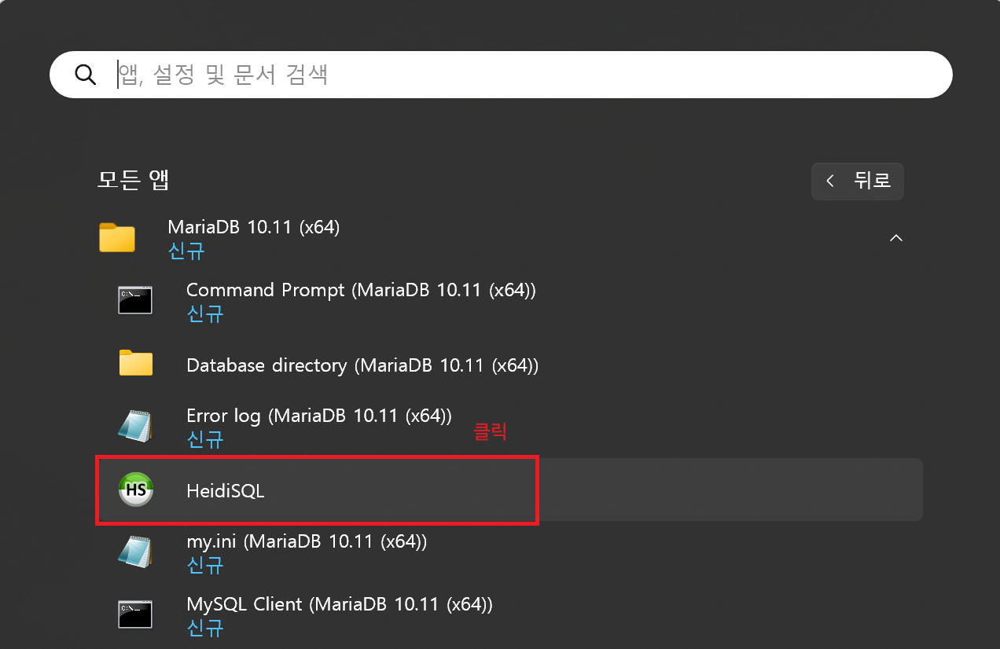

<br>

**2. HeidiSQL 에서 Connection 을 새롭게 추가한 후 MariaDB 10.11(x64) 을 연결하도록 합니다.**

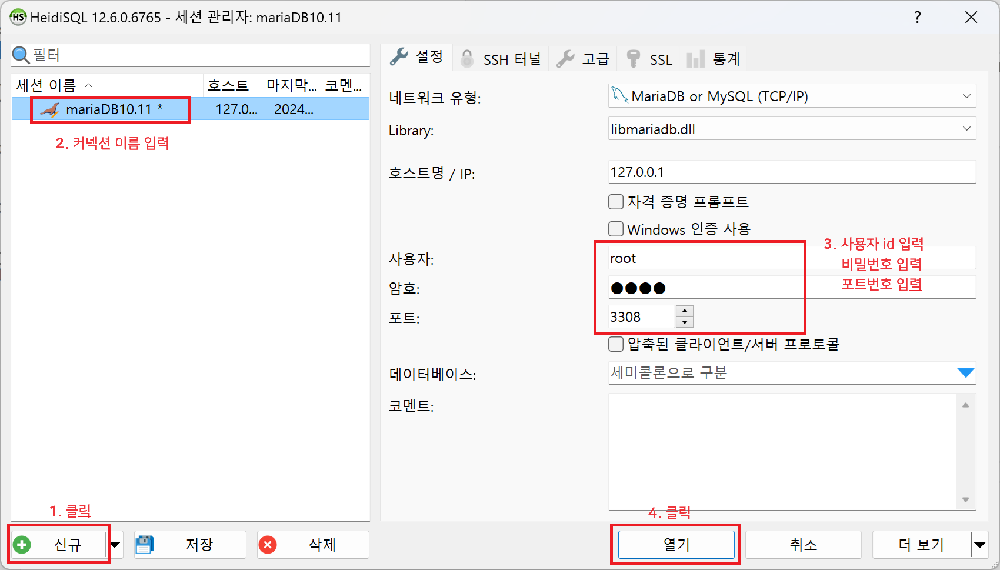

<br>

**2. MariaDB가 연결되면, "쿼리" 탭을 누르고, SQL 명령을 입력하고, 입력된 명령을 범위지정한 후 SQL 실행(F9)을 하도록 합니다.**

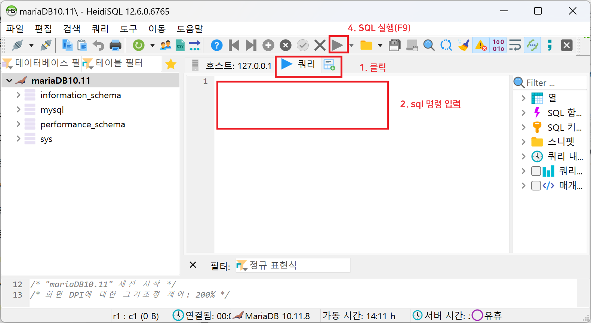

<br><br>


### 7-1-2. MariaDB 데이터베이스 생성

```sql
-- 데이터베이스 생성
CREATE DATABASE company;

-- 데이터베이스 선택
USE company;
```

<br>

### 7-1-3. 테이블 생성

```sql
-- board 테이블 생성
CREATE TABLE board (
    no INT AUTO_INCREMENT PRIMARY KEY,      -- 글번호, 자동 증가
    title VARCHAR(255) NOT NULL,            -- 글제목
    content TEXT NOT NULL,                  -- 글내용
    author VARCHAR(100) NOT NULL,           -- 작성자
    resdate DATETIME DEFAULT CURRENT_TIMESTAMP,  -- 작성일, 기본값 현재 날짜/시간
    hits INT DEFAULT 0                      -- 조회수, 기본값 0
);

-- member 테이블 생성
CREATE TABLE member (
    id VARCHAR(50) PRIMARY KEY,             -- 아이디
    pw VARCHAR(255) NOT NULL,               -- 비밀번호
    name VARCHAR(100) NOT NULL,             -- 회원명
    birth DATE NOT NULL,                    -- 생년월일
    email VARCHAR(255) NOT NULL,            -- 이메일
    tel VARCHAR(20),                        -- 연락처
    addr1 VARCHAR(255),                     -- 기본 주소
    addr2 VARCHAR(255),                     -- 상세 주소
    postcode VARCHAR(10),                   -- 우편번호
    regdate DATETIME DEFAULT CURRENT_TIMESTAMP  -- 가입일, 기본값 현재 날짜/시간
);
```

<br><br>

## 7-2. Node Back-end 개발

### 7-2-1. Node Back-end 프로젝트 구조 

```lua
node-back/
├── node_modules/
├── app.js
├── db.js
├── package.json
└── package-lock.json
```

<br>

**주요 구성요소 및 파일 역할**

node_modules/: 프로젝트에 필요한 모든 npm 패키지들이 저장되는 디렉터리입니다. express와 mysql2 패키지가 이곳에 설치됩니다.
app.js: Express 애플리케이션이 정의된 메인 파일로, 서버 설정 및 API 엔드포인트가 포함되어 있습니다.
db.js: MariaDB와의 연결을 설정하는 파일로, 데이터베이스 풀을 생성하여 다른 모듈에서 사용할 수 있도록 합니다.
package.json: 프로젝트의 기본 설정 파일로, 프로젝트 이름, 버전, 의존성 패키지 목록 등을 포함합니다.
package-lock.json: 프로젝트에 설치된 정확한 패키지 버전과 종속성 트리를 기록하여 npm이 동일한 환경을 재현할 수 있도록 합니다.

<br>

### 7-2-2. 프로젝트의 생성

#### 7-2-2-1. 프로젝트 초기 설정

- Node.js 프로젝트를 초기화하고 필요한 패키지를 설치합니다.

```sh
mkdir node-back
cd node-back
npm init -y
npm install express mysql2
```

<br>

#### 7-2-2-2. MariaDB 연결 설정

- MariaDB와의 연결을 설정합니다. db.js 파일을 만들어 연결 설정을 포함시킵니다.

```javascript
// db.js
const mysql = require('mysql2');

const pool = mysql.createPool({
    host: 'localhost',
    user: 'your_username',
    password: 'your_password',
    database: 'company',
    waitForConnections: true,
    connectionLimit: 10,
    queueLimit: 0
});

module.exports = pool.promise();
```

<br>

#### 7-2-2-3. Express 서버 설정

- Express 애플리케이션을 설정하고 기본적인 API 엔드포인트를 만듭니다. app.js 파일을 만듭니다.

```javascript
// app.js
const express = require('express');
const app = express();
const port = 3000;
const db = require('./db');

app.use(express.json());

// 게시판 글 목록 조회
app.get('/api/board', async (req, res) => {
    try {
        const [rows] = await db.query('SELECT * FROM board');
        res.json(rows);
    } catch (err) {
        res.status(500).send(err.message);
    }
});

// 게시판 글 상세보기
app.get('/api/board/:no', async (req, res) => {
    try {
        const [rows] = await db.query('SELECT * FROM board WHERE no = ?', [req.params.no]);
        if (rows.length > 0) {
            res.json(rows[0]);
        } else {
            res.status(404).send('Post not found');
        }
    } catch (err) {
        res.status(500).send(err.message);
    }
});

// 게시판 글 작성
app.post('/api/board', async (req, res) => {
    const { title, content, author } = req.body;
    try {
        const [result] = await db.query('INSERT INTO board (title, content, author) VALUES (?, ?, ?)', [title, content, author]);
        res.status(201).json({ id: result.insertId });
    } catch (err) {
        res.status(500).send(err.message);
    }
});

// 게시판 글 수정
app.put('/api/board/:no', async (req, res) => {
    const { title, content, author } = req.body;
    try {
        const [result] = await db.query('UPDATE board SET title = ?, content = ?, author = ? WHERE no = ?', [title, content, author, req.params.no]);
        if (result.affectedRows > 0) {
            res.send('Post updated');
        } else {
            res.status(404).send('Post not found');
        }
    } catch (err) {
        res.status(500).send(err.message);
    }
});

// 게시판 글 삭제
app.delete('/api/board/:no', async (req, res) => {
    try {
        const [result] = await db.query('DELETE FROM board WHERE no = ?', [req.params.no]);
        if (result.affectedRows > 0) {
            res.send('Post deleted');
        } else {
            res.status(404).send('Post not found');
        }
    } catch (err) {
        res.status(500).send(err.message);
    }
});

app.listen(port, () => {
    console.log(`Server is running on http://localhost:${port}`);
});
```

<br>

#### 7-2-2-4. 실행

- 프로젝트를 실행합니다.

```sh
node app.js
```

<br>

**API 엔드포인트**

1. GET /api/board: 게시판 글 목록 조회
2. GET /api/board/:no: 게시판 글 상세보기
3. POST /api/board: 게시판 글 작성
4. PUT /api/board/:no: 게시판 글 수정
5. DELETE /api/board/:no: 게시판 글 삭제

<br><br>

## 7-3. Jsp/Servlet Back-end 개발

- MariaDB와 MySQL은 기본적으로 호환되는 부분이 많으므로, JDBC 드라이버를 mysql-connector-java 대신 mariadb-java-client를 사용하면 됩니다. 또한, 드라이버 클래스 이름도 변경해야 합니다.

<br>

### 7-3-1. 프로젝트 구조


```lua
study073/
├── src/
│   ├── com/
│   │   └── example/
│   │       ├── controller/
│   │       │   └── BoardController.java
│   │       ├── dao/
│   │       │   └── BoardDao.java
│   │       ├── model/
│   │       │   └── Board.java
│   │       └── util/
│   │           └── DatabaseUtil.java
├── web/
│   ├── WEB-INF/
│   │   ├── lib/
│   │   │   ├── gson-2.8.8.jar
│   │   │   ├── mariadb-java-client-2.7.4.jar
│   │   │   ├── servlet-api.jar
│   │   │   ├── jsp-api.jar
│   │   │   ├── jstl-1.2.jar
│   │   ├── web.xml
│   ├── index.jsp
```

<br><br>

### 7-3-2. 필요한 라이브러리

- WEB-INF/lib 디렉토리에 아래 라이브러리 파일들을 추가해야 합니다:

```
gson-2.8.8.jar
mariadb-java-client-2.7.4.jar
servlet-api.jar
jsp-api.jar
jstl-1.2.jar
```

- 라이브러리 .jar 파일들은 각 라이브러리의 공식 사이트나 Maven 중앙 저장소(mvnrepository)에서 검색하여 다운로드할 수 있습니다.

<br><br>

### 7-3-3. 데이터베이스 유틸리티

- MariaD와의 연결을 위한 유틸리티 클래스입니다.

```java
// src/com/example/util/DatabaseUtil.java
package com.example.util;

import java.sql.Connection;
import java.sql.DriverManager;
import java.sql.SQLException;

public class DatabaseUtil {
    private static final String URL = "jdbc:mariadb://localhost:3308/company";
    private static final String USER = "root";
    private static final String PASSWORD = "1234";

    public static Connection getConnection() throws SQLException {
        try {
            Class.forName("org.mariadb.jdbc.Driver");
        } catch (ClassNotFoundException e) {
            e.printStackTrace();
        }
        return DriverManager.getConnection(URL, USER, PASSWORD);
    }
}
```

<br><br>

### 7-3-4. 모델 클래스

- 게시판 글을 나타내는 모델 클래스입니다.

```java
// src/com/example/model/Board.java
package com.example.model;

import java.util.Date;

public class Board {
    private int no;
    private String title;
    private String content;
    private String author;
    private Date resdate;
    private int hits;

    // Getters and Setters
}
```

<br><br>

### 7-3-5. DAO 클래스

- 데이터베이스와의 상호작용을 담당하는 클래스입니다.

```java
// src/com/example/dao/BoardDao.java
package com.example.dao;

import com.example.model.Board;
import com.example.util.DatabaseUtil;

import java.sql.*;
import java.util.ArrayList;
import java.util.List;

public class BoardDao {

    public List<Board> getAllBoards() throws SQLException {
        List<Board> boards = new ArrayList<>();
        String query = "SELECT * FROM board";

        try (Connection conn = DatabaseUtil.getConnection();
             Statement stmt = conn.createStatement();
             ResultSet rs = stmt.executeQuery(query)) {

            while (rs.next()) {
                Board board = new Board();
                board.setNo(rs.getInt("no"));
                board.setTitle(rs.getString("title"));
                board.setContent(rs.getString("content"));
                board.setAuthor(rs.getString("author"));
                board.setResdate(rs.getTimestamp("resdate"));
                board.setHits(rs.getInt("hits"));
                boards.add(board);
            }
        }
        return boards;
    }

    public Board getBoard(int no) throws SQLException {
        Board board = null;
        String query = "SELECT * FROM board WHERE no = ?";

        try (Connection conn = DatabaseUtil.getConnection();
             PreparedStatement pstmt = conn.prepareStatement(query)) {
            pstmt.setInt(1, no);

            try (ResultSet rs = pstmt.executeQuery()) {
                if (rs.next()) {
                    board = new Board();
                    board.setNo(rs.getInt("no"));
                    board.setTitle(rs.getString("title"));
                    board.setContent(rs.getString("content"));
                    board.setAuthor(rs.getString("author"));
                    board.setResdate(rs.getTimestamp("resdate"));
                    board.setHits(rs.getInt("hits"));
                }
            }
        }
        return board;
    }

    public void addBoard(Board board) throws SQLException {
        String query = "INSERT INTO board (title, content, author) VALUES (?, ?, ?)";

        try (Connection conn = DatabaseUtil.getConnection();
             PreparedStatement pstmt = conn.prepareStatement(query)) {
            pstmt.setString(1, board.getTitle());
            pstmt.setString(2, board.getContent());
            pstmt.setString(3, board.getAuthor());
            pstmt.executeUpdate();
        }
    }

    public void updateBoard(Board board) throws SQLException {
        String query = "UPDATE board SET title = ?, content = ?, author = ? WHERE no = ?";

        try (Connection conn = DatabaseUtil.getConnection();
             PreparedStatement pstmt = conn.prepareStatement(query)) {
            pstmt.setString(1, board.getTitle());
            pstmt.setString(2, board.getContent());
            pstmt.setString(3, board.getAuthor());
            pstmt.setInt(4, board.getNo());
            pstmt.executeUpdate();
        }
    }

    public void deleteBoard(int no) throws SQLException {
        String query = "DELETE FROM board WHERE no = ?";

        try (Connection conn = DatabaseUtil.getConnection();
             PreparedStatement pstmt = conn.prepareStatement(query)) {
            pstmt.setInt(1, no);
            pstmt.executeUpdate();
        }
    }
}
```

<br><br>

### 7-3-6. 컨트롤러 클래스

- Servlet을 사용하여 HTTP 요청을 처리하는 클래스입니다.

```java
// src/com/example/controller/BoardController.java
package com.example.controller;

import com.example.dao.BoardDao;
import com.example.model.Board;
import com.google.gson.Gson;

import javax.servlet.ServletException;
import javax.servlet.annotation.WebServlet;
import javax.servlet.http.*;
import java.io.IOException;
import java.io.PrintWriter;
import java.sql.SQLException;
import java.util.List;

@WebServlet("/api/board/*")
public class BoardController extends HttpServlet {
    private static final long serialVersionUID = 1L;
    private BoardDao boardDao;
    private Gson gson;

    public void init() {
        boardDao = new BoardDao();
        gson = new Gson();
    }

    protected void doOptions(HttpServletRequest request, HttpServletResponse response) throws ServletException, IOException {
        // CORS 헤더 설정
        response.setHeader("Access-Control-Allow-Origin", "*");
        response.setHeader("Access-Control-Allow-Methods", "GET, POST, PUT, DELETE, OPTIONS");
        response.setHeader("Access-Control-Allow-Headers", "Content-Type, Authorization");
        response.setHeader("Access-Control-Max-Age", "3600");
        response.setStatus(HttpServletResponse.SC_OK);
    }

    protected void doGet(HttpServletRequest request, HttpServletResponse response) throws ServletException, IOException {
        response.setContentType("application/json");
        response.setCharacterEncoding("UTF-8");
        response.setHeader("Access-Control-Allow-Origin", "*");
        PrintWriter out = response.getWriter();

        String pathInfo = request.getPathInfo();
        if (pathInfo == null || pathInfo.equals("/")) {
            try {
                List<Board> boards = boardDao.getAllBoards();
                out.print(gson.toJson(boards));
            } catch (SQLException e) {
                response.setStatus(HttpServletResponse.SC_INTERNAL_SERVER_ERROR);
                out.print(gson.toJson(e.getMessage()));
            }
        } else {
            String[] splits = pathInfo.split("/");
            if (splits.length == 2) {
                try {
                    int no = Integer.parseInt(splits[1]);
                    Board board = boardDao.getBoard(no);
                    if (board != null) {
                        out.print(gson.toJson(board));
                    } else {
                        response.setStatus(HttpServletResponse.SC_NOT_FOUND);
                    }
                } catch (SQLException e) {
                    response.setStatus(HttpServletResponse.SC_INTERNAL_SERVER_ERROR);
                    out.print(gson.toJson(e.getMessage()));
                }
            } else {
                response.setStatus(HttpServletResponse.SC_BAD_REQUEST);
            }
        }
    }

    protected void doPost(HttpServletRequest request, HttpServletResponse response) throws ServletException, IOException {
        response.setContentType("application/json");
        response.setCharacterEncoding("UTF-8");
        response.setHeader("Access-Control-Allow-Origin", "*");
        PrintWriter out = response.getWriter();

        try {
            Board board = gson.fromJson(request.getReader(), Board.class);
            boardDao.addBoard(board);
            response.setStatus(HttpServletResponse.SC_CREATED);
        } catch (SQLException e) {
            response.setStatus(HttpServletResponse.SC_INTERNAL_SERVER_ERROR);
            out.print(gson.toJson(e.getMessage()));
        }
    }

    protected void doPut(HttpServletRequest request, HttpServletResponse response) throws ServletException, IOException {
        response.setContentType("application/json");
        response.setCharacterEncoding("UTF-8");
        response.setHeader("Access-Control-Allow-Origin", "*");
        PrintWriter out = response.getWriter();

        String pathInfo = request.getPathInfo();
        if (pathInfo != null && pathInfo.split("/").length == 2) {
            try {
                int no = Integer.parseInt(pathInfo.split("/")[1]);
                Board board = gson.fromJson(request.getReader(), Board.class);
                board.setNo(no);
                boardDao.updateBoard(board);
                response.setStatus(HttpServletResponse.SC_OK);
            } catch (SQLException e) {
                response.setStatus(HttpServletResponse.SC_INTERNAL_SERVER_ERROR);
                out.print(gson.toJson(e.getMessage()));
            }
        } else {
            response.setStatus(HttpServletResponse.SC_BAD_REQUEST);
        }
    }

    protected void doDelete(HttpServletRequest request, HttpServletResponse response) throws ServletException, IOException {
        response.setContentType("application/json");
        response.setCharacterEncoding("UTF-8");
        response.setHeader("Access-Control-Allow-Origin", "*");
        PrintWriter out = response.getWriter();

        String pathInfo = request.getPathInfo();
        if (pathInfo != null && pathInfo.split("/").length == 2) {
            try {
                int no = Integer.parseInt(pathInfo.split("/")[1]);
                boardDao.deleteBoard(no);
                response.setStatus(HttpServletResponse.SC_OK);
            } catch (SQLException e) {
                response.setStatus(HttpServletResponse.SC_INTERNAL_SERVER_ERROR);
                out.print(gson.toJson(e.getMessage()));
            }
        } else {
            response.setStatus(HttpServletResponse.SC_BAD_REQUEST);
        }
    }
}
```

<br><br>

### 7-3-7. 웹 애플리케이션 설정

- web.xml 파일에서 Servlet 매핑을 설정합니다.

```xml
<!-- web/WEB-INF/web.xml -->
<web-app xmlns="http://xmlns.jcp.org/xml/ns/javaee"
         xmlns:xsi="http://www.w3.org/2001/XMLSchema-instance"
         xsi:schemaLocation="http://xmlns.jcp.org/xml/ns/javaee
         http://xmlns.jcp.org/xml/ns/javaee/web-app_3_1.xsd"
         version="3.1">

    <servlet>
        <servlet-name>BoardController</servlet-name>
        <servlet-class>com.example.controller.BoardController</servlet-class>
    </servlet>

    <servlet-mapping>
        <servlet-name>BoardController</servlet-name>
        <url-pattern>/api/board/*</url-pattern>
    </servlet-mapping>

</web-app>
```

<br><br>

## 7-4. Springframework Legacy Back-end 개발

### 7-4-1. 프로젝트 구조

```lua
study074/
src
├── main
│   ├── java
│   │   └── com
│   │       └── example
│   │           └── demo
│   │               ├── config
│   │               │   ├── RootConfig.java
│   │               │   ├── ServletConfig.java
│   │               │   └── WebConfig.java
│   │               ├── controller
│   │               │   └── PostController.java
│   │               ├── mapper
│   │               │   └── PostMapper.java
│   │               ├── model
│   │               │   └── Post.java
│   │               ├── repository
│   │               │   └── PostRepository.java
│   │               └── service
│   │                   └── PostService.java
│   └── resources
│       ├── mybatis-config.xml
│       └── views
│           └── (JSP 파일들)
└── test
    └── java
        └── com
            └── example
                └── demo
                    └── DemoApplicationTests.java
```

<br>

#### 7-4-1-1. 의존성 라이브러리 

**pom.xml**

```xml
<project xmlns="http://maven.apache.org/POM/4.0.0"
         xmlns:xsi="http://www.w3.org/2001/XMLSchema-instance"
         xsi:schemaLocation="http://maven.apache.org/POM/4.0.0 http://maven.apache.org/xsd/maven-4.0.0.xsd">
    <modelVersion>4.0.0</modelVersion>
    
    <groupId>com.example</groupId>
    <artifactId>demo</artifactId>
    <version>1.0-SNAPSHOT</version>
    <packaging>war</packaging>
    
    <properties>
        <java.version>17</java.version>
        <spring-framework.version>5.3.20</spring-framework.version>
        <mybatis.version>3.5.7</mybatis.version>
        <mariadb.version>2.7.0</mariadb.version>
    </properties>
    
    <dependencies>
        <!-- Spring Framework -->
        <dependency>
            <groupId>org.springframework</groupId>
            <artifactId>spring-context</artifactId>
            <version>${spring-framework.version}</version>
        </dependency>
        <dependency>
            <groupId>org.springframework</groupId>
            <artifactId>spring-webmvc</artifactId>
            <version>${spring-framework.version}</version>
        </dependency>
        <dependency>
            <groupId>org.springframework</groupId>
            <artifactId>spring-jdbc</artifactId>
            <version>${spring-framework.version}</version>
        </dependency>
        <dependency>
            <groupId>org.springframework</groupId>
            <artifactId>spring-tx</artifactId>
            <version>${spring-framework.version}</version>
        </dependency>
        
        <!-- MyBatis -->
        <dependency>
            <groupId>org.mybatis</groupId>
            <artifactId>mybatis</artifactId>
            <version>${mybatis.version}</version>
        </dependency>
        <dependency>
            <groupId>org.mybatis</groupId>
            <artifactId>mybatis-spring</artifactId>
            <version>${mybatis.version}</version>
        </dependency>
        
        <!-- MariaDB JDBC Driver -->
        <dependency>
            <groupId>org.mariadb.jdbc</groupId>
            <artifactId>mariadb-java-client</artifactId>
            <version>${mariadb.version}</version>
        </dependency>
        
        <!-- Lombok -->
        <dependency>
            <groupId>org.projectlombok</groupId>
            <artifactId>lombok</artifactId>
            <version>1.18.22</version>
            <scope>provided</scope>
        </dependency>
        
        <!-- Servlet API -->
        <dependency>
            <groupId>javax.servlet</groupId>
            <artifactId>javax.servlet-api</artifactId>
            <version>4.0.1</version>
            <scope>provided</scope>
        </dependency>
        
        <!-- JSP API -->
        <dependency>
            <groupId>javax.servlet.jsp</groupId>
            <artifactId>javax.servlet.jsp-api</artifactId>
            <version>2.3.3</version>
            <scope>provided</scope>
        </dependency>
        
        <!-- JSTL -->
        <dependency>
            <groupId>javax.servlet</groupId>
            <artifactId>jstl</artifactId>
            <version>1.2</version>
            <scope>provided</scope>
        </dependency>
    </dependencies>
    
    <build>
        <finalName>demo</finalName>
        <plugins>
            <plugin>
                <groupId>org.apache.maven.plugins</groupId>
                <artifactId>maven-war-plugin</artifactId>
                <version>3.2.3</version>
            </plugin>
        </plugins>
    </build>
</project>
```

<br><br>

### 7-4-2. DTO 작성

#### 7-4-2-1. Post.java

**com.example.demo.model.Post**

```java
package com.example.demo.model;

import lombok.AllArgsConstructor;
import lombok.Getter;
import lombok.NoArgsConstructor;
import lombok.Setter;
import lombok.ToString;

@Getter
@Setter
@ToString
@NoArgsConstructor
@AllArgsConstructor
public class Post {
    private Long postId;
    private String title;
    private String content;
    private String author;
    private String createdAt;
    private String updatedAt;
}
```

<br><br>

### 7-4-3. Mapper 작성

#### 7-4-3-1. PostMapper.java

**com.example.demo.mapper.PostMapper**

```java
package com.example.demo.mapper;

import com.example.demo.model.Post;
import org.apache.ibatis.annotations.*;

import java.util.List;

@Mapper
public interface PostMapper {

    @Select("SELECT * FROM posts")
    List<Post> getAllPosts();

    @Select("SELECT * FROM posts WHERE id = #{id}")
    Post getPostById(Long id);

    @Insert("INSERT INTO posts (title, content) VALUES (#{title}, #{content})")
    @Options(useGeneratedKeys = true, keyProperty = "id")
    void createPost(Post post);

    @Update("UPDATE posts SET title = #{title}, content = #{content} WHERE id = #{id}")
    void updatePost(Post post);

    @Delete("DELETE FROM posts WHERE id = #{id}")
    void deletePost(Long id);
}
```

<br><br>

### 7-4-4. Service 작성

#### 7-4-4-1. PostService.java:

**com.example.demo.service.PostService**

```java
package com.example.demo.service;

import com.example.demo.model.Post;
import com.example.demo.mapper.PostMapper;
import org.springframework.beans.factory.annotation.Autowired;
import org.springframework.stereotype.Service;

import java.util.List;

@Service
public class PostService {

    @Autowired
    private PostMapper postRepository;

    public List<Post> getAllPosts() {
        return postRepository.findAll();
    }

    public Post getPostById(Long id) {
        return postRepository.findById(id).orElse(null);
    }

    public Post createPost(Post post) {
        return postRepository.save(post);
    }

    public Post updatePost(Long id, Post updatedPost) {
        Post existingPost = postRepository.findById(id).orElse(null);
        if (existingPost != null) {
            existingPost.setTitle(updatedPost.getTitle());
            existingPost.setContent(updatedPost.getContent());
            return postRepository.save(existingPost);
        }
        return null;
    }

    public void deletePost(Long id) {
        postRepository.deleteById(id);
    }
}
```

<br><br>

### 7-4-5. Controller 작성

#### 7-4-5-1. PostController.java

**com.example.demo.controller.PostController**

```java
package com.example.demo.controller;

import com.example.demo.model.Post;
import com.example.demo.service.PostService;
import org.springframework.beans.factory.annotation.Autowired;
import org.springframework.web.bind.annotation.*;

import java.util.List;

@RestController
@RequestMapping("/api/posts")
public class PostController {

    @Autowired
    private PostService postService;

    @GetMapping
    public List<Post> getAllPosts() {
        return postService.getAllPosts();
    }

    @GetMapping("/{id}")
    public Post getPostById(@PathVariable Long id) {
        return postService.getPostById(id);
    }

    @PostMapping
    public Post createPost(@RequestBody Post post) {
        return postService.createPost(post);
    }

    @PutMapping("/{id}")
    public Post updatePost(@PathVariable Long id, @RequestBody Post post) {
        return postService.updatePost(id, post);
    }

    @DeleteMapping("/{id}")
    public void deletePost(@PathVariable Long id) {
        postService.deletePost(id);
    }
}
```

<br>

### 7-4-6. Configuration 작성

### 7-4-6-1. WebConfig.java

```java
package com.example.demo.config;

import org.springframework.context.annotation.Bean;
import org.springframework.context.annotation.ComponentScan;
import org.springframework.context.annotation.Configuration;
import org.springframework.web.filter.CharacterEncodingFilter;
import org.springframework.web.servlet.config.annotation.EnableWebMvc;
import org.springframework.web.servlet.config.annotation.WebMvcConfigurer;
import org.springframework.web.servlet.config.annotation.ResourceHandlerRegistry;
import org.springframework.web.servlet.view.InternalResourceViewResolver;
import org.springframework.web.multipart.support.StandardServletMultipartResolver;

import javax.servlet.Filter;

@Configuration
@EnableWebMvc
@ComponentScan(basePackages = {"com.example.demo.controller"})
public class WebConfig implements WebMvcConfigurer {

    // 한글 인코딩 필터 설정
    @Bean
    public Filter characterEncodingFilter() {
        CharacterEncodingFilter filter = new CharacterEncodingFilter();
        filter.setEncoding("UTF-8");
        filter.setForceEncoding(true);
        return filter;
    }

    @Override
    public void addResourceHandlers(ResourceHandlerRegistry registry) {
        registry.addResourceHandler("/resources/**").addResourceLocations("/resources/");
    }
}
```

<br>

### 7-4-6-2. RootConfig.java

```java
package com.example.demo.config;

import org.apache.ibatis.session.SqlSessionFactory;
import org.mybatis.spring.SqlSessionFactoryBean;
import org.mybatis.spring.annotation.MapperScan;
import org.springframework.context.annotation.Bean;
import org.springframework.context.annotation.ComponentScan;
import org.springframework.context.annotation.Configuration;
import org.springframework.core.io.support.PathMatchingResourcePatternResolver;
import org.springframework.jdbc.datasource.DataSourceTransactionManager;
import org.springframework.transaction.annotation.EnableTransactionManagement;

import javax.sql.DataSource;

@Configuration
@ComponentScan(basePackages = {"com.example.demo.service", "com.example.demo.repository"})
@MapperScan(basePackages = {"com.example.demo.mapper"}, sqlSessionFactoryRef = "sqlSessionFactory")
@EnableTransactionManagement
public class RootConfig {

    @Bean
    public SqlSessionFactory sqlSessionFactory(DataSource dataSource) throws Exception {
        SqlSessionFactoryBean sqlSessionFactoryBean = new SqlSessionFactoryBean();
        sqlSessionFactoryBean.setDataSource(dataSource);
        // MyBatis의 Mapper XML 파일 위치 지정
        sqlSessionFactoryBean.setMapperLocations(new PathMatchingResourcePatternResolver().getResources("classpath:mappers/**/*Mapper.xml"));
        // MyBatis 설정 파일 지정
        sqlSessionFactoryBean.setConfigLocation(new ClassPathResource("classpath:mybatis-config.xml"));
        return sqlSessionFactoryBean.getObject();
    }

    @Bean
    public DataSourceTransactionManager transactionManager(DataSource dataSource) {
        return new DataSourceTransactionManager(dataSource);
    }

    // MariaDB JDBC 드라이버 로딩 및 DataSource 생성
    @Bean
    public DataSource dataSource() {
        DriverManagerDataSource dataSource = new DriverManagerDataSource();
        dataSource.setDriverClassName("org.mariadb.jdbc.Driver");
        dataSource.setUrl("jdbc:mariadb://localhost:3308/company"); // 포트 번호가 3308인 경우: jdbc:mariadb://localhost:3308/company
        dataSource.setUsername("root");
        dataSource.setPassword("1234");
        return dataSource;
    }
}
```

<br>

### 7-4-6-3. ServletConfig.java

```java
package com.example.demo.config;

import org.springframework.context.annotation.Configuration;
import org.springframework.web.servlet.config.annotation.EnableWebMvc;
import org.springframework.web.servlet.config.annotation.WebMvcConfigurer;
import org.springframework.web.servlet.config.annotation.ResourceHandlerRegistry;
import org.springframework.web.servlet.config.annotation.DefaultServletHandlerConfigurer;
import org.springframework.web.servlet.view.InternalResourceViewResolver;
import org.springframework.web.multipart.support.StandardServletMultipartResolver;

@Configuration
@EnableWebMvc
public class ServletConfig implements WebMvcConfigurer {

    @Override
    public void addResourceHandlers(ResourceHandlerRegistry registry) {
        registry.addResourceHandler("/resources/**").addResourceLocations("/resources/");
    }

    @Override
    public void configureDefaultServletHandling(DefaultServletHandlerConfigurer configurer) {
        configurer.enable();
    }

    // ViewResolver 설정
    @Bean
    public InternalResourceViewResolver viewResolver() {
        InternalResourceViewResolver resolver = new InternalResourceViewResolver();
        resolver.setPrefix("/WEB-INF/views/");
        resolver.setSuffix(".jsp");
        return resolver;
    }

    // MultipartResolver 설정
    @Bean
    public StandardServletMultipartResolver multipartResolver() {
        return new StandardServletMultipartResolver();
    }
}
```

<br>

### 7-4-6-4. mybatis-config.xml

```xml
<?xml version="1.0" encoding="UTF-8"?>
<!DOCTYPE configuration PUBLIC "-//mybatis.org//DTD Config 3.0//EN"
        "http://mybatis.org/dtd/mybatis-3-config.dtd">
<configuration>
    <settings>
        <setting name="mapUnderscoreToCamelCase" value="true"/>
    </settings>
    
    <!-- typeAlias 설정 -->
    <typeAliases>
        <package name="com.example.demo"/>
    </typeAliases>
</configuration>
```

<br>

#### 7-4-6-5. CorsFilter.java:

**com.example.demo.config.CorsFilter**

```java
package com.example.demo.config;

import org.springframework.core.Ordered;
import org.springframework.core.annotation.Order;
import org.springframework.stereotype.Component;

import javax.servlet.*;
import javax.servlet.http.HttpServletRequest;
import javax.servlet.http.HttpServletResponse;
import java.io.IOException;

@Component
@Order(Ordered.HIGHEST_PRECEDENCE)
public class CorsFilter implements Filter {

    @Override
    public void doFilter(ServletRequest req, ServletResponse res, FilterChain chain) throws IOException, ServletException {
        HttpServletResponse response = (HttpServletResponse) res;
        HttpServletRequest request = (HttpServletRequest) req;

        response.setHeader("Access-Control-Allow-Origin", "*");
        response.setHeader("Access-Control-Allow-Methods", "POST, GET, PUT, OPTIONS, DELETE");
        response.setHeader("Access-Control-Allow-Headers", "Content-Type, Access-Control-Allow-Headers, Authorization, X-Requested-With,observe");
        response.setHeader("Access-Control-Max-Age", "3600");
        response.setHeader("Access-Control-Allow-Credentials", "true");
        response.setHeader("Access-Control-Expose-Headers", "Authorization");

        if (!"OPTIONS".equalsIgnoreCase(request.getMethod())) {
            chain.doFilter(req, res);
        }
    }

    @Override
    public void init(FilterConfig filterConfig) {
    }

    @Override
    public void destroy() {
    }
}
```


<br><br>

## 7-5. Spring Boot Back-end 개발

### 7-5-1. 프로젝트 구조

```lua
study075/
src
├── main
│   ├── java
│   │   └── com
│   │       └── example
│   │           └── demo
│   │               ├── config
│   │               │   ├── RootConfig.java
│   │               │   ├── WebConfig.java
│   │               │   └── SecurityConfig.java  # 보안 설정 (필요시)
│   │               ├── controller
│   │               │   └── PostController.java
│   │               ├── model
│   │               │   ├── Post.java
│   │               │   └── Member.java
│   │               ├── repository
│   │               │   ├── PostRepository.java
│   │               │   └── MemberRepository.java
│   │               └── service
│   │                   ├── PostService.java
│   │                   └── MemberService.java
│   └── resources
│       ├── application.properties
│       ├── static
│       │   └── (정적 파일들: css, js 등)
│       └── templates
│           └── (뷰 템플릿 파일들: HTML, JSP 등)
└── test
    └── java
        └── com
            └── example
                └── demo
                    └── DemoApplicationTests.java
```

<br>

**프로젝트 파일 설명**

config: Spring 애플리케이션의 설정 클래스들을 포함합니다. RootConfig는 데이터베이스 및 MyBatis 설정과 같은 애플리케이션의 루트 설정을 담당하고, WebConfig는 웹 관련 설정을 담당합니다. SecurityConfig는 보안 설정을 담당합니다.
controller: MVC 패턴의 컨트롤러 클래스를 포함합니다. 이 클래스들은 클라이언트 요청을 처리하고 응답을 반환합니다.
model: 애플리케이션의 데이터 모델을 정의하는 클래스들을 포함합니다. 각 클래스는 데이터베이스 테이블과 일치하도록 설계되었습니다.
repository: 데이터베이스와 상호작용하는 인터페이스들을 포함합니다. Spring Data JPA를 사용하는 경우 JpaRepository를 확장한 인터페이스가 여기에 위치합니다.
service: 비즈니스 로직을 수행하는 서비스 클래스들을 포함합니다.
resources: 애플리케이션의 리소스 파일을 포함합니다. 여기에는 설정 파일, 정적 파일 및 뷰 템플릿이 포함됩니다.
test: 단위 테스트를 위한 테스트 클래스들을 포함합니다.

<br><br>

### 7-5-2. 프로젝트 설정

#### 7-5-1-1. Gradle 방식으로 의존성 라이브러리 설정

**build.gradle**

```groovy
plugins {
    id 'org.springframework.boot' version '3.1.0'
    id 'io.spring.dependency-management' version '1.0.11.RELEASE'
    id 'java'
}

group = 'com.example'
version = '1.0-SNAPSHOT'
sourceCompatibility = '17'

repositories {
    mavenCentral()
}

dependencies {
    // Spring Boot Starter Web
    implementation 'org.springframework.boot:spring-boot-starter-web'

    // Spring Boot Starter Data JPA
    implementation 'org.springframework.boot:spring-boot-starter-data-jpa'

    // MariaDB JDBC 드라이버
    implementation 'org.mariadb.jdbc:mariadb-java-client'

    // Lombok
    implementation 'org.projectlombok:lombok'

    // Servlet API
    providedCompile 'javax.servlet:javax.servlet-api:4.0.1'

    // JSP API
    providedCompile 'javax.servlet.jsp:javax.servlet.jsp-api:2.3.3'

    // JSTL
    providedCompile 'javax.servlet:jstl:1.2'
}
```

<br>

#### 7-5-1-2. 프로젝트 설정

**application.properties**

```properties
# 데이터베이스 연결 설정
spring.datasource.url=jdbc:mariadb://localhost:3308/company  # 포트 번호가 3308인 경우: jdbc:mariadb://localhost:3308/company
spring.datasource.username=root
spring.datasource.password=1234
spring.datasource.driver-class-name=org.mariadb.jdbc.Driver

# JPA 설정
spring.jpa.show-sql=true
spring.jpa.hibernate.ddl-auto=update
spring.jpa.properties.hibernate.dialect=org.hibernate.dialect.MariaDBDialect

# CORS 설정 (필요한 경우에만 활성화)
# spring.mvc.cors.allowed-origins=http://localhost:8080
# spring.mvc.cors.allowed-methods=GET,POST,PUT,DELETE
# spring.mvc.cors.allowed-headers=Content-Type,Authorization
# spring.mvc.cors.allow-credentials=true
```

<br><br>

### 7-5-3. 모델 클래스 작성

#### 7-5-3-1. 게시글(Post) 모델 클래스

```java
package com.example.demo.model;

import lombok.AllArgsConstructor;
import lombok.Getter;
import lombok.NoArgsConstructor;
import lombok.Setter;

import javax.persistence.*;
import java.util.Date;

@Entity
@Getter
@Setter
@NoArgsConstructor
@AllArgsConstructor
@Table(name = "board")
public class Post {
    @Id
    @GeneratedValue(strategy = GenerationType.IDENTITY)
    private Long no;
    private String title;
    private String content;
    private String author;
    @Temporal(TemporalType.TIMESTAMP)
    @Column(name = "resdate")
    private Date resDate;
    private int hits;
}
```

<br>

#### 7-5-3-2. 회원(Member) 모델 클래스:

```java
package com.example.demo.model;

import lombok.AllArgsConstructor;
import lombok.Getter;
import lombok.NoArgsConstructor;
import lombok.Setter;

import javax.persistence.*;
import java.util.Date;

@Entity
@Getter
@Setter
@NoArgsConstructor
@AllArgsConstructor
@Table(name = "member")
public class Member {
    @Id
    @Column(name = "id")
    private String memberId;
    private String pw;
    private String name;
    @Temporal(TemporalType.DATE)
    private Date birth;
    private String email;
    private String tel;
    private String addr1;
    private String addr2;
    private String postcode;
    @Temporal(TemporalType.TIMESTAMP)
    @Column(name = "regdate")
    private Date regDate;
}
```

<br><br>

### 7-5-4. Repository 작성

#### 7-5-4-1. 게시글(Post) Repository

```java
package com.example.demo.repository;

import com.example.demo.model.Post;
import org.springframework.data.jpa.repository.JpaRepository;

public interface PostRepository extends JpaRepository<Post, Long> {
}
```

<br>

#### 7-5-4-2. 회원(Member) Repository

```java
package com.example.demo.repository;

import com.example.demo.model.Member;
import org.springframework.data.jpa.repository.JpaRepository;

public interface MemberRepository extends JpaRepository<Member, String> {
}
```

<br><br>

### 7-5-5. Service 작성

#### 7-5-5-1. 게시글(Post) 서비스(Service) 클래스

```java
package com.example.demo.service;

import com.example.demo.model.Post;
import com.example.demo.repository.PostRepository;
import org.springframework.beans.factory.annotation.Autowired;
import org.springframework.stereotype.Service;

import java.util.List;

@Service
public class PostService {

    @Autowired
    private PostRepository postRepository;

    public List<Post> getAllPosts() {
        return postRepository.findAll();
    }

    public Post getPostById(Long id) {
        return postRepository.findById(id).orElse(null);
    }

    public Post createPost(Post post) {
        return postRepository.save(post);
    }

    public Post updatePost(Post post) {
        return postRepository.save(post);
    }

    public void deletePost(Long id) {
        postRepository.deleteById(id);
    }
}
```

<br>

#### 7-5-5-2. 회원(Member) 서비스(Service) 클래스

```java
package com.example.demo.service;

import com.example.demo.model.Member;
import com.example.demo.repository.MemberRepository;
import org.springframework.beans.factory.annotation.Autowired;
import org.springframework.stereotype.Service;

import java.util.List;

@Service
public class MemberService {

    @Autowired
    private MemberRepository memberRepository;

    public List<Member> getAllMembers() {
        return memberRepository.findAll();
    }

    public Member getMemberById(String id) {
        return memberRepository.findById(id).orElse(null);
    }

    public Member createMember(Member member) {
        return memberRepository.save(member);
    }

    public Member updateMember(Member member) {
        return memberRepository.save(member);
    }

    public void deleteMember(String id) {
        memberRepository.deleteById(id);
    }
}
```

<br><br>

### 7-5-6. Controller 작성

#### 7-5-6-1. 게시판(Post) 컨트롤러(Controller) 클래스

```java
package com.example.demo.controller;

import com.example.demo.model.Post;
import com.example.demo.service.PostService;
import org.springframework.beans.factory.annotation.Autowired;
import org.springframework.http.HttpStatus;
import org.springframework.http.ResponseEntity;
import org.springframework.web.bind.annotation.*;

import java.util.List;

@RestController
@RequestMapping("/api/posts")
public class PostController {

    @Autowired
    private PostService postService;

    @GetMapping
    public ResponseEntity<List<Post>> getAllPosts() {
        List<Post> posts = postService.getAllPosts();
        return new ResponseEntity<>(posts, HttpStatus.OK);
    }

    @GetMapping("/{id}")
    public ResponseEntity<Post> getPostById(@PathVariable("id") Long id) {
        Post post = postService.getPostById(id);
        if (post != null) {
            return new ResponseEntity<>(post, HttpStatus.OK);
        } else {
            return new ResponseEntity<>(HttpStatus.NOT_FOUND);
        }
    }

    @PostMapping
    public ResponseEntity<Post> createPost(@RequestBody Post post) {
        Post createdPost = postService.createPost(post);
        return new ResponseEntity<>(createdPost, HttpStatus.CREATED);
    }

    @PutMapping("/{id}")
    public ResponseEntity<Post> updatePost(@PathVariable("id") Long id, @RequestBody Post post) {
        post.setNo(id);
        Post updatedPost = postService.updatePost(post);
        if (updatedPost != null) {
            return new ResponseEntity<>(updatedPost, HttpStatus.OK);
        } else {
            return new ResponseEntity<>(HttpStatus.NOT_FOUND);
        }
    }

    @DeleteMapping("/{id}")
    public ResponseEntity<Void> deletePost(@PathVariable("id") Long id) {
        postService.deletePost(id);
        return new ResponseEntity<>(HttpStatus.NO_CONTENT);
    }
}
```

<br><br><br>

## 7-6. Python Flask Back-end 개발

### 7-6-1. 프로젝트 설정과 구조

#### 7-6-1-1. 의존성 라이브러리 설치

**필요한 라이브러리 설치**

```bash
pip install Flask Flask-RESTful pymysql
```

<br>

#### 7-6-1-2. 프로젝트 구조

**Flask 애플리케이션의 구조**

```lua
study076/
├── app.py
├── requirements.txt
├── database.py
├── models/
│   └── post.py
├── controllers/
│   └── post_controller.py
├── services/
│   └── post_service.py
└── __init__.py
```

<br>

**프로젝트 구성요소**

app.py: 애플리케이션의 진입점으로, Flask 애플리케이션을 초기화하고 라우터를 등록하는 파일입니다.
requirements.txt: 프로젝트에 필요한 모든 패키지 목록이 포함된 파일입니다.
database.py: 데이터베이스 연결을 설정하고 반환하는 파일입니다.
models/: 데이터베이스 모델과 Pydantic 모델을 정의하는 디렉토리입니다.
post.py: 게시글(Post) 관련 모델 정의 파일입니다.
controllers/: 요청을 처리하는 컨트롤러 클래스가 포함된 디렉토리입니다.
post_controller.py: 게시글 CRUD 기능을 처리하는 컨트롤러 클래스 파일입니다.
services/: 비즈니스 로직과 데이터베이스 작업을 수행하는 서비스 클래스가 포함된 디렉토리입니다.
post_service.py: 게시글 관련 데이터베이스 작업을 수행하는 서비스 클래스 파일입니다.
`__init__.py`: 패키지를 초기화하는 파일로, 필요시 디렉토리 안에 포함되어야 합니다.


<br>

#### 7-6-1-3. 프로젝트 설정

**database.py**

```python
import pymysql.cursors

def get_db():
    connection = pymysql.connect(
        host='localhost',
        user='root',
        password='1234',
        database='company',
        port=3308,  # MariaDB의 포트 번호 추가
        cursorclass=pymysql.cursors.DictCursor
    )
    return connection
```

<br><br>

### 7-6-2. Model 작성

**post.py (모델 클래스)**

```python
from pydantic import BaseModel
from datetime import datetime
from typing import Optional

class Post(BaseModel):
    no: int
    title: str
    content: str
    author: str
    resdate: datetime
    hits: int

class PostCreate(BaseModel):
    title: str
    content: str
    author: str

class PostUpdate(BaseModel):
    title: Optional[str] = None
    content: Optional[str] = None
    author: Optional[str] = None
```

<br><br>

### 7-6-3. Service 작성

**post_service.py (서비스 클래스)**

```python
from typing import List, Optional
from model.post import Post, PostCreate, PostUpdate
from database import get_db

class PostService:
    def __init__(self):
        self.db = get_db()

    def get_all_posts(self) -> List[Post]:
        cursor = self.db.cursor()
        cursor.execute("SELECT * FROM board")
        rows = cursor.fetchall()
        posts = [Post(**row) for row in rows]
        cursor.close()
        return posts

    def get_post(self, post_id: int) -> Optional[Post]:
        cursor = self.db.cursor()
        cursor.execute("SELECT * FROM board WHERE no = %s", (post_id,))
        row = cursor.fetchone()
        cursor.close()
        if row:
            return Post(**row)
        return None

    def create_post(self, post_create: PostCreate) -> Post:
        cursor = self.db.cursor()
        cursor.execute(
            "INSERT INTO board (title, content, author) VALUES (%s, %s, %s)",
            (post_create.title, post_create.content, post_create.author),
        )
        self.db.commit()
        post_id = cursor.lastrowid
        cursor.close()
        return self.get_post(post_id)

    def update_post(self, post_id: int, post_update: PostUpdate) -> Optional[Post]:
        cursor = self.db.cursor()
        cursor.execute(
            "UPDATE board SET title = %s, content = %s, author = %s WHERE no = %s",
            (post_update.title, post_update.content, post_update.author, post_id),
        )
        self.db.commit()
        cursor.close()
        return self.get_post(post_id)

    def delete_post(self, post_id: int) -> bool:
        cursor = self.db.cursor()
        cursor.execute("DELETE FROM board WHERE no = %s", (post_id,))
        self.db.commit()
        affected_rows = cursor.rowcount
        cursor.close()
        return affected_rows > 0
```

<br><br>

### 7-6-4. Controller 작성

**post_controller.py (컨트롤러 클래스)**

```python
from flask import jsonify, request
from flask_restful import Resource
from service.post_service import PostService
from model.post import PostCreate, PostUpdate

post_service = PostService()

class PostList(Resource):
    def get(self):
        try:
            posts = post_service.get_all_posts()
            return jsonify(posts)
        except Exception as e:
            return {"message": str(e)}, 500

    def post(self):
        try:
            data = request.get_json()
            new_post = PostCreate(**data)
            created_post = post_service.create_post(new_post)
            return jsonify(created_post), 201
        except Exception as e:
            return {"message": str(e)}, 500

class Post(Resource):
    def get(self, post_id):
        try:
            post = post_service.get_post(post_id)
            if post is None:
                return {"message": "Post not found"}, 404
            return jsonify(post)
        except Exception as e:
            return {"message": str(e)}, 500

    def put(self, post_id):
        try:
            data = request.get_json()
            post_update = PostUpdate(**data)
            updated_post = post_service.update_post(post_id, post_update)
            if updated_post is None:
                return {"message": "Post not found"}, 404
            return jsonify(updated_post)
        except Exception as e:
            return {"message": str(e)}, 500

    def delete(self, post_id):
        try:
            success = post_service.delete_post(post_id)
            if not success:
                return {"message": "Post not found"}, 404
            return {"message": "Post deleted successfully"}
        except Exception as e:
            return {"message": str(e)}, 500
```

<br><br>

### 7-6-5. Application Settings

**app.py (Flask 애플리케이션 설정)**

```python
from flask import Flask
from flask_restful import Api
from controllers.post_controller import PostList, Post

app = Flask(__name__)
api = Api(app)

# CORS 설정
from flask_cors import CORS
CORS(app)

# 라우터 등록
api.add_resource(PostList, '/posts')
api.add_resource(Post, '/posts/<int:post_id>')

if __name__ == '__main__':
    app.run(debug=True)
```

<br>

**requirements.txt**

```text
flask
flask-restful
pydantic
pymysql
flask-cors
```

<br><br>

## 7-7. Python FastAPI Back-end 개발

### 7-7-1. 프로젝트 설정과 구조

#### 7-7-1-1. 의존성 라이브러리 설치

**필요한 라이브러리 설치**

```bash
pip install fastapi uvicorn pymysql
```

<br>

#### 7-7-1-2. 프로젝트 구조

**FastAPI 애플리케이션의 구조**

```lua
study077/
├── app.py
├── database.py
├── models
│   └── post.py
├── routers
│   └── post_controller.py
├── services
│   └── post_service.py
├── requirements.txt
└── __init__.py
```

<br>

#### 7-7-1-3. 프로젝트 설정

**config.py**

```python
DB_CONFIG = {
    'host': 'localhost',
    'user': 'root',
    'password': '1234',
    'database': 'company',  # 데이터베이스 이름
    'port': 3308,  # 포트 번호
    'charset': 'utf8mb4',
}
```

<br><br>

### 7-7-2. Model 작성

**post.py (모델 클래스)**

```python
from pydantic import BaseModel
from datetime import datetime
from typing import Optional

class Post(BaseModel):
    no: int
    title: str
    content: str
    author: str
    resdate: datetime
    hits: int

    class Config:
        orm_mode = True

class PostCreate(BaseModel):
    title: str
    content: str
    author: str

class PostUpdate(BaseModel):
    title: Optional[str] = None
    content: Optional[str] = None
    author: Optional[str] = None
```

<br><br>

### 7-7-3. Service 작성

**post_service.py (서비스 클래스)**

```python
from typing import List, Optional
from model.post import Post, PostCreate, PostUpdate
from database import get_db
from sqlalchemy.orm import Session

class PostService:
    def __init__(self):
        self.db = get_db()

    def get_all_posts(self) -> List[Post]:
        posts = self.db.query(Post).all()
        return posts

    def get_post(self, post_id: int) -> Optional[Post]:
        post = self.db.query(Post).filter(Post.no == post_id).first()
        return post

    def create_post(self, post_create: PostCreate) -> Post:
        new_post = Post(**post_create.dict())
        self.db.add(new_post)
        self.db.commit()
        self.db.refresh(new_post)
        return new_post

    def update_post(self, post_id: int, post_update: PostUpdate) -> Optional[Post]:
        post = self.get_post(post_id)
        if post:
            for key, value in post_update.dict(exclude_unset=True).items():
                setattr(post, key, value)
            self.db.commit()
            self.db.refresh(post)
        return post

    def delete_post(self, post_id: int) -> bool:
        post = self.get_post(post_id)
        if post:
            self.db.delete(post)
            self.db.commit()
            return True
        return False
```

<br><br>

### 7-7-4. Controller 작성

**post_controller.py (컨트롤러 클래스)**

```python
from fastapi import APIRouter, HTTPException, Depends
from typing import List
from service.post_service import PostService
from model.post import Post, PostCreate, PostUpdate

router = APIRouter()
post_service = PostService()

@router.get("/posts", response_model=List[Post])
def get_all_posts():
    try:
        return post_service.get_all_posts()
    except Exception as e:
        raise HTTPException(status_code=500, detail=str(e))

@router.get("/posts/{post_id}", response_model=Post)
def get_post(post_id: int):
    try:
        post = post_service.get_post(post_id)
        if post is None:
            raise HTTPException(status_code=404, detail="Post not found")
        return post
    except Exception as e:
        raise HTTPException(status_code=500, detail=str(e))

@router.post("/posts", response_model=Post)
def create_post(post: PostCreate):
    try:
        return post_service.create_post(post)
    except Exception as e:
        raise HTTPException(status_code=500, detail=str(e))

@router.put("/posts/{post_id}", response_model=Post)
def update_post(post_id: int, post: PostUpdate):
    try:
        updated_post = post_service.update_post(post_id, post)
        if updated_post is None:
            raise HTTPException(status_code=404, detail="Post not found")
        return updated_post
    except Exception as e:
        raise HTTPException(status_code=500, detail=str(e))

@router.delete("/posts/{post_id}")
def delete_post(post_id: int):
    try:
        success = post_service.delete_post(post_id)
        if not success:
            raise HTTPException(status_code=404, detail="Post not found")
        return {"message": "Post deleted successfully"}
    except Exception as e:
        raise HTTPException(status_code=500, detail=str(e))
```

<br><br>

### 7-7-5. 애플리케이션 설정

**app.py (FastAPI 애플리케이션 설정)**

```python
from fastapi import FastAPI
from routers import post_controller
from fastapi.middleware.cors import CORSMiddleware

app = FastAPI()

# CORS 설정
origins = [
    "http://localhost",
    "http://localhost:8000",
    # 추가적인 허용 도메인을 여기에 추가
]

app.add_middleware(
    CORSMiddleware,
    allow_origins=origins,
    allow_credentials=True,
    allow_methods=["*"],
    allow_headers=["*"],
)

# 라우터 등록
app.include_router(post_controller.router)

if __name__ == "__main__":
    import uvicorn
    uvicorn.run(app, host="0.0.0.0", port=8000)
```
<br><br>

## 7-8. Node Javascript Framework Next Back-end 개발

### 7-8-1. 프로젝트 구조와 설정

#### 7-8-1-1. 의존성 라이브러리

**필요한 라이브러리 설치**

```bash
npm install express mysql2 body-parser
```

<br>

#### 7-8-1-2. 프로젝트 구조

**Next.js 프로젝트의 구조**

```lua
study078/
├── config.js
├── controllers/
│   └── postController.js
├── models/
│   └── postModel.js
├── routes/
│   └── postRoutes.js
├── app.js
└── server.js
```

<br>

#### 7-8-1-3. 프로젝트 설정

**config.js**

```javascript
const DB_CONFIG = {
    host: 'localhost',
    user: 'root',
    password: '1234',
    database: 'company',  // 데이터베이스 이름
    port: 3308,  // 포트 번호
    charset: 'utf8mb4',
};

module.exports = {
    DB_CONFIG
};
```

<br><br>

### 7-8-2. Model 작성

**postModel.js (모델 클래스)**

```javascript
const db = require('mysql2/promise');
const { DB_CONFIG } = require('../config');

class Post {
    constructor(postData) {
        this.postData = postData;
    }

    static async getAllPosts() {
        const connection = await db.createConnection(DB_CONFIG);
        const [rows] = await connection.execute('SELECT * FROM board');
        await connection.end();
        return rows;
    }

    static async getPostById(postId) {
        const connection = await db.createConnection(DB_CONFIG);
        const [rows] = await connection.execute('SELECT * FROM board WHERE no = ?', [postId]);
        await connection.end();
        return rows[0];
    }

    static async createPost(postData) {
        const connection = await db.createConnection(DB_CONFIG);
        const { title, content, author } = postData;
        const [result] = await connection.execute(
            'INSERT INTO board (title, content, author) VALUES (?, ?, ?)',
            [title, content, author]
        );
        const [newPost] = await connection.execute('SELECT * FROM board WHERE no = ?', [result.insertId]);
        await connection.end();
        return newPost[0];
    }

    static async updatePost(postId, postData) {
        const connection = await db.createConnection(DB_CONFIG);
        const { title, content, author } = postData;
        const [result] = await connection.execute(
            'UPDATE board SET title = ?, content = ?, author = ? WHERE no = ?',
            [title, content, author, postId]
        );
        if (result.affectedRows === 0) return null;
        const [updatedPost] = await connection.execute('SELECT * FROM board WHERE no = ?', [postId]);
        await connection.end();
        return updatedPost[0];
    }

    static async deletePost(postId) {
        const connection = await db.createConnection(DB_CONFIG);
        const [result] = await connection.execute('DELETE FROM board WHERE no = ?', [postId]);
        await connection.end();
        return result.affectedRows > 0;
    }
}

module.exports = Post;
```

<br><br>

### 7-8-3. Controller 작성

**postController.js (컨트롤러 클래스)**

```javascript
const Post = require('../models/postModel');

const getAllPosts = async (req, res) => {
    try {
        const posts = await Post.getAllPosts();
        res.status(200).json(posts);
    } catch (err) {
        res.status(500).json({ message: err.message });
    }
};

const getPostById = async (req, res) => {
    try {
        const postId = req.params.id;
        const post = await Post.getPostById(postId);
        if (post) {
            res.status(200).json(post);
        } else {
            res.status(404).json({ message: 'Post not found' });
        }
    } catch (err) {
        res.status(500).json({ message: err.message });
    }
};

const createPost = async (req, res) => {
    try {
        const { title, content, author } = req.body;
        const newPost = await Post.createPost({ title, content, author });
        res.status(201).json(newPost);
    } catch (err) {
        res.status(500).json({ message: err.message });
    }
};

const updatePost = async (req, res) => {
    try {
        const postId = req.params.id;
        const { title, content, author } = req.body;
        const updatedPost = await Post.updatePost(postId, { title, content, author });
        if (updatedPost) {
            res.status(200).json(updatedPost);
        } else {
            res.status(404).json({ message: 'Post not found' });
        }
    } catch (err) {
        res.status(500).json({ message: err.message });
    }
};

const deletePost = async (req, res) => {
    try {
        const postId = req.params.id;
        const deleted = await Post.deletePost(postId);
        if (deleted) {
            res.status(200).json({ message: 'Post deleted successfully' });
        } else {
            res.status(404).json({ message: 'Post not found' });
        }
    } catch (err) {
        res.status(500).json({ message: err.message });
    }
};

module.exports = {
    getAllPosts,
    getPostById,
    createPost,
    updatePost,
    deletePost
};
```

<br><br>

### 7-8-4. Router 설정

**postRoutes.js (라우터 설정)**

```javascript
const express = require('express');
const postController = require('../controllers/postController');

const router = express.Router();

// 모든 글 목록을 반환하는 엔드포인트
router.get('/posts', postController.get('/posts'));

// 특정 글 상세 정보를 반환하는 엔드포인트
router.get('/posts/:id', postController.get('/posts/:id'));

// 새 글을 생성하는 엔드포인트
router.post('/posts', postController.post('/posts'));

// 글을 수정하는 엔드포인트
router.put('/posts/:id', postController.put('/posts/:id'));

// 글을 삭제하는 엔드포인트
router.delete('/posts/:id', postController.delete('/posts/:id'));

module.exports = router;
```

<br><br>

### 7-8-5. Application 설정

**app.js (Express 애플리케이션 설정)**

```javascript
const express = require('express');
const bodyParser = require('body-parser');
const cors = require('cors');
const postRoutes = require('./routes/postRoutes');

const app = express();

// Body parser middleware
app.use(bodyParser.json());
app.use(bodyParser.urlencoded({ extended: false }));

// CORS 미들웨어
app.use(cors());

// Routes
app.use('/api', postRoutes);

const PORT = process.env.PORT || 5000;

app.listen(PORT, () => console.log(`Server running on port ${PORT}`));

module.exports = app;
```

<br><br>

### 7-8-6. Server 실행

**server.js (서버 실행)**

```javascript
const app = require('./app');

const PORT = process.env.PORT || 5000;

app.listen(PORT, () => console.log(`Server running on port ${PORT}`));
```

<br><br><br>

# 8. Vuejs와 Back-end 연동

## 8-1. Vuejs와 Back-end 연동 방법

- vue.js 3에서 Back-end와의 연동은 주로 HTTP 클라이언트를 사용하여 이루어집니다. 
- 일반적으로 사용하는 HTTP 클라이언트는 Axios이며, Fetch API도 많이 사용됩니다. 

### 8-1-1. Axios

#### 8-1-1-1. Axios 설치 및 설정

- 터미널에서 Axios를 프로젝트에 설치해야 합니다.

```sh
npm install axios
```

- 설치가 완료되면, Axios를 사용하여 HTTP 요청을 보낼 수 있습니다.

<br>

#### 8-1-1-2. Axios 기본 사용법

**Axios를 사용하여 Back-end API에 요청을 보내는 기본적인 방법 - Get 요청**

```js
import axios from 'axios';

export default {
  name: 'App',
  data() {
    return {
      data: null,
      error: null
    };
  },
  methods: {
    fetchData() {
      axios.get('https://api.example.com/data')
        .then(response => {
          this.data = response.data;
        })
        .catch(error => {
          this.error = error;
        });
    }
  },
  created() {
    this.fetchData();
  }
};
```

- 위 예제에서는 Vue 컴포넌트가 생성될 때 created 훅에서 fetchData 메서드를 호출하여 API로부터 데이터를 가져옵니다.

<br>

**Axios를 사용하여 Back-end API에 요청을 보내는 기본적인 방법 - Post 요청**

```js
import axios from 'axios';

export default {
  name: 'App',
  data() {
    return {
      postData: null,
      error: null
    };
  },
  methods: {
    sendData() {
      axios.post('https://api.example.com/data', {
        key: 'value'
      })
        .then(response => {
          this.postData = response.data;
        })
        .catch(error => {
          this.error = error;
        });
    }
  }
};
```

- 위 예제에서는 sendData 메서드를 사용하여 데이터를 서버로 전송합니다.

<br>

#### 8-1-1-3. Axios를 Vue 전역에서 사용

- Axios를 Vue 전역에서 사용하면 여러 컴포넌트에서 쉽게 Axios를 사용할 수 있습니다. 이를 위해 Axios를 플러그인 형태로 설정할 수 있습니다.

<br>

**1. Axios 플러그인 설정**

- 먼저, src/plugins/axios.js 파일을 생성하고 다음과 같이 설정합니다:

```js
import axios from 'axios';

const axiosInstance = axios.create({
  baseURL: 'https://api.example.com',
  timeout: 1000,
  headers: { 'X-Custom-Header': 'foobar' }
});

export default axiosInstance;
```

<br>

**2. main.js에서 작성된 axios.js를 인스턴스로 추가**

- 작성된 axios.js 파일을 main.js에서 불러와서 Vue 인스턴스에 추가합니다.

<br>

```js
import { createApp } from 'vue';
import App from './App.vue';
import axiosInstance from './plugins/axios';

const app = createApp(App);

app.config.globalProperties.$axios = axiosInstance;

app.mount('#app');
```

<br>

**3. Axios 인스턴스 사용**

- 각 컴포넌트에서 전역으로 설정된 Axios 인스턴스를 사용할 수 있습니다.

<br>

```js
export default {
  name: 'App',
  data() {
    return {
      data: null,
      error: null
    };
  },
  methods: {
    fetchData() {
      this.$axios.get('/data')
        .then(response => {
          this.data = response.data;
        })
        .catch(error => {
          this.error = error;
        });
    }
  },
  created() {
    this.fetchData();
  }
};
```

<br>

### 8-1-2. Vuex와의 연동

- Vuex를 사용한다면, Vuex 액션에서 Axios를 사용하여 API 요청을 처리할 수 있습니다.

<br>

#### 8-1-2-1. Vuex 액션에서 Axios 사용

**Vuex 스토어 설정**

```js
import { createStore } from 'vuex';
import axiosInstance from '../plugins/axios';

const store = createStore({
  state() {
    return {
      data: null,
      error: null
    };
  },
  mutations: {
    setData(state, payload) {
      state.data = payload;
    },
    setError(state, payload) {
      state.error = payload;
    }
  },
  actions: {
    fetchData({ commit }) {
      axiosInstance.get('/data')
        .then(response => {
          commit('setData', response.data);
        })
        .catch(error => {
          commit('setError', error);
        });
    }
  }
});

export default store;
```

<br>

**main.js에 Vuex 스토어 등록**

```js
import { createApp } from 'vue';
import App from './App.vue';
import store from './store';

const app = createApp(App);

app.use(store);

app.mount('#app');
```

<br>

**컴포넌트에서 Vuex 액션을 디스패치**

```js
export default {
  name: 'App',
  computed: {
    data() {
      return this.$store.state.data;
    },
    error() {
      return this.$store.state.error;
    }
  },
  methods: {
    fetchData() {
      this.$store.dispatch('fetchData');
    }
  },
  created() {
    this.fetchData();
  }
};
```

- Vue.js 3에서 Axios를 사용하여 Back-end와 연동하는 방법입니다. 
- Axios를 개별 컴포넌트에서 직접 사용할 수도 있고, 플러그인 형태로 설정하여 전역에서 사용할 수도 있으며, Vuex와 함께 사용하여 상태 관리를 효율적으로 할 수도 있습니다. 필요에 따라 적절한 방법을 선택하여 사용할 수 있습니다.

<br><br><br>

## 8-2. Vuejs의 Node Back-end 연동

### 8-2-1. Vue 프로젝트 생성 및 설정

- Vue 3 프로젝트를 생성하려면 Vue CLI를 사용하여 프로젝트를 생성합니다:

```bash
vue create study082
cd study082
npm install axios
```

<br>

**프로젝트 구조도**

```lua
study082/
├── src/
│   ├── api/
│   │   └── index.js          # Axios를 이용한 API 호출 관련 설정 및 함수
│   ├── components/
│   │   ├── BoardList.vue     # 게시판 글 목록 컴포넌트
│   │   ├── BoardDetail.vue   # 게시글 상세보기 컴포넌트
│   │   ├── BoardInsert.vue   # 게시글 작성 컴포넌트
│   │   └── BoardUpdate.vue   # 게시글 수정 컴포넌트
│   ├── router/
│   │   └── index.js          # Vue Router 설정 파일
│   ├── App.vue               # 루트 컴포넌트
│   └── main.js               # 애플리케이션 진입점
├── public/
│   ├── index.html            # 기본 HTML 파일
│   └── ...                   # 기타 정적 자원 (이미지 등)
├── package.json              # 프로젝트 메타데이터 및 종속성 관리
└── ...                       # 기타 설정 파일 등
```

<br>

**프로젝트 구성요소의 역할**

src/: 소스 코드가 위치하는 디렉토리입니다.
api/: API 호출 관련 설정과 함수들을 모아놓은 디렉토리입니다.
index.js: Axios를 이용하여 서버 API와 통신하는 함수들을 정의한 파일입니다.
components/: Vue 컴포넌트들을 모아놓은 디렉토리입니다.
BoardList.vue: 게시판 글 목록을 표시하는 컴포넌트입니다.
BoardDetail.vue: 게시글 상세보기를 표시하는 컴포넌트입니다.
BoardInsert.vue: 새로운 게시글을 작성하는 컴포넌트입니다.
BoardUpdate.vue: 기존 게시글을 수정하는 컴포넌트입니다.
router/: Vue Router 설정 파일을 모아놓은 디렉토리입니다.
index.js: 라우터 설정을 정의한 파일입니다.
App.vue: 루트 Vue 컴포넌트로서, 전체 애플리케이션의 레이아웃을 정의합니다.
main.js: Vue 애플리케이션의 진입점 파일로서, Vue 인스턴스를 생성하고 필요한 전역 설정을 합니다.
public/: 정적 파일들이 위치하는 디렉토리입니다. 주로 index.html과 이미지 등의 자원이 여기에 포함됩니다.
package.json: 프로젝트의 메타데이터와 종속성 관리를 위한 파일로, npm 패키지 관리를 위한 설정을 포함합니다.

<br><br>

### 8-2-2. Axios 설정

- src 폴더에 api 폴더를 만들고, 그 안에 index.js 파일을 생성합니다:
- src/api/index.js 파일에 게시글 목록, 게시글 상세보기, 게시글 생성, 수정, 삭제 기능을 추가합니다:

```javascript
// src/api/index.js
import axios from 'axios';

const apiClient = axios.create({
    baseURL: 'http://localhost:3000/api',
    withCredentials: false,
    headers: {
        'Accept': 'application/json',
        'Content-Type': 'application/json'
    }
});

export default {
    getBoardList() {
        return apiClient.get('/board');
    },
    getBoardDetail(no) {
        return apiClient.get(`/board/${no}`);
    },
    createBoard(post) {
        return apiClient.post('/board', post);
    },
    updateBoard(no, post) {
        return apiClient.put(`/board/${no}`, post);
    },
    deleteBoard(no) {
        return apiClient.delete(`/board/${no}`);
    }
};
```

<br><br>

### 8-2-3. 라우터 설정

- Vue Router를 설정하여 게시판 글 목록, 상세보기, 글 등록, 글 수정, 글 삭제를 라우팅합니다

```javascript
// src/router/index.js
import { createRouter, createWebHistory } from 'vue-router';
import BoardList from '../components/BoardList.vue';
import BoardDetail from '../components/BoardDetail.vue';
import BoardInsert from '../components/BoardInsert.vue';
import BoardUpdate from '../components/BoardUpdate.vue';

const routes = [
  {
    path: '/',
    name: 'BoardList',
    component: BoardList
  },
  {
    path: '/board/:no',
    name: 'BoardDetail',
    component: BoardDetail,
    props: true
  },
  {
    path: '/board/insert',
    name: 'BoardInsert',
    component: BoardInsert
  },
  {
    path: '/board/update/:no',
    name: 'BoardUpdate',
    component: BoardUpdate,
    props: true
  }
];

const router = createRouter({
  history: createWebHistory(process.env.BASE_URL),
  routes
});

export default router;
```

<br><br>

### 8-2-4. Vue 컴포넌트에서 API 호출

#### 8-2-4-1. 게시판 글 목록 컴포넌트

```vue
<!-- src/components/BoardList.vue -->
<template>
  <div>
    <h1>게시판 글 목록</h1>
    <ul>
      <li v-for="post in posts" :key="post.no">
        <router-link :to="{ name: 'BoardDetail', params: { no: post.no } }">{{ post.title }}</router-link>
      </li>
    </ul>
  </div>
</template>

<script>
import { ref, onMounted } from 'vue';
import api from '../api';

export default {
  setup() {
    const posts = ref([]);

    onMounted(async () => {
      try {
        const response = await api.getBoardList();
        posts.value = response.data;
      } catch (error) {
        console.error(error);
      }
    });

    return {
      posts
    };
  }
};
</script>
```

<br>

#### 8-2-4-2. 글 상세보기 컴포넌트

```vue
<!-- src/components/BoardDetail.vue -->
<template>
  <div>
    <h1>{{ post.title }}</h1>
    <p>{{ post.content }}</p>
    <p><em>작성자: {{ post.author }}</em></p>
  </div>
</template>

<script>
import { ref, onMounted } from 'vue';
import { useRoute } from 'vue-router';
import api from '../api';

export default {
  setup() {
    const route = useRoute();
    const post = ref({});

    onMounted(async () => {
      try {
        const response = await api.getBoardDetail(route.params.no);
        post.value = response.data;
      } catch (error) {
        console.error(error);
      }
    });

    return {
      post
    };
  }
};
</script>
```

<br>

#### 8-2-4-3. 글 등록 컴포넌트

**BoardInsert 컴포넌트**

```vue
<!-- src/components/BoardInsert.vue -->
<template>
  <div>
    <h1>게시글 작성</h1>
    <form @submit.prevent="submitForm">
      <div>
        <label for="title">제목:</label>
        <input type="text" id="title" v-model="post.title" required>
      </div>
      <div>
        <label for="content">내용:</label>
        <textarea id="content" v-model="post.content" required></textarea>
      </div>
      <div>
        <label for="author">작성자:</label>
        <input type="text" id="author" v-model="post.author" required>
      </div>
      <button type="submit">작성</button>
    </form>
  </div>
</template>

<script>
import { ref } from 'vue';
import api from '../api';

export default {
  setup() {
    const post = ref({
      title: '',
      content: '',
      author: ''
    });

    const submitForm = async () => {
      try {
        await api.createBoard(post.value);
        alert('게시글이 작성되었습니다.');
      } catch (error) {
        console.error(error);
        alert('게시글 작성에 실패했습니다.');
      }
    };

    return {
      post,
      submitForm
    };
  }
};
</script>
```

<br>

#### 8-2-4-4. 글 수정 컴포넌트

**BoardUpdate 컴포넌트**

```vue
<!-- src/components/BoardUpdate.vue -->
<template>
  <div>
    <h1>게시글 수정</h1>
    <form @submit.prevent="submitForm">
      <div>
        <label for="title">제목:</label>
        <input type="text" id="title" v-model="post.title" required>
      </div>
      <div>
        <label for="content">내용:</label>
        <textarea id="content" v-model="post.content" required></textarea>
      </div>
      <div>
        <label for="author">작성자:</label>
        <input type="text" id="author" v-model="post.author" required>
      </div>
      <button type="submit">수정</button>
    </form>
  </div>
</template>

<script>
import { ref, onMounted } from 'vue';
import { useRoute } from 'vue-router';
import api from '../api';

export default {
  setup() {
    const route = useRoute();
    const post = ref({
      title: '',
      content: '',
      author: ''
    });

    onMounted(async () => {
      try {
        const response = await api.getBoardDetail(route.params.no);
        post.value = response.data;
      } catch (error) {
        console.error(error);
        alert('게시글을 불러오는데 실패했습니다.');
      }
    });

    const submitForm = async () => {
      try {
        await api.updateBoard(route.params.no, post.value);
        alert('게시글이 수정되었습니다.');
      } catch (error) {
        console.error(error);
        alert('게시글 수정에 실패했습니다.');
      }
    };

    return {
      post,
      submitForm
    };
  }
};
</script>
```

<br>

#### 8-2-4-5. 글 삭제 컴포넌트

**BoardDelete 기능**

```vue
<!-- src/components/BoardDetail.vue -->
<template>
  <div>
    <h1>{{ post.title }}</h1>
    <p>{{ post.content }}</p>
    <p><em>작성자: {{ post.author }}</em></p>
    <button @click="deletePost">삭제</button>
    <router-link :to="{ name: 'BoardUpdate', params: { no: post.no } }">수정</router-link>
  </div>
</template>

<script>
import { ref, onMounted } from 'vue';
import { useRoute, useRouter } from 'vue-router';
import api from '../api';

export default {
  setup() {
    const route = useRoute();
    const router = useRouter();
    const post = ref({});

    onMounted(async () => {
      try {
        const response = await api.getBoardDetail(route.params.no);
        post.value = response.data;
      } catch (error) {
        console.error(error);
        alert('게시글을 불러오는데 실패했습니다.');
      }
    });

    const deletePost = async () => {
      try {
        await api.deleteBoard(route.params.no);
        alert('게시글이 삭제되었습니다.');
        router.push({ name: 'BoardList' });
      } catch (error) {
        console.error(error);
        alert('게시글 삭제에 실패했습니다.');
      }
    };

    return {
      post,
      deletePost
    };
  }
};
</script>
```

<br><br><br>

## 8-3. Vuejs의 Jsp/Servlet Back-end 연동

### 8-3-1. 프로젝트 생성 및 구조

#### 8-3-1-1. Vue.js 프로젝트 생성과 구조 설정

**Vue.js 프로젝트 생성**

```bash
npm install -g @vue/cli
vue create study083
cd study083
```

<br>

#### 8-3-1-2. Tailwind CSS 설정

```bash
npm install -D tailwindcss@latest postcss@latest autoprefixer@latest
npx tailwindcss init -p
```

<br>

**tailwind.config.js 파일을 수정하여 필요한 설정 추가**

```javascript
// tailwind.config.js
module.exports = {
  mode: 'jit',
  purge: [
    './src/**/*.html',
    './src/**/*.vue',
    './src/**/*.js',
  ],
  darkMode: false, // or 'media' or 'class'
  theme: {
    extend: {},
  },
  variants: {
    extend: {},
  },
  plugins: [],
}
```

<br>

**주요 설정 구성 요소**

mode: 'jit': Just-in-Time 컴파일 모드로, 필요한 CSS 클래스만을 동적으로 생성하여 번들 크기를 줄이는 방식입니다.
purge: 사용하지 않는 CSS를 자동으로 제거하기 위한 경로입니다. Vue.js의 파일 경로를 포함하여 모든 파일을 지정합니다.
darkMode: 테마 모드 설정입니다. 필요에 따라 media 또는 class로 설정할 수 있습니다.
theme와 variants: Tailwind CSS의 확장 옵션을 설정합니다.
plugins: Tailwind CSS의 플러그인을 추가하는 옵션입니다.

<br>

#### 8-3-1-3. 프로젝트 구조

```lua
study083/
├── public/
│   ├── index.html
├── src/
│   ├── assets/
│   │   └── tailwind.css
│   ├── components/
│   │   ├── BoardList.vue
│   │   ├── BoardDetail.vue
│   │   ├── BoardCreate.vue
│   │   ├── BoardEdit.vue
│   ├── router/
│   │   └── index.js
│   ├── views/
│   │   ├── Home.vue
│   ├── App.vue
│   ├── main.js
└── package.json
```

<br><br>

### 8-3-2. Axios 설정

#### 8-3-2-1. Axios 설치

- Axios를 설치하고 설정 파일을 추가합니다.

```bash
npm install axios
```

<br>

#### 8-3-2-2. Axios 설정

**src/plugins/axios.js 파일을 생성하고 다음과 같이 설정합니다.**

```javascript
import axios from 'axios';

const axiosInstance = axios.create({
  baseURL: 'http://localhost:8080/api',
  timeout: 1000,
});

export default axiosInstance;
```

<br><br>

### 8-3-3. 라우터 설정

- Vue Router를 사용하여 라우터를 설정합니다.

**src/router/index.js 파일**

```javascript
import { createRouter, createWebHistory } from 'vue-router';
import Home from '../views/Home.vue';
import BoardList from '../components/BoardList.vue';
import BoardDetail from '../components/BoardDetail.vue';
import BoardCreate from '../components/BoardCreate.vue';
import BoardEdit from '../components/BoardEdit.vue';

const routes = [
  { path: '/', name: 'Home', component: Home },
  { path: '/boards', name: 'BoardList', component: BoardList },
  { path: '/boards/:no', name: 'BoardDetail', component: BoardDetail },
  { path: '/create', name: 'BoardCreate', component: BoardCreate },
  { path: '/edit/:no', name: 'BoardEdit', component: BoardEdit }
];

const router = createRouter({
  history: createWebHistory(),
  routes
});

export default router;
```

<br>

### 8-3-4. Vue 컴포넌트 작성

**src/components/BoardList.vue**

```vue
<template>
  <div>
    <h1>게시판 목록</h1>
    <ul>
      <li v-for="board in boards" :key="board.no">
        <router-link :to="`/boards/${board.no}`">{{ board.title }}</router-link>
      </li>
    </ul>
  </div>
</template>

<script>
import axios from '../plugins/axios';

export default {
  data() {
    return {
      boards: []
    };
  },
  mounted() {
    this.fetchBoards();
  },
  methods: {
    fetchBoards() {
      axios.get('/board')
        .then(response => {
          this.boards = response.data;
        })
        .catch(error => {
          console.error('Error fetching boards:', error);
        });
    }
  }
};
</script>

<style scoped>
/* Tailwind CSS styles */
</style>
```

<br>

**src/components/BoardDetail.vue**

```vue
<template>
  <div>
    <h1>{{ board.title }}</h1>
    <p>{{ board.content }}</p>
    <router-link :to="`/edit/${board.no}`">수정</router-link>
    <button @click="deleteBoard">삭제</button>
  </div>
</template>

<script>
import axios from '../plugins/axios';

export default {
  data() {
    return {
      board: {}
    };
  },
  mounted() {
    this.fetchBoard();
  },
  methods: {
    fetchBoard() {
      axios.get(`/board/${this.$route.params.no}`)
        .then(response => {
          this.board = response.data;
        })
        .catch(error => {
          console.error('Error fetching board details:', error);
        });
    },
    deleteBoard() {
      axios.delete(`/board/${this.$route.params.no}`)
        .then(() => {
          this.$router.push('/boards');
        })
        .catch(error => {
          console.error('Error deleting board:', error);
        });
    }
  }
};
</script>

<style scoped>
/* Tailwind CSS styles */
</style>
```

<br>

**src/components/BoardCreate.vue**

```vue
<template>
  <form @submit.prevent="createBoard">
    <label>제목</label>
    <input v-model="newBoard.title" type="text">
    <label>내용</label>
    <textarea v-model="newBoard.content"></textarea>
    <button type="submit">등록</button>
  </form>
</template>

<script>
import axios from '../plugins/axios';

export default {
  data() {
    return {
      newBoard: {
        title: '',
        content: ''
      }
    };
  },
  methods: {
    createBoard() {
      axios.post('/board', this.newBoard)
        .then(() => {
          this.$router.push('/boards');
        })
        .catch(error => {
          console.error('Error creating board:', error);
        });
    }
  }
};
</script>

<style scoped>
/* Tailwind CSS styles */
</style>
```

<br>

**src/components/BoardEdit.vue**

```vue
<template>
  <form @submit.prevent="updateBoard">
    <label>제목</label>
    <input v-model="board.title" type="text">
    <label>내용</label>
    <textarea v-model="board.content"></textarea>
    <button type="submit">수정</button>
  </form>
</template>

<script>
import axios from '../plugins/axios';

export default {
  data() {
    return {
      board: {}
    };
  },
  mounted() {
    this.fetchBoard();
  },
  methods: {
    fetchBoard() {
      axios.get(`/board/${this.$route.params.no}`)
        .then(response => {
          this.board = response.data;
        })
        .catch(error => {
          console.error('Error fetching board details:', error);
        });
    },
    updateBoard() {
      axios.put(`/board/${this.$route.params.no}`, this.board)
        .then(() => {
          this.$router.push(`/boards/${this.$route.params.no}`);
        })
        .catch(error => {
          console.error('Error updating board:', error);
        });
    }
  }
};
</script>

<style scoped>
/* Tailwind CSS styles */
</style>
```

<br>

**src/views/Home.vue**

```vue
<template>
  <div>
    <Header />
    <router-view></router-view>
    <Footer />
  </div>
</template>

<script>
import Header from '../components/Header.vue';
import Footer from '../components/Footer.vue';

export default {
  components: {
    Header,
    Footer
  }
};
</script>

<style scoped>
/* Tailwind CSS styles */
</style>
```

<br>

**src/components/Header.vue**

```vue
<template>
  <header>
    <h1>Header</h1>
    <!-- Header content -->
  </header>
</template>

<script>
export default {
  // Header component logic
};
</script>

<style scoped>
/* Tailwind CSS styles */
</style>
```

<br>

**src/components/Footer.vue**

```vue
<template>
  <footer>
    <h1>Footer</h1>
    <!-- Footer content -->
  </footer>
</template>

<script>
export default {
  // Footer component logic
};
</script>

<style scoped>
/* Tailwind CSS styles */
</style>
```

<br><br><br>

## 8-4. Vuejs의 Springframework Legacy Back-end 연동

### 8-4-1. 프로젝트 생성 및 구조

#### 8-4-1-1. Vue.js 3 프로젝트 생성

```bash
vue create study084
```

<br>

#### 8-4-1-2. 프로젝트 구조

```lua
study084/
├── node_modules/
├── public/
│   ├── index.html
├── src/
│   ├── assets/
│   ├── components/
│   │   ├── Header.vue
│   │   ├── Footer.vue
│   │   ├── BoardList.vue
│   │   ├── BoardDetail.vue
│   │   ├── BoardCreate.vue
│   │   ├── BoardEdit.vue
│   ├── App.vue
│   ├── main.js
│   ├── router/
│   │   └── index.js
├── package.json
└── tailwind.config.js
```

<br><br>

### 8-4-2. Tailwind CSS 설정

#### 8-4-2-1. Tailwind CSS 추가

```bash
npm install -D tailwindcss@latest postcss@latest autoprefixer@latest
npx tailwindcss init -p
```

<br>

#### 8-4-2-2. Tailwind CSS 설정

**tailwind.config.js 파일을 통한 설정**

```javascript
module.exports = {
  purge: ['./src/**/*.{vue,js,ts,jsx,tsx}'],
  darkMode: false, // or 'media' or 'class'
  theme: {
    extend: {},
  },
  variants: {
    extend: {},
  },
  plugins: [],
};
```

<br><br>

### 8-4-3. Axios 설정

#### 8-4-3-1. Axios 설치

```bash
npm install axios
```

<br>

#### 8-4-3-2. Axios 설정

**src/utils/axios.js 파일을 생성하고 Axios 인스턴스를 설정**

```javascript
import axios from 'axios';

const instance = axios.create({
  baseURL: 'http://localhost:8080/api/posts',
  headers: {
    'Content-Type': 'application/json',
  },
});

export default instance;
```

<br><br>

### 8-4-4. 라우터 설정

- Vue Router를 사용하여 라우팅을 설정합니다.

**src/router/index.js 파일을 통해 설정**

```javascript
import { createRouter, createWebHistory } from 'vue-router';
import Header from '../components/Header.vue';
import Footer from '../components/Footer.vue';
import BoardList from '../components/BoardList.vue';
import BoardDetail from '../components/BoardDetail.vue';
import BoardCreate from '../components/BoardCreate.vue';
import BoardEdit from '../components/BoardEdit.vue';

const routes = [
  {
    path: '/',
    components: {
      default: BoardList,
      header: Header,
      footer: Footer,
    },
  },
  {
    path: '/post/:id',
    components: {
      default: BoardDetail,
      header: Header,
      footer: Footer,
    },
  },
  {
    path: '/create',
    components: {
      default: BoardCreate,
      header: Header,
      footer: Footer,
    },
  },
  {
    path: '/edit/:id',
    components: {
      default: BoardEdit,
      header: Header,
      footer: Footer,
    },
  },
];

const router = createRouter({
  history: createWebHistory(process.env.BASE_URL),
  routes,
});

export default router;
```

<br><br>

### 8-4-5. Vue 컴포넌트 작성

#### 8-4-5-1. Header 및 Footer 컴포넌트

**src/components/Header.vue**

```vue
<template>
  <header class="bg-gray-800 text-white p-4">
    <div class="container mx-auto">
      <h1 class="text-xl font-bold">My Blog</h1>
    </div>
  </header>
</template>

<script>
export default {
  // Component logic if needed
};
</script>

<style scoped>
/* Scoped styles for header */
</style>
```

<br>

**src/components/Footer.vue**

```vue
<template>
  <footer class="bg-gray-800 text-white p-4">
    <div class="container mx-auto">
      <p class="text-center">© 2024 My Blog. All rights reserved.</p>
    </div>
  </footer>
</template>

<script>
export default {
  // Component logic if needed
};
</script>

<style scoped>
/* Scoped styles for footer */
</style>
```

<br>

#### 8-4-5-2. 게시판 글 목록 (BoardList.vue)

```vue
<template>
  <div class="container mx-auto">
    <h1 class="text-3xl font-bold mb-6">Board List</h1>
    <router-link to="/create" class="btn btn-primary mb-4">Create New Post</router-link>
    <ul>
      <li v-for="post in posts" :key="post.no" class="mb-4">
        <router-link :to="{ name: 'BoardDetail', params: { id: post.no } }">
          <h2 class="text-xl font-bold">{{ post.title }}</h2>
        </router-link>
        <p>{{ post.content }}</p>
        <p>Author: {{ post.author }} | Views: {{ post.hits }}</p>
      </li>
    </ul>
  </div>
</template>

<script>
import axios from '../utils/axios';

export default {
  data() {
    return {
      posts: [],
    };
  },
  async created() {
    try {
      const response = await axios.get('/');
      this.posts = response.data;
    } catch (error) {
      console.error('There was an error!', error);
    }
  },
};
</script>

<style scoped>
.btn {
  @apply bg-blue-500 hover:bg-blue-700 text-white font-bold py-2 px-4 rounded;
}
</style>
```

<br>

#### 8-4-5-3. 게시판 글 상세보기 (BoardDetail.vue)

```vue
<template>
  <div class="container mx-auto">
    <h1 class="text-3xl font-bold mb-6">{{ post.title }}</h1>
    <p>{{ post.content }}</p>
    <p>Author: {{ post.author }} | Views: {{ post.hits }}</p>
    <router-link :to="{ name: 'BoardEdit', params: { id: post.no } }" class="btn btn-primary">Edit</router-link>
    <button @click="deletePost" class="btn btn-danger">Delete</button>
  </div>
</template>

<script>
import axios from '../utils/axios';

export default {
  data() {
    return {
      post: {},
    };
  },
  async created() {
    const id = this.$route.params.id;
    try {
      const response = await axios.get(`/${id}`);
      this.post = response.data;
    } catch (error) {
      console.error('There was an error!', error);
    }
  },
  methods: {
    async deletePost() {
      const id = this.$route.params.id;
      try {
        await axios.delete(`/${id}`);
        this.$router.push('/');
      } catch (error) {
        console.error('There was an error!', error);
      }
    },
  },
};
</script>

<style scoped>
.btn {
  @apply bg-blue-500 hover:bg-blue-700 text-white font-bold py-2 px-4 rounded;
}

.btn-danger {
  @apply bg-red-500 hover:bg-red-700;
}
</style>
```

<br>

#### 8-4-5-4. 게시글 등록 (BoardCreate.vue)

```vue
<template>
  <div class="container mx-auto">
    <h1 class="text-3xl font-bold mb-6">Create New Post</h1>
    <form @submit.prevent="createPost">
      <div class="mb-4">
        <label class="block text-gray-700 text-sm font-bold mb-2">Title</label>
        <input v-model="post.title" class="shadow appearance-none border rounded w-full py-2 px-3 text-gray-700 leading-tight focus:outline-none focus:shadow-outline" type="text">
      </div>
      <div class="mb-4">
        <label class="block text-gray-700 text-sm font-bold mb-2">Content</label>
        <textarea v-model="post.content" class="shadow appearance-none border rounded w-full py-2 px-3 text-gray-700 leading-tight focus:outline-none focus:shadow-outline"></textarea>
      </div>
      <div class="mb-4">
        <label class="block text-gray-700 text-sm font-bold mb-2">Author</label>
        <input v-model="post.author" class="shadow appearance-none border rounded w-full py-2 px-3 text-gray-700 leading-tight focus:outline-none focus:shadow-outline" type="text">
      </div>
      <button type="submit" class="btn btn-primary">Create</button>
    </form>
  </div>
</template>

<script>
import axios from '../utils/axios';

export default {
  data() {
    return {
      post: {
        title: '',
        content: '',
        author: '',
      },
    };
  },
  methods: {
    async createPost() {
      try {
        await axios.post('/', this.post);
        this.$router.push('/');
      } catch (error) {
        console.error('There was an error!', error);
      }
    },
  },
};
</script>

<style scoped>
.btn {
  @apply bg-blue-500 hover:bg-blue-700 text-white font-bold py-2 px-4 rounded;
}
</style>
```

<br>

#### 8-4-5-5. 게시글 수정 (BoardEdit.vue)

```vue
<template>
  <div class="container mx-auto">
    <h1 class="text-3xl font-bold mb-6">Edit Post</h1>
    <form @submit.prevent="updatePost">
      <div class="mb-4">
        <label class="block text-gray-700 text-sm font-bold mb-2">Title</label>
        <input v-model="post.title" class="shadow appearance-none border rounded w-full py-2 px-3 text-gray-700 leading-tight focus:outline-none focus:shadow-outline" type="text">
      </div>
      <div class="mb-4">
        <label class="block text-gray-700 text-sm font-bold mb-2">Content</label>
        <textarea v-model="post.content" class="shadow appearance-none border rounded w-full py-2 px-3 text-gray-700 leading-tight focus:outline-none focus:shadow-outline"></textarea>
      </div>
      <div class="mb-4">
        <label class="block text-gray-700 text-sm font-bold mb-2">Author</label>
        <input v-model="post.author" class="shadow appearance-none border rounded w-full py-2 px-3 text-gray-700 leading-tight focus:outline-none focus:shadow-outline" type="text">
      </div>
      <button type="submit" class="btn btn-primary">Update</button>
    </form>
  </div>
</template>

<script>
import axios from '../utils/axios';

export default {
  data() {
    return {
      post: {},
    };
  },
  async created() {
    const id = this.$route.params.id;
    try {
      const response = await axios.get(`/${id}`);
      this.post = response.data;
    } catch (error) {
      console.error('There was an error!', error);
    }
  },
  methods: {
    async updatePost() {
      const id = this.$route.params.id;
      try {
        await axios.put(`/${id}`, this.post);
        this.$router.push('/');
      } catch (error) {
        console.error('There was an error!', error);
      }
    },
  },
};
</script>

<style scoped>
.btn {
  @apply bg-blue-500 hover:bg-blue-700 text-white font-bold py-2 px-4 rounded;
}
</style>
```

<br><br>

### 8-4-6. Main.js 파일 수정

- src/main.js 파일을 열고 Vue 애플리케이션에 헤더 및 푸터 컴포넌트를 추가합니다.

```javascript
import { createApp } from 'vue';
import App from './App.vue';
import router from './router';
import Header from './components/Header.vue';
import Footer from './components/Footer.vue';

// 전역 컴포넌트 등록
const app = createApp(App);
app.component('Header', Header);
app.component('Footer', Footer);

app.use(router).mount('#app');
```

<br><br><br>

## 8-5. Vuejs의 Spring Boot Back-end 연동

### 8-5-1. 프로젝트 설정

#### 8-5-1-1. Vue.js 프로젝트 생성

```bash
vue create study085
cd study085
```

<br>

#### 8-5-1-2. Tailwind CSS 설치

```bash
npm install -D tailwindcss@latest postcss@latest autoprefixer@latest
npx tailwindcss init -p
```

<br>

#### 8-5-1-3. Axios 설치

```bash
npm install axios
```

<br>

#### 8-5-1-4. 프로젝트 구조

```lua
study085/
├── src/
│   ├── assets/
│   │   └── (이미지, 아이콘 등)
│   ├── components/
│   │   ├── common/
│   │   │   ├── Header.vue
│   │   │   └── Footer.vue
│   │   ├── PostList.vue
│   │   ├── PostDetail.vue
│   │   └── PostForm.vue
│   ├── services/
│   │   ├── api.js
│   │   └── postService.js
│   ├── views/
│   │   ├── Home.vue
│   │   ├── PostDetailPage.vue
│   │   └── PostFormPage.vue
│   ├── App.vue
│   ├── main.js
│   └── router.js
└── node_modules/
```

<br><br>

### 8-5-2. 애플리케이션 설정

**main.js (Vue 애플리케이션 진입점)**

```javascript
import { createApp } from 'vue';
import App from './App.vue';
import router from './router';

import './assets/main.css'; // Tailwind CSS

createApp(App).use(router).mount('#app');
```

<br><br>

### 8-5-3. 라우터 설정

**router.js (Vue Router 설정)**

```javascript
import { createRouter, createWebHistory } from 'vue-router';
import Home from './views/Home.vue';
import PostDetailPage from './views/PostDetailPage.vue';
import PostFormPage from './views/PostFormPage.vue';

const routes = [
  { path: '/', component: Home },
  { path: '/post/:id', component: PostDetailPage },
  { path: '/post/new', component: PostFormPage },
  { path: '/post/edit/:id', component: PostFormPage }
];

const router = createRouter({
  history: createWebHistory(),
  routes
});

export default router;
```

### 8-5-4. Axios 설정

**api.js (Axios 설정)**

```javascript
import axios from 'axios';

const apiClient = axios.create({
  baseURL: 'http://localhost:8080/api', // Spring Boot 백엔드 API 엔드포인트
  headers: {
    'Content-type': 'application/json'
  }
});

export default apiClient;
```

<br><br>

### 8-5-5. 공통 Component 작성

**Header.vue**

```vue
<template>
  <header class="bg-gray-800 text-white p-4">
    <div class="container mx-auto">
      <h1 class="text-2xl font-bold">Vue Spring Boot Board</h1>
    </div>
  </header>
</template>

<script>
export default {
  name: 'Header'
}
</script>

<style scoped>
/* Tailwind CSS를 이용한 Header 스타일 */
</style>
```

<br>

**Footer.vue**

```vue
<template>
  <footer class="bg-gray-800 text-white p-4 mt-8">
    <div class="container mx-auto">
      <p class="text-center">&copy; 2024 Vue Spring Boot Board</p>
    </div>
  </footer>
</template>

<script>
export default {
  name: 'Footer'
}
</script>

<style scoped>
/* Tailwind CSS를 이용한 Footer 스타일 */
</style>
```

<br><br>

### 8-5-6.  전용 Component 작성

**PostList.vue**

```vue
<template>
  <div>
    <h2 class="text-2xl font-bold mb-4">게시글 목록</h2>
    <!-- 여기에 게시글 목록을 표시 -->
  </div>
</template>

<script>
export default {
  name: 'PostList',
  data() {
    return {
      posts: []
    };
  },
  mounted() {
    // 백엔드에서 게시글 목록을 가져오는 로직
  }
}
</script>

<style scoped>
/* Tailwind CSS를 이용한 PostList 컴포넌트 스타일 */
</style>
```

<br>

**PostDetail.vue**

```vue
<template>
  <div>
    <h2 class="text-2xl font-bold mb-4">게시글 상세보기</h2>
    <!-- 여기에 게시글 상세 내용을 표시 -->
  </div>
</template>

<script>
export default {
  name: 'PostDetail',
  data() {
    return {
      post: {}
    };
  },
  mounted() {
    // 백엔드에서 게시글 상세 내용을 가져오는 로직
  }
}
</script>

<style scoped>
/* Tailwind CSS를 이용한 PostDetail 컴포넌트 스타일 */
</style>
```

<br>

**PostForm.vue**

```vue
<template>
  <div>
    <h2 class="text-2xl font-bold mb-4">게시글 등록/수정</h2>
    <!-- 여기에 게시글 등록 및 수정 폼을 작성 -->
  </div>
</template>

<script>
export default {
  name: 'PostForm',
  data() {
    return {
      formData: {
        title: '',
        content: '',
        author: ''
      }
    };
  },
  methods: {
    savePost() {
      // API를 통해 게시글 저장 또는 수정
    }
  }
}
</script>

<style scoped>
/* Tailwind CSS를 이용한 PostForm 컴포넌트 스타일 */
</style>
```

<br>

**PostDetailPage.vue**

```vue
<template>
  <div>
    <Header />
    <main class="container mx-auto">
      <PostDetail />
    </main>
    <Footer />
  </div>
</template>

<script>
import Header from '../components/common/Header.vue';
import Footer from '../components/common/Footer.vue';
import PostDetail from '../components/PostDetail.vue';

export default {
  components: {
    Header,
    Footer,
    PostDetail
  },
  mounted() {
    // 라우팅 매개변수를 기반으로 게시글 상세 내용 가져오기
  }
}
</script>

<style scoped>
/* Tailwind CSS를 이용한 PostDetailPage 컴포넌트 스타일 */
</style>
```

<br>

**PostFormPage.vue**

```vue
<template>
  <div>
    <Header />
    <main class="container mx-auto">
      <PostForm />
    </main>
    <Footer />
  </div>
</template>

<script>
import Header from '../components/common/Header.vue';
import Footer from '../components/common/Footer.vue';
import PostForm from '../components/PostForm.vue';

export default {
  components: {
    Header,
    Footer,
    PostForm
  },
  mounted() {
    // 새로 만들기 또는 수정을 위한 폼 데이터 초기화
  }
}
</script>

<style scoped>
/* Tailwind CSS를 이용한 PostFormPage 컴포넌트 스타일 */
</style>
```

<br><br>

### 8-5-7. Home Compnent 작성

**Home.vue**

```vue
<template>
  <div>
    <Header />
    <main class="container mx-auto">
      <PostList />
    </main>
    <Footer />
  </div>
</template>

<script>
import Header from '../components/common/Header.vue';
import Footer from '../components/common/Footer.vue';
import PostList from '../components/PostList.vue';

export default {
  components: {
    Header,
    Footer,
    PostList
  }
}
</script>

<style scoped>
/* Tailwind CSS를 이용한 Home 컴포넌트 스타일 */
</style>
```

<br><br><br>

## 8-6. Vuejs의 Python Flask Back-end 연동

### 8-6-1. 프로젝트의 구조와 설정

```lua
study083/
├── app.py
├── service/
│   └── post_service.py
├── static/
├── templates/
└── frontend/
    ├── public/
    ├── src/
    │   ├── assets/
    │   ├── components/
    │   │   ├── Header.vue
    │   │   ├── Footer.vue
    │   │   ├── BoardList.vue
    │   │   ├── PostDetail.vue
    │   │   └── PostForm.vue
    │   ├── views/
    │   │   └── Home.vue
    │   ├── router/
    │   │   └── index.js
    │   ├── services/
    │   │   └── api.js
    │   └── main.js
    ├── .gitignore
    ├── babel.config.js
    ├── package.json
    ├── README.md
    ├── tailwind.config.js
    └── vue.config.js
```

<br>

**프로젝트 구성 요소의 역할**

app.py: Python Flask 애플리케이션 진입점 및 API 엔드포인트를 정의합니다.
service/: 백엔드의 서비스 로직을 포함하는 디렉터리입니다. post_service.py는 게시글 관련 비즈니스 로직을 정의합니다.
static/: 정적 파일을 저장하는 디렉터리로, Vue.js 프론트엔드에서 사용할 수 있습니다.
templates/: Flask에서 렌더링할 HTML 템플릿을 저장하는 디렉터리입니다.
frontend/: Vue.js 프론트엔드 코드가 위치하는 디렉터리입니다.
public/: 정적 파일을 저장하는 디렉터리로, 빌드된 파일이 여기에 저장됩니다.
src/: Vue.js 애플리케이션의 소스 코드가 포함된 디렉터리입니다.
assets/: 이미지 및 기타 정적 리소스를 저장하는 디렉터리입니다.
components/: Vue 컴포넌트들이 위치하는 디렉터리입니다.
views/: Vue 라우터에 의해 렌더링되는 각 페이지의 Vue 컴포넌트가 위치하는 디렉터리입니다.
router/: Vue Router 설정 파일이 위치하는 디렉터리입니다.
services/: Axios 인스턴스를 생성하여 API 호출을 관리하는 디렉터리입니다.
main.js: Vue 애플리케이션 진입점입니다.
기타 Vue.js 관련 파일들은 프로젝트 설정 파일(babel.config.js, package.json, README.md, tailwind.config.js, vue.config.js) 등이 포함됩니다.

<br>

**Vue.js 설정 (main.js)**

```javascript
// main.js

import { createApp } from 'vue';
import App from './App.vue';
import router from './router';
import axios from './services/api';

createApp(App)
  .use(router)
  .mount('#app');
```

<br>

**Axios 설정 (services/api.js)**

```javascript
// services/api.js
import axios from 'axios';

const instance = axios.create({
  baseURL: 'http://localhost:5000/api', // Flask 서버의 기본 URL
  timeout: 10000, // 타임아웃 설정
  headers: {
    'Content-Type': 'application/json',
  },
});

export default instance;
```

<br>

**Vue Router 설정 (router/index.js)**

```javascript
// router/index.js

import { createRouter, createWebHistory } from 'vue-router';
import Home from '../views/Home.vue';
import BoardList from '../components/BoardList.vue';
import PostDetail from '../components/PostDetail.vue';
import PostForm from '../components/PostForm.vue';

const routes = [
  {
    path: '/',
    name: 'Home',
    component: Home,
  },
  {
    path: '/board',
    name: 'BoardList',
    component: BoardList,
  },
  {
    path: '/post/:id',
    name: 'PostDetail',
    component: PostDetail,
    props: true,
  },
  {
    path: '/new',
    name: 'NewPost',
    component: PostForm,
  },
  {
    path: '/edit/:id',
    name: 'EditPost',
    component: PostForm,
    props: true,
  },
];

const router = createRouter({
  history: createWebHistory(),
  routes,
});

export default router;
```

<br><br>

### 8-6-2. 공통 Vue 컴포넌트 작성

**Home.vue**

```vue
<template>
  <div>
    <h1>환영합니다!</h1>
    <p>이 곳은 간단한 게시판 애플리케이션입니다.</p>
    <router-link to="/board">게시판 바로 가기</router-link>
  </div>
</template>

<script>
export default {
  // Home.vue 컴포넌트 로직
};
</script>

<style>
/* 필요한 CSS 스타일링 */
</style>
```

**Header.vue**

```vue
<template>
  <header>
    <nav>
      <!-- Header 내용 -->
    </nav>
  </header>
</template>

<script>
export default {
  // Header 컴포넌트 로직
};
</script>

<style>
/* 필요한 CSS 스타일링 */
</style>
```

<br>

**Footer.vue**

```vue
<template>
  <footer>
    <!-- Footer 내용 -->
  </footer>
</template>

<script>
export default {
  // Footer 컴포넌트 로직
};
</script>

<style>
/* 필요한 CSS 스타일링 */
</style>
```

<br><br>

### 8-6-3. 전용 Vue 컴포넌트 작성

#### 8-6-3-1. BoardList.vue (게시판 글 목록 컴포넌트)

```vue
<template>
  <div>
    <h2>게시글 목록</h2>
    <ul>
      <li v-for="post in posts" :key="post.no">
        <router-link :to="'/post/' + post.no">
          {{ post.title }}
        </router-link>
        <p>작성자: {{ post.author }}</p>
        <p>작성일: {{ post.resdate }}</p>
        <p>조회수: {{ post.hits }}</p>
      </li>
    </ul>
  </div>
</template>

<script>
import axios from '../services/api';

export default {
  data() {
    return {
      posts: [],
    };
  },
  created() {
    this.fetchPosts();
  },
  methods: {
    fetchPosts() {
      axios.get('/posts')
        .then(response => {
          this.posts = response.data;
        })
        .catch(error => {
          console.error('게시글 목록을 불러오는 중 오류 발생:', error);
        });
    }
  }
};
</script>

<style>
/* 필요한 CSS 스타일링 */
</style>
```

<br>

#### 8-6-3-2. PostDetail.vue (게시글 상세 보기 컴포넌트)

```vue
<template>
  <div v-if="post">
    <h2>{{ post.title }}</h2>
    <p>작성자: {{ post.author }}</p>
    <p>작성일: {{ post.resdate }}</p>
    <p>조회수: {{ post.hits }}</p>
    <div>{{ post.content }}</div>
    <router-link :to="'/edit/' + post.no">수정하기</router-link>
    <button @click="deletePost(post.no)">삭제하기</button>
  </div>
  <div v-else>
    <p>게시글을 불러오는 중입니다...</p>
  </div>
</template>

<script>
import axios from '../services/api';

export default {
  data() {
    return {
      post: null,
    };
  },
  created() {
    this.fetchPost();
  },
  methods: {
    fetchPost() {
      const postId = this.$route.params.id;
      axios.get(`/post/${postId}`)
        .then(response => {
          this.post = response.data;
        })
        .catch(error => {
          console.error('게시글을 불러오는 중 오류 발생:', error);
        });
    },
    deletePost(postId) {
      if (confirm('정말로 삭제하시겠습니까?')) {
        axios.delete(`/post/${postId}`)
          .then(() => {
            alert('게시글이 삭제되었습니다.');
            this.$router.push('/'); // 삭제 후 홈으로 이동
          })
          .catch(error => {
            console.error('게시글 삭제 중 오류 발생:', error);
          });
      }
    }
  }
};
</script>

<style>
/* 필요한 CSS 스타일링 */
</style>
```

<br>

#### 8-6-3-3. PostForm.vue (게시글 등록 폼 컴포넌트)

```vue
<template>
  <form @submit.prevent="handleSubmit">
    <div>
      <label for="title">제목</label>
      <input type="text" id="title" v-model="formData.title" required>
    </div>
    <div>
      <label for="author">작성자</label>
      <input type="text" id="author" v-model="formData.author" required>
    </div>
    <div>
      <label for="content">내용</label>
      <textarea id="content" v-model="formData.content" required></textarea>
    </div>
    <button type="submit">등록하기</button>
  </form>
</template>

<script>
import axios from '../services/api';

export default {
  data() {
    return {
      formData: {
        title: '',
        author: '',
        content: ''
      }
    };
  },
  methods: {
    handleSubmit() {
      axios.post('/posts', this.formData)
        .then(() => {
          alert('게시글이 등록되었습니다.');
          this.$router.push('/'); // 등록 후 홈으로 이동
        })
        .catch(error => {
          console.error('게시글 등록 중 오류 발생:', error);
        });
    }
  }
};
</script>

<style>
/* 필요한 CSS 스타일링 */
</style>
```

<br>

#### 8-6-3-4. PostEdit.vue (게시글 수정 폼 컴포넌트)

```vue
<template>
  <form @submit.prevent="handleSubmit">
    <div>
      <label for="title">제목</label>
      <input type="text" id="title" v-model="formData.title" required>
    </div>
    <div>
      <label for="author">작성자</label>
      <input type="text" id="author" v-model="formData.author" required>
    </div>
    <div>
      <label for="content">내용</label>
      <textarea id="content" v-model="formData.content" required></textarea>
    </div>
    <button type="submit">수정하기</button>
  </form>
</template>

<script>
import axios from '../services/api';

export default {
  data() {
    return {
      formData: {
        title: '',
        author: '',
        content: ''
      }
    };
  },
  created() {
    this.fetchPost();
  },
  methods: {
    fetchPost() {
      const postId = this.$route.params.id;
      axios.get(`/post/${postId}`)
        .then(response => {
          this.formData = response.data;
        })
        .catch(error => {
          console.error('게시글을 불러오는 중 오류 발생:', error);
        });
    },
    handleSubmit() {
      const postId = this.$route.params.id;
      axios.put(`/post/${postId}`, this.formData)
        .then(() => {
          alert('게시글이 수정되었습니다.');
          this.$router.push(`/post/${postId}`); // 수정 후 상세 페이지로 이동
        })
        .catch(error => {
          console.error('게시글 수정 중 오류 발생:', error);
        });
    }
  }
};
</script>

<style>
/* 필요한 CSS 스타일링 */
</style>
```

<br><br><br>

## 8-7. Vuejs의 Python FastAPI Back-end 연동

### 8-7-1. 프로젝트 생성 및 구조

#### 8-7-1-1. 프로젝트 생성

```bash
mkdir study087
cd study087
```

<br>

#### 8-7-1-2. 프로젝트 구조

```lua
study087/
├── frontend/         # Vue.js 프론트엔드
│   ├── public/
│   ├── src/
│   │   ├── assets/
│   │   ├── components/
│   │   ├── views/
│   │   ├── App.vue
│   │   └── main.js   # Axios 설정 및 라우터 설정
│   └── package.json
├── backend/          # FastAPI 백엔드
│   ├── main.py      # FastAPI 앱 생성 및 라우터 연결
│   ├── service/
│   │   └── post_service.py  # 비즈니스 로직
│   └── model/
│       └── post.py   # Pydantic 모델 정의
└── README.md
```

<br><br>

### 8-7-2. 프로젝트 설정

**Vue.js Front-end 설정 (frontend/main.js)**

```javascript
// main.js
import { createApp } from 'vue'
import App from './App.vue'
import axios from 'axios'
import { createRouter, createWebHistory } from 'vue-router'

// Axios 설정
const axiosInstance = axios.create({
  baseURL: 'http://localhost:8000/api',  // FastAPI 서버 주소
  timeout: 10000,  // 타임아웃 설정
})

// 라우터 설정
const router = createRouter({
  history: createWebHistory(),
  routes: [
    { path: '/', component: Home },
    { path: '/posts', component: PostList },
    { path: '/posts/:id', component: PostDetail },
    { path: '/post/create', component: PostCreate },
    { path: '/posts/:id/edit', component: PostEdit },
  ],
})

const app = createApp(App)
app.use(router)
app.mount('#app')
```

<br><br>

### 8-7-3. Axios 설정

```javascript
// frontend/components/PostService.js
import axios from 'axios'

const axiosInstance = axios.create({
  baseURL: 'http://localhost:8000/api',
  timeout: 10000,
})

export default {
  getAllPosts() {
    return axiosInstance.get('/posts')
  },

  getPost(postId) {
    return axiosInstance.get(`/posts/${postId}`)
  },

  createPost(postData) {
    return axiosInstance.post('/posts', postData)
  },

  updatePost(postId, postData) {
    return axiosInstance.put(`/posts/${postId}`, postData)
  },

  deletePost(postId) {
    return axiosInstance.delete(`/posts/${postId}`)
  },
}
```

<br>

### 8-7-4. Tailwind CSS Framework 설정

#### 8-7-4-1. App.vue

```html
<!-- frontend/src/App.vue -->
<template>
  <div class="min-h-screen bg-gray-100">
    <Header />
    <router-view />
    <Footer />
  </div>
</template>

<script>
import Header from './components/Header.vue'
import Footer from './components/Footer.vue'

export default {
  components: {
    Header,
    Footer,
  },
}
</script>

<style>
/* Tailwind CSS classes */
@import 'tailwindcss/base';
@import 'tailwindcss/components';
@import 'tailwindcss/utilities';
</style>
```

<br>

### 8-7-5. Component 작성

#### 8-7-5-1. 게시판 글 목록 (components/PostList.vue)

```html
<template>
  <div>
    <h1 class="text-2xl font-bold">게시판</h1>
    <ul>
      <li v-for="post in posts" :key="post.id">
        <router-link :to="{ name: 'PostDetail', params: { id: post.id }}">
          {{ post.title }}
        </router-link>
      </li>
    </ul>
  </div>
</template>

<script>
import PostService from '../services/PostService'

export default {
  data() {
    return {
      posts: [],
    }
  },
  mounted() {
    this.fetchPosts()
  },
  methods: {
    fetchPosts() {
      PostService.getAllPosts()
        .then(response => {
          this.posts = response.data
        })
        .catch(error => {
          console.error('Error fetching posts:', error)
        })
    },
  },
}
</script>
```

#### 8-7-5-2. 게시판 글 상세보기 (components/PostDetail.vue)

```html
<template>
  <div>
    <h1 class="text-2xl font-bold">{{ post.title }}</h1>
    <p>{{ post.content }}</p>
  </div>
</template>

<script>
import PostService from '../services/PostService'

export default {
  data() {
    return {
      post: {},
    }
  },
  mounted() {
    this.fetchPost()
  },
  methods: {
    fetchPost() {
      const postId = this.$route.params.id
      PostService.getPost(postId)
        .then(response => {
          this.post = response.data
        })
        .catch(error => {
          console.error('Error fetching post:', error)
        })
    },
  },
}
</script>
```

<br>

#### 8-7-5-3. 게시글 등록 (components/PostCreate.vue)

```html
<template>
  <form @submit.prevent="createPost">
    <input type="text" v-model="post.title" placeholder="제목" required />
    <textarea v-model="post.content" placeholder="내용" required></textarea>
    <button type="submit">등록</button>
  </form>
</template>

<script>
import PostService from '../services/PostService'

export default {
  data() {
    return {
      post: {
        title: '',
        content: '',
        author: '사용자',  // 사용자명 설정
      },
    }
  },
  methods: {
    createPost() {
      PostService.createPost(this.post)
        .then(response => {
          console.log('Post created:', response.data)
          // 게시글 등록 후 처리 로직 추가
        })
        .catch(error => {
          console.error('Error creating post:', error)
        })
    },
  },
}
</script>
```

<br>

#### 8-7-5-4. 게시글 수정 (components/PostEdit.vue)

```html
<template>
  <form @submit.prevent="updatePost">
    <input type="text" v-model="post.title" placeholder="제목" required />
    <textarea v-model="post.content" placeholder="내용" required></textarea>
    <button type="submit">수정</button>
  </form>
</template>

<script>
import PostService from '../services/PostService'

export default {
  data() {
    return {
      post: {},
    }
  },
  mounted() {
    this.fetchPost()
  },
  methods: {
    fetchPost() {
      const postId = this.$route.params.id
      PostService.getPost(postId)
        .then(response => {
          this.post = response.data
        })
        .catch(error => {
          console.error('Error fetching post:', error)
        })
    },
    updatePost() {
      const postId = this.$route.params.id
      PostService.updatePost(postId, this.post)
        .then(response => {
          console.log('Post updated:', response.data)
          // 게시글 수정 후 처리 로직 추가
        })
        .catch(error => {
          console.error('Error updating post:', error)
        })
    },
  },
}
</script>
```

<br>

#### 8-7-5-5. 게시글 삭제 (components/PostDetail.vue 에서)

```html
<template>
  <div>
    <h1 class="text-2xl font-bold">{{ post.title }}</h1>
    <p>{{ post.content }}</p>
    <button @click="deletePost">삭제</button>
  </div>
</template>

<script>
import PostService from '../services/PostService'

export default {
  methods: {
    deletePost() {
      const postId = this.$route.params.id
      PostService.deletePost(postId)
        .then(() => {
          console.log('Post deleted')
          // 게시글 삭제 후 처리 로직 추가
        })
        .catch(error => {
          console.error('Error deleting post:', error)
        })
    },
  },
}
</script>
```

<br><br>

### 8-7-6. 공통 Vue 컴포넌트 모듈화 (components/Header.vue, components/Footer.vue)

**Header.vue**

```html
<!-- frontend/src/components/Header.vue -->
<template>
  <header class="bg-gray-800 text-white py-4 px-6">
    <h1 class="text-xl font-bold">Study083</h1>
    <nav>
      <router-link to="/">홈</router-link>
      <router-link to="/posts">게시판</router-link>
    </nav>
  </header>
</template>

<script>
export default {
  // 필요한 경우 헤더와 관련된 자바스크립트 로직 추가
}
</script>

<style scoped>
/* Tailwind CSS 클래스들을 사용하여 스타일링 */
</style>
```

<br>

**Footer.vue**

```html
<!-- frontend/src/components/Footer.vue -->

<template>
  <footer class="bg-gray-800 text-white py-4 px-6">
    &copy; 2024 Study083. All rights reserved.
  </footer>
</template>

<script>
export default {
  // 필요한 경우 푸터와 관련된 자바스크립트 로직 추가
}
</script>

<style scoped>
/* Tailwind CSS 클래스들을 사용하여 스타일링 */
</style>
```

<br>

**메인 Vue 어플리케이션에서 공통 컴포넌트 연결 (App.vue)**

```html
<!-- frontend/src/App.vue -->
<template>
  <div class="min-h-screen bg-gray-100">
    <Header />
    <router-view />
    <Footer />
  </div>
</template>

<script>
import Header from './components/Header.vue'
import Footer from './components/Footer.vue'

export default {
  components: {
    Header,
    Footer,
  },
}
</script>

<style>
/* 필요한 경우 전역 스타일링 추가 */
</style>
```

<br><br><br>

## 8-8. Vuejs의 Node Javascript Next Framework Back-end 연동

### 8-8-1. 프로젝트 생성

Vue 프로젝트 생성

```bash
npm install -g @vue/cli
vue create study083
```

<br><br>

### 8-8-2. 프로젝트 구조

```lua
study088/
├── src/
│   ├── assets/
│   ├── components/
│   │   ├── Header.vue
│   │   ├── Footer.vue
│   ├── views/
│   │   ├── PostList.vue
│   │   ├── PostDetail.vue
│   │   ├── PostCreate.vue
│   │   ├── PostEdit.vue
│   ├── router/
│   │   └── index.js
│   ├── App.vue
│   ├── main.js
│   └── tailwind.config.js
├── package.json
└── vue.config.js
```

<br><br>

### 8-8-3. 애플리케이션 설정

**1. main.js**

```javascript
import { createApp } from 'vue';
import App from './App.vue';
import router from './router';
import './assets/tailwind.css';

createApp(App).use(router).mount('#app');
```

<br>

**2. tailwind.config.js**

```javascript
module.exports = {
  purge: ['./index.html', './src/**/*.{vue,js,ts,jsx,tsx}'],
  darkMode: false, // or 'media' or 'class'
  theme: {
    extend: {},
  },
  variants: {
    extend: {},
  },
  plugins: [],
};
```

<br>

**3. router/index.js**

```javascript
import { createRouter, createWebHistory } from 'vue-router';
import PostList from '../views/PostList.vue';
import PostDetail from '../views/PostDetail.vue';
import PostCreate from '../views/PostCreate.vue';
import PostEdit from '../views/PostEdit.vue';

const routes = [
    { path: '/', component: PostList },
    { path: '/posts/:id', component: PostDetail },
    { path: '/create', component: PostCreate },
    { path: '/edit/:id', component: PostEdit },
];

const router = createRouter({
    history: createWebHistory(),
    routes,
});

export default router;
```

<br><br>

### 8-8-4. 공통 Component 작성

**components/Header.vue**

```vue
<template>
  <header class="bg-blue-500 text-white p-4">
    <h1 class="text-2xl">My Board</h1>
    <nav>
      <router-link to="/">Home</router-link>
      <router-link to="/create">Create Post</router-link>
    </nav>
  </header>
</template>

<script>
export default {
  name: 'Header',
};
</script>

<style scoped>
nav {
  display: flex;
  gap: 10px;
}
</style>
```

<br>

**components/Footer.vue**

```vue
<template>
  <footer class="bg-gray-800 text-white p-4 text-center">
    <p>&copy; 2024 My Board</p>
  </footer>
</template>

<script>
export default {
  name: 'Footer',
};
</script>
```

<br>

**App.vue**

```vue
<template>
  <div id="app">
    <Header />
    <router-view></router-view>
    <Footer />
  </div>
</template>

<script>
import Header from './components/Header.vue';
import Footer from './components/Footer.vue';

export default {
  name: 'App',
  components: {
    Header,
    Footer
  }
};
</script>
```

<br><br>

### 8-8-5. 개별 Component 작성

**views/PostList.vue**

```vue
<template>
  <div>
    <h1 class="text-2xl">Post List</h1>
    <ul>
      <li v-for="post in posts" :key="post.no">
        <router-link :to="'/posts/' + post.no">{{ post.title
}}</router-link>
</li>
</ul>

  </div>
</template>
<script>
import axios from 'axios';

export default {
  data() {
    return {
      posts: [],
    };
  },
  async created() {
    try {
      const response = await axios.get('http://localhost:3000/api/posts');
      this.posts = response.data;
    } catch (error) {
      console.error(error);
    }
  },
};
</script>
```

<br>

**views/PostDetail.vue**

```vue
<template>
  <div>
    <h1 class="text-2xl">{{ post.title }}</h1>
    <p>{{ post.content }}</p>
    <p><strong>Author:</strong> {{ post.author }}</p>
    <p><strong>Date:</strong> {{ new Date(post.resdate).toLocaleString() }}</p>
    <button @click="deletePost">Delete</button>
    <router-link :to="'/edit/' + post.no">Edit</router-link>
  </div>
</template>

<script>
import axios from 'axios';
import { useRouter, useRoute } from 'vue-router';

export default {
  data() {
    return {
      post: {},
    };
  },
  async created() {
    const route = useRoute();
    try {
      const response = await axios.get(`http://localhost:3000/api/posts/${route.params.id}`);
      this.post = response.data;
    } catch (error) {
      console.error(error);
    }
  },
  methods: {
    async deletePost() {
      const router = useRouter();
      try {
        await axios.delete(`http://localhost:3000/api/posts/${this.post.no}`);
        router.push('/');
      } catch (error) {
        console.error(error);
      }
    },
  },
};
</script>
```

<br>

**views/PostCreate.vue**

```vue
<template>
  <div>
    <h1 class="text-2xl">Create Post</h1>
    <form @submit.prevent="createPost">
      <div>
        <label for="title">Title</label>
        <input type="text" v-model="title" required />
      </div>
      <div>
        <label for="content">Content</label>
        <textarea v-model="content" required></textarea>
      </div>
      <div>
        <label for="author">Author</label>
        <input type="text" v-model="author" required />
      </div>
      <button type="submit">Submit</button>
    </form>
  </div>
</template>

<script>
import axios from 'axios';

export default {
  data() {
    return {
      title: '',
      content: '',
      author: '',
    };
  },
  methods: {
    async createPost() {
      try {
        await axios.post('http://localhost:3000/api/posts', {
          title: this.title,
          content: this.content,
          author: this.author,
        });
        this.$router.push('/');
      } catch (error) {
        console.error(error);
      }
    },
  },
};
</script>
```

<br>

**views/PostEdit.vue**

```vue
<template>
  <div>
    <h1 class="text-2xl">Edit Post</h1>
    <form @submit.prevent="updatePost">
      <div>
        <label for="title">Title</label>
        <input type="text" v-model="post.title" required />
      </div>
      <div>
        <label for="content">Content</label>
        <textarea v-model="post.content" required></textarea>
      </div>
      <div>
        <label for="author">Author</label>
        <input type="text" v-model="post.author" required />
      </div>
      <button type="submit">Submit</button>
    </form>
  </div>
</template>

<script>
import axios from 'axios';
import { useRoute, useRouter } from 'vue-router';

export default {
  data() {
    return {
      post: {
        title: '',
        content: '',
        author: '',
      },
    };
  },
  async created() {
    const route = useRoute();
    try {
      const response = await axios.get(`http://localhost:3000/api/posts/${route.params.id}`);
      this.post = response.data;
    } catch (error) {
      console.error(error);
    }
  },
  methods: {
    async updatePost() {
      const router = useRouter();
      try {
        await axios.put(`http://localhost:3000/api/posts/${this.post.no}`, this.post);
        router.push(`/posts/${this.post.no}`);
      } catch (error) {
        console.error(error);
      }
    },
  },
};
</script>
```

<br><br>

### 8-8-6. Axios 설정

- 프론트엔드에서 Axios를 사용할 때, Axios를 공통 설정 파일로 설정해 두는 것이 좋습니다. 
- 예를 들어, src/axios.js 파일을 만들어서 Axios 인스턴스를 설정할 수 있습니다.

```javascript
import axios from 'axios';

const instance = axios.create({
  baseURL: 'http://localhost:3000/api',
});

export default instance;
```

<br><br><br>

# 9. Vue 3 Company Web Application

## 9-1. Vue 3 + Tailwind + Node + Express + MariaDB 프로젝트

### 9-1-1. Back-End 

- 각 기능에 대한 CRUD 작업과 RESTful API 디자인을 포함하고 있습니다. 
- 데이터베이스 연동은 Sequelize ORM을 사용하여 구현하였습니다. 
- 세션 관리와 비밀번호 암호화도 추가되어 있습니다.

<br>

#### 9-1-1-1. 프로젝트 구조

```lua
project/
├── app.js                // Express 애플리케이션 진입점
├── controllers/
│   ├── memberController.js   // 회원 관련 컨트롤러
│   ├── boardController.js    // 게시판 관련 컨트롤러
│   ├── qnaController.js      // QNA 관련 컨트롤러
│   ├── dataroomController.js // 자료실 관련 컨트롤러
│   └── productController.js  // 제품 관련 컨트롤러
├── models/
│   ├── Member.js         // 회원 모델
│   ├── Board.js          // 게시판 모델
│   ├── QNA.js            // QNA 모델
│   ├── Dataroom.js       // 자료실 모델
│   └── Product.js        // 제품 모델
├── routes/
│   ├── memberRoutes.js   // 회원 관련 라우팅
│   ├── boardRoutes.js    // 게시판 관련 라우팅
│   ├── qnaRoutes.js      // QNA 관련 라우팅
│   ├── dataroomRoutes.js // 자료실 관련 라우팅
│   └── productRoutes.js  // 제품 관련 라우팅
└── utils/
    ├── auth.js           // 인증 관련 유틸리티 (세션, 인증 검사)
    └── bcrypt.js         // 비밀번호 암호화 유틸리티
```

<br>

#### 9-1-1-2. 백엔드 애플리케이션 설정

**app.js (Express 애플리케이션 진입점)**

```javascript
const express = require('express');
const session = require('express-session');
const bodyParser = require('body-parser');
const memberRoutes = require('./routes/memberRoutes');
const boardRoutes = require('./routes/boardRoutes');
const qnaRoutes = require('./routes/qnaRoutes');
const dataroomRoutes = require('./routes/dataroomRoutes');
const productRoutes = require('./routes/productRoutes');
const app = express();

// Middleware
app.use(bodyParser.json());
app.use(bodyParser.urlencoded({ extended: true }));
app.use(session({
  secret: 'your_secret_key',
  resave: false,
  saveUninitialized: true
}));

// Routes
app.use('/member', memberRoutes);
app.use('/board', boardRoutes);
app.use('/qna', qnaRoutes);
app.use('/dataroom', dataroomRoutes);
app.use('/product', productRoutes);

// Error handling middleware (optional)
app.use((err, req, res, next) => {
  console.error(err.stack);
  res.status(500).send('Something broke!');
});

// Server listening
const PORT = process.env.PORT || 3000;
app.listen(PORT, () => {
  console.log(`Server is running on port ${PORT}`);
});
```

<br>

**db.js (데이터베이스 연결 설정)**

```javascript
const { Sequelize } = require('sequelize');

const sequelize = new Sequelize('company', 'root', '1234', {
  host: 'localhost',
  dialect: 'mariadb',
  port: 3308, // MariaDB 포트번호
  define: {
    timestamps: false // 자동 생성되는 createdAt, updatedAt 필드 비활성화
  }
});

// 데이터베이스 연결 테스트
async function testConnection() {
  try {
    await sequelize.authenticate();
    console.log('Database connection has been established successfully.');
  } catch (error) {
    console.error('Unable to connect to the database:', error);
  }
}

testConnection();

module.exports = sequelize;
```

- db.js: Sequelize를 사용하여 MariaDB 데이터베이스에 연결하는 설정입니다. 
- company 데이터베이스에 접속하며, 호스트는 localhost이고 포트는 3308로 설정하였습니다. 
- define 객체 내부의 timestamps: false 설정으로 Sequelize 모델에서 자동 생성되는 createdAt, updatedAt 필드를 비활성화하였습니다. 
- 연결 설정 후 testConnection() 함수를 통해 데이터베이스 연결을 테스트합니다.


<br>

**bcrypt.js (비밀번호 해싱 설정)**

```javascript
const bcrypt = require('bcrypt');

const saltRounds = 10;

// 비밀번호 해싱
async function hashPassword(password) {
  try {
    const hashedPassword = await bcrypt.hash(password, saltRounds);
    return hashedPassword;
  } catch (error) {
    console.error('Error hashing password:', error);
    throw error;
  }
}

// 비밀번호 비교
async function comparePassword(inputPassword, hashedPassword) {
  try {
    const match = await bcrypt.compare(inputPassword, hashedPassword);
    return match;
  } catch (error) {
    console.error('Error comparing password:', error);
    throw error;
  }
}

module.exports = { hashPassword, comparePassword };
```

- bcrypt.js: 비밀번호 해싱과 비교를 위한 함수들을 정의한 파일입니다. 
- bcrypt 패키지를 사용하여 비밀번호를 해싱하고, 해싱된 비밀번호와 사용자가 입력한 비밀번호를 비교하는 기능을 구현하였습니다. 
- saltRounds 변수를 통해 해싱에 사용되는 솔트의 강도를 설정하였습니다.

<br><br>

#### 9-1-1-3. Member 기능 구현

**회원 컨트롤러 (memberController.js)**

```javascript
const express = require('express');
const router = express.Router();
const Member = require('../models/Member');
const bcrypt = require('../utils/bcrypt');

// 회원 가입
router.post('/register', async (req, res, next) => {
  try {
    const { id, pw, name, birth, email, tel, addr1, addr2, postcode } = req.body;
    const hashedPassword = await bcrypt.hashPassword(pw);
    const newMember = await Member.create({
      id,
      pw: hashedPassword,
      name,
      birth,
      email,
      tel,
      addr1,
      addr2,
      postcode
    });
    res.json(newMember);
  } catch (error) {
    next(error);
  }
});

// 로그인
router.post('/login', async (req, res, next) => {
  try {
    const { id, pw } = req.body;
    const member = await Member.findOne({ where: { id } });
    if (!member) {
      return res.status(404).json({ message: 'Member not found' });
    }
    const isValidPassword = await bcrypt.comparePassword(pw, member.pw);
    if (!isValidPassword) {
      return res.status(401).json({ message: 'Invalid password' });
    }
    // 세션 생성
    req.session.memberId = member.id;
    res.json({ message: 'Login successful' });
  } catch (error) {
    next(error);
  }
});

// 개인 정보 조회
router.get('/:id', async (req, res, next) => {
  try {
    const memberId = req.params.id;
    const member = await Member.findOne({ where: { id: memberId } });
    if (!member) {
      return res.status(404).json({ message: 'Member not found' });
    }
    res.json(member);
  } catch (error) {
    next(error);
  }
});

// 개인 정보 수정
router.put('/:id', async (req, res, next) => {
  try {
    const memberId = req.params.id;
    const updatedMember = req.body;
    await Member.update(updatedMember, { where: { id: memberId } });
    res.json({ message: 'Member updated successfully' });
  } catch (error) {
    next(error);
  }
});

module.exports = router;
```

<br>

**회원 모델 (Member.js)**

```javascript
const { DataTypes } = require('sequelize');
const db = require('../utils/database');

const Member = db.define('member', {
  id: {
    type: DataTypes.STRING(50),
    primaryKey: true
  },
  pw: {
    type: DataTypes.STRING(255),
    allowNull: false
  },
  name: {
    type: DataTypes.STRING(100),
    allowNull: false
  },
  birth: {
    type: DataTypes.DATE,
    allowNull: false
  },
  email: {
    type: DataTypes.STRING(255),
    allowNull: false
  },
  tel: {
    type: DataTypes.STRING(20)
  },
  addr1: {
    type: DataTypes.STRING(255)
  },
  addr2: {
    type: DataTypes.STRING(255)
  },
  postcode: {
    type: DataTypes.STRING(10)
  }
});

module.exports = Member;
```

<br>

**memberRoutes.js**

```javascript
const express = require('express');
const router = express.Router();
const Member = require('../models/Member');
const bcrypt = require('../utils/bcrypt');

// 회원 가입
router.post('/register', async (req, res, next) => {
  try {
    const { id, pw, name, birth, email, tel, addr1, addr2, postcode } = req.body;
    const hashedPassword = await bcrypt.hashPassword(pw);
    const newMember = await Member.create({
      id,
      pw: hashedPassword,
      name,
      birth,
      email,
      tel,
      addr1,
      addr2,
      postcode
    });
    res.json(newMember);
  } catch (error) {
    next(error); // 에러 처리 미들웨어로 전달
  }
});

// 로그인
router.post('/login', async (req, res, next) => {
  try {
    const { id, pw } = req.body;
    const member = await Member.findOne({ where: { id } });
    if (!member) {
      return res.status(404).json({ message: 'Member not found' });
    }
    const isValidPassword = await bcrypt.comparePassword(pw, member.pw);
    if (!isValidPassword) {
      return res.status(401).json({ message: 'Invalid password' });
    }
    // 세션 생성 (예시로, 실제 프로젝트에서는 세션 관리 방법에 맞게 구현해야 함)
    req.session.memberId = member.id;
    res.json({ message: 'Login successful' });
  } catch (error) {
    next(error); // 에러 처리 미들웨어로 전달
  }
});

// 로그아웃 (세션 제거 예시)
router.post('/logout', (req, res) => {
  req.session.destroy(err => {
    if (err) {
      return res.status(500).json({ message: 'Logout failed' });
    }
    res.clearCookie('connect.sid'); // 세션 쿠키 제거 (옵션)
    res.json({ message: 'Logout successful' });
  });
});

// 개인 정보 조회
router.get('/:id', async (req, res, next) => {
  try {
    const memberId = req.params.id;
    const member = await Member.findOne({ where: { id: memberId } });
    if (!member) {
      return res.status(404).json({ message: 'Member not found' });
    }
    res.json(member);
  } catch (error) {
    next(error); // 에러 처리 미들웨어로 전달
  }
});

// 개인 정보 수정
router.put('/:id', async (req, res, next) => {
  try {
    const memberId = req.params.id;
    const updatedMember = req.body;
    await Member.update(updatedMember, { where: { id: memberId } });
    res.json({ message: 'Member updated successfully' });
  } catch (error) {
    next(error); // 에러 처리 미들웨어로 전달
  }
});

// 회원 탈퇴
router.delete('/:id', async (req, res, next) => {
  try {
    const memberId = req.params.id;
    await Member.destroy({ where: { id: memberId } });
    res.json({ message: 'Member deleted successfully' });
  } catch (error) {
    next(error); // 에러 처리 미들웨어로 전달
  }
});

module.exports = router;
```

- POST /register: 회원 가입 기능입니다. 요청 바디에서 받은 데이터를 사용하여 회원 정보를 생성하고 데이터베이스에 저장합니다. 비밀번호는 bcrypt를 사용하여 해시화하여 저장합니다.
- POST /login: 로그인 기능입니다. 요청 바디에서 받은 아이디와 비밀번호를 검증하여 성공하면 세션을 생성합니다. 실제 프로젝트에서는 세션 관리 방법에 맞게 구현해야 합니다.
- POST /logout: 로그아웃 기능입니다. 세션을 파괴하여 로그아웃 처리를 합니다.
- GET /:id: 특정 회원 정보 조회 기능입니다. 회원 아이디를 통해 해당 회원의 정보를 가져옵니다.
- PUT /:id: 특정 회원 정보 수정 기능입니다. 회원 아이디를 통해 해당 회원의 정보를 업데이트합니다.
- DELETE /:id: 회원 탈퇴 기능입니다. 회원 아이디를 통해 해당 회원의 정보를 삭제합니다.

<br><br>

#### 9-1-1-4. Board 기능 구현

**Board 모델 (Board.js)**

```javascript
const { DataTypes } = require('sequelize');
const db = require('../utils/database');

const Board = db.define('board', {
  no: {
    type: DataTypes.INTEGER,
    primaryKey: true,
    autoIncrement: true
  },
  title: {
    type: DataTypes.STRING(255),
    allowNull: false
  },
  content: {
    type: DataTypes.TEXT,
    allowNull: false
  },
  author: {
    type: DataTypes.STRING(100),
    allowNull: false
  },
  resdate: {
    type: DataTypes.DATE,
    defaultValue: DataTypes.NOW
  },
  hits: {
    type: DataTypes.INTEGER,
    defaultValue: 0
  }
});

module.exports = Board;
```

<br>

**boardController.js**

```javascript
const express = require('express');
const router = express.Router();
const Board = require('../models/Board');

// 글 목록 조회
router.get('/', async (req, res, next) => {
  try {
    const boards = await Board.findAll();
    res.json(boards);
  } catch (error) {
    next(error);
  }
});

// 글 상세 조회
router.get('/:no', async (req, res, next) => {
  try {
    const boardNo = req.params.no;
    const board = await Board.findByPk(boardNo);
    if (!board) {
      return res.status(404).json({ message: 'Board not found' });
    }
    res.json(board);
  } catch (error) {
    next(error);
  }
});

// 글 작성
router.post('/', async (req, res, next) => {
  try {
    const { title, content, author } = req.body;
    const newBoard = await Board.create({
      title,
      content,
      author
    });
    res.json(newBoard);
  } catch (error) {
    next(error);
  }
});

// 글 수정
router.put('/:no', async (req, res, next) => {
  try {
    const boardNo = req.params.no;
    const updatedBoard = req.body;
    await Board.update(updatedBoard, { where: { no: boardNo } });
    res.json({ message: 'Board updated successfully' });
  } catch (error) {
    next(error);
  }
});

// 글 삭제
router.delete('/:no', async (req, res, next) => {
  try {
    const boardNo = req.params.no;
    await Board.destroy({ where: { no: boardNo } });
    res.json({ message: 'Board deleted successfully' });
  } catch (error) {
    next(error);
  }
});

module.exports = router;
```

<br>

**boardRoutes.js**

```javascript
const express = require('express');
const router = express.Router();
const boardController = require('../controllers/boardController');

// 글 목록 조회
router.get('/', boardController.list);

// 글 상세 조회
router.get('/:no', boardController.detail);

// 글 작성
router.post('/', boardController.create);

// 글 수정
router.put('/:no', boardController.update);

// 글 삭제
router.delete('/:no', boardController.delete);

module.exports = router;
```

- Board 모델: Sequelize를 사용하여 데이터베이스와 연동된 Board 모델을 정의합니다. no, title, content, author, resdate, hits 필드를 포함합니다.
- boardController: Express 라우터에서 사용할 컨트롤러입니다. 각 HTTP 요청에 따라 데이터베이스에서 데이터를 조회하고 수정하는 등의 작업을 합니다.
- boardRoutes: Express 라우터를 정의하여 HTTP 요청에 따라 적절한 컨트롤러 함수를 호출합니다. RESTful API 디자인을 따릅니다.
위의 코드 예시는 각 기능의 기본적인 CRUD(Create, Read, Update, Delete) 기능을 구현한 것입니다. 실제 프로젝트에서는 필요에 따라 더 많은 기능을 추가하거나 보안, 유효성 검사 등을 강화할 수 있습니다. 또한, 데이터베이스 연결 설정과 모델 정의는 프로젝트에 맞게 세밀하게 조정되어야 합니다.

<br><br>

#### 9-1-1-5. QnA 기능 구현

**QNA 모델 (QNA.js)**

```javascript
const { DataTypes } = require('sequelize');
const db = require('../utils/database');

const QNA = db.define('qna', {
  qno: {
    type: DataTypes.INTEGER,
    primaryKey: true,
    autoIncrement: true
  },
  lev: {
    type: DataTypes.INTEGER,
    defaultValue: 0
  },
  parno: {
    type: DataTypes.INTEGER,
    allowNull: true
  },
  title: {
    type: DataTypes.STRING(255),
    allowNull: false
  },
  content: {
    type: DataTypes.TEXT,
    allowNull: true
  },
  author: {
    type: DataTypes.STRING(255),
    allowNull: false
  },
  resdate: {
    type: DataTypes.DATE,
    defaultValue: DataTypes.NOW
  },
  hits: {
    type: DataTypes.INTEGER,
    defaultValue: 0
  }
});

module.exports = QNA;
```

<br>

**qnaController.js**

```javascript
const express = require('express');
const router = express.Router();
const QNA = require('../models/QNA');

// 질문 목록 조회
exports.list = async (req, res, next) => {
  try {
    const qnas = await QNA.findAll();
    res.json(qnas);
  } catch (error) {
    next(error);
  }
};

// 질문 상세 조회
exports.detail = async (req, res, next) => {
  try {
    const qno = req.params.qno;
    const qna = await QNA.findByPk(qno);
    if (!qna) {
      return res.status(404).json({ message: 'QNA not found' });
    }
    res.json(qna);
  } catch (error) {
    next(error);
  }
};

// 질문 작성
exports.create = async (req, res, next) => {
  try {
    const { title, content, author } = req.body;
    const newQNA = await QNA.create({
      title,
      content,
      author
    });
    res.json(newQNA);
  } catch (error) {
    next(error);
  }
};

// 답변 조회
exports.getAnswer = async (req, res, next) => {
  try {
    const qno = req.params.qno;
    const answer = await QNA.findAll({ where: { parno: qno } });
    if (!answer) {
      return res.status(404).json({ message: 'Answer not found' });
    }
    res.json(answer);
  } catch (error) {
    next(error);
  }
};

// 질문 수정
exports.update = async (req, res, next) => {
  try {
    const qno = req.params.qno;
    const updatedQNA = req.body;
    await QNA.update(updatedQNA, { where: { qno } });
    res.json({ message: 'QNA updated successfully' });
  } catch (error) {
    next(error);
  }
};

// 질문 삭제
exports.delete = async (req, res, next) => {
  try {
    const qno = req.params.qno;
    await QNA.destroy({ where: { qno } });
    res.json({ message: 'QNA deleted successfully' });
  } catch (error) {
    next(error);
  }
};

module.exports = router;
```

<br>

**qnaRoutes.js**

```javascript
const express = require('express');
const router = express.Router();
const qnaController = require('../controllers/qnaController');

// 질문 목록 조회
router.get('/', qnaController.list);

// 질문 상세 조회
router.get('/:qno', qnaController.detail);

// 질문 작성
router.post('/', qnaController.create);

// 답변 조회
router.get('/:qno/answer', qnaController.getAnswer);

// 질문 수정
router.put('/:qno', qnaController.update);

// 질문 삭제
router.delete('/:qno', qnaController.delete);

module.exports = router;
```

- QNA 모델: Sequelize를 사용하여 데이터베이스와 연동된 QNA 모델을 정의합니다. qno, lev, parno, title, content, author, resdate, hits 필드를 포함합니다.
- qnaController: Express 라우터에서 사용할 컨트롤러입니다. 각 HTTP 요청에 따라 데이터베이스에서 데이터를 조회하고 수정하는 등의 작업을 합니다. getAnswer 함수는 특정 질문에 대한 답변을 조회하는 기능을 추가로 구현하였습니다.
- qnaRoutes: Express 라우터를 정의하여 HTTP 요청에 따라 적절한 컨트롤러 함수를 호출합니다. RESTful API 디자인을 따릅니다.
위의 코드 예시는 각 기능의 기본적인 CRUD(Create, Read, Update, Delete) 기능을 구현한 것입니다. 실제 프로젝트에서는 필요에 따라 더 많은 기능을 추가하거나 보안, 유효성 검사 등을 강화할 수 있습니다. 또한, 데이터베이스 연결 설정과 모델 정의는 프로젝트에 맞게 세밀하게 조정되어야 합니다.

<br><br>

#### 9-1-1-6. Dataroom(자료실) 기능 구현

**Dataroom 모델 (Dataroom.js)**

```javascript
const { DataTypes } = require('sequelize');
const db = require('../utils/database');

const Dataroom = db.define('dataroom', {
  dno: {
    type: DataTypes.INTEGER,
    primaryKey: true,
    autoIncrement: true
  },
  title: {
    type: DataTypes.STRING(255),
    allowNull: false
  },
  content: {
    type: DataTypes.TEXT,
    allowNull: true
  },
  author: {
    type: DataTypes.STRING(255),
    allowNull: false
  },
  datafile: {
    type: DataTypes.STRING(255),
    allowNull: true
  },
  resdate: {
    type: DataTypes.DATE,
    defaultValue: DataTypes.NOW
  },
  hits: {
    type: DataTypes.INTEGER,
    defaultValue: 0
  }
});

module.exports = Dataroom;
```

<br>

**dataroomController.js**

```javascript
const express = require('express');
const multer = require('multer');
const fs = require('fs');
const path = require('path');
const router = express.Router();
const Dataroom = require('../models/Dataroom');

// 파일 업로드 설정
const storage = multer.diskStorage({
  destination: (req, file, cb) => {
    cb(null, './uploads'); // 업로드할 디렉토리 설정
  },
  filename: (req, file, cb) => {
    cb(null, Date.now() + '-' + file.originalname); // 파일 이름 설정
  }
});
const upload = multer({ storage });

// 파일 업로드 및 글 등록
router.post('/', upload.single('datafile'), async (req, res, next) => {
  try {
    const { title, content, author } = req.body;
    const datafile = req.file ? req.file.path : null; // 업로드된 파일 경로
    const newDataroom = await Dataroom.create({
      title,
      content,
      author,
      datafile
    });
    res.json(newDataroom);
  } catch (error) {
    next(error);
  }
});

// 글 수정 및 파일 변경
router.put('/:dno', upload.single('datafile'), async (req, res, next) => {
  try {
    const dno = req.params.dno;
    let updatedDataroom = req.body;
    if (req.file) {
      updatedDataroom.datafile = req.file.path; // 새로 업로드된 파일 경로로 변경
    }
    await Dataroom.update(updatedDataroom, { where: { dno } });
    res.json({ message: 'Dataroom updated successfully' });
  } catch (error) {
    next(error);
  }
});

// 글 삭제 및 파일 삭제
router.delete('/:dno', async (req, res, next) => {
  try {
    const dno = req.params.dno;
    const dataroom = await Dataroom.findByPk(dno);
    if (!dataroom) {
      return res.status(404).json({ message: 'Dataroom not found' });
    }
    if (dataroom.datafile) {
      // 파일이 존재할 경우 삭제
      fs.unlinkSync(dataroom.datafile);
    }
    await Dataroom.destroy({ where: { dno } });
    res.json({ message: 'Dataroom deleted successfully' });
  } catch (error) {
    next(error);
  }
});

// 글 목록 조회
router.get('/', async (req, res, next) => {
  try {
    const datarooms = await Dataroom.findAll();
    res.json(datarooms);
  } catch (error) {
    next(error);
  }
});

// 글 상세 조회
router.get('/:dno', async (req, res, next) => {
  try {
    const dno = req.params.dno;
    const dataroom = await Dataroom.findByPk(dno);
    if (!dataroom) {
      return res.status(404).json({ message: 'Dataroom not found' });
    }
    res.json(dataroom);
  } catch (error) {
    next(error);
  }
});

module.exports = router;
```

<br>

**dataroomRoutes.js**

```javascript
const express = require('express');
const router = express.Router();
const dataroomController = require('../controllers/dataroomController');

// 글 등록 및 파일 업로드
router.post('/', dataroomController.create);

// 글 수정 및 파일 변경
router.put('/:dno', dataroomController.update);

// 글 삭제 및 파일 삭제
router.delete('/:dno', dataroomController.delete);

// 글 목록 조회
router.get('/', dataroomController.list);

// 글 상세 조회
router.get('/:dno', dataroomController.detail);

module.exports = router;
```

- Dataroom 모델: Sequelize를 사용하여 데이터베이스와 연동된 Dataroom 모델을 정의합니다. dno, title, content, author, datafile, resdate, hits 필드를 포함합니다. datafile은 파일 경로를 저장하는 문자열 타입으로 설정하였습니다.
- dataroomController: Express 라우터에서 사용할 컨트롤러입니다. multer를 사용하여 파일 업로드 기능을 구현하였습니다. 업로드된 파일은 /uploads 디렉토리에 저장되며, 글 수정 시에도 파일을 변경할 수 있는 기능을 추가하였습니다.
- dataroomRoutes: Express 라우터를 정의하여 HTTP 요청에 따라 적절한 컨트롤러 함수를 호출합니다. RESTful API 디자인을 따릅니다.

<br><br>

#### 9-1-1-7. Product(상품) 기능 구현

**Product 모델 (Product.js)**

```javascript
const { DataTypes } = require('sequelize');
const db = require('../utils/database');

const Product = db.define('product', {
  pno: {
    type: DataTypes.INTEGER,
    primaryKey: true,
    autoIncrement: true
  },
  cate: {
    type: DataTypes.STRING(255),
    allowNull: false
  },
  pname: {
    type: DataTypes.STRING(255),
    allowNull: false
  },
  pcontent: {
    type: DataTypes.TEXT,
    allowNull: true
  },
  img1: {
    type: DataTypes.STRING(255),
    allowNull: true
  },
  img2: {
    type: DataTypes.STRING(255),
    allowNull: true
  },
  img3: {
    type: DataTypes.STRING(255),
    allowNull: true
  },
  resdate: {
    type: DataTypes.DATE,
    defaultValue: DataTypes.NOW
  },
  hits: {
    type: DataTypes.INTEGER,
    defaultValue: 0
  }
});

module.exports = Product;
```

<br>

**productController.js**

```javascript
const express = require('express');
const multer = require('multer');
const fs = require('fs');
const path = require('path');
const router = express.Router();
const Product = require('../models/Product');

// 파일 업로드 설정
const storage = multer.diskStorage({
  destination: (req, file, cb) => {
    cb(null, './uploads/products'); // 업로드할 디렉토리 설정
  },
  filename: (req, file, cb) => {
    cb(null, Date.now() + '-' + file.originalname); // 파일 이름 설정
  }
});
const upload = multer({ storage });

// 상품 등록 및 이미지 파일 업로드
router.post('/', upload.fields([{ name: 'img1', maxCount: 1 }, { name: 'img2', maxCount: 1 }, { name: 'img3', maxCount: 1 }]), async (req, res, next) => {
  try {
    const { cate, pname, pcontent } = req.body;
    const img1 = req.files['img1'] ? req.files['img1'][0].path : null; // 업로드된 파일 경로
    const img2 = req.files['img2'] ? req.files['img2'][0].path : null;
    const img3 = req.files['img3'] ? req.files['img3'][0].path : null;
    const newProduct = await Product.create({
      cate,
      pname,
      pcontent,
      img1,
      img2,
      img3
    });
    res.json(newProduct);
  } catch (error) {
    next(error);
  }
});

// 상품 정보 수정 및 이미지 파일 변경
router.put('/:pno', upload.fields([{ name: 'img1', maxCount: 1 }, { name: 'img2', maxCount: 1 }, { name: 'img3', maxCount: 1 }]), async (req, res, next) => {
  try {
    const pno = req.params.pno;
    let updatedProduct = req.body;
    if (req.files['img1']) {
      updatedProduct.img1 = req.files['img1'][0].path; // 새로 업로드된 파일 경로로 변경
    }
    if (req.files['img2']) {
      updatedProduct.img2 = req.files['img2'][0].path;
    }
    if (req.files['img3']) {
      updatedProduct.img3 = req.files['img3'][0].path;
    }
    await Product.update(updatedProduct, { where: { pno } });
    res.json({ message: 'Product updated successfully' });
  } catch (error) {
    next(error);
  }
});

// 상품 삭제 및 이미지 파일 삭제
router.delete('/:pno', async (req, res, next) => {
  try {
    const pno = req.params.pno;
    const product = await Product.findByPk(pno);
    if (!product) {
      return res.status(404).json({ message: 'Product not found' });
    }
    if (product.img1) {
      fs.unlinkSync(product.img1); // 파일 삭제
    }
    if (product.img2) {
      fs.unlinkSync(product.img2);
    }
    if (product.img3) {
      fs.unlinkSync(product.img3);
    }
    await Product.destroy({ where: { pno } });
    res.json({ message: 'Product deleted successfully' });
  } catch (error) {
    next(error);
  }
});

// 상품 목록 조회
router.get('/', async (req, res, next) => {
  try {
    const products = await Product.findAll();
    res.json(products);
  } catch (error) {
    next(error);
  }
});

// 상품 상세 조회
router.get('/:pno', async (req, res, next) => {
  try {
    const pno = req.params.pno;
    const product = await Product.findByPk(pno);
    if (!product) {
      return res.status(404).json({ message: 'Product not found' });
    }
    res.json(product);
  } catch (error) {
    next(error);
  }
});

module.exports = router;
```

<br>

**productRoutes.js**

```javascript
const express = require('express');
const router = express.Router();
const productController = require('../controllers/productController');

// 상품 등록 및 이미지 파일 업로드
router.post('/', productController.create);

// 상품 정보 수정 및 이미지 파일 변경
router.put('/:pno', productController.update);

// 상품 삭제 및 이미지 파일 삭제
router.delete('/:pno', productController.delete);

// 상품 목록 조회
router.get('/', productController.list);

// 상품 상세 조회
router.get('/:pno', productController.detail);

module.exports = router;
```

- Product 모델: Sequelize를 사용하여 데이터베이스와 연동된 Product 모델을 정의합니다. pno, cate, pname, pcontent, img1, img2, img3, resdate, hits 필드를 포함합니다. img1, img2, img3는 상품의 썸네일 이미지, 배너 이미지, 설명 이미지의 경로를 저장하는 문자열 타입으로 설정하였습니다.
- productController: Express 라우터에서 사용할 컨트롤러입니다. multer를 사용하여 이미지 파일 업로드 기능을 구현하였습니다. 상품 정보 수정 시에는 이미지 파일을 변경할 수 있는 기능을 추가하였습니다. 상품 삭제 시에는 해당 이미지 파일도 함께 삭제되도록 구현하였습니다.
- productRoutes: Express 라우터를 정의하여 HTTP 요청에 따라 적절한 컨트롤러 함수를 호출합니다. RESTful API 디자인을 따릅니다.

<br><br>

#### 9-1-1-8. 온라인 상담(이메일 보내기) 기능 구현

**1. Express 애플리케이션 설정**

- Express 애플리케이션에 필요한 패키지들을 설치합니다.

```bash
npm install express nodemailer body-parser
```

<br>

**2. 온라인 상담신청 폼 구현**

- 온라인 상담신청 폼을 HTML로 작성합니다. 
- Vue.js와 Tailwind CSS를 사용합니다.

```html
<!-- /views/onlineForm.vue -->
<template>
  <div>
    <h2>온라인 상담 신청</h2>
    <form @submit.prevent="submitForm">
      <label for="email">이메일 주소:</label>
      <input type="email" id="email" v-model="email" required>
      
      <label for="subject">메일 제목:</label>
      <input type="text" id="subject" v-model="subject" required>
      
      <label for="message">메일 내용:</label>
      <textarea id="message" v-model="message" required></textarea>
      
      <button type="submit">온라인 상담 신청</button>
    </form>
  </div>
</template>

<script>
export default {
  data() {
    return {
      email: '',
      subject: '',
      message: ''
    };
  },
  methods: {
    async submitForm() {
      const response = await fetch('/sendEmail', {
        method: 'POST',
        headers: {
          'Content-Type': 'application/json'
        },
        body: JSON.stringify({
          email: this.email,
          subject: this.subject,
          message: this.message
        })
      });
      const result = await response.json();
      console.log(result); // Optional: handle response from server
    }
  }
};
</script>

<style scoped>
/* Tailwind CSS classes or custom styles */
</style>
```

<br>

**3. Express 라우터 및 이메일 발송 기능 구현**

- Express 애플리케이션에 nodemailer를 사용하여 이메일 발송 기능을 추가합니다. 아래는 /sendEmail 엔드포인트에 대한 처리 로직입니다.

```javascript
// app.js 또는 index.js 등 Express 애플리케이션 진입점 파일

const express = require('express');
const nodemailer = require('nodemailer');
const bodyParser = require('body-parser');
const path = require('path');

const app = express();

// Body-parser middleware
app.use(bodyParser.json());
app.use(bodyParser.urlencoded({ extended: true }));

// Serve static files (if needed)
app.use(express.static(path.join(__dirname, 'public')));

// POST 요청을 처리하는 라우터 설정
app.post('/sendEmail', async (req, res) => {
  const { email, subject, message } = req.body;

  try {
    // SMTP transporter 설정 (Gmail 예시)
    const transporter = nodemailer.createTransport({
      service: 'gmail',
      auth: {
        user: 'your-email@gmail.com', // 발송할 Gmail 계정
        pass: 'your-password' // Gmail 계정 비밀번호 또는 앱 비밀번호
      }
    });

    // 발송할 이메일 정보
    const mailOptions = {
      from: 'your-email@gmail.com',
      to: 'kkt09072@gmail.com', // 받는 사람 이메일 주소
      subject: subject,
      text: `보낸 사람 이메일 주소: ${email}\n\n${message}`
    };

    // 이메일 발송
    const info = await transporter.sendMail(mailOptions);
    console.log('Email sent:', info.response);

    res.json({ message: 'Email sent successfully' });
  } catch (error) {
    console.error('Error sending email:', error);
    res.status(500).json({ error: 'Error sending email' });
  }
});

// 기타 라우터 설정
// ...

const PORT = process.env.PORT || 3000;
app.listen(PORT, () => {
  console.log(`Server running on port ${PORT}`);
});
```

- 온라인 상담신청 폼: Vue.js와 Tailwind CSS를 사용하여 간단한 폼을 구현했습니다. 사용자가 이메일 주소, 메일 제목, 메일 내용을 입력하고 폼을 제출하면, /sendEmail 엔드포인트로 POST 요청을 보냅니다.
- Express 라우터: /sendEmail 엔드포인트는 POST 요청을 받아서 nodemailer를 사용하여 구글 이메일 주소인 kkt09072@gmail.com로 이메일을 발송하는 기능을 구현합니다.
- nodemailer 설정: Gmail을 예시로 사용하였으며, 실제 프로덕션 환경에서는 Gmail의 보안 설정에 따라 앱 비밀번호를 사용할 수 있습니다.


<br><br><br>

### 9-1-2. Front-End

#### 9-1-2-1. 프로젝트 구조

**프로젝트 구조**

```lua
study09/
├── node_modules/
├── public/
│   ├── favicon.ico
│   ├── index.html
├── src/
│   ├── api/
│   │   └── index.js
│   ├── assets/
│   │   ├── logo.png
│   ├── components/
│   │   ├── Header.vue
│   │   ├── Footer.vue
│   │   ├── BoardList.vue
│   │   ├── BoardDetail.vue
│   │   ├── BoardInsert.vue
│   │   ├── BoardUpdate.vue
│   │   ├── QnaList.vue
│   │   ├── QnaDetail.vue
│   │   ├── QnaInsert.vue
│   │   ├── QnaUpdate.vue
│   │   ├── DataroomList.vue
│   │   ├── DataroomDetail.vue
│   │   ├── DataroomInsert.vue
│   │   ├── DataroomUpdate.vue
│   │   ├── ProductList.vue
│   │   ├── ProductDetail.vue
│   │   ├── ProductInsert.vue
│   │   ├── ProductUpdate.vue
│   │   ├── MemberList.vue
│   │   ├── MemberDetail.vue
│   │   ├── MemberRegister.vue
│   │   ├── MemberLogin.vue
│   │   ├── MemberInfo.vue
│   │   ├── MemberUpdate.vue
│   ├── router/
│   │   └── index.js
│   ├── App.vue
│   ├── main.js
├── .gitignore
├── babel.config.js
├── package.json
├── postcss.config.js
├── tailwind.config.js
├── README.md
└── vite.config.js
```

<br>

**주요 구성 요소 및 파일/폴더**

public/: 정적 파일을 저장하는 폴더로, favicon.ico와 index.html을 포함합니다.
src/: 소스 코드가 위치한 폴더로, 애플리케이션의 주요 구성 요소를 포함합니다.
api/: Axios를 사용하여 API 요청을 처리하는 모듈이 있는 폴더입니다.
index.js: API 요청을 처리하는 Axios 인스턴스입니다.
assets/: 이미지, 폰트 등 정적 자산을 저장하는 폴더입니다.
logo.png: 로고 이미지입니다.
components/: Vue 컴포넌트가 위치한 폴더입니다.
Header.vue, Footer.vue: 모든 페이지에 공통으로 포함될 헤더와 푸터 컴포넌트입니다.
BoardList.vue, BoardDetail.vue, BoardInsert.vue, BoardUpdate.vue: 게시판 관련 컴포넌트입니다.
QnaList.vue, QnaDetail.vue, QnaInsert.vue, QnaUpdate.vue: Q&A 관련 컴포넌트입니다.
DataroomList.vue, DataroomDetail.vue, DataroomInsert.vue, DataroomUpdate.vue: 자료실 관련 컴포넌트입니다.
ProductList.vue, ProductDetail.vue, ProductInsert.vue, ProductUpdate.vue: 제품 관련 컴포넌트입니다.
MemberList.vue, MemberDetail.vue, MemberRegister.vue, MemberLogin.vue, MemberInfo.vue, MemberUpdate.vue: 회원 관련 컴포넌트입니다.
router/: Vue Router 설정 파일이 있는 폴더입니다.
index.js: 라우터 설정 파일입니다.
App.vue: 애플리케이션의 루트 컴포넌트입니다.
main.js: 애플리케이션의 진입 파일로, Vue 인스턴스를 생성하고 마운트합니다.
.gitignore: Git이 무시할 파일과 폴더를 지정하는 파일입니다.
babel.config.js: Babel 설정 파일입니다.
package.json: 프로젝트 메타데이터 및 의존성을 지정하는 파일입니다.
postcss.config.js: PostCSS 설정 파일입니다.
tailwind.config.js: Tailwind CSS 설정 파일입니다.
README.md: 프로젝트에 대한 설명을 담은 파일입니다.

<br><br>

#### 9-1-2-2. 프로젝트 생성 및 설정

**프로젝트 생성 및 필요한 자원 설치**

```bash
# 프로젝트 생성
vue create study09

# 프로젝트 디렉토리로 이동
cd study09

# Tailwind CSS 설치
npm install -D tailwindcss@latest postcss@latest autoprefixer@latest

# Tailwind CSS 설정 파일 생성
npx tailwindcss init
```

<br>

**tailwind.config.js 파일 수정**

```javascript
module.exports = {
  purge: ['./index.html', './src/**/*.{vue,js,ts,jsx,tsx}'],
  darkMode: false, // or 'media' or 'class'
  theme: {
    extend: {},
  },
  variants: {
    extend: {},
  },
  plugins: [],
};
```

<br>

**src/assets/tailwind.css 파일 생성 및 내용 추가**

```javascript
@tailwind base;
@tailwind components;
@tailwind utilities;
```

<br>

**src/main.js 파일 수정**

```javascript
import { createApp } from 'vue';
import App from './App.vue';
import router from './router';
import './assets/tailwind.css';

createApp(App).use(router).mount('#app');
```

<br>

#### 9-1-2-3. 애플리케이션 설정 

**src/api/index.js**

```javascript
import axios from 'axios';

const apiClient = axios.create({
  baseURL: 'http://localhost:3000/api',
  headers: {
    'Content-Type': 'application/json'
  }
});

export default apiClient;
```

<br>

#### 9-1-2-4. 라우터 설정 

**src/router/index.js**

```javascript
코드 복사
import { createRouter, createWebHistory } from 'vue-router';
import BoardList from '../components/BoardList.vue';
import BoardDetail from '../components/BoardDetail.vue';
import BoardInsert from '../components/BoardInsert.vue';
import BoardUpdate from '../components/BoardUpdate.vue';
import QnaList from '../components/QnaList.vue';
import QnaDetail from '../components/QnaDetail.vue';
import QnaInsert from '../components/QnaInsert.vue';
import QnaUpdate from '../components/QnaUpdate.vue';
import DataroomList from '../components/DataroomList.vue';
import DataroomDetail from '../components/DataroomDetail.vue';
import DataroomInsert from '../components/DataroomInsert.vue';
import DataroomUpdate from '../components/DataroomUpdate.vue';
import ProductList from '../components/ProductList.vue';
import ProductDetail from '../components/ProductDetail.vue';
import ProductInsert from '../components/ProductInsert.vue';
import ProductUpdate from '../components/ProductUpdate.vue';
import MemberRegister from '../components/MemberRegister.vue';
import MemberLogin from '../components/MemberLogin.vue';
import MemberInfo from '../components/MemberInfo.vue';
import MemberUpdate from '../components/MemberUpdate.vue';

const routes = [
  { path: '/', component: BoardList },
  { path: '/board/:id', component: BoardDetail },
  { path: '/board/insert', component: BoardInsert },
  { path: '/board/update/:id', component: BoardUpdate },
  { path: '/qna', component: QnaList },
  { path: '/qna/:id', component: QnaDetail },
  { path: '/qna/insert', component: QnaInsert },
  { path: '/qna/update/:id', component: QnaUpdate },
  { path: '/dataroom', component: DataroomList },
  { path: '/dataroom/:id', component: DataroomDetail },
  { path: '/dataroom/insert', component: DataroomInsert },
  { path: '/dataroom/update/:id', component: DataroomUpdate },
  { path: '/product', component: ProductList },
  { path: '/product/:id', component: ProductDetail },
  { path: '/product/insert', component: ProductInsert },
  { path: '/product/update/:id', component: ProductUpdate },
  { path: '/member/register', component: MemberRegister },
  { path: '/member/login', component: MemberLogin },
  { path: '/member/info', component: MemberInfo },
  { path: '/member/update', component: MemberUpdate }
];

const router = createRouter({
  history: createWebHistory(),
  routes
});

export default router;
```

<br>

#### 9-1-2-5. 공통 컴포넌트 작성

**src/components/Header.vue**

```vue
<template>
  <header id="hd" class="header">
    <a class="logo">
      
    </a>
    <nav id="tnb">
      <ul class="menu">
        <li><a href="/member/login">로그인</a></li>
        <li><a href="/member/terms">회원가입</a></li>
      </ul>
    </nav>
    <nav id="gnb">
      <ul class="menu">
        <li>
          <a href="/company" class="dp1">Company</a>
          <ul class="sub">
            <li><a href="/company/intro">회사소개</a></li>
            <li><a href="/company/hitory">회사연혁</a></li>
            <li><a href="/company/greetings">인사말</a></li>
            <li><a href="/company/organization">조직</a></li>
          </ul>
        </li>
        <li>
          <a href="/product" class="dp1">Product</a>
          <ul class="sub">
            <li><a href="/product/a01">도서</a></li>
            <li><a href="/product/b01">문구</a></li>
            <li><a href="/product/c01">학습</a></li>
            <li><a href="/product/d01">액세사리</a></li>
          </ul>
        </li>
        <li>
          <a href="/service" class="dp1">Service</a>
          <ul class="sub">
            <li><a href="/service/online">온라인 서비스</a></li>
            <li><a href="/service/visit">방문 서비스</a></li>
            <li><a href="/service/delivery">택배 서비스</a></li>
            <li><a href="/service/reservation">시설 이용 예약 서비스</a></li>
          </ul>
        </li>
        <li>
          <a href="/community" class="dp1">Community</a>
          <ul class="sub">
            <li><a href="/community/notice">공지사항</a></li>
            <li><a href="/community/qna">질문 및 답변</a></li>
            <li><a href="/community/dataroom">자료실</a></li>
            <li><a href="/community/faq">자주하는 질문</a></li>
            <li><a href="/community/online">온라인 상담</a></li>
            <li><a href="/community/chatbot">챗봇 상담</a></li>
          </ul>
        </li>
      </ul>
    </nav>
  </header>
</template>

<script>
export default {
  name: 'Header'
}
</script>

<style scoped>
.header {
  @apply flex flex-col items-center bg-gray-100 p-4 shadow-md;
}

.logo img {
  @apply w-32;
}

#tnb .menu, #gnb .menu {
  @apply flex space-x-4 mt-2;
}

.dp1 {
  @apply font-bold text-lg;
}

.sub {
  @apply hidden;
}

.dp1:hover + .sub, .sub:hover {
  @apply block;
}

.sub li {
  @apply bg-gray-200 p-2;
}
</style>
```

<br>

**src/components/Footer.vue**

```vue
<template>
  <footer id="ft">
    <nav id="fnb">
      <ul class="menu">
        <li><a href="/member/privacy">개인정보처리방침</a></li>
        <li><a href="/member/term">회원약관</a></li>
        <li><a href="/member/maps">오시는 길</a></li>
        <li><a href="/member/tomail">관리자에게</a></li>
      </ul>
      <div class="loc">
        <select id="sel" name="sel">
          <option value="">사이트 바로가기</option>
          <option value="">문구 쇼핑몰</option>
          <option value="">도서 쇼핑몰</option>
          <option value="">온라인 학습</option>
          <option value="">액세사리 쇼핑몰</option>
        </select>
      </div>
    </nav>
    <div class="ft_wrap">
      <p class="ft_content"><span class="info">법인명 : (주)기태</span>     
        <span class="info">대표자 : 김기태</span>
        <span class="info">사업자등록번호안내: 104-32-278391 </span>
        <span class="info">통신판매업신고번호 제2024-서울중구-0218호</span></p>
      <p class="ft_content"><span class="info">대표전화 : 02-3214-0414</span>
        <span class="info">팩스 : 02-3214-0420</span>
        <span class="info">본사주소 : 서울시 중구 삼각동 271-38 [11013]</span></p>
      <p class="ft_content">개인정보관리책임자: 김기태(admin@gitae.co.kr)</p>
      <p class="copyright">Copryight (C) 2024 gitae. All Rights Reserved.</p>
    </div>
  </footer>
</template>

<script>
export default {
  name: 'Footer'
}
</script>

<style scoped>
#ft {
  @apply bg-gray-100 p-4 mt-4;
}

#fnb .menu {
  @apply flex space-x-4 mb-2;
}

.ft_content {
  @apply mb-1;
}

.info {
  @apply mr-4;
}

.copyright {
  @apply text-center mt-4;
}
</style>
```

<br>

#### 9-1-2-6. Board 관련 컴포넌트

**src/components/BoardList.vue**

```vue
<template>
  <div>
    <Header />
    <h1 class="text-2xl font-bold mb-4">Board List</h1>
    <router-link to="/board/insert" class="btn">Create New Post</router-link>
    <ul>
      <li v-for="board in boards" :key="board.id">
        <router-link :to="'/board/' + board.id">{{ board.title }}</router-link>
      </li>
    </ul>
    <Footer />
  </div>
</template>

<script>
import Header from './Header.vue';
import Footer from './Footer.vue';
import apiClient from '../api';

export default {
  name: 'BoardList',
  components: { Header, Footer },
  data() {
    return {
      boards: []
    };
  },
  async created() {
    const response = await apiClient.get('/boards');
    this.boards = response.data;
  }
};
</script>

<style scoped>
.btn {
  @apply bg-blue-500 text-white px-4 py-2 rounded;
}
</style>
```

<br>

**src/components/BoardDetail.vue**

```vue
<template>
  <div>
    <Header />
    <h1 class="text-2xl font-bold mb-4">Board Detail</h1>
    <div v-if="board">
      <h2>{{ board.title }}</h2>
      <p>{{ board.content }}</p>
      <router-link :to="'/board/update/' + board.id" class="btn">Edit</router-link>
      <button @click="deleteBoard" class="btn">Delete</button>
    </div>
    <Footer />
  </div>
</template>

<script>
import Header from './Header.vue';
import Footer from './Footer.vue';
import apiClient from '../api';

export default {
  name: 'BoardDetail',
  components: { Header, Footer },
  data() {
    return {
      board: null
    };
  },
  async created() {
    const response = await apiClient.get(`/boards/${this.$route.params.id}`);
    this.board = response.data;
  },
  methods: {
    async deleteBoard() {
      await apiClient.delete(`/boards/${this.$route.params.id}`);
      this.$router.push('/');
    }
  }
};
</script>

<style scoped>
.btn {
  @apply bg-red-500 text-white px-4 py-2 rounded;
}
</style>
```

<br>

**src/components/BoardInsert.vue**

```vue
<template>
  <div>
    <Header />
    <h1 class="text-2xl font-bold mb-4">Create New Board</h1>
    <form @submit.prevent="insertBoard">
      <div class="mb-4">
        <label class="block mb-1">Title</label>
        <input v-model="title" class="border p-2 w-full" />
      </div>
      <div class="mb-4">
        <label class="block mb-1">Content</label>
        <textarea v-model="content" class="border p-2 w-full"></textarea>
      </div>
      <button type="submit" class="btn">Create</button>
    </form>
    <Footer />
  </div>
</template>

<script>
import Header from './Header.vue';
import Footer from './Footer.vue';
import apiClient from '../api';

export default {
  name: 'BoardInsert',
  components: { Header, Footer },
  data() {
    return {
      title: '',
      content: ''
    };
  },
  methods: {
    async insertBoard() {
      await apiClient.post('/boards', {
        title: this.title,
        content: this.content
      });
      this.$router.push('/');
    }
  }
};
</script>

<style scoped>
.btn {
  @apply bg-green-500 text-white px-4 py-2 rounded;
}
</style>
```

<br>

**src/components/BoardUpdate.vue**

```vue
<template>
  <div>
    <Header />
    <h1 class="text-2xl font-bold mb-4">Edit Board</h1>
    <form @submit.prevent="updateBoard">
      <div class="mb-4">
        <label class="block mb-1">Title</label>
        <input v-model="title" class="border p-2 w-full" />
      </div>
      <div class="mb-4">
        <label class="block mb-1">Content</label>
        <textarea v-model="content" class="border p-2 w-full"></textarea>
      </div>
      <button type="submit" class="btn">Update</button>
    </form>
    <Footer />
  </div>
</template>

<script>
import Header from './Header.vue';
import Footer from './Footer.vue';
import apiClient from '../api';

export default {
  name: 'BoardUpdate',
  components: { Header, Footer },
  data() {
    return {
      title: '',
      content: ''
    };
  },
  async created() {
    const response = await apiClient.get(`/boards/${this.$route.params.id}`);
    const board = response.data;
    this.title = board.title;
    this.content = board.content;
  },
  methods: {
    async updateBoard() {
      await apiClient.put(`/boards/${this.$route.params.id}`, {
        title: this.title,
        content: this.content
      });
      this.$router.push(`/board/${this.$route.params.id}`);
    }
  }
};
</script>

<style scoped>
.btn {
  @apply bg-blue-500 text-white px-4 py-2 rounded;
}
</style>
```

<br>

#### 9-1-2-7. Qna 관련 컴포넌트

**src/components/QnaList.vue**

```vue
<template>
  <div>
    <Header />
    <h1 class="text-2xl font-bold mb-4">Q&A List</h1>
    <router-link to="/qna/insert" class="btn">Create New Q&A</router-link>
    <ul>
      <li v-for="qna in qnas" :key="qna.id">
        <router-link :to="'/qna/' + qna.id">{{ qna.title }}</router-link>
      </li>
    </ul>
    <Footer />
  </div>
</template>

<script>
import Header from './Header.vue';
import Footer from './Footer.vue';
import apiClient from '../api';

export default {
  name: 'QnaList',
  components: { Header, Footer },
  data() {
    return {
      qnas: []
    };
  },
  async created() {
    const response = await apiClient.get('/qnas');
    this.qnas = response.data;
  }
};
</script>

<style scoped>
.btn {
  @apply bg-blue-500 text-white px-4 py-2 rounded;
}
</style>
```

<br>

**src/components/QnaDetail.vue**

```vue
<template>
  <div>
    <Header />
    <h1 class="text-2xl font-bold mb-4">Q&A Detail</h1>
    <div v-if="qna">
      <h2>{{ qna.title }}</h2>
      <p>{{ qna.content }}</p>
      <router-link :to="'/qna/update/' + qna.id" class="btn">Edit</router-link>
      <button @click="deleteQna" class="btn">Delete</button>
    </div>
    <Footer />
  </div>
</template>

<script>
import Header from './Header.vue';
import Footer from './Footer.vue';
import apiClient from '../api';

export default {
  name: 'QnaDetail',
  components: { Header, Footer },
  data() {
    return {
      qna: null
    };
  },
  async created() {
    const response = await apiClient.get(`/qnas/${this.$route.params.id}`);
    this.qna = response.data;
  },
  methods: {
    async deleteQna() {
      await apiClient.delete(`/qnas/${this.$route.params.id}`);
      this.$router.push('/qna');
    }
  }
};
</script>

<style scoped>
.btn {
  @apply bg-red-500 text-white px-4 py-2 rounded;
}
</style>
```

<br>

**src/components/QnaInsert.vue**

```vue
<template>
  <div>
    <Header />
    <h1 class="text-2xl font-bold mb-4">Create New Q&A</h1>
    <form @submit.prevent="insertQna">
      <div class="mb-4">
        <label class="block mb-1">Title</label>
        <input v-model="title" class="border p-2 w-full" />
      </div>
      <div class="mb-4">
        <label class="block mb-1">Content</label>
        <textarea v-model="content" class="border p-2 w-full"></textarea>
      </div>
      <button type="submit" class="btn">Create</button>
    </form>
    <Footer />
  </div>
</template>

<script>
import Header from './Header.vue';
import Footer from './Footer.vue';
import apiClient from '../api';

export default {
  name: 'QnaInsert',
  components: { Header, Footer },
  data() {
    return {
      title: '',
      content: ''
    };
  },
  methods: {
    async insertQna() {
      await apiClient.post('/qnas', {
        title: this.title,
        content: this.content
      });
      this.$router.push('/qna');
    }
  }
};
</script>

<style scoped>
.btn {
  @apply bg-green-500 text-white px-4 py-2 rounded;
}
</style>
```

<br>

**src/components/QnaUpdate.vue**

```vue
<template>
  <div>
    <Header />
    <h1 class="text-2xl font-bold mb-4">Edit Q&A</h1>
    <form @submit.prevent="updateQna">
      <div class="mb-4">
        <label class="block mb-1">Title</label>
        <input v-model="title" class="border p-2 w-full" />
      </div>
      <div class="mb-4">
        <label class="block mb-1">Content</label>
        <textarea v-model="content" class="border p-2 w-full"></textarea>
      </div>
      <button type="submit" class="btn">Update</button>
    </form>
    <Footer />
  </div>
</template>

<script>
import Header from './Header.vue';
import Footer from './Footer.vue';
import apiClient from '../api';

export default {
  name: 'QnaUpdate',
  components: { Header, Footer },
  data() {
    return {
      title: '',
      content: ''
    };
  },
  async created() {
    const response = await apiClient.get(`/qnas/${this.$route.params.id}`);
    const qna = response.data;
    this.title = qna.title;
    this.content = qna.content;
  },
  methods: {
    async updateQna() {
      await apiClient.put(`/qnas/${this.$route.params.id}`, {
        title: this.title,
        content: this.content
      });
      this.$router.push(`/qna/${this.$route.params.id}`);
    }
  }
};
</script>

<style scoped>
.btn {
  @apply bg-blue-500 text-white px-4 py-2 rounded;
}
</style>
```

<br><br>

#### 9-1-2-8. Dataroom 관련 컴포넌트

**src/components/DataroomList.vue**

```vue
<template>
  <div>
    <Header />
    <h1 class="text-2xl font-bold mb-4">Dataroom List</h1>
    <router-link to="/dataroom/insert" class="btn">Create New Data</router-link>
    <ul>
      <li v-for="dataroom in datarooms" :key="dataroom.id">
        <router-link :to="'/dataroom/' + dataroom.id">{{ dataroom.title }}</router-link>
      </li>
    </ul>
    <Footer />
  </div>
</template>

<script>
import Header from './Header.vue';
import Footer from './Footer.vue';
import apiClient from '../api';

export default {
  name: 'DataroomList',
  components: { Header, Footer },
  data() {
    return {
      datarooms: []
    };
  },
  async created() {
    const response = await apiClient.get('/datarooms');
    this.datarooms = response.data;
  }
};
</script>

<style scoped>
.btn {
  @apply bg-blue-500 text-white px-4 py-2 rounded;
}
</style>
```

<br>

**src/components/DataroomDetail.vue**

```vue
<template>
  <div>
    <Header />
    <h1 class="text-2xl font-bold mb-4">Dataroom Detail</h1>
    <div v-if="dataroom">
      <h2>{{ dataroom.title }}</h2>
      <p>{{ dataroom.content }}</p>
      <router-link :to="'/dataroom/update/' + dataroom.id" class="btn">Edit</router-link>
      <button @click="deleteDataroom" class="btn">Delete</button>
    </div>
    <Footer />
  </div>
</template>

<script>
import Header from './Header.vue';
import Footer from './Footer.vue';
import apiClient from '../api';

export default {
  name: 'DataroomDetail',
  components: { Header, Footer },
  data() {
    return {
      dataroom: null
    };
  },
  async created() {
    const response = await apiClient.get(`/datarooms/${this.$route.params.id}`);
    this.dataroom = response.data;
  },
  methods: {
    async deleteDataroom() {
      await apiClient.delete(`/datarooms/${this.$route.params.id}`);
      this.$router.push('/dataroom');
    }
  }
};
</script>

<style scoped>
.btn {
  @apply bg-red-500 text-white px-4 py-2 rounded;
}
</style>
```

<br>

**src/components/DataroomInsert.vue**

```vue
<template>
  <div>
    <Header />
    <h1 class="text-2xl font-bold mb-4">Create New Data</h1>
    <form @submit.prevent="insertDataroom">
      <div class="mb-4">
        <label class="block mb-1">Title</label>
        <input v-model="title" class="border p-2 w-full" />
      </div>
      <div class="mb-4">
        <label class="block mb-1">Content</label>
        <textarea v-model="content" class="border p-2 w-full"></textarea>
      </div>
      <button type="submit" class="btn">Create</button>
    </form>
    <Footer />
  </div>
</template>

<script>
import Header from './Header.vue';
import Footer from './Footer.vue';
import apiClient from '../api';

export default {
  name: 'DataroomInsert',
  components: { Header, Footer },
  data() {
    return {
      title: '',
      content: ''
    };
  },
  methods: {
    async insertDataroom() {
      await apiClient.post('/datarooms', {
        title: this.title,
        content: this.content
      });
      this.$router.push('/dataroom');
    }
  }
};
</script>

<style scoped>
.btn {
  @apply bg-green-500 text-white px-4 py-2 rounded;
}
</style>
```

<br>

**src/components/DataroomUpdate.vue**

```vue
<template>
  <div>
    <Header />
    <h1 class="text-2xl font-bold mb-4">Edit Data</h1>
    <form @submit.prevent="updateDataroom">
      <div class="mb-4">
        <label class="block mb-1">Title</label>
        <input v-model="title" class="border p-2 w-full" />
      </div>
      <div class="mb-4">
        <label class="block mb-1">Content</label>
        <textarea v-model="content" class="border p-2 w-full"></textarea>
      </div>
      <button type="submit" class="btn">Update</button>
    </form>
    <Footer />
  </div>
</template>

<script>
import Header from './Header.vue';
import Footer from './Footer.vue';
import apiClient from '../api';

export default {
  name: 'DataroomUpdate',
  components: { Header, Footer },
  data() {
    return {
      title: '',
      content: ''
    };
  },
  async created() {
    const response = await apiClient.get(`/datarooms/${this.$route.params.id}`);
    const dataroom = response.data;
    this.title = dataroom.title;
    this.content = dataroom.content;
  },
  methods: {
    async updateDataroom() {
      await apiClient.put(`/datarooms/${this.$route.params.id}`, {
        title: this.title,
        content: this.content
      });
      this.$router.push(`/dataroom/${this.$route.params.id}`);
    }
  }
};
</script>

<style scoped>
.btn {
  @apply bg-blue-500 text-white px-4 py-2 rounded;
}
</style>
```

#### 9-1-2-9. Product 관련 컴포넌트

**src/components/ProductList.vue**

```vue
<template>
  <div>
    <Header />
    <h1 class="text-2xl font-bold mb-4">Product List</h1>
    <router-link to="/product/insert" class="btn">Create New Product</router-link>
    <ul>
      <li v-for="product in products" :key="product.id">
        <router-link :to="'/product/' + product.id">{{ product.name }}</router-link>
      </li>
    </ul>
    <Footer />
  </div>
</template>

<script>
import Header from './Header.vue';
import Footer from './Footer.vue';
import apiClient from '../api';

export default {
  name: 'ProductList',
  components: { Header, Footer },
  data() {
    return {
      products: []
    };
  },
  async created() {
    const response = await apiClient.get('/products');
    this.products = response.data;
  }
};
</script>

<style scoped>
.btn {
  @apply bg-blue-500 text-white px-4 py-2 rounded;
}
</style>
```

<br>

**src/components/ProductDetail.vue**

```vue
<template>
  <div>
    <Header />
    <h1 class="text-2xl font-bold mb-4">Product Detail</h1>
    <div v-if="product">
      <h2>{{ product.name }}</h2>
      <p>{{ product.description }}</p>
      <router-link :to="'/product/update/' + product.id" class="btn">Edit</router-link>
      <button @click="deleteProduct" class="btn">Delete</button>
    </div>
    <Footer />
  </div>
</template>

<script>
import Header from './Header.vue';
import Footer from './Footer.vue';
import apiClient from '../api';

export default {
  name: 'ProductDetail',
  components: { Header, Footer },
  data() {
    return {
      product: null
    };
  },
  async created() {
    const response = await apiClient.get(`/products/${this.$route.params.id}`);
    this.product = response.data;
  },
  methods: {
    async deleteProduct() {
      await apiClient.delete(`/products/${this.$route.params.id}`);
      this.$router.push('/product');
    }
  }
};
</script>

<style scoped>
.btn {
  @apply bg-red-500 text-white px-4 py-2 rounded;
}
</style>
```

<br>

**src/components/ProductInsert.vue**

```vue
<template>
  <div>
    <Header />
    <h1 class="text-2xl font-bold mb-4">Create New Product</h1>
    <form @submit.prevent="insertProduct">
      <div class="mb-4">
        <label class="block mb-1">Name</label>
        <input v-model="name" class="border p-2 w-full" />
      </div>
      <div class="mb-4">
        <label class="block mb-1">Description</label>
        <textarea v-model="description" class="border p-2 w-full"></textarea>
      </div>
      <button type="submit" class="btn">Create</button>
    </form>
    <Footer />
  </div>
</template>

<script>
import Header from './Header.vue';
import Footer from './Footer.vue';
import apiClient from '../api';

export default {
  name: 'ProductInsert',
  components: { Header, Footer },
  data() {
    return {
      name: '',
      description: ''
    };
  },
  methods: {
    async insertProduct() {
      await apiClient.post('/products', {
        name: this.name,
        description: this.description
      });
      this.$router.push('/product');
    }
  }
};
</script>

<style scoped>
.btn {
  @apply bg-green-500 text-white px-4 py-2 rounded;
}
</style>
```

<br>

**src/components/ProductUpdate.vue**

```vue
<template>
  <div>
    <Header />
    <h1 class="text-2xl font-bold mb-4">Edit Product</h1>
    <form @submit.prevent="updateProduct">
      <div class="mb-4">
        <label class="block mb-1">Name</label>
        <input v-model="name" class="border p-2 w-full" />
      </div>
      <div class="mb-4">
        <label class="block mb-1">Description</label>
        <textarea v-model="description" class="border p-2 w-full"></textarea>
      </div>
      <button type="submit" class="btn">Update</button>
    </form>
    <Footer />
  </div>
</template>

<script>
import Header from './Header.vue';
import Footer from './Footer.vue';
import apiClient from '../api';

export default {
  name: 'ProductUpdate',
  components: { Header, Footer },
  data() {
    return {
      name: '',
      description: ''
    };
  },
  async created() {
    const response = await apiClient.get(`/products/${this.$route.params.id}`);
    const product = response.data;
    this.name = product.name;
    this.description = product.description;
  },
  methods: {
    async updateProduct() {
      await apiClient.put(`/products/${this.$route.params.id}`, {
        name: this.name,
        description: this.description
      });
      this.$router.push(`/product/${this.$route.params.id}`);
    }
  }
};
</script>

<style scoped>
.btn {
  @apply bg-blue-500 text-white px-4 py-2 rounded;
}
</style>
```

#### 9-1-2-10. Router 설정

**src/router/index.js**

```js
import { createRouter, createWebHistory } from 'vue-router';
import Home from '../components/Home.vue';
import BoardList from '../components/BoardList.vue';
import BoardDetail from '../components/BoardDetail.vue';
import BoardInsert from '../components/BoardInsert.vue';
import BoardUpdate from '../components/BoardUpdate.vue';
import QnaList from '../components/QnaList.vue';
import QnaDetail from '../components/QnaDetail.vue';
import QnaInsert from '../components/QnaInsert.vue';
import QnaUpdate from '../components/QnaUpdate.vue';
import DataroomList from '../components/DataroomList.vue';
import DataroomDetail from '../components/DataroomDetail.vue';
import DataroomInsert from '../components/DataroomInsert.vue';
import DataroomUpdate from '../components/DataroomUpdate.vue';
import ProductList from '../components/ProductList.vue';
import ProductDetail from '../components/ProductDetail.vue';
import ProductInsert from '../components/ProductInsert.vue';
import ProductUpdate from '../components/ProductUpdate.vue';
import MemberList from '../components/MemberList.vue';
import MemberDetail from '../components/MemberDetail.vue';
import MemberRegister from '../components/MemberRegister.vue';
import MemberLogin from '../components/MemberLogin.vue';
import MemberInfo from '../components/MemberInfo.vue';
import MemberUpdate from '../components/MemberUpdate.vue';

const routes = [
  { path: '/', component: Home },
  { path: '/board', component: BoardList },
  { path: '/board/:id', component: BoardDetail },
  { path: '/board/insert', component: BoardInsert },
  { path: '/board/update/:id', component: BoardUpdate },
  { path: '/qna', component: QnaList },
  { path: '/qna/:id', component: QnaDetail },
  { path: '/qna/insert', component: QnaInsert },
  { path: '/qna/update/:id', component: QnaUpdate },
  { path: '/dataroom', component: DataroomList },
  { path: '/dataroom/:id', component: DataroomDetail },
  { path: '/dataroom/insert', component: DataroomInsert },
  { path: '/dataroom/update/:id', component: DataroomUpdate },
  { path: '/product', component: ProductList },
  { path: '/product/:id', component: ProductDetail },
  { path: '/product/insert', component: ProductInsert },
  { path: '/product/update/:id', component: ProductUpdate },
  { path: '/member', component: MemberList },
  { path: '/member/:id', component: MemberDetail },
  { path: '/member/register', component: MemberRegister },
  { path: '/member/login', component: MemberLogin },
  { path: '/member/info', component: MemberInfo },
  { path: '/member/update/:id', component: MemberUpdate },
];

const router = createRouter({
  history: createWebHistory(process.env.BASE_URL),
  routes,
});

export default router;
```

<br><br>

#### 9-1-2-11. Member 관련 컴포넌트

**src/components/MemberList.vue**

```vue
<template>
  <div>
    <Header />
    <h1 class="text-2xl font-bold mb-4">Member List</h1>
    <router-link to="/member/register" class="btn">Register New Member</router-link>
    <ul>
      <li v-for="member in members" :key="member.id">
        <router-link :to="'/member/' + member.id">{{ member.name }}</router-link>
      </li>
    </ul>
    <Footer />
  </div>
</template>

<script>
import Header from './Header.vue';
import Footer from './Footer.vue';
import apiClient from '../api';

export default {
  name: 'MemberList',
  components: { Header, Footer },
  data() {
    return {
      members: []
    };
  },
  async created() {
    const response = await apiClient.get('/members');
    this.members = response.data;
  }
};
</script>

<style scoped>
.btn {
  @apply bg-blue-500 text-white px-4 py-2 rounded;
}
</style>
```

<br>

**src/components/MemberDetail.vue**

```vue
<template>
  <div>
    <Header />
    <h1 class="text-2xl font-bold mb-4">Member Detail</h1>
    <div v-if="member">
      <h2>{{ member.name }}</h2>
      <p>{{ member.email }}</p>
      <router-link :to="'/member/update/' + member.id" class="btn">Edit</router-link>
      <button @click="deleteMember" class="btn">Delete</button>
    </div>
    <Footer />
  </div>
</template>

<script>
import Header from './Header.vue';
import Footer from './Footer.vue';
import apiClient from '../api';

export default {
  name: 'MemberDetail',
  components: { Header, Footer },
  data() {
    return {
      member: null
    };
  },
  async created() {
    const response = await apiClient.get(`/members/${this.$route.params.id}`);
    this.member = response.data;
  },
  methods: {
    async deleteMember() {
      await apiClient.delete(`/members/${this.$route.params.id}`);
      this.$router.push('/member');
    }
  }
};
</script>

<style scoped>
.btn {
  @apply bg-red-500 text-white px-4 py-2 rounded;
}
</style>
```

<br>

**src/components/MemberRegister.vue**

```vue
<template>
  <div>
    <Header />
    <h1 class="text-2xl font-bold mb-4">Register New Member</h1>
    <form @submit.prevent="registerMember">
      <div class="mb-4">
        <label class="block mb-1">Name</label>
        <input v-model="name" class="border p-2 w-full" />
      </div>
      <div class="mb-4">
        <label class="block mb-1">Email</label>
        <input v-model="email" type="email" class="border p-2 w-full" />
      </div>
      <div class="mb-4">
        <label class="block mb-1">Password</label>
        <input v-model="password" type="password" class="border p-2 w-full" />
      </div>
      <button type="submit" class="btn">Register</button>
    </form>
    <Footer />
  </div>
</template>

<script>
import Header from './Header.vue';
import Footer from './Footer.vue';
import apiClient from '../api';

export default {
  name: 'MemberRegister',
  components: { Header, Footer },
  data() {
    return {
      name: '',
      email: '',
      password: ''
    };
  },
  methods: {
    async registerMember() {
      await apiClient.post('/members', {
        name: this.name,
        email: this.email,
        password: this.password
      });
      this.$router.push('/member');
    }
  }
};
</script>

<style scoped>
.btn {
  @apply bg-green-500 text-white px-4 py-2 rounded;
}
</style>
```

<br>

**src/components/MemberLogin.vue**

```vue
<template>
  <div>
    <Header />
    <h1 class="text-2xl font-bold mb-4">Login</h1>
    <form @submit.prevent="loginMember">
      <div class="mb-4">
        <label class="block mb-1">Email</label>
        <input v-model="email" type="email" class="border p-2 w-full" />
      </div>
      <div class="mb-4">
        <label class="block mb-1">Password</label>
        <input v-model="password" type="password" class="border p-2 w-full" />
      </div>
      <button type="submit" class="btn">Login</button>
    </form>
    <Footer />
  </div>
</template>

<script>
import Header from './Header.vue';
import Footer from './Footer.vue';
import apiClient from '../api';

export default {
  name: 'MemberLogin',
  components: { Header, Footer },
  data() {
    return {
      email: '',
      password: ''
    };
  },
  methods: {
    async loginMember() {
      const response = await apiClient.post('/auth/login', {
        email: this.email,
        password: this.password
      });
      localStorage.setItem('token', response.data.token);
      this.$router.push('/member/info');
    }
  }
};
</script>

<style scoped>
.btn {
  @apply bg-blue-500 text-white px-4 py-2 rounded;
}
</style>
```

<br>

**src/components/MemberInfo.vue**

```vue
<template>
  <div>
    <Header />
    <h1 class="text-2xl font-bold mb-4">Member Info</h1>
    <div v-if="member">
      <h2>{{ member.name }}</h2>
      <p>{{ member.email }}</p>
      <router-link :to="'/member/update/' + member.id" class="btn">Edit</router-link>
    </div>
    <Footer />
  </div>
</template>

<script>
import Header from './Header.vue';
import Footer from './Footer.vue';
import apiClient from '../api';

export default {
  name: 'MemberInfo',
  components: { Header, Footer },
  data() {
    return {
      member: null
    };
  },
  async created() {
    const response = await apiClient.get('/auth/me', {
      headers: {
        Authorization: `Bearer ${localStorage.getItem('token')}`
      }
    });
    this.member = response.data;
  }
};
</script>

<style scoped>
.btn {
  @apply bg-blue-500 text-white px-4 py-2 rounded;
}
</style>
```

<br>

**src/components/MemberUpdate.vue**

```vue
<template>
  <div>
    <Header />
    <h1 class="text-2xl font-bold mb-4">Update Member Info</h1>
    <form @submit.prevent="updateMember">
      <div class="mb-4">
        <label class="block mb-1">Name</label>
        <input v-model="name" class="border p-2 w-full" />
      </div>
      <div class="mb-4">
        <label class="block mb-1">Email</label>
        <input v-model="email" type="email" class="border p-2 w-full" />
      </div>
      <button type="submit" class="btn">Update</button>
    </form>
    <Footer />
  </div>
</template>

<script>
import Header from './Header.vue';
import Footer from './Footer.vue';
import apiClient from '../api';

export default {
  name: 'MemberUpdate',
  components: { Header, Footer },
  data() {
    return {
      name: '',
      email: ''
    };
  },
  async created() {
    const response = await apiClient.get(`/members/${this.$route.params.id}`);
    const member = response.data;
    this.name = member.name;
    this.email = member.email;
  },
  methods: {
    async updateMember() {
      await apiClient.put(`/members/${this.$route.params.id}`, {
        name: this.name,
        email: this.email
      });
      this.$router.push(`/member/${this.$route.params.id}`);
    }
  }
};
</script>

<style scoped>
.btn {
  @apply bg-blue-500 text-white px-4 py-2 rounded;
}
</style>
```


